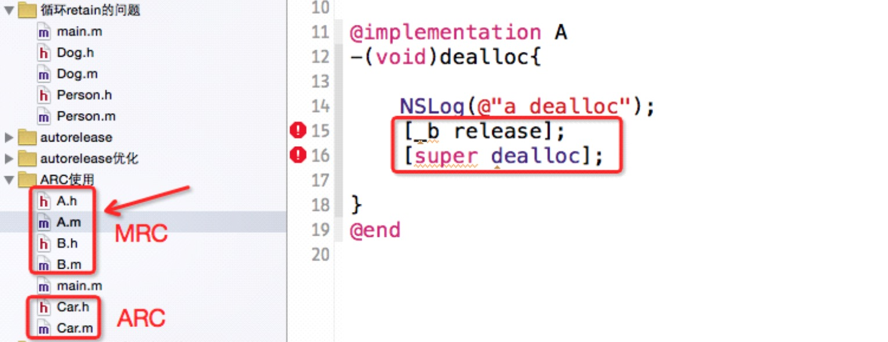
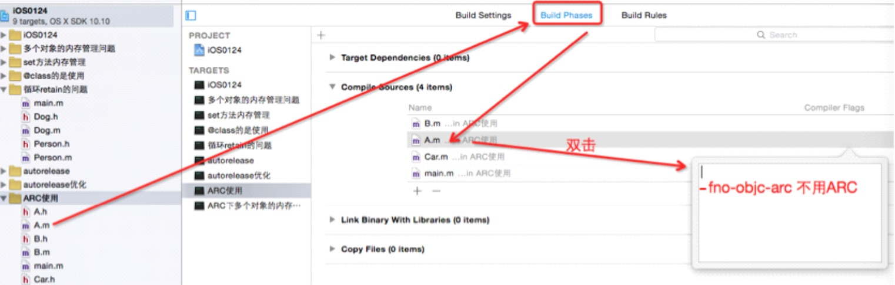
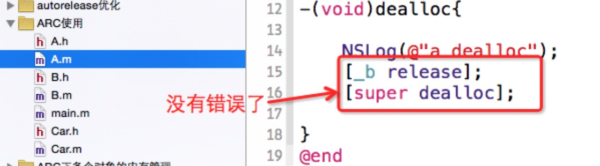
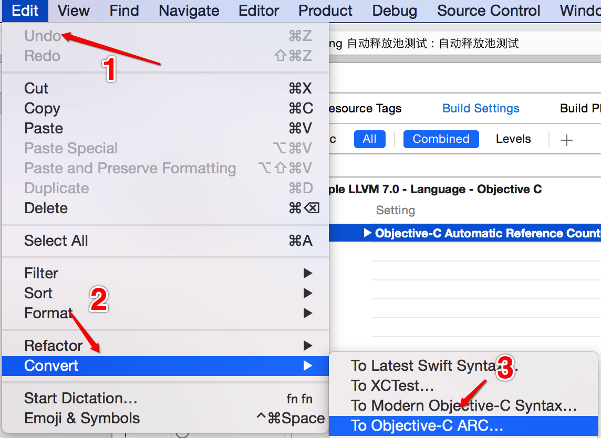
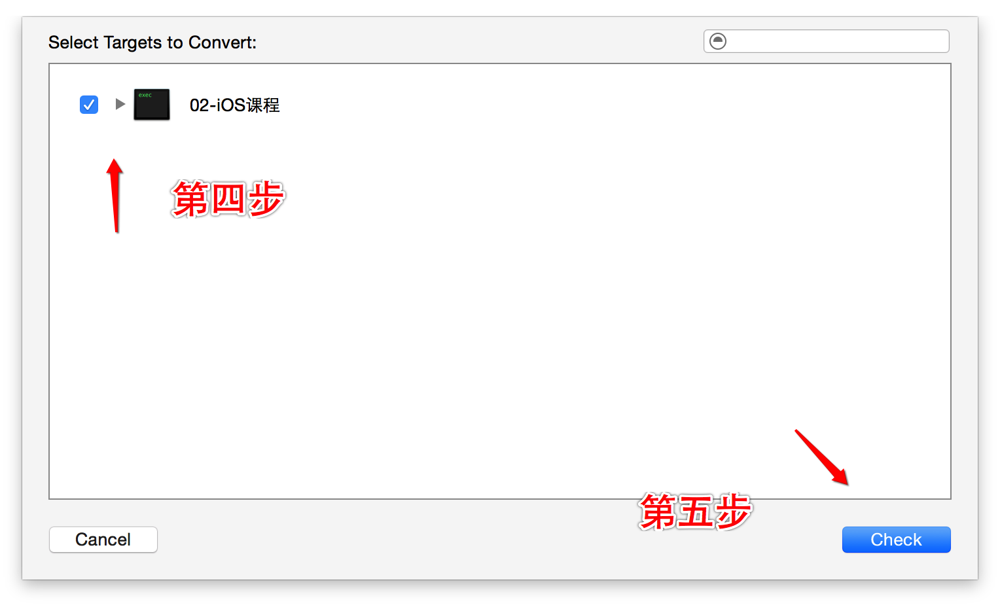
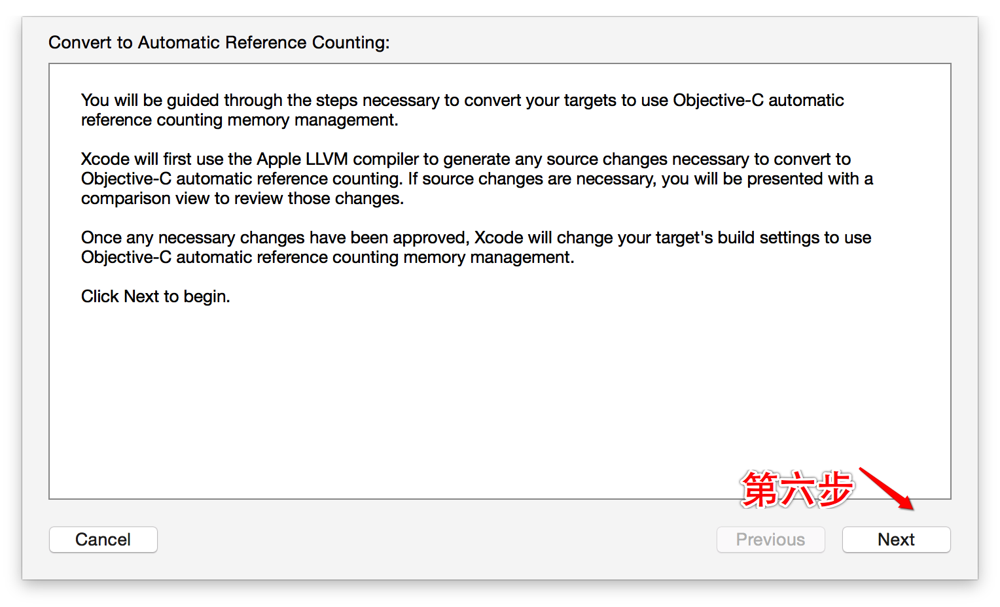
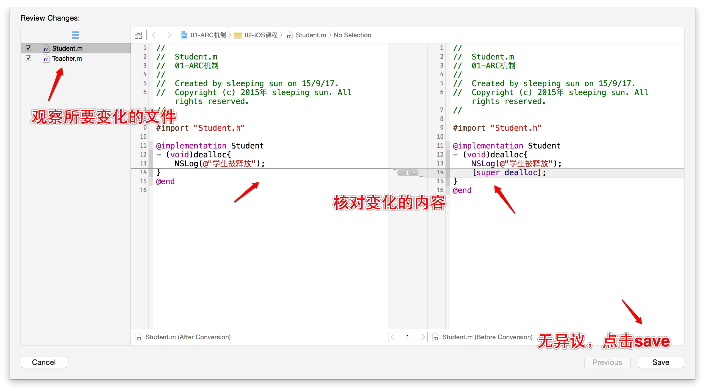
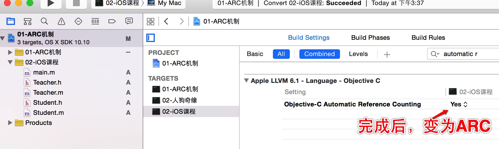

##10、【掌握】ARC的兼容和转换
* 1、ARC模式下如何兼容非ARC的类
 * 让程序兼容ARC和非ARC部分。转变为非ARC -fno-objc-arc

* 2、将MRC转换为ARC
 * ARC也需要考虑循环引用问题：一端用strong，一端用weak。
 * `提示：字符串是特殊的对象，但是不需要使用release手动释放，这种字符串对象默认就是autorelease，不需要额外管理内存。`
 * 如果一个项目是MRC的，那么我们可以把这个项目转换成ARC。

