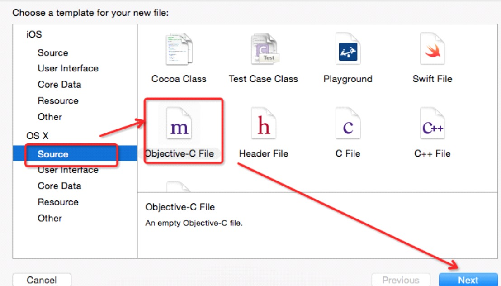
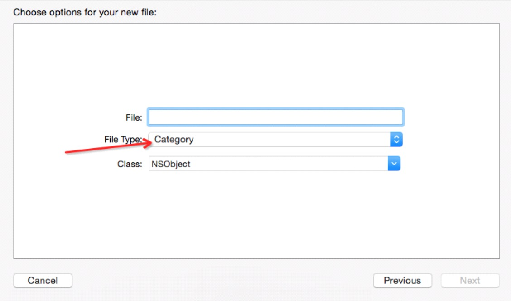

##12、【掌握】分类（Category）声明和实现
###### 1、声明和实现一个分类
* 在.h文件中,声明分类:
```objc
@interface 类名 (分类名)
//方法;
@end
```

##### 注意:
 * 不允许在声明分类的时候定义变量

  ```objc
  @interface Person(sport)
  {
     int _age; // 报错
   }
  - (void)run;
  - (void)jump;

  ```
__在.m文件中,实现分类:__
```objc
@implementation 类名(分类名)
// 方法实现
@end
```

* 也可以通过图形界面生成分类



###### 2、调用分类中的方法
  * 调用分类中的方法与一般方法调用，完全一样（需要导入头文件）

