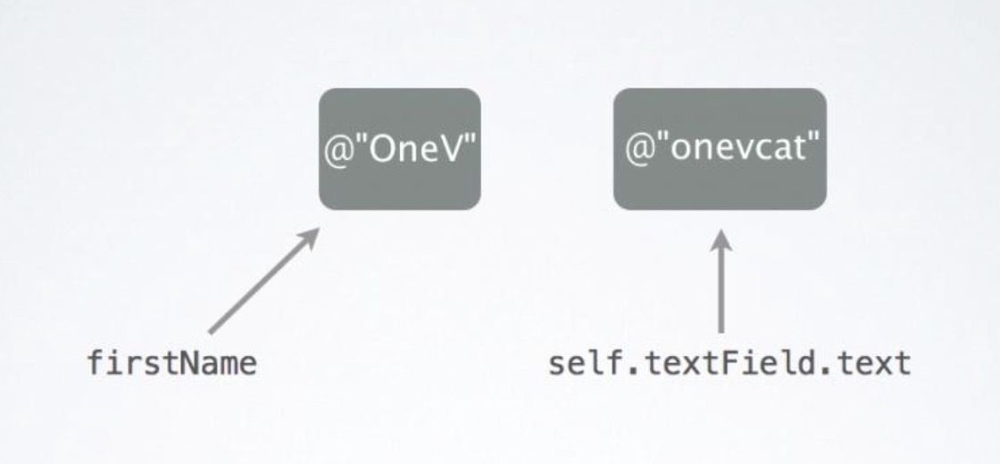
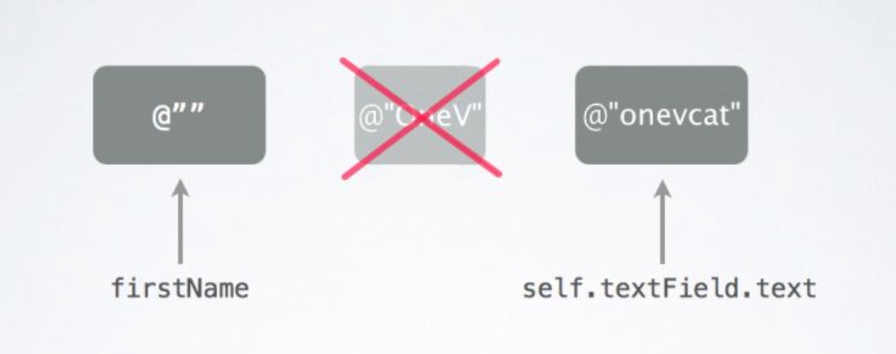
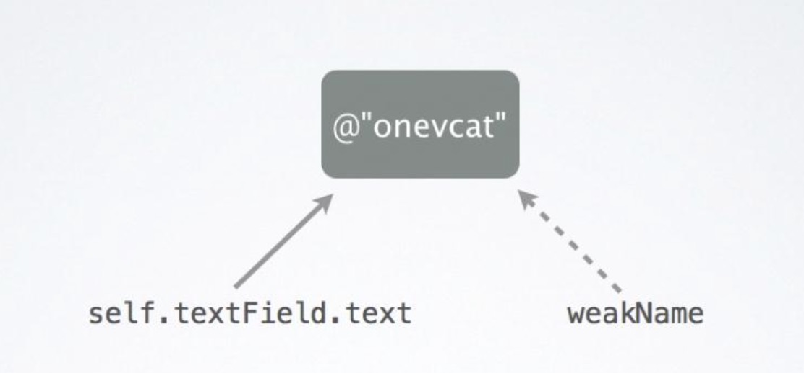
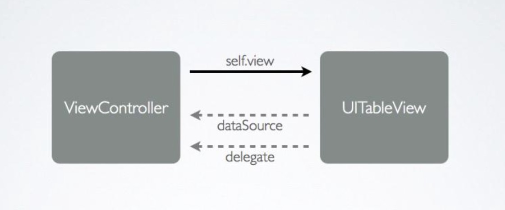

##4、【掌握】ARC概念及原理
####1、什么是ARC？

 * Automatic Reference Counting,自动引用计数,即ARC,可以说是WWDC2011和iOS5所引入的最大的变革和最激动人心的变化。ARC是新的LLVM 3.0编译器的一项特性,使用ARC,可以说一举解决了广大iOS开发者所憎恨的手动内存管理的麻烦。

 * 在工程中使用ARC非常简单:只需要像往常那样编写代码,只不过永远不写retain,release和autorelease三个关键字就好~这是ARC的基本原则。

 * 当ARC开启时,编译器将自动在代码合适的地方插入retain, release和autorelease,而作为开发者,完全不需要担心编译器会做错(除非开发者自己错用ARC了)。

 * 手动管理内存, 可以简称MRC (Manual Reference Counting)
ARC与其他语言的”垃圾回收”机制不同。ARC:编译器特性;“垃圾回收”运行时特性。

#### 2、ARC工作原理及判断准则
 * ARC是Objective-C编译器的特性,而不是运行时特性或者垃圾回收机制,ARC所做的只不过是在代码编译时为你自动在合适的位置插入release或autorelease。
 * 编译器会自动生成内存管理的代码，不需要程序员手动编写。
 ##### ARC的判断准则：
 只要没有强指针指向对象，对象就会被释放。
 `注意：当使用ARC的时候，暂时忘记“引用计数器”，因为判断标准变了。`

#### 3、ARC机制图解
* NSString *firstName = @"oneV";
* 这个时候firstName持有了@"OneV"。

* 当然,一个对象可以拥有不止一个的持有者(这个类似MRC中的retainCount>1的情况)。在这个例子中显然self.textField.text也是@“OneV",那么现在有两个指针指向对象@"OneV”(被持有两次,retainCount=2,其实对NSString对象说retainCount是有问题的,不过anyway~就这个意思而已)。

* 过了一会儿,也许用户在textField里输入了其他的东西,那么self.textField.text指针显然现在指向了别的字符串,比如@“onevcat",但是这时候原来的对象已然是存在的,因为还有一个指针firstName持有它。现在指针的指向关系是这样的:

* 只有当firstName也被设定了新的值,或者是超出了作用范围的空间(比如它是局部变量但是这个方法执行完了或者它是实例变量但是这个实例被销毁了),那么此时firstName也不再持有@“OneV",此时不再有指针指向@"OneV",在ARC下这种状况发生后对象@"OneV"即被销毁,内存释放。

* 类似于firstName和self.textField.text这样的指针使用关键字strong进行标志,它意味着只要该指针指向某个对象,那么这个对象就不会被销毁。反过来说,ARC的一个基本规则即是,只要某个对象被任一strong指针指向,那么它将不会被销毁。如果对象没有被任何strong指针指向,那么就将被销毁。在默认情况下,所有的实例变量和局部变量都是strong类型的。可以说strong类型的指针在行为上和MRC时代retain的property是比较相似的。既然有strong,那肯定有weak，weak类型的指针也可以指向对象,但是并不会持有该对象。比如:__weak NSString *weakName = self.textField.text 得到的指向关系是:

* 这里声明了一个weak的指针weakName,它并不持有@“onevcat"。如果self.textField.text的内容发生改变的话,根据之前􏰀到的"只要某个对象被任一strong指针指向,那么它将不会被销毁。如果对象没有被任何strong指针指向,那么就将被销毁”原则,此时指向@“onevcat"的指针中没 有strong类型的指针,@"onevcat"将被销毁。

* 同时,在ARC机制作用下,所有指向这个对象的weak指针将被置为nil。这个特性相当有用,相信无数的开发者都曾经被指针指向已释放对象所造成的EXC_BAD_ACCESS困扰过,使用ARC以后,不论是strong还是weak类型的指针,都不再会指向一个dealloced的对象,从根源上解决了意外释放导致的崩溃。

* 不过在大部分情况下,weak类型的指针可能并不会很常用。比较常见的用法是在两个对象间存在包含关系时:对象1有一个strong指针指向对象2,并持有它,而对象2中只有一个weak指针指回对象1,从而避免了循环持有。

* 一个常见的例子就是oc中常见的delegate设计模式,viewController中有一个strong指针指向它所负责管理的UITableView,而UITableView中的dataSource和delegate指针都是指向viewController的weak指针。可以说,weak指针的行为和MRC时代的assign有一些相似点,但是考虑到weak指针更聪明些(会自动指向nil),因此还是有所不同的。

