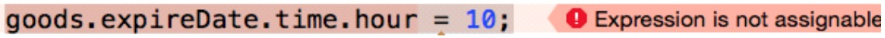

##12、【理解】应用：电商App练习
####电商App类的设计
* 要求:利用OC+面向对象设计下面的三个类:
* 一、商品类-Goods
 * 属性: 商品名称
    * 单价
    * 重量
    * 商品展示图片
    * 生产日期(暂时用结构体表示)produceDate
    * 过期日期 expireDate
* 二、买家类(用户) Buyer
 * 属性:
   * 姓名
   * 性别（枚举）
   * 年龄
   * 身高(单位:cm)
* 三、卖家类 - Seller
 * 属性:
   * 姓名
   * 性别(枚举)
   * 年龄
   * 身高(单位:cm)
   * 所出售商品(假设一个卖家就卖一件商品)
* 四、买家类、卖家类(抽象父类Person)

* 五、在main函数中创建卖家、商品、买家类的对象。

```objc
// 创建一个表示日期时间的结构体
typedef struct
{
  int hour;
  int min;
  int sec;
}Time;

//表示日期
typedef struct{
  int year;
  int month;
  int day;
  Time time;
 }MyDate;


MyDate produceDate = (MyDate){2011, 9, 10, {15, 16, 30}}; //注意,这句话是错误的
```


* 原因是:
 * goods.expireDate----->得到这个成员expireDate的值,是结构体类型
 * expireDate.Time 这是访问结构体变量,time的值
 * goods.expireDate.time 会被误认为是点语法,导致出错

```objc
// 创建一个表示性别的枚举
typedef enum
{
  GenderMale, // 男
  GenderFemale // 女
} Gender;
```
