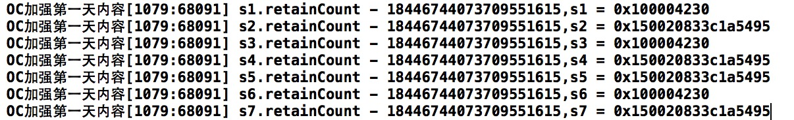
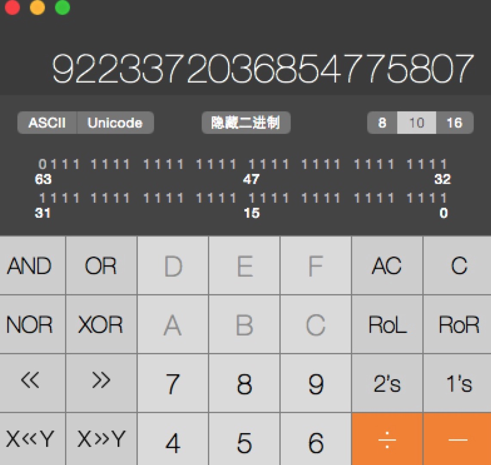
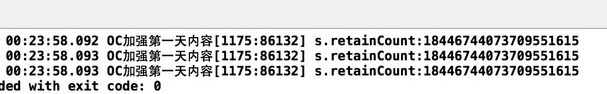

##15、【了解】NSString类的内存管理问题
####1、NSString等Foundation框架提供的类的内存管理
* 先看看以下这几种写法:

```objc
int main(int argc, const char * argv[]) {
    @autoreleasepool {

        NSString *s1 = @"hello iOS";
        NSString *s2 = [NSString stringWithFormat:@"hello iOS"];
        NSString *s3 = [NSString stringWithString:@"hello iOS"];
        NSString *s4 = [NSString stringWithUTF8String:"hello iOS"];

        NSString *s5 = [[NSString alloc] initWithFormat:@"hello iOS"];
        NSString *s6 = [[NSString alloc]initWithString:@"hello iOS"];
        NSString *s7 = [[NSString alloc] initWithUTF8String:"hello iOS"];

        NSLog(@"s1.retainCount - %lu,s1 = %p",s1.retainCount,s1);
        NSLog(@"s2.retainCount - %lu,s2 = %p",s2.retainCount,s2);
        NSLog(@"s3.retainCount - %lu,s3 = %p",s3.retainCount,s3);
        NSLog(@"s4.retainCount - %lu,s4 = %p",s4.retainCount,s4);
        NSLog(@"s5.retainCount - %lu,s5 = %p",s5.retainCount,s5);
        NSLog(@"s6.retainCount - %lu,s6 = %p",s6.retainCount,s6);
        NSLog(@"s7.retainCount - %lu,s7 = %p",s7.retainCount,s7);
    }
    return 0;
}

```
* 结果


* 引用计数
 * 首先可以看到每一个字符串的引用计数非常大，有多大呢？
 * 利用计算器可以得到：
 
 * 可见这个数字非常巨大，是无符号long类型的最大数值。

* 设置引用计数
 * 既然数字那么大，而且对象的创建也不像原来那么规律，那么尝试设置一下字符串的引用计数，得到：

```objc
        NSString *s = @"hello iOS";

        NSLog(@"s.retainCount:%lu",s.retainCount);

        [s retain];
        NSLog(@"s.retainCount:%lu",s.retainCount);

        [s release];
        NSLog(@"s.retainCount:%lu",s.retainCount);

```

* 结果：


* 不需要管理NSString
 * 实际上无论是OC，还是C语言，甚至其他编程语言，字符串都是使用极为频繁的，因此，如果按照原来对象的内存管理的模式进行执行，那么对于频繁的字符串处理就会表现出很低的性能，因此字符串做了一个处理。
 * 字符串一般使用固定的内存，代码中的字符串，只要相同，都是指向同一个内存空间。
 * 使用字符串类创建的字符串，是一个固定的内存，使用格式化创建的字符串是一个固定的内存。
 * 因此得到结论：使用NSString的时候不需要考虑其内存管理问题。


####2、Funny way
* 下面这段代码，显然是没有办法执行成功的！
```objc
while ([a retainCount] > 0)
{
   [a release];
}
```
* 如果运行结果正确,那么这是多么幸运的一个人啊!
