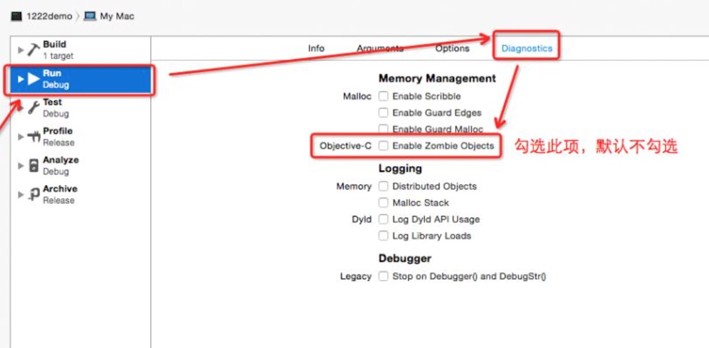
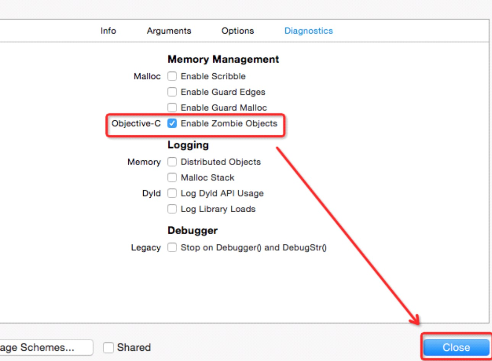
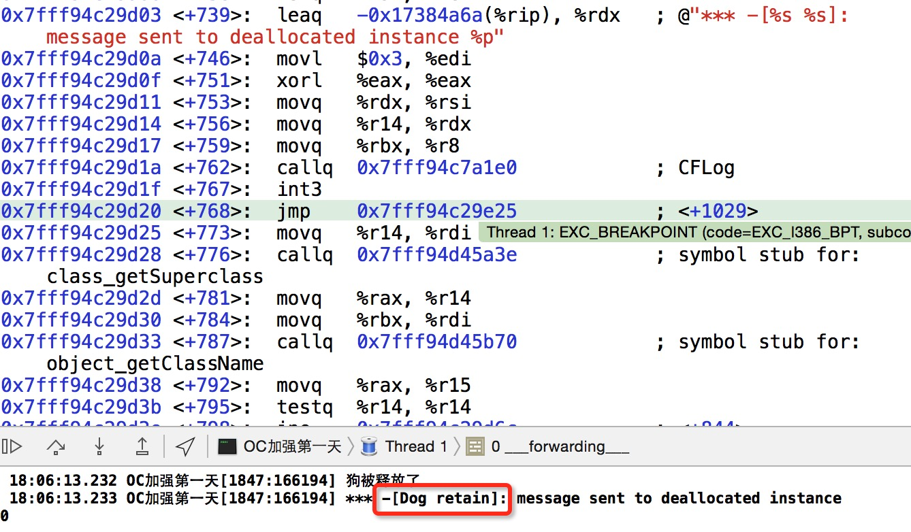
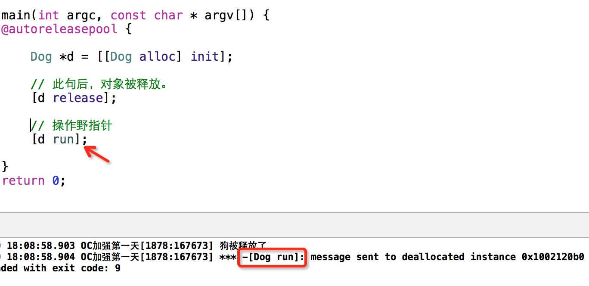

##5.【掌握】单个对象内存管理（野指针）
#### 单个对象的野指针问题
* 思考：对象在堆区的空间已经释放了,还能再使用p吗?

   ```objc
   Person *p = [[Person alloc] init];
   [p release];

   // 因为P已经被释放，此时调用p的run方法，此时会报错。
   // 我们把p叫做野指针，把p指向的对象叫做僵尸对象。
   [p run];
```
* 野指针错误:访问了一块坏的内存(已经被回收的,不可用的内存)。

* 僵尸对象:所占内存已经被回收的对象,僵尸对象不能再被使用。(默认情况下xcode为了提高编码效率,不会时时检查僵尸对象,打开僵尸对象检测方法)


* 打开僵尸对象监测的方法




* 注意:
 * __1> 空指针:没有指向任何东西的指针,给空指针发送消息不会报错.__

 * 关于nil和Nil及NULL的区别:
   * 1.nil: A null pointer to an Objective-C object. ( #define nil ((id)0) )
       * nil 是一个对象值。
       * Person *p = [Person new];
       * p = nil;

   * 2.Nil: A null pointer to an Objective-C class.
       * 如:Class someClass = Nil;给类对象赋值

   * 3.NULL: A null pointer to anything else. ( #define NULL ((void *)0) )
      * NULL是一个通用指针(泛型指针)。

   * 4.NSNull: A class defines a singleton object used to represent null values in collection objects (which don't allow nil values).
     * [NSNull null]: The singleton instance of NSNull。
     * [NSNull null]是一个对象,他用在不能使用nil的场合。

 * __2> 不能使用[p retain]让僵尸对象起死复生。__
  
 * __3> 野指针操作__

