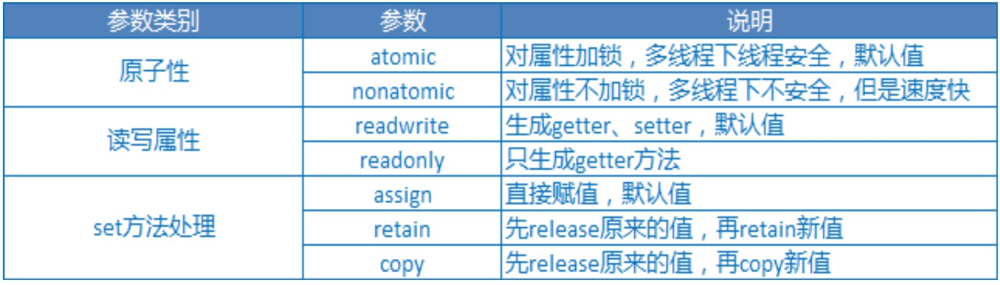

##10、【掌握】@property参数（一）
* @property 4.4前
 * 1) @property + 手动实现
 * 2) @property int age; + @synthesize age;//get和set方法的声明和实现都帮我们做了
 * 3) @property int age + @synthesizes age = _b;

* @property 4.4增强 .h
* @property int age;
 * 1) 生成_age
 * 2) 生成_age的get和set方法的声明
 * 3) 实现_age的get和set方法

####1.@property参数
* 格式:@property (参数1,参数2) 数据类型 方法名


```objc
// 基本数据类型
int _age;

// set方法的写法
-(void)setAge:(int) age
{
_age = age;
}

// 用assign修饰后，仍旧会生成以上标准的set方法
@property (assign) int age;


// oc对象类型
@property (retain) Car *car ;

// 用retain修饰后，生成如下内存管理代码
-(void)setCar:(int) car
{
   if(_car ! = car)
   {
      [_car release];
      _car = [car retain];
  }
}
```

* 1.内存管理相关参数
 * retain ： release旧值，retain新值（用于OC对象）
 * assign ： 直接赋值，不做任何内存管理(默认，用于非OC对象类型)
 * copy   ： release旧值，copy新值（一般用于NSString *）


* 验证assign如果作用在对象上,实际上就是直接赋值

```objc
//使用@property增强型 生成get和set方法
@property(nonatomic,assign)Car *car;

//.m文件中实际上生成的是
- (void)setCar:(Car *)cat
{
   _car = car; //当对象release后,将无法使用该对象
}


// main函数
int main()
{
 Person *p = [Person new];
 Car *c = [Car new];

 // 给人一辆车
 p.car = c;

 // 释放车
 [c release];

 // 让人开车
 [p drive]; //此时p指向了僵尸对象
}
```
* 使用@property增强型 生成get和set方法

```objc
//使用@property增强型 生成get和set方法
@property(nonatomic,retain)Car *car;

//.m文件中实际上生成的是
- (void)setCar:(Car *)cat
{
   if(_car != car)
   {
     [_car release];
     _car = [car retain];
   }
}


// main函数
int main()
{
 Person *p = [Person new];
 Car *c = [Car new];

 // 给人一辆车
 p.car = c;

 // 释放车
 [c release];

 // 让人开车
 [p drive];
}
```
* 此时，会发生内存泄露。
* 解决办法

```objc
- (void)dealloc
{
    NSLog(@"Person -- dealloc");
    [_car release];
    [super dealloc];
}

```


