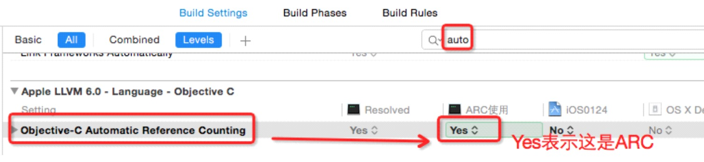
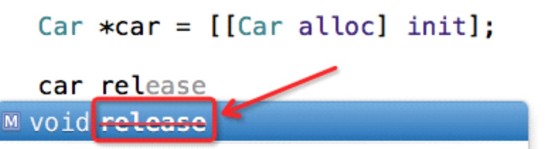
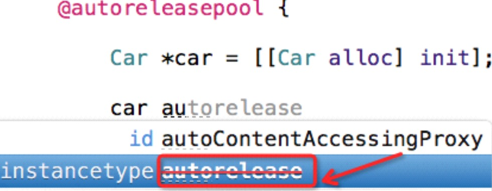
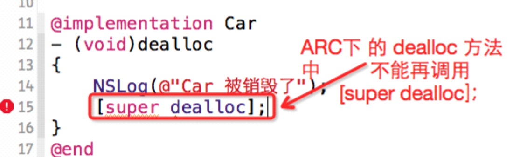

##5、【理解】ARC快速入门
##### 1、ARC机制判断
 * iOS5以后，创建项目默认的都是ARC。


 * ARC机制下有几个明显的标志：
  * 1）不允许使用retain或者release方法


  *2）不允许调用autorelease方法


  * 重写父类的dealloc方法时,不能再调用 [super dealloc];


##### 2、ARC快速使用
```OBJC
int main(){
   Student *s = [[Student alloc] init];
  return 0;
}
```
`只需要写一行代码，编译器会在合适的位置释放学生对象，程序员无需考虑释放问题。`

