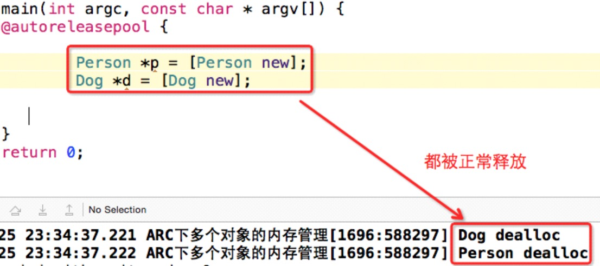
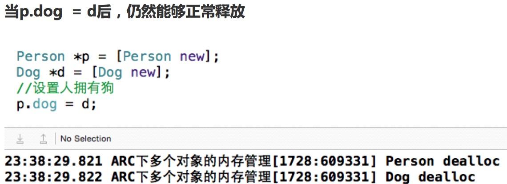
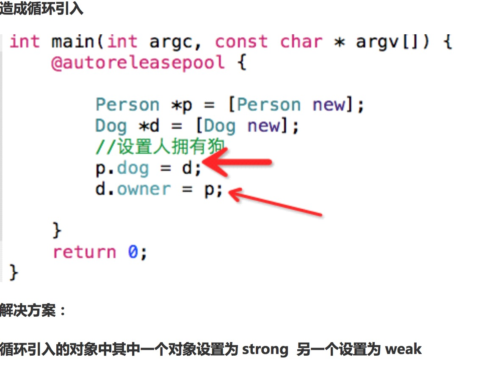

##8、【掌握】ARC下循环引用问题
* 1、ARC下循环引入问题
* 一个人拥有一只狗，一只狗拥有一个主人。



* 当增加d.owner = p;时形成循环引用。

#####解决方法：一端用strong，一端用weak。

* 2、ARC下@property参数

```objc
ARC中的@property
strong : 用于OC对象, 相当于MRC中的retain
weak : 用于OC对象, 相当于MRC中的assign
assign : 用于基本数据类型, 跟MRC中的assign一样
copy : 一般用于NSString, 跟MRC中的copy一样

在ARC情况下解决”循环retain”的问题:@property一边用strong,一边用weak。
```
