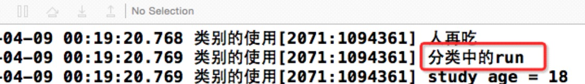

##13、【掌握】分类（Catefory）使用注意事项
##### 1、【了解】分类的使用注意事项
 * 1）分类只能增加方法, 不能增加成员变量
 * 2）可以书写@property,此时只生成get和set方法,不会生成私有变量

 
 
 
 
 * 3)如果分类和原来类出现同名的方法, 优先调用分类中的方法, 原来类中的方法会被屏蔽
 
 

##### 2、【了解】分类的编译的顺序
 * 1）当分类与主类中都有同一个方法时，优先调用分类中的方法。
 * 2）当多个分类中都有同样的一个方法时，优先调用最后一个参与编译的分类中的方法。

