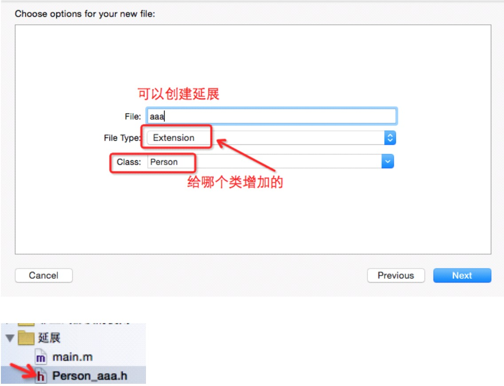

##15、【掌握】分类（Catefory）延展
##### 1、类的延展的概念
 * 延展类别又称为扩展(Extendsion)
 * Extension是Category的一个特例
 * 其名字为匿名(为空),并且新添加的方法一定要予以实现。(Category没有这个限制)

```objc
@interface MyClass ()
{
   //类扩展 float value;
}
- (void)setValue:(float)newValue;
@end
```
 * 这种写法的类别叫`匿名分类`,又叫`类扩展`,所谓的扩展,其实就是为一个类添加额外的原来没有的变量、方法或者合成属性。

#####2、类扩展的作用：
 * 为本类扩充一些私有的成员变量和私有方法。

##### 3、延展的实现
 * 1）通过延展来实现方法的私有,延展的头文件独立。这种方法不能实现真正的方法私有,当在别的文件中引入延展的头文件,那么在这个文件中定义的类的对象就可以直接调用在延展中定义所谓私有的方法.


* 通过界面创建延展:


* 2）第二种实现延展的方式是延展没有独立的头文件,在类的实现文件.m中声明和实现延展,这种方法可以很好的实现方法的私有,因为在OC中是不能引入.m的文件的。

```objc
 .m文件
@interface SceneManager ()
+ (void) wrap;
@end

@implementation SceneManager
+ (void) wrap {
NSLog(@"method of wrap"); }
@end
调用
[SceneManager wrap];
```

##### 分类和类扩展的区别：
* 1、类别中只能增加方法;
* 2、是的,你没看错,类扩展不仅可以增加方法,还可以增加实例变量(或者合成属性),只是该`实例变量默认是私有类型的`(作用范围只能在自身类,而不是子类或其他地方);
* 3、类扩展中声明的方法没被实现,编译器会报警,但是类别中的方法没被实现编译器是不会有任何警告的。这是因为类扩展是在编译阶段被添加到类中,而类别是在运行时添加到类中。
* 4、类扩展不能像类别那样拥有独立的实现部分(@implementation部分),也就是说,类扩展所声明的方法必须依托对应类的实现部分来实现。
* 5、定义在 .m 文件中的类扩展方法为私有的,定义在 .h 文件(头文件)中的类扩展方法为公有 的。类扩展是在 .m 文件中声明私有方法的非常好的方式。
