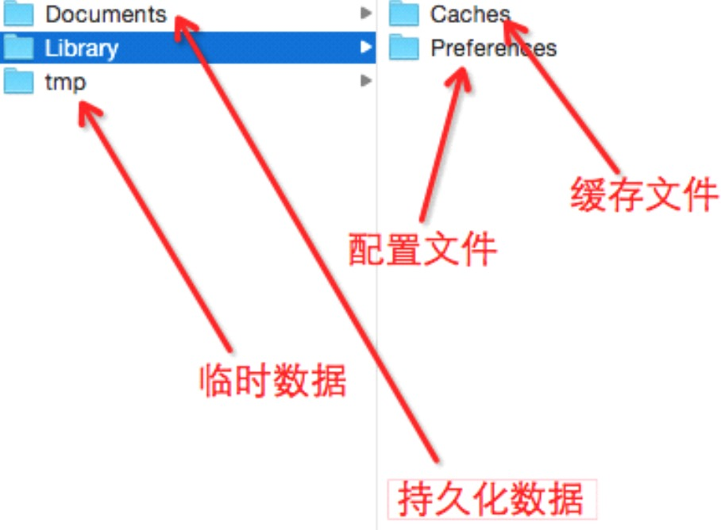

##5、【了解】iOS沙盒（sanbox）机制
* __iOS存储概述__：iOS的沙盒机制，应用只能访问自己应用目录下的文件。iOS不像android，没有SD卡概念，不能直接访问图像、视频等内容。iOS应用产生的内容，如图像、文件、缓存内容等都必须存储在自己的沙盒内。
* 默认情况下，每个沙盒含有3个文件夹：Documents, Library 和 tmp。Library包含Caches、Preferences目录。

* __沙盒路径__：用户->资源库->Application Support->iPhone Simulator->7.1->Aplications

 * __Documents__：苹果建议将程序创建产生的文件以及应用浏览产生的文件数据保存在该目录下，iTunes备份和恢复的时候会包括此目录。

 * __Library__：存储程序的默认设置或其它状态信息；

 * __Library/Caches__：存放缓存文件，保存应用的持久化数据，用于应用升级或者应用关闭后的数据保存，不会被itunes同步，所以为了减少同步的时间，可以考虑将一些比较大的文件而又不需要备份的文件放到这个目录下。

 * __tmp__：提供一个即时创建临时文件的地方，但不需要持久化，在应用关闭后，该目录下的数据将删除，也可能系统在程序不运行的时候清除。

