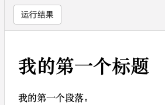
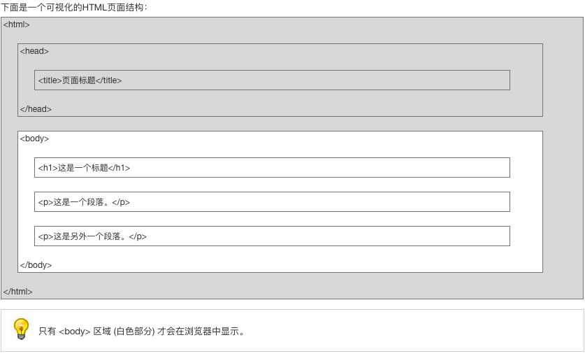

```html
<!DOCTYPE html>//声明为 HTML5 文档 不区分大小写
<html>//元素是 HTML 页面的根元素
<head>// 元素包含了文档的元（meta）数据，如 <meta charset="utf-8"> 定义网页编码格式为 utf-8
<meta charset="utf-8">
<title>菜鸟教程(runoob.com)</title>//元素描述了文档的标题
</head>
<body>//元素包含了可见的页面内容
 
<h1>我的第一个标题</h1>//元素定义一个大标题
 
<p>我的第一个段落。</p>//元素定义一个段落
 
</body>
</html>
```



##### HTML标签 和 HTML 元素 （同样的意思）

HTML 标记标签通常被称为 HTML 标签 (HTML tag)。

- HTML 标签是由*尖括号*包围的关键词，比如 <html>
- HTML 标签通常是*成对出现*的，比如 <b> 和 </b>
- 标签对中的第一个标签是*开始标签*，第二个标签是*结束标签*
- 开始和结束标签也被称为*开放标签*和*闭合标签*

##### HTML  网页结构



##### HTML标签列表

| 标签         | 描述                         | 备注                      |
| ------------ | ---------------------------- | ------------------------- |
| **基础**     |                              |                           |
| <!DOCTYPE>   | 定义文档类型                 |                           |
| <html>       | 定义一个 html 文档           |                           |
| <title>      | 标题                         |                           |
| <body>       | 主体 显示出来的部分          |                           |
| <h1> to <h6> | 标题 （显示）                |                           |
| <p>          | 段落                         |                           |
| <br>         | 换行                         |                           |
| <hr>         | 水平线                       |                           |
| <!--…-->     | 注释                         |                           |
| **格式**     |                              |                           |
| <acronym>    | 只取首字母的缩写             | HTML5 不支持              |
| <abbr>       | 缩写                         |                           |
| <address>    | 文档作者的联系信息           |                           |
| <b>          | 粗体                         |                           |
| <bdi>        | 一段脱离父元素文本方向的文本 | HTML5 新加                |
| <bdo>        | 定义文本方向                 |                           |
| <big>        | 大号文本                     | HTML5 不支持              |
| <blockquote> | 块引用                       |                           |
| <center>     | 定义居中文本                 | HTML5不支持 Html4.01 废弃 |
| <cite>       | 引用（citation）             |                           |
| <code>       | 代码文本                     |                           |
| <del>        | 被删除文本                   |                           |
| <dfn>        | 定义项目                     |                           |
| <em>         | 强调文本                     |                           |
| <font>       | 定义文体的字体、颜色和尺寸   | HTML5不支持 Html4.01 废弃 |
| <i>          | 斜体                         |                           |
| <ins>        | 插入                         |                           |
| <kbd>        | 键盘文本                     |                           |
| <mark>       |                              |                           |
| <meter>      |                              |                           |
| <pre>        |                              |                           |
| <progress>   |                              |                           |
| <q>          |                              |                           |
| <rp>         |                              |                           |
| <rt>         |                              |                           |
| <ruby>       |                              |                           |
| <s>          |                              |                           |
| <samp>       |                              |                           |
| <small>      |                              |                           |
| <strike>     |                              |                           |
| <strong>     |                              |                           |
| <sub>        |                              |                           |
| <sup>        |                              |                           |
| <time>       |                              |                           |
| <tt>         |                              |                           |
| <u>          |                              |                           |
| <var>        |                              |                           |
| <wbr>        |                              |                           |
|              |                              |                           |
|              |                              |                           |
|              |                              |                           |

