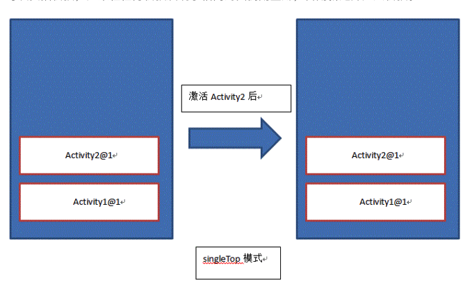

by zxb 

[TOC]

------

# 计算机网络

### HTTP协议

- HTTP 是构建在 TCP/IP 协议之上的，默认端口是80
- HTTP 是无连接状态的

#### HTTP报文

##### 请求报文

HTTP 协议是以 ASCII 码传输，建立在 TCP/IP协议之上的应用层规范。规范把 HTTP 请求分为三个部分：状态行、请求头、消息主体。如：

```Xml
<method> <request-URL> <version>
<headers>

<entity-body>
```

HTTP 定义了与服务器交互的不同方法，最基本的方法有：GET 、 POST、PUT、DELETE。

URL 的全称是 资源描述符，我们可以这样的认为，一个 URL 地址，用于描述一个网络上的资源，而 HTTP 中的 GET、POST、PUT、DELETE 对应着对这个资源的查、增、改、删 四个操作 <u>对此有怀疑</u>

**1.GET 用于获取信息，而且应该是安全的和幂等的。**

安全是指，这个操作只能够获取信息而非修改。

幂等的意味着对同一个 URL 的多个请求应该返回同样的结果

报文示例：

```http
GET /books/?sex=man&name=Professional HTTP/1.1
 Host: www.example.com
 User-Agent: Mozilla/5.0 (Windows; U; Windows NT 5.1; en-US; rv:1.7.6)
 Gecko/20050225 Firefox/1.0.1
 Connection: Keep-Alive
```

**2.POST 表示可能修改服务器上的资源**

```http
 POST / HTTP/1.1
 Host: www.example.com
 User-Agent: Mozilla/5.0 (Windows; U; Windows NT 5.1; en-US; rv:1.7.6)
 Gecko/20050225 Firefox/1.0.1
 Content-Type: application/x-www-form-urlencoded
 Content-Length: 40
 Connection: Keep-Alive

 sex=man&name=Professional  			
```

**3.注意**

- GET 所提交的数据量受到 URL 长度的限制， HTTP 协议的规范没有对 URL 长度进行限制。这个限制来自于浏览器和服务器
- 理论上 POST 没有大小的限制，HTTP 协议规范也没有大小的限制，处于安全考虑，服务器软件会做一些实时的限制
- 参考上面的报文示例，可以发现 GET 和 POST 数据的内容是一模一样的，只是位置不同，一个在 URL 里面，一个在 HTTP 包的包体里。

##### POST 提交数据的方式

HTTP 协议中规定 POST 提交的数据必须在 body 部分中，但是协议中没有规定数据使用哪一种编码方式或者数据的格式。实际上，开发者完全可以自己决定消息主体的格式，只要最后发送的 HTTP 请求满足上面的格式就可以。

但是少数据发送出去，还要服务端解析成功才有意义。一般服务端语言如：PHP 、 Python等，以及他们的 framework，都内置了自动解析常见数据格式的功能。服务端常常是根据请求头（headers) 中的 Content-type 字段来获知请求中的消息主体是用的何种方式编码，再对方主体进行解析。所以说到 POST 提交数据的方案，包含了Content-Type 和消息编码方式 两部分。

- application/x-www-form-urlencoded

这是最常见的 POST 数据提交方式。浏览器的原生 <form> 表单，如果不设置 enctype 属性，那么最终就会以 application/x-www-form-urlencoded 方式提交数据。上个小节当中的例子便是使用了这样的方式提交数据。可以看到 body 当中的内容和 GET 请求的完全相同。

- mutipart/form-data

这又是一个常见的 POST 数据的提交方式。我们用表单上传文件时，必须让 <form> 表单的enctype 等于 multipart/form-data 。 直接来看一个示例：

```http
POST http://www.example.com HTTP/1.1
Content-Type:multipart/form-data; boundary=----WebKitFormBoundaryrGKCBY7qhFd3TrwA

------WebKitFormBoundaryrGKCBY7qhFd3TrwA
Content-Disposition: form-data; name="text"

title
------WebKitFormBoundaryrGKCBY7qhFd3TrwA
Content-Disposition: form-data; name="file"; filename="chrome.png"
Content-Type: image/png

PNG ... content of chrome.png ...
------WebKitFormBoundaryrGKCBY7qhFd3TrwA--
```

这个例子有点复杂，首先生成了一个 boundary 用于分割不同的字段，为了避免与正文内容重复， boundary 很长很复杂。然后 Content-Type 里面指明了数据是以 multipart/form-data 来编码，本次请求的 boundary 是什么内容。消息主体里面按照字段个数又分为多个结构类似的部分，每部分都以 —boundary 开始，紧接着是内容描述信息，然后是回车，最后是字段的具体内容（文本或二进制）。如果传输的是文件，还要包含文件名和文件类型信息。消息主体最后以 —boundary— 标示结束。

这种方式一般用来上传文件，各大服务端语言对它有着良好的支持。

上面提到的这两种 POST 数据的方式，都是浏览器原生支持的，而且现阶段标准中，原生 <form> 表单也只支持这两种方式 （通过 <form> 元素的 enctype 属性指定，默认为application/x-www-form-urlencoded。 其实 enctype 还支持 text/plain，不过用得非常少）。

随着越来越多的 web 站点，尤其是 webApp ，全部使用 Ajax 进行数据交互以后，我们完全可以定义新的数据提交方式。，例如 application/json ， text/xml ，乃至 application/x-protobuf 这种二进制格式，只要服务器可以根据 Content-type 和 Conten-Encoding 正确的解析出请求，都是没有问题的。

##### 响应报文

HTTP 的响应与 HTTP 的请求相似，HTTP 响应也由三个部分构成：

- 状态行
- 响应头（response header）
- 响应正文

状态行由协议版本、数字形式的状态代码、及相应的状态描述，个元素之间以空格分隔。

常见的状态码：

- 200 OK 客户端请求成功
- 301 Moved Permanently 请求永久重定向
- 302 Moved Temporarily 请求临时重定向
- 304 Not Modified 文件未修改，可以直接使用缓存文件
- 400 Bad Request 由于客户端请求有语法的错误，不能被服务器所理解
- 401 Unauthorized 请求未经授权，这个状态码必须和 WWW-Authentuvate 报头域一起使用
- 403 Forbidden 服务器收到请求，但是拒绝提供服务。服务器通常会在正文中给出不提供服务的原因
- 404 Not Found 请求的资源不存在，例如：输入了错误的URl
- 500 Internal Server Error 服务器发生不可预期的错误，导致无法完成客户端的请求
- 503 Service Unavailable 服务器当前不能够处理客户端的请求，在一段时间以后，服务器可以恢复正常。

下面是一个 HTTP 响应的例子：

```http
HTTP/1.1 200 OK

Server:Apache Tomcat/5.0.12
Date:Mon,6Oct2003 13:23:42 GMT
Content-Length:112

<html>...
```

#### 条件 GET

HTTP 条件 GET 是 HTTP 协议为了减少不必要的带宽浪费，提出的一种方案。

1.HTTP 条件 GET 使用的时机？

客户端之前已经坊问过某网站，并打算再次访问

2.HTTP 条件 GET 的使用方法？

客户端向服务器发送一个包询问是否在上一次访问网站的时间后更改了页面，如果服务器没有更新，显然不需要把整个网页传给客户端，客户端只要使用本地缓存即可，如果服务器对照客户端给出的时间已经更新了客户端请求的页面，则发送这个更新了的页面给用户。

下面是一个具体的发送接收报文的示例：

客户端请求：

```http
GET / HTTP/1.1
Host: www.sina.com.cn:80
If-Modified-Since:Thu, 4 Feb 2010 20:39:13 GMT
Connection: Close 
```

第一次请求时，服务器段返回请求数据，之后的请求，服务器根据请求中的 If-Modified-Since 字段判断响应文件没有更新，如果未更新，服务器返回一个 304 Not Modified 响应，告诉浏览器请求的资源在服务器上没有更新，可以使用缓存文件。

```http
 HTTP/1.0 304 Not Modified  
 Date: Thu, 04 Feb 2010 12:38:41 GMT  
 Content-Type: text/html  
 Expires: Thu, 04 Feb 2010 12:39:41 GMT  
 Last-Modified: Thu, 04 Feb 2010 12:29:04 GMT  
 Age: 28  
 X-Cache: HIT from sy32-21.sina.com.cn  
 Connection: close 
```

如果服务端的资源已经更新的话，就正常的返回响应。

#### 持久连接

我们知道 HTTP 协议采用“请求-应答”模式，当使用普通模式，即非 Keep-Alive模式时，每个请求/应答客户和服务器都要新建一个连接，完成之后立即断开连接（HTTP 协议为无连接的协议）；当使用 Keep-Alive 模式（又称持久连接，连接重用）时，Keep-Alive 功能是客户端到服务器的连接持续有效，当出现对服务器的后续请求时，Keep-Alive 功能避免了建立或重新建立连接

在 HTTP 1.0 版本中，并没有官方的标准来规定 Keep-Alive 如何工作，因此它是被附加到 HTTP 1.0 协议上的，如果客户端浏览器支持 Keep-Alive ，那么就在 HTTP 请求头中 添加一个字段 Connection：Keep-Alive ，当服务器收到附有 Connection：Keep-Alive 的请求的时，它也会在响应中添加一个同样的字段来使用 Keep-Alive 。这样一来，客户端和服务端的 HTTP 连接就会被保持，不会断开（超过 Keep-Alive 规定的时间或者意外），当客户端发送另一个请求时，就会使用这条已经建立的连接。

在 HTTP 1.1 版本中，默认情况下所有连接都被保持，如果加入“Connection：Close”才关闭。目前大部分的浏览器都是用 HTTP 1.1 协议，也就是说默认会发起 Keep-Alive 的连接请求了，所以是否能完成一个完成的 Keep-Alive 连接就看服务器的设置情况

由于 HTTP 1.0 没有官方的 Keep-Alive 规范，并且也已经基本被淘汰，以下讨论均是针对 HTTP 1.1 标准中的 Keep-Alive 展开的。

注意：

- HTTP Keep-Alive 简单说就是保持当前的 TCP 链接，避免重新建立连接
- HTTP 长连接不可能一直保持，例如 Keep-Alive：timeout = 5，max = 100，表示这个TCP 通道可以保持5s，这个长连接最多接收 100 次请求就断开
- HTTP 是一个无状态协议，这意味每个请求都是独立的， Keep-Alive 没能改变这个结果。另外，Keep-Alive也不能保证客户端和服务器之间的连接一定是活跃的，在 HTTP1.1 版本中也如此。唯一能保证的就是当连接被关闭时你能得到一个通知，所以不应该让程序依赖于 Keep-Alive 的保持连接特性，否则会有意想不到的后果。
- 使用长连接之后，客户端、服务端怎么知道本次传输结束呢？两部分：1. 判断传输数据是否达到了Content-Length 指示的大小；2. 动态生成的文件没有 Content-Length ，它是分块传输（chunked），这时候就要根据 chunked 编码来判断，chunked 编码的数据在最后有一个空 chunked 块，表明本次传输数据结束，详见[这里](http://www.cnblogs.com/skynet/archive/2010/12/11/1903347.html)。什么是 chunked 分块传输呢？下面我们就来介绍一下。


#### Transfer-Encoding

Transfer-Encoding 是一个用来标示 Http 报文传输格式的头部值。尽管这个取值理论上可以有很多，但是当前的 HTTP 规范里实际只定义了一种传输取值—chunked。

如果一个 HTTP 消息（请求消息或应答消息）的 Transfer—Encoding 消息头的值为 chunked ，那么，消息体由数量未定的快组成，并以最后一个大小为0的块为结束。

每一个非空的块都以该块包含数据的字节数，（字节数以十六进制表示）开始，跟随一个 CRLF （回车及换行），然后是数据本身，最后块 CRLF结束。在一些现实中，块大小和 CRLF 之间填充有白空格（0×20）。

最后一块是单行，由块大小（0），一些可选的填充白空格，以及 CRLF 。最后一块不再包含任何数据，但是可以发送可选的尾部，包括消息头字段。消息最后以 CRLF 结尾。

一个响应示例如下：

```http
HTTP/1.1 200 OK
Content-Type: text/plain
Transfer-Encoding: chunked

25
This is the data in the first chunk

1A
and this is the second one
0
```

注意：

- chunked 和 multipart 两个名词在意义上有类似的地方，不过在 HTTP 协议当中这两个概念则不是一个类别的。 multipart 是一种 Content-Type，标示 HTTP 报文内容的类型，而 chunked 是一种传输格式，标示报头将以何种方式进行传输。
- chunked 传输不能事先知道内容的长度，只能靠最后的空 chunked 块来判断，因此对于下载请求来说，是没有实现进度的。在浏览器和下载工具中，偶尔我们也会看到有些文件是看不到下载进度的，即采用 chunked 方式进行下载。
- chunked 的优势在于，服务端可以边生成内容边发送，无需实现生成全部内容。HTTP/2 不支持 Transfer-Encoding:chunked ，因为 HTTP/2 有自己的 streaming 传输方式。

#### HTTP Pipelining（HTTP 管线化）

默认情况下 HTTP 协议中每个传输层连接只能承载一个 HTTP 请求和响应，浏览器会在收到一个请求的响应之后，再发送下一个请求。在使用持久连接的情况下，某个连接上消息的传递类似于请求1 -> 响应1 -> 请求2 -> 响应2 -> 请求3 -> 响应3

HTTP-Pipelining 是将多个 HTTP 请求整批提交的技术，在传送的过程中不需要等待服务器的回应。使用 HTTP-Pipelining 技术之后，某个连接上的消息变成了类似这样 请求1-> 请求2-> 请求3-> 响应1-> 响应2-> 响应3

注意下面几点：

- 管线化机制 通过持久连接（persistentconnection）完成，仅 HTTP/1.1 支持此技术（http/1.0 不支持）
- 只有 GET 和 HEAD 请求可以进行管线化，而 POST 则有所限制
- 初次创建连接时不应该启动管线机制，因为服务器 不一定支持 http/1.1 协议
- 管线化不会影响响应到来的顺序，如上面的例子所示，响应返回的顺序未改变
- http/1.1 要求服务端支持管线化，但并不要求服务端也响应进行管线化处理，只是要求对管线化的请求不失败就好
- 由于上面提到的服务器短的问题，开启管线化很可能并不会带来大幅度的性能提升，而很多服务器和代理程序对管线化的支持并不好，因此现代浏览器如 Chrome 和 Firefox 默认并未开启管线化的支持

#### 会话跟踪

1.什么是会话？

客户端打开与服务器的连接发出请求到服务器响应客户端请求的全过程称之为会话。

2.什么是会话跟踪？

指对同一个用户对服务器的连接的请求和响应的监视

3.为什么需要会话跟踪？

浏览器与服务器之间的通信是通过 HTTP 协议进行通信的，而 HTTP 协议是“无状态”的协议，他不能保存客户的信息，即一次响应完成之后断开连接，下一次请求需要重新连接的时候，就需要判断是否是同一个用户，所以才会有会话跟踪技术实现这种需求。

1.会话跟踪的常用方法：

**i.URL重写**

URL（统一资源定位符）是 WEB 上特定页面的地址， URL 重写的技术就是在 URL 结尾添加一个附加的数据以标示该会话，把会话 ID 通过 URL 的信息传递过去，以便在服务器端进行识别不同的用户。

**ii.隐藏表单域**

将会话 ID 添加到 HTML 表单元素中提交到服务器，此表单元素并不在客户端显示

**iii.Cookie**

Cookie 是 Web 服务器发送给客户的一小段信息，客户端请求时可以读取该信息发送到服务器端，进行用户的额识别。对于客户端的每次请求，服务器都会将Cookie 发送到客户端，在客户端可以进行保存，以便下次使用

客户端可以采取两种方式来保存这个 Cookie 对象，一种方式是保存在客户端的内存中，称为临时的 Cookie ，浏览器关闭后这个 Cookie 对象将消失。另外一种是保存在客户机的磁盘上，称为永久的 Cookie。以后客户端只要访问该网站，就会将这个 Cookie 再次发送到服务器上，前提是这个 Cookie在有效期内，这样就实现了对客户的跟踪。

 Cookie 是可以禁止的。

**iv.Session**

每个用户都有一个不同的 Session ，各个用户之间是不能共享的，在 Session 中可以存放信息

在服务器创建一个 Session 对象，产生一个 SessionID 来标示这个 Session 对象，然后将这个 SessionID 放入到 Cookie 发送到客户端，下一次访问时， SessionID 会发送到服务器，在服务器端识别不同的用户。

Session 的实现依赖于 Cookie ，如果 Cookie 被禁用 Session 也会失效。

#### 跨站攻击

##### CSRF（Cross-site request  forgery，跨站请求伪造）

****顾名思义。是伪造请求，冒充用户在站内的正常操作。

例如：一论坛网站发帖是通过 GET 请求访问，点击发帖之后 JS 把发帖的内容拼接成目标 URL 并访问：

```url
http://example.com/bbs/create_post.php?title=标题&content=内容
```

那么，我们只需要在论坛中发一个帖子，包含一个链接：

```
 http://example.com/bbs/create_post.php?title=我是脑残&content=哈哈
```

只要有用户点击了这个链接，那么他的账户就会在不知情的情况下发布了这一个帖子，可能这只是一个恶作剧，但是既然发帖的请求可以伪造，那么删帖、转账、改密码、发邮件全都可以伪造。

如何防范 CSRF 攻击？ 可以注意一下几点：

1.关键操作只接受 POST 请求

2.验证码

CSRF 攻击的过程，往往是用户不知情的情况下构造网络请求。所以如果使用验证码，那么每次操作都需要与用户进行互动，从而简单有效的防御了 CSRF 攻击。

但是如果你每次在一个网址做出任何举动都需要输入验证码的的话严重影响用户体验，所以验证码只出现在特殊的操作里面，或者在注册的时候使用

3.检测  Referer

常见的互联网页面与页面之间是存在联系的，比如你在 www.baidu.com 应该是找不到通往 www.google.cn 的连接的，再比如你在论坛留言，那么不管你留言后重定向到哪里去了，之前的那个网址一定会包含留言的输入框，这个之前的网址就会保留在新页面头文件的 Referer 中

通过检查 Referer 的值，我们就可以判断这个请求是合法的还是非法的。凡事问题出在服务器不是任何时候都能接收到 Referer 的值，所以 Referer Check 一般是用来监控 CSRF 攻击的发生，而不是用来抵御攻击

4.Token

目前主流的做法是适用 Token 抵御 CSRF  攻击，下面通过分析 CSRF 攻击来理解为什么 Token 能够有效

CSRF 攻击要成功的条件在于攻击者能够预测所有的参数从而构造出合法的请求。所以根据不可预测性原则，我们可以对参数进行加密从而防止 CSRF 攻击。

另一个通用的方法是保持原有的参数不变，另外添加一个 Token 值，是随机的值。这样攻击者因为不知道 Token 而无法构造出合法的请求进行攻击

Token 的使用原则：

i.Token 要足够的随机 —— 只有这样才算是不可预测

ii.Token 是一次性的，即每次请求成功后要更新 Token —— 这样可以增加攻击的难度，增加预测的难度

iii.Token 要注意保密性----敏感操作使用 POST 防止 Token 出现在 URL 中

注意：过滤用户输入的内容不能阻挡 CSRF 我们需要做的是过滤请求的来源

##### XSS（Cross Site Scripting，跨站脚本攻击）

是注入攻击的一种，其特点是不对服务器造成任何伤害，而是通过一些正常的站内交互途径，例如发布评论，提交含有 JavaScript 的内容文本。这时服务器如果没有过滤或者转义这些脚本，作为内容发布到了页面上，其他用户访问的时候就会运行这些脚本

运行预期之外的脚本带来的后果有很多种，可能只是简单的恶作剧，一个关不掉的窗口：

```javascript
while(true){
  alert("你关不掉我！");
}
```

也可以是盗号或者其他的未授权的操作

XSS 是实现 CSRF 的诸多途径中的一条，一般习惯把通过 XSS 来实现的 CSRF 称为 XSRF

如何防御 XSS 攻击？

理论上，所有的可输入的地方么有对输入数据进行处理的话，都会存在 XSS 漏洞，其危害取决于攻击代码的威力，攻击代码也不局限于 script 。防御 XSS 攻击最简单直接的方法，就是过滤用户的输入

如果不需要用户输入 HTML ， 可以直接对用户的输入进行 HTML escape 比如下面的脚本

```javascript
  <script>window.location.href=”http://www.baidu.com”;</script>

```

经过 escape 之后

```javascript
  &lt;script&gt;window.location.href=&quot;http://www.baidu.com&quot;&lt;/script&gt;
```

他现在会像普通的文本一样的显示出来，变得无害，不能执行了

当我们需要用户输入 HTML 的时候，需要用户输入的内容做更加小心细致的处理。仅仅是粗暴的去掉 script 标签是没有用的，任何一个合法的 HTML 标签都可以添加 onclick 一类的事件属性来执行 JavaScript 。更好的方法可能是，将用户的输入使用 HTML 解析库进行解析，获取其中SDE数据。然后根据用于原有的标签属性，重新构造 HTML 元素树，构件的过程中，所有的标签、属性都是从白名单拿取

#### 参考资料

- [浅谈HTTP中Get与Post的区别](http://www.cnblogs.com/hyddd/archive/2009/03/31/1426026.html)
- [http请求与http响应详细解析](http://www.cnblogs.com/loveyakamoz/archive/2011/07/22/2113614.html)
- [HTTP 条件 Get (Conditional Get)](http://blog.csdn.net/luoleicn/article/details/5289496)
- [HTTP中的长连接与短连接](http://www.cnblogs.com/cswuyg/p/3653263.html)
- [HTTP Keep-Alive模式](http://www.cnblogs.com/skynet/archive/2010/12/11/1903347.html)
- [分块传输编码](https://zh.wikipedia.org/zh-cn/%E5%88%86%E5%9D%97%E4%BC%A0%E8%BE%93%E7%BC%96%E7%A0%81)
- [HTTP 管线化(HTTP pipelining)](http://blog.csdn.net/dongzhiquan/article/details/6114040)
- [HTTP协议及其POST与GET操作差异 & C#中如何使用POST、GET等](http://www.cnblogs.com/skynet/archive/2010/05/18/1738301.html)
- [四种常见的 POST 提交数据方式](https://www.cnblogs.com/softidea/p/5745369.html)
- [会话跟踪](http://blog.163.com/chfyljt@126/blog/static/11758032520127302714624/)
- [总结 XSS 与 CSRF 两种跨站攻击](https://blog.tonyseek.com/post/introduce-to-xss-and-csrf/)
- [CSRF简单介绍与利用方法](http://drops.wooyun.org/papers/155)
- [XSS攻击及防御](http://blog.csdn.net/ghsau/article/details/17027893)
- [百度百科：HTTP](http://baike.baidu.com/view/9472.htm)

### TCP 协议

#### TCP 特性

- TCP 提供一种面向连接的、可靠的字节流服务
- 在一个 TCP 连接中，仅有两方进行彼此的通信。广播和多播不能用于 TCP
- TCP 使用校验、确认和重传机制来保证可靠传输
- TCP 给数据分节进行排序，并使用累积确认保证数据和顺序不变和非重复
- TCP 使用滑动窗口机制实现流量控制，通过动态改变窗口的大小进行拥塞控制

**注意**：TCP 并不能保证数据一定会被对方接收到，因为这是不可能的。TCP 能够做到的是，如果有可能，就把数据递送到接收方，否则就（通过放弃重传并且中断连接这一手段）通知用户。因此准确说 TCP 也不是 100% 可靠的协议，它所能提供的是数据的可靠递送或故障的可靠通知。

#### 三次握手和四次挥手

所谓三次握手（Three-way Handshake），是指建立一个 TCP 连接时，需要客户端和服务端总共发送三个包。

三次握手的目的是连接服务器的指定端口，建立 TCP 连接，并同步连接双方的序列号和确认号，交换 TCP 窗口大小和信息。在 socket 编程中，客户端执行 connect() 时。将触发三次握手。

- 第一次握手（SYN = 1，seq = x）：

  客户端发送一个 TCP 的 SYN 标志位置1的包，指明客户端 打算连接的端口，以及初始序号 X，保存在包头的序列号（Sequence Number）字段里。

  发送完毕后，客户端进入 SYN_SEND 状态。

- 第二次握手（SYN = 1，ACK = 1， seq = y，ACKnum = x+1）：

  服务器发回确认包（ACK）应答。即 SYN 标志位和 ACK 标志位均为1.服务器端选择自己 ISN 序列号，放到 Seq 域里，同时将确认序号（Acknowledgement Number）设置为客户端的 ISN 加 1，即 X+1 。发送完毕后，服务端进入 SYN_RCVD 状态。

- 第三次握手（ACK = 1，ACKnum = y+1）

  客户端再次发送确认包（ACK），SYN标志位为0，ACK 标志位为1，并且把服务器发来的 ACK 的序号字段 +1，放在确定字段中发送给对方，并且在数据段写 ISN +1。

  发送完毕后，客户端进入 ESTABLISHED 状态，当服务器端接收到这个包时，也进入 ESTABLISHED 状态，TCP 握手结束。

TCP 的连接的拆除需要发送四个包，因此称为四次挥手（Four-way handshake），也叫做改进的三次握手。客户端和服务器均可以主动发起挥手动作，在 socket 编程中，任何一方执行 close() 操作即可产生挥手操作

- 第一次挥手（FIN = 1，seq = x）

  假设客户端想要关闭连接，客户端发送一个 FIN 标识位置为1的包，表示自己已经没有数据可以发送了，但是仍然可以接受数据

  发送完毕后，客户端进入 FIN_WAIT_1 状态

- 第二次挥手（ACK = 1，ACKnum = x+1）

  服务器端确认客户端的 FIN 包，发送一个确认包，表明自己接受到了客户端关闭连接的请求，但是还没有准备好关闭连接。

  发送完毕后，服务器进入 CLOSE_WAIT 状态，客户端接收到这个确认包之后，进入 FIN_WAIT_2 状态，等待服务器关闭连接

- 第三次挥手（FIN = 1，seq = y）

  服务端准备好关闭连接时，向客户端发送结束连接请求， FIN 置为1.

  发送完毕后，服务器端进入 LAST_ACK 状态，等待来自客户端的最后一个ACK

- 第四次挥手（ACK = 1，ACKnum = y+1）

  客户端接收到来自服务端的关闭请求，发送一个确认包，并进入 TIME_WAIT 状态， 等待可能出现的 要求重传的 ACK 包。

  服务器端接收到这个确认包之后，关闭连接，进入 CLOSED 状态

  客户端等待了某个固定时间（两个最大段的声明周期，2MSL，2 Maximum Segment Lifetime）之后，没有收到服务器端的 ACK，认为服务端已经正常关闭，于是自己也关闭连接 ，进入 CLOSED 状态

#### SYN 攻击

- 什么是 SYN 攻击（SYN Flood）？

  在三次握手的过程中，服务器发送 SYN-ACK 之后，收到客户端的ACK 之前的 TCP 连接称之为半连接（half-open connect）。此时服务器处于 SYN_RCVD 状态。当收到 ACK 后，服务器才能转入 ESTABLISHED 状态。

  SYN 攻击指的是， 攻击客户端在短时间内伪造大量不存在的 IP 地址，向服务器不断的发送 SYN 包，服务器回复确认包，并等待客户端的确认。由于原地址是不存在的，服务器需要不断的重发直至超时，这些伪造的 SYN 包将长时间的占用未连接队列，正常的 SYN 请求被丢弃，导致目标系统运行缓慢，严重者会引起网络堵塞甚至系统瘫痪。

  SYN 攻击是一种典型的 DoS/DDoS 攻击

- 如何检测 SYN 攻击？

  检测 SYN 攻击非常的方便，当在服务器上看到大量的半连接状态时，特别是 ip 地址是随机的，基本可以判定是一次 SYN 攻击。在 Linux/Unix 上可以使用系统自带的 netstats 命令来检测 SYN 攻击

- 如何防御 SYN 攻击？

  SYN 攻击不能完全被阻止，除非将 TCP 协议重新的设计。我们所做的是尽可能的减轻 SYN 攻击的危害，常见的防御 SYN 攻击方法有如下几种：

  - 缩短超时（SYN Timeout）时间
  - 增加最大半连接数
  - 过滤网管防护
  - SYN cookies技术

#### TCP KeepAlive

TCP 的连接，实际上是一种纯软件层面的概念，在物理层面并没有“连接”这种概念。TCP 通信双方建立交互的链接，但是并不是一直存在的数据交互，有些连接会在数据交互完毕后，主动释放连接，而有些不会。再长时间无数据交互的时间段内，交互双方都有可能出现掉电、死机、异常重启等各种意外，当这些意外发生之后，这些 TCP 连接并未来得及正常释放，在软件层面上，连接的另一方并不知道对端的情况，他会一直维护这个连接，长时间的积累会导致非常多的半打开连接，造成端系统资源的消耗和浪费，为了解决这个问题，在传输层可以利用 TCP 的KeepAlive 机制 来实现。主流的操作系统基本都在内核里支持了这个特性。

TCP KeepAlive 的基本原理是，隔一段时间给连接对端发送一个探测包，如果收到对方回应的 ACK，则认为连接是存活的，在超过一定的重试次数之后还是没有收到对方的回应，则丢弃该 TCP 连接。

[TCP-Keepalive-HOWTO](http://www.tldp.org/HOWTO/html_single/TCP-Keepalive-HOWTO/) 有对 TCP KeepAlive 特性的详细介绍，有兴趣的同学可以参考。这里主要说一下，TCP KeepAlive 的局限。首先 TCP KeepAlive 监测的方式是发送一个 probe 包，会给网络带来额外的流量，另外 TCP KeepAlive 只能在内核层级监测连接的存活与否，而连接的存活不一定代表服务的可用。例如当一个服务器 CPU 进程服务器占用达到 100%，已经卡死不能响应请求了，此时 TCP KeepAlive 依然会认为连接是存活的。因此 TCP KeepAlive 对于应用层程序的价值是相对较小的。需要做连接保活的应用层程序，例如 QQ，往往会在应用层实现自己的心跳功能。

#### 参考资料

- 计算机网络：自顶向下方法
- [TCP三次握手及四次挥手详细图解](http://www.cnblogs.com/hnrainll/archive/2011/10/14/2212415.html)
- [TCP协议三次握手过程分析](http://www.cnblogs.com/rootq/articles/1377355.html)
- [TCP协议中的三次握手和四次挥手(图解)](http://blog.csdn.net/whuslei/article/details/6667471)
- [百度百科：SYN攻击](http://baike.baidu.com/subview/32754/8048820.htm)
- [TCP-Keepalive-HOWTO](http://www.tldp.org/HOWTO/html_single/TCP-Keepalive-HOWTO/)

### UDP 简介

UDP 是一个简单的传输层协议。和 TCP 相比，UDP 有下面几个显著特性：

- UDP 缺乏可靠性。UDP 本身不提供确认，序列号，超时重传等机制。UDP 数据报可能在网络中被复制，被重新排序。即 UDP 不保证数据报会到达其最终目的地，也不保证各个数据报的先后顺序，也不保证每个数据报只到达一次
- UDP 数据报是有长度的。每个 UDP 数据报都有长度，如果一个数据报正确地到达目的地，那么该数据报的长度将随数据一起传递给接收方。而 TCP 是一个字节流协议，没有任何（协议上的）记录边界。
- UDP 是无连接的。UDP 客户和服务器之前不必存在长期的关系。UDP 发送数据报之前也不需要经过握手创建连接的过程。
- UDP 支持多播和广播。

### TCP 与 UDP 的区别

TCP 用于在传输层有必要实现可靠传输的情况。由于它是面向链接并且具备顺序控制、重发控制等机制的，所以他可以为应用提供可靠的传输

而在另一方面，UDP 主要用于那些对高速传输和实时性有较高要求的通信或广播通信

我们举一个通过 IP 电话进行通话的例子。如果使用 TCP，数据在传送途中如果丢失会被重发，但这样无法流畅的传输通话人的声音，会导致无法进行正常交流。而采用 UDP，他不会进行重发处理。从而也就不会有声音大幅度延迟到达的问题。即使有部分数据丢失，也支持会影响某一小部分的通话。此外，在多播与广播通信中也是用 UDP 而不是 TCP。

### IP 协议简介

IP 协议位于 TCP/IP 协议的第三层——网络层。与传输层的协议相比，网络层的责任是提供点到点（hop to hop）的服务，而传输层（TCP/UDP）则提供端到端（end to end）的服务。

#### IP 地址的分类

#### 广播与多播

### Socket 编程

Socket 是对 TCP/IP 协议族的一种封装，是应用层与 TCP/IP 协议族通信的中间软件抽象层。从设计模式的角度来看，Socket 其实就是一个门面模式，它把复杂的 TCP/IP 协议族隐藏在 Socket 接口后面，对用户来说一组简单的接口就是全部，让 Socket 去组织数据，已符合指定的协议。

Socket 还可以认为是一种网络间不同计算机上的进程通信的一种方法，利用三元组（IP地址 ，协议，端口）就可以唯一标识网络中的进程，网络中的进程通信可以利用这个标识与其他的进程进行交互。

Socket 起源于 Unix ，Unix/Linux 基本哲学之一就是“一切皆文件”，都可以用“打开（open）—> 读写（write/read） —> 关闭（close） ”模式来进行操作。因此 Socket 也被处理为一种特殊的文件。

#### 写一个简易的 webSever

一个简易的 webServer 的流程如下：

1. 建立连接，接受一个客户端的连接
2. 接受请求，从网络中读取一条 HTTP 请求报文
3. 处理请求，访问资源
4. 构建响应，创建带有 header 的 HTTP 响应报文
5. 发送响应，传给客户端

省略流程 3 ，大体的程序与调用的函数逻辑：

1. socket() 创建套接字
2. Bind() 分配套接字地址
3. listen() 等待连接请求
4. accept() 允许了解请求
5. read() / write() 数据交换
6. close() 关闭连接

代码：

```c
#include <cstdio>
#include <cstdlib>
#include <cstring>
#include <unistd.h>
#include <sys/socket.h>
#include <arpa/inet.h>
#include <string>
#include <cstring>
#include <iostream>

using namespace std;

const int port = 9090;
const int buffer_size = 1<<20;// 1 mb
const int method_size = 1<<10;// 512 kb
const int filename_size = 1<<10;
const int common_buffer_size = 1<<10;

void handleError(const string &message);
void requestHandling(int *sock);
void sendError(int *sock);
void sendData(int *sock, char *filename);
void sendHTML(int *sock, char *filename);
void sendJPG(int *sock, char *filename);

int main()
{
    int server_sock; 
    int client_sock;

    struct sockaddr_in server_address;
    struct sockaddr_in client_address;

    socklen_t client_address_size;

    server_sock = socket(PF_INET, SOCK_STREAM, 0);

    if (server_sock == -1)
    {
        handleError("socket error");
    }

    memset(&server_address,0,sizeof(server_address));
    server_address.sin_family = AF_INET;
    server_address.sin_addr.s_addr = htonl(INADDR_ANY);
    server_address.sin_port = htons(port);

    if(bind(server_sock,(struct sockaddr*)&server_address, sizeof(server_address)) == -1){
        handleError("bind error");
    }

    if(listen(server_sock, 5) == -1) {
        handleError("listen error");
    }

    while(true) {
        client_address_size = sizeof(client_address);
        client_sock = accept(server_sock, (struct sockaddr*) &client_address, &client_address_size);

        if (client_sock == -1) {
            handleError("accept error");
        }
        requestHandling(&client_sock);
    }

    //system("open http://127.0.0.1:9090/index.html");
    close(server_sock);

    return 0;
}

void requestHandling(int *sock){
    int client_sock = *sock;
    char buffer[buffer_size];
    char method[method_size];
    char filename[filename_size];

    read(client_sock, buffer, sizeof(buffer)-1);

    if(!strstr(buffer, "HTTP/")) {
        sendError(sock);
        close(client_sock);
        return;
    }

    strcpy(method, strtok(buffer," /"));
    strcpy(filename, strtok(NULL, " /"));

    if(0 != strcmp(method, "GET")) {
        sendError(sock);
        close(client_sock);
        return;
    }

    sendData(sock, filename);
}

void sendData(int *sock, char *filename) {
    int client_sock = *sock;
    char buffer[common_buffer_size];
    char type[common_buffer_size];

    strcpy(buffer, filename);

    strtok(buffer, ".");
    strcpy(type, strtok(NULL, "."));

    if(0 == strcmp(type, "html")){
        sendHTML(sock, filename);
    }else if(0 == strcmp(type, "jpg")){
        sendJPG(sock, filename);
    }else{
        sendError(sock);
        close(client_sock);
        return ;
    }
}

void sendHTML(int *sock, char *filename) {
    int client_sock = *sock;
    char buffer[buffer_size];
    FILE *fp;

    char status[] = "HTTP/1.0 200 OK\r\n";
    char header[] = "Server: A Simple Web Server\r\nContent-Type: text/html\r\n\r\n";

    write(client_sock, status, strlen(status));
    write(client_sock, header, strlen(header));

    fp = fopen(filename, "r");
    if(!fp){
        sendError(sock);
        close(client_sock);
        handleError("failed to open file");
        return ;
    }

    fgets(buffer,sizeof(buffer), fp);
    while(!feof(fp)) {
        write(client_sock, buffer, strlen(buffer));
        fgets(buffer, sizeof(buffer), fp);
    }

    fclose(fp);
    close(client_sock);
}

void sendJPG(int *sock, char *filename) {
    int client_sock = *sock;
    char buffer[buffer_size];
    FILE *fp;
    FILE *fw;

    char status[] = "HTTP/1.0 200 OK\r\n";
    char header[] = "Server: A Simple Web Server\r\nContent-Type: image/jpeg\r\n\r\n";

    write(client_sock, status, strlen(status));
    write(client_sock, header, strlen(header));

    fp = fopen(filename, "rb");
    if(NULL == fp){
        sendError(sock);
        close(client_sock);
        handleError("failed to open file");
        return ;
    }

    fw = fdopen(client_sock, "w");
    fread(buffer, 1, sizeof(buffer), fp);
    while (!feof(fp)){
        fwrite(buffer, 1, sizeof(buffer), fw);
        fread(buffer, 1, sizeof(buffer), fp);
    }

    fclose(fw);
    fclose(fp);
    close(client_sock);
}

void handleError(const string &message) {
    cout<<message;
    exit(1);
}

void sendError(int *sock){
    int client_sock = *sock;

    char status[] = "HTTP/1.0 400 Bad Request\r\n";
    char header[] = "Server: A Simple Web Server\r\nContent-Type: text/html\r\n\r\n";
    char body[] = "<html><head><title>Bad Request</title></head><body><p>400 Bad Request</p></body></html>";

    write(client_sock, status, sizeof(status));
    write(client_sock, header, sizeof(header));
    write(client_sock, body, sizeof(body));
}
```

#### 参考资料

1. [Linux Socket编程](http://www.cnblogs.com/skynet/archive/2010/12/12/1903949.html)
2. [揭开 Socket 编程的面纱](http://goodcandle.cnblogs.com/archive/2005/12/10/294652.aspx)

# 数据结构与算法

## 表、栈与队列

抽象数据类型（abstract data type，ADT）是带有一组操作的一些对象的集合。抽象数据类型是数学的抽象；

### 表（list）

形如：A₀ 、A ₁、A₂ ... A𝑛₋₁。这个表的大小是N。大小为 0 的特殊的表称为空表（empty list）。

对于任何非空表，Aᵢ  后继 Aᵢ₋₁（或继 Aᵢ₋₁ 之后，i < N）并称 Aᵢ₋₁ 前驱 Aᵢ（i > 0）。表中的第一个元素是 A₀ ，最后一个元素是  A𝑛₋₁ 。我们将不定义 A₀ 的前驱元 ，也不定义 A𝑛₋₁ 的后继元。元素 Aᵢ 在表中的位置为 i + 1 。为了简单起见，我们假设表中的元素是整数，但是一般来说任意的复元素也是允许的（而且容易由 java 泛型类型处理） 。

与这些“定义”相关的是要在表 ADT 上进行操作的集合。printList 和 makeEmpty 是常用的操作，其功能显而易见；find 返回某一项首次出现的位置； insert 和 remove 一般是从表的某个位置插入和删除某个元素；而 findKth 则返回（作为参数而被指定的）某个位置上的元素。如果 34、12、52、16、12、是一个表，则 find(52) 会返回2；insert(x,2) 可以把表变成 34、x、12、52、16、12 ；而 remove(52) 则又将表变为 34、12、x、16、12 。

还可以添加一些操作：比如 next 和 previous ，他们会取一个位置作为参数并分别返回其后继元和前驱元的位置。

### 表的数组的简单实现

对表的所有的操作都可以通过使用数组来实现。虽然数组是有固定容量创建的，但是在需要的时候可以用双倍的容量创建一个数组。解决由于使用数组而产生的最严重的问题，即从历史上看为了使用一个数组，需要对表的大小进行估计。而这种估计在 java 或任何现代的编程语言中都是不需要的。下列程序段解释了一个数组 arr 在必要的时候如何被扩展（初始长度为10）；

```java
int [] arr = new int[10];
...
//扩大 arr
int [] newArr = new int[arr.length * 2];
for(int i = 0; i < arr.length; i++){
    newArr[i] = arr[i];
}
arr = newArr;
```

数组的实现可以使得 printList  以线性时间被执行，而 findKth 操作则花费常数时间，这正是我们能够预期的。不过，插入和删除的花费却潜藏着昂贵的开销，这要看插入和删除发生在什么地方。最坏的情形下，在位置 0 的插入（即在表的前端插入）首先需要将整个数组后移一个位置以空出空间来，而删除第一个元素则需要将表中的所有元素前移一个位置，因此这种操作最坏情况为 O(N) 。平均来看，这两种操作都要移动表的一半的元素，因此仍然需要先行时间。另一方面，如果所有的操作都发生在表的高端，那就没有元素要移动，而添加和删除则只要花O(1)时间。

存在许多情形，在这些情形下的表是通过在高端进行插入操作建成的，其后只发生在对数组的访问（即只有 findKth 操作）。在这种情况下，数组是表的一种恰当的实现。然而，如果对表的一些插入和删除的操作，特别是对表的前端进行，那么数组就不是一种好的选择。

### 简单链表

为了避免插入和删除的线性开销，我们需要保存表可以不连续存储，否则表的每个部分都可能需要整体移动。


链表由一系列的节点组成，这些节点不必在内存中相连。每一个节点均含有表元素和到包含该元素后继元的节点的链（link）。我们称之为 next 链。最后一个单元的next 链引用 null。

为了执行 printList 或 find(x), 只要从表的第一个节点开始然后用一些后继的 next 链遍历该表即可。这种操作显然是线性时间的，和在数组实现时一样，不过其中的常数可能会比用数组实现时要大。findKth 操作不如数组实现时效率高；findKth(i) 花费 O(i) 的时间并以这种明显的方式遍历链表而完成。在实践中这个界是保守的，因为调用 findKth 常常是以（按 i）排序后的方式进行。例如，findKth(2) , findKth(3) , findKth(4) 和 findKth(6) 可通过对表的一次扫描同事实现。remove 方法可以通过修改一个 next 引用来实现。下图是删除第三个元素的结果


insert 方法需要使用 new 操作符从系统中取得一个新的节点，此后执行两次引用的调整。下图中的虚线表示原来的 next 引用


实践中如果知道变动将要发生的地方，那么向链表插入或从链表中删除一项的操作不需要移动很多的项，而只是涉及常数个节点链的改变。

在表的前端添加项或删除第一项的特殊情形此时也属于常数时间的操作，当然要假设到链表前端的链是存在的。只要我们拥有到链表最后节点的链，那么在链表末尾进行添加操作的特殊情形（即让新的项成为最后一项）可以花费常数时间。因此，典型的链表拥有到该表两端的链。删除最后一项比较复杂，因为必须找出最后节点的项，把它的 next 链改成 null ，然后再更新持有最后点的链。在经典的链表中，每个节点均存储到下一个节点的链，而拥有指向最后节点的链并不提供最后节点的前驱节点的任何信息。

保留指向最后节点的节点的第三个链的想法行不通，因为它在删除操作期间也会更新，我们的做法是，让每一个节点持有一个指向它在表中的前驱节点的链，称之为双链表（double linked list）


### Java中的表结构

#### Collection

Java的语言包中包含了有一些普通的数据结构的实现。该语言的这一部分通常叫做 Collections Api。Collections Api 位于java.util 包中。集合（Collection）的概念在 Collection 接口中得到抽象，它存储了一些类型相同的对象。

```java
public interface Collection<AnyType> extends Iterable<AnyType>
{
	int size();
	boolean isEmpty();
	void clear();
	boolean contains( AnyType X);
	boolean add( AnyType X);
	java.util.Iterator<AnyType> iterator();
}
```

collection 很多的方法，见名思意。Collection 接口扩展了 Iterable 接口。实现 Iterable 接口的类可以拥有 增强for，

```java
public static <AnyType> void print( Collection<AnyType> coll){
    for( AnyType item : coll){
        System.out.println( item );
    }
}
```

#### Iterator

实现 Iterator 接口的集合必须提供一个 Iterable 的方法，该方法返回一个 Iterable 类型的对象。该 Iterable 是一个在 java.util 包中定义的接口，

```java
public interface Iterable<AnyType>{
    boolean hasNext();
    AnyType next();
    void remove();
}
```

Iterator 接口的思路是，通过 iterator 方法，每个集合均可创建并返回给客户一个实现 iterator 接口对象，并将当前位置的概念在对象内部存储下来。

每次对 next 的调用都给出集合的（尚未见到）下一项。因此，第一次调用 next 给出第1项，第2次调用给出第二项，等等。hasNext 用来告诉是否存在下一项。当编译器见到一个正在用于 iterator 的对象的增强 for 循环的时候，它用对 iterator 方法的那些调用替代增强 for 循环以得到一个 iterator 对象，然后调用 next 和 hasNext。 因此，前面看到的 print 例程有编译器重写

```java
public static <AnyType> void print( Collection<AnyTpye> coll)
{
    Iterator<AnyType> itr = coll.iterator();
    while( itr.hasNext()){
        AnyType item = itr.next();
        System.out.println( item );
    }
}
```

由于 iterator 接口中的现有的方法有限，因此，很难使用 iterator 做简单遍历 Collection 以外的任何工作。iterator 接口还包含一个方法，叫做 remove，可以删除有 next 最新返回的项（此后，再次调用 next 之后，才能调用 remove）。虽然 Collection 接口也有一个 remove 方法，但是 Iterator 接口的 remove 方法有更多的优点。

Iterator 的 remove 方法主要的优点：Collection 的 remove 必须先找到将要被删除的项。如果知道所要删除的项的准确位置，那么删除她的开销可能就很小。如果不知道位置，iterator 的 remove 要比 Collection 的remove 潜藏着更高的效率。

当直接使用 iterator （而不是通过一个增强 for 循环间接使用）时，重要的是记住一个基本的法则：若对正在被迭代的的集合进行结构上的改变（即对该集合使用 add、remove 或 clear 方法），那么迭代器就不再合法（并且在其后使用该迭代器时将会有 ConcurrentModificationException 异常被抛出）。为避免迭代器准备给出某一项作为下一项（next item）而该项此后被删除，或者有一个新的项正好插入该项的前面这样一些讨厌的情形，有必要记住上述法则。这意味着，只有在需要立即使用一个迭代器的时候，我们才获取该迭代器。然而，如果迭代器调用了它自己的 remove 方法，那么这个迭代器仍然是合法的。这就是有时候我们更愿意使用迭代器的 remove 方法的第二个原因。

#### List

LIst接口继承了 Collection 接口，因此它包含了 Collection 接口的所有方法，外加其他一些方法。

```java
public interface List<AnyType> extends Collection<AnyType>{
    AnyType get( int idx );
    AnyType set( int idx , AnyType newVal );
    void add( int idx , AnyType x );
    void  remove( int idx ):
    
    ListIterator<AnyType> listIterator( int pos );
}
```

get 和 set 使得用户可以访问或改变通过由位置索引 idx 给定的表中指定位置上的项。索引 0 位于表的前端，索引 size() - 1 代表表中的最后一项，而索引 size() 则表示新添的项可以被放的位置。add 使得在位置 idx 处设置一个新的项(并把其后的项向后推一个位置)。于是，在位置 0 处 add 是在表的前端进行添加， 而在位置 size() 处的 add 是把被添加项作为新的最后项添入表中。除了以 AnyType 作为参数的标准的 remove 外，remove 还被重载以删除指定位置上的项。最后，List 接口指定 listIterator 方法，它将产生比通常认为的还要复杂的迭代器。

List有两种实现方式 ArrayList 提供了 List ADT 的一种可增长的数组实现。使用 ArrayList 的优点在于，对 get 和 set 的调用花费常数时间。其缺点是新项的插入和现有项的删除代价昂贵1，除非变动是在 ArrayList 的末端进行。 LinkedList 则提供了 List ADT 的双链表实现。 使用 LinkedList 的优点在于，新的项插入和现有项删除的开销都很小，这里假设变动的位置是已知的。这意味着，在表的前端进行添加和删除都是常数时间的操作，由此 LinkedList 更提供了方法 addFirst 和 removeFirst、addLast 和 removeLast 以及 getFirst 和 getLast 等以有效的添加、删除和访问表两端的项。 使用 LinkedList 的缺点是他不容易作索引，因此对 get 的调用是昂贵的，除非调用非常接近表的端点（如果对 get 的调用是对接近表后部的项进行，那么搜索的进行可以从表的后部开始）。为了看出差别，我们考察对一个 List 进行操作的某些方法。首先我们通过在末端添加一些项来构造一个 List

```java
public static void makeList( List<Integer> lst, int N){
    lst.clear();
    for( int i = 0; i < N; i++ ){
        lst.add( i );
    }
}
```

不管是 ArrayList 和 LinkedList 作为参数被传递，makeList 的运行时间都是 O(N)，因为对 add 的每次调用都是在表的末端进行从而花费常数时间（忽略对 ArrayList 偶尔进行的扩展）。另一方面，如果我们再表的前端添加一些项来构造一个 List：

```java
public static void makeList2( List<Integer> lst, int N){
    lst.clear();
    for( int i = 0; i < N; i++){
        lst.add(0,i);
    }
}
```

那么，对于 LinkedList 它的运行时间是 O(N)，但是对于 ArrayList 器运行时间则是 O(N²)，因为在 ArrayList 中，在前端进行添加是一个 O(N) 操作（因为要所有的元素都要后移以为以腾出空间）。

下一个例程是计算 List 中的数的和：

```java
public static int sum( List<Interger> lst ){
    int  total = 0;
    for( int i = 0; i < N; i++){
        total += lst.get( i );
    }
}
```

这里，ArrayList 的运行时间是O(N)，但是对于 LinkedList 来说，其运行时间则是O(N²)，因为在 LinkedList 中，对 get 的调用为 O(N) 操作。可是，要是使用一个增强 for ，那么它对任意 List 的运行时间都是 O(N),因为迭代器将有效的从一项到下一项推进。

对搜索而言，ArrayList 和  LinkedList 都是低效的，对 Collection 的 contains 和 remove 两个方法（它们都是以 AnyType 为参数）的调用时间均花费线性时间。

在 ArrayList 中有一容量的概念，它表示基础数组的大小。在需要的时候，ArrayList 将自动增加其容量以保证它至少具有表的大小。如果该大小的早期估计存在，那么 ensureCapacity 可以设置容量为一个足够大的量以避免数组容量以后的扩展。再有，trimToSize 可以在所有的 ArrayList 添加操作完成以后使用以避免康菲空间。

- remove 方法对 LinkedList 类的使用

提供一个例程将所有具有偶数值得项删除。于是，如果表包含 6、5、1、4、2，则在该方法调用之后，表中仅有元素 5、1 。

1.考虑构造一个包含有所有的奇数的新表，然后清除原表，并将这些奇数拷贝回原表。

2.写一个干净的避免拷贝的表，并在遇到那些偶数项的时候将他们从表中删除。

对于 ArrayList 这几乎就是一个失败策略。因为从一个 ArrayList 的几乎是任意的地方进行删除操作都是昂贵的操作。不过，在 LinkedList 中却存在某种希望，因为我们知道，从已知位置删除操作都可以通过重新安排某些链而被有效的完成。

第一种方法：在一个 ArrayList 上，我们知道，remove的效率不是很高的，因此该程序花费的时间是二次时间。LinkedList 暴露了两个问题。首先，对 get 调用的效率不高，因此例程花费二次时间。而且，对 remove 的调用同样的低效，因此到达位置 i 的代价是高昂的。

```java
public static void removeEvensVerl( List<integer> lst){
  int i = 0;
  while(i < lst.size()){
    if( lst.get( i ) % 2 == 0){
		lst.remove( i );
    }else{
      i++;
    }
  }
}
```

提供一个矫正该问题的思路，我们不是用 get ，而是使用一个迭代器一步步遍历该表。这是高效率的。但是我们使用 collection 的 remove 方法来删除一个欧数值的项。这不是高效的操作，因为 remove 方法必须是再次搜索该项，它花费线性时间。但是我们运行这个程序会发现情况更糟：该程序产生一个异常，因为当一项被删除的时，由 增强 for 循环使用的基础迭代器是非法的。（原因是，我们不能期待 增强for循环 懂得只有当一项不被删除时它才必须向前推进）

```java
public static void removeEvensVer2( List<Integer> lst){
  for( Integer x : lst){
    if( x % 2 == 0){
      lst.remove( x );
    }
  }
}
//以上代码会抛出 ConcurrentModificationException 
```

再提出一个成功的想法：在迭代器找到一个偶数值项之后，我们可以使用该迭代器来删除这个刚看到的值。对于一个 LinkedList ，对该迭代器的 remove 方法的调用只花费常数时间，因为该迭代器位于需要被删除的节点或附近，因此对于 LinkedList ， 整个程序花费线性时间，而不是二次时间。对于一个 ArrayList ，即使迭代器位于需要被删除的节点上，其remove 方法仍然是昂贵的，因为数组必须要移动，正如所料，对于 ArrayList ，整个程序仍然花费二次时间。

```java
public static void removeEvensVer3( List<Integer> lst){
  Iterator<Integer> itr = lst.iterator();
  
  while( itr.hasNext() ){
  if( itr.next() % 2 == 0)
    itr.remove();
  }
}//删除表中的偶数，因为 底层 ArrayList 是数组， LinkedList 是双向链表，所以前者是二次时间，后者是线性时间
```

- 关于 ListIterator 接口

ListIterator 接口扩展了 List 的 Iterator 的功能。方法 previous 和 hasPrevious 使得对表从后向前的遍历得以完成。add 方法将一个新的项以当前位置放入表中。当前概念通过把迭代器看做是在对 next 的调用所给出的项和对 previous的调用所给出的项之间抽象出来的。下图解释了这种抽象。对于 LinkedList 来说，add 是一种常数时间的操作，但是对于 ArrayList 则代价昂贵。set 改变被迭代器看到的最后一个值，从而对 LinkedList 很方便。例如：它可以用来从 List 的所有的偶数中减去 1 ，而这对于 LinkedList 来说，不使用 ListIterator 的 set 方法很难实现。

```java
public interface ListIterator<AnyType> extends Iterator<AnyType>{
    boolean hasPrevious();
    AnyType previous();
    void add( AnyType x );
    void set( AnyType newVal );
}
```


#### ArrayList 类的实现

1. MyArrayList 将保持基础数组，数组的容量，以及存储在MyArrayList 中的当前项数
2. MyArrayList 将提供一种机制以改变基础数组的容量。通过获得一个新的数组，将老的数组拷贝到新的数组中改变数组的容量，允许虚拟机回收老数组
3. MyArrayList 将提供 get 和 set 的实现
4. MyArrayList 将提供基本的例程，如 size、isEmpty 和 clear，他们是典型的单行程序；还提供remove，以及两种不同版本的 add。如果数组的大小和容量相同，那么这两个 add 例程将增加容量。
5. MyArrayList 将提供一个实现 Iterator 接口的类。这个类将存储迭代序列中的下一项的下标，并提供 next、hsaNext 和 remove 等方法的实现。MyArrayList 的迭代器方法直接返回实现 Iterator 接口的该类的新构造的实例

下面的代码是 MyArrayList 类，像它的 Collections API 的对应类一样，存在某种错误检测以保证合理的界限；然而，为了把精力集中在编写迭代器类的基本方面，我们不检测可能使得迭代器无效的结构上的修改，也不检测非法的迭代器 remove 方法。这些检测将在后续给出

```java
public class MyArrayList<AnyType> implements Iterator<AnyType>{
    //把大小及数组作为其数据成员进行存储
    private static final int DEFAULT_CAPACITY  = 10;
    private int theSize;
    private AnyType [ ] theItems;
    
    public MyArrayList(){
        clear();
    }
    
    public void clear(){
        theSize = 0;
        ensureCapacity( DEFAULT_CAPACITY );
    }
    
    public int size(){
        return theSize;
    }
    
    public boolean isEmpty(){
        return size() == 0;
    }
    
    public void trimToSize(){
        ensureCapacity size() );
    }
    
    public ÅnyType get( int idx ){
        if( idx < 0  || idx >= size() ){
			throw new ArrayIndexOutOfBoundsException();
        }
        return theItems [ idx ];
    }
    
    public AnyType set( int idx, AnyType newVal ){
         if( idx < 0  || idx >= size() ){
			throw new ArrayIndexOutOfBoundsException();
        }
        AnyType old = theItems[ idx ];
        theItems[ idx ] = newVal;
        return old;
    }
    /*
    泛型数组的创建是非法的，我们的做法是创建一个泛型类型界限的数组，然后使用一个数组进行类型的转换，会在编译器产生警告，但是不可避免
    */
    public void ensureCapacity( int newCapacity ){
        if( newCapacity < theSize )
			return;
        
        AnyType [] old  = theItems;//引用原始数组
        theItems = (AnyType [] ) new  Object[ newCapacity ];//为新数组分配内存
        //将旧内容拷贝到新数组
        for( int i = 0; i < size(); i++){
            theItems[ i ] = old[ i ];
        }
    }
    
    /*
    直接将元素添加到表的末端，计算上昂贵
    */
    public boolean add( AnyType x ){
        add( size() , x );
        return true;
    }
    
    public  void add ( int idx , AnyType x ){
        if( theItems.length == size() ){
            ensureCapacity( size() * 2 + 1 );
        }
        for( int i = theSize; i > idx; i-- ){
            theItems[ i ] = theItems[ i - 1];
        }
        theItems[ idx ] = x;
        
        theSize++;
    }
    
    public AnyType remove( int idx ){
        AnyType removedItem = theItems[ i-1 ];
    for( int i = idx; i < size()-1; i++ )
        theItems[ i ] = theItems[ i + 1 ];
    
    theSize--;
    return removedItem;
    }
    
    public java.util.Iterator<AnyType> iterator(){
        return new ArrayListIterator();
    }
    
    private class ArrayListIterator implements java.util.Iterator<AnyType>{
        private int current = 0;
        
        public boolean hasNext(){
            return current < size();
        }
        public AnyType next(){
            if( !hasNext() ){
                throw new java.util.NoSuchElementException();
            }
            return theItems[ current++ ];
            
        }
        
        public void remove() {
			MyArrayList.this.remove( --current );
        }
    }
        
}
```

##### 迭代器、Java嵌套和内部类

ArrayListIterator 使用一个复杂 java 结构，叫做**内部类**（inner class）。该类在 MyArrayList 类内部被声明，许多语言都支持这个特性。Java更微妙。

了解内部类如何工作，就描绘了一个迭代器的思路，是 ArrayListIterator 成为一个顶级类。这种讨论 MyArrayList 的数据域，其中的 iterator 方法以及 ArrayListIterator 类

```java
public class MyArrayList<AnyType> implements Iterable<AnyType>{
    private int theSize;
    private AnyType [] theItems;
    ...
    public java.util.Iterator<AnyType>  iterator(){
		return new ArrayListIterator<AnyType>();
    }
    class ArrayListIterator<AnyType> implements java.util.Iterator<AnyType> {
        private int current = 0;
        ...
            public boolean hasNext();{
            	return current < size();
        }
        
        public AnyType next(){
            return theItems[ current++ ];
        }
    }
}
//迭代器是一个顶级类并存储当前位置。因为 theitems 和 size() 不是 ArrayListIterator 类的一部分所以不能使用
/*
ArrayListIterator 是泛型类，存储在当前位置，程序在 next 方法中试图使用当前位置作为下标访问数组元素然后将当前位置向后推进，注意：如果 arr  是一个数组，则 arr[ idx++ ]对数组使用 idx，然后向后推进 idx 。操作++ 在此处存在问题。我们这里使用的形式叫做 后缀 ++ 操作(postfix ++ operator)，此时的 ++ 是在 idx 之后进行的。 但是在前缀 ++ 操作 中，arr[ ++ idx] 先推进 idx 然后再使用新的 idx 作为数组元素的下标。 上面代码的问题在于， theItems[ current++ ] 是非法的，因为 theItems 不是 ArrayListIterator 的一部分 他是MyArrayList 的一部分 因此程序根本没有意义。

以下代码为解决方案

通过让迭代器存储 MYArrayList 的引用来解决在迭代器中没有数组的问题。这个引用是第二个数据域，是通过 ArrayListIterator 的一个新的单参数构造器而被初始化的。既然有一个 MyArrayList 的引用，那么就可以访问包含于 MyArrayList 中的数组域(还可以得到 MyArrayList 的大小，该大小是在 hasNext 中需要的)。
问题在于，theItems 是 MyArrayList 中的私有成员，而由于 ArrayListIterator 是一个不同的类，因此在 next 方法中访问 theItems 是非法的，最简单的修正办法是改变 theItems 在 MyArrayList 中的可见性，从 private 改为某种稍宽松的可见性(如 public，或 默认的可见性)，不过这又违反了良好的面向对象编程的基本原则，他要求数据尽可能的隐蔽
*/

public class MyArrayList<AnyType> implements Iterable<AnyType>{
    private int theSize;
    private AnyType [] theItems;
    ...
    public java.util.Iterator<AnyType>  iterator(){
		return new ArrayListIterator<AnyType>( this );
    }
	class ArrayListIterator<AnyType> implements java.util.Iterator<AnyType> {
        private int current = 0;
		private MyArrayList<AnyType> theList;
        ...
        public ArrayListIterator( MyArrayList<AnyType> list ){
        	theList = list;    
        }
        
        public boolean hasNext(){
            return current < theList.size();
        }
        
        public AnyType next(){
            return theList.theItems[ current++ ];
        }
	}
}

/*
另一种可以正确运行的方案
使 ArrayListIterator 为嵌套类(nested class)，当我们让 ArrayListIterator 为嵌套类时，该类将被放入另一个类的内部( MyArrayList 的内部)，这个类是叫 外部类（out class）。我们必须用 static 来表示它是嵌套的，若无 static ，将得到一个内部类，有时候好，有时候也不好。嵌套类(静态类)是许多编程语言的典型类型。注意：嵌套类尅一被设计成为 private ，因此此时该嵌套类除了能够被外部类 MyArrayList 访问外，其他的是不可访问的。更为重要的是，因为嵌套类时外部类的一部分，多已不存在产生不可见的问题，theItems 是 MyArrayList 类的可见成员，因为 next 是 MyArrayList 的一部分。
*/
public class MyArrayList<AnyType> implements Iterable<AnyType>{
    private int theSize;
    private AnyType [] theItems;
    ...
    public java.util.Iterator<AnyType>  iterator(){
		return new ArrayListIterator<AnyType>( this );
    }
    private static class ArrayListIterator<AnyType> implements java.util.Iterator<AnyType>{
        private int current = 0;
		private MyArrayList<AnyType> theList;
        ...
        public ArrayListIterator( MyArrayList<AnyType> list ){
        	theList = list;    
        }
        
          public boolean hasNext(){
            return current < theList.size();
        }
        
        public AnyType next(){
            return theList.theItems[ current++ ];
        }
    }
    
}
```

既然我们有了嵌套类，那么我们就可以一起讨论内部类。嵌套类的问题在于，在我们的原始设计中，当编写 theItems 二部引用其所在的 MyArrayList 的时候，代码看起来还可以，也似乎有意义，但却是无效的吗，因为编译器不可能计算出，哪个 MyArrayList 在被引用

当声明一个内部类时，编译器则添加一个对外部类对象的一个隐式引用，该对象引起内部类对象的构造。如果外部类的名字是 Outer， 则隐式引用就是 Outer.this 。因此，如果 ArrayListIterator 是作为一个内部类被声明且没有注明 static ，那么 MyArrayList.this 和 theList 就都会是引用同一个 MyArrayList。 这样，theList 就是多余的，并不可能被删除。

在每一个内部类的对象都恰好与外部类对象的一个实例相关联的情况下，内部类是有用的，在这种情况下，内部类的对像在没有外部类对象与其关联的时是永远不可能存在的。对于 MyArrayList 及其迭代器的情形，内部类都是用来实现迭代器 。（对比图下的代码）


theList.theItems 的使用可以由 MyArrayList.this.theItems 代替。这很难说是一种改进，但是进一步的量化，还是可能的。正如 this.data 可以简写为 data 一样（假设不存在引起冲突的也叫做 data 的另外的变量），MyArrayList.this.theItems 可以简写为 theItems 。

```java
public class MyArrayList<AnyType> implements Iterator<AnyType>{
    private int theSize;
    private AnyType [ ] theItems;
    ...
        public java.util.Iterator<AnyType> iterator(){
        return new ArrayListIterator<AnyType>( this );
    }
    private static class ArrayListIterator<AnyType> implements java.util.Iterator<AnyType>{
        private int current = 0;
        private MyArrayList<AnyType> theList;
        ...
        public ArrayListIterator( MyArrayList<AnyType) list){
			theList = list;
        }
        
        public boolean hasNext(){
            return current < theList.size();
        }
        
        public AnyType next(){
            return  theList.theItems[ current ];
        }
    }
}

//这里 迭代器是一个嵌套类并存储当前位置和一个连接到 MyArrayList 的链。它能够使用是因为该嵌套类被认为是 MyArrayList 的一部分      
```

首先，ArrayListIterator 是隐式的泛型类，因为它现在依赖于 MyArrayList ，而后者是泛型的； 我们可以不必说这些。其次，theList 没有了，我们用 size() 和 theItems[ current++ ] 作为 MyArrayList.this.size() 和 MyArrayList.this.theItems[ current++ ]的简记符。 theList 作为数组成员，它的去除也删除了相关的构造器，程序就变成了最初的版本。

我们可以通过调用 MyArrayList 的 remove 来实现迭代器的 remove 方法。由于迭代器的 remove 可能与 MyArrayList 的 remove 冲突，因此我们必须使用 MyArrayList.this.remove。 注意，在该项被删除后，一些元素需要移动，因此current 被视为同意个元素也必须移动。 于是， 我们使用 - - 而不是 -1 。

内部类 为 Java 程序员带来了语法上的便利。他们不需要编写任何的 java 代码，但是它们在语言中出现使 Java 程序员以自然的方式编写程序，而编译器则编写是内部类对象和外部类相关联所需要的附加代码。

```java
public class MyArrayList<AnyType> implements Iterable<AnyType>{
    private int theSize;
    private AnyType [ ] theItems;
    ...
    public java.util.Iterator<AnyType> iterator(){
		return new ArrayListIterator();
    }
    
    private class ArrayListIterator implements java.util.Iterator<AnyType>{
        private int current = 0;
        
        public boolean hasNext(){
            return current < size();
        }
        public AnyType next(){
            return theItems[ current++ ];
        }
        public void remove {
            MyArrayList.this.remove( --current );
        }
    }
}
```


#### LinkedList 类的实现

给出 linkedList 的泛型实现，LinkedList 将作为双链表来实现，我们要保留到该链表两端的引用。这样做可以保持每个操作花费常数时间的代价，只要操作发生在已知的位置，这个已知的位置可以是端点，也可以是有迭代器指定的一个位置。给出三个类：

1. MyLinkedList,包含到两端的链、表的大小以及一些方法
2. Node 类，可能是一个私有的嵌套类。一个节点包含数据以及到起码一个节点的链到下一个节点的链，还有一些适当的构造方法
3. LinkedListIterator 类，该类抽象了位置的概念，是一个私有类，并实现 Iterator ，提供了 next 、hasNext 和 remove 的实现。

由于这些迭代器类存储当前节点的引用，并且终端标记是一个合理的位置，因此它对于在表的终端创建一个额外的节点来表示终端标记是有意义的。更进一步，我们还能够在表的前端创建一个额外的节点，逻辑上代表开始的标记。这些额外的节点有时候叫做标记节点（sentinel node）；特别地，在前端的节点有时候也叫做头节点（header node），而在末端的节点叫做尾节点（tail node）。

使用这些额外的节点的优点在于，通过排除许多特殊情形极大的简化了编码。例如，如果我们不是用头节点，那么删除第一个节点就变成了一个特殊的情况，因为再删除期间重新调整链表到第一个节点的链，还是因为删除算法一般还要访问被删除节点前面的那个节点（没有头节点的话，第一个节点前面就没有节点）。


```java
//LinkedList 泛型类实现
public class MyLinkedList<AnyType> implements Iterator<AnyType>{
    private static class Node<AnyType>{//静态 嵌套类 外部类(MyLinkedList) 可见 Node 里面的public 变量 MyLinkedList 外面的类 见不到 Node 类
        public Node( AnyType d, Node<AnyType> P,Node<AnyType> n){
            data = d; prev = p; next = n;//表 前驱节点 后驱节点
        }
        public  AnyType data;
        public Node<AnyType> prev;
        public Node<AnyType> next;
    }
    public MyLinkedList(){
        clear();
    }
    public void clear(){//创建并连接 头节点 和 尾节点 ，然后设置大小为0
        beginMarker = new Node<AnyType>( null, null, null );
        endMaker = new Node<AnyType>( null, beginMaker, null);
        beginMaker.next = endMaker:
         
 		theSize = 0;
        modCount++;
    }
    public int size();
    {
        return theSize;
    }
    public isEmpty(){
        return size() == 0;
    }
    public boolean add( AnyType x ){
        add( size(), x );
        return true;
    }
    public void add( int idx, AnyType x ){
        addBefore( getNode( idx ), x );
    }
    public AnyType get( int idx ){
        return getNode( idx ).data;
    }
    public AnyType set( int idx, AnyType newVal ){
        Node<AnyType> p = getNode( idx );
		AnyType oldVal = p.data;
        p.data = newVal;
        return oldVal;
    }
    public AnyType remove( int idx ){
        return remove( getNode ( idx ));
    }
    private void addBefore( Node<AnyType> p, AnyType x ){
        Node<AnyType> newNode = new Node<AnyType>( x, p.prev, p);
        newNode.prev.next = newNode;
        p.prev = newNode;
        //p.prev = p.prev.next = new Node( x, p.prev, p);
        theSize++;
        modCount++;
    }
    private AnyType remove( Node<Anytype> p){
        p.next.prev = p.prev;
        p.prev.next = p.next;
        theSize--;
        modCount++;
        return p.data;
    }
    private Node<AnyType> getNode( int idx ){
        Node<AnyType> p;
        if( idx < 0 || idx > size() )
        {
            throw new IndexOutOfBoundsException();
        }
        if( idx < size() / 2){// 索引表示前半部分的一个节点，
            p = beginMaker.next;//p 为头节点的下一个
            for( int i = 0; i < idx; i++){
                p = p.next;
            }
            else
            {
                p = endMaker;
                for( int i = size() ); i > idx; i--){
                    p = p.prev;
                }
            }
            return p;
        }
        public java.util.Iterrator<AnyType> iterator(){
            return new LinkedListIterator();
        }
        /*
        LinkedList 具有和 ArrayListIterator 类似的逻辑，但合并了重用的错误检测。
        */
        private class LinkedListIterator implements java.util.Iterator<AnyType>{
            //注意：当 current 被定为于 endMarker 时，对 next 的调用是非法的
            private Node<AnyType> current = beginMaker.next;//代表当前位置
            private int expectedModCount = modCount;//保存的是链表的修改次数
            /*
            如果 next 方法已经被执行，而后没有执行 remove 则 boolean ：OKToRemove 为 true 因此，okToRemove 初始为 false，在 next 方法中为true ，在remove 方法中为false。
            */
            private boolean okToRemove = false;
            
            public boolean hasNext(){
                return current != endMaker;
            }
            public AnyType next(){
                if( modCount != expectedModcount ){
                    throw new java.util.CouncurrentModificationException();
                }
                if( !hasNext() )
                {
                    throw new java.util.NoSuchElementException();
                }
                 AnyType nextItem = current.data;
                current = current.next;
                okToRemove = true;
                return nextItem;
            }
            public void remove(){
                if( modCount != exceptedModCount ){
                    throw new java.util.ConcurrentModificationException();
                }
                if( !okToRemove ){
                    throw new IllegalStateEscception();
                }
                MyLinkedList.this.remove( current.prev );
                okToRemove = false;
                exceptionModCount++;
            }
        }
        /*
        MyLinkedList 的数据成员 头节点 尾节点的引用， 也掌握了一个数据成员的大小，从而 size 方法可以常数时间实现，
        */
        private int theSize;
        /*
        modCount 代表自构造以来对链表改变的次数。每次对 add 或 remove 的调用都将更新 modCount。其想法在于，当一个迭代器被建立时，他江存储集合的 modCount ，每一次对一个迭代器方法(next 或 remove)的调用都将用改链表内的当前 modCount 检测在迭代器内存储的 modCount，并且当这两个计数不匹配时，抛出一个 ConcurrentModifictionException 异常
        */
        private int modCount;
        private Node<AnyType> beginMaker;
        private Node<AnyType> endMaker;
    }
}
```

### 栈 ADT

栈是限制插入和删除只能是在一个位置上进行的表，该位置是表的末端，叫做栈的顶（top）。对栈的基本操作有 push（进栈）和 pop（出栈），前者相当于插入，后者则是删除最后插入的元素。最后插入的元素可以通过 top 例程在执行 pop 之前进行考查，对空栈进行的 pop 或 top 一般会认为是栈 ADT 中的一个错误。另一方面，当运行 push 时空间用尽是一个实现限制，但不是 ADT 错误。

栈有时又叫 LIFO（后进后出）表。普通的清空栈的操作和判断是否为空的测试都是栈的操作指令的一部分，但是，我们队栈所能够做的，基本也就是 push 和 pop 操作。栈顶的元素是唯一可见的元素。

#### 栈的实现

由于栈是一个表，因此实现标的方法就可以实现栈。比如 ArrayList 和 LinkedList 都支持栈的操作。

- 栈的链表实现

  栈的第一种实现方法是适用单链表。通过在表的顶端插入来实现 push， 通过删除表顶端的元素实现 pop 。top 操作只是考查表的顶端元素并返回它的值。有时 pop 操作和 top操作合二为一。

- 栈的数组实现

  另一种实现方法避免了链而且可能是更流行的解决方案。由于模仿 ArrayList 的add 操作，因此相应的实现方法非常简单。与每个栈相关的操作是 theArray 和 topOfStack，对于空栈它是 -1（这就是空栈初始化的做法）。为了某个元素 x 推入栈中，我们使 topOfStack 增 1 然后置 theArray[ topOfStack ] = x 。为了弹出栈元素，我们置返回值为 theArray[ topOfStack ] 然后使 topOfStack 减一。

  这些操作不仅以常数时间运行，而且以非常快的常数时间运行。在某些机器上，若在带有自增和自减寻址功能的寄存器上操作，则（整数）push 和 pop 都可以写成一条机器指令。最现代化的计算机将栈操作作为它的指令系统的一部分，这个事实强化了这样的一种观念，即栈很可能是在计算机科学中在数组之后最基本的数据结构。

- 栈的应用

  ​

  1. 平衡符号

     ​

     编译器检查程序的语法错误，但是常常由于缺少一个符号（如遗漏一个花括号或是注释起始符）引起编译器列出上百行的诊断，而真正的错误并没有被找到。在这种情况下，一个有用的工具就是检验是否每件事情都能成对的程序。于是，每一个右花括号、右方括号、及右圆括号必然对应其相应的左括号。序列 [ ( ) ] 是合法的，但是 [ ( ] ) 是错误的。显然不值得为此编写一个大型程序，事实上检验这些事情是很容易的。为简单起见，我们仅就圆括号、方括号和花括号进行检验并忽略出现任何其他的字符。

     ​	这个简单的方法用到一个栈：

     做一个空栈。读入字符知道文件结尾。如果字符是一个开放的符号，则将其推入栈中。如果符号是一个封闭符号，则当栈空时报错。否则，将栈元素弹出。如果弹出的符号不是对应的开放符号，则报错。在文件结尾，如果栈非空则报错。（遇 开放符号 栈为空 推进 遇封闭符号 栈里应该有一个元素为开放符号，然后推出这个符号）

     我们能够确信这个算法是会正确运行的。很清楚它是线性的，事实上它只需对输入进行一趟检验。因此，它是联机的，是相当快的。当报错时要决定如何处理需要做一些附加的工作—— 例如判断可能的原因。

     ​

  2. 后缀表达式

     假设我们有一个便携式计算器并想要计算一趟外出购物的花费。为此，我们将一列数据相加并将结果乘以1.06；系数是附加税，如果购物的各项花销为4.99，5.99和6.99，那么输入这些数据的自然方式将是

     ​			4.99 + 5.99 + 6.99 × 1.06 = 

     随着计算器的不同 ，这个结果所要的答案 19.05，或者是科学答案 18.39.最简单的四功能计算器将给出第一个答案，但是许多先进的计算器是知道乘法的优先级高于加法的。

     另一方面，有些项是需要上税，有些不用，因此，如果只有第一项和最后一项需要上税，那么计算的顺序是

     ​			4.99 × 1.06 + 5.99 + 6.99 × 1.06 = 

     将在科学计算器上给出正确的答案（18.69） 而在简单计算器上给出错误的答案（19.37）。科学计算器一般包含括号，因此我们总是可以通过加括号的方法得到正确的答案，但是使用简单计算器我们需要记住中间的结果。

     该例的典型计算顺序是可以将 4.99 和 1.06 相乘并存为 A1, 然后将5.99 和A1相加，在将结果存入 A1；我们在将 6.99 和 1.06 相乘并将答案存为A2,最后将A1 和 A2 相加并将最后的结果放入 A1。我们将操作顺序书写如下：

     ​			4.99 1.06 × 5.99 + 6.99 1.06 × +

     ​			（（（4.99 1.06 ×） 5.99 +）（ 6.99 1.06 ×） +）

     这个记法叫做 后缀（ postfix ）或 逆波兰 （ reverse Polish ）记法，其求值的过程恰好是上面描述的过程。计算这个问题最容易的方法是使用一个栈。当见到一个数时就把它推入栈中；在遇到一个运算符时该运算符就作用于该栈弹出的两个数（符号）上，再将所得结果推入栈中。例如，后缀表达式

     ​			6 5 2 3 + 8 × + 3 + ×

     |                                          |            |                        |
     | :--------------------------------------- | :--------- | ---------------------- |
     | 将前四个字符放入栈中                               | topOfStack | 3<br />2<br />5<br />6 |
     | 读到一个“+”，所以 3 和 2 <br />从栈中弹出并且它们的和 5 被压入栈中 | topOfStack | 5<br />5<br />6        |
     | 接着，8 进栈                                  | topOfStack | 8<br />5<br />5<br />6 |
     | 读到一个 “×”，因此 8 和 5 弹出并且 5 × 8 = 40 进栈     | topOfStack | 40<br />5<br />6       |
     | 读到一个“+”，因此40 和 5 被弹出 并且 5 + 40 = 45 进栈   | topOfStack | 45<br />6              |
     | 现在将 3 压入 栈中                              | topOfStack | 3<br />45<br />6       |
     | 读到一个 “+”，使得 3 和 45 从栈中弹出并将 45 + 3 =  48<br />压入栈中 | topOfStack | 48<br />6              |
     | 遇到最后的 ‘×’，中栈中弹出 48 和 6 ；将结果<br />6 × 48 = 288 压进栈中 | topOfStack | 288                    |

     计算一个后缀表达式花费的时间是 O(N),因为输入中的每个元素的处理都是一些栈操作组成从而花费常数时间。该算法的计算是非常简单的。注意，当一个表达式以后缀记号给出时，没有必要知道任何优先的规则，这是一个明显的优点。

    ​

  3. 方法调用

     检测平衡符号的算法提出一种在编译的过程语言和面向对象语言实现方法调用的方式。这里的问题是，当调用一个新方法时，主调例程的所有局部变量需要由系统存储起来，否则被调用的新方法将会重写由主调例程的变量所使用的内存。不仅如此，该主调例程的当前位置也必须要存储，以便在新方法运行完成后向哪里转移。这些变量一般由编译器指派给机器的寄存器，但存在某种冲突（通常所有的方法都是获取指定给 1 号寄存器的某些变量），特别是涉及递归的时候。该问题类似于平衡符号的原因在于，方法调用和方法返回基本类似于开括号和闭括号，二者相同的想法都是行得通的。

     当存在方法调用的时候，需要存储所有的重要信息，诸如寄存器的值（对应的变量名字）和返回地址（它可以从程序计数器得到，一般情况是在一个寄存器中）等，都要以抽象的方式存在“一张纸上”并被置于一个推（pile）的顶部。然后控制转移到新方法，该方法自由的用它的一些值代替这些寄存器。如果他又进行其他的方法调用，那么它也遵循相同的过程。当改方法要返回时，它查看堆顶部的那张“纸”并复原所有的寄存器，然后进行返回转移。

     显然，全部的工作均可以由一个栈来完成，而这正是在实现递归的每一种程序设计语言中实际发生的事实。所存储的信息或称为活动记录（activation record），或叫做栈帧（stack frame）。在典型的情况下需要做一些微调整：当前环境是由栈顶描述的。因此，一条返回语句就可以给出前面的环境（不用复制）。在实际计算机中的栈常常是从内存分区的高端向下增长，而在许多非Java系统中是不检测溢出的。由于有太多的同时在运行着的方法，因此栈空间用净的情况总是可能发生的。显而易见，栈空间用净是致命的错误。

     在不进行栈溢出检测的语言系统中，程序将会崩溃而没有明显的说明；而在 Java 中则抛出一个异常。

     在正常情况下我们不应该越出栈空间，发生这种情况通常是由时空递归（忽略基准情形）的指向引起。另一方面某些完全合法的并且表面上无问题的程序也可以越出栈空间。

     ```java
     //print container from itr
     public static <AnyType> void printList( Iterator<AnyType> itr){
         if( !itr.hasNext() ){
             return;
         }
         System.out.println( itr.next() );
         printList( itr );
     }
     ```

     以上例程是打印一个集合，该例程完全合法，实际上是正确的。但是不幸的是，如果这个集合含有 20000 个元素要打印，那么就表示第 10 行嵌套调用 20000 个活动记录的栈。一般这些记录由于它们包含了全部信息而特别庞大，因此这个程序很可能要阅处栈空间。

     这个程序称为 尾递归（tail recursion）的使用极端不当的例子。尾递归涉及在最后一行的递归调用。尾递归可以通过将代码放到一个 while 循环中并用每个方法参数的一次赋值代替代替递归调用而被手工消除。它模拟了递归调用，因为它什么也不需要存储；在递归调用结束之后，实际上没有必要知道存储的值。因此，我们就可以带着在一次递归调用中已经用过的那些值转移到方法的顶部。

     ```java
     public static <AnyType> void printList( Iterator<AnyType> itr){
         while(true){
             if( !itr.hasNext() ){
                 return;
             }
             System.out.println( itr.next() );
         }
     }
     ```

     **递归和循环最大的区别就是 递归是栈机制实现的尾递归的时候内存的开销极大 而循环内存占用是一次性的，然后递归一般情况下要比循环更易懂，代码更简洁，属于方便程序员，为难机器的做法**

     递归总能够彻底的被去除（编译器是在转变成汇编语言时完成递归去除的），但是这么做是冗长乏味的。一般是要求使用一个栈，而且仅当你能够把最低限度的最小值放到栈上时这个方法才值得一用。


### 队列 ADT

​	像栈一样，队列（queue）也是表。然而，使用队列是插入在一端进行而删除在另一端进行。

#### 队列模型

队列的基本操作：

- 入队（enqueue）：在表的末端（rear 队尾）插入一个元素
- 出队（dequeue）：它是删除（并返回）在表的开头（front 队头）的元素

#### 队列的数组操作

如同栈的情况一样，对于队列而言任何表的实现都是合法的。像栈一样，对于每一种操作，链表实现和数组实现都是给出快速的O(1) 运行时间。队列的链表实现是最简单直接的。

队列的数组实现，对于每一个队列数据机构，我们保留一个数组 theArray 以及位置 front 和 back，他们代表队列的两端。我们还要记录实际存在于队列中的元素的个数 currentSize 。下表表示某个中间状态的一个队列。

|      |      |      | 5     | 2    | 7    | 1    |      |      |      |
| ---- | ---- | ---- | ----- | ---- | ---- | ---- | ---- | ---- | ---- |
|      |      |      | front |      |      | back |      |      |      |

操作应该是清楚的。为使得一个元素  x 入队（enqueue），我们让 currentSize 和 back 增 1， 然后置 theArray[ back ] = x 。 若是元素 的出队（dequeue），我们置返回值为 theArray[ front ],且 currentSize 减 1，然后使 front 增 1 。下面论述错误检测：

上述实现存在一个潜在的问题。经过10次 enqueue 后队列似乎是满了，因为 back 现在是数组的最后一个下标，而下一次在 enqueue 就会是一个不存在的位置。然而，队列中也许只存在几个元素，因为若干元素可能已经出队了。想栈一样，即使在许多操作的情况下队列也是常常不是很大。

简单的解决方法是，只要 front 或 back 达到数组的尾端，它就有绕回开头。下面显示在某些操作期间的队列情况。这叫做**循环数组（circular array）**实现

1. 初始状态

2. |      |      |      |      |      |      |      |      | 2     | 4    |
   | ---- | ---- | ---- | ---- | ---- | ---- | ---- | ---- | ----- | ---- |
   |      |      |      |      |      |      |      |      | front | back |

   经过 enqueue（1）后

   | 1    |      |      |      |      |      |      |      | 2     | 4    |
   | ---- | ---- | ---- | ---- | ---- | ---- | ---- | ---- | ----- | ---- |
   | back |      |      |      |      |      |      |      | front |      |

3. 经过 enqueue(3) 后

   | 1    | 3    |      |      |      |      |      |      | 2     | 4    |
   | ---- | ---- | ---- | ---- | ---- | ---- | ---- | ---- | ----- | ---- |
   |      | back |      |      |      |      |      |      | front |      |

4. 经过 dequeue 并返回 2 后

   | 1    | 3    |      |      |      |      |      |      | 2    | 4     |
   | ---- | ---- | ---- | ---- | ---- | ---- | :--: | ---- | ---- | ----- |
   |      | back |      |      |      |      |      |      |      | front |

5. 经过 dequeue 并返回 4 后

   | 1     | 3    |      |      |      |      |      |      | 2    | 4    |
   | ----- | ---- | ---- | ---- | ---- | ---- | ---- | ---- | ---- | ---- |
   | front | back |      |      |      |      |      |      |      |      |

6. 经过 dequeue 并返回 1 后

   | 1    | 3               |      |      |      |      |      |      | 2    | 4    |
   | ---- | --------------- | ---- | ---- | ---- | ---- | ---- | ---- | ---- | ---- |
   |      | front<br />back |      |      |      |      |      |      |      |      |

   ​

7. 经过 dequeue 并返回 3 后 同时使队列为空

   | 1    | 3    |       |      |      |      |      |      | 2    | 4    |
   | ---- | ---- | ----- | ---- | ---- | ---- | ---- | ---- | ---- | ---- |
   |      | back | front |      |      |      |      |      |      |      |

   实现回绕所需要的附加代码是极小的（不过它的时间可能加倍）。如果 front 或 back 增 1 导致超越了数组，那么其值就要重置到数组的第一个位置。

   有些程序设计员使用不同的方法表示队列的队头和队尾，例如，有人不使用一项来记录大小，因为他们依赖于当队列为空（back = front - 1）时的基准情形。队列的大小通过比较 back 和 front 隐式的算出。这是一种非常隐秘的方法，因为存在某些特殊的情形，因此，你想修改用这种方法编写的程序，那就要特别小心。如果 currentSize 不作为明确的数据域被保留，那么当存在 theArray.length-1 个元素时队列就已经满了，因为只有 theArray.length 个不同的大小可以被区分，而 0 是其中的一个。可以采用任意一种你喜欢的风格，但是要确保你的所有例程都是一致的。由于实现方法有很多种，因此如果不使用 currentSize 域，那就很可能有必要进行一些注释，否则会在一个程序中使用两种选择。

   在保证 enqueue 的次数不会大于队列容量的应用中，使用回绕是没有必要的。像栈一样，除非主调例程肯定队列非空，否则，否则 dequeue 很少执行。因此这种操作，只要不是关键代码，错误检测常常被跳过。一般来说这并不是无可非议的，因为这样可能得到的时间节省量是极小的。

#### 队列的应用

有许多使用 队列给出高效运行时间的算法。

当作业送交到一台行式打印机的时候，他们就以到达的顺序被排列起来。因此，被送往行式打印机的作业基本就可以放到一个队列中。


## 树

对于大量的输入数据，链表的线性访问时间太慢，不宜使用。所以提 给出树（tree），运行时间平均为O(log N)，我们涉及到的这种数据结构叫 **二叉查找树**（binary search tree）。二叉查找树（tree）是非常有用的抽象概念，因此，我们将讨论树在其他更一般的应用中使用。

- 树是如何实现操作系统中的文件系统的
- 树是如何能够用来计算算数表达式的值
- 如何利用树支持以 O(log N) 平均时间进行各种搜索操作，以及如何细化以得到最坏情况时间界 O(log N) 。
- 讨论并使用 TreeSet 和 TreeMap

### 树的几种定义

定义树的一种自然的方式是递归的方式。一棵树是一些节点的结合。这个集合可以是空集，则树由称作根（ root）的节点 r 以及 0个或多个非空的（子）树 T₁、T₂、T₃…..T 𝚔 组成，这些子树中的每一颗的根都被来自根 r 的一条有向的边（edge）所连结。

每一颗子树的根叫做根 r 的儿子（child），而 r 是每一颗子树的根的父亲（parent）。显示用递归定义的典型的树。


从递归的定义中我们发现，一棵树是 N 个节点和 N - 1 条边的集合，其中的一个节点叫做根。每条边都将某个节点 连接到它的父亲，而除去根节点外每一个节点都有一个父亲。


如上：节点 A 是根节点。节点 F 有一个父节点 A 并且有儿子 K、L 和 M。每一个节点可以由任意多个儿子，也可以是零个儿子。没有儿子的节点称为树叶（leaf）；具有相同父亲的节点称为兄弟（siblings）；用类似的方式可以定多层级的关系。

从节点 n₁ 到 n𝝹 的路径（path）定义为节点 n₁、n₂、…n𝜅 的一个序列，使得对于1 <= i <= k,节点 n𝜄 是 n𝜄₊₁ 的父亲。这条路径的长（length）是该路径上的边的条数，即 k - 1。从每一个节点到它自己有一条长为 0 的路径。注意，在一棵树中从根到每个节点恰好存在一条路径。

对任意节点 n，n的深度（depth）为从根到 n 的唯一的路径的长。因此，根（root）的深度为 0 。一棵树的高等于它的根到一片树叶的最长的路径的长。因此，所有的树叶的高都是 0 。一棵树的高等于它的根的高。

如果存在从 n1 到 n2 的一条路径，那么 n1 是 n2 的一位祖先（ancestor）而 n2 是 n1 的一个后裔（descendent）。如果 n1 != n2，那么 n1 是 n2 的真祖先（proper ancestor）而 n2 是 n1 的真后裔（proper descendent）

### 树的实现 

实现树的一种方法是在每一个节点 除数据外还要有一些链，使得该节点的每一个儿子都有一个链指向它。然而，由于每个节点的儿子的数量可以变化很大且实现不可知，因此在数据结构中建立到各子节点直接连接是不可行的，因为这样会产生太多浪费的空间。实际上的解决方法很简单：将每个节点的所有儿子都放在树节点的链表中。

```java
class TreeNode
{
    Object element;
    TreeNode firstChild;
    TreeNode nextSibling;
}
```

### 树的遍历及应用

树的典型的应用之一是包括 UNIX 和 DOS 在内的许多常用操作系统中的目录结构。


目录的根：/usr(名字后面是星号指出 /usr 本身就是一个目录)。

设我们想要列出目录中所有文件的名字。输出格式是：深度为di 的文件将被 di 次跳格（tab）缩进后打印其名。以下是伪码：

```java
private void listAll( int depth){
  printName( depth )；//print the name of the object 
    if( isDirectory() ){
      foreach file c in this directory ( for each child)
        c.listAll( depth + 1);
    }
}
public void listAll(){
  listAll( 0 );
}
```

算法的核心是递归算法 listAll。 为了显示根时不进行缩进，该例程需要从深度 0 开始。这里的深度是一个内部薄记变量，而不是主调例程能够期望知道的参数。因此 驱动例程用于将递归例程和外界链接起来

算法的逻辑简单易懂。文件对象的名字和适当的跳格次数一起打印出来。如果是一个目录，那么以以递归的方式一个一个的处理它所有的儿子。这些儿子均处在下一层的深度上，因此需要缩进一个附加的空间。

这种遍历策略叫做**先序遍历**（preorder travelsal）在先序遍历中。对节点的处理工作是在它的诸儿子节点被处理之前（pre）进行的。很显然，当该程序运行时，第 1 行对每个节点恰好执行一次，因为每个名字只输出一次。由于第 1 行对每个节点最多执行一次，因此第 2 行也对每个节点执行一次。不仅如此，对于每个节点的每一个子节点第 4 行最多只能被执行一次。儿子的个数恰好比节点的个数少 1 。最后，第 4 行每执行一次，for循环就迭代一次，每当循环结束时在加上一次。因此，每个节点上总的工作量是常数。如果有 N 个文件名需要输出，则运行时间就是 O(N) 。

另一种遍历树的常用方法是**后序遍历**（postorder traversal）。在后序遍历中，一个节点处的工作是在它的诸儿子节点被算计后进行的。


与前面 前序遍历 时的目录结构相同，其中圆括号内的数字代表每个文件占用的磁盘区块（disk blocks）的个数

由于目录本身也是文件，因此他们也有大小。设我们想要计算被树所有文件占用的磁盘区块的数量的总数。最自然的做法是找出含于子目录/usr/mark(30) , /usr/alex(9) ,/usr/bill/(32) 的区块的个数。于是，磁盘区块的总数就是子目录中的区块的总数（71）加上 /usr 使用的一个区块，共72个区块。

```java
public int size(){
	int totalSize = sizeOfThisFile();
    
    if( isDirectory() ){
        for each  file c in this directory ( for each child )
            totalSize += c.size();
    }
    return totalSize;
}
```

如果当前的对象不是目录，那么 size 只返会它所占的区块数。否则，被该目录占用的区块数将被加到在其所有子节点（递归地）发现的区块数中去。为了区别 后序遍历策略和先序遍历的策略之间的不同，下图显示目录或者文件的大小是如何由该算法产生的


### 二叉树

二叉树（binary tree），每个节点都不多于两个子节点。


二叉树的一个性质是一棵平均二叉树的深度要比节点个数 N 小得多 ，这个性质有时候很重要。分析表明，其平均深度为 O（√N），而对于特殊类型的二叉树，即**二叉查找树**（binary search tree），其深度的平均值是O(log N), 不幸的是 最坏的时候，这个深度是可以大到 N - 1 的。

#### 二叉树的实现

因为二叉树节点最多有两个子节点，所以我们可以保存直接链接到它们信息的链，树节点的声明在结构上类似于双链表的声明，在声明中，节点就是由 element（元素）的信息加上两个其他节点的引用（left 和 right）组成的结构

```java
class BinaryNode
{
    Object element ;
    BinaryNode left;
    BinaryNode right;
}
```

我们习惯上在画链表时使用矩形框画出二叉树，但是，树一般画成圆并用一些直线连接起来，因为实际上他们就是图（graph）。当涉及到树时，我们也不明显的画出 null 链，因为具有 N 个 节点的每一颗二叉树都需要 N + 1 个 null 链。

二叉树有许多与搜索无关的重要应用，主要用处之一就是在 编译器的设计领域

#### 表达式树（应用）


表达式树的树叶是操作树（operand），如常数和变量名，而其他的节点为操作符（operator）。由于这里所有的操作都是二次元的，因此这棵特定的树正好是二叉树，虽然这是最简单的情况，但是节点还是有可能含有多于两个的儿子。一个节点也可能只有一个儿子，如具有**一目减算符**（unary minus operator）的情形。我们可以将通过递归计算左子树和右子树所得到的值应用在根处的运算符上而算出表达式树 T 的值。

我们可以通过递归地产生一个带括号的左表达式，然后打印出在根处的运算符，最后在递归地产生一个带括号的右表达式而得到一个（对两个括号整体进行运算的）中缀表达式。这种一般的方法（左，节点，右）称为中序遍历（in order traversal），由于其产生的表达式很常规，所以一般很容易记忆。

另一种遍历策略是递归的打出左子树、右子树，然后打印运算符。如我这种策略应用于上面的树，则将输出abc*+de*f+g*+，就是最为简单的后缀表达式，也是后续遍历。

前序遍历类似推理

#### 构造表达式树

给出一种算法来把后缀表达式转化为表达式树。由于我们已经有了将中缀表达式转变成为表达式的算法，因此我们能够从这两种常用类型的输入生成表达式树。

一次一个符号的读入表达式。如果符号是操作数，那么就建立一个单节点树并将它推入栈中，如果符号是操作符，那么就从栈中弹出两颗树，并形成一颗新的树，该树的根就是操作符，左右儿子分别是两颗树然后将这两颗新树压入栈中。

#### 二叉查找树

二叉树重要的一个应用是他们在查找中的使用。假设树中的每个节点存储一项数据。设数据都是整数且互异的。使二叉树成为二叉查找树的性质是，对于树中的每个节点 X，它的左子树中所有项的值小于 X 中的项，而它的右子树中所有的项的值大于 X 中的项。 这意味着该树所有的元素可以用某种一致的方式排序。

注意：由于树的递归定义，通常是递归的编写这些操作的例程。因为二叉树的平均深度是 O（log N），所以一般不必担心栈空间被用尽。

二叉树要求所有的项都能排序。要写出一个一般的类，我们需要提供一个 interface 来表示这个性质。这接口就是 Comparable，第 1  章曾经描述过。该接口告诉我们，树中的两项总可以使用 comparTo 方法来进行比较。由此，我们能够确定所有其他的可能的关系。特别是我们不适用 equals 方法，而是根据两项相等当且仅当 compareTo 方法返回 0 来判断相等。 另一种方法是使用一个函数对象

```java


//------BinarySearhTree 类构架
public class BinarySearchTree<AnyType extands Comparable<? super AnyType>>{
    private static class BinaryNode<AnyType>{
    BinayNode( AnyType theElement ){
        this( theElement, null, null);
    }
    
    BinaryNode( AnyType theElement, BinaryNode<AnyType> lt, BinaryNode<AnyType> rt){
        element = theElement; left = lt; right = rt;
    }
    
    AnyType element;
    BinaryNode<AnyType> left;
    BinaryNode<AnyType> right;
}
    private BinaryNode<AnyType> root;
    
    public BinarySearchTree(){
        root = null;
    }
    public void makeEmpty(){
        root = null;
    }
    public boolean isEmpty(){
        return root == null;
    }
    public boolean contains(AnyType x ){
        return contains(x, root);
    }
    public AnyType findMin(){
        if( isEmpty()) throw new  UnderflowException();
        return findMin( root ).element;
    }
    public AnyType findMax(){
        if(isEmpty() ) throw new UnderflowException();
        return findMax( root ).element;
    }
    public void insert( AnyType x){
        root = insert( x,root );
    }
    public void remove( AnyType x ){
        root = remove( x, root );
    }
    public void printTree(){
        
    }
    /**
        *Internal method to find an item in a subtree
        *@param x is item to search for
        *@param t the node that roots the subtree
        *@return node containing the matched item
        */
    /*
    注意测试的顺序。关键的问题是首要对是否空树进行测试，否则我们就会生成一个企图通过 null引用访问数据域的 nullPointException 异常。剩下的测试应该使得最不可能的情况安排在最后进行。这里的两个递归调用实际上是尾递归并且可以用一个 while 循环很容易的替代。尾递归的使用在这里是合理的，因为算法表达式的简明性是以速度的降低为代价的，而这里所使用的栈空间的量，也不过是 O(log N) 而已。
    */
    public boolean contains( AnyType x, BinaryNode<AnyType> t){
        if ( t == null ) return false;// t 是空集
        
        int compareResult = x.compareTo( t.element );//伪代码，这里比较的是 asc 码值 t.element 实际表示是对 t 中所用的 数据进行了取值 遍历取值的顺序不明 可能默认是中序遍历或者后续遍历 
        
        if( compareResult < 0 )  return  contains( x,  t.left);
        else if( compareResult > 0)  return contains( x, t.right );
        else return true;
    }
    /**
    * internal method to find the smallest item in a subtree
    * @param t the node that  roots the subtree
    * @return node containing the smallest item
    从根开始只要有左儿子 就向左进行 儿茶查找树的 性质决定了其最小值在最左边
    */
    private BinaryNode<AnyType> findMin( BinaryNode<AnyType> t ){
        if( t == null )  return null;
        else if( t.left == null ) return t;//从这句代码来看 应该是 t 指中序遍历的第一个值
        return findMin( t.left );//向左 由大到小
    }
      /**
    * internal method to find the largest item in a subtree
    * @param t the node that  roots the subtree
    * @return node containing the largest item
    */
    private BinaryNode<AnyType> findMax( BinaryNode<AnyTyoe> t){
        if(t != null ){
            while( t.right != null ){
                t = t.right;
            }
        }
        return t;
    }
    /**
    *Internal method to insert into a subtree
    *@param x the item to insert
    *@param t the node that roots the subtree
    *@return the new root of the subtree
    查找二叉树的性质 所以插入的值 根据其大小是在一个固定的位置， 大小的规则(asc)或其他  大概就是运行contains 找到刚好逼插入值小的最大值 的下一个左边的子树就是插入的位置
    重复元的插入可以通过在节点的记录中保留一个附加域以指示发生的频率来处理 虽然对于整个树来说增加了某些附加的空间，但是却比将重复的信息放到树中要好 而且也不符合二叉查找树的性质 
    */
    private BinaryNode<AnyType> insert( AnyType x, BinaryNode<AnyType> t){
      if( t == null ) return new BinaryNode<AnyType>( x, null, null);
        
      int compareResult = x.compareTo( t.element );
        
        if( compareResult < 0 )  t.left = insert( x, t.left );
        else if( compareRsult > 0 )  t.right = insert(x, t.right);
        else{}
        return t;
    }
    /**
   	* internal method to remove from a subtree
   	* @param x the item to remove
   	* @param t the node that roots the subtree
   	删除的情况相对复杂
   	
	*/
    private BinaryNode<AnyType> remove( AnyType x, BinaryNode<AnyType> t){
      if( t == null )  return t;
        
        int compareRsult = x.compareTo( t.element );
        
        if( compareRsult < 0) t.left = remove(x, t.left );
        else if( compareRsult > 0)   t.right = remove(x, t.right);
        else if( t.left != null && t.right != null){
            t.element = findMin( t.right ).element;
            t.right = remove( t,element, t.right);
        }
        else{
            t = ( t.left != null ) ? t.left : t.right;
        }
        return t;
    }
}
```

remove 方法： 是一个最为困难的额操作。一旦我们发现节点要被删除，就要考虑几种可能的情况。


如果节点是一个叶节点，那么他可以直接的被删除。

如果节点有一个子节点，则该节点可以在其父节点调整自己的链以绕过该节点后被删除。

如果具有两个子节点，一般的删除策略是用其右子树的最小的数据代替该节点的数据并递归的删除那个节点。因为左子树中最小的节点不可能有左儿子，所以第二次 remove 很容易

如果删除的次数不多，通常使用的策略是 **懒惰删除**（lazy deletion），当一个元素被删除的时候，它仍然留在树中，而只是被标记删除。这特别是在有重复项的时候很有用，因为此时记录出现频率数的域可以减 1 。如果树中的实际节点和“被删除”的节点数相同，那么树的深度预计只上升一个小的常数，因此，存在一个与懒惰删除相关的非常小的时间损耗，再有如果被删除的项是重新插入的，那么分配一个新单元的开销就免了。

**平均情况分析**

直观上，我们期望前一节所有的操作都花费 O(log N) 时间，因为我们用常数时间在书中讲了一层，这样一来，对其操作的树大致减小一半左右。因此，所有的操作的运行时间都是 O(d) ,	其中 d 是包含所访问的项的节点的深度。

证明：所有的插入序列都是等可能的，则树的所有节点的平均深度为 O（log N）。


一棵树的所有的节点的深度的和称为 内部路径长（internal path length）。我们现在将要计算二叉查找树平均内部路径长，其中的平均是对向二叉查找树 中所有可能的插入序列进行的。

令 D(N) 是具有 N 个节点的某棵树 T 的内部路径长，D(1) = 0 。一棵 N 节点树由一棵 i 节点的左子树 和 一棵（N - i - 1） 节点右子树以及深度 0 处的一个根节点组成，其中 0 <= i <= N, D(i) 为根的左子树的内部路径长。但是在原树中，所有的这些节点都要加深一度。同样的结论对于右子树也成立 。因此我们得到递推关系

D(N) = D(i) + D(N - i - 1)+N-1

如果所有子树的大小都等可能的出现，这对于二叉查找树是成立的（因为子树的大小只依赖于第一个插入到树中的元素相对的秩(rank)），但对二叉树不成立，那么D(i) 和 D(N - i -1)的平均值都是
$$
(1/N)\sum_{j =0}^{N-1}D(j)
$$
于是
$$
D(N) = \frac{2}{N}[\sum_{j =0}^{N-1}D(j)] + N - 1
$$
由此得到的平均值为D(N) = O(N log N) 。因此任意节点预期的深度为 O(log N) 。

由以上的结果似乎可以立即看出上一节讨论的所有操作的平均运行时间是 O(log  N),但这并不完全正确。原因在于删除操作，我们并不清楚是否所有的二叉查找树都是等可能出现的。特别是上面描述的删除算法有助于使得左子树比右子树的深度深，因为我们总是用右子树的一个节点来代替删除的节点。这种方法准确的效果仍然是未知的，但它似乎只是理论上的悬念。

#### AVL树

AVL（Adelson-Velskii 和 Landis）树是带有平衡条件（balance condition）二叉查找树。这个平衡条件必须要容易保持，而且保证树的深度是O(log N) 。最简单的想法就是要求左右子树具有相同的高度。

另一种平衡条件就是要求每个节点都必须有相同高度的左子树和右子树。如果空子树的高度定义为 -1（通常是这么干的），那么只有具有2^k - 1 个节点的理想平衡树（perfectly balanced tree）满足这个条件。因此，虽然这种平衡条件保证了树的深度小，但是它严格而难以使用，需要放宽条件。

一棵 AVL 树是其每个节点的左子树和右子树的高度最多差 1 的二叉查找树（空树的高度定义为 -1）。下图左边的树是 AVL 树，但是右边的树不是。每一个节点（在其节点结构中）保留高度信息。可以证明，粗略的说，一个 AVL 树的高度最多为 1.44log(N + 2) - 1.328,但是实际上的高度只略大于 log N。下图展示了一棵具有最少节点（143）高度为9的 AVL 树。这棵树的左子树是高度为7且大小最小的 AVL 树，右子树是高度为8且大小最小的 AVL 树。他告诉我们，在高度为 h 的 AVL 树中，最少的节点数 S(h) 由 S(h) = S(h -1) + S(h - 2) +1 给出。对于 h  = 0，S(h) = 1,  h = 1,S(h) = 2。函数S(h)与斐波那契数列密切相关，由此推出上面提到的关于 AVL 树的高度的界。


因此，除去可能的插入外（我们将假设懒惰删除），所有的树操作都可以以时间 O(log N)执行。当进行插入时，我们需要更新通向根节点路径上那些节点的所有平衡信息，而插入操作隐藏着困难的原因在于，插入一个节点有可能破坏 AVL 树的特性，如果发生这种情况，那么就要考虑这一步插入完成之前恢复平衡的性质。事实上，这总可以通过对树进行简单的修正来做到。我们称其为旋转。

在插入以后，只有那些只有那些插入点到根节点的路径上的节点的平衡被改变，因为只有这些节点的子树可能发生变化。当我们沿用这条路径上行到根并更新平衡信息时，可以发现一个节点，它的新平衡破坏了 AVL 条件。我们指出如何在第一个这样的节点（即最深的节点）重新平衡这棵树，并证明这一平衡的节点叫做 α


# 体系结构与操作系统

# 数据库系统

# 编译原理

# 设计模式

# iOS开发

## Objective-c 基础

### 类与对象

OC 中类的方法只有**实例方法**和**静态方法**两种：

```objective-c
@interface Controller : NSObject
+ (void)thisIsAStaticMethod;//静态方法
- (void)thisIsAInstanceMethod;//实例方法
@end
```

OC 的方法只要声明在 @interface 中，就可以认为是公有的。实际上，OC 没有像 java ，C++ 中的那种绝对的私有及保护成员的方法，仅仅可以对调用者隐藏某些方法。

声明和实现都写在 @implementation 里的方法，类的外部是看不见的。

可以使用 Category 来实现私有的方法：

```objective-c
// AClass.h
@interface AClass : NSObject
  -(void)sayHello;
@end
  
// AClass.m
@interface AClass (private)
  -(void)privateSayHello;
@end
  
@implementation AClass
  -(void)sayHello{
  [self privateSayHello];
}
-(void)privateSayHello{
  NSlog(@"PrivateSayHello");
}
```

与使用 Category 类似，由于声明隐藏在 .m 中，调用者无法看到起声明，也就无法调用 privateSayHello 这个方法，会引发编译错误。

#### 类变量

苹果推荐使用在现代 objc 中使用 @property 来实现成员变量：

```objc
@interface AClass : NSObject 
@property(nonatomic , copy) NSString *name;
@end
```

使用 @property 声明的变量可以用 实例名.变量名 来获取和修改。

@property  尅一看做是一种语法糖， 在 MRC 下使用 @property 可以看成实现了下面的代码：

```objc
//AClass.h
@interface AClass : NSObject{
@public NSString *_name;
}

-(NSString *)name ;
_(void)setName:(Nsstring *)newName;
@end

//AClass.m
@implementation AClass
    
-(NSString *)name{
    return _name;
}

-(void)setName:(NSString *)name{
    if(_name != name){
        [_name release];
        _name = [name copy];
    }}
@end
```

也就是说， @property 会自动生成 getter 和 setter，同事进行自动内存管理。

@property 的属性可以有以下几种：

- readwrite 可读可写；需要生成 getter 和 setter 方法
- readonly 只读，只会生成 getter 方法，不希望属性在类外被改变
- assign 赋值特性 setter 方法将传入参数赋值给实例变量；仅设置变量时。
- retain 表示持有特性setter 方法将传入参数保留，再赋值，传入参数的 retain count 会 +1；
- copy 表示拷贝特性，setter 方法将传入对象复制一份；需要完全一份❤新的变量时。
- nonatomic 和 atomic 决定编译器生成的 setter 和 getter 是否是原子操作。atomic 表示使用原子操作，可以在一定程度上保证线程安全。一般推荐使用 nonatomic 因为nonatomic 编译出的代码更快。

默认的  @property 是 readwrite ， assign，atomic

同时，我们还可以自定义 accessor 的名字：

```objc
@property (getter = isFinished) BOOL finlished;
```

这种情况下，编译器生成的 getter 方法名为 isFinished ， 而不是 finished。 

#### @synthesize 和 @dynamic

对于现代 OC 来说，使用 @property 时，编译器默认会自动 synthesize， 生成 getter 和 setter，同时把 ivar 和属性绑定起来。

```objc
// 现代 OC 不再需要手动进行下面的声明，编译器会自动处理
@synthesize propertyName = _propertyName
```

然而并不是所有的情况下，编译器都会进行自动 synthesize，具体由下面几种：

- 可读写(readwrite)属性实现了自己的 getter 和 setter
- 只读(readonly)属性实现了自己的 getter
- 使用 `@dynamic`，显式表示不希望编译器生成 getter 和 setter
- protocol 中定义的属性，编译器不会自动 synthesize，需要手动写
- 当重载父类中的属性时，也必须手动写 synthesize

#### 类的扩展 —— Protocol，Category 和 Extension 

##### Protocol

OC 是单继承，OC中的类可以实现多个 Protocol 来实现C++ 中的多重继承的效果。类似 java 中的 interface ，定义了一个方法列表，这个方法列表中的方法可以使用 @required ， @optional 标注，以表示是否是客户类必须实现的方法。 一个 Protocol 可以继承其他的 Protocol。

```objc
@Protocol TestProtocol<NSObject>//NSObject也是一个 Protocol，这里即继承 NSObject 里的方法
-(void)print;
@end

@interface B : NSobject<TestProtocol>
-(void)print// 默认方法是 @required 的，即必须实现
@end
```

DeleGate（委托）是 Cocoa 中常见的一种设计模式，其实现依赖于 Protocol这个语言特性。


##### 含有 property 的 Protocol

当 Protocol 中含有 property 的时候，编译器是不会进行自动 synthesize 的，需要手动处理：

```objc
@class ExampleClass;

@protocol ExampleProtocol

@required

@property (nonatomic, retain) ExampleClass *item;//再次声明 property

@end
//在实现这个 Protocol 的时候，要么再次声明 property 要么进行手动的 synthesize
```

手动 synthesize

```objc
@interface MyObject :NSObject<ExampleProtocol>
@end
@implementation MyObject
@synthesize item;
@end
```

工程自带的 APPDelegate 使用了起一种方法，UIApplicationDelegate Protocol 中定义了 window 属性：

```objc
@property (nonatomic, retain) UiWindow *window NS_AVAILABLE_IOS(5_0);
```

在 APPDelegate.h 中我们看到了再次对 window 进行了声明：

```objc
@interface APPDelegate : UIResponder<UIApplicationDelegate>
@property (nonatomic,strong) UIWindow *window;
@end
```

##### Category

Category 是一种很灵活的扩展也有类的机制，使用 Category 不需要访问原有类的代码，也不需要继承。Category 提供了一种简单的方式，来实现类的相关的模块化，把不同的类方法分配到不同的类文件中。

Category常见的方法

```objc
// SomeClass.h
@interface SomeClass : NSObject{
}
-(void)print;
@end 

// SomeClass+Hello.h
#import "SomeClass.h"

@interface SomeClass (Hello)
-(void)hello;
@end

// 实现
#import "SomeClass+Hello.h"
@implementationSomeClass (Hello)
-(void)hello{
    NSLog(@"name：%@ ", @"Jacky");
}
@end
```

在使用 Category 时需要注意一点的是，如果有多个命名的 Category 均实现了同一个方法（即出现命名冲突），那么这些方法运行的时候就只有一个会被调用，具体哪个会被调用是不确定的。因此在给已有的类（特别是 Cocoa 类）添加 Category 时，推荐的函数命名方法是加上前缀

```objc
@interface NSSortDescriptor (XYZAdditions)
+ (id)xyz_sortDescriptorWithKey:(NSString *)key ascending:(BOOL)ascending;
@end
```

##### Extension

可以认为是一种匿名的 Category ，Extension 与 Category 有如下几点显著的区别：

1. 使用 Extension 必须有原有类的源码
2. Extension 声明的方法必须在类的主 @implementation 区间实现，可以避免使用名 Category 带来多个不必要的 implementation 段
3. Extension 可以在类中添加新的属性和实例变量，Category 不可以
4. Extension 里面添加的方法必须要有实现（没有实现编译器给出警告）

例子：

```objc
@interface MyClass : NSObject
-(float)value;
@end

@interface MyClass () {
    float value;
}
-(void)setValue:(float)newValue;
@end
    
@implementation MyClass
    -(float)value{
    return value;
}

-(void)setValue:(float)newValue{
    value = newValue;
}
@end
    
```

Extension 很常见的用法，是用给类添加私有的变量和方法，用于在类的内部使用。例如在 interface 中定义为 readonly 类型的属性，在实现中添加 Extension ，将其重新定义为 readwrite ，这样我们内部就可以直接来修改它的值，然而外部依然不能调用 setter 方法来修改。

```objc
// XYZPerson.h
@interface  XYZPerson : NSObject
    ...
@perperty (readonly) NSString *uniqueIdentifier;

@end
    
//XYZPerson.m
@interface XYZPerson()
@property (readwrite) NSString *unqiueIdentifier;
@end
    
@implementation XYZPerson
...
@end
```

#### 如何给已有的类添加属性

Extension 可以给类添加属性，编译器会自动生成 getter，setter 和 ivar。Category 并不支持这些。如果使用 Category 的话，类似下面这样

```objc
@interface XYZPerson (UDID)
@property (readwrite) NSString *uniqueIdentifier;
@end

@implementation XYZPerson (UDID)
...
@end
```

尽管编译可以通过，但是当真正使用 uniqueIdentifier 时会直接导致程序崩溃

如果我们手动去 synthesize 呢？ 像下面这样

```objc
@implementation XYZPerson (UDID)
@synthesize uniqueIdentifier;
...
@end
```

代码会直接报编译错误：@synthesize not allowed in a category's implementation

#### 如何在类中添加全局变量

有些时候我们需要在类中添加某个在类中全局可用的变量，为了避免污染作用域，一个比较好的做法是在 .m文件中使用 static 变量。

```objc
static NSOperationQueue * _personOperationQueue = nil;

@implementation XYZPerson
...
@end
```

由于 static 变量是在编译期就确定的，因此对于 NSObject 对象来说，初始化的值只能是nil。如何进行类似 init 初始化呢？ 可以通过重载 initialize 方法来做：

```objc
@implementation XYZPerson
- (void)initialize {
    if (!_personOperationQueue) {
        _personOperationQueue = [[NSOperationQueue alloc] init];
    }
}
@end
```

为什么这里要判断是否为 nil 呢？ 因为 initialize 可能会被调用多次，后面会提到。

如果是在 Category 中想声明全局变量呢？ 当然也可以通过 initialize， 不过不推荐在 Category 中 进行方法重载。

有一种方法是声明 static 函数，下面的代码来自 AFNetWorking，声明了当前文件范围内可用的队列：

```objc
static dispatch_queue_t url_session_manager_creation_queue() {
    static dispatch_queue_t af_url_session_manager_creation_queue;
    static dispatch_once_t onceToken;
    dispatch_once(&onceToken, ^{
        af_url_session_manager_creation_queue = dispatch_queue_create("com.alamofire.networking.session.manager.creation", DISPATCH_QUEUE_SERIAL);
    });

    return af_url_session_manager_creation_queue;
}
```

下面介绍一个有点黑魔法的方法，除了上面两种方法之外，我们还可以通过编译器的 __ attribute__ 特性来实现初始化：

```objc
__attribute__((constructor))
static void initialize_Queue() {
    _personOperationQueue = [[NSOperationQueue alloc] init];
}

@implementation XYZPerson (Operation)

@end
```

#### 类的导入

导入类可以使用 #include ， #import 和 @class 三种方法，其区别如下：

- `#import`是Objective-C导入头文件的关键字，`#include`是C/C++导入头文件的关键字
- 使用`#import`头文件会自动只导入一次，不会重复导入，相当于`#include`和`#pragma once`；
- `@class`告诉编译器需要知道某个类的声明，可以解决头文件的相互包含问题；

@class 是放在 interface 中的，只是在引用一个类，将这个引用类作为一个类型使用。在实现文件中，如果需要引用到被引用类的实体变量和方法时，还需要 #import 方式引入被引用类。

#### 类的初始化

**objc**是在立在 Runtime 基础上的语言，类也不例外。 oc 中类是初始化也是动态的。在 oc 中绝大部分都是继承自 NSObject，它有两个非常特殊的类方法 load 和 initilize，用于类的初始化

##### +load

+load 方法是当类或分类被添加到 Objective-C Runtime 时被调用的，实现这个方法可以让我们在类加载的时候执行一些相关的行为。子类的 +load 方法会在它的所有父类的 +load 方法之后执行，而分类的 +load 方法会在它的主类的 +load 方法之后执行。但是不同的类之间的 +load 方法的调用顺序是不确定的。

load 方法不会被类自动继承，每一个类中的 load 方法都不需要像 viewDidload 方法一样调用父类的方法。子类、父类和分类中的 +load 方法的实现是被区别对待的， 也就是说如果子类没有实现 +load 方法，那么当它被加载时，Runtime 是不会去调用父类的 +load 方法。同理，当一个类和它的分类都实现了 +load 方法时，两个方法都会被调用。

##### +initialize

+initialize 方法是在类或它的子类收到第一条消息之前被调用的，这里所指的消息包括实例方法和类方法的调用。也就是说 +initialize 方法是以懒加载的方式被调用的，如果程序一直没有给某个类或它的子类发送消息，那么这个类的 +initialize 方法是永远不会被调用的。

+initialize 方法的调用与普通方法的调用是一样的，走的都是发送消息的流程。换言之，如果子类没有实现 +initialize 方法，那么继承自父类的实现会被调用；如果一个类的分类实现了 +initialize 方法，那么就会对这个类中的实现造成覆盖。

### Block 基础

Block 可以认为是一种匿名函数，使用如下语法声明一个 block 类型：

```objective-c
return_type (^block_name)(parameters)

    AS:

double (^multiplyTwovalues)(double,double);

Block 字面值邪恶写法如下：
    
    ^(double firstValue,double secondValue){
    	return firstValue * secondValue;
}

上面的写法省略了返回值的类型，也可以显示的指出返回值类型
声明并且定义完一个 Block 之后，便可以像使用函数一样的使用它
    double (^multiplyTwovalues)(double,double) =  ^(double firstValue,double secondValue){
    	return firstValue * secondValue;
};

double result = multipleTwoValues(2,4);

Nslog(@"The result is %f", result);

同时，Block 也是一种 Objective-C 对象，可以用于赋值，当做参数传递，也可以放入 NSArray 和 NSDictionary 中。

当做是函数的参数的时候，Block 一般放在参数列表的最后一个。
```

Bonus：由于 Block 的语法是如此的晦涩难记，以致于出现了 fuckingblocksyntax 这样的额网址来记录 block 的语法

- 作为变量

  ```objective-c
  returnType (^blockName)(parameterTypes) = ^returnType(paramters){...};
  ```

- 作为函数中的声明参数

  ```objective-c
  - (void)someMethodThatTakeABlock:(returnType (^)(parameterTypes))blockName;
  ```

- 作为函数中调用的参数

  ```objective-c
  [someObject someMethodThatTakesABlock:^returnType (parameters){...}];
  ```

- 作为 typedef

  ```objective-c
  typedef returnType (^TypeName)(parameterTypes);
  TypeName blockNmae = ^returnType(parameters){...};
  ```

**Block 可以用来捕获外部变量**

```objective-c
- (void)testMethod{
    int anInterger = 42;
    void (^testBlock)(void) = ^{
        Nslog(@"integer is: %i",anInteger);
    };
    
    testBlock();
}

```

默认情况下，Block 中捕获到的变量是不能修改的，如果想修改，需要使用 __block 来声明：

```objective-c
__block int anInteger = 42;
```

对于 Id 类型的变量，在 MRC 情况下， 使用 __block id x 不会 retain 变量，而在 ARC 情况下则会对变量进行 retain （即和其他捕获的变量相同）。如果不想在 block 中进行 retain 可以使用 __unsafe_unretained __block id x, 不过这样可能会导致野指针出现，更好的办法是使用 __weak 的临时变量。

```objective-c
MyViewController *myController = [[MyViewController alloc] init...];
// ...
MyViewController * __weak  weakMyViewController = myCotroller;
myController.completionHandler = ^(NSInterger result){
    [weakMyViewController dismissViewControllerAnimated:YES completion:nil];
};

```

或者把使用 __block 修饰的变量设为 nil， 以打破引用循环：

```objective-c
MyViewController * __block myController = [[MyViewController alloc] init…];
// ...
myController.completionHandler =  ^(NSInteger result) {
    [myController dismissViewControllerAnimated:YES completion:nil];
    myController = nil;
};
```


#### Block 进阶

在非 ARC 的情况下，对于 block 类型的属性应该使用 copy ，因为 block 需要维持起作用域中 捕获的变量。在 ARC中编译器会自动对 block 进行 copy 操作，因此使用 strong 或者 copy 都可以，没有什么区别，但是苹果仍然建议使用 copy 来指明编译器的行为。

block 在捕获外部变量的时候，会保持一个强引用，当在 block 中捕获 self 时，由于对象会对 block 进行 copy ，于是便形成了强引用循环：

```objective-c
@interface XYZBlockKeeper : NSObject
@property (copy) void (^block)(void);
@end
@implementation XYZBlockKeeper
- (void)configureBlock {
    self.block = ^{
        [self doSomething];    // capturing a strong reference to self
                               // creates a strong reference cycle
    };
}
...
@end
```

为了避免强引用循环，最好捕获一个 self 的弱引用

```objective-c
- (void)configureBlock {
    XYZBlockKeeper * __weak weakSelf = self;
    self.block = ^{
        [weakSelf doSomething];   // capture the weak reference
                                  // to avoid the reference cycle
    }
}
```

使用弱引用会带来另一个问题，weakSelf 有可能会为 nil，如果多次调用 weakSelf 的方法，有可能在 block 执行的过程中 weakSelf 变为 nil。因此需要在 block 中将 weakSelf “强化”。

```objective-c
__weak __typeof__(self) weakSelf = self;
NSBlockOperation *op = [[[NSBlockOperation alloc] init] autorelease];
[ op addExecutionBlock:^ {
    __strong __typeof__(self) strongSelf = weakSelf;
    [strongSelf doSomething];
    [strongSelf doMoreThing];
} ];
[someOperationQueue addOperation:op];
```

`__strong` 这一句在执行的时候，如果 WeakSelf 还没有变成 nil，那么就会 retain self，让 self 在 block 执行期间不会变为 nil。这样上面的 `doSomething` 和 `doMoreThing` 要么全执行成功，要么全失败，不会出现一个成功一个失败，即执行到中间 `self` 变成 nil 的情况。

**bonus**:

很多文章对于 weakSelf 的解释中并没有详细说，为什么有可能 block 执行的过程中 weakSelf 变为 nil，这就涉及到 weak 本身的机制了。 weak 置 nil 的操作发生在 dealloc 中，苹果指出，最后一个持有 object 的对象被释放的时候，会触发对象的 dealloc ，而这个持有者的释放操作就不一定保证哪个线程了。因此 block 执行的过程中 weakSelf 有可能在另外的线程中被置为 nil。

#### Block 是在堆上还是栈上？

首先说明：Block 在非 ARC 和 ARC 两种环境下的内存机制差别很大

在 MRC 下，Block 是默认分配在栈上的，除非进行显式的 copy。

```objc
__block int val = 10;
blk stackBlock = ^{NSLog(@"val = %d", ++val);};
NSLog(@"stackBlock: %@", stackBlock); // stackBlock: <__NSStackBlock__: 0xbfffdb28>

tempBlock = [stackBlock copy];
NSLog(@"tempBlock: %@", tempBlock);  // tempBlock: <__NSMallocBlock__: 0x756bf20>
```

想把 Block 作为返回值的时候，也要加入 copy  和 autorelease ：

```objc
__block int val = 10;
blk stackBlock = ^{NSLog(@"val = %d", ++val);};
NSLog(@"stackBlock: %@", stackBlock); // stackBlock: <__NSStackBlock__: 0xbfffdb28>

tempBlock = [stackBlock copy];
NSLog(@"tempBlock: %@", tempBlock);  // tempBlock: <__NSMallocBlock__: 0x756bf20>

```

在 ARC 环境下， block 使用简化了很多， 同时 ARC 也更加倾向于把  Block 放到堆上：

```objc
__block int val = 10;
__strong blk strongPointerBlock = ^{NSLog(@"val = %d", ++val);};
NSLog(@"strongPointerBlock: %@", strongPointerBlock); // strongPointerBlock: <__NSMallocBlock__: 0x7625120>

__weak blk weakPointerBlock = ^{NSLog(@"val = %d", ++val);};
NSLog(@"weakPointerBlock: %@", weakPointerBlock); // weakPointerBlock: <__NSStackBlock__: 0xbfffdb30>

NSLog(@"mallocBlock: %@", [weakPointerBlock copy]); // mallocBlock: <__NSMallocBlock__: 0x714ce60>

NSLog(@"test %@", ^{NSLog(@"val = %d", ++val);}); // test <__NSStackBlock__: 0xbfffdb18>
```

可以看到只有显式的 __weak 以及纯匿名 Block 是放到栈上的，赋值给 __ __strong  指针（也就是默认赋值）都会导致在堆上创建 Block。

对于把 Block 作为函数返回值的情况， ARC  也能自动处理：

```objc
- (__unsafe_unretained blk) blockTest {
    int val = 11;
    return ^{NSLog(@"val = %d", val);};
}

NSLog(@"block return from function: %@", [self blockTest]); // block return from function: <__NSMallocBlock__: 0x7685640>
```

### OBJC Runtime

是区别于 C 语言这样的静态语言的一个非常重要的特性。对于 C 语言，函数的调用会在编译期就决定好，在编译完成后直接顺序执行。但是 OC 是一门动态语言，函数调用变成了了消息发送，在编译期不能知道要调用那个函数。所以 Runtime 无非就是解决如何在 运行期间找到调用方法这样的额问题。

对于实例变量有如下的思路：

> instance → class → method → SEL → IMP → 实现函数

实例对象中存放 isa 指针以及实例变量，有 isa 指针可以找到实例对象所属的类对象（类是对象，面向对象中一切都是对象），类中存放着实例方法列表，在这个方法列表中 SEL 作为 key ，IMP 作为 value。在编译时期，根据方法名会生成一个唯一的 int 标识，这个标识就是 SEL 。IMP 实际上就是函数指针指向了最终的函数实现。整个 Runtime 的核心就是 objc_msgSend 函数，通过给类发送 SEL 以传递消息，找到匹配的 IMP 再获得最终的实现。如下的这张描述了对象的内存布局


类中的 super_class 指针可以追溯到整个继承链。向一个对象发送消息时，Runtime 会根据实例对象的 isa 指针找到其所属的类，并自底向上直至根类（NSObject）中，去寻找 SEL 所对应的方法，找到后就运行整个方法。

metaClass 是元类，也有 isa 指针、super_class 指针。其中保存了类方法列表。

如下是 objc/runtime.h 中定义的类的结构：

```objc
struct objc_class {
    Class isa  OBJC_ISA_AVAILABILITY;

#if !__OBJC2__
    Class super_class                                        OBJC2_UNAVAILABLE;
    const char *name                                         OBJC2_UNAVAILABLE;
    long version                                             OBJC2_UNAVAILABLE;
    long info                                                OBJC2_UNAVAILABLE;
    long instance_size                                       OBJC2_UNAVAILABLE;
    struct objc_ivar_list *ivars                             OBJC2_UNAVAILABLE; // 成员变量地址列表
    struct objc_method_list **methodLists                    OBJC2_UNAVAILABLE; // 方法地址列表
    struct objc_cache *cache                                 OBJC2_UNAVAILABLE; // 缓存最近使用的方法地址，以避免多次在方法地址列表中查询，提升效率
    struct objc_protocol_list *protocols                     OBJC2_UNAVAILABLE; // 遵循的协议列表
#endif

} OBJC2_UNAVAILABLE;
/* Use `Class` instead of `struct objc_class *` */
```

#### SEL 与 IMP 

SEL 可以理解为方法的ID。结构如下

```objc
typedef struct objc_selector *SEL；

struct objc_selector {
    char *name;  			OBJC2_UNAVAILABLE;
    char *type;				OBJC2_UNAVAILABLE;
};
```

IMP 可以理解为函数指针，指向了最终的实现。

SEL 与 IMP 的关系非常类似于 HashTable 中的key 于 value 的关系。OC 中不支持函数重载的原因就是因为一个类的方法列表中不能存在两个相同的 SEL。 但是多个方法却可以在不同的类中有一个相同的 SEL ，不同类的实例对象执行相同的 SEL 时，会在各自的方法列表中 SEL 去寻找自己对应的IMP。这使得 OC 可以支持函数重写。

### 消息传递机制

- objc_msgSend 函数的消息处理过程
- 不涵盖消息 cache 机制
- 需要对 Objective-c Runtime 有一定的了解

如下由于描述 objc_msgSend 函数的调用流程

1. 检测 SEL 是否应该被忽略
2. 检测发送的 target 是否为 nil，如果是则忽略该消息
3. 详述

   - 当调用实例方法时，通过 isa 指针找到对应的 class 并且在其中的缓存方法列表以及方法列表中进行查询，如果找不到则根据 super_class 指针在父类中查询，直到根类（NSObject 或 NSProxy）。
   - 当调用类方法时，通过 isa 指针找到实例对应的 metaclass 并且在其中的缓存方法列表以及方法列表中进行查询，如果找不到则根据 super_class 指针在父类中查询，直至根类（NSObject 或 NSProxy）（根据此前的开篇中的图，Root Meta Class 还是有根类的。）
4. 如果还没找到则进入消息动态解析过程。

当一个对象 sender 调用代码 [receiver message] ;的时候，实际上是调用了 Runtime 的 objc_msgSend 函数，所以 OC 的方法调用并不像 C 一样能按照地址直接取用，而是经过了一系列的过程。这样的机制使得 Runtime 可以在接收到消息后对消息进行特殊的处理，这才使 OC 的一些特性譬如： 给 nil 发送消息不崩溃，给动态类添加方法和消息转发等成为可能。也正是因为每一次调用方法时实际是调用了一些 Runtime 的消息处理函数，OC 的方法调用对于 C  来说会相对较慢，但是 OC 也通过引用 cache 机制很大程度上的克服了这个缺点  。

从调用 sender 调用代码 [receiver message]; 这个情景开始，了解消息传递的过程

首先这行代码会改写成 objc_msgSend(self,_cmd); ，这是一个 runtime 函数，其原型为：

id objc_msgSend(id self, SEL op, ...)

self 和 _cmd 是编译器自动添加的隐藏参数，self 是一个指向对象的指针， _cmd 为方法选择器。这个函数的实现为汇编版本

```assembly
#objc-msg-x86_64.s#
    ENTRY    _objc_msgSend
    // ...
    GetIsaFast NORMAL        // r11 = self->isa
    CacheLookup NORMAL        // calls IMP on success
    // ...
// cache miss: go search the method lists
LCacheMiss:
    // isa still in r11
    MethodTableLookup %a1, %a2    // r11 = IMP
    cmp    %r11, %r11        // set eq (nonstret) for forwarding
    jmp    *%r11            // goto *imp
    END_ENTRY    _objc_msgSend
```

调用了 GetIsaFast ，由于 self 是 id 类型，而 id 的原型为： struct objc_object *id；所以需要通过 id 的 isa 指针获取所属的类对象，之后调用 CacheLookUp 再获取到的类中根据传入的 _cmd 查找对应方法实现 IMP 指针。这两个函数的实现均在同一个文件下，CacheLookup函数在命中后会直接调用相应的IMP方法，这就完成了方法的调用。如果cache落空，则跳转至LCacheMiss标签，调用MethodTableLookup方法，这个方法将IMP的值存在r11寄存器里，之后`jmp *%r11`从IMP开始执行，完成方法调用。MethodTableLookup函数实现如下，

```assembly
.macro MethodTableLookup
    MESSENGER_END_SLOW
    SaveRegisters
    // _class_lookupMethodAndLoadCache3(receiver, selector, class)
    movq    $0, %a1
    movq    $1, %a2
    movq    %r11, %a3
    call    __class_lookupMethodAndLoadCache3
    // IMP is now in %rax
    movq    %rax, %r11
    RestoreRegisters
.endmacro
```

可以看到其实际上将receiver（即self)， selector(即_cmd)，class(即self->isa)传递给了_class_lookupMethodAndLoadCache3这个函数，查看该函数的实现后，欢迎重新回到C语言的世界。

```c
#objc-class-old.mm#
IMP _class_lookupMethodAndLoadCache3(id obj, SEL sel, Class cls)
{        
    return lookUpImpOrForward(cls, sel, obj, 
                              YES/*initialize*/, NO/*cache*/, YES/*resolver*/);
}
```

这个函数进一步调用了`lookUpImpOrForward`，并把cache标签置为NO，意味着忽略第一次不加锁的cache查找。这个函数的返回值要么是对应方法的IMP指针，要么是一个__objc_msgForward_impcache汇编方法的入口，后者对应着消息转发机制，即如果在该对象及其继承链上方的的对象都找不到选择器_cmd的响应方法的话，就调用消息转发函数尝试将该消息转发给其他对象。下面是lookUpImpOrForward的实现，由于代码过长，注释将写在代码之中。

```c
#objc-class-old.mm#
IMP lookUpImpOrForward(Class cls, SEL sel, id inst, 
                       bool initialize, bool cache, bool resolver)
{
    Class curClass;                   // 当前类对象
    IMP methodPC = nil;               // 用于保存最终查找到的函数指针并返回
    Method meth;                      // 定义了方法的一个结构体，可通过meth->imp获取函数指针
    bool triedResolver = NO;          // 方法解析的标志变量

    methodListLock.assertUnlocked();
    // 不加锁地查找cache，由于之前cache落空，所以肯定找不到，就忽略
    // Optimistic cache lookup          我们可以看到每一个类都维护了一个cache，在一个对象调用runtime的objc_msgSend函数后，runtime在接收者所属的类的cache中查找与_cmd所对应的IMP，如果没有命中就寻找当前类的方法列表，再找不到就跳入while循环寻找超类的cache和方法列表，如果这些方法都失效，就调用_class_resolveMethod查找正在插入这个类的方法，之后再重新尝试整一个流程，如果最后还是没能找到一个对应的IMP，则调用消息转发机制。      
    if (cache) {
        methodPC = _cache_getImp(cls, sel);
        if (methodPC) return methodPC;    
    }
    // Check for freed class
    if (cls == _class_getFreedObjectClass())
        return (IMP) _freedHandler;
    // 确保该类已被初始化，如果没有就调用类方法+initialize，这里也说明了为什么OC的类会在
    // 第一次接收消息后调用+initialize进行初始化，相反的，如果想要代码在类注册runtime的
    // 时候就运行，可以将代码写在+load方法里
    // Check for +initialize
    if (initialize  &&  !cls->isInitialized()) {
        _class_initialize (_class_getNonMetaClass(cls, inst));
        // If sel == initialize, _class_initialize will send +initialize and 
        // then the messenger will send +initialize again after this 
        // procedure finishes. Of course, if this is not being called 
        // from the messenger then it won't happen. 2778172
    }
    // The lock is held to make method-lookup + cache-fill atomic 
    // with respect to method addition. Otherwise, a category could 
    // be added but ignored indefinitely because the cache was re-filled 
    // with the old value after the cache flush on behalf of the category.
    // 上述英文已述：对消息查找和填充cache加锁，由于填充cache是写操作，所以需要对其
    // 加锁以免加入了category之后的cache被旧的cache冲掉，导致category失效。

    // 实际上，如果cache没有命中，但在方法列表中找到了对应的IMP，函数也是会进行cache
    // 写入操作。
 retry:
    methodListLock.lock();
    // 在开启GC选项后忽略retain, release等方法(猜测GC 是 Garbage Collection)
    // 这也体现了OC的灵活性，runtime完全有权力忽略一些方法
    if (ignoreSelector(sel)) {
        methodPC = _cache_addIgnoredEntry(cls, sel);
        goto done;
    }
    // 在加锁的状态下再查找一次cache，如果命中就直接返回IMP指针
    // 个人认为再次在加锁状态下查找是因为在与上次查找的间隙中可能
    // 有其他类填充了这个cache
    methodPC = _cache_getImp(cls, sel);
    if (methodPC) goto done;

    // 如果还是没有命中的话就查找该类的方法列表
    meth = _class_getMethodNoSuper_nolock(cls, sel);
    if (meth) {
        // 命中，填充cache，返回IMP指针
        log_and_fill_cache(cls, cls, meth, sel);
        methodPC = method_getImplementation(meth);
        goto done;
    }

    // 没有命中，沿着class的继承链向上查找，最后找到的是NSObject(NSProxy除外)
    // 而NSObject的superclass为nil
    curClass = cls;
    while ((curClass = curClass->superclass)) {
        // 尝试从超类的cache中加载
        meth = _cache_getMethod(curClass, sel, _objc_msgForward_impcache);
        if (meth) {
            // 如果不是forward
            if (meth != (Method)1) {
                // 在超类中找到IMP，在当前类中进行cache
                log_and_fill_cache(cls, curClass, meth, sel);
                methodPC = method_getImplementation(meth);
                goto done;
            }
            else {
            // 找到forward，跳出循环
                // Found a forward:: entry in a superclass.
                // Stop searching, but don't cache yet; call method 
                // resolver for this class first.
                break;
            }
        }
        // 超类cache没有命中，从超类的方法列表寻找
        meth = _class_getMethodNoSuper_nolock(curClass, sel);
        if (meth) {
            log_and_fill_cache(cls, curClass, meth, sel);
            methodPC = method_getImplementation(meth);
            goto done;
        }
    }
    // 使用方法解析并再尝试一次
    if (resolver  &&  !triedResolver) {
        methodListLock.unlock();
        _class_resolveMethod(cls, sel, inst);
        triedResolver = YES;
        goto retry;
    }
    // 没有找到IMP指针，方法解析也没有用，使用消息转发，并将其填充入cache
    _cache_addForwardEntry(cls, sel);
    methodPC = _objc_msgForward_impcache;
 done:
    methodListLock.unlock();
    // paranoia: look for ignored selectors with non-ignored implementations
    assert(!(ignoreSelector(sel)  &&  methodPC != (IMP)&_objc_ignored_method));
    return methodPC;
}
```

我们可以看到每一个类都维护了一个cache，在一个对象调用runtime的objc_msgSend函数后，runtime在接收者所属的类的cache中查找与_cmd所对应的IMP，如果没有命中就寻找当前类的方法列表，再找不到就跳入while循环寻找超类的cache和方法列表，如果这些方法都失效，就调用`_class_resolveMethod`查找正在插入这个类的方法，之后再重新尝试整一个流程，如果最后还是没能找到一个对应的IMP，则调用消息转发机制。

### 动态消息解析


如下用于描述动态消息解析的流程:

- 1.通过 resolveInstanceMethod 得知方法是否为动态添加，YES则通过 class_addMethod 动态添加方法，处理消息，否则进入下一步。dynamic 属性就与这个过程有关，当一个属性声明为 dynamic 时 就是告诉编译器：开发者一定会添加 setter/getter 的实现，而编译时不用自动生成。
- 2.这步会进入 forwardingTargetForSelector 用于指定哪个对象来响应消息。如果返回nil 则进入第三步。这种方式把消息原封不动地转发给目标对象，有着比较高的效率。如果不能自己的类里面找到替代方法，可以重载这个方法，然后把消息转给其他的对象。
- 3.这步调用 methodSignatureForSelector 进行方法签名，这可以将函数的参数类型和返回值封装。如果返回 nil 说明消息无法处理并报错 `unrecognized selector sent to instance`，如果返回 methodSignature，则进入 forwardInvocation ，在这里可以修改实现方法，修改响应对象等，如果方法调用成功，则结束。如果依然不能正确响应消息，则报错 `unrecognized selector sent to instance`.

可以利用 2、3 中的步骤实现对接受消息对象的转移，可以实现“多重继承”的效果。

#### 参考资料

- <http://yulingtianxia.com/blog/2014/11/05/objective-c-runtime/>
- <http://www.cocoawithlove.com/2010/01/what-is-meta-class-in-objective-c.html>
- <https://github.com/opensource-apple/objc4>

   


# Android开发

## java基础

## Android基础

### Android系统构架

总的来说，Android的系统体系结构分为**四层**，自顶向下分别是：

- 应用程序(Applications)
- 应用程序框架(Application Frameworks)
- 系统运行库与Android运行环境(Libraris & Android Runtime)
- Linux内核(Linux Kernel)


#### 1.应用程序层（Applications）

Android会同一系列核心应用程序包一起发布，该应用程序包包括email客户端，SMS短消息程序，日历，地图，浏览器，联系人管理程序等。所有的应用程序都是使用JAVA语言编写的。通常开发人员就处在这一层。

#### 2.应用程序构架（Application Framework）

提供应用程序开发的各种API进行快速开发，也即隐藏在每个应用后面的是一系列的服务和系统，大部分使用Java编写，所谓官方源码很多也就是看这里，其中包括：

- 丰富而又可扩展的视图（Views），可以用来构建应用程序， 它包括列表（lists），网格（grids），文本框（text boxes），按钮（buttons）， 甚至可嵌入的web浏览器。
- 内容提供器（Content Providers）使得应用程序可以访问另一个应用程序的数据（如联系人数据库）， 或者共享它们自己的数据
- 资源管理器（Resource Manager）提供 非代码资源的访问，如本地字符串，图形，和布局文件（ layout files ）。
- 通知管理器 （Notification Manager） 使得应用程序可以在状态栏中显示自定义的提示信息。
- 活动管理器（ Activity Manager） 用来管理应用程序生命周期并提供常用的导航回退功能。

#### 3.系统运行库与 Android 运行环境 （Libraries & Android Runtime）

##### 1）系统运行库

Android 包含一些C/C++库，这些库能被Android系统中不同的组件使用。它们通过 Android 应用程序框架为开发者提供服务。以下是一些核心库：

- **Bionic系统 C 库** - 一个从 BSD 继承来的标准 C 系统函数库（ libc ）， 它是专门为基于 embedded linux 的设备定制的。
- **媒体库** - 基于 PacketVideo OpenCORE；该库支持多种常用的音频、视频格式回放和录制，同时支持静态图像文件。编码格式包括MPEG4, H.264, MP3, AAC, AMR, JPG, PNG 。
- **Surface Manager** - 对显示子系统的管理，并且为多个应用程序提 供了2D和3D图层的无缝融合。这部分代码
- **Webkit,LibWebCore** - 一个最新的web浏览器引擎用，支持Android浏览器和一个可嵌入的web视图。鼎鼎大名的 Apple Safari背后的引擎就是Webkit
- **SGL** - 底层的2D图形引擎
- **3D libraries** - 基于OpenGL ES 1.0 APIs实现；该库可以使用硬件 3D加速（如果可用）或者使用高度优化的3D软加速。
- **FreeType** -位图（bitmap）和矢量（vector）字体显示。
- **SQLite** - 一个对于所有应用程序可用，功能强劲的轻型关系型数据库引擎。
- 还有部分上面没有显示出来的就是硬件抽象层。其实Android并非讲所有的设备驱动都放在linux内核里面，而是实现在userspace空间，这么做的主要原因是GPL协议，Linux是遵循该 协议来发布的，也就意味着对 linux内核的任何修改，都必须发布其源代码。而现在这么做就可以避开而无需发布其源代码，毕竟它是用来赚钱的。 而 在linux内核中为这些userspace驱动代码开一个后门，就可以让本来userspace驱动不可以直接控制的硬件可以被访问。而只需要公布这个 后门代码即可。一般情况下如果要将Android移植到其他硬件去运行，只需要实现这部分代码即可。包括：显示器驱动，声音，相机，GPS,GSM等等

##### 2）Android 运行环境

该核心库提供了JAVA编程语言核心库的大多数功能。 每一个Android应用程序都在它自己的进程中运 行，都拥有一个独立的Dalvik虚拟 机实例。Dalvik被设计成一个设备可以同时高效地运行多个虚拟系统。 Dalvik虚拟机执行（.dex）的Dalvik可执行文件，该格式文件针对小内存使用做了 优化。同时虚拟机是基于寄存器的，所有的类都经由JAVA编译器编译，然后通过SDK中 的 "dx" 工具转化成.dex格式由虚拟机执行。

#### 4.Linux内核（Linux Kernel）

Android的核心系统服务依赖于Linux 2.6 内核，如安全性，内存管理，进程管理， 网络协议栈和驱动模型。 Linux 内核也同时作为硬件和软件栈之间的抽象层。其外还对其做了部分修改，主要涉及两部分修改：

1. Binder (IPC)：提供有效的进程间通信，虽然linux内核本身已经提供了这些功能，但Android系统很多服务都需要用到该功能，为了某种原因其实现了自己的一套。
2. 电源管理：主要是为了省电，毕竟是手持设备嘛，低耗电才是我们的追求。

注:最后附上原博连接[懒虫一个V：android系统体系结构](http://blog.csdn.net/spy19881201/article/details/5775484)，关于谷歌Android源码的目录结构并未一并贴出可在原博查阅

### activity / Service 生命周期

#### Activity 生命周期

了解Activity的生命周期，需要了解：

1. 四种状态
2. 七个重要方法
3. 三个嵌套循环
4. 其他

首先在开头放出生命周期的一张总图：


#### 四种状态

- 活动（Active/Running）状态
- 暂停(Paused)状态
- 停止(Stopped)状态
- 非活动（Dead）状态

1. **活动（Active/Running）**

   当Activity运行在屏幕前台(处于当前任务活动栈的最上面),此时它获取了焦点能响应用户的操作,属于运行状态，同一个时刻只会有一个Activity 处于活动(Active)或运行(Running)状态。

   此状态由onResume()进入，由onPause()退出

2. **暂停（Paused）状态**

   当Activity失去焦点但仍对用户可见(如在它之上有另一个透明的Activity或Toast、AlertDialog等弹出窗口时)它处于暂停状态。暂停的Activity仍然是存活状态(它保留着所有的状态和成员信息并保持和窗口管理器的连接),但是当系统内存极小时可以被系统杀掉。

   此状态由onPause()进入，可能下一步进入onResume()或者onCreate()重新唤醒软件，或者被onStop()杀掉

3. **停止（stoped）状态**

   完全被另一个Activity遮挡时处于停止状态,它仍然保留着所有的状态和成员信息。只是对用户不可见,当其他地方需要内存时它往往被系统杀掉。

   该状态由onStop()进入，如果被杀掉，可能进入onCreate()或onRestart()，如果彻底死亡，进入onDestroy()

### Service 生命周期

service 有两种启动模式

- `startService()` 启动本地服务`Local Service`
- `bindService()` 启动远程服务`Remote Service`

远程服务允许暴露并让系统内不同程序相互注册调用。 Local Service 无法抵抗一些系统清理程序如 MIUI 自带的内存清除。

具体如何防止自己的Service被杀死可以看这个博客[Android开发之如何保证Service不被杀掉（broadcast+system/app）](http://blog.csdn.net/mad1989/article/details/22492519)，已经做到很变态的程度了。此外今天看到[如何看待 MIUI 工程师袁军对 QQ 后台机制的评论？](http://www.zhihu.com/question/28876912#answer-12365467)，QQ的开启一个像素在前台的做法真的是…呵呵

两种不同的启动方式决定了 Service 具有两种生命周期的可能（并非互斥的两种）。概括来说，Service 在被创建之后都会进入回调 onCreate() 方法,随后根据启动方式分别回调`onStartCommand()`方法和`onBind()`方法。如果`Service`是经由`bindService()`启动，则需要所有client全部调用`unbindService()`才能将`Service`释放等待系统回收。

一张图解释：


回调方法的结构下图解释的很明白：


参考博客：[圣骑士Wind的博客：Android Service的生命周期](http://www.cnblogs.com/mengdd/archive/2013/03/24/2979944.html)

## Android 中的动画

Android中的动画分为补间动画(Tweened Animation)和逐帧动画(Frame-by-Frame Animation)。没有意外的，补间动画是在几个关键的节点对对象进行描述又系统进行填充。而逐帧动画是在固定的时间点以一定速率播放一系列的drawable资源。下面对两种动画进行分别简要说明。

### 补间动画

补间动画分为如下种

- Alpha 淡入淡出
- Scale 缩放
- Rotate 旋转
- Translate 平移

这些动画是可以同时进行和顺次进行的。需要用到AnimationSet来实现。调用AnimationSet.addAnimation()即可。 实现方法举例:

```java
(Button)btn = (Button)findViewById(...);
AnimationSet as = new AnimationSet(false);//新建AnimationSet实例
TranslateAnimation ta = new TranslateAnimation(//新建平移动画实例，在构造函数中传入平移的始末位置
        Animation.RELATIVE_TO_SELF, 0f,
        Animation.RELATIVE_TO_SELF, 0.3f,
        Animation.RELATIVE_TO_SELF, 0f,
        Animation.RELATIVE_TO_SELF, 0.3f);
ta.setStartOffset(0);//AnimationSet被触发后立刻执行
ta.setInterpolator(new AccelerateDecelerateInterpolator());//加入一个加速减速插值器
ta.setFillAfter(true);//动画结束后保持该状态
ta.setDuration(700);//设置动画时长

ScaleAnimation sa = new ScaleAnimation(1f, 0.1f, 1f, 0.1f,//构造一个缩放动画实例，构造函数参数传入百分比和缩放中心
        ScaleAnimation.RELATIVE_TO_SELF, 0.5f, 
        ScaleAnimation.RELATIVE_TO_SELF, 0.5f);
sa.setInterpolator(new AccelerateDecelerateInterpolator());//加入一个加速减速插值器
sa.setDuration(700);//设置时长
sa.setFillAfter(true);//动画结束后保持该状态
sa.setStartOffset(650);//AnimationSet触发后650ms启动动画

AlphaAnimation aa = new AlphaAnimation(1f, 0f);//构造一个淡出动画，从100%变为0%
aa.setDuration(700);//设置时长
aa.setStartOffset(650);//AnimationSet触发后650ms启动动画
aa.setFillAfter(true);//动画结束后保持该状态

as.addAnimation(ta);
as.addAnimation(sa);
as.addAnimation(aa);//将动画放入AnimationSet中

btn.setOnClickListener(new OnClickListener(){
  public void onClick(View view){
    btn.startAnimation(as);//触发动画
  }
}
```

该段代码实现了先平移，然后边缩小边淡出。

具体的代码实现需要注意各个参数所代表的含义，比较琐碎，建议阅读文档熟悉。在这里不做过多讲解，文档说的已经很清楚了。
文档连接<http://developer.android.com/reference/android/view/animation/Animation.html>

###  逐帧动画

这一部分只涉及非常基础的知识。逐帧动画适用于更高级的动画效果，原因可想而知。我们可以将每帧图片资源放到drawable下然后代码中canvas.drawBitmap(Bitmap, Matrix, Paint)进行动画播放，但这样就将动画资源与代码耦合，如果哪天美工说我要换一下效果就呵呵了。因此我们要做的是将资源等信息放入配置文件然后教会美工怎么改配置文件，这样才有时间去刷知乎而不被打扰^_^。 大致分为两种方法：

- 每一帧是一张png图片中
- 所有动画帧都存在一张png图片中

当然还有的专门的游戏公司有自己的动画编辑器，这里不加说明。

在animation1.xml文件中进行如下配置：

```xml
<?xml version="1.0" encoding="utf-8"?>
<animation-list
  xmlns:android="http://schemas.android.com/apk/res/android"
  android:oneshot="true"<!-- true表示只播放一次，false表示循环播放 -->
  >
    <item android:drawable="@drawable/hero_down_a" android:duration="70"></item>
    <item android:drawable="@drawable/hero_down_b" android:duration="70"></item>
    <item android:drawable="@drawable/hero_down_c" android:duration="70"></item>
    <item android:drawable="@drawable/hero_down_d" android:duration="70"></item>
</animation-list>
```

在java中我们进行如下的加载：

```java
ImageView animationIV;
AnimationDrawable animationDrawable;

animationIV.setImageResource(R.drawable.animation1);
animationDrawable = (AnimationDrawable) animationIV.getDrawable();
animationDrawable.start();
```

注意动画的播放是按照 XML 文件中的顺序顺次播放，如果要考虑到循环播放的时候应该写两个 xml 一个正向一个反向才能很好的循环播放

animation.xml 的配置

```xml
<key>010001.png</key>
<dict>
    <key>frame</key>
    <string>{{378, 438}, {374, 144}}</string>
    <key>offset</key>
    <string>{-2, 7}</string>
    <key>sourceColorRect</key>
    <string>{{61, 51}, {374, 144}}</string>
    <key>sourceSize</key>
    <string>{500, 260}</string>
</dict>
<key>010002.png</key>
<dict>
    <key>frame</key>
    <string>{{384, 294}, {380, 142}}</string>
    <key>offset</key>
    <string>{1, 7}</string>
    <key>sourceColorRect</key>
    <key>rotate</key>
    <false/>
    <string>{{61, 52}, {380, 142}}</string>
    <key>sourceSize</key>
    <string>{500, 260}</string>
</dict>
```

其中：

- frame 指定在原图中截取的框大小；
- offeset 指定原图中心与截图中心偏移的向量；
- rotate若为true顺时针旋转90°；
- sourceColorRect 截取原图透明部分的大小
- sourceSize 原图大小

JAVA的加载方式与第一种方法相同。

在使用过程中一定要注意内存资源的回收和drawable的压缩，一不小心可能爆掉。

本文参考博闻：

- [.plist中各个key的含义](http://blog.csdn.net/laogong5i0/article/details/9293763)
- [Android游戏中的动画制作](http://www.embedu.org/Column/Column401.htm)
- [Android研究院值游戏开发](http://www.xuanyusong.com/archives/242)
- [用Animation-list实现逐帧动画](http://www.open-open.com/lib/view/open1344504946405.html)

## Activity 的 4 种启动模式

对安卓而言，Activity有四种启动模式，它们是：

- standard 标准模式，每次都新建一个实例对象
- singleTop 如果在任务栈顶发现了相同的实例则重用，否则新建并压入栈顶
- singleTask 如果在任务栈中发现了相同的实例，将其上面的任务终止并移除，重用该实例。否则新建实例并入栈
- singleInstance 允许不同应用，进程线程等共用一个实例，无论从何应用调用该实例都重用

想要感受一下的话写一个小demo，然后自己启动自己再点返回键就看出来了。下面详细说说每一种启动模式

**standard**

什么配置都不写就是默认的这种启动模式。但是每次新建一个实例的话真是过于浪费，为了优化应该考虑余下三种方式。

**singleTop**

每次扫描栈顶，如果在任务栈顶发现了相同的实例则重用，否则新建并压入栈顶。



配置方法在 AndroidMainifest.xml 

```xml
<activity
    android:name=".SingleTopActivity"
    android:label="@string/singletop"
    android:launchMode="singleTop" >
</activity>
```

## listView 的原理和优化

### 原理

listview 的实现离不开 adapter。可以这么理解：listview中给出了数据的时候，View如何实现的具体方式，相当于MVC中的 V ，而 adapter 相当于 MVC 中的 C 指挥了listview 的数据加载等行为。


可以看到当一个View移出可视区域的时候，设为View1，它会被标记Recycle，然后可能：

- 新进入的View2与View1类型相同，那么在getView方法传入的convertView就不是null而就是View1。换句话说，View1被重用了
- 新进入的View2与View1类型不同，那么getView传入的convertView就是null，这是需要new一个View。当内存紧张时，View1就会被GC

### listview 优化（异步加载bitmap）

首先概括的说ListView优化分为三级缓存:

- 内存缓存
- 文件缓存
- 网络读取

简要概括就是在getView中，如果加载过一个图片，放入Map类型的一个MemoryCache中(示例代码使用的是Collections.synchronizedMap(new LinkedHashMap<String, Bitmap>(10, 1.5f, true))来维护一个试用LRU的堆)。如果这里获取不到，根据View被Recycle之前放入的TAG中记录的uri从文件系统中读取文件缓存。如果本地都找不到，再去网络中异步加载。

这里有几个注意的优化点：

- 从文件系统中加载图片也没有内存中加载那么快，甚至可能内存中加载也不够快。因此在ListView中应设立busy标志位，当ListView滚动时busy设为true，停止各个view的图片加载。否则可能会让UI不够流畅用户体验度降低。
- 文件加载图片放在子线程实现，否则快速滑动屏幕会卡
- 开启网络访问等耗时操作需要开启新线程，应使用线程池避免资源浪费，最起码也要用AsyncTask。
- Bitmap从网络下载下来最好先放到文件系统中缓存。这样一是方便下一次加载根据本地uri直接找到，二是如果Bitmap过大，从本地缓存可以方便的使用Option.inSampleSize配合Bitmap.decodeFile(ui, options)或Bitmap.createScaledBitmap来进行内存压缩

## Android 中的 handler 机制

### 1.Looper.prepare

首先从`ThreadLocal`中获取一个`Looper`，如果没有则向`ThreadLocal`中添加一个`new Looper`，同时新建一个`MessageQueue`。

> 主线程的Looper在ActivityThread创建。

### ThreadLocal

`ThreadLocal`是Java提供的用于保存同一进程中不同线程数据的一种机制。每个线程中都保有一个`ThreadLocalMap`的成员变量，`ThreadLocalMap `内部采用`WeakReference`数组保存，数组的key即为`ThreadLocal `内部的Hash值。

### 2.Looper.loop

循环调用`MessageQueue.next`获取消息，该函数在`MessageQueue`中没有消息的时候会阻塞，这里采用了`epoll`的I/O多路复用机制。当获取到一个消息的时候会返回。

### 3.Mseeage.target.dispatchMessage

在loop中获取到消息后，会调用Message内部的Handler引用并分派事件。

## Android广播机制

广播(Broadcast)机制用于进程/线程间通信，广播分为广播发送和广播接收两个过程，其中广播接收者BroadcastReceiver便是Android四大组件之一。

BroadcastReceiver分为两类：

- `静态广播接收者`：通过`AndroidManifest.xml`的标签来申明的BroadcastReceiver。
- `动态广播接收者`：通过`AMS.registerReceiver()`方式注册的BroadcastReceiver，动态注册更为灵活，可在不需要时通过`unregisterReceiver()`取消注册。

从广播发送方式可分为三类：

- `普通广播`：通过Context.sendBroadcast()发送，可并行处理
- `有序广播`：通过Context.sendOrderedBroadcast()发送，串行处理
- `Sticky广播`：通过Context.sendStickyBroadcast()发送，发出的广播会一直滞留（等待），以便有人注册这则广播消息后能尽快的收到这条广播。

Android 中的 Broadcast 实际底层使用Binder机制。

## view的绘制过程

整个View树的绘图流程是在ViewRootImpl类的performTraversals()方法（这个方法巨长）开始的，该函数做的执行过程主要是根据之前设置的状态，判断是否重新计算视图大小(measure)、是否重新放置视图的位置(layout)、以及是否重绘 (draw)。


### Measure


通过上面可以看出measure过程主要就是从顶层父View向子View递归调用`view.measure`方法（measure中又回调onMeasure方法）的过程。具体measure核心主要有如下几点：

- `MeasureSpec`（View的内部类）测量规格为int型，值由高2位规格模式`specMode`和低30位具体尺寸`specSize`组成。其中specMode只有三种值：
  - `MeasureSpec.EXACTLY` //确定模式，父View希望子View的大小是确定的，由specSize决定；
  - `MeasureSpec.AT_MOST` //最多模式，父View希望子View的大小最多是specSize指定的值；
  - `MeasureSpec.UNSPECIFIED` //未指定模式，父View完全依据子View的设计值来决定；
- View的 measure 方法是`final`的，不允许重载，**View子类只能重载onMeasure来完成自己的测量逻辑**。
- 最顶层DecorView测量时的MeasureSpec是由ViewRootImpl中getRootMeasureSpec方法确定的，**LayoutParams宽高参数均为MATCH_PARENT，specMode是EXACTLY，specSize为物理屏幕大小**。
- ViewGroup类提供了`measureChild`，`measureChild`和`measureChildWithMargins`方法，简化了父子View的尺寸计算。
- 只要是ViewGroup的子类就必须要求LayoutParams继承子MarginLayoutParams，否则无法使用layout_margin参数。
- View的布局大小由父View和子View共同决定。
- 使用View的`getMeasuredWidth()`和`getMeasuredHeight()`方法来获取View测量的宽高，必须保证这两个方法在`onMeasure`流程之后被调用才能返回有效值。

### Layout


layout方法接收四个参数，这四个参数分别代表相对Parent的左、上、右、下坐标。而且还可以看见左上都为0，右下分别为上面刚刚测量的width和height。

整个layout过程比较容易理解，从上面分析可以看出layout也是从顶层父View向子View的递归调用view.layout方法的过程，即父View根据上一步measure子View所得到的布局大小和布局参数，将子View放在合适的位置上。具体layout核心主要有以下几点：

- `View.layout`方法可被重载，`ViewGroup.layout`为final的不可重载，`ViewGroup.onLayout`为abstract的，子类必须重载实现自己的位置逻辑。
- measure操作完成后得到的是对每个View经测量过的`measuredWidth`和`measuredHeight`，layout操作完成之后得到的是对每个View进行位置分配后的mLeft、mTop、mRight、mBottom，这些值都是相对于父View来说的。
- **凡是layout_XXX的布局属性基本都针对的是包含子View的ViewGroup的，当对一个没有父容器的View设置相关layout_XXX属性是没有任何意义的**。
- 使用View的getWidth()和getHeight()方法来获取View测量的宽高，必须保证这两个方法在onLayout流程之后被调用才能返回有效值。

### Draw


ViewRootImpl中的代码会创建一个Canvas对象，然后调用View的draw()方法来执行具体的绘制工作。

可以看见，绘制过程就是把View对象绘制到屏幕上，整个draw过程需要注意如下细节：

- 如果该View是一个`ViewGroup`，则需要递归绘制其所包含的所有子View。
- View默认不会绘制任何内容，真正的绘制都需要自己在子类中实现。
- View的绘制是借助`onDraw`方法传入的`Canvas`类来进行的。
- 区分View动画和ViewGroup布局动画，前者指的是View自身的动画，可以通过`setAnimation`添加，后者是专门针对`ViewGroup`显示内部子视图时设置的动画，可以在xml布局文件中对`ViewGroup`设置`layoutAnimation`属性。
- 在获取画布剪切区（每个`View`的`draw`中传入的`Canvas`）时会自动处理掉`padding`，子`View`获取`Canvas`不用关注这些逻辑，只用关心如何绘制即可。
- 默认情况下子`View`的`ViewGroup.drawChild`绘制顺序和子`View`被添加的顺序一致，但是你也可以重载`ViewGroup.getChildDrawingOrder()`方法提供不同顺序。

## Canvas

- **save**：用来保存 Canvas 的状态。save 之后，可以调用 Canvas 的平移、放缩、旋转、错切、裁剪等操作。
- **restore**：用来恢复Canvas之前保存的状态。防止 save 后对 Canvas 执行的操作对后续的绘制有影响。

save 和 restore 要配对使用( restore 可以比 save 少，但不能多)，如果 restore 调用次数比 save 多，会引发 Error 。save 和 restore 之间，往往夹杂的是对 Canvas 的特殊操作。

## 事件分发机制

事件的分发机制由三个重要方法来共同完成：dispatchTouchEvent、onInterceptTouchEvent和onTouchEvent

- 事件分发：public boolean dispatchTouchEvent(MotionEvent ev)：用来进行事件的分发。如果事件能够传递给当前View，那么此方法一定会被调用，返回结果受当前View的onTouchEvent和下级View的DispatchTouchEvent方法的影响，表示是否消耗当前事件。
- 事件拦截：public boolean onInterceptTouchEvent(MotionEvent event)：在上述方法内部调用，用来判断是否拦截某个事件，如果当前View拦截了某个事件，那么在同一个事件序列当中，此方法不会被再次调用，返回结果表示是否拦截当前事件。
- 事件响应：public boolean onTouchEvent(MotionEvent event)：在dispatchTouchEvent方法中调用，用来处理点击事件，返回结果表示是否消耗当前事件，如果不消耗，则在同一个事件序列中，当前View无法再次接收到事件。

三者的关系可以总结为如下伪代码：

```java
public boolean dispatchTouchEvent(MotionEvent ev) {
    boolean consume = false;
    if (onInterceptTouchEvent(ev)) {
        consume = onTouchEvent(ev);
    } else {
        consume = child.dispatchTouchEvent(ev);
    }

    return consume;
}
```

- 同一个事件序列是从手指触摸屏幕的那一刻起，到手指离开屏幕那一刻结束，这个过程中所产生的一系列事件。这个事件序列以down事件开始，中间含有数量不定的move事件，最终以up事件结束。
- 一个事件序列只能被一个View拦截且消耗，不过通过事件代理`TouchDelegate`，可以将`onTouchEvent`强行传递给其他View处理。
- **某个View一旦决定拦截，那么这一事件序列就都只能由它来处理**。
- **某个View一旦开始处理事件，如果不消耗ACTION_DOWN事件（onTouchEvent返回了false），那么事件会重新交给它的父元素处理，即父元素的onTouchEvent会被调用**。
- 如果View不消耗除`ACTION_DOWN`以外的事件，那么这个点击事件会消失，此时父元素的`onTouchEvent`并不会调用，并且当前View可以持续收到后续的事件（Android系统通过一个标记来解决），最终这些消失的事件会传递到Activity。
- `ViewGroup`默认不拦截任何事件。Android源码中`ViewGroup`的`onInterceptTouchEvent`方法默认返回false。
- **View没有`onIntercepteTouchEvent`方法，一旦有点击事件传递给它，那么它的`onTouchEvent`方法就会被调用**。
- View的`onTouchEvent`默认都不会消耗事件（返回false），除非它是可点击的（`clickable`和`longClickable`有一个为true）。View的`longClickable`默认都为false，clickable要分情况看，比如Button默认为true，TextView默认为false。
- View的`enable`属性不影响`onTouchEvent`的默认返回值。哪怕一个View是`disable`状态，只要它的`clickable`或者`longClickable`有一个为true，那么它的`onTouchEvent`就返回true。
- `onClick`会发生的前提是当前View是可点击的，并且它受到down和up的事件。
- 事件传递是由外向内的，即事件总是先传递给父元素，然后再由父元素分发给子View，**通过`requestDisallowInterceptTouchEvent`方法就可以在子元素中干扰父元素的事件分发过程**，但ACTION_DOWN事件除外。

## Binder

Binder使用`Client－Server`通信方式。Binder框架定义了四个角色：`Server`,`Client`,`ServiceManager`以及`Binder驱动`。其中`Server`,`Client`,`ServiceManager`运行于用户空间，驱动运行于内核空间。Binder驱动程序提供设备文件`/dev/binder`与用户空间交互，`Client`、`Server`和`Service Manager`通过`open`和`ioctl`文件操作函数与Binder驱动程序进行通信。

### Binder原理简述

1. Server创建了Binder实体，为其取一个字符形式，可读易记的名字。
2. 将这个Binder连同名字以数据包的形式通过Binder驱动发送给`ServiceManager`，通知`ServiceManager`注册一个名字为XX的Binder，它位于Server中。
3. 驱动为这个穿过进程边界的Binder创建位于内核中的实体结点以及ServiceManager对实体的引用，将名字以及新建的引用打包给ServiceManager。
4. `ServiceManager`收数据包后，从中取出名字和引用填入一张查找表中。但是一个Server若向ServiceManager注册自己Binder就必须通过这个引用和`ServiceManager`的Binder通信。
5. Server向`ServiceManager`注册了Binder实体及其名字后，Client就可以通过名字获得该Binder的引用了。Clent也利用保留的引用向`ServiceManager`请求访问某个Binder：我申请名字叫XX的Binder的引用。
6. `ServiceManager`收到这个连接请求，从请求数据包里获得Binder的名字，在查找表里找到该名字对应的条目，从条目中取出Binder引用，将该引用作为回复发送给发起请求的Client。

当然，不是所有的Binder都需要注册给`ServiceManager`广而告之的。Server端可以通过已经建立的Binder连接将创建的Binder实体传给Client，当然这条已经建立的Binder连接必须是通过实名Binder实现。由于这个Binder没有向ServiceManager注册名字，所以是 **匿名Binder**。Client将会收到这个匿名Binder的引用，通过这个引用向位于Server中的实体发送请求。匿名Binder为通信双方建立一条私密通道，只要Server没有把匿名Binder发给别的进程，别的进程就无法通过穷举或猜测等任何方式获得该Binder的引用，向该Binder发送请求。

### Binder的数据拷贝

Linux内核实际上没有从一个用户空间到另一个用户空间直接拷贝的函数，需要先用`copy_from_user()`拷贝到内核空间，再用`copy_to_user()`拷贝到另一个用户空间。**为了实现用户空间到用户空间的拷贝，`mmap()`分配的内存除了映射进了接收方进程里，还映射进了内核空间**。所以调用`copy_from_user()`将数据拷贝进内核空间也相当于拷贝进了接收方的用户空间，这就是Binder只需一次拷贝的"秘密"。

最底层的是Android的`ashmen(Anonymous shared memory)`机制，它负责辅助实现内存的分配，以及跨进程所需要的内存共享。AIDL(android interface definition language)对Binder的使用进行了封装，可以让开发者方便的进行方法的远程调用，后面会详细介绍。Intent是最高一层的抽象，方便开发者进行常用的跨进程调用。

使用共享内存通信的一个显而易见的好处是效率高，因为 **进程可以直接读写内存，而不需要任何数据的拷贝**。对于像管道和消息队列等通信方式，则需要在内核和用户空间进行四次的数据拷贝，而共享内存则只拷贝两次内存数据：一次从输入文件到共享内存区，另一次从共享内存到输出文件。实际上，进程之间在共享内存时，并不总是读写少量数据后就解除映射，有新的通信时，再重新建立共享内存区域，而是保持共享区域，直到通信完成为止，这样，数据内容一直保存在共享内存中，并没有写回文件。共享内存中的内容往往是在解除内存映射时才写回文件的。因此，采用共享内存的通信方式效率是非常高的。

## 性能优化

### ANR

全称 Application Not Responding，意思教务处程序未响应

### 出现场景

- 主线程被IO操作（从4.0之后网络IO不允许在主线程中）阻塞。
- 主线程中存在耗时的计算
- 主线程中错误的操作，比如Thread.wait或者Thread.sleep等

Android系统会监控程序的响应状况，一旦出现下面两种情况，则弹出ANR对话框

- 应用在5秒内未响应用户的输入事件（如按键或者触摸）
- BroadcastReceiver未在10秒内完成相关的处理

### 如何避免

基本的思路就是将IO操作在工作线程来处理，减少其他耗时操作和错误操作

- 使用AsyncTask处理耗时IO操作。
- 使用Thread或者HandlerThread时，调用`Process.setThreadPriority(Process.THREAD_PRIORITY_BACKGROUND)`设置优先级，否则仍然会降低程序响应，因为默认Thread的优先级和主线程相同。
- 使用Handler处理工作线程结果，而不是使用Thread.wait()或者Thread.sleep()来阻塞主线程。
- `Activity`的`onCreate`和`onResume`回调中尽量避免耗时的代码
- `BroadcastReceiver`中`onReceive`代码也要尽量减少耗时，建议使用`IntentService`处理。

### 如何改善

通常100到200毫秒就会让人察觉程序反应慢，为了更加提升响应，可以使用下面的几种方法

- 如果程序正在后台处理用户的输入，建议使用让用户得知进度，比如使用ProgressBar控件。
- 程序启动时可以选择加上欢迎界面，避免让用户察觉卡顿。
- 使用`Systrace`和`TraceView`找出影响响应的问题。

如果开发机器上出现问题，我们可以通过查看`/data/anr/traces.txt`即可，最新的ANR信息在最开始部分。

### OOM

在实践操作当中，可以从四个方面着手减小内存使用，首先是减小对象的内存占用，其次是内存对象的重复利用，然后是避免对象的内存泄露，最后是内存使用策略优化。

### 减小对象的内存占用

- `使用更加轻量级的数据结构`：例如，我们可以考虑使用`ArrayMap`/`SparseArray`而不是`HashMap`等传统数据结构，相比起Android系统专门为移动操作系统编写的`ArrayMap`容器，在大多数情况下，`HashMap`都显示效率低下，更占内存。另外，`SparseArray`更加高效在于，**避免了对key与value的自动装箱，并且避免了装箱后的解箱**。（后面有源码分析的文章）

- `避免使用Enum`：在Android中应该尽量使用`int`来代替`Enum`，因为使用`Enum`会导致编译后的dex文件大小增大，并且使用`Enum`时，其运行时还会产生额外的内存占用。

- `减小`Bitmap`对象的内存占用`：

  - `inBitmap`：如果设置了这个字段，Bitmap在加载数据时可以复用这个字段所指向的bitmap的内存空间。**但是，内存能够复用也是有条件的。比如，在`Android 4.4(API level 19)`之前，只有新旧两个Bitmap的尺寸一样才能复用内存空间。`Android 4.4`开始只要旧 Bitmap 的尺寸大于等于新的 Bitmap 就可以复用了**。
  - `inSampleSize`：缩放比例，在把图片载入内存之前，我们需要先计算出一个合适的缩放比例，避免不必要的大图载入。
  - `decode format`：解码格式，选择`ARGB_8888` `RBG_565` `ARGB_4444` `ALPHA_8`，存在很大差异。

  > ARGB_4444：每个像素占四位，即A=4，R=4，G=4，B=4，那么一个像素点占4+4+4+4=16位
  > ARGB_8888：每个像素占四位，即A=8，R=8，G=8，B=8，那么一个像素点占8+8+8+8=32位
  > RGB_565：每个像素占四位，即R=5，G=6，B=5，没有透明度，那么一个像素点占5+6+5=16位
  > ALPHA_8：每个像素占四位，只有透明度，没有颜色。

- `使用更小的图片`：在设计给到资源图片的时候，我们需要特别留意这张图片是否存在可以压缩的空间，是否可以使用一张更小的图片。**尽量使用更小的图片不仅仅可以减少内存的使用，还可以避免出现大量的InflationException**。假设有一张很大的图片被XML文件直接引用，很有可能在初始化视图的时候就会因为内存不足而发生InflationException，这个问题的根本原因其实是发生了OOM。

#### HashMap，ArrayMap，SparseArray源码分析及性能对比

ArrayMap及SparseArray是android的系统API，是专门为移动设备而定制的。用于在一定情况下取代HashMap而达到节省内存的目的。

##### 源码分析

##### 实现原理和数据结构对比

###### 1.hashmap


从hashMap的结构中可以看出，首先对key值求hash，根据hash结果确定在table数组中的位置，当出现哈希冲突时采用开放链地址法进行处理。Map.Entity的数据结构如下：

```java
static class HashMapEntry<K, V> implements Entry<K, V> {    
final K key;    
V value; 
final int hash;   
 HashMapEntry<K, V> next;
}   
```

这里可以看出来的是，从空间的角度分析，HashMap中会有一个利用率不超过负载因子（默认为0.75）的table数组，其次，对于HashMap的每一条数据都会用一个HashMapEntry进行记录，除了记录key，value外，还会记录下hash值，及下一个entity的指针。
 时间效率方面，利用hash算法，插入和查找等操作都很快，且一般情况下，每一个数组值后面不会存在很长的链表（因为出现hash冲突毕竟占比较小的比例），所以不考虑空间利用率的话，HashMap的效率非常高。

##### 2.ArrayMap 


 

 ArrayMap利用两个数组，mHashes用来保存每一个key的hash值，mArrray大小为mHashes的2倍，依次保存key和value。只看关键语句：

```java
mHashes[index] = hash;
mArray[index<<1] = key;
mArray[(index<<1)+1] = value;
```

相信看到这大家都明白了原理了。但是它怎么查询呢？答案是二分查找。当插入时，根据key的hashcode()方法得到hash值，计算出在mArrays的index位置，然后利用二分查找找到对应的位置进行插入，当出现哈希冲突时，会在index的相邻位置插入。
 总结一下，空间角度考虑，ArrayMap每存储一条信息，需要保存一个hash值，一个key值，一个value值。对比下HashMap 粗略的看，只是减少了一个指向下一个entity的指针。还有就是节省了一部分可见空间上的内存节省也不是特别明显。是不是这样呢？后面会验证。
 时间效率上看，插入和查找的时候因为都用的二分法，查找的时候应该是没有hash查找快，插入的时候呢，如果顺序插入的话效率肯定高，但如果是随机插入，肯定会涉及到大量的数组搬移，数据量大，肯定不行，再想一下，如果是不凑巧，每次插入的hash值都比上一次的小，那就得次次搬移，效率一下就扛不住了的感脚。

 3.SparseArray


 

 

 

  

 