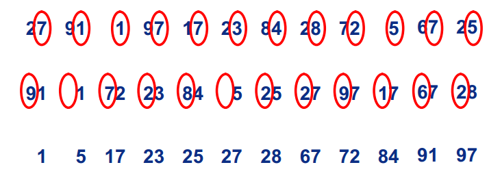
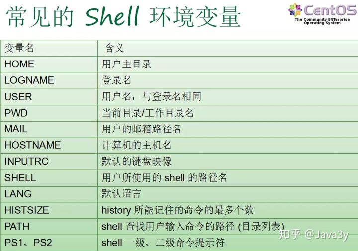
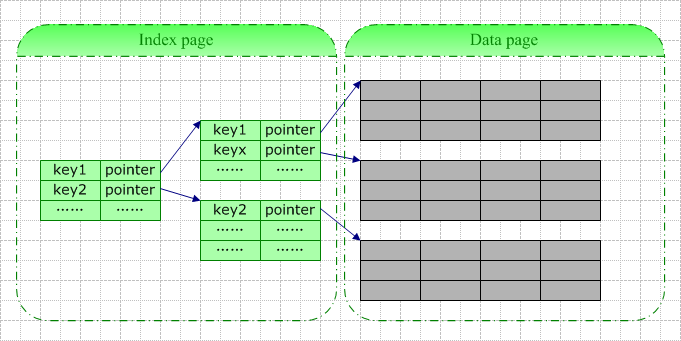
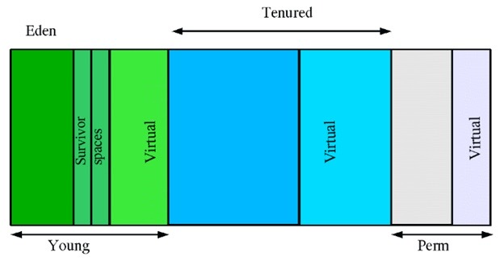
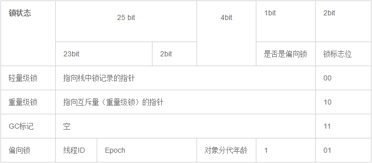
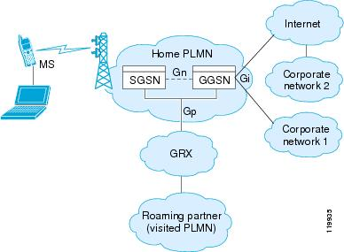

by zxb 

[TOC]

------

# 计算机网络

### 名词解释

#### MIME（Multipurpose Internet Mail Extension）


#### URI


##### URL

统一资源定位符，是资源定位符最常见的形式，描述了一台特定服务器上某资源的特定位置。它们可以明确说明如何从一个精确、固定的位置获取资源。


**url构成：<scheme>://<user><password>@<host>:<port>/<path>;<params>?<query>#<frag>**


##### URN

统一资源名，与位置无关。


#### 事务处理

一条HTTP事务是由

- 请求指令（客户端→服务器）
- 响应结果（与上反之）

统称为 **HTTP** 报文


### HTTP协议

- HTTP 是构建在 TCP/IP 协议之上的，默认端口是80
- HTTP 是无连接状态的

#### HTTP报文


##### 请求报文

HTTP 协议是以 ASCII 码传输，建立在 TCP/IP协议之上的应用层规范。规范把 HTTP 请求分为三个部分：状态行、请求头、消息主体。如：

```Xml
<method> <request-URL> <version>
<headers>

<entity-body>
```

HTTP 定义了与服务器交互的不同方法，最基本的方法有：GET 、 POST、PUT、DELETE。

URL 的全称是 资源描述符，我们可以这样的认为，一个 URL 地址，用于描述一个网络上的资源，而 HTTP 中的 GET、POST、PUT、DELETE 对应着对这个资源的查、增、改、删 四个操作 <u>对此有怀疑</u>

**1.GET 用于获取信息，而且应该是安全的和幂等的。**

安全是指，这个操作只能够获取信息而非修改。

幂等的意味着对同一个 URL 的多个请求应该返回同样的结果

报文示例：

```http
GET /books/?sex=man&name=Professional HTTP/1.1
 Host: www.example.com
 User-Agent: Mozilla/5.0 (Windows; U; Windows NT 5.1; en-US; rv:1.7.6)
 Gecko/20050225 Firefox/1.0.1
 Connection: Keep-Alive
```

**2.POST 表示可能修改服务器上的资源**

```http
 POST / HTTP/1.1
 Host: www.example.com
 User-Agent: Mozilla/5.0 (Windows; U; Windows NT 5.1; en-US; rv:1.7.6)
 Gecko/20050225 Firefox/1.0.1
 Content-Type: application/x-www-form-urlencoded
 Content-Length: 40
 Connection: Keep-Alive

 sex=man&name=Professional  			
```

**3.注意**

- GET 所提交的数据量受到 URL 长度的限制， HTTP 协议的规范没有对 URL 长度进行限制。这个限制来自于浏览器和服务器
- 理论上 POST 没有大小的限制，HTTP 协议规范也没有大小的限制，处于安全考虑，服务器软件会做一些实时的限制
- 参考上面的报文示例，可以发现 GET 和 POST 数据的内容是一模一样的，只是位置不同，一个在 URL 里面，一个在 HTTP 包的包体里。

##### POST 提交数据的方式

HTTP 协议中规定 POST 提交的数据必须在 body 部分中，但是协议中没有规定数据使用哪一种编码方式或者数据的格式。实际上，开发者完全可以自己决定消息主体的格式，只要最后发送的 HTTP 请求满足上面的格式就可以。

但是少数据发送出去，还要服务端解析成功才有意义。一般服务端语言如：PHP 、 Python等，以及他们的 framework，都内置了自动解析常见数据格式的功能。服务端常常是根据请求头（headers) 中的 Content-type 字段来获知请求中的消息主体是用的何种方式编码，再对方主体进行解析。所以说到 POST 提交数据的方案，包含了Content-Type 和消息编码方式 两部分。

- application/x-www-form-urlencoded

这是最常见的 POST 数据提交方式。浏览器的原生 <form> 表单，如果不设置 enctype 属性，那么最终就会以 application/x-www-form-urlencoded 方式提交数据。上个小节当中的例子便是使用了这样的方式提交数据。可以看到 body 当中的内容和 GET 请求的完全相同。

- mutipart/form-data

这又是一个常见的 POST 数据的提交方式。我们用表单上传文件时，必须让 <form> 表单的enctype 等于 multipart/form-data 。 直接来看一个示例：

```http
POST http://www.example.com HTTP/1.1
Content-Type:multipart/form-data; boundary=----WebKitFormBoundaryrGKCBY7qhFd3TrwA

------WebKitFormBoundaryrGKCBY7qhFd3TrwA
Content-Disposition: form-data; name="text"

title
------WebKitFormBoundaryrGKCBY7qhFd3TrwA
Content-Disposition: form-data; name="file"; filename="chrome.png"
Content-Type: image/png

PNG ... content of chrome.png ...
------WebKitFormBoundaryrGKCBY7qhFd3TrwA--
```

这个例子有点复杂，首先生成了一个 boundary 用于分割不同的字段，为了避免与正文内容重复， boundary 很长很复杂。然后 Content-Type 里面指明了数据是以 multipart/form-data 来编码，本次请求的 boundary 是什么内容。消息主体里面按照字段个数又分为多个结构类似的部分，每部分都以 —boundary 开始，紧接着是内容描述信息，然后是回车，最后是字段的具体内容（文本或二进制）。如果传输的是文件，还要包含文件名和文件类型信息。消息主体最后以 —boundary— 标示结束。

这种方式一般用来上传文件，各大服务端语言对它有着良好的支持。

上面提到的这两种 POST 数据的方式，都是浏览器原生支持的，而且现阶段标准中，原生 <form> 表单也只支持这两种方式 （通过 <form> 元素的 enctype 属性指定，默认为application/x-www-form-urlencoded。 其实 enctype 还支持 text/plain，不过用得非常少）。

随着越来越多的 web 站点，尤其是 webApp ，全部使用 Ajax 进行数据交互以后，我们完全可以定义新的数据提交方式。，例如 application/json ， text/xml ，乃至 application/x-protobuf 这种二进制格式，只要服务器可以根据 Content-type 和 Conten-Encoding 正确的解析出请求，都是没有问题的。

##### 响应报文

HTTP 的响应与 HTTP 的请求相似，HTTP 响应也由三个部分构成：

- 状态行
- 响应头（response header）
- 响应正文

状态行由协议版本、数字形式的状态代码、及相应的状态描述，个元素之间以空格分隔。

常见的状态码：

- 200 OK 客户端请求成功
- 301 Moved Permanently 请求永久重定向
- 302 Moved Temporarily 请求临时重定向
- 304 Not Modified 文件未修改，可以直接使用缓存文件
- 400 Bad Request 由于客户端请求有语法的错误，不能被服务器所理解
- 401 Unauthorized 请求未经授权，这个状态码必须和 WWW-Authentuvate 报头域一起使用
- 403 Forbidden 服务器收到请求，但是拒绝提供服务。服务器通常会在正文中给出不提供服务的原因
- 404 Not Found 请求的资源不存在，例如：输入了错误的URl
- 500 Internal Server Error 服务器发生不可预期的错误，导致无法完成客户端的请求
- 503 Service Unavailable 服务器当前不能够处理客户端的请求，在一段时间以后，服务器可以恢复正常。

下面是一个 HTTP 响应的例子：

```http
HTTP/1.1 200 OK

Server:Apache Tomcat/5.0.12
Date:Mon,6Oct2003 13:23:42 GMT
Content-Length:112

<html>...
```

#### 条件 GET

HTTP 条件 GET 是 HTTP 协议为了减少不必要的带宽浪费，提出的一种方案。

1.HTTP 条件 GET 使用的时机？

客户端之前已经坊问过某网站，并打算再次访问

2.HTTP 条件 GET 的使用方法？

客户端向服务器发送一个包询问是否在上一次访问网站的时间后更改了页面，如果服务器没有更新，显然不需要把整个网页传给客户端，客户端只要使用本地缓存即可，如果服务器对照客户端给出的时间已经更新了客户端请求的页面，则发送这个更新了的页面给用户。

下面是一个具体的发送接收报文的示例：

客户端请求：

```http
GET / HTTP/1.1
Host: www.sina.com.cn:80
If-Modified-Since:Thu, 4 Feb 2010 20:39:13 GMT
Connection: Close 
```

第一次请求时，服务器段返回请求数据，之后的请求，服务器根据请求中的 If-Modified-Since 字段判断响应文件没有更新，如果未更新，服务器返回一个 304 Not Modified 响应，告诉浏览器请求的资源在服务器上没有更新，可以使用缓存文件。

```http
 HTTP/1.0 304 Not Modified  
 Date: Thu, 04 Feb 2010 12:38:41 GMT  
 Content-Type: text/html  
 Expires: Thu, 04 Feb 2010 12:39:41 GMT  
 Last-Modified: Thu, 04 Feb 2010 12:29:04 GMT  
 Age: 28  
 X-Cache: HIT from sy32-21.sina.com.cn  
 Connection: close 
```

如果服务端的资源已经更新的话，就正常的返回响应。

#### 持久连接

我们知道 HTTP 协议采用“请求-应答”模式，当使用普通模式，即非 Keep-Alive模式时，每个请求/应答客户和服务器都要新建一个连接，完成之后立即断开连接（HTTP 协议为无连接的协议）；当使用 Keep-Alive 模式（又称持久连接，连接重用）时，Keep-Alive 功能是客户端到服务器的连接持续有效，当出现对服务器的后续请求时，Keep-Alive 功能避免了建立或重新建立连接

在 HTTP 1.0 版本中，并没有官方的标准来规定 Keep-Alive 如何工作，因此它是被附加到 HTTP 1.0 协议上的，如果客户端浏览器支持 Keep-Alive ，那么就在 HTTP 请求头中 添加一个字段 Connection：Keep-Alive ，当服务器收到附有 Connection：Keep-Alive 的请求的时，它也会在响应中添加一个同样的字段来使用 Keep-Alive 。这样一来，客户端和服务端的 HTTP 连接就会被保持，不会断开（超过 Keep-Alive 规定的时间或者意外），当客户端发送另一个请求时，就会使用这条已经建立的连接。

在 HTTP 1.1 版本中，默认情况下所有连接都被保持，如果加入“Connection：Close”才关闭。目前大部分的浏览器都是用 HTTP 1.1 协议，也就是说默认会发起 Keep-Alive 的连接请求了，所以是否能完成一个完成的 Keep-Alive 连接就看服务器的设置情况

由于 HTTP 1.0 没有官方的 Keep-Alive 规范，并且也已经基本被淘汰，以下讨论均是针对 HTTP 1.1 标准中的 Keep-Alive 展开的。

注意：

- HTTP Keep-Alive 简单说就是保持当前的 TCP 链接，避免重新建立连接
- HTTP 长连接不可能一直保持，例如 Keep-Alive：timeout = 5，max = 100，表示这个TCP 通道可以保持5s，这个长连接最多接收 100 次请求就断开
- HTTP 是一个无状态协议，这意味每个请求都是独立的， Keep-Alive 没能改变这个结果。另外，Keep-Alive也不能保证客户端和服务器之间的连接一定是活跃的，在 HTTP1.1 版本中也如此。唯一能保证的就是当连接被关闭时你能得到一个通知，所以不应该让程序依赖于 Keep-Alive 的保持连接特性，否则会有意想不到的后果。
- 使用长连接之后，客户端、服务端怎么知道本次传输结束呢？两部分：1. 判断传输数据是否达到了Content-Length 指示的大小；2. 动态生成的文件没有 Content-Length ，它是分块传输（chunked），这时候就要根据 chunked 编码来判断，chunked 编码的数据在最后有一个空 chunked 块，表明本次传输数据结束，详见[这里](http://www.cnblogs.com/skynet/archive/2010/12/11/1903347.html)。什么是 chunked 分块传输呢？下面我们就来介绍一下。


#### Transfer-Encoding

Transfer-Encoding 是一个用来标示 Http 报文传输格式的头部值。尽管这个取值理论上可以有很多，但是当前的 HTTP 规范里实际只定义了一种传输取值—chunked。

如果一个 HTTP 消息（请求消息或应答消息）的 Transfer—Encoding 消息头的值为 chunked ，那么，消息体由数量未定的快组成，并以最后一个大小为0的块为结束。

每一个非空的块都以该块包含数据的字节数，（字节数以十六进制表示）开始，跟随一个 CRLF （回车及换行），然后是数据本身，最后块 CRLF结束。在一些现实中，块大小和 CRLF 之间填充有白空格（0×20）。

最后一块是单行，由块大小（0），一些可选的填充白空格，以及 CRLF 。最后一块不再包含任何数据，但是可以发送可选的尾部，包括消息头字段。消息最后以 CRLF 结尾。

一个响应示例如下：

```http
HTTP/1.1 200 OK
Content-Type: text/plain
Transfer-Encoding: chunked

25
This is the data in the first chunk

1A
and this is the second one
0
```

注意：

- chunked 和 multipart 两个名词在意义上有类似的地方，不过在 HTTP 协议当中这两个概念则不是一个类别的。 multipart 是一种 Content-Type，标示 HTTP 报文内容的类型，而 chunked 是一种传输格式，标示报头将以何种方式进行传输。
- chunked 传输不能事先知道内容的长度，只能靠最后的空 chunked 块来判断，因此对于下载请求来说，是没有实现进度的。在浏览器和下载工具中，偶尔我们也会看到有些文件是看不到下载进度的，即采用 chunked 方式进行下载。
- chunked 的优势在于，服务端可以边生成内容边发送，无需实现生成全部内容。HTTP/2 不支持 Transfer-Encoding:chunked ，因为 HTTP/2 有自己的 streaming 传输方式。

#### HTTP Pipelining（HTTP 管线化）

默认情况下 HTTP 协议中每个传输层连接只能承载一个 HTTP 请求和响应，浏览器会在收到一个请求的响应之后，再发送下一个请求。在使用持久连接的情况下，某个连接上消息的传递类似于请求1 -> 响应1 -> 请求2 -> 响应2 -> 请求3 -> 响应3

HTTP-Pipelining 是将多个 HTTP 请求整批提交的技术，在传送的过程中不需要等待服务器的回应。使用 HTTP-Pipelining 技术之后，某个连接上的消息变成了类似这样 请求1-> 请求2-> 请求3-> 响应1-> 响应2-> 响应3

注意下面几点：

- 管线化机制 通过持久连接（persistentconnection）完成，仅 HTTP/1.1 支持此技术（http/1.0 不支持）
- 只有 GET 和 HEAD 请求可以进行管线化，而 POST 则有所限制
- 初次创建连接时不应该启动管线机制，因为服务器 不一定支持 http/1.1 协议
- 管线化不会影响响应到来的顺序，如上面的例子所示，响应返回的顺序未改变
- http/1.1 要求服务端支持管线化，但并不要求服务端也响应进行管线化处理，只是要求对管线化的请求不失败就好
- 由于上面提到的服务器短的问题，开启管线化很可能并不会带来大幅度的性能提升，而很多服务器和代理程序对管线化的支持并不好，因此现代浏览器如 Chrome 和 Firefox 默认并未开启管线化的支持

#### 会话跟踪

1.什么是会话？

客户端打开与服务器的连接发出请求到服务器响应客户端请求的全过程称之为会话。

2.什么是会话跟踪？

指对同一个用户对服务器的连接的请求和响应的监视

3.为什么需要会话跟踪？

浏览器与服务器之间的通信是通过 HTTP 协议进行通信的，而 HTTP 协议是“无状态”的协议，他不能保存客户的信息，即一次响应完成之后断开连接，下一次请求需要重新连接的时候，就需要判断是否是同一个用户，所以才会有会话跟踪技术实现这种需求。

1.会话跟踪的常用方法：

**i.URL重写**

URL（统一资源定位符）是 WEB 上特定页面的地址， URL 重写的技术就是在 URL 结尾添加一个附加的数据以标示该会话，把会话 ID 通过 URL 的信息传递过去，以便在服务器端进行识别不同的用户。

**ii.隐藏表单域**

将会话 ID 添加到 HTML 表单元素中提交到服务器，此表单元素并不在客户端显示

**iii.Cookie**

Cookie 是 Web 服务器发送给客户的一小段信息，客户端请求时可以读取该信息发送到服务器端，进行用户的额识别。对于客户端的每次请求，服务器都会将Cookie 发送到客户端，在客户端可以进行保存，以便下次使用

客户端可以采取两种方式来保存这个 Cookie 对象，一种方式是保存在客户端的内存中，称为临时的 Cookie ，浏览器关闭后这个 Cookie 对象将消失。另外一种是保存在客户机的磁盘上，称为永久的 Cookie。以后客户端只要访问该网站，就会将这个 Cookie 再次发送到服务器上，前提是这个 Cookie在有效期内，这样就实现了对客户的跟踪。

 Cookie 是可以禁止的。

**iv.Session**

每个用户都有一个不同的 Session ，各个用户之间是不能共享的，在 Session 中可以存放信息

在服务器创建一个 Session 对象，产生一个 SessionID 来标示这个 Session 对象，然后将这个 SessionID 放入到 Cookie 发送到客户端，下一次访问时， SessionID 会发送到服务器，在服务器端识别不同的用户。

Session 的实现依赖于 Cookie ，如果 Cookie 被禁用 Session 也会失效。

#### 跨站攻击

##### CSRF（Cross-site request  forgery，跨站请求伪造）

****顾名思义。是伪造请求，冒充用户在站内的正常操作。

例如：一论坛网站发帖是通过 GET 请求访问，点击发帖之后 JS 把发帖的内容拼接成目标 URL 并访问：

```url
http://example.com/bbs/create_post.php?title=标题&content=内容
```

那么，我们只需要在论坛中发一个帖子，包含一个链接：

```
 http://example.com/bbs/create_post.php?title=我是脑残&content=哈哈
```

只要有用户点击了这个链接，那么他的账户就会在不知情的情况下发布了这一个帖子，可能这只是一个恶作剧，但是既然发帖的请求可以伪造，那么删帖、转账、改密码、发邮件全都可以伪造。

如何防范 CSRF 攻击？ 可以注意一下几点：

1.关键操作只接受 POST 请求

2.验证码

CSRF 攻击的过程，往往是用户不知情的情况下构造网络请求。所以如果使用验证码，那么每次操作都需要与用户进行互动，从而简单有效的防御了 CSRF 攻击。

但是如果你每次在一个网址做出任何举动都需要输入验证码的的话严重影响用户体验，所以验证码只出现在特殊的操作里面，或者在注册的时候使用

3.检测  Referer

常见的互联网页面与页面之间是存在联系的，比如你在 www.baidu.com 应该是找不到通往 www.google.cn 的连接的，再比如你在论坛留言，那么不管你留言后重定向到哪里去了，之前的那个网址一定会包含留言的输入框，这个之前的网址就会保留在新页面头文件的 Referer 中

通过检查 Referer 的值，我们就可以判断这个请求是合法的还是非法的。凡事问题出在服务器不是任何时候都能接收到 Referer 的值，所以 Referer Check 一般是用来监控 CSRF 攻击的发生，而不是用来抵御攻击

4.Token

目前主流的做法是适用 Token 抵御 CSRF  攻击，下面通过分析 CSRF 攻击来理解为什么 Token 能够有效

CSRF 攻击要成功的条件在于攻击者能够预测所有的参数从而构造出合法的请求。所以根据不可预测性原则，我们可以对参数进行加密从而防止 CSRF 攻击。

另一个通用的方法是保持原有的参数不变，另外添加一个 Token 值，是随机的值。这样攻击者因为不知道 Token 而无法构造出合法的请求进行攻击

Token 的使用原则：

i.Token 要足够的随机 —— 只有这样才算是不可预测

ii.Token 是一次性的，即每次请求成功后要更新 Token —— 这样可以增加攻击的难度，增加预测的难度

iii.Token 要注意保密性----敏感操作使用 POST 防止 Token 出现在 URL 中

注意：过滤用户输入的内容不能阻挡 CSRF 我们需要做的是过滤请求的来源

##### XSS（Cross Site Scripting，跨站脚本攻击）

是注入攻击的一种，其特点是不对服务器造成任何伤害，而是通过一些正常的站内交互途径，例如发布评论，提交含有 JavaScript 的内容文本。这时服务器如果没有过滤或者转义这些脚本，作为内容发布到了页面上，其他用户访问的时候就会运行这些脚本

运行预期之外的脚本带来的后果有很多种，可能只是简单的恶作剧，一个关不掉的窗口：

```javascript
while(true){
  alert("你关不掉我！");
}
```

也可以是盗号或者其他的未授权的操作

XSS 是实现 CSRF 的诸多途径中的一条，一般习惯把通过 XSS 来实现的 CSRF 称为 XSRF

如何防御 XSS 攻击？

理论上，所有的可输入的地方么有对输入数据进行处理的话，都会存在 XSS 漏洞，其危害取决于攻击代码的威力，攻击代码也不局限于 script 。防御 XSS 攻击最简单直接的方法，就是过滤用户的输入

如果不需要用户输入 HTML ， 可以直接对用户的输入进行 HTML escape 比如下面的脚本

```javascript
  <script>window.location.href=”http://www.baidu.com”;</script>

```

经过 escape 之后

```javascript
  &lt;script&gt;window.location.href=&quot;http://www.baidu.com&quot;&lt;/script&gt;
```

他现在会像普通的文本一样的显示出来，变得无害，不能执行了

当我们需要用户输入 HTML 的时候，需要用户输入的内容做更加小心细致的处理。仅仅是粗暴的去掉 script 标签是没有用的，任何一个合法的 HTML 标签都可以添加 onclick 一类的事件属性来执行 JavaScript 。更好的方法可能是，将用户的输入使用 HTML 解析库进行解析，获取其中SDE数据。然后根据用于原有的标签属性，重新构造 HTML 元素树，构件的过程中，所有的标签、属性都是从白名单拿取

#### 参考资料

- [浅谈HTTP中Get与Post的区别](http://www.cnblogs.com/hyddd/archive/2009/03/31/1426026.html)
- [http请求与http响应详细解析](http://www.cnblogs.com/loveyakamoz/archive/2011/07/22/2113614.html)
- [HTTP 条件 Get (Conditional Get)](http://blog.csdn.net/luoleicn/article/details/5289496)
- [HTTP中的长连接与短连接](http://www.cnblogs.com/cswuyg/p/3653263.html)
- [HTTP Keep-Alive模式](http://www.cnblogs.com/skynet/archive/2010/12/11/1903347.html)
- [分块传输编码](https://zh.wikipedia.org/zh-cn/%E5%88%86%E5%9D%97%E4%BC%A0%E8%BE%93%E7%BC%96%E7%A0%81)
- [HTTP 管线化(HTTP pipelining)](http://blog.csdn.net/dongzhiquan/article/details/6114040)
- [HTTP协议及其POST与GET操作差异 & C#中如何使用POST、GET等](http://www.cnblogs.com/skynet/archive/2010/05/18/1738301.html)
- [四种常见的 POST 提交数据方式](https://www.cnblogs.com/softidea/p/5745369.html)
- [会话跟踪](http://blog.163.com/chfyljt@126/blog/static/11758032520127302714624/)
- [总结 XSS 与 CSRF 两种跨站攻击](https://blog.tonyseek.com/post/introduce-to-xss-and-csrf/)
- [CSRF简单介绍与利用方法](http://drops.wooyun.org/papers/155)
- [XSS攻击及防御](http://blog.csdn.net/ghsau/article/details/17027893)
- [百度百科：HTTP](http://baike.baidu.com/view/9472.htm)

### TCP 协议

#### TCP 特性

- TCP 提供一种面向连接的、可靠的字节流服务
- 在一个 TCP 连接中，仅有两方进行彼此的通信。广播和多播不能用于 TCP
- TCP 使用校验、确认和重传机制来保证可靠传输
- TCP 给数据分节进行排序，并使用累积确认保证数据和顺序不变和非重复
- TCP 使用滑动窗口机制实现流量控制，通过动态改变窗口的大小进行拥塞控制

**注意**：TCP 并不能保证数据一定会被对方接收到，因为这是不可能的。TCP 能够做到的是，如果有可能，就把数据递送到接收方，否则就（通过放弃重传并且中断连接这一手段）通知用户。因此准确说 TCP 也不是 100% 可靠的协议，它所能提供的是数据的可靠递送或故障的可靠通知。

#### 三次握手和四次挥手

所谓三次握手（Three-way Handshake），是指建立一个 TCP 连接时，需要客户端和服务端总共发送三个包。

三次握手的目的是连接服务器的指定端口，建立 TCP 连接，并同步连接双方的序列号和确认号，交换 TCP 窗口大小和信息。在 socket 编程中，客户端执行 connect() 时。将触发三次握手。

- 第一次握手（SYN = 1，seq = x）：

  客户端发送一个 TCP 的 SYN 标志位置1的包，指明客户端 打算连接的端口，以及初始序号 X，保存在包头的序列号（Sequence Number）字段里。

  发送完毕后，客户端进入 SYN_SEND 状态。

- 第二次握手（SYN = 1，ACK = 1， seq = y，ACKnum = x+1）：

  服务器发回确认包（ACK）应答。即 SYN 标志位和 ACK 标志位均为1.服务器端选择自己 ISN 序列号，放到 Seq 域里，同时将确认序号（Acknowledgement Number）设置为客户端的 ISN 加 1，即 X+1 。发送完毕后，服务端进入 SYN_RCVD 状态。

- 第三次握手（ACK = 1，ACKnum = y+1）

  客户端再次发送确认包（ACK），SYN标志位为0，ACK 标志位为1，并且把服务器发来的 ACK 的序号字段 +1，放在确定字段中发送给对方，并且在数据段写 ISN +1。

  发送完毕后，客户端进入 ESTABLISHED 状态，当服务器端接收到这个包时，也进入 ESTABLISHED 状态，TCP 握手结束。

TCP 的连接的拆除需要发送四个包，因此称为四次挥手（Four-way handshake），也叫做改进的三次握手。客户端和服务器均可以主动发起挥手动作，在 socket 编程中，任何一方执行 close() 操作即可产生挥手操作

- 第一次挥手（FIN = 1，seq = x）

  假设客户端想要关闭连接，客户端发送一个 FIN 标识位置为1的包，表示自己已经没有数据可以发送了，但是仍然可以接受数据

  发送完毕后，客户端进入 FIN_WAIT_1 状态

- 第二次挥手（ACK = 1，ACKnum = x+1）

  服务器端确认客户端的 FIN 包，发送一个确认包，表明自己接受到了客户端关闭连接的请求，但是还没有准备好关闭连接。

  发送完毕后，服务器进入 CLOSE_WAIT 状态，客户端接收到这个确认包之后，进入 FIN_WAIT_2 状态，等待服务器关闭连接

- 第三次挥手（FIN = 1，seq = y）

  服务端准备好关闭连接时，向客户端发送结束连接请求， FIN 置为1.

  发送完毕后，服务器端进入 LAST_ACK 状态，等待来自客户端的最后一个ACK

- 第四次挥手（ACK = 1，ACKnum = y+1）

  客户端接收到来自服务端的关闭请求，发送一个确认包，并进入 TIME_WAIT 状态， 等待可能出现的 要求重传的 ACK 包。

  服务器端接收到这个确认包之后，关闭连接，进入 CLOSED 状态

  客户端等待了某个固定时间（两个最大段的声明周期，2MSL，2 Maximum Segment Lifetime）之后，没有收到服务器端的 ACK，认为服务端已经正常关闭，于是自己也关闭连接 ，进入 CLOSED 状态

#### SYN 攻击

- 什么是 SYN 攻击（SYN Flood）？

  在三次握手的过程中，服务器发送 SYN-ACK 之后，收到客户端的ACK 之前的 TCP 连接称之为半连接（half-open connect）。此时服务器处于 SYN_RCVD 状态。当收到 ACK 后，服务器才能转入 ESTABLISHED 状态。

  SYN 攻击指的是， 攻击客户端在短时间内伪造大量不存在的 IP 地址，向服务器不断的发送 SYN 包，服务器回复确认包，并等待客户端的确认。由于原地址是不存在的，服务器需要不断的重发直至超时，这些伪造的 SYN 包将长时间的占用未连接队列，正常的 SYN 请求被丢弃，导致目标系统运行缓慢，严重者会引起网络堵塞甚至系统瘫痪。

  SYN 攻击是一种典型的 DoS/DDoS 攻击

- 如何检测 SYN 攻击？

  检测 SYN 攻击非常的方便，当在服务器上看到大量的半连接状态时，特别是 ip 地址是随机的，基本可以判定是一次 SYN 攻击。在 Linux/Unix 上可以使用系统自带的 netstats 命令来检测 SYN 攻击

- 如何防御 SYN 攻击？

  SYN 攻击不能完全被阻止，除非将 TCP 协议重新的设计。我们所做的是尽可能的减轻 SYN 攻击的危害，常见的防御 SYN 攻击方法有如下几种：

  - 缩短超时（SYN Timeout）时间
  - 增加最大半连接数
  - 过滤网管防护
  - SYN cookies技术

#### TCP KeepAlive

TCP 的连接，实际上是一种纯软件层面的概念，在物理层面并没有“连接”这种概念。TCP 通信双方建立交互的链接，但是并不是一直存在的数据交互，有些连接会在数据交互完毕后，主动释放连接，而有些不会。再长时间无数据交互的时间段内，交互双方都有可能出现掉电、死机、异常重启等各种意外，当这些意外发生之后，这些 TCP 连接并未来得及正常释放，在软件层面上，连接的另一方并不知道对端的情况，他会一直维护这个连接，长时间的积累会导致非常多的半打开连接，造成端系统资源的消耗和浪费，为了解决这个问题，在传输层可以利用 TCP 的KeepAlive 机制 来实现。主流的操作系统基本都在内核里支持了这个特性。

TCP KeepAlive 的基本原理是，隔一段时间给连接对端发送一个探测包，如果收到对方回应的 ACK，则认为连接是存活的，在超过一定的重试次数之后还是没有收到对方的回应，则丢弃该 TCP 连接。

[TCP-Keepalive-HOWTO](http://www.tldp.org/HOWTO/html_single/TCP-Keepalive-HOWTO/) 有对 TCP KeepAlive 特性的详细介绍，有兴趣的同学可以参考。这里主要说一下，TCP KeepAlive 的局限。首先 TCP KeepAlive 监测的方式是发送一个 probe 包，会给网络带来额外的流量，另外 TCP KeepAlive 只能在内核层级监测连接的存活与否，而连接的存活不一定代表服务的可用。例如当一个服务器 CPU 进程服务器占用达到 100%，已经卡死不能响应请求了，此时 TCP KeepAlive 依然会认为连接是存活的。因此 TCP KeepAlive 对于应用层程序的价值是相对较小的。需要做连接保活的应用层程序，例如 QQ，往往会在应用层实现自己的心跳功能。

#### 参考资料

- 计算机网络：自顶向下方法
- [TCP三次握手及四次挥手详细图解](http://www.cnblogs.com/hnrainll/archive/2011/10/14/2212415.html)
- [TCP协议三次握手过程分析](http://www.cnblogs.com/rootq/articles/1377355.html)
- [TCP协议中的三次握手和四次挥手(图解)](http://blog.csdn.net/whuslei/article/details/6667471)
- [百度百科：SYN攻击](http://baike.baidu.com/subview/32754/8048820.htm)
- [TCP-Keepalive-HOWTO](http://www.tldp.org/HOWTO/html_single/TCP-Keepalive-HOWTO/)

### UDP 简介

UDP 是一个简单的传输层协议。和 TCP 相比，UDP 有下面几个显著特性：

- UDP 缺乏可靠性。UDP 本身不提供确认，序列号，超时重传等机制。UDP 数据报可能在网络中被复制，被重新排序。即 UDP 不保证数据报会到达其最终目的地，也不保证各个数据报的先后顺序，也不保证每个数据报只到达一次
- UDP 数据报是有长度的。每个 UDP 数据报都有长度，如果一个数据报正确地到达目的地，那么该数据报的长度将随数据一起传递给接收方。而 TCP 是一个字节流协议，没有任何（协议上的）记录边界。
- UDP 是无连接的。UDP 客户和服务器之前不必存在长期的关系。UDP 发送数据报之前也不需要经过握手创建连接的过程。
- UDP 支持多播和广播。

### TCP 与 UDP 的区别

TCP 用于在传输层有必要实现可靠传输的情况。由于它是面向链接并且具备顺序控制、重发控制等机制的，所以他可以为应用提供可靠的传输

而在另一方面，UDP 主要用于那些对高速传输和实时性有较高要求的通信或广播通信

我们举一个通过 IP 电话进行通话的例子。如果使用 TCP，数据在传送途中如果丢失会被重发，但这样无法流畅的传输通话人的声音，会导致无法进行正常交流。而采用 UDP，他不会进行重发处理。从而也就不会有声音大幅度延迟到达的问题。即使有部分数据丢失，也支持会影响某一小部分的通话。此外，在多播与广播通信中也是用 UDP 而不是 TCP。

### IP 协议简介

IP 协议位于 TCP/IP 协议的第三层——网络层。与传输层的协议相比，网络层的责任是提供点到点（hop to hop）的服务，而传输层（TCP/UDP）则提供端到端（end to end）的服务。

#### IP 地址的分类

#### 广播与多播

### Socket 编程

Socket 是对 TCP/IP 协议族的一种封装，是应用层与 TCP/IP 协议族通信的中间软件抽象层。从设计模式的角度来看，Socket 其实就是一个门面模式，它把复杂的 TCP/IP 协议族隐藏在 Socket 接口后面，对用户来说一组简单的接口就是全部，让 Socket 去组织数据，已符合指定的协议。

Socket 还可以认为是一种网络间不同计算机上的进程通信的一种方法，利用三元组（IP地址 ，协议，端口）就可以唯一标识网络中的进程，网络中的进程通信可以利用这个标识与其他的进程进行交互。

Socket 起源于 Unix ，Unix/Linux 基本哲学之一就是“一切皆文件”，都可以用“打开（open）—> 读写（write/read） —> 关闭（close） ”模式来进行操作。因此 Socket 也被处理为一种特殊的文件。

#### 写一个简易的 webSever

一个简易的 webServer 的流程如下：

1. 建立连接，接受一个客户端的连接
2. 接受请求，从网络中读取一条 HTTP 请求报文
3. 处理请求，访问资源
4. 构建响应，创建带有 header 的 HTTP 响应报文
5. 发送响应，传给客户端

省略流程 3 ，大体的程序与调用的函数逻辑：

1. socket() 创建套接字
2. Bind() 分配套接字地址
3. listen() 等待连接请求
4. accept() 允许了解请求
5. read() / write() 数据交换
6. close() 关闭连接

代码：

```c
#include <cstdio>
#include <cstdlib>
#include <cstring>
#include <unistd.h>
#include <sys/socket.h>
#include <arpa/inet.h>
#include <string>
#include <cstring>
#include <iostream>

using namespace std;

const int port = 9090;
const int buffer_size = 1<<20;// 1 mb
const int method_size = 1<<10;// 512 kb
const int filename_size = 1<<10;
const int common_buffer_size = 1<<10;

void handleError(const string &message);
void requestHandling(int *sock);
void sendError(int *sock);
void sendData(int *sock, char *filename);
void sendHTML(int *sock, char *filename);
void sendJPG(int *sock, char *filename);

int main()
{
    int server_sock; 
    int client_sock;

    struct sockaddr_in server_address;
    struct sockaddr_in client_address;

    socklen_t client_address_size;

    server_sock = socket(PF_INET, SOCK_STREAM, 0);

    if (server_sock == -1)
    {
        handleError("socket error");
    }

    memset(&server_address,0,sizeof(server_address));
    server_address.sin_family = AF_INET;
    server_address.sin_addr.s_addr = htonl(INADDR_ANY);
    server_address.sin_port = htons(port);

    if(bind(server_sock,(struct sockaddr*)&server_address, sizeof(server_address)) == -1){
        handleError("bind error");
    }

    if(listen(server_sock, 5) == -1) {
        handleError("listen error");
    }

    while(true) {
        client_address_size = sizeof(client_address);
        client_sock = accept(server_sock, (struct sockaddr*) &client_address, &client_address_size);

        if (client_sock == -1) {
            handleError("accept error");
        }
        requestHandling(&client_sock);
    }

    //system("open http://127.0.0.1:9090/index.html");
    close(server_sock);

    return 0;
}

void requestHandling(int *sock){
    int client_sock = *sock;
    char buffer[buffer_size];
    char method[method_size];
    char filename[filename_size];

    read(client_sock, buffer, sizeof(buffer)-1);

    if(!strstr(buffer, "HTTP/")) {
        sendError(sock);
        close(client_sock);
        return;
    }

    strcpy(method, strtok(buffer," /"));
    strcpy(filename, strtok(NULL, " /"));

    if(0 != strcmp(method, "GET")) {
        sendError(sock);
        close(client_sock);
        return;
    }

    sendData(sock, filename);
}

void sendData(int *sock, char *filename) {
    int client_sock = *sock;
    char buffer[common_buffer_size];
    char type[common_buffer_size];

    strcpy(buffer, filename);

    strtok(buffer, ".");
    strcpy(type, strtok(NULL, "."));

    if(0 == strcmp(type, "html")){
        sendHTML(sock, filename);
    }else if(0 == strcmp(type, "jpg")){
        sendJPG(sock, filename);
    }else{
        sendError(sock);
        close(client_sock);
        return ;
    }
}

void sendHTML(int *sock, char *filename) {
    int client_sock = *sock;
    char buffer[buffer_size];
    FILE *fp;

    char status[] = "HTTP/1.0 200 OK\r\n";
    char header[] = "Server: A Simple Web Server\r\nContent-Type: text/html\r\n\r\n";

    write(client_sock, status, strlen(status));
    write(client_sock, header, strlen(header));

    fp = fopen(filename, "r");
    if(!fp){
        sendError(sock);
        close(client_sock);
        handleError("failed to open file");
        return ;
    }

    fgets(buffer,sizeof(buffer), fp);
    while(!feof(fp)) {
        write(client_sock, buffer, strlen(buffer));
        fgets(buffer, sizeof(buffer), fp);
    }

    fclose(fp);
    close(client_sock);
}

void sendJPG(int *sock, char *filename) {
    int client_sock = *sock;
    char buffer[buffer_size];
    FILE *fp;
    FILE *fw;

    char status[] = "HTTP/1.0 200 OK\r\n";
    char header[] = "Server: A Simple Web Server\r\nContent-Type: image/jpeg\r\n\r\n";

    write(client_sock, status, strlen(status));
    write(client_sock, header, strlen(header));

    fp = fopen(filename, "rb");
    if(NULL == fp){
        sendError(sock);
        close(client_sock);
        handleError("failed to open file");
        return ;
    }

    fw = fdopen(client_sock, "w");
    fread(buffer, 1, sizeof(buffer), fp);
    while (!feof(fp)){
        fwrite(buffer, 1, sizeof(buffer), fw);
        fread(buffer, 1, sizeof(buffer), fp);
    }

    fclose(fw);
    fclose(fp);
    close(client_sock);
}

void handleError(const string &message) {
    cout<<message;
    exit(1);
}

void sendError(int *sock){
    int client_sock = *sock;

    char status[] = "HTTP/1.0 400 Bad Request\r\n";
    char header[] = "Server: A Simple Web Server\r\nContent-Type: text/html\r\n\r\n";
    char body[] = "<html><head><title>Bad Request</title></head><body><p>400 Bad Request</p></body></html>";

    write(client_sock, status, sizeof(status));
    write(client_sock, header, sizeof(header));
    write(client_sock, body, sizeof(body));
}
```

#### 参考资料

1. [Linux Socket编程](http://www.cnblogs.com/skynet/archive/2010/12/12/1903949.html)
2. [揭开 Socket 编程的面纱](http://goodcandle.cnblogs.com/archive/2005/12/10/294652.aspx)

# 数据结构与算法

## 表、栈与队列

抽象数据类型（abstract data type，ADT）是带有一组操作的一些对象的集合。抽象数据类型是数学的抽象；

### 表（list）

形如：A₀ 、A ₁、A₂ ... A𝑛₋₁。这个表的大小是N。大小为 0 的特殊的表称为空表（empty list）。

对于任何非空表，Aᵢ  后继 Aᵢ₋₁（或继 Aᵢ₋₁ 之后，i < N）并称 Aᵢ₋₁ 前驱 Aᵢ（i > 0）。表中的第一个元素是 A₀ ，最后一个元素是  A𝑛₋₁ 。我们将不定义 A₀ 的前驱元 ，也不定义 A𝑛₋₁ 的后继元。元素 Aᵢ 在表中的位置为 i + 1 。为了简单起见，我们假设表中的元素是整数，但是一般来说任意的复元素也是允许的（而且容易由 java 泛型类型处理） 。

与这些“定义”相关的是要在表 ADT 上进行操作的集合。printList 和 makeEmpty 是常用的操作，其功能显而易见；find 返回某一项首次出现的位置； insert 和 remove 一般是从表的某个位置插入和删除某个元素；而 findKth 则返回（作为参数而被指定的）某个位置上的元素。如果 34、12、52、16、12、是一个表，则 find(52) 会返回2；insert(x,2) 可以把表变成 34、x、12、52、16、12 ；而 remove(52) 则又将表变为 34、12、x、16、12 。

还可以添加一些操作：比如 next 和 previous ，他们会取一个位置作为参数并分别返回其后继元和前驱元的位置。

### 表的数组的简单实现

对表的所有的操作都可以通过使用数组来实现。虽然数组是有固定容量创建的，但是在需要的时候可以用双倍的容量创建一个数组。解决由于使用数组而产生的最严重的问题，即从历史上看为了使用一个数组，需要对表的大小进行估计。而这种估计在 java 或任何现代的编程语言中都是不需要的。下列程序段解释了一个数组 arr 在必要的时候如何被扩展（初始长度为10）；

```java
int [] arr = new int[10];
...
//扩大 arr
int [] newArr = new int[arr.length * 2];
for(int i = 0; i < arr.length; i++){
    newArr[i] = arr[i];
}
arr = newArr;
```

数组的实现可以使得 printList  以线性时间被执行，而 findKth 操作则花费常数时间，这正是我们能够预期的。不过，插入和删除的花费却潜藏着昂贵的开销，这要看插入和删除发生在什么地方。最坏的情形下，在位置 0 的插入（即在表的前端插入）首先需要将整个数组后移一个位置以空出空间来，而删除第一个元素则需要将表中的所有元素前移一个位置，因此这种操作最坏情况为 O(N) 。平均来看，这两种操作都要移动表的一半的元素，因此仍然需要先行时间。另一方面，如果所有的操作都发生在表的高端，那就没有元素要移动，而添加和删除则只要花O(1)时间。

存在许多情形，在这些情形下的表是通过在高端进行插入操作建成的，其后只发生在对数组的访问（即只有 findKth 操作）。在这种情况下，数组是表的一种恰当的实现。然而，如果对表的一些插入和删除的操作，特别是对表的前端进行，那么数组就不是一种好的选择。

### 简单链表

为了避免插入和删除的线性开销，我们需要保存表可以不连续存储，否则表的每个部分都可能需要整体移动。


链表由一系列的节点组成，这些节点不必在内存中相连。每一个节点均含有表元素和到包含该元素后继元的节点的链（link）。我们称之为 next 链。最后一个单元的next 链引用 null。

为了执行 printList 或 find(x), 只要从表的第一个节点开始然后用一些后继的 next 链遍历该表即可。这种操作显然是线性时间的，和在数组实现时一样，不过其中的常数可能会比用数组实现时要大。findKth 操作不如数组实现时效率高；findKth(i) 花费 O(i) 的时间并以这种明显的方式遍历链表而完成。在实践中这个界是保守的，因为调用 findKth 常常是以（按 i）排序后的方式进行。例如，findKth(2) , findKth(3) , findKth(4) 和 findKth(6) 可通过对表的一次扫描同事实现。remove 方法可以通过修改一个 next 引用来实现。下图是删除第三个元素的结果


insert 方法需要使用 new 操作符从系统中取得一个新的节点，此后执行两次引用的调整。下图中的虚线表示原来的 next 引用


实践中如果知道变动将要发生的地方，那么向链表插入或从链表中删除一项的操作不需要移动很多的项，而只是涉及常数个节点链的改变。

在表的前端添加项或删除第一项的特殊情形此时也属于常数时间的操作，当然要假设到链表前端的链是存在的。只要我们拥有到链表最后节点的链，那么在链表末尾进行添加操作的特殊情形（即让新的项成为最后一项）可以花费常数时间。因此，典型的链表拥有到该表两端的链。删除最后一项比较复杂，因为必须找出最后节点的项，把它的 next 链改成 null ，然后再更新持有最后点的链。在经典的链表中，每个节点均存储到下一个节点的链，而拥有指向最后节点的链并不提供最后节点的前驱节点的任何信息。

保留指向最后节点的节点的第三个链的想法行不通，因为它在删除操作期间也会更新，我们的做法是，让每一个节点持有一个指向它在表中的前驱节点的链，称之为双链表（double linked list）


### Java中的表结构

#### Collection

Java的语言包中包含了有一些普通的数据结构的实现。该语言的这一部分通常叫做 Collections Api。Collections Api 位于java.util 包中。集合（Collection）的概念在 Collection 接口中得到抽象，它存储了一些类型相同的对象。

```java
public interface Collection<AnyType> extends Iterable<AnyType>
{
	int size();
	boolean isEmpty();
	void clear();
	boolean contains( AnyType X);
	boolean add( AnyType X);
	java.util.Iterator<AnyType> iterator();
}
```

collection 很多的方法，见名思意。Collection 接口扩展了 Iterable 接口。实现 Iterable 接口的类可以拥有 增强for，

```java
public static <AnyType> void print( Collection<AnyType> coll){
    for( AnyType item : coll){
        System.out.println( item );
    }
}
```

#### Iterator

实现 Iterator 接口的集合必须提供一个 Iterable 的方法，该方法返回一个 Iterable 类型的对象。该 Iterable 是一个在 java.util 包中定义的接口，

```java
public interface Iterable<AnyType>{
    boolean hasNext();
    AnyType next();
    void remove();
}
```

Iterator 接口的思路是，通过 iterator 方法，每个集合均可创建并返回给客户一个实现 iterator 接口对象，并将当前位置的概念在对象内部存储下来。

每次对 next 的调用都给出集合的（尚未见到）下一项。因此，第一次调用 next 给出第1项，第2次调用给出第二项，等等。hasNext 用来告诉是否存在下一项。当编译器见到一个正在用于 iterator 的对象的增强 for 循环的时候，它用对 iterator 方法的那些调用替代增强 for 循环以得到一个 iterator 对象，然后调用 next 和 hasNext。 因此，前面看到的 print 例程有编译器重写

```java
public static <AnyType> void print( Collection<AnyTpye> coll)
{
    Iterator<AnyType> itr = coll.iterator();
    while( itr.hasNext()){
        AnyType item = itr.next();
        System.out.println( item );
    }
}
```

由于 iterator 接口中的现有的方法有限，因此，很难使用 iterator 做简单遍历 Collection 以外的任何工作。iterator 接口还包含一个方法，叫做 remove，可以删除有 next 最新返回的项（此后，再次调用 next 之后，才能调用 remove）。虽然 Collection 接口也有一个 remove 方法，但是 Iterator 接口的 remove 方法有更多的优点。

Iterator 的 remove 方法主要的优点：Collection 的 remove 必须先找到将要被删除的项。如果知道所要删除的项的准确位置，那么删除她的开销可能就很小。如果不知道位置，iterator 的 remove 要比 Collection 的remove 潜藏着更高的效率。

当直接使用 iterator （而不是通过一个增强 for 循环间接使用）时，重要的是记住一个基本的法则：若对正在被迭代的的集合进行结构上的改变（即对该集合使用 add、remove 或 clear 方法），那么迭代器就不再合法（并且在其后使用该迭代器时将会有 ConcurrentModificationException 异常被抛出）。为避免迭代器准备给出某一项作为下一项（next item）而该项此后被删除，或者有一个新的项正好插入该项的前面这样一些讨厌的情形，有必要记住上述法则。这意味着，只有在需要立即使用一个迭代器的时候，我们才获取该迭代器。然而，如果迭代器调用了它自己的 remove 方法，那么这个迭代器仍然是合法的。这就是有时候我们更愿意使用迭代器的 remove 方法的第二个原因。

#### List

LIst接口继承了 Collection 接口，因此它包含了 Collection 接口的所有方法，外加其他一些方法。

```java
public interface List<AnyType> extends Collection<AnyType>{
    AnyType get( int idx );
    AnyType set( int idx , AnyType newVal );
    void add( int idx , AnyType x );
    void  remove( int idx ):
    
    ListIterator<AnyType> listIterator( int pos );
}
```

get 和 set 使得用户可以访问或改变通过由位置索引 idx 给定的表中指定位置上的项。索引 0 位于表的前端，索引 size() - 1 代表表中的最后一项，而索引 size() 则表示新添的项可以被放的位置。add 使得在位置 idx 处设置一个新的项(并把其后的项向后推一个位置)。于是，在位置 0 处 add 是在表的前端进行添加， 而在位置 size() 处的 add 是把被添加项作为新的最后项添入表中。除了以 AnyType 作为参数的标准的 remove 外，remove 还被重载以删除指定位置上的项。最后，List 接口指定 listIterator 方法，它将产生比通常认为的还要复杂的迭代器。

List有两种实现方式 ArrayList 提供了 List ADT 的一种可增长的数组实现。使用 ArrayList 的优点在于，对 get 和 set 的调用花费常数时间。其缺点是新项的插入和现有项的删除代价昂贵1，除非变动是在 ArrayList 的末端进行。 LinkedList 则提供了 List ADT 的双链表实现。 使用 LinkedList 的优点在于，新的项插入和现有项删除的开销都很小，这里假设变动的位置是已知的。这意味着，在表的前端进行添加和删除都是常数时间的操作，由此 LinkedList 更提供了方法 addFirst 和 removeFirst、addLast 和 removeLast 以及 getFirst 和 getLast 等以有效的添加、删除和访问表两端的项。 使用 LinkedList 的缺点是他不容易作索引，因此对 get 的调用是昂贵的，除非调用非常接近表的端点（如果对 get 的调用是对接近表后部的项进行，那么搜索的进行可以从表的后部开始）。为了看出差别，我们考察对一个 List 进行操作的某些方法。首先我们通过在末端添加一些项来构造一个 List

```java
public static void makeList( List<Integer> lst, int N){
    lst.clear();
    for( int i = 0; i < N; i++ ){
        lst.add( i );
    }
}
```

不管是 ArrayList 和 LinkedList 作为参数被传递，makeList 的运行时间都是 O(N)，因为对 add 的每次调用都是在表的末端进行从而花费常数时间（忽略对 ArrayList 偶尔进行的扩展）。另一方面，如果我们再表的前端添加一些项来构造一个 List：

```java
public static void makeList2( List<Integer> lst, int N){
    lst.clear();
    for( int i = 0; i < N; i++){
        lst.add(0,i);
    }
}
```

那么，对于 LinkedList 它的运行时间是 O(N)，但是对于 ArrayList 器运行时间则是 O(N²)，因为在 ArrayList 中，在前端进行添加是一个 O(N) 操作（因为要所有的元素都要后移以为以腾出空间）。

下一个例程是计算 List 中的数的和：

```java
public static int sum( List<Interger> lst ){
    int  total = 0;
    for( int i = 0; i < N; i++){
        total += lst.get( i );
    }
}
```

这里，ArrayList 的运行时间是O(N)，但是对于 LinkedList 来说，其运行时间则是O(N²)，因为在 LinkedList 中，对 get 的调用为 O(N) 操作。可是，要是使用一个增强 for ，那么它对任意 List 的运行时间都是 O(N),因为迭代器将有效的从一项到下一项推进。

对搜索而言，ArrayList 和  LinkedList 都是低效的，对 Collection 的 contains 和 remove 两个方法（它们都是以 AnyType 为参数）的调用时间均花费线性时间。

在 ArrayList 中有一容量的概念，它表示基础数组的大小。在需要的时候，ArrayList 将自动增加其容量以保证它至少具有表的大小。如果该大小的早期估计存在，那么 ensureCapacity 可以设置容量为一个足够大的量以避免数组容量以后的扩展。再有，trimToSize 可以在所有的 ArrayList 添加操作完成以后使用以避免康菲空间。

- remove 方法对 LinkedList 类的使用

提供一个例程将所有具有偶数值得项删除。于是，如果表包含 6、5、1、4、2，则在该方法调用之后，表中仅有元素 5、1 。

1.考虑构造一个包含有所有的奇数的新表，然后清除原表，并将这些奇数拷贝回原表。

2.写一个干净的避免拷贝的表，并在遇到那些偶数项的时候将他们从表中删除。

对于 ArrayList 这几乎就是一个失败策略。因为从一个 ArrayList 的几乎是任意的地方进行删除操作都是昂贵的操作。不过，在 LinkedList 中却存在某种希望，因为我们知道，从已知位置删除操作都可以通过重新安排某些链而被有效的完成。

第一种方法：在一个 ArrayList 上，我们知道，remove的效率不是很高的，因此该程序花费的时间是二次时间。LinkedList 暴露了两个问题。首先，对 get 调用的效率不高，因此例程花费二次时间。而且，对 remove 的调用同样的低效，因此到达位置 i 的代价是高昂的。

```java
public static void removeEvensVerl( List<integer> lst){
  int i = 0;
  while(i < lst.size()){
    if( lst.get( i ) % 2 == 0){
		lst.remove( i );
    }else{
      i++;
    }
  }
}
```

提供一个矫正该问题的思路，我们不是用 get ，而是使用一个迭代器一步步遍历该表。这是高效率的。但是我们使用 collection 的 remove 方法来删除一个欧数值的项。这不是高效的操作，因为 remove 方法必须是再次搜索该项，它花费线性时间。但是我们运行这个程序会发现情况更糟：该程序产生一个异常，因为当一项被删除的时，由 增强 for 循环使用的基础迭代器是非法的。（原因是，我们不能期待 增强for循环 懂得只有当一项不被删除时它才必须向前推进）

```java
public static void removeEvensVer2( List<Integer> lst){
  for( Integer x : lst){
    if( x % 2 == 0){
      lst.remove( x );
    }
  }
}
//以上代码会抛出 ConcurrentModificationException 
```

再提出一个成功的想法：在迭代器找到一个偶数值项之后，我们可以使用该迭代器来删除这个刚看到的值。对于一个 LinkedList ，对该迭代器的 remove 方法的调用只花费常数时间，因为该迭代器位于需要被删除的节点或附近，因此对于 LinkedList ， 整个程序花费线性时间，而不是二次时间。对于一个 ArrayList ，即使迭代器位于需要被删除的节点上，其remove 方法仍然是昂贵的，因为数组必须要移动，正如所料，对于 ArrayList ，整个程序仍然花费二次时间。

```java
public static void removeEvensVer3( List<Integer> lst){
  Iterator<Integer> itr = lst.iterator();
  
  while( itr.hasNext() ){
  if( itr.next() % 2 == 0)
    itr.remove();
  }
}//删除表中的偶数，因为 底层 ArrayList 是数组， LinkedList 是双向链表，所以前者是二次时间，后者是线性时间
```

- 关于 ListIterator 接口

ListIterator 接口扩展了 List 的 Iterator 的功能。方法 previous 和 hasPrevious 使得对表从后向前的遍历得以完成。add 方法将一个新的项以当前位置放入表中。当前概念通过把迭代器看做是在对 next 的调用所给出的项和对 previous的调用所给出的项之间抽象出来的。下图解释了这种抽象。对于 LinkedList 来说，add 是一种常数时间的操作，但是对于 ArrayList 则代价昂贵。set 改变被迭代器看到的最后一个值，从而对 LinkedList 很方便。例如：它可以用来从 List 的所有的偶数中减去 1 ，而这对于 LinkedList 来说，不使用 ListIterator 的 set 方法很难实现。

```java
public interface ListIterator<AnyType> extends Iterator<AnyType>{
    boolean hasPrevious();
    AnyType previous();
    void add( AnyType x );
    void set( AnyType newVal );
}
```


#### ArrayList 类的实现

1. MyArrayList 将保持基础数组，数组的容量，以及存储在MyArrayList 中的当前项数
2. MyArrayList 将提供一种机制以改变基础数组的容量。通过获得一个新的数组，将老的数组拷贝到新的数组中改变数组的容量，允许虚拟机回收老数组
3. MyArrayList 将提供 get 和 set 的实现
4. MyArrayList 将提供基本的例程，如 size、isEmpty 和 clear，他们是典型的单行程序；还提供remove，以及两种不同版本的 add。如果数组的大小和容量相同，那么这两个 add 例程将增加容量。
5. MyArrayList 将提供一个实现 Iterator 接口的类。这个类将存储迭代序列中的下一项的下标，并提供 next、hsaNext 和 remove 等方法的实现。MyArrayList 的迭代器方法直接返回实现 Iterator 接口的该类的新构造的实例

下面的代码是 MyArrayList 类，像它的 Collections API 的对应类一样，存在某种错误检测以保证合理的界限；然而，为了把精力集中在编写迭代器类的基本方面，我们不检测可能使得迭代器无效的结构上的修改，也不检测非法的迭代器 remove 方法。这些检测将在后续给出

```java
public class MyArrayList<AnyType> implements Iterator<AnyType>{
    //把大小及数组作为其数据成员进行存储
    private static final int DEFAULT_CAPACITY  = 10;
    private int theSize;
    private AnyType [ ] theItems;
    
    public MyArrayList(){
        clear();
    }
    
    public void clear(){
        theSize = 0;
        ensureCapacity( DEFAULT_CAPACITY );
    }
    
    public int size(){
        return theSize;
    }
    
    public boolean isEmpty(){
        return size() == 0;
    }
    
    public void trimToSize(){
        ensureCapacity size() );
    }
    
    public ÅnyType get( int idx ){
        if( idx < 0  || idx >= size() ){
			throw new ArrayIndexOutOfBoundsException();
        }
        return theItems [ idx ];
    }
    
    public AnyType set( int idx, AnyType newVal ){
         if( idx < 0  || idx >= size() ){
			throw new ArrayIndexOutOfBoundsException();
        }
        AnyType old = theItems[ idx ];
        theItems[ idx ] = newVal;
        return old;
    }
    /*
    泛型数组的创建是非法的，我们的做法是创建一个泛型类型界限的数组，然后使用一个数组进行类型的转换，会在编译器产生警告，但是不可避免
    */
    public void ensureCapacity( int newCapacity ){
        if( newCapacity < theSize )
			return;
        
        AnyType [] old  = theItems;//引用原始数组
        theItems = (AnyType [] ) new  Object[ newCapacity ];//为新数组分配内存
        //将旧内容拷贝到新数组
        for( int i = 0; i < size(); i++){
            theItems[ i ] = old[ i ];
        }
    }
    
    /*
    直接将元素添加到表的末端，计算上昂贵
    */
    public boolean add( AnyType x ){
        add( size() , x );
        return true;
    }
    
    public  void add ( int idx , AnyType x ){
        if( theItems.length == size() ){
            ensureCapacity( size() * 2 + 1 );
        }
        for( int i = theSize; i > idx; i-- ){
            theItems[ i ] = theItems[ i - 1];
        }
        theItems[ idx ] = x;
        
        theSize++;
    }
    
    public AnyType remove( int idx ){
        AnyType removedItem = theItems[ i-1 ];
    for( int i = idx; i < size()-1; i++ )
        theItems[ i ] = theItems[ i + 1 ];
    
    theSize--;
    return removedItem;
    }
    
    public java.util.Iterator<AnyType> iterator(){
        return new ArrayListIterator();
    }
    
    private class ArrayListIterator implements java.util.Iterator<AnyType>{
        private int current = 0;
        
        public boolean hasNext(){
            return current < size();
        }
        public AnyType next(){
            if( !hasNext() ){
                throw new java.util.NoSuchElementException();
            }
            return theItems[ current++ ];
            
        }
        
        public void remove() {
			MyArrayList.this.remove( --current );
        }
    }
        
}
```

##### 迭代器、Java嵌套和内部类

ArrayListIterator 使用一个复杂 java 结构，叫做**内部类**（inner class）。该类在 MyArrayList 类内部被声明，许多语言都支持这个特性。Java更微妙。

了解内部类如何工作，就描绘了一个迭代器的思路，是 ArrayListIterator 成为一个顶级类。这种讨论 MyArrayList 的数据域，其中的 iterator 方法以及 ArrayListIterator 类

```java
public class MyArrayList<AnyType> implements Iterable<AnyType>{
    private int theSize;
    private AnyType [] theItems;
    ...
    public java.util.Iterator<AnyType>  iterator(){
		return new ArrayListIterator<AnyType>();
    }
    class ArrayListIterator<AnyType> implements java.util.Iterator<AnyType> {
        private int current = 0;
        ...
            public boolean hasNext();{
            	return current < size();
        }
        
        public AnyType next(){
            return theItems[ current++ ];
        }
    }
}
//迭代器是一个顶级类并存储当前位置。因为 theitems 和 size() 不是 ArrayListIterator 类的一部分所以不能使用
/*
ArrayListIterator 是泛型类，存储在当前位置，程序在 next 方法中试图使用当前位置作为下标访问数组元素然后将当前位置向后推进，注意：如果 arr  是一个数组，则 arr[ idx++ ]对数组使用 idx，然后向后推进 idx 。操作++ 在此处存在问题。我们这里使用的形式叫做 后缀 ++ 操作(postfix ++ operator)，此时的 ++ 是在 idx 之后进行的。 但是在前缀 ++ 操作 中，arr[ ++ idx] 先推进 idx 然后再使用新的 idx 作为数组元素的下标。 上面代码的问题在于， theItems[ current++ ] 是非法的，因为 theItems 不是 ArrayListIterator 的一部分 他是MyArrayList 的一部分 因此程序根本没有意义。

以下代码为解决方案

通过让迭代器存储 MYArrayList 的引用来解决在迭代器中没有数组的问题。这个引用是第二个数据域，是通过 ArrayListIterator 的一个新的单参数构造器而被初始化的。既然有一个 MyArrayList 的引用，那么就可以访问包含于 MyArrayList 中的数组域(还可以得到 MyArrayList 的大小，该大小是在 hasNext 中需要的)。
问题在于，theItems 是 MyArrayList 中的私有成员，而由于 ArrayListIterator 是一个不同的类，因此在 next 方法中访问 theItems 是非法的，最简单的修正办法是改变 theItems 在 MyArrayList 中的可见性，从 private 改为某种稍宽松的可见性(如 public，或 默认的可见性)，不过这又违反了良好的面向对象编程的基本原则，他要求数据尽可能的隐蔽
*/

public class MyArrayList<AnyType> implements Iterable<AnyType>{
    private int theSize;
    private AnyType [] theItems;
    ...
    public java.util.Iterator<AnyType>  iterator(){
		return new ArrayListIterator<AnyType>( this );
    }
	class ArrayListIterator<AnyType> implements java.util.Iterator<AnyType> {
        private int current = 0;
		private MyArrayList<AnyType> theList;
        ...
        public ArrayListIterator( MyArrayList<AnyType> list ){
        	theList = list;    
        }
        
        public boolean hasNext(){
            return current < theList.size();
        }
        
        public AnyType next(){
            return theList.theItems[ current++ ];
        }
	}
}

/*
另一种可以正确运行的方案
使 ArrayListIterator 为嵌套类(nested class)，当我们让 ArrayListIterator 为嵌套类时，该类将被放入另一个类的内部( MyArrayList 的内部)，这个类是叫 外部类（out class）。我们必须用 static 来表示它是嵌套的，若无 static ，将得到一个内部类，有时候好，有时候也不好。嵌套类(静态类)是许多编程语言的典型类型。注意：嵌套类尅一被设计成为 private ，因此此时该嵌套类除了能够被外部类 MyArrayList 访问外，其他的是不可访问的。更为重要的是，因为嵌套类时外部类的一部分，多已不存在产生不可见的问题，theItems 是 MyArrayList 类的可见成员，因为 next 是 MyArrayList 的一部分。
*/
public class MyArrayList<AnyType> implements Iterable<AnyType>{
    private int theSize;
    private AnyType [] theItems;
    ...
    public java.util.Iterator<AnyType>  iterator(){
		return new ArrayListIterator<AnyType>( this );
    }
    private static class ArrayListIterator<AnyType> implements java.util.Iterator<AnyType>{
        private int current = 0;
		private MyArrayList<AnyType> theList;
        ...
        public ArrayListIterator( MyArrayList<AnyType> list ){
        	theList = list;    
        }
        
          public boolean hasNext(){
            return current < theList.size();
        }
        
        public AnyType next(){
            return theList.theItems[ current++ ];
        }
    }
    
}
```

既然我们有了嵌套类，那么我们就可以一起讨论内部类。嵌套类的问题在于，在我们的原始设计中，当编写 theItems 二部引用其所在的 MyArrayList 的时候，代码看起来还可以，也似乎有意义，但却是无效的吗，因为编译器不可能计算出，哪个 MyArrayList 在被引用

当声明一个内部类时，编译器则添加一个对外部类对象的一个隐式引用，该对象引起内部类对象的构造。如果外部类的名字是 Outer， 则隐式引用就是 Outer.this 。因此，如果 ArrayListIterator 是作为一个内部类被声明且没有注明 static ，那么 MyArrayList.this 和 theList 就都会是引用同一个 MyArrayList。 这样，theList 就是多余的，并不可能被删除。

在每一个内部类的对象都恰好与外部类对象的一个实例相关联的情况下，内部类是有用的，在这种情况下，内部类的对像在没有外部类对象与其关联的时是永远不可能存在的。对于 MyArrayList 及其迭代器的情形，内部类都是用来实现迭代器 。（对比图下的代码）


theList.theItems 的使用可以由 MyArrayList.this.theItems 代替。这很难说是一种改进，但是进一步的量化，还是可能的。正如 this.data 可以简写为 data 一样（假设不存在引起冲突的也叫做 data 的另外的变量），MyArrayList.this.theItems 可以简写为 theItems 。

```java
public class MyArrayList<AnyType> implements Iterator<AnyType>{
    private int theSize;
    private AnyType [ ] theItems;
    ...
        public java.util.Iterator<AnyType> iterator(){
        return new ArrayListIterator<AnyType>( this );
    }
    private static class ArrayListIterator<AnyType> implements java.util.Iterator<AnyType>{
        private int current = 0;
        private MyArrayList<AnyType> theList;
        ...
        public ArrayListIterator( MyArrayList<AnyType) list){
			theList = list;
        }
        
        public boolean hasNext(){
            return current < theList.size();
        }
        
        public AnyType next(){
            return  theList.theItems[ current ];
        }
    }
}

//这里 迭代器是一个嵌套类并存储当前位置和一个连接到 MyArrayList 的链。它能够使用是因为该嵌套类被认为是 MyArrayList 的一部分      
```

首先，ArrayListIterator 是隐式的泛型类，因为它现在依赖于 MyArrayList ，而后者是泛型的； 我们可以不必说这些。其次，theList 没有了，我们用 size() 和 theItems[ current++ ] 作为 MyArrayList.this.size() 和 MyArrayList.this.theItems[ current++ ]的简记符。 theList 作为数组成员，它的去除也删除了相关的构造器，程序就变成了最初的版本。

我们可以通过调用 MyArrayList 的 remove 来实现迭代器的 remove 方法。由于迭代器的 remove 可能与 MyArrayList 的 remove 冲突，因此我们必须使用 MyArrayList.this.remove。 注意，在该项被删除后，一些元素需要移动，因此current 被视为同意个元素也必须移动。 于是， 我们使用 - - 而不是 -1 。

内部类 为 Java 程序员带来了语法上的便利。他们不需要编写任何的 java 代码，但是它们在语言中出现使 Java 程序员以自然的方式编写程序，而编译器则编写是内部类对象和外部类相关联所需要的附加代码。

```java
public class MyArrayList<AnyType> implements Iterable<AnyType>{
    private int theSize;
    private AnyType [ ] theItems;
    ...
    public java.util.Iterator<AnyType> iterator(){
		return new ArrayListIterator();
    }
    
    private class ArrayListIterator implements java.util.Iterator<AnyType>{
        private int current = 0;
        
        public boolean hasNext(){
            return current < size();
        }
        public AnyType next(){
            return theItems[ current++ ];
        }
        public void remove {
            MyArrayList.this.remove( --current );
        }
    }
}
```


#### LinkedList 类的实现

给出 linkedList 的泛型实现，LinkedList 将作为双链表来实现，我们要保留到该链表两端的引用。这样做可以保持每个操作花费常数时间的代价，只要操作发生在已知的位置，这个已知的位置可以是端点，也可以是有迭代器指定的一个位置。给出三个类：

1. MyLinkedList,包含到两端的链、表的大小以及一些方法
2. Node 类，可能是一个私有的嵌套类。一个节点包含数据以及到起码一个节点的链到下一个节点的链，还有一些适当的构造方法
3. LinkedListIterator 类，该类抽象了位置的概念，是一个私有类，并实现 Iterator ，提供了 next 、hasNext 和 remove 的实现。

由于这些迭代器类存储当前节点的引用，并且终端标记是一个合理的位置，因此它对于在表的终端创建一个额外的节点来表示终端标记是有意义的。更进一步，我们还能够在表的前端创建一个额外的节点，逻辑上代表开始的标记。这些额外的节点有时候叫做标记节点（sentinel node）；特别地，在前端的节点有时候也叫做头节点（header node），而在末端的节点叫做尾节点（tail node）。

使用这些额外的节点的优点在于，通过排除许多特殊情形极大的简化了编码。例如，如果我们不是用头节点，那么删除第一个节点就变成了一个特殊的情况，因为再删除期间重新调整链表到第一个节点的链，还是因为删除算法一般还要访问被删除节点前面的那个节点（没有头节点的话，第一个节点前面就没有节点）。


```java
//LinkedList 泛型类实现
public class MyLinkedList<AnyType> implements Iterator<AnyType>{
    private static class Node<AnyType>{//静态 嵌套类 外部类(MyLinkedList) 可见 Node 里面的public 变量 MyLinkedList 外面的类 见不到 Node 类
        public Node( AnyType d, Node<AnyType> P,Node<AnyType> n){
            data = d; prev = p; next = n;//表 前驱节点 后驱节点
        }
        public  AnyType data;
        public Node<AnyType> prev;
        public Node<AnyType> next;
    }
    public MyLinkedList(){
        clear();
    }
    public void clear(){//创建并连接 头节点 和 尾节点 ，然后设置大小为0
        beginMarker = new Node<AnyType>( null, null, null );
        endMaker = new Node<AnyType>( null, beginMaker, null);
        beginMaker.next = endMaker:
         
 		theSize = 0;
        modCount++;
    }
    public int size();
    {
        return theSize;
    }
    public isEmpty(){
        return size() == 0;
    }
    public boolean add( AnyType x ){
        add( size(), x );
        return true;
    }
    public void add( int idx, AnyType x ){
        addBefore( getNode( idx ), x );
    }
    public AnyType get( int idx ){
        return getNode( idx ).data;
    }
    public AnyType set( int idx, AnyType newVal ){
        Node<AnyType> p = getNode( idx );
		AnyType oldVal = p.data;
        p.data = newVal;
        return oldVal;
    }
    public AnyType remove( int idx ){
        return remove( getNode ( idx ));
    }
    private void addBefore( Node<AnyType> p, AnyType x ){
        Node<AnyType> newNode = new Node<AnyType>( x, p.prev, p);
        newNode.prev.next = newNode;
        p.prev = newNode;
        //p.prev = p.prev.next = new Node( x, p.prev, p);
        theSize++;
        modCount++;
    }
    private AnyType remove( Node<Anytype> p){
        p.next.prev = p.prev;
        p.prev.next = p.next;
        theSize--;
        modCount++;
        return p.data;
    }
    private Node<AnyType> getNode( int idx ){
        Node<AnyType> p;
        if( idx < 0 || idx > size() )
        {
            throw new IndexOutOfBoundsException();
        }
        if( idx < size() / 2){// 索引表示前半部分的一个节点，
            p = beginMaker.next;//p 为头节点的下一个
            for( int i = 0; i < idx; i++){
                p = p.next;
            }
            else
            {
                p = endMaker;
                for( int i = size() ); i > idx; i--){
                    p = p.prev;
                }
            }
            return p;
        }
        public java.util.Iterrator<AnyType> iterator(){
            return new LinkedListIterator();
        }
        /*
        LinkedList 具有和 ArrayListIterator 类似的逻辑，但合并了重用的错误检测。
        */
        private class LinkedListIterator implements java.util.Iterator<AnyType>{
            //注意：当 current 被定为于 endMarker 时，对 next 的调用是非法的
            private Node<AnyType> current = beginMaker.next;//代表当前位置
            private int expectedModCount = modCount;//保存的是链表的修改次数
            /*
            如果 next 方法已经被执行，而后没有执行 remove 则 boolean ：OKToRemove 为 true 因此，okToRemove 初始为 false，在 next 方法中为true ，在remove 方法中为false。
            */
            private boolean okToRemove = false;
            
            public boolean hasNext(){
                return current != endMaker;
            }
            public AnyType next(){
                if( modCount != expectedModcount ){
                    throw new java.util.CouncurrentModificationException();
                }
                if( !hasNext() )
                {
                    throw new java.util.NoSuchElementException();
                }
                 AnyType nextItem = current.data;
                current = current.next;
                okToRemove = true;
                return nextItem;
            }
            public void remove(){
                if( modCount != exceptedModCount ){
                    throw new java.util.ConcurrentModificationException();
                }
                if( !okToRemove ){
                    throw new IllegalStateEscception();
                }
                MyLinkedList.this.remove( current.prev );
                okToRemove = false;
                exceptionModCount++;
            }
        }
        /*
        MyLinkedList 的数据成员 头节点 尾节点的引用， 也掌握了一个数据成员的大小，从而 size 方法可以常数时间实现，
        */
        private int theSize;
        /*
        modCount 代表自构造以来对链表改变的次数。每次对 add 或 remove 的调用都将更新 modCount。其想法在于，当一个迭代器被建立时，他江存储集合的 modCount ，每一次对一个迭代器方法(next 或 remove)的调用都将用改链表内的当前 modCount 检测在迭代器内存储的 modCount，并且当这两个计数不匹配时，抛出一个 ConcurrentModifictionException 异常
        */
        private int modCount;
        private Node<AnyType> beginMaker;
        private Node<AnyType> endMaker;
    }
}
```

### 栈 ADT

栈是限制插入和删除只能是在一个位置上进行的表，该位置是表的末端，叫做栈的顶（top）。对栈的基本操作有 push（进栈）和 pop（出栈），前者相当于插入，后者则是删除最后插入的元素。最后插入的元素可以通过 top 例程在执行 pop 之前进行考查，对空栈进行的 pop 或 top 一般会认为是栈 ADT 中的一个错误。另一方面，当运行 push 时空间用尽是一个实现限制，但不是 ADT 错误。

栈有时又叫 LIFO（后进后出）表。普通的清空栈的操作和判断是否为空的测试都是栈的操作指令的一部分，但是，我们队栈所能够做的，基本也就是 push 和 pop 操作。栈顶的元素是唯一可见的元素。

#### 栈的实现

由于栈是一个表，因此实现标的方法就可以实现栈。比如 ArrayList 和 LinkedList 都支持栈的操作。

- 栈的链表实现

  栈的第一种实现方法是适用单链表。通过在表的顶端插入来实现 push， 通过删除表顶端的元素实现 pop 。top 操作只是考查表的顶端元素并返回它的值。有时 pop 操作和 top操作合二为一。

- 栈的数组实现

  另一种实现方法避免了链而且可能是更流行的解决方案。由于模仿 ArrayList 的add 操作，因此相应的实现方法非常简单。与每个栈相关的操作是 theArray 和 topOfStack，对于空栈它是 -1（这就是空栈初始化的做法）。为了某个元素 x 推入栈中，我们使 topOfStack 增 1 然后置 theArray[ topOfStack ] = x 。为了弹出栈元素，我们置返回值为 theArray[ topOfStack ] 然后使 topOfStack 减一。

  这些操作不仅以常数时间运行，而且以非常快的常数时间运行。在某些机器上，若在带有自增和自减寻址功能的寄存器上操作，则（整数）push 和 pop 都可以写成一条机器指令。最现代化的计算机将栈操作作为它的指令系统的一部分，这个事实强化了这样的一种观念，即栈很可能是在计算机科学中在数组之后最基本的数据结构。

- 栈的应用

  ​

  1. 平衡符号

     ​

     编译器检查程序的语法错误，但是常常由于缺少一个符号（如遗漏一个花括号或是注释起始符）引起编译器列出上百行的诊断，而真正的错误并没有被找到。在这种情况下，一个有用的工具就是检验是否每件事情都能成对的程序。于是，每一个右花括号、右方括号、及右圆括号必然对应其相应的左括号。序列 [ ( ) ] 是合法的，但是 [ ( ] ) 是错误的。显然不值得为此编写一个大型程序，事实上检验这些事情是很容易的。为简单起见，我们仅就圆括号、方括号和花括号进行检验并忽略出现任何其他的字符。

     	这个简单的方法用到一个栈：

     做一个空栈。读入字符知道文件结尾。如果字符是一个开放的符号，则将其推入栈中。如果符号是一个封闭符号，则当栈空时报错。否则，将栈元素弹出。如果弹出的符号不是对应的开放符号，则报错。在文件结尾，如果栈非空则报错。（遇 开放符号 栈为空 推进 遇封闭符号 栈里应该有一个元素为开放符号，然后推出这个符号）

     我们能够确信这个算法是会正确运行的。很清楚它是线性的，事实上它只需对输入进行一趟检验。因此，它是联机的，是相当快的。当报错时要决定如何处理需要做一些附加的工作—— 例如判断可能的原因。

     ​

  2. 后缀表达式

     假设我们有一个便携式计算器并想要计算一趟外出购物的花费。为此，我们将一列数据相加并将结果乘以1.06；系数是附加税，如果购物的各项花销为4.99，5.99和6.99，那么输入这些数据的自然方式将是

     			4.99 + 5.99 + 6.99 × 1.06 = 

     随着计算器的不同 ，这个结果所要的答案 19.05，或者是科学答案 18.39.最简单的四功能计算器将给出第一个答案，但是许多先进的计算器是知道乘法的优先级高于加法的。

     另一方面，有些项是需要上税，有些不用，因此，如果只有第一项和最后一项需要上税，那么计算的顺序是

     			4.99 × 1.06 + 5.99 + 6.99 × 1.06 = 

     将在科学计算器上给出正确的答案（18.69） 而在简单计算器上给出错误的答案（19.37）。科学计算器一般包含括号，因此我们总是可以通过加括号的方法得到正确的答案，但是使用简单计算器我们需要记住中间的结果。

     该例的典型计算顺序是可以将 4.99 和 1.06 相乘并存为 A1, 然后将5.99 和A1相加，在将结果存入 A1；我们在将 6.99 和 1.06 相乘并将答案存为A2,最后将A1 和 A2 相加并将最后的结果放入 A1。我们将操作顺序书写如下：

     			4.99 1.06 × 5.99 + 6.99 1.06 × +
			
     			（（（4.99 1.06 ×） 5.99 +）（ 6.99 1.06 ×） +）

     这个记法叫做 后缀（ postfix ）或 逆波兰 （ reverse Polish ）记法，其求值的过程恰好是上面描述的过程。计算这个问题最容易的方法是使用一个栈。当见到一个数时就把它推入栈中；在遇到一个运算符时该运算符就作用于该栈弹出的两个数（符号）上，再将所得结果推入栈中。例如，后缀表达式

     			6 5 2 3 + 8 × + 3 + ×

     |                                          |            |                        |
     | :--------------------------------------- | :--------- | ---------------------- |
     | 将前四个字符放入栈中                               | topOfStack | 3<br />2<br />5<br />6 |
     | 读到一个“+”，所以 3 和 2 <br />从栈中弹出并且它们的和 5 被压入栈中 | topOfStack | 5<br />5<br />6        |
     | 接着，8 进栈                                  | topOfStack | 8<br />5<br />5<br />6 |
     | 读到一个 “×”，因此 8 和 5 弹出并且 5 × 8 = 40 进栈     | topOfStack | 40<br />5<br />6       |
     | 读到一个“+”，因此40 和 5 被弹出 并且 5 + 40 = 45 进栈   | topOfStack | 45<br />6              |
     | 现在将 3 压入 栈中                              | topOfStack | 3<br />45<br />6       |
     | 读到一个 “+”，使得 3 和 45 从栈中弹出并将 45 + 3 =  48<br />压入栈中 | topOfStack | 48<br />6              |
     | 遇到最后的 ‘×’，中栈中弹出 48 和 6 ；将结果<br />6 × 48 = 288 压进栈中 | topOfStack | 288                    |

     计算一个后缀表达式花费的时间是 O(N),因为输入中的每个元素的处理都是一些栈操作组成从而花费常数时间。该算法的计算是非常简单的。注意，当一个表达式以后缀记号给出时，没有必要知道任何优先的规则，这是一个明显的优点。

    ​

  3. 方法调用

     检测平衡符号的算法提出一种在编译的过程语言和面向对象语言实现方法调用的方式。这里的问题是，当调用一个新方法时，主调例程的所有局部变量需要由系统存储起来，否则被调用的新方法将会重写由主调例程的变量所使用的内存。不仅如此，该主调例程的当前位置也必须要存储，以便在新方法运行完成后向哪里转移。这些变量一般由编译器指派给机器的寄存器，但存在某种冲突（通常所有的方法都是获取指定给 1 号寄存器的某些变量），特别是涉及递归的时候。该问题类似于平衡符号的原因在于，方法调用和方法返回基本类似于开括号和闭括号，二者相同的想法都是行得通的。

     当存在方法调用的时候，需要存储所有的重要信息，诸如寄存器的值（对应的变量名字）和返回地址（它可以从程序计数器得到，一般情况是在一个寄存器中）等，都要以抽象的方式存在“一张纸上”并被置于一个推（pile）的顶部。然后控制转移到新方法，该方法自由的用它的一些值代替这些寄存器。如果他又进行其他的方法调用，那么它也遵循相同的过程。当改方法要返回时，它查看堆顶部的那张“纸”并复原所有的寄存器，然后进行返回转移。

     显然，全部的工作均可以由一个栈来完成，而这正是在实现递归的每一种程序设计语言中实际发生的事实。所存储的信息或称为活动记录（activation record），或叫做栈帧（stack frame）。在典型的情况下需要做一些微调整：当前环境是由栈顶描述的。因此，一条返回语句就可以给出前面的环境（不用复制）。在实际计算机中的栈常常是从内存分区的高端向下增长，而在许多非Java系统中是不检测溢出的。由于有太多的同时在运行着的方法，因此栈空间用净的情况总是可能发生的。显而易见，栈空间用净是致命的错误。

     在不进行栈溢出检测的语言系统中，程序将会崩溃而没有明显的说明；而在 Java 中则抛出一个异常。

     在正常情况下我们不应该越出栈空间，发生这种情况通常是由时空递归（忽略基准情形）的指向引起。另一方面某些完全合法的并且表面上无问题的程序也可以越出栈空间。

     ```java
     //print container from itr
     public static <AnyType> void printList( Iterator<AnyType> itr){
         if( !itr.hasNext() ){
             return;
         }
         System.out.println( itr.next() );
         printList( itr );
     }
     ```

     以上例程是打印一个集合，该例程完全合法，实际上是正确的。但是不幸的是，如果这个集合含有 20000 个元素要打印，那么就表示第 10 行嵌套调用 20000 个活动记录的栈。一般这些记录由于它们包含了全部信息而特别庞大，因此这个程序很可能要阅处栈空间。

     这个程序称为 尾递归（tail recursion）的使用极端不当的例子。尾递归涉及在最后一行的递归调用。尾递归可以通过将代码放到一个 while 循环中并用每个方法参数的一次赋值代替代替递归调用而被手工消除。它模拟了递归调用，因为它什么也不需要存储；在递归调用结束之后，实际上没有必要知道存储的值。因此，我们就可以带着在一次递归调用中已经用过的那些值转移到方法的顶部。

     ```java
     public static <AnyType> void printList( Iterator<AnyType> itr){
         while(true){
             if( !itr.hasNext() ){
                 return;
             }
             System.out.println( itr.next() );
         }
     }
     ```

     **递归和循环最大的区别就是 递归是栈机制实现的尾递归的时候内存的开销极大 而循环内存占用是一次性的，然后递归一般情况下要比循环更易懂，代码更简洁，属于方便程序员，为难机器的做法**

     递归总能够彻底的被去除（编译器是在转变成汇编语言时完成递归去除的），但是这么做是冗长乏味的。一般是要求使用一个栈，而且仅当你能够把最低限度的最小值放到栈上时这个方法才值得一用。


### 队列 ADT

	像栈一样，队列（queue）也是表。然而，使用队列是插入在一端进行而删除在另一端进行。

#### 队列模型

队列的基本操作：

- 入队（enqueue）：在表的末端（rear 队尾）插入一个元素
- 出队（dequeue）：它是删除（并返回）在表的开头（front 队头）的元素

#### 队列的数组操作

如同栈的情况一样，对于队列而言任何表的实现都是合法的。像栈一样，对于每一种操作，链表实现和数组实现都是给出快速的O(1) 运行时间。队列的链表实现是最简单直接的。

队列的数组实现，对于每一个队列数据机构，我们保留一个数组 theArray 以及位置 front 和 back，他们代表队列的两端。我们还要记录实际存在于队列中的元素的个数 currentSize 。下表表示某个中间状态的一个队列。

|      |      |      | 5     | 2    | 7    | 1    |      |      |      |
| ---- | ---- | ---- | ----- | ---- | ---- | ---- | ---- | ---- | ---- |
|      |      |      | front |      |      | back |      |      |      |

操作应该是清楚的。为使得一个元素  x 入队（enqueue），我们让 currentSize 和 back 增 1， 然后置 theArray[ back ] = x 。 若是元素 的出队（dequeue），我们置返回值为 theArray[ front ],且 currentSize 减 1，然后使 front 增 1 。下面论述错误检测：

上述实现存在一个潜在的问题。经过10次 enqueue 后队列似乎是满了，因为 back 现在是数组的最后一个下标，而下一次在 enqueue 就会是一个不存在的位置。然而，队列中也许只存在几个元素，因为若干元素可能已经出队了。想栈一样，即使在许多操作的情况下队列也是常常不是很大。

简单的解决方法是，只要 front 或 back 达到数组的尾端，它就有绕回开头。下面显示在某些操作期间的队列情况。这叫做**循环数组（circular array）**实现

1. 初始状态

2. |      |      |      |      |      |      |      |      | 2     | 4    |
   | ---- | ---- | ---- | ---- | ---- | ---- | ---- | ---- | ----- | ---- |
   |      |      |      |      |      |      |      |      | front | back |

   经过 enqueue（1）后

   | 1    |      |      |      |      |      |      |      | 2     | 4    |
   | ---- | ---- | ---- | ---- | ---- | ---- | ---- | ---- | ----- | ---- |
   | back |      |      |      |      |      |      |      | front |      |

3. 经过 enqueue(3) 后

   | 1    | 3    |      |      |      |      |      |      | 2     | 4    |
   | ---- | ---- | ---- | ---- | ---- | ---- | ---- | ---- | ----- | ---- |
   |      | back |      |      |      |      |      |      | front |      |

4. 经过 dequeue 并返回 2 后

   | 1    | 3    |      |      |      |      |      |      | 2    | 4     |
   | ---- | ---- | ---- | ---- | ---- | ---- | :--: | ---- | ---- | ----- |
   |      | back |      |      |      |      |      |      |      | front |

5. 经过 dequeue 并返回 4 后

   | 1     | 3    |      |      |      |      |      |      | 2    | 4    |
   | ----- | ---- | ---- | ---- | ---- | ---- | ---- | ---- | ---- | ---- |
   | front | back |      |      |      |      |      |      |      |      |

6. 经过 dequeue 并返回 1 后

   | 1    | 3               |      |      |      |      |      |      | 2    | 4    |
   | ---- | --------------- | ---- | ---- | ---- | ---- | ---- | ---- | ---- | ---- |
   |      | front<br />back |      |      |      |      |      |      |      |      |

   ​

7. 经过 dequeue 并返回 3 后 同时使队列为空

   | 1    | 3    |       |      |      |      |      |      | 2    | 4    |
   | ---- | ---- | ----- | ---- | ---- | ---- | ---- | ---- | ---- | ---- |
   |      | back | front |      |      |      |      |      |      |      |

   实现回绕所需要的附加代码是极小的（不过它的时间可能加倍）。如果 front 或 back 增 1 导致超越了数组，那么其值就要重置到数组的第一个位置。

   有些程序设计员使用不同的方法表示队列的队头和队尾，例如，有人不使用一项来记录大小，因为他们依赖于当队列为空（back = front - 1）时的基准情形。队列的大小通过比较 back 和 front 隐式的算出。这是一种非常隐秘的方法，因为存在某些特殊的情形，因此，你想修改用这种方法编写的程序，那就要特别小心。如果 currentSize 不作为明确的数据域被保留，那么当存在 theArray.length-1 个元素时队列就已经满了，因为只有 theArray.length 个不同的大小可以被区分，而 0 是其中的一个。可以采用任意一种你喜欢的风格，但是要确保你的所有例程都是一致的。由于实现方法有很多种，因此如果不使用 currentSize 域，那就很可能有必要进行一些注释，否则会在一个程序中使用两种选择。

   在保证 enqueue 的次数不会大于队列容量的应用中，使用回绕是没有必要的。像栈一样，除非主调例程肯定队列非空，否则，否则 dequeue 很少执行。因此这种操作，只要不是关键代码，错误检测常常被跳过。一般来说这并不是无可非议的，因为这样可能得到的时间节省量是极小的。

#### 队列的应用

有许多使用 队列给出高效运行时间的算法。

当作业送交到一台行式打印机的时候，他们就以到达的顺序被排列起来。因此，被送往行式打印机的作业基本就可以放到一个队列中。


## 树

对于大量的输入数据，链表的线性访问时间太慢，不宜使用。所以提 给出树（tree），运行时间平均为O(log N)，我们涉及到的这种数据结构叫 **二叉查找树**（binary search tree）。二叉查找树（tree）是非常有用的抽象概念，因此，我们将讨论树在其他更一般的应用中使用。

- 树是如何实现操作系统中的文件系统的
- 树是如何能够用来计算算数表达式的值
- 如何利用树支持以 O(log N) 平均时间进行各种搜索操作，以及如何细化以得到最坏情况时间界 O(log N) 。
- 讨论并使用 TreeSet 和 TreeMap

### 树的几种定义

定义树的一种自然的方式是递归的方式。一棵树是一些节点的结合。这个集合可以是空集，则树由称作根（ root）的节点 r 以及 0个或多个非空的（子）树 T₁、T₂、T₃…..T 𝚔 组成，这些子树中的每一颗的根都被来自根 r 的一条有向的边（edge）所连结。

每一颗子树的根叫做根 r 的儿子（child），而 r 是每一颗子树的根的父亲（parent）。显示用递归定义的典型的树。


从递归的定义中我们发现，一棵树是 N 个节点和 N - 1 条边的集合，其中的一个节点叫做根。每条边都将某个节点 连接到它的父亲，而除去根节点外每一个节点都有一个父亲。


如上：节点 A 是根节点。节点 F 有一个父节点 A 并且有儿子 K、L 和 M。每一个节点可以由任意多个儿子，也可以是零个儿子。没有儿子的节点称为树叶（leaf）；具有相同父亲的节点称为兄弟（siblings）；用类似的方式可以定多层级的关系。

从节点 n₁ 到 n𝝹 的路径（path）定义为节点 n₁、n₂、…n𝜅 的一个序列，使得对于1 <= i <= k,节点 n𝜄 是 n𝜄₊₁ 的父亲。这条路径的长（length）是该路径上的边的条数，即 k - 1。从每一个节点到它自己有一条长为 0 的路径。注意，在一棵树中从根到每个节点恰好存在一条路径。

对任意节点 n，n的深度（depth）为从根到 n 的唯一的路径的长。因此，根（root）的深度为 0 。一棵树的高等于它的根到一片树叶的最长的路径的长。因此，所有的树叶的高都是 0 。一棵树的高等于它的根的高。

如果存在从 n1 到 n2 的一条路径，那么 n1 是 n2 的一位祖先（ancestor）而 n2 是 n1 的一个后裔（descendent）。如果 n1 != n2，那么 n1 是 n2 的真祖先（proper ancestor）而 n2 是 n1 的真后裔（proper descendent）

### 树的实现 

实现树的一种方法是在每一个节点 除数据外还要有一些链，使得该节点的每一个儿子都有一个链指向它。然而，由于每个节点的儿子的数量可以变化很大且实现不可知，因此在数据结构中建立到各子节点直接连接是不可行的，因为这样会产生太多浪费的空间。实际上的解决方法很简单：将每个节点的所有儿子都放在树节点的链表中。

```java
class TreeNode
{
    Object element;
    TreeNode firstChild;
    TreeNode nextSibling;
}
```

### 树的遍历及应用

树的典型的应用之一是包括 UNIX 和 DOS 在内的许多常用操作系统中的目录结构。


目录的根：/usr(名字后面是星号指出 /usr 本身就是一个目录)。

设我们想要列出目录中所有文件的名字。输出格式是：深度为di 的文件将被 di 次跳格（tab）缩进后打印其名。以下是伪码：

```java
private void listAll( int depth){
  printName( depth )；//print the name of the object 
    if( isDirectory() ){
      foreach file c in this directory ( for each child)
        c.listAll( depth + 1);
    }
}
public void listAll(){
  listAll( 0 );
}
```

算法的核心是递归算法 listAll。 为了显示根时不进行缩进，该例程需要从深度 0 开始。这里的深度是一个内部薄记变量，而不是主调例程能够期望知道的参数。因此 驱动例程用于将递归例程和外界链接起来

算法的逻辑简单易懂。文件对象的名字和适当的跳格次数一起打印出来。如果是一个目录，那么以以递归的方式一个一个的处理它所有的儿子。这些儿子均处在下一层的深度上，因此需要缩进一个附加的空间。

这种遍历策略叫做**先序遍历**（preorder travelsal）在先序遍历中。对节点的处理工作是在它的诸儿子节点被处理之前（pre）进行的。很显然，当该程序运行时，第 1 行对每个节点恰好执行一次，因为每个名字只输出一次。由于第 1 行对每个节点最多执行一次，因此第 2 行也对每个节点执行一次。不仅如此，对于每个节点的每一个子节点第 4 行最多只能被执行一次。儿子的个数恰好比节点的个数少 1 。最后，第 4 行每执行一次，for循环就迭代一次，每当循环结束时在加上一次。因此，每个节点上总的工作量是常数。如果有 N 个文件名需要输出，则运行时间就是 O(N) 。

另一种遍历树的常用方法是**后序遍历**（postorder traversal）。在后序遍历中，一个节点处的工作是在它的诸儿子节点被算计后进行的。


与前面 前序遍历 时的目录结构相同，其中圆括号内的数字代表每个文件占用的磁盘区块（disk blocks）的个数

由于目录本身也是文件，因此他们也有大小。设我们想要计算被树所有文件占用的磁盘区块的数量的总数。最自然的做法是找出含于子目录/usr/mark(30) , /usr/alex(9) ,/usr/bill/(32) 的区块的个数。于是，磁盘区块的总数就是子目录中的区块的总数（71）加上 /usr 使用的一个区块，共72个区块。

```java
public int size(){
	int totalSize = sizeOfThisFile();
    
    if( isDirectory() ){
        for each  file c in this directory ( for each child )
            totalSize += c.size();
    }
    return totalSize;
}
```

如果当前的对象不是目录，那么 size 只返会它所占的区块数。否则，被该目录占用的区块数将被加到在其所有子节点（递归地）发现的区块数中去。为了区别 后序遍历策略和先序遍历的策略之间的不同，下图显示目录或者文件的大小是如何由该算法产生的


### 二叉树

二叉树（binary tree），每个节点都不多于两个子节点。


二叉树的一个性质是一棵平均二叉树的深度要比节点个数 N 小得多 ，这个性质有时候很重要。分析表明，其平均深度为 O（√N），而对于特殊类型的二叉树，即**二叉查找树**（binary search tree），其深度的平均值是O(log N), 不幸的是 最坏的时候，这个深度是可以大到 N - 1 的。

#### 二叉树的实现

因为二叉树节点最多有两个子节点，所以我们可以保存直接链接到它们信息的链，树节点的声明在结构上类似于双链表的声明，在声明中，节点就是由 element（元素）的信息加上两个其他节点的引用（left 和 right）组成的结构

```java
class BinaryNode
{
    Object element ;
    BinaryNode left;
    BinaryNode right;
}
```

我们习惯上在画链表时使用矩形框画出二叉树，但是，树一般画成圆并用一些直线连接起来，因为实际上他们就是图（graph）。当涉及到树时，我们也不明显的画出 null 链，因为具有 N 个 节点的每一颗二叉树都需要 N + 1 个 null 链。

二叉树有许多与搜索无关的重要应用，主要用处之一就是在 编译器的设计领域

#### 表达式树（应用）


表达式树的树叶是操作树（operand），如常数和变量名，而其他的节点为操作符（operator）。由于这里所有的操作都是二次元的，因此这棵特定的树正好是二叉树，虽然这是最简单的情况，但是节点还是有可能含有多于两个的儿子。一个节点也可能只有一个儿子，如具有**一目减算符**（unary minus operator）的情形。我们可以将通过递归计算左子树和右子树所得到的值应用在根处的运算符上而算出表达式树 T 的值。

我们可以通过递归地产生一个带括号的左表达式，然后打印出在根处的运算符，最后在递归地产生一个带括号的右表达式而得到一个（对两个括号整体进行运算的）中缀表达式。这种一般的方法（左，节点，右）称为中序遍历（in order traversal），由于其产生的表达式很常规，所以一般很容易记忆。

另一种遍历策略是递归的打出左子树、右子树，然后打印运算符。如我这种策略应用于上面的树，则将输出abc*+de*f+g*+，就是最为简单的后缀表达式，也是后续遍历。

前序遍历类似推理

#### 构造表达式树

给出一种算法来把后缀表达式转化为表达式树。由于我们已经有了将中缀表达式转变成为表达式的算法，因此我们能够从这两种常用类型的输入生成表达式树。

一次一个符号的读入表达式。如果符号是操作数，那么就建立一个单节点树并将它推入栈中，如果符号是操作符，那么就从栈中弹出两颗树，并形成一颗新的树，该树的根就是操作符，左右儿子分别是两颗树然后将这两颗新树压入栈中。

#### 二叉查找树

二叉树重要的一个应用是他们在查找中的使用。假设树中的每个节点存储一项数据。设数据都是整数且互异的。使二叉树成为二叉查找树的性质是，对于树中的每个节点 X，它的左子树中所有项的值小于 X 中的项，而它的右子树中所有的项的值大于 X 中的项。 这意味着该树所有的元素可以用某种一致的方式排序。

注意：由于树的递归定义，通常是递归的编写这些操作的例程。因为二叉树的平均深度是 O（log N），所以一般不必担心栈空间被用尽。

二叉树要求所有的项都能排序。要写出一个一般的类，我们需要提供一个 interface 来表示这个性质。这接口就是 Comparable，第 1  章曾经描述过。该接口告诉我们，树中的两项总可以使用 comparTo 方法来进行比较。由此，我们能够确定所有其他的可能的关系。特别是我们不适用 equals 方法，而是根据两项相等当且仅当 compareTo 方法返回 0 来判断相等。 另一种方法是使用一个函数对象

```java


//------BinarySearhTree 类构架
public class BinarySearchTree<AnyType extands Comparable<? super AnyType>>{
    private static class BinaryNode<AnyType>{
    BinayNode( AnyType theElement ){
        this( theElement, null, null);
    }
    
    BinaryNode( AnyType theElement, BinaryNode<AnyType> lt, BinaryNode<AnyType> rt){
        element = theElement; left = lt; right = rt;
    }
    
    AnyType element;
    BinaryNode<AnyType> left;
    BinaryNode<AnyType> right;
}
    private BinaryNode<AnyType> root;
    
    public BinarySearchTree(){
        root = null;
    }
    public void makeEmpty(){
        root = null;
    }
    public boolean isEmpty(){
        return root == null;
    }
    public boolean contains(AnyType x ){
        return contains(x, root);
    }
    public AnyType findMin(){
        if( isEmpty()) throw new  UnderflowException();
        return findMin( root ).element;
    }
    public AnyType findMax(){
        if(isEmpty() ) throw new UnderflowException();
        return findMax( root ).element;
    }
    public void insert( AnyType x){
        root = insert( x,root );
    }
    public void remove( AnyType x ){
        root = remove( x, root );
    }
    public void printTree(){
        
    }
    /**
        *Internal method to find an item in a subtree
        *@param x is item to search for
        *@param t the node that roots the subtree
        *@return node containing the matched item
        */
    /*
    注意测试的顺序。关键的问题是首要对是否空树进行测试，否则我们就会生成一个企图通过 null引用访问数据域的 nullPointException 异常。剩下的测试应该使得最不可能的情况安排在最后进行。这里的两个递归调用实际上是尾递归并且可以用一个 while 循环很容易的替代。尾递归的使用在这里是合理的，因为算法表达式的简明性是以速度的降低为代价的，而这里所使用的栈空间的量，也不过是 O(log N) 而已。
    */
    public boolean contains( AnyType x, BinaryNode<AnyType> t){
        if ( t == null ) return false;// t 是空集
        
        int compareResult = x.compareTo( t.element );//伪代码，这里比较的是 asc 码值 t.element 实际表示是对 t 中所用的 数据进行了取值 遍历取值的顺序不明 可能默认是中序遍历或者后续遍历 
        
        if( compareResult < 0 )  return  contains( x,  t.left);
        else if( compareResult > 0)  return contains( x, t.right );
        else return true;
    }
    /**
    * internal method to find the smallest item in a subtree
    * @param t the node that  roots the subtree
    * @return node containing the smallest item
    从根开始只要有左儿子 就向左进行 儿茶查找树的 性质决定了其最小值在最左边
    */
    private BinaryNode<AnyType> findMin( BinaryNode<AnyType> t ){
        if( t == null )  return null;
        else if( t.left == null ) return t;//从这句代码来看 应该是 t 指中序遍历的第一个值
        return findMin( t.left );//向左 由大到小
    }
      /**
    * internal method to find the largest item in a subtree
    * @param t the node that  roots the subtree
    * @return node containing the largest item
    */
    private BinaryNode<AnyType> findMax( BinaryNode<AnyTyoe> t){
        if(t != null ){
            while( t.right != null ){
                t = t.right;
            }
        }
        return t;
    }
    /**
    *Internal method to insert into a subtree
    *@param x the item to insert
    *@param t the node that roots the subtree
    *@return the new root of the subtree
    查找二叉树的性质 所以插入的值 根据其大小是在一个固定的位置， 大小的规则(asc)或其他  大概就是运行contains 找到刚好逼插入值小的最大值 的下一个左边的子树就是插入的位置
    重复元的插入可以通过在节点的记录中保留一个附加域以指示发生的频率来处理 虽然对于整个树来说增加了某些附加的空间，但是却比将重复的信息放到树中要好 而且也不符合二叉查找树的性质 
    */
    private BinaryNode<AnyType> insert( AnyType x, BinaryNode<AnyType> t){
      if( t == null ) return new BinaryNode<AnyType>( x, null, null);
        
      int compareResult = x.compareTo( t.element );
        
        if( compareResult < 0 )  t.left = insert( x, t.left );
        else if( compareRsult > 0 )  t.right = insert(x, t.right);
        else{}
        return t;
    }
    /**
   	* internal method to remove from a subtree
   	* @param x the item to remove
   	* @param t the node that roots the subtree
   	删除的情况相对复杂
   	
	*/
    private BinaryNode<AnyType> remove( AnyType x, BinaryNode<AnyType> t){
      if( t == null )  return t;
        
        int compareRsult = x.compareTo( t.element );
        
        if( compareRsult < 0) t.left = remove(x, t.left );
        else if( compareRsult > 0)   t.right = remove(x, t.right);
        else if( t.left != null && t.right != null){
            t.element = findMin( t.right ).element;
            t.right = remove( t,element, t.right);
        }
        else{
            t = ( t.left != null ) ? t.left : t.right;
        }
        return t;
    }
}
```

remove 方法： 是一个最为困难的额操作。一旦我们发现节点要被删除，就要考虑几种可能的情况。


如果节点是一个叶节点，那么他可以直接的被删除。

如果节点有一个子节点，则该节点可以在其父节点调整自己的链以绕过该节点后被删除。

如果具有两个子节点，一般的删除策略是用其右子树的最小的数据代替该节点的数据并递归的删除那个节点。因为左子树中最小的节点不可能有左儿子，所以第二次 remove 很容易

如果删除的次数不多，通常使用的策略是 **懒惰删除**（lazy deletion），当一个元素被删除的时候，它仍然留在树中，而只是被标记删除。这特别是在有重复项的时候很有用，因为此时记录出现频率数的域可以减 1 。如果树中的实际节点和“被删除”的节点数相同，那么树的深度预计只上升一个小的常数，因此，存在一个与懒惰删除相关的非常小的时间损耗，再有如果被删除的项是重新插入的，那么分配一个新单元的开销就免了。

**平均情况分析**

直观上，我们期望前一节所有的操作都花费 O(log N) 时间，因为我们用常数时间在书中讲了一层，这样一来，对其操作的树大致减小一半左右。因此，所有的操作的运行时间都是 O(d) ,	其中 d 是包含所访问的项的节点的深度。

证明：所有的插入序列都是等可能的，则树的所有节点的平均深度为 O（log N）。


一棵树的所有的节点的深度的和称为 内部路径长（internal path length）。我们现在将要计算二叉查找树平均内部路径长，其中的平均是对向二叉查找树 中所有可能的插入序列进行的。

令 D(N) 是具有 N 个节点的某棵树 T 的内部路径长，D(1) = 0 。一棵 N 节点树由一棵 i 节点的左子树 和 一棵（N - i - 1） 节点右子树以及深度 0 处的一个根节点组成，其中 0 <= i <= N, D(i) 为根的左子树的内部路径长。但是在原树中，所有的这些节点都要加深一度。同样的结论对于右子树也成立 。因此我们得到递推关系

D(N) = D(i) + D(N - i - 1)+N-1

如果所有子树的大小都等可能的出现，这对于二叉查找树是成立的（因为子树的大小只依赖于第一个插入到树中的元素相对的秩(rank)），但对二叉树不成立，那么D(i) 和 D(N - i -1)的平均值都是
$$
(1/N)\sum_{j =0}^{N-1}D(j)
$$
于是
$$
D(N) = \frac{2}{N}[\sum_{j =0}^{N-1}D(j)] + N - 1
$$
由此得到的平均值为D(N) = O(N log N) 。因此任意节点预期的深度为 O(log N) 。

由以上的结果似乎可以立即看出上一节讨论的所有操作的平均运行时间是 O(log  N),但这并不完全正确。原因在于删除操作，我们并不清楚是否所有的二叉查找树都是等可能出现的。特别是上面描述的删除算法有助于使得左子树比右子树的深度深，因为我们总是用右子树的一个节点来代替删除的节点。这种方法准确的效果仍然是未知的，但它似乎只是理论上的悬念。

#### AVL树

AVL（Adelson-Velskii 和 Landis）树是带有平衡条件（balance condition）二叉查找树。这个平衡条件必须要容易保持，而且保证树的深度是O(log N) 。最简单的想法就是要求左右子树具有相同的高度。

另一种平衡条件就是要求每个节点都必须有相同高度的左子树和右子树。如果空子树的高度定义为 -1（通常是这么干的），那么只有具有2^k - 1 个节点的理想平衡树（perfectly balanced tree）满足这个条件。因此，虽然这种平衡条件保证了树的深度小，但是它严格而难以使用，需要放宽条件。

一棵 AVL 树是其每个节点的左子树和右子树的高度最多差 1 的二叉查找树（空树的高度定义为 -1）。下图左边的树是 AVL 树，但是右边的树不是。每一个节点（在其节点结构中）保留高度信息。可以证明，粗略的说，一个 AVL 树的高度最多为 1.44log(N + 2) - 1.328,但是实际上的高度只略大于 log N。下图展示了一棵具有最少节点（143）高度为9的 AVL 树。这棵树的左子树是高度为7且大小最小的 AVL 树，右子树是高度为8且大小最小的 AVL 树。他告诉我们，在高度为 h 的 AVL 树中，最少的节点数 S(h) 由 S(h) = S(h -1) + S(h - 2) +1 给出。对于 h  = 0，S(h) = 1,  h = 1,S(h) = 2。函数S(h)与斐波那契数列密切相关，由此推出上面提到的关于 AVL 树的高度的界。


因此，除去可能的插入外（我们将假设懒惰删除），所有的树操作都可以以时间 O(log N)执行。当进行插入时，我们需要更新通向根节点路径上那些节点的所有平衡信息，而插入操作隐藏着困难的原因在于，插入一个节点有可能破坏 AVL 树的特性，如果发生这种情况，那么就要考虑这一步插入完成之前恢复平衡的性质。事实上，这总可以通过对树进行简单的修正来做到。我们称其为旋转。

在插入以后，只有那些只有那些插入点到根节点的路径上的节点的平衡被改变，因为只有这些节点的子树可能发生变化。当我们沿用这条路径上行到根并更新平衡信息时，可以发现一个节点，它的新平衡破坏了 AVL 条件。我们指出如何在第一个这样的节点（即最深的节点）重新平衡这棵树，并证明这一平衡的节点叫做 α

#### 红黑树

### 二叉树的另一种理解（网载）


## Hash

哈希表（Hash Table，也叫散列表），是根据关键码值 (Key-Value) 而直接进行访问的数据结构。也就是说，**它通过把关键码值映射到表中一个位置来访问记录，以加快查找的速度**。哈希表的实现主要需要解决两个问题，哈希函数和冲突解决。

### 哈希函数

哈希函数也叫散列函数，它对不同的输出值得到一个固定长度的消息摘要。理想的哈希函数对于不同的输入应该产生不同的结构，**同时散列结果应当具有同一性（输出值尽量均匀）和雪崩效应（微小的输入值变化使得输出值发生巨大的变化）**。

### 冲突解决

- `开放地址法`：**以发生冲突的哈希地址为输入，通过某种哈希冲突函数得到一个新的空闲的哈希地址的方法**。有以下几种方式：
  - `线性探查法`：从发生冲突的地址开始，依次探查下一个地址，直到找到一个空闲单元。
  - `平方探查法`：设冲突地址为d0，则探查序列为：d0+1^2,d0-1^2,d0+2^2...
- `拉链法`：把所有的同义词用单链表链接起来。在这种方法下，哈希表每个单元中存放的不再是元素本身，而是相应同义词单链表的头指针。`HashMap`就是使用这种方法解决冲突的。


## 排序（Java C）

| 排序算法 | 平均时间复杂度 |
| -------- | -------------- |
| 冒泡排序 | O(n2)          |
| 选择排序 | O(n2)          |
| 插入排序 | O(n2)          |
| 希尔排序 | O(n1.5)        |
| 快速排序 | O(N*logN)      |
| 归并排序 | O(N*logN)      |
| 堆排序   | O(N*logN)      |
| 基数排序 | O(d(n+r))      |

###  冒泡排序BubbleSort

1. **基本思想：**两个数比较大小，较大的数下沉，较小的数冒起来。

2. **过程：**

   - 比较相邻的两个数据，如果第二个数小，就交换位置。

   - 从后向前两两比较，一直到比较最前两个数据。最终最小数被交换到起始的位置，这样第一个最小数的位置就排好了。

   - 继续重复上述过程，依次将第2.3...n-1个最小数排好位置。

     

3. java代码实现

   ```java
   public static void BubbleSort(int [] arr){
        int temp;//临时变量
        for(int i=0; i<arr.length-1; i++){   //表示趟数，一共arr.length-1次。
            for(int j=arr.length-1; j>i; j--){
                if(arr[j] < arr[j-1]){
                    temp = arr[j];
                    arr[j] = arr[j-1];
                    arr[j-1] = temp;
                }
            }
        }
    }
   ```

4. C代码实现

   ```c
   void BubleSort(int a[], int n){//n为数组长度
       int i,j,temp;
       for(j=0;j<n;j++){
           for(i=0;i<n-j;i++){
               if(a[i]>a[i+1]){
                   temp=a[i];
                   a[i]=a[i+1];
                   a[i+1]=temp;
               }
           }
       }
   }
   ```

5. 优化

   1. 问题：数据顺序排好之后，冒泡算法仍然会进行下一轮的比较，直到arr.length-1,后面的比较没有意义

   2. 方案：设置标志位flag，如果发生了交换flag设置为true；如果没有交换就设置为false。这样当一轮比较结束后如果flag仍为false，即：这一轮没有发生交换，说明数据的顺序已经排好，没有必要继续进行下去。

   3. ```java
      public static void BubbleSort1(int [] arr){
      
         int temp;//临时变量
         boolean flag;//是否交换的标志
         for(int i=0; i<arr.length-1; i++){   //表示趟数，一共arr.length-1次。
      
             flag = false;
             for(int j=arr.length-1; j>i; j--){
      
                 if(arr[j] < arr[j-1]){
                     temp = arr[j];
                     arr[j] = arr[j-1];
                     arr[j-1] = temp;
                     flag = true;
                 }
             }
             if(!flag) break;
         }
      }
      ```

### 选择排序SelctionSort

1. 基本思想：在长度为N的无序数组中，第一次遍历n-1个数，找到最小的数值与第一个元素交换；第二次遍历n-2个数，找到最小的数值与第二个元素交换； 。。。 第n-1次遍历，找到最小的数值与第n-1个元素交换，排序完成。

2. 过程

   

3. java代码实现

   ```java
   public static void select_sort(int array[],int lenth){
   
      for(int i=0;i<lenth-1;i++){
   
          int minIndex = i;
          for(int j=i+1;j<lenth;j++){//拿出最小值
             if(array[j]<array[minIndex]){
                 minIndex = j;
             }
          }
          if(minIndex != i){
              int temp = array[i];
              array[i] = array[minIndex];
              array[minIndex] = temp;
          }
      }
   }
   ```

### 插入排序 Insertion Sort

1. 基本思想：在要排序的一组数中，假定前n-1个数已经排好序，现在将第n个数插到前面的有序数列中，使得这n个数也是排好顺序的。如此反复循环，直到全部排好顺序。

2. 

3. java代码实现

   ```Java
   public static void insert_sort(int array[],int lenth){
       int temp;
       for(int i=0;i<lenth-1;i++){
           for(int j=i+1; j>0; j--){
               if(array[j] < array[j-1]){
                   temp = array[j-1];
                   array[j-1] = array[j];
                   array[j] = temp;
               }else{
                   break;
               }
           }
       }
   }
   ```

### 希尔排序（Shell Sort）

1. 前言：如果数据序列基本有序，使用插入排序会更加高效。

2. 基本思想：在要排序的一组数中，根据某一增量分为若干子序列，并对子序列分别进行插入排序，然后将增量逐渐减小，并重复上述过程。直到增量为1，此时数据序列基本有序，最后进行插入排序

   

3. Java代码实现

```java
public static void shell_sort(int array[],int lenth){
    int temp = 0;
    int incre = lenth;
    
    while(true){
        incre = incre/2;
        for(int k=0;k<incre;k++{//根据增量分为若干子序列
            for(int i=k+incre;i<lenth;i+=incre){//切换分段
                for(int j=i;j>k;j-=incre){//排序一个分段
                    if(array[j]<array[j-incre]){
                         temp = array[j-incre];
                        array[j-incre] = array[j];
                        array[j] = temp;
                    }else{
                        break;
                    }
                }
            }
        }
            if(incre == 1){
                break;
            }
    }
}
            
```

### 快速排序（Quick Sort）

1. 基本思想（分治）

   1. 先从数列中取出一个数作为key值
   2. 将比这个数小的全部放在它的左边，大于或等于它的数全部放在它的右边；
   3. 对左右两个小数列重复第二步，直至区间只有一个数

2. 辅助理解

| 0      | 1    | 2    | 3      | 4    | 5      | 6    | 7    | 8      | 9    |
| ------ | ---- | ---- | ------ | ---- | ------ | ---- | ---- | ------ | ---- |
| 72     | 6    | 57   | 88     | 60   | 42     | 83   | 73   | 48     | 85   |
| **48** | 6    | 57   | **88** | 60   | 42     | 83   | 73   | **88** | 85   |
| 48     | 6    | 57   | **42** | 60   | **72** | 83   | 73   | 88     | 85   |

| 1.初始 i = 0; j = 9; key = 72  i<=j   j→后(<72) a[8]  则 a[0] = a[8] ，i→前(>72) a[3] 则 a[8] = a[3] |
| ------------------------------------------------------------ |
| **2.i=3;j=8; key =72; i<=j;  j→后(<72) a[5] 则 a[3] = a[5] ,i→前（>72）,因为 j =5 i<=j, 所以i==5退出   72填入a[5]** |

```java
//java 实现
public static void quickSort(int a[],int l; int r){
    if(l>=r) return;
    int i = l; int j = r; int key = a[l];
    while(i<j){
        while (i<j && a[j]>=key){
            j--;
        }
        if(i<j){
            a[i] = a[j];
            i++;
        }
        while(i<j && a[i]<key){
            i++
        }
        if(i<j){
            a[j] = a[i];
            j--;
        }
    }
    a[i] = key;
    quickSort(a,l,i-1);
    quickSort(a,i+1,r);
}
```

```c
//C语言实现
int partition(int *data,int low,int high){//数组指针，数组位置低位，数组位置高位
    int t = 0;//临时变量
    t = data[low];//
    while(low<high){
        while(low < high && data[high] >= t){
            high--;
        }
        data[low] = data[high];
        while(low < high && data[low] <= t){
            low++;
        }
        data[high] = data[low];
    }
    data[low] = t;
    return low;
}

void sort(int *data, int low, int high){
    if(low >= high)  return;
    int pivotloc = 0;
    pivotoc = partition(data,low,high);
    sort(data,low,pivotloc-1);
    sort(data,pivotloc+1,high);
}
```


### 归并排序（Merge Sort）

归并排序是建立在归并操作上的一种有效的排序方法。是采用分治的典型应用

首先考虑下如何将2个有序数列合并。这个非常简单，只要比较两个数列的第一个数，谁小就先取谁，取了以后就在对应的数列中删除这个数。然后在进行比较，如果数列为空，那直接将另一个数列的数据依次取出即可

```java
//将有序数组a[] 和 b[]合并到c[]中
void MemeryArray(int a[],int n,int b[],int m,int c[]){
    int i,j,k;
    i=j=k=0;
    while(i<n && j<m){
        if(a[i] , b[j]){
            c[k++] = a[i++];
        }else{
            c[k++] = b[j++];
        }
    }
    while(i<n){
        c[k++] = a[i++];
    }
     while(i<m){
        c[k++] = j[i++];
    }
}
```

解决了上面的合并有序数列问题，再来看归并排序，基本思路就是将数组分成2组A,B,如果这两组内的数据都是有序 的，那么就可以很方便的将这两组数据进行排序。可以将A，B组各自再分成2组。依次类推，当分出来的小组只有1个数据时，可以认为这个小组组内已经达到了有序，然后再合并相邻的2个小组就可以了。这样通过**先递归的分解数列**，**再合并数列**就完成了归并排序。


代码

```java
public static void merge_sort(int a[],int first,int last,int temp){
    if(first < last){
        int middle = (first + last)/2;
        merge_sort(a,first,middle,temp);
        mergeArray(a,first,midlle,last,temp);
    }
}

//合并 ：将两个序列a[first-middle],a[middle+1-end]合并
public static void mergeArray(int a[],int first,int middle,int end,int temp[]){     
  int i = first;
  int m = middle;
  int j = middle+1;
  int n = end;
  int k = 0; 
  while(i<=m && j<=n){
      if(a[i] <= a[j]){
          temp[k] = a[i];
          k++;
          i++;
      }else{
          temp[k] = a[j];
          k++;
          j++;
      }
  }     
  while(i<=m){
      temp[k] = a[i];
      k++;
      i++;
  }     
  while(j<=n){
      temp[k] = a[j];
      k++;
      j++; 
  }

  for(int ii=0;ii<k;ii++){
      a[first + ii] = temp[ii];
  }
}
```

### 堆排序（Heap Sort）

基本思想：


图示：（88，85，83，73，72，60，57，48，42，6）


```java
//构建最小堆
public static void MakeMinHeap(int a[],int n){
    for(int i=(n-1)/2;i>=0;i--){
        MinHeapFixDown(a,i,n);
    }
}
//从i节点开始调整，n为节点总数 从0开始计算 i节点的子节点为 2*i+1，2*i+2
public static void MinHeapFixDown(int a[], int i, int n){
    int j = 2*i+1;
    int temp = 0;
    while(j<n){
        if(j+1<n && a[j+1] < a[j]){
            j++;
        }
        if(a[i] <= a[j]){
            break;
        }
        //the bigger node go down
        temp = a[i];
        a[i] = a[j];
        a[j] = temp;
        
        i = j;
        j = 2*i+1;
    }
}

public static void MinHeap_Sort(int a[],int n){
    int temp = 0;
    MakeMinHeap(a,n);
    
    for(int i = n-1;i>0;i--){
        temp = a[0];
        a[0] = a[i];
        a[i] = temp;
        MinHeapFixDwon(a,0,i);
    }
}
```

### 基数排序（Radix Sort）

**binSort**

1.基本思想：首先创建数组A[MaxValue];然后将每个数放到相应的位置上（例如17放在下标17的数组位置 ）；最后遍历数组，即为排序后的结果


2.问题：当序列中存在较大的值时，BinsSort 的排序方法会浪费大量的空间开销

**RadixSort**

1.基本思想基数排序在BinSort的基础上，通过基数的限制来减少空间的开销




（1）首先确定基数为10，数组的长度以前就是为10，每个数34都会在这10个数中寻找自己的额位置

（2）不同于BinSort会直接将数34放在数组的下标34处，基数排序是将34分开为3和4，第一轮排序根据末位放在数组的下标4处，第二轮排序根据倒数第二位放在数组的下标3处，然后遍历数组。

```java
public static void RadixSort(int A[],int temp[],int n,int k,int r,int cnt[]){
   //A:原数组
   //temp:临时数组
   //n:序列的数字个数
   //k:最大的位数2
   //r:基数10
   //cnt:存储bin[i]的个数
    for(int i=0, rtok=1; i<k; i++, rtok = rtok*r){
        //init
        for(int j=0;j<r;j++){
           cnt[j] = 0;
        }
        //counting number in the box
        for(int j=0;j<n;j++){
            cnt[(A[j]/rtok)%r]--; 
        }
        //cnt[j]的个数修改为前j个箱子一共有几个数字
        for(int j=1;j<r;j++){
           cnt[j] = cnt[j-1] + cnt[j];
       }
        for(int j = n-1;j>=0;j--){      //重点理解
           cnt[(A[j]/rtok)%r]--;
           temp[cnt[(A[j]/rtok)%r]] = A[j];
       }
       for(int j=0;j<n;j++){
           A[j] = temp[j];
       }
    }
}
```

# 体系结构与操作系统

## 一篇文章了解 Linux 的基本操作

### Linux基础

#### 组成

1. Linux内核
2. **shell：**用户与内核交互的接口
3. **文件系统：**ext3、ext4等。Windows有fat32、ntfs
4. **第三方应用软件**

**shell**基础：Shell是系统的用户界面，提供了用户与内核还不行交互的一种接口（命令解释器）

shell可以执行：

- 内部命令
- 应用程序
- shell脚本

```flow
flow
st=>start: 用户输入命令
op=>operation: 提交给shell
cond=>condition: 是否为内部命令
op1=>operation: 在系统中查找命令的文件并调入内存执行
op2=>operation: 其他操作
op3=>operation: 内核中的系统功能调用
e=>end
st->op->cond
cond(yes)->op1
cond(no)->op2
op1->op3
```

使用 `type`命令可以区分是内部命令和外部命令，shell可以做的事：

- **命令解释器**
- 命令的多种执行顺序
- 通配符（wild-card characters）
- 命令补全、别名机制、命令历史
- I/O重定向（input/output redirection）
- 管道（pipes）
- 命令替换
- shell 编程语言（shell script）

使用 `ps` 命令可以观察正在执行的 shell

#### Linux的目录结构


**linux**文件系统是一个 **目录树结构**，文件系统结构从一个根目录开始，根目录了下可以有任意多个文件和子目录，子目录又可以有任意多个文件和子目录

- **bin：**存放二进制可执行文件（ls、cat、mkdir）等命令
- **boot：**存放用于系统引导是使用的各种文件
- **dev：**用于存放设备文件
- **etc:** 存放系统配置文件
- **home：**用户所有文件的根目录
- **lib:** 存放根文件系统中的程序运行所需要的共享库及内核模块
- **mnt** 系统管理员安装临时文件系统的安装点
- **opt 额外安装的可选应用程序包所放置的位置**
- **proc** 虚拟文件系统，存放当前内存的映射
- **root 超级用户目录**
- **sbin** 存放二进制可执行文件，只有root才能访问
- **tmp** 用于存放各种临时文件
- **usr** 用于存放系统应用程序，比较重要的目录/usr/local 本地管理员软件安装目录
- **var：**用于存放运行时需要改变数据的文件

#### 命令基本格式

`cmd [options] [arguments]`，options成为选项，arguments称为参数，选项和参数都作为 shell 命令执行时的 输入，用空格分开

**Linux是区分大小写的**

一般来说，命令后面跟的选项如果是单字符用一个 `-`。如果是单词用 `—` 列外另说

**Linux 可执行文件的分类**

- **内置命令**： 出于效率的考虑，将一些常用的命令的解释程序构造在Shell的内部
- **外置命令:** 存放在/bin、/sbin目录下的命令
- **实用程序：**存放在/usr/bin、/usr/sbin、/usr/share、/usr/local/bin等目录下的实用程序
- **用户程序：**用户程序经过编译生成可执行文件后，可作为Shell命令运行
- **Shell脚本：**由Shell语言编写的批处理文件，可作为Shell命令运行

#### 通配符

学过一些正则表达式的或者有点基础的同学对通配符应该就不陌生的了，在Linux也有通配符(在搜索的时候挺有用的)

- *：匹配任何字符和任何数目的字符
- ?：匹配单一数目的任何字符
- [ ]：匹配[ ]之内的任意一个字符
- [! ]：匹配除了[! ]之外的任意一个字符，!表示非的意思

#### 文件的类型

在Linux下文件的类型有这么多：

- **普通文件**`-`

- **目录**`d`

- **符号链接**`l`

- - 硬链接： 与普通文件没什么不同，inode 都指向同一个文件在硬盘中的区块
  - 软链接： 保存了其代表的文件的绝对路径，是另外一种文件，在硬盘上有独立的区块，访问时替换自身路径(简单地理解为 Windows 中常见的快捷方式)。

- 字符设备文件 `c`

- 块设备文件`b`

- 套接字`s`

- 命名管道`p`

我们常见的就是普通文件，目录和符号链接。其他的了解一下即可~

符号链接参考资料：

- [www.jianshu.com/p/dde6a01c4…](https://link.zhihu.com/?target=https%3A//link.juejin.im/%3Ftarget%3Dhttps%253A%252F%252Fwww.jianshu.com%252Fp%252Fdde6a01c4094)

####  用户主目录

可能在网上查阅资料的时候会出现**用户主目录**这么一个名词，那他是什么呢？？？

前面已经说了，我们的Linux是**多用户的网络系统**！所以，我们可以在Linux下创建多个用户，**每个用户都会有自己专属的空间**。

- 所以，在创建用户时，系统管理员**会给每个用户建立一个主目录**，通常在`/home/`目录下
- 比如：用户osmond的主目录为：`/home/osmond`

用户**对自己主目录的文件拥有所有权**，可以在自己的主目录下进行相关操作。 

### 常用命令

#### 文件目录操作命令

这是我们**使用得最多**的命令了，**Linux最基础的命令**！

- 可用 `pwd`命令查看用户的当前目录
- 可用 `cd` 命令来切换目录
- `.`表示当前目录
- `..` 表示当前目录的上一级目录（父目录）
- `-`表示用 cd 命令切换目录**前**所在的目录
- `~` 表示**用户主目录**的绝对路径名

**绝对路径：**

- 以斜线（/）开头 ，描述到文件位置的**完整说明** ，任何时候你想指定文件名的时候都可以使用

**相对路径 ：**

- 不以斜线（/）开头 ，指定**相对于你的当前工作目录而言的位置** ，可以被用作指定文件名的简捷方式

tips:**输入命令的时候要常用tab键来补全**

- `ls`：显示文件或目录信息
- `mkdir`：当前目录下创建一个空目录
- `rmdir`：要求目录为空
- `touch`：生成一个空文件或更改文件的时间
- `cp`：复制文件或目录
- `mv`：移动文件或目录、文件或目录改名
- `rm`：删除文件或目录
- `ln`：建立链接文件
- `find`：查找文件
- `file/stat`：查看文件类型或文件属性信息
- `cat：`查看文本文件内容
- `more：`可以分页看
- `less：`不仅可以分页，还可以方便地搜索，回翻等操作
- `tail -10`： 查看文件的尾部的10行
- `head -20`：查看文件的头部20行
- `echo`：把内容重定向到指定的文件中 ，有则打开，无则创建
- `管道命令 |` ：将前面的结果给后面的命令，例如：`ls -la | wc`，将ls的结果加油wc命令来统计字数
- `重定向 > 是覆盖模式，>> 是追加模式`，例如：`echo "Java3y,zhen de hen xihuan ni" > qingshu.txt`把左边的输出放到右边的文件里去

学了这些命令我们能干嘛？**其实就是在Windows下复制文件、粘贴文件、创建文件、查看文件这几种**~~~

#### 文件打包和压缩

在Windows操作系统下，我们会使用WinRAR或者快压等等的压缩软件来进行压缩或者解压。

在Linux下**当然也存在压缩或解压的操作咯**，下面我们就来学习一下在Linux下是怎么压缩和解压的！


###### 压缩的方式也是有好几种，我们**常用**的有下面这三种：

- gzip
- bzip2
- tar

常用的压缩的命令就有：

- `gzip filename`
- `bzip2 filename`
- `tar -czvf filename`

常用的解压命令有：

- `gzip -d filename.gz`
- `bzip2 -d filename.bz2`
- `tar -xzvf filename.tar.gz`

####  正则表达式+grep


**grep(global search regular expression)**是一个**强大的文本搜索工具**。grep 使用正则表达式搜索文本，并把匹配的行打印出来。

格式：`grep [options] PATTERN [FILE...]`

- PATTERN 是查找条件：**可以是普通字符串、可以是正则表达式**，通常用单引号将RE括起来。
- FILE 是要查找的文件，可以是用空格间隔的多个文件，也可是使用Shell的通配符在多个文件中查找PATTERN，省略时表示在标准输入中查找。
- grep命令不会对输入文件进行任何修改或影响，可以使用输出重定向将结果存为文件

例子：

- 在文件 myfile 中查找包含字符串 mystr的行

- - `grep -n mystr myfile`

- 显示 myfile 中第一个字符为字母的所有行

- - `grep '^[a-zA-Z]' myfile`

- 在文件 myfile 中查找首字符不是 # 的行（**即过滤掉注释行**）

- - `grep -v '^#' myfile`

- 列出/etc目录（包括子目录）下所有文件内容中包含字符串“root”的文件名

- - `grep -lr root /etc/*`

> 用grep查找/etc/passwd文件中以a开头的行，要求显示行号；查找/etc/passwd文件中以login结束的行


### 几种提高工作效率的方法

- **自动补全命令**

- - TAB键

- **历史命令**

- - 上下箭头键

- **别名alias**

这里感觉要说说的就只有别名alias了，我们下面看看例子就懂了！

> 显示shell当前已经定义的别名；执行其中的两个定义别名的命令；定义一个别名grep，要求其采用彩色方式显示结果

 

### Shell变量 和 Shell环境

Shell 变量大致可以**分为三类**：

- **内部变量**：由系统提供，用户只能使用不能修改。

- - ?
  - GROUPS

- **环境变量**：这些变量决定了用户工作的环境，它们不需要用户去定义，可以直接在 shell 中使用，其中某些变量用户可以修改。

- **用户变量**：由用户建立和修改，在 shell 脚本编写中会经常用到。

- - 变量赋值（定义变量）

  - - `varName=Value`
    - `export varName=Value`

  - 引用变量`$varName`

Shell变量的**作用域**：

- **局部变量**的作用范围仅仅**限制在其命令行所在的Shell或Shell脚本文件中**；
- **全局变量**的作用范围则包括**本Shell进程及其所有子进程**。
- 局部变量与全局变量**互换**：可以使用 `export` 内置命令将局部变量设置为全局变量。 可以使用 `export` 内置命令将全局变量设置为局部变量。

**export命令**：

- **显示**当前Shell可见的全局变量

- - `export [-p]`

- **定义变量值的同时声明为全局变量**。

- - `export <变量名1=值1> [<变量名2=值2> ...]`

- 声明已经赋值的某个（些）**局部变量为全局变量**。

- - `export <变量名1> [<变量名2> ...]`

- 声明已经赋值的某个（些）**全局变量为局部变量**。

- - `export -n <变量名1> [<变量名2> ...]`

Shell环境变量：

- 环境变量定义 Shell 的**运行环境**，保证 Shell 命令的正确执行。
- Shell用环境变量来确定查找路径、注册目录、终端类型、终端名称、用户名等。
- 所有环境变量**都是全局变量**（即可以传递给 Shell 的子进程），并可以由用户重新设置。

 

**Shell变量：查询、显示和取消**：

- 显示当前已经定义的所有变量

- - 所有**环境变量**：`env`
  - 所有**变量和函数**（包括环境变量） ：`set`

- 显示某（些）个变量的值

- - `echo $NAME1 [$NAME2 ……]`

- 取消变量的声明或赋值

- - `unset <NAME>`

 

# 数据库系统

#### [索引](http://www.cnblogs.com/morvenhuang/archive/2009/03/30/1425534.html)

## 三范式

### 第一范式

在关系模型中，对域添加的一个规范要求，所有的域都应该是原子性的，即数据库表的每一列都是不可分割的原子数据项，而不能是集合，数组，记录等非原子数据项。

### 第二范式

在第一范式的基础上，非码属性必须完全依赖于候选码，**在第一范式基础上消除非主属性对主码的部分函数依赖**。

### 第三范式

在第一范式基础上，任何非主属性不依赖于其它非主属性，**在第二范式基础上消除传递依赖**。

## 基本概念

在数据库中，索引的含义与日常意义上的“索引”一词并无多大区别（想想小时候查字典），它是用于提高数据库表数据访问速度的数据库对象。

- 索引可以避免全表扫描。多数查询可以仅扫描少量索引页及数据页，而不是遍历所有数据页。
- 对于非聚集索引，有些查询甚至可以不访问数据页。
- 聚集索引可以避免数据插入操作集中于表的最后一个数据页。
- 一些情况下，索引还可用于避免排序操作。

## 索引的存储

一条索引记录中包含的基本信息包括：键值（即你定义索引时指定的所有字段的值）+逻辑指针（指向数据页或者另一索引页）。



当你为一张空表创建索引时，数据库系统将为你分配一个索引页，该索引页在你插入数据前一直是空的。此页此时既是根结点，也是叶结点。每当你往表中插入一行数据，数据库系统即向此根结点中插入一行索引记录。当根结点满时，数据库系统大抵按以下步骤进行分裂：

- 创建两个儿子结点
- 将原根结点中的数据近似地拆成两半，分别写入新的两个儿子结点
- 根结点中加上指向两个儿子结点的指针

通常状况下，由于索引记录仅包含索引字段值（以及4-9字节的指针），**索引实体比真实的数据行要小许多，索引页相较数据页来说要密集许多**。一个索引页可以存储数量更多的索引记录，这意味着在索引中查找时在I/O上占很大的优势，理解这一点有助于从本质上了解使用索引的优势。

## 索引的分类

> 汉语字典的正文本身就是一个聚集索引。比如，我们要查“安”字，就会很自然地翻开字典的前几页，因为“安”的拼音是“an”，而按照拼音排序汉字的字典是以英文字母“a”开头并以“z”结尾的，那么“安”字就自然地排在字典的前部。如果您翻完了所有以“a”开头的部分仍然找不到这个字，那么就说明您的字典中没有这个字；同样的，如果查“张”字，那您也会将您的字典翻到最后部分，因为“张”的拼音是“zhang”。也就是说，字典的正文部分本身就是一个目录，您不需要再去查其他目录来找到您需要找的内容。正文内容本身就是一种按照一定规则排列的目录称为“聚集索引”。

> 如果您认识某个字，您可以快速地从自动中查到这个字。但您也可能会遇到您不认识的字，不知道它的发音，这时候，您就不能按照刚才的方法找到您要查的字，而需要去根据“偏旁部首”查到您要找的字，然后根据这个字后的页码直接翻到某页来找到您要找的字。但您结合“部首目录”和“检字表”而查到的字的排序并不是真正的正文的排序方法，比如您查“张”字，我们可以看到在查部首之后的检字表中“张”的页码是672页，检字表中“张”的上面是“驰”字，但页码却是63页，“张”的下面是“弩”字，页面是390页。很显然，**这些字并不是真正的分别位于“张”字的上下方**，现在您看到的连续的“驰、张、弩”三字实际上就是他们在非聚集索引中的排序，是字典正文中的字在非聚集索引中的映射。我们可以通过这种方式来找到您所需要的字，但它需要两个过程，先找到目录中的结果，然后再翻到您所需要的页码。

### 聚集索引

表数据按照索引的顺序来存储的。**对于聚集索引，叶子结点即存储了真实的数据行，不再有另外单独的数据页**。在聚集索引中，叶结点也即数据结点，所有数据行的存储顺序与索引的存储顺序一致。

**在一张表上只能创建一个聚集索引，因为真实数据的物理顺序只可能是一种**。如果一张表没有聚集索引，那么它被称为“堆集”（Heap）。这样的表中的数据行没有特定的顺序，所有的新行将被添加的表的末尾位置。


### 非聚集索引

**表数据存储顺序与索引顺序无关**。对于非聚集索引，叶结点包含索引字段值及指向数据页数据行的逻辑指针，该层紧邻数据页，其行数量与数据表行数据量一致。

非聚集索引与聚集索引相比：

- 叶子结点并非数据结点
- 叶子结点为每一真正的数据行存储一个“键-指针”对
- 叶子结点中还存储了一个指针偏移量，根据页指针及指针偏移量可以定位到具体的数据行。
- 类似的，在除叶结点外的其它索引结点，存储的也是类似的内容，只不过它是指向下一级的索引页的。


## 索引失效

索引并不是时时都会生效的，比如以下几种情况，将导致索引失效：

1. 如果条件中有or，即使其中有条件带索引也不会使用。

   > 要想使用or，又想让索引生效，只能将or条件中的每个列都加上索引

2. 对于多列索引，不是使用的第一部分，则不会使用索引。

3. like查询是以%开头。

4. 如果列类型是字符串，那一定要在条件中将数据使用引号引用起来，否则不使用索引。

5. 如果 mysql 估计使用全表扫描要比使用索引快，则不使用索引。例如，使用`<>`、`not in` 、`not` `exist`，对于这三种情况大多数情况下认为结果集很大，MySQL就有可能不使用索引。

## 索引设计的原则

- **表的某个字段值得离散度越高，该字段越适合选作索引的关键字**。主键字段以及唯一性约束字段适合选作索引的关键字，原因就是这些字段的值非常离散。
- **占用存储空间少的字段更适合选作索引的关键字**。例如，与字符串相比，整数字段占用的存储空间较少，因此，较为适合选作索引关键字。
- **存储空间固定的字段更适合选作索引的关键字**。与 text 类型的字段相比， char 类型的字段较为适合选作索引关键字。
- **Where 子句中经常使用的字段应该创建索引，分组字段或者排序字段应该创建索引，两个表的连接字段应该创建索引**。
- **更新频繁的字段不适合创建索引，不会出现在 where 子句中的字段不应该创建索引**。
- 最左前缀原则。
- 尽量使用前缀索引。

## 总结

聚集索引是一种稀疏索引，数据页上一级的索引页存储的是页指针，而不是行指针。而对于非聚集索引，则是密集索引，在数据页的上一级索引页它为每一个数据行存储一条索引记录。

与非聚集索引相比，聚集索引有着更快检索速度、更快的字段排序。

在MySQL中`InnoDB`按照主键进行聚集，如果没有定义主键，`InnoDB`会试着使用唯一的非空索引来代替。如果没有这种索引，`InnoDB`就会定义隐藏的主键然后在上面进行聚集，但是主键和聚集索引是不等价的。在`InnoDB`中`Normal`索引即非聚集索引。


## 连接

在数据库原理中，关系运算包含 **选择**、**投影**、**连接** 这三种运算。相应的在SQL语句中也有表现，其中Where子句作为选择运算，Select子句作为投影运算，From子句作为连接运算。

连接运算是从两个关系的笛卡尔积中选择属性间满足一定条件的元组，在连接中最常用的是等值连接和自然连接。

- **等值连接**：关系R、S,取两者笛卡尔积中属性值相等的元组，不要求属性相同。比如 `R.A=S.B`
- **自然连接（内连接）**：是一种特殊的等值连接，**它要求比较的属性列必须是相同的属性组，并且把结果中重复属性去掉**。

```sql
-- 关系R
-- +----+--------+
-- | A | B   | C |
-- +----+--------+
-- | a1 | b1 | 5 |
-- | a1 | b2 | 6 |
-- | a2 | b3 | 8 |
-- | a2 | b4 | 12|
-- +----+--------+

-- 关系S
-- +----+----+
-- | B   | E |
-- +----+----+
-- | b1 | 3 |
-- | b2 | 7 |
-- | b3 | 10 |
-- | b3 | 2 |
-- | b5 | 2|
-- +----+----+
```

自然连接 R & S的结果为：

```sql
-- +----+----+-----+----+
-- | A | B   | C  | E  |
-- +----+----+-----+----+
-- | a1 | b1  | 5 | 3  |
-- | a1 | b2  | 6 | 7  |
-- | a2 | b3  | 8 | 10 |
-- | a2 | b3 | 8 | 2  |
-- +----+----+-----+----+
```

两个关系在做自然连接时，选择两个关系在公共属性上值相等的元组构成新的关系。此时关系R中某些元组有可能在S中不存在公共属性上相等的元组，从而造成R中这些元组在操作时被舍弃，同样，S中某些元组也可能被舍弃。这些舍弃的元组被称为 **悬浮元组**。

如果把悬浮元组也保存在结果中，而在其他属性上置为NULL，那么这种连接就成为 **外连接**，如果只保留左边关系R中的悬浮元组就叫做 **左外连接（左连接）**，如果只保留右边关系S中的悬浮元组就叫做 **右外连接（右连接）**。

### Join

Join 用于多表中字段之间的联系，语法如下：

```sql
... FROM table1 INNER|LEFT|RIGHT JOIN table2 ON conditiona

-- table1:左表；table2:右表。
```

JOIN 按照功能大致分为如下三类：

- **INNER JOIN（内连接，或等值连接）**：取得两个表中存在连接匹配关系的记录。
- **LEFT JOIN（左连接）**：取得左表（table1）完全记录，即是右表（table2）并无对应匹配记录。
- **RIGHT JOIN（右连接）**：与 LEFT JOIN 相反，取得右表（table2）完全记录，即是左表（table1）并无匹配对应记录。

在下面的示例中使用以下数据：

```sql
mysql> select A.id,A.name,B.name from A,B where A.id=B.id;
-- +----+-----------+-------------+
-- | id | name       | name             |
-- +----+-----------+-------------+
-- |  1 | Pirate       | Rutabaga      |
-- |  2 | Monkey    | Pirate            |
-- |  3 | Ninja         | Darth Vader |
-- |  4 | Spaghetti  | Ninja             |
-- +----+-----------+-------------+
-- 4 rows in set (0.00 sec)
```

### Inner Join

内连接，也叫等值连接，inner join产生同时符合A和B的一组数据。

```sql
mysql> select * from A inner join B on A.name = B.name;
-- +----+--------+----+--------+
-- | id | name   | id | name   |
-- +----+--------+----+--------+
-- |  1 | Pirate |  2 | Pirate |
-- |  3 | Ninja  |  4 | Ninja  |
-- +----+--------+----+--------+
```


### Left Join

```sql
mysql> select * from A left join B on A.name = B.name;
-- 或者：select * from A left outer join B on A.name = B.name;

-- +----+-----------+------+--------+
-- | id | name      | id   | name   |
-- +----+-----------+------+--------+
-- |  1 | Pirate    |    2 | Pirate |
-- |  2 | Monkey    | NULL | NULL   |
-- |  3 | Ninja     |    4 | Ninja  |
-- |  4 | Spaghetti | NULL | NULL   |
-- +----+-----------+------+--------+
-- 4 rows in set (0.00 sec)
```


`left join`，（或`left outer join`:在Mysql中两者等价，推荐使用`left join`）左连接从左表(A)产生一套完整的记录，与匹配的记录(右表(B))。如果没有匹配，右侧将包含null。

如果想只从左表(A)中产生一套记录，但不包含右表(B)的记录，可以通过设置where语句来执行，如下：

```sql
mysql> select * from A left join B on A.name=B.name where A.id is null or B.id is null;
-- +----+-----------+------+------+
-- | id | name      | id   | name |
-- +----+-----------+------+------+
-- |  2 | Monkey    | NULL | NULL |
-- |  4 | Spaghetti | NULL | NULL |
-- +----+-----------+------+------+
-- 2 rows in set (0.00 sec)
```


根据上面的例子可以求差集，如下：

```sql
SELECT * FROM A LEFT JOIN B ON A.name = B.name
WHERE B.id IS NULL
union
SELECT * FROM A right JOIN B ON A.name = B.name
WHERE A.id IS NULL;

-- +------+-----------+------+-------------+
-- | id   | name      | id   | name        |
-- +------+-----------+------+-------------+
-- |    2 | Monkey    | NULL | NULL        |
-- |    4 | Spaghetti | NULL | NULL        |
-- | NULL | NULL      |    1 | Rutabaga    |
-- | NULL | NULL      |    3 | Darth Vader |
-- +------+-----------+------+-------------+
```

> union ：用于合并多个 select 语句的结果集，并去掉重复的值。
> union all ：作用和 union 类似，但不会去掉重复的值。


### Cross join

交叉连接，得到的结果是两个表的乘积，即笛卡尔积。

实际上，在 MySQL 中（**仅限于 MySQL**） `CROSS JOIN` 与 `INNER JOIN` 的表现是一样的，在不指定 ON 条件得到的结果都是笛卡尔积，反之取得两个表完全匹配的结果。

`INNER JOIN` 与 `CROSS JOIN` 可以省略 `INNER` 或 `CROSS` 关键字，因此下面的 SQL 效果是一样的：

```sql
... FROM table1 INNER JOIN table2
... FROM table1 CROSS JOIN table2
... FROM table1 JOIN table2
```


## SQL语句

### CRUD

#### CREATE TABLE

```sql
CREATE TABLE `user` (
  `id` INT AUTO_INCREMENT,
  `name` VARCHAR (20),
  PRIMARY KEY (`id`)
);
```

> VARCHAR记得指定长度。

#### UPDATE

```sql
UPDATE 表名称 SET 列名称 = 新值 WHERE 列名称 = 某值
```

#### INSERT

```sql
INSERT INTO 表名称 VALUES (值1, 值2,....)

INSERT INTO table_name (列1, 列2,...) VALUES (值1, 值2,....)
```

#### DELETE

```sql
DELETE FROM 表名称 WHERE 列名称 = 值
```

### 修改表结构

```sql
ALTER TABLE table_name add column_name datatype

ALTER TABLE table_name drop COLUMN column_name

ALTER TABLE table_name modify COLUMN column_name datatype
```

### 权限分配

```sql
grant select,insert on userdb.userinfo to'zhangsan'@'localhost'
```

### 模糊查询

**%**：表示任意0个或多个字符。可匹配任意类型和长度的字符，有些情况下若是中文，请使用两个百分号（%%）表示。

```sql
select * from test where text like '%1%';
```

**_** ： 表示任意单个字符。匹配单个任意字符，它常用来限制表达式的字符长度语句。

```sql
--倒数第三个字符为 1 ，且最小长度为 5
select * from test where text like '__%1__';
```


## 事务

### 事务的特性

所谓事务，它是一个操作序列，这些操作要么都执行，要么都不执行，它是一个不可分割的工作单位。

#### Atomicity（原子性）

 原子性是指事务是一个不可再分割的工作单位，事务中的操作要么都发生，要么都不发生。

#### Consistency（一致性）

一致性是指在事务开始之前和事务结束以后，数据库的完整性约束没有被破坏。这是说数据库事务不能破坏关系数据的完整性以及业务逻辑上的一致性。

#### Isolation（隔离性）

多个事务并发访问时，事务之间是隔离的，一个事务不应该影响其它事务运行效果。

这指的是在并发环境中，当不同的事务同时操纵相同的数据时，每个事务都有各自的完整数据空间。由并发事务所做的修改必须与任何其他并发事务所做的修改隔离。事务查看数据更新时，数据所处的状态要么是另一事务修改它之前的状态，要么是另一事务修改它之后的状态，事务不会查看到中间状态的数据。

#### Durability（持久性）

 持久性，意味着在事务完成以后，该事务所对数据库所作的更改便持久的保存在数据库之中，并不会被回滚。

### 并发控制

并发控制的主要方法是封锁(Locking)。

### 读写异常

数据库是要被广大客户所共享访问的，那么在数据库操作过程中很可能出现以下几种不确定情况：

- **丢失修改**：两个事务T1，T2读入同一数据并修改，T2提交的结果被T1破坏了，导致T1的修改丢失。（订票系统）
- **不可重复读**：事务T1读取数据后，事务T2执行更新操作，使T1无法再次读取结果。
- **读脏数据**：事务T1修改某个数据并写回磁盘，事务T2读取同一数据，但T1由于某种原因撤销了，这时T1修改过的数据恢复原来的值，T2读取的数据就与数据库中的数据不一致。
- **幻读**：事务在操作过程中进行两次查询，第二次查询结果包含了第一次查询中未出现的数据（这里并不要求两次查询SQL语句相同）**这是因为在两次查询过程中有另外一个事务插入数据造成的**。

### 封锁

封锁是实现并发控制的一个非常重要的技术，所谓 **封锁就是事务T在对某个数据对象例如表、记录等操作之前，先向系统发出请求，对其加锁**。数据库系统提供两种锁：

- **排他锁（写锁）**：若事务T对数据对象A加写锁，则只允许T读取和修改A，其他事务都不能再对A加任何类型的锁，直到T释放A上的锁为止。
- **共享锁（读锁）**：若事务T对数据对象A加读锁，则只允许T可以读取但不能修改A，其他事务只能再对A加读锁，而不能加写锁，直到T释放A上的读锁为止。

### 事务隔离级别

为了避免上面出现几种情况在标准SQL规范中定义了4个事务隔离级别，不同隔离级别对事务处理不同 。

#### 未提交读（Read Uncommitted）

未提交读(READ UNCOMMITTED)是最低的隔离级别。**允许脏读(dirty reads)，但不允许更新丢失，事务可以看到其他事务“尚未提交”的修改**。

#### 提交读（Read Committed）

**允许不可重复读取，但不允许脏读取**。这可以通过“瞬间共享读锁”和“排他写锁”实现。**读取数据的事务允许其他事务继续访问该行数据，但是未提交的写事务将会禁止其他事务访问该行**。

#### 可重复读（Repeatable Read）

**禁止不可重复读取和脏读取，但是有时可能出现幻读数据**。这可以通过“共享读锁”和“排他写锁”实现。读取数据的事务将会禁止写事务（但允许读事务），写事务则禁止任何其他事务。

#### 可序列化(Serializable)

最高的隔离级别，**它要求事务序列化执行，事务只能一个接着一个地执行，不能并发执行**。仅仅通过“行级锁”是无法实现事务序列化的，必须通过其他机制保证新插入的数据不会被刚执行查询操作的事务访问到。

隔离级别越高，越能保证数据的完整性和一致性，但是对并发性能的影响也越大。

### 封锁协议

使用读锁和写锁时，需要约定一定的规则。比如：何时申请、持续时间、何时释放等。这些规则被称为 *封锁协议*。针对不同的事务隔离级别，有不同的封锁协议。

- **一级封锁协议**：事务T在修改数据R之前必须先对其加写锁，直到事务结束才释放。一级封锁协议防止了丢失修改，但不能保证可重复读和不读脏数据。
- **二级封锁协议**：在一级封锁协议的基础上增加事务T在读数据R前必须加读锁，读完就可以释放。二级封锁协议进一步防止读脏数据，但不能保证可重复读。
- **三级封锁协议**：一级封锁协议的基础上增加事务T在读数据R前必须加读锁，直到事务结束才释放。三阶封锁协议除了防止丢失修改和读脏数据外，进一步防止了不可重复读。
- **四级封锁协议**：四级封锁协议是对三级封锁协议的增强，其实现机制也最为简单，直接对事务中所读取或者更改的数据所在的表加表锁，也就是说，其他事务不能 *读写* 该表中的任何数据。

### 并行调度

调度是一个或多个事务的重要操作按时间排序的一个序列。如果一个调度的动作首先是一个事务的所有动作，然后是另一个事务的所有动作，以此类推，而没有动作的混合，那么我们说这一调度是串行的。

事务的正确性原则告诉我们，每个串行调度都将保持数据库状态的一致性。 通常，不管数据库初态怎样，一个调度对数据库状态的影响都和某个串行调度相同，我们就说这个调度是可串行化的。

**可串行性是并行调度正确性的唯一准则，两段锁（简称2PL）协议是为保证并行调度可串行性而提供的封锁协议**。两段锁协议规定：在对任何数据进行读、写操作之前，事务道首先要获得对该数据的封锁，而且在释放一个封锁之生，事务不再获得任何其他封锁。

所谓“两段”锁的含义是：**事务分为两个阶段，第一阶段是获得封锁，也称为扩展阶段，第二阶段是释放封锁，也称为收缩阶段**。

### 使用事务

在MySQL中使用`START TRANSACTION` 或 `BEGIN`开启事务，提交事务使用`COMMIT`，`ROLLBACK`用来放弃事务。MySQL默认设置了事务的自动提交，即一条SQL语句就是一个事务。

### 总结

事务的（ACID）特性是由关系数据库管理系统（RDBMS，数据库系统）来实现的。**数据库管理系统采用日志来保证事务的原子性、一致性和持久性**。日志记录了事务对数据库所做的更新，如果某个事务在执行过程中发生错误，就可以根据日志，撤销事务对数据库已做的更新，使数据库退回到执行事务前的初始状态。

**数据库管理系统采用锁机制来实现事务的隔离性**。当多个事务同时更新数据库中相同的数据时，只允许持有锁的事务能更新该数据，其他事务必须等待，直到前一个事务释放了锁，其他事务才有机会更新该数据。

# 编译原理

# 设计模式

# C语言基础

# PHP

# 项目构架


# Java基础

## 面向对象


面向对象三要素：封装、继承、多态

- `封装`：封装的意义，在于明确标识出允许外部使用的所有成员函数和数据项，或者叫接口。
- `继承`：
  - 继承基类的方法，并做出自己的扩展；
  - 声明某个子类兼容于某基类（或者说，接口上完全兼容于基类），外部调用者可无需关注其差别（内部机制会自动把请求派发`dispatch`到合适的逻辑）。
- `多态`：基于对象所属类的不同，外部对同一个方法的调用，实际执行的逻辑不同。**很显然，多态实际上是依附于继承的第二种含义的**。

### 多态

方法签名：`方法名 + 参数列表(参数类型、个数、顺序)`

#### 重写

子类重写父类方法，**只有实例方法可以被重写**，重写后的方法必须仍为实例方法。**成员变量和静态方法都不能被重写，只能被隐藏**。

重写实例方法：超类Parent中有实例方法A，子类child定义了与A **相同签名和子集返回类型** 的实例方法B，子类对象ChildObj只能调用自己的实例方法B。

> 方法的重写（override）两同两小一大原则：

> 1. 方法名相同，参数类型相同

> 1. 子类返回类型小于等于父类方法返回类型

> 1. 子类抛出异常小于等于父类方法抛出异常

> 1. 子类访问权限大于等于父类方法访问权限

注意：

- 不能重写static静态方法。(形式上可以写，但本质上不是重写，属于下面要讲的隐藏)
- 重写方法可以改变其它的方法修饰符，如`final`,`synchronized`,`native`。不管被重写方法中有无final修饰的参数，重写方法都可以增加、保留、去掉这个参数的 final 修饰符(**参数修饰符不属于方法签名**)。

#### 重载

在同一个类中，有多个方法名相同，参数列表不同（参数个数不同，参数类型不同），与方法的返回值无关，与权限修饰符无关。**编译器通过对方法签名的识别即可静态编译出不同的方法。这也是java中重载与重写的区别之一**。

> 重载只是一种语言特性，与多态无关，与面向对象也无关。**多态是为了实现接口重用**。

Java中方法是可以和类名同名的，和构造方法唯一的区别就是，**构造方法没有返回值**。

#### 隐藏

隐藏与覆盖在形式上极其类似(语法规则)，但有着本质的区别：只有成员变量(不管是不是静态)和静态方法可以被隐藏。

##### 成员变量

超类 Parent 中有成员变量 A ，子类 Child 定义了与 A 同名的成员变量 B ，子类对象 ChildObj 调用的是自己的成员变量 B。如果把子类对象 ChildObj 转换为超类对象 ParentObj ，ParentObj 调用的是超类的成员变量 A ！

1. 隐藏成员变量时，只要同名即可，可以更改变量类型(无论基本类型还是隐藏类型)
2. 不能隐藏超类中的 private 成员变量，换句话说，只能隐藏可以访问的成员变量。
3. 隐藏超类成员变量 A 时，可以降低或提高子类成员变量B的访问权限，只要A不是 private。
4. 隐藏成员变量与是否静态无关！静态变量可以隐藏实例变量，实例变量也可以隐藏静态变量。
5. 可以隐藏超类中的final成员变量。

##### 静态方法

超类 Parent 有静态方法 A ，子类 Child 定义了与 A *相同签名和子集返回类型* 的静态方法 B ，子类对象 ChildObj 调用的是自己的静态方法 B 。如果把子类对象 ChildObj 转换为超类对象 ParentObj ，ParentObj 调用的是超类的静态方法 A ！

> 隐藏后的方法必须仍为静态方法

## 运算符优先级

优先级从上到下依次递减，最上面具有最高的优先级，逗号操作符具有最低的优先级。

相同优先级中，按结合顺序计算。**大多数运算是从左至右计算，只有三个优先级是从右至左结合的，它们是单目运算符、条件运算符、赋值运算符**。

基本的优先级需要记住：

- 指针最优，单目运算优于双目运算。如正负号。
- 先乘除（模），后加减。
- 先算术运算，后移位运算，最后位运算。请特别注意：`1 << 3 + 2 & 7`等价于 `(1 << (3 + 2)) & 7`.
- 逻辑运算最后计算。

### 优先级表

| 运算符                                     | 结合性   |
| :----------------------------------------- | :------- |
| [ ] . ( ) (方法调用)                       | 从左向右 |
| ! ~ ++ -- +(一元运算) -(一元运算)          | 从右向左 |
| * / %                                      | 从左向右 |
| + -                                        | 从左向右 |
| << >> >>>                                  | 从左向右 |
| < <= > >= instanceof                       | 从左向右 |
| == !=                                      | 从左向右 |
| &                                          | 从左向右 |
| ^                                          | 从左向右 |
| &#124;                                     | 从左向右 |
| &&                                         | 从左向右 |
| &#124;&#124;                               | 从左向右 |
| ?:                                         | 从右向左 |
| = += -= *= /= %= &= &#124;= ^= <<= >>= >>= | 从右向左 |
| ，                                         | 从左到右 |

## 集合框架

Java集合框架提供了数据持有对象的方式，提供了对数据集合的操作。Java集合框架位于`java.util`包下，主要有三个大类：`Collection`、`Map`接口以及对集合进行操作的工具类。

### Collection


- `ArrayList`：线程不同步。默认初始容量为10，当数组大小不足时增长率为当前长度的`50%`。
- `Vector`：**线程同步**。默认初始容量为10，当数组大小不足时增长率为当前长度的`100%`。它的同步是通过`Iterator`方法加`synchronized`实现的。
- `LinkedList`：线程不同步。**双端队列形式**。
- `Stack`：**线程同步**。继承自`Vector`，添加了几个方法来完成栈的功能。
- `Set`：Set是一种不包含重复元素的Collection，Set最多只有一个null元素。
- `HashSet`：线程不同步，内部使用`HashMap`进行数据存储，提供的方法基本都是调用`HashMap`的方法，所以两者本质是一样的。**集合元素可以为**`NULL`。
- `NavigableSet`：添加了搜索功能，可以对给定元素进行搜索：小于、小于等于、大于、大于等于，放回一个符合条件的最接近给定元素的 key。
- `TreeSet`：线程不同步，内部使用`NavigableMap`操作。默认元素“自然顺序”排列，可以通过`Comparator`改变排序。
- `EnumSet`：线程不同步。内部使用Enum数组实现，速度比`HashSet`快。**只能存储在构造函数传入的枚举类的枚举值**。

###Map


- `HashMap`：线程不同步。根据`key`的`hashcode`进行存储，内部使用静态内部类`Node`的数组进行存储，默认初始大小为16，每次扩大一倍。当发生Hash冲突时，采用拉链法（链表）。**可以接受为null的键值\(key\)和值\(value\)**。JDK 1.8中：当单个桶中元素个数大于等于8时，链表实现改为红黑树实现；当元素个数小于6时，变回链表实现。由此来防止hashCode攻击。
- `LinkedHashMap`：**保存了记录的插入顺序**，在用Iterator遍历LinkedHashMap时，先得到的记录肯定是先插入的. 也可以在构造时用带参数，按照应用次数排序。在遍历的时候会比HashMap慢，不过有种情况例外，当HashMap容量很大，实际数据较少时，遍历起来可能会比LinkedHashMap慢，因为LinkedHashMap的遍历速度只和实际数据有关，和容量无关，而HashMap的遍历速度和他的容量有关。
- `TreeMap`：线程不同步，基于 **红黑树** （Red-Black tree）的NavigableMap 实现，**能够把它保存的记录根据键排序,默认是按键值的升序排序，也可以指定排序的比较器，当用Iterator 遍历TreeMap时，得到的记录是排过序的。**
- `HashTable`：线程安全，HashMap的迭代器\(Iterator\)是`fail-fast`迭代器。**HashTable不能存储NULL的key和value。**

### 工具类

- `Collections`、`Arrays`：集合类的一个工具类\/帮助类，其中提供了一系列静态方法，用于对集合中元素进行排序、搜索以及线程安全等各种操作。

- `Comparable`、`Comparator`：一般是用于对象的比较来实现排序，两者略有区别。

  > - 类设计者没有考虑到比较问题而没有实现Comparable接口。这是我们就可以通过使用Comparator，这种情况下，我们是不需要改变对象的。
  > - 一个集合中，我们可能需要有多重的排序标准，这时候如果使用Comparable就有些捉襟见肘了，可以自己继承Comparator提供多种标准的比较器进行排序。

### 集合相关代码

#### 集合遍历

1， **使用迭代器Iterator的方式。**

2， **使用增强for循环的方式。**

3， **如果有下标，则可以使用下标的方式。**

##### 遍历数组

```java
public static void main(String[] args) {
	// 遍历数组：
	String[] arr = new String[] { "xx", "yy", "zz" };
	// 1，增强的for循环
	for (String elt : arr) {
		System.out.println(elt);
	}
	// 2，下标的方式
	for (int i = 0; i < arr.length; i++) {
		System.out.println(arr[i]);
	}
}
```

##### 遍历list

```java
public static void main(String[] args) {
	// 遍历List：
	List<String> list = new ArrayList<String>();
	list.add("aa");
	list.add("bb");
	list.add("cc");

	// 1，增强的for循环
	for (String elt : list) {
		System.out.println(elt);
	}

	// 2，下标
	for (int i = 0; i < list.size(); i++) {
		System.out.println(list.get(i));
	}

	// 3，迭代器
	for (Iterator<String> iter = list.iterator(); iter.hasNext();) {
		String elt = iter.next();
		System.out.println(elt);
	}
}
```

##### 遍历 Set

```java
public static void main(String[] args) {//元素不可重复
	// 遍历Set：
	Set<String> set = new HashSet<String>();
	set.add("dd");
	set.add("ee");
	set.add("ff");

	// 1，增强的for循环
	for (String elt : set) {
		System.out.println(elt);
	}
	
	// 2，迭代器
	for(Iterator<String> iter = set.iterator(); iter.hasNext() ; ){
		String elt = iter.next();
		System.out.println(elt);
	}
}
```

##### 遍历map

```java
public static void main(String[] args) {
	// 遍历Map：
	Map<String, String> map = new HashMap<String, String>();
	map.put("aa", "xx");
	map.put("bb", "yy");
	map.put("cc", "zz");

	// 1，增强的for循环（Entry集合）
	for (Entry<String, String> entry : map.entrySet()) {
		System.out.println(entry);
	}
	
	// 2，增强的for循环（Key集合）
	for(String key : map.keySet()){
		System.out.println(key + " = " + map.get(key));
	}
	
	// 3，遍历值的集合
	for(String value : map.values()){
		System.out.println(value);
	}
}
```

## IO流（配置、路径）

|        | 输入流      | 输出流       | 说明                 |
| ------ | ----------- | ------------ | -------------------- |
| 字节流 | InputStream | OutputStreem | 处理字节的（二进制） |
| 字符流 | Reader      | Writer       | 字符流是处理字符的   |

注：这几个类都是抽象类

#### 读文件的代码

```java
public static void main(String[] args) {
	String path = "c:/a.txt";
	FileInputStream in = null;
	try {
		// 打开流
		in = new FileInputStream(path);
		// 使用流读文件内容
		int b = in.read();
		while (b != -1) {
			System.out.print((char) b);
			b = in.read();
		}
	} catch (Exception e) {
		throw new RuntimeException(e);
	} finally {
		// 释放资源
		if (in != null) {
			try {
				in.close();
			} catch (IOException e) {
				throw new RuntimeException(e);
			}
		}
	}
}
```

#### 拷贝文件的代码

```java
public static void main(String[] args) {
	String srcPath = "c:/a.txt";
	String destPath = "c:/b.txt";

	// 一定要使用字节流
	InputStream in = null;
	OutputStream out = null;
	try {
		// 打开流
		in = new FileInputStream(srcPath);
		out = new FileOutputStream(destPath);
		// 使用流
		byte[] buf = new byte[1024 * 8];
		for (int len = -1; (len = in.read(buf)) != -1;) {
			out.write(buf, 0, len);
		}
	} catch (Exception e) {
		e.printStackTrace();
	} finally {
		// 释放资源
		try {
			if (in != null) {
				in.close();
			}
		} catch (IOException e) {
			throw new RuntimeException(e);
		} finally {
			if (out != null) {
				try {
					out.close();
				} catch (IOException e) {
					throw new RuntimeException(e);
				}
			}
		}
	}
}
```

 Properties 配置文件说明

Properties类对应.properties文件。文件内容是键值对，键值对之间使用"="或空格隔开。开头是"#"的表示注释

	Properties类在加载.properties文件时使用的iso8859-1的编码。所以这个文件中的中文要特殊处理：如果这个配置文件中有中文就必须要进行转义，使用native2ascii.exe命令操作:

**native2ascii d:/my.properties d:/my2.properties**

	使用Properties类中的load(InputStream) 方法可以加载配置文件，使用其中的store(OutputStream) 方法可以保存配置到指定文件。
	
	更多的信息可以看Properties类的API文档。

#### 加载配置文件

```java
public static void testLoadProperties() throws Exception {
	Properties properties = new Properties();

	InputStream in = new FileInputStream("E:/itcast/config.properties");
	properties.load(in); // 加载
	in.close();

	System.out.println(properties);
}
```

#### 写配置文件

```java
public static void testStoreProperties() throws Exception {
	// 准备配置信息
	Properties properties = new Properties();
	properties.setProperty("name", "李四");
	properties.setProperty("age", "20");

	// 准备
	OutputStream out = new FileOutputStream("d:/my.properties");
	String comments = "这是我的配置文件";

	// 写出去
	properties.store(out, comments);
	out.close();
}
```

#### 使用 properties 类 

```java
public class DBUtil {
	
	static Properties properties = new Properties();
	
	static{
		try {
			Class clazz = DBUtil.class;
			InputStreamReader fileReader =
			new InputStreamReader(clazz.getResourceAsStream("/db.properties"));
			properties.load(fileReader);
		} catch (IOException e) {
			e.printStackTrace();
		}
	}
	public static String getUserName(){
		String userName =properties.getProperty("userName");
		return userName;
	}
	
	public static String getPassword(){
		return	properties.getProperty("password");
	}
	public static void main(String[] args) {
		System.out.println("用户名："+ getUserName());
		System.out.println("密码: "+  getPassword());
	}
}
```

### 文件路径

#### 绝对路径

以根目录或某盘符开头的路径（或者说完整的路径）

例如：

-  c:/a.txt （Windows操作系统中）

-  c:/xxx/a.txt （Windows操作系统中）

-  /var/xx/aa.txt （Linux操作系统中）

 **绝对路径的问题:** 比如C:\abc\a.properties文件路径，该路径在windows上执行没有 问题，但是如果把该项目移动到linux上面执行 ，该路径就会出现问题了，因为在linux上面没有c盘的，只有根目录\。

#### 相对路径

相对于当前路径的一个路径。例如当前文件夹为c:/abc时：相对路径a.txt表示c:/abc/a.txt，相对路径xx/a.txt = c:/abc/xx/a.txt

-  .  表示当前文件夹

-  .. 表示上级文件夹	

相对路径存在的问题:相对路径是相对于目前执行class文件的时候，控制台所在的路径，这样子也会导致出现问题。

#### java 程序中的相对路径

**在 java 中使用 File 是写相对路径，是指对于执行 java 命令当前所在的文件夹**

测试代码

```java
public class PathTest {
	public static void main(String[] args) throws Exception {
		System.out.println(new File("a.txt").getAbsolutePath());
	}
}
```

**在Eclipse中，当前路径是工程的根目录**

#### classpath 路径

> 在Java程序中，一般情况下使用绝对路径还是相对路径都不太合适，因为Java程序的jar包所放的位置不确定，执行java程序时当前的路径也不确定，所以不合适。一般在Java程序中我们会把资源放到classpath中，然后使用classpath路径查找资源。

Classpath路径：就是使用classpath目前的路径。

#### 获取 classpath 中的资源（InputStreem）

```java
public static void main(String[] args) throws Exception {
	Class clazz = new ClassPathTest().getClass();
	
	// 开头的'/'表示classpath的根目录，这个是表示从classpath的根目录中开始查找资源
	InputStream in = clazz.getResourceAsStream("/cn/itcast/my.properties");

	// 如果开头没有'/'，表示从当前这个class所在的包中开始查找
	InputStream in2 = clazz.getResourceAsStream("my.properties");
```


## java分配机制

在Java中，符合“编译时可知，运行时不可变”这个要求的方法主要是静态方法和私有方法。这两种方法都不能通过继承或别的方法重写，因此它们适合在类加载时进行解析。

java中有四种方法调用指令：

- `invokestatic`：调用静态方法。
- `invokespecial`：调用实例构造器<init>方法，私有方法和super。
- `invokeinterface`：调用接口方法。
- `invokevirtual`：调用以上指令不能调用的方法（虚方法）。

只要能被`invokestatic`和`invokespecial`指令调用的方法，都可以在解析阶段确定唯一的调用版本，符合这个条件的有：静态方法、私有方法、实例构造器、父类方法，他们在类加载的时候就会把符号引用解析为改方法的直接引用。这些方法被称为非虚方法，反之其他方法称为虚方法（final方法除外）。

> 虽然final方法是使用`invokevirtual `指令来调用的，但是由于它无法被覆盖，多态的选择是唯一的，所以是一种非虚方法。

### 静态分派

> 对于类字段的访问也是采用静态分派

`People man = new Man()`

**静态分派主要针对重载**，方法调用时如何选择。在上面的代码中，`People`被称为变量的引用类型，`Man`被称为变量的实际类型。**静态类型是在编译时可知的，而动态类型是在运行时可知的**，编译器不能知道一个变量的实际类型是什么。

**编译器在重载时候通过参数的静态类型而不是实际类型作为判断依据**。并且静态类型在编译时是可知的，所以编译器根据重载的参数的静态类型进行方法选择。

> 在某些情况下有多个重载，那编译器如何选择呢？
> 编译器会选择"最合适"的函数版本，那么怎么判断"最合适“呢？越接近传入参数的类型，越容易被调用。

### 动态分派

动态分派主要针对重写，使用`invokevirtual`指令调用。`invokevirtual`指令多态查找过程：

- 找到操作数栈顶的第一个元素所指向的对象的实际类型，记为C。
- 如果在类型C中找到与常量中的描述符合简单名称都相符的方法，则进行访问权限校验，如果通过则返回这个方法的直接引用，查找过程结束；如果权限校验不通过，返回java.lang.IllegalAccessError异常。
- 否则，按照继承关系从下往上一次对C的各个父类进行第2步的搜索和验证过程。
- 如果始终没有找到合适的方法，则抛出 java.lang.AbstractMethodError异常。

### 虚拟机动态分派的实现

由于动态分派是非常繁琐的动作，而且动态分派的方法版本选择需要考虑运行时在类的方法元数据中搜索合适的目标方法，**因此在虚拟机的实现中基于性能的考虑，在方法区中建立一个虚方法表**（`invokeinterface `有接口方法表），来提高性能。


虚方法表中存放各个方法的实际入口地址。如果某个方法在子类没有重写，那么子类的虚方法表里的入口和父类入口一致，如果子类重写了这个方法，那么子类方法表中的地址会被替换为子类实现版本的入口地址。

## Java异常

Java中有Error和Exception，它们都是继承自Throwable类。

### Error 和 Exception 的异同

Exception：

- 可以是可被控制(checked) 或不可控制的(unchecked)。
- 表示一个由程序员导致的错误。
- 应该在应用程序级被处理。

Error：

- 总是不可控制的(unchecked)。
- 经常用来用于表示系统错误或低层资源的错误。
- 如何可能的话，应该在系统级被捕捉。

### 异常的分类

- **Checked exception**: 这类异常都是Exception的子类。异常的向上抛出机制进行处理，假如子类可能产生A异常，那么在父类中也必须throws A异常。可能导致的问题：代码效率低，耦合度过高。
- **Unchecked exception**: **这类异常都是RuntimeException的子类，虽然RuntimeException同样也是Exception的子类，但是它们是非凡的，它们不能通过client code来试图解决**，所以称为Unchecked exception 。

## Java泛型

  java与c#一样，都存在泛型的概念，及类型的参数化。java中的泛型是在jdk5.0后出现的，但是java中的泛型与C#中的泛型是有本质区别的，首先从集合类型上来说，java 中的ArrayList<Integer>和ArrayList<String>是同一个类型，在编译时会执行类型擦除，及java中的类型是伪泛型，伪泛型将会在后面介绍，其次，对于像集合中添加基本类型的数据时，例如int，会首先将int转化成Integer对象，即我们通常所说的装箱操作，在取出元素的时候需要将Interger对象转换成int值类型，即拆箱操作。而在c#中，List<int>和List<string>是不同的类型，泛型参数在编译后会是一个占位符，并没有被擦除，在运行时被赋予正真的类型，它们在系统运行期生成，有自己的虚方法表和类型数据，这种实现称为类型膨胀（针对类型膨胀，即时编译器已经做了很多的优化工作来解决这一问题），这就是所谓的真泛型。与此同时，在对集合中添加基本元素如int时，不需要装箱操作，取出元素时不需要拆箱操作，因此，性能上较java的集合泛型要好。

      java中泛型的引入主要是为了解决两个方面的问题：1.集合类型元素在运行期出现类型装换异常，增加编译时类型的检查，2. 解决的时重复代码的编写，能够复用算法。下面通过例子来说明编译器的类型检查。

一个没有泛型的例子：

```java
ArrayList al = new ArrayList();
 al.add("abc");
al.add("124");
al.add("32L");
//可以向 al 添加任何类型的数据，当我们再取出数据的时候需要类型转换
String s = (String)al.get(0);
String s1 = (String)al.get(1); //在运行期，会报错，类型转换错误
Long l = (Long)al.get(2);
/*
由此可以看到，没有泛型的时候，减少了编译时的类型检查，在取出元素时需要程序员对每个元素的类型都了解，否则很可能在运行时出现类型转换的异常。
那么下面我们通过泛型集合来看看他给我们带来的好处。
*/
ArrayList<String> al1 = new ArrayList<String>();
al1.add("abc");
al1.add(1);   //编译时报错，
//当我们用String参数类型实例化al1后，我们是不能添加int元素的，否则编译器会报错，通常在IDE编辑器，如eclipse中会有错误标识，与此同时，在取出元素也不需要类型转换.

//什么时候使用泛型：当类中操作的数据类型不确定的时候就可以使用泛型类
//jdk5.0之前
package java.lang;
public interface Comparable {
    public int compareTo(Object o);
}
//jdk5.0之后
package java.lang;
public interface Comparable<T> {
    public int compareTo(T o);
}
//细节一：声明好泛型类型之后，集合中只能存放特定的元素类型
public class Demo6 {
	public static void main(String[] args) {
		//创建一个存储字符串的list
		ArrayList<String> arr=new ArrayList<String>();
		arr.add("gz");
		arr.add("itcast");
		//存储非字符串编译报错.
		arr.add(1);
	}
}
//细节二：泛型类型必须是引用类型
public class Demo6 {
	public static void main(String[] args) {
		// 泛型类型必须是引用类型,也就是说集合不能存储基本数据类型
		// ArrayList<int> arr2=new ArrayList<int>();
		// 使用基本数据类型的包装类
		ArrayList<Integer> arr2 = new ArrayList<Integer>();
	}
}
//细节三：使用泛型后取出元素不需要类型转换
public class Demo6 {
	public static void main(String[] args) {
		ArrayList<String> arr = new ArrayList<String>();
		arr.add("gzitcast");
		arr.add("cditcast");
		arr.add("bjitcast");
		//使用泛型后取出元素不需要类型转换.
		String str=arr.get(0);
		System.out.println();
	}
}
```

开发人员在使用泛型的时候，很容易根据自己的直觉而犯一些错误。比如一个方法如果接收`List<Object>`作为形式参数，那么如果尝试将一个`List<String>`的对象作为实际参数传进去，却发现无法通过编译。虽然从直觉上来说，`Object`是`String`的父类，这种类型转换应该是合理的。**但是实际上这会产生隐含的类型转换问题，因此编译器直接就禁止这样的行为**。

### 泛型方法

需求：写一个函数，调用者传递什么类型的变量，该函数就返回什么类型的变量？

实现一:

由于无法确定具体传递什么类型的数据.那么方法的形参就定义为Object类型.返回值也就是Object类型.但是使用该函数时需要强制类型转换.

```java
private Object getDate(Object obj) {
    return obj;
}
```

当不进行强制类型转换能否写出该功能.? 

目前所学的知识无法解决该问题

就需要使用泛型类解决

使用的泛型的自定义来解决以上问题。

泛型： 就是将类型当作变量处理。规范泛型的定义一般是一个大写的任意字母。

#### 函数的泛型定义

当函数中使用了一个不明确的数据类型，那么函数上就可以进行泛型的定义

```java
//public <泛型的声明> 返回值类型 函数名 (泛型 变量名){}
public static void main(String[] args) {
		int[] arr = { 1, 2, 3, 4, 5 };
		new Demo6().getData(5);
	}
	public <T> T getData(T data) {
		return data;
	}
//使用泛型方法前需要进行泛型声明，使用一对尖括号<泛型>，声明的位置在 static 后返回值类型前
//当一个类中有多个函数声明了泛型，那么泛型的声明可以声明在类上

```

### 泛型类

格式：修饰符 class 类名<泛型>{}

```java
import java.util.Arrays;

public class Demo6<T> {
	public static void main(String[] args) {
		// 使用泛型类，创建对象的时候需要指定具体的类型
		new Demo6<Integer>().getData(5);
	}

	public T getData(T data) {
		return data;
	}

	// 反序任意类型数组
	public void reverse(T[] arr) {
		int start = 0;
		int end = arr.length - 1;
		for (int i = 0; i < arr.length; i++) {
			if (start < end) {
				T temp = arr[start];
				arr[start] = arr[end];
				arr[end] = temp;
			}
		}
}
/*
1、创建对象的时候要指定泛型的具体类型
2、创建对象时可以不指定泛型的具体类型(和创建集合对象一眼)。默认是Object，例如我们使用集合存储元素的时候没有使用泛型就是那么参数的类型就是Object
3、类上面声明的泛型只能应用于非静态成员函数，如果静态函数需要使用泛型，那么
需要在函数上独立声明。
4、如果建立对象后指定了泛型的具体类型，那么该对象操作方法时，这些方法只能操作一种数据类型。
5、所以既可以在类上的泛型声明，也可以在同时在该类的方法中声明泛型。
*/
    // 定义泛型成员
public class Demo7 {
	public static void main(String[] args) {
		Father<String> f = new Father<String>("jack");
		System.out.println(f.getT());
		Father<Integer> f2 = new Father<Integer>(20);
		System.out.println(f2.getT());
	}

}
class Father<T> {
	private T t;

	public Father() {
	}
	public Father(T t) {
		super();
		this.t = t;
	}
	public T getT() {
		return t;
	}
	public void setT(T t) {
		this.t = t;
	}
}
    //有子类的情况的实现
public class Demo7 {
	public static void main(String[] args) {
		Father<String> f = new Father<String>("jack");
		System.out.println(f.getT());
		Father<Integer> f2 = new Father<Integer>(20);
		System.out.println(f2.getT());
	}

}

class Father<T> {
	private T t;

	public Father() {

	}

	public Father(T t) {
		super();
		this.t = t;
	}

	public T getT() {
		return t;
	}

	public void setT(T t) {
		this.t = t;
	}

}
//子类指定了具体的类型
class Son extends Father<String>{
	
}
//子类也需要使用泛型
class Son3<T> extends Father<T>{
	
}
//错误写法，父类上定义有泛型需要进行处理
class Son2 extends Father<T>{
	
}
```

**注意**：静态方法不可以使用类中定义的泛型，因为类中的泛型需要在对象初始化时指定具体的类型，而静态优先于对象存在。那么类中的静态方法就需要单独的进行泛型声明。声明的泛型一定要写在 static 后，返回值类型之前

### 泛型接口

```java
public class Demo8 {
	public static void main(String[] args) {
		MyInter<String> my = new MyInter<String>();
		my.print("泛型");

		MyInter2 my2 = new MyInter2();
		my.print("只能传字符串");
	}
}

interface Inter<T> {
	void print(T t);
}

// 实现不知为何类型时可以这样定义
class MyInter<T> implements Inter<T> {
	public void print(T t) {
		System.out.println("myprint:" + t);
	}
}
//使用接口时明确具体类型。
class MyInter2 implements Inter<String> {

	@Override
	public void print(String t) {
		System.out.println("myprint:" + t);

	}

}
```

### 类型擦除

Java中的泛型基本上都是在编译器这个层次来实现的，**在生成的Java字节代码中是不包含泛型中的类型信息的。使用泛型的时候加上的类型参数，会被编译器在编译的时候去掉，这个过程就称为类型擦除**。如在代码中定义的`List<Object>`和`List<String>`等类型，在编译之后都会变成`List`。**JVM看到的只是List，而由泛型附加的类型信息对JVM来说是不可见的**。Java编译器会在编译时尽可能的发现可能出错的地方，但是仍然无法避免在运行时刻出现类型转换异常的情况。

很多泛型的奇怪特性都与这个类型擦除的存在有关，包括：

- **泛型类并没有自己独有的Class类对象**。比如并不存在`List<String>.class`或是`List<Integer>.class`，而只有`List.class`。
- **静态变量是被泛型类的所有实例所共享的**。对于声明为`MyClass<T>`的类，访问其中的静态变量的方法仍然是 `MyClass.myStaticVar`。不管是通过`new MyClass<String>`还是`new MyClass<Integer>`创建的对象，都是共享一个静态变量。
- **泛型的类型参数不能用在Java异常处理的catch语句中**。因为异常处理是由`JVM`在运行时刻来进行的。由于类型信息被擦除，`JVM`是无法区分两个异常类型`MyException<String>`和`MyException<Integer>`的。对于`JVM`来说，它们都是 `MyException`类型的。也就无法执行与异常对应的catch语句。

类型擦除的基本过程也比较简单，首先是找到用来替换类型参数的具体类。这个具体类一般是Object。如果指定了类型参数的上界的话，则使用这个上界。把代码中的类型参数都替换成具体的类。同时去掉出现的类型声明，即去掉<>的内容。比如`T get()`方法声明就变成了`Object get()`；`List<String>`就变成了`List`。接下来就可能需要生成一些桥接方法（bridge method）。这是由于擦除了类型之后的类可能缺少某些必须的方法。比如考虑下面的代码：

```java
  class MyString implements Comparable<String> {
      public int compareTo(String str) {        
          return 0;    
      }
  }
```

当类型信息被擦除之后，上述类的声明变成了`class MyString implements Comparable`。但是这样的话，类`MyString`就会有编译错误，因为没有实现接口`Comparable`声明的`int compareTo(Object)`方法。这个时候就由编译器来动态生成这个方法。

### 通配符

 在使用泛型类的时候，既可以指定一个具体的类型，如`List<String>`就声明了具体的类型是`String`；也可以用通配符`?`来表示未知类型，如`List<?>`就声明了`List`中包含的元素类型是未知的。 通配符所代表的其实是一组类型，但具体的类型是未知的。`List<?>`所声明的就是所有类型都是可以的。**但是`List<?>`并不等同于`List<Object>`。`List<Object>`实际上确定了`List`中包含的是`Object`及其子类，在使用的时候都可以通过`Object`来进行引用。而`List<?>`则其中所包含的元素类型是不确定**。其中可能包含的是`String`，也可能是 `Integer`。如果它包含了`String`的话，往里面添加`Integer`类型的元素就是错误的。**正因为类型未知，就不能通过new ArrayList<?>()的方法来创建一个新的ArrayList对象。因为编译器无法知道具体的类型是什么。但是对于 List<?>中的元素确总是可以用Object来引用的，因为虽然类型未知，但肯定是Object及其子类**。考虑下面的代码：

```java
public void wildcard(List<?> list) {
    list.add(1);//编译错误
}  
```

> 如上所示，试图对一个带通配符的泛型类进行操作的时候，总是会出现编译错误。其原因在于通配符所表示的类型是未知的。

因为对于`List<?>`中的元素只能用`Object`来引用，在有些情况下不是很方便。在这些情况下，可以使用上下界来限制未知类型的范围。 如 **`List<? extends Number>`说明List中可能包含的元素类型是`Number`及其子类。而`List<? super Number>`则说明List中包含的是Number及其父类**。当引入了上界之后，在使用类型的时候就可以使用上界类中定义的方法。

### 类型系统

在Java中，大家比较熟悉的是通过继承机制而产生的类型体系结构。比如`String`继承自`Object`。根据`Liskov替换原则`，子类是可以替换父类的。当需要`Object`类的引用的时候，如果传入一个`String`对象是没有任何问题的。但是反过来的话，即用父类的引用替换子类引用的时候，就需要进行强制类型转换。编译器并不能保证运行时刻这种转换一定是合法的。**这种自动的子类替换父类的类型转换机制，对于数组也是适用的。 String[]可以替换Object[]**。但是泛型的引入，对于这个类型系统产生了一定的影响。**正如前面提到的List<String>是不能替换掉List<Object>的**。

引入泛型之后的类型系统增加了两个维度：**一个是类型参数自身的继承体系结构，另外一个是泛型类或接口自身的继承体系结构**。第一个指的是对于 `List<String>`和`List<Object>`这样的情况，类型参数`String`是继承自`Object`的。而第二种指的是 `List`接口继承自`Collection`接口。对于这个类型系统，有如下的一些规则：

- **相同类型参数的泛型类的关系取决于泛型类自身的继承体系结构**。即`List<String>`是`Collection<String>` 的子类型，`List<String>`可以替换`Collection<String>`。这种情况也适用于带有上下界的类型声明。
- **当泛型类的类型声明中使用了通配符的时候，其子类型可以在两个维度上分别展开**。如对`Collection<? extends Number>`来说，其子类型可以在`Collection`这个维度上展开，即`List<? extends Number>`和`Set<? extends Number>`等；也可以在`Number`这个层次上展开，即`Collection<Double>`和`Collection<Integer>`等。如此循环下去，`ArrayList<Long>`和 `HashSet<Double>`等也都算是`Collection<? extends Number>`的子类型。
- 如果泛型类中包含多个类型参数，则对于每个类型参数分别应用上面的规则。


## Java线程

### 线程定义

**线程（英语：thread）是操作系统能够进行运算调度的最小单位。它被包含在进程之中，是进程中的实际运作单位。一条线程指的是进程中一个单一顺序的控制流，一个进程中可以并发多个线程，每条线程并行执行不同的任务**。在Unix System V及SunOS中也被称为轻量进程（lightweight processes），但轻量进程更多指内核线程（kernel thread），而把用户线程（user thread）称为线程。

线程是独立调度和分派的基本单位。线程可以操作系统内核调度的内核线程，如Win32线程；由用户进程自行调度的用户线程，如Linux平台的POSIX Thread；或者由内核与用户进程，如Windows 7的线程，进行混合调度。

同一进程中的多条线程将共享该进程中的全部系统资源，如虚拟地址空间，文件描述符和信号处理等等。但同一进程中的多个线程有各自的调用栈（call stack），自己的寄存器环境（register context），自己的线程本地存储（thread-local storage）。

一个进程可以有很多线程，每条线程并行执行不同的任务。

### 线程实现

Java中的线程都是调用的原生系统的本地函数，Java线程模型是基于操作系统原生线程模型实现的，实现线程有三种方式：内核线程实现、用户线程实现、混合线程实现。

#### 内核线程的实现

直接由操作系统内核支持的线程，通过内核来完成进程切换。每个内核线程就是一个内核的分身，这样操作系统就可以同时处理多件事情，支持多线程的内核被称为多线程内核。

程序一般不直接使用内核线程，而是使用一种高级接口——轻量级进程，轻量级进程就是我们通常意义上的线程，可以获得内核线程的支持，与内核线程构成`1:1`的线程模型。


由于得到内核线程的支持，每个轻量级进程都成为一个独立的调度单元，即时有一个轻量级进程在系统调用中阻塞，也不会影响整个进程，但也有其局限性：由于是基于内核线程实现的，各种操作，如创建、销毁及同步，都需要进行系统调用。而系统调用代价较高，需要在内核态和用户态来回切换。

#### 用户线程的实现

从广义上说，一个线程不是内核线程，就是用户线程，所以轻量级进程也属于用户线程。狭义的用户线程是指完全建立在用户空间上的，系统内核不能感知到其存在。

用户线程的创建、同步、销毁和调度都是在用户空间实现的，因此相对较快，代价相对较低。这种用户线程和进程是`N:1`的线程模型。


由于用户线程没有内核的支持，线程的创建、切换和调度是需要自己实现的，而且由于操作系统只把CPU资源分配到进程，那诸如“阻塞如何处理”、“多处理器系统中如何将线程映射到其他处理器”这类问题解决起来异常复杂。

#### 混合实现

这种实现模式将内核线程与用户线程一起使用，在这种方式下既存在用户线程，也存在轻量级进程。用户线程还是完全建立在用户空间，因此用户线程的创建、切换等操作依旧低廉。而操作系统提供的轻量级进程则作为用户线程和内核线程的桥梁，这样就可以使用内核提供的线程调度及处理器映射。这种实现下，用户线程和轻量级进程是`M:N`的模式。


### Java线程调度

线程调度分为协同式和抢占式。

- `协同式调度`：线程的执行时间由线程自己控制，这种的实现很简单，但是很可能造成很严重的后果。
- `抢占式调度`：由操作系统分配线程执行的时间，线程切换的决定权在操作系统。

有时候我们需要为某些线程多分配时间，这时我们就需要用到线程优先级的方法，Java提供了10种优先级。Java优先级是在操作系统的原生线程优先级上实现的，所以对于同一个优先级，不同的操作系统可能有不同的表现，也就是说 **Java线程优先级不是可靠的**。

### java线程状态切换

Java线程模型定义了 6 种状态，在任意一个时间点，一个线程有且只有其中一个状态：

- `新建（New）`：新建的Thread，尚未开始。
- `运行（Runable）`：包含操作系统线程状态中的Running、Ready，也就是处于正在执行或正在等待CPU分配时间的状态。
- `无限期等待（Waiting）`：处于这种状态的线程不会被分配CPU时间，等待其他线程唤醒。
- `限期等待（Timed Waiting）`：处于这种状态的线程不会被分配CPU时间，在一定时间后会由系统自动唤醒。
- `阻塞（Blocked）`：在等待获得排他锁。
- `结束（Terminated）`：已终止的线程。


### [线程安全](http://www.cnblogs.com/duanxz/p/6099983.html)

多线程访问同一代码，不会产生不确定的结果。

我们这里讨论的线程安全，就限定于多个线程之间存在共享数据访问这个前提，因为如果一段代码根本不会与其他线程共享数据，那么从线程安全的角度来看，程序是串行执行还是多线程执行对它来说是完全没有区别的。

可以将Java语言中各种操作共享的数据分为以下5类：不可变、绝对线程安全、相对线程安全、线程兼容和线程对立。

#### 不可变

不可变（Immutable）的对象一定是线程安全的，无论是对象的方法实现还是方法的调用者，都不需要再采取任何的线程安全保障措施，final关键字带来的可见性，只要一个不可变的对象被正确地构建出来（没有发生this引用逃逸的情况），那其外部的可见状态永远也不会改变，永远也不会看到它在多个线程之中处于不一致的状态。“不可变”带来的安全性是最简单和最纯粹的。

Java语言中，如果共享数据是一个基本数据类型，那么只要在定义时使用final关键字修饰它就可以保证它是不可变的。如果共享数据是一个对象，那就需要保证对象的行为不会对其状态产生任何影响才行，不妨想一想java.lang.String类的对象，它是一个典型的不可变对象，我们调用它的substring（）、replace（）和concat（）这些方法都不会影响它原来的值，只会返回一个新构造的字符串对象。

保证对象行为不影响自己状态的途径有很多种，其中最简单的就是把对象中带有状态的变量都声明为final，这样在构造函数结束之后，它就是不可变的，例如java.lang.Integer构造函数所示的，它通过将内部状态变量value定义为final来保障状态不变。

```java
 /**
     * The value of the {@code Integer}.
     *
     * @serial
     */
    private final int value;

    /**
     * Constructs a newly allocated {@code Integer} object that
     * represents the specified {@code int} value.
     *
     * @param   value   the value to be represented by the
     *                  {@code Integer} object.
     */
    public Integer(int value) {
        this.value = value;
    }
```

在Java API中符合不可变要求的类型，除了上面提到的String之外，常用的还有枚举类型，以及java.lang.Number的部分子类，如Long和Double等数值包装类型，BigInteger和BigDecimal等大数据类型；但同为Number的子类型的原子类AtomicInteger和AtomicLong则并非不可变的，读者不妨看看这两个原子类的源码，想一想为什么。

#### 绝对线程安全

一个类要达到“不管运行时环境如何，调用者都不需要任何额外的同步措施”，通常需要付出很大的，甚至有时候是不切实际的代价。在Java API中标注自己是线程安全的类，大多数都不是绝对的线程安全。我们可以通过Java API中一个不是“绝对线程安全”的线程安全类来看看这里的“绝对”是什么意思。

如果说java.util.Vector是一个线程安全的容器，相信所有的Java程序员对此都不会有异议，因为它的add（）、get（）和size（）这类方法都是被synchronized修饰的，尽管这样效率很低，但确实是安全的。但是，即使它所有的方法都被修饰成同步，也不意味着调用它的时候永远都不再需要同步手段了

```java
Thread removeThread=new Thread（new Runnable（）{
    @Override
    public void run（）{
        synchronized（vector）{
            for（int i=0；i＜vector.size（）；i++）{
                vector.remove（i）；
            }
        }
    }
}）；
Thread printThread=new Thread（new Runnable（）{
    @Override
    public void run（）{
        synchronized（vector）{
            for（int i=0；i＜vector.size（）；i++）{
                System.out.println（（vector.get（i）））；
            }
        }
    }
}）；
```

#### 相对线程安全

相对的线程安全就是我们通常意义上所讲的线程安全，它需要保证对这个对象单独的操作是线程安全的，我们在调用的时候不需要做额外的保障措施，但是对于一些特定顺序的连续调用，就可能需要在调用端使用额外的同步手段来保证调用的正确性。在Java语言中，大部分的线程安全类都属于这种类型，例如Vector、HashTable、Collections的synchronizedCollection（）方法包装的集合等。

#### 线程兼容

线程兼容是指对象本身并不是线程安全的，但是可以通过在调用端正确地使用同步手段来保证对象在并发环境中可以安全地使用，我们平常说一个类不是线程安全的，绝大多数时候指的是这一种情况。Java API中大部分的类都是属于线程兼容的，如与前面的Vector和HashTable相对应的集合类ArrayList和HashMap等。

#### 线程对立

线程对立是指无论调用端是否采取了同步措施，都无法在多线程环境中并发使用的代码。由于Java语言天生就具备多线程特性，线程对立这种排斥多线程的代码是很少出现的，而且通常都是有害的，应当尽量避免。一个线程对立的例子是Thread类的suspend（）和resume（）方法，如果有两个线程同时持有一个线程对象，一个尝试去中断线程，另一个尝试去恢复线程，如果并发进行的话，无论调用时是否进行了同步，目标线程都是存在死锁风险的，如果suspend（）中断的线程就是即将要执行resume（）的那个线程，那就肯定要产生死锁了。也正是由于这个原因，suspend（）和resume（）方法已经被JDK声明废弃（@Deprecated）了。常见的线程对立的操作还有System.setIn（）、Sytem.setOut（）和System.runFinalizersOnExit（）等。

### 线程安全的实现方法

#### 互斥同步 

**互斥同步**（Mutual Exclusion＆Synchronization）是常见的一种并发正确性保障手段。同步是指在多个线程并发访问共享数据时，保证共享数据在同一个时刻只被一个（或者是一些，使用信号量的时候）线程使用。而互斥是实现同步的一种手段，**临界区（Critical Section）、互斥量（Mutex）和信号量（Semaphore）都是主要的互斥实现方式**。因此，在这4个字里面，互斥是因，同步是果；互斥是方法，同步是目的。

在Java中，最基本的互斥同步手段就是synchronized关键字，synchronized关键字经过编译之后，会在同步块的前后分别形成monitorenter和monitorexit这两个字节码指令，这两个字节码都需要一个reference类型的参数来指明要锁定和解锁的对象。如果Java程序中的synchronized明确指定了对象参数，那就是这个对象的reference；如果没有明确指定，那就根据synchronized修饰的是实例方法还是类方法，去取对应的对象实例或Class对象来作为锁对象。

根据虚拟机规范的要求，在执行monitorenter指令时，首先要尝试获取对象的锁。如果这个对象没被锁定，或者当前线程已经拥有了那个对象的锁，把锁的计数器加1，相应的，在执行monitorexit指令时会将锁计数器减1，当计数器为0时，锁就被释放。如果获取对象锁失败，那当前线程就要阻塞等待，直到对象锁被另外一个线程释放为止。

在虚拟机规范对monitorenter和monitorexit的行为描述中，有两点是需要特别注意的。首先，synchronized同步块对同一条线程来说是可重入的，不会出现自己把自己锁死的问题。其次，同步块在已进入的线程执行完之前，会阻塞后面其他线程的进入。Java的线程是映射到操作系统的原生线程之上的，如果要阻塞或唤醒一个线程，都需要操作系统来帮忙完成，这就需要从用户态转换到核心态中，因此状态转换需要耗费很多的处理器时间。对于代码简单的同步块（如被synchronized修饰的getter（）或setter（）方法），状态转换消耗的时间有可能比用户代码执行的时间还要长。所以synchronized是Java语言中一个重量级（Heavyweight）的操作，有经验的程序员都会在确实必要的情况下才使用这种操作。而虚拟机本身也会进行一些优化，譬如在通知操作系统阻塞线程之前加入一段自旋等待过程，避免频繁地切入到核心态之中。

除了synchronized之外，我们还可以使用java.util.concurrent（下文称J.U.C）包中的重入锁（ReentrantLock）来实现同步，在基本用法上，ReentrantLock与synchronized很相似，他们都具备一样的线程重入特性，只是代码写法上有点区别，一个表现为API层面的互斥锁（lock（）和unlock（）方法配合try/finally语句块来完成），另一个表现为原生语法层面的互斥锁。

不过，相比synchronized,ReentrantLock增加了一些高级功能，主要有以下3项：等待可中断、可实现公平锁，以及锁可以绑定多个条件。

1. 等待可中断是指当持有锁的线程长期不释放锁的时候，正在等待的线程可以选择放弃等待，改为处理其他事情，可中断特性对处理执行时间非常长的同步块很有帮助。
2. 公平锁是指多个线程在等待同一个锁时，必须按照申请锁的时间顺序来依次获得锁；而非公平锁则不保证这一点，在锁被释放时，任何一个等待锁的线程都有机会获得锁。synchronized中的锁是非公平的，ReentrantLock默认情况下也是非公平的，但可以通过带布尔值的构造函数要求使用公平锁。
3. 锁绑定多个条件是指一个ReentrantLock对象可以同时绑定多个Condition对象，而在synchronized中，锁对象的wait（）和notify（）或notifyAll（）方法可以实现一个隐含的条件，如果要和多于一个的条件关联的时候，就不得不额外地添加一个锁，而ReentrantLock则无须这样做，只需要多次调用newCondition（）方法即可。

如果需要使用上述功能，选用ReentrantLock是一个很好的选择。

#### 非阻塞同步

互斥同步最主要的问题就是进行线程阻塞和唤醒所带来的性能问题，因此这种同步也称为阻塞同步（Blocking Synchronization）。从处理问题的方式上说，互斥同步属于一种悲观的并发策略，总是认为只要不去做正确的同步措施（例如加锁），那就肯定会出现问题，无论共享数据是否真的会出现竞争，它都要进行加锁（这里讨论的是概念模型，实际上虚拟机会优化掉很大一部分不必要的加锁）、用户态核心态转换、维护锁计数器和检查是否有被阻塞的线程需要唤醒等操作。随着硬件指令集的发展，我们有了另外一个选择：基于冲突检测的乐观并发策略，通俗地说，就是先进行操作，如果没有其他线程争用共享数据，那操作就成功了；如果共享数据有争用，产生了冲突，那就再采取其他的补偿措施（最常见的补偿措施就是不断地重试，直到成功为止），这种乐观的并发策略的许多实现都不需要把线程挂起，因此这种同步操作称为非阻塞同步（Non-Blocking Synchronization）。

为什么说使用乐观并发策略需要“硬件指令集的发展”才能进行呢？因为我们需要操作和冲突检测这两个步骤具备原子性，靠什么来保证呢？如果这里再使用互斥同步来保证就失去意义了，所以我们只能靠硬件来完成这件事情，硬件保证一个从语义上看起来需要多次操作的行为只通过一条处理器指令就能完成，这类指令常用的有：

测试并设置（Test-and-Set）。

获取并增加（Fetch-and-Increment）。

交换（Swap）。

比较并交换（Compare-and-Swap，下文称CAS）。

加载链接/条件存储（Load-Linked/Store-Conditional，下文称LL/SC）。

其中，前面的3条是20世纪就已经存在于大多数指令集之中的处理器指令，后面的两条是现代处理器新增的，而且这两条指令的目的和功能是类似的。在IA64、x86指令集中有cmpxchg指令完成CAS功能，在sparc-TSO也有casa指令实现，而在ARM和PowerPC架构下，则需要使用一对ldrex/strex指令来完成LL/SC的功能。CAS指令需要有3个操作数，分别是内存位置（在Java中可以简单理解为变量的内存地址，用V表示）、旧的预期值（用A表示）和新值（用B表示）。CAS指令执行时，当且仅当V符合旧预期值A时，处理器用新值B更新V的值，否则它就不执行更新，但是无论是否更新了V的值，都会返回V的旧值，上述的处理过程是一个原子操作。在JDK 1.5之后，Java程序中才可以使用CAS操作，该操作由sun.misc.Unsafe类里面的compareAndSwapInt（）和compareAndSwapLong（）等几个方法包装提供，虚拟机在内部对这些方法做了特殊处理，即时编译出来的结果就是一条平台相关的处理器CAS指令，没有方法调用的过程，或者可以认为是无条件内联进去了,这种被虚拟机特殊处理的方法称为固有函数（Intrinsics），类似的固有函数还有Math.sin（）等。

由于Unsafe类不是提供给用户程序调用的类（Unsafe.getUnsafe（）的代码中限制了只有启动类加载器（Bootstrap ClassLoader）加载的Class才能访问它），因此，如果不采用反射手段，我们只能通过其他的Java API来间接使用它，如J.U.C包里面的整数原子类，其中的compareAndSet（）和getAndIncrement（）等方法都使用了Unsafe类的CAS操作。
incrementAndGet（）方法在一个无限循环中，不断尝试将一个比当前值大1的新值赋给自己。如果失败了，那说明在执行“获取-设置”操作的时候值已经有了修改，于是再次循环进行下一次操作，直到设置成功为止。尽管CAS看起来很美，但显然这种操作无法涵盖互斥同步的所有使用场景，并且CAS从语义上来说并不是完美的，存在这样的一个逻辑漏洞：如果一个变量V初次读取的时候是A值，并且在准备赋值的时候检查到它仍然为A值，那我们就能说它的值没有被其他线程改变过了吗？如果在这段期间它的值曾经被改成了B，后来又被改回为A，那CAS操作就会误认为它从来没有被改变过。这个漏洞称为CAS操作的“ABA”问题。J.U.C包为了解决这个问题，提供了一个带有标记的原子引用类“AtomicStampedReference”，它可以通过控制变量值的版本来保证CAS的正确性。不过目前来说这个类比较“鸡肋”，大部分情况下ABA问题不会影响程序并发的正确性，如果需要解决ABA问题，改用传统的互斥同步可能会比原子类更高效。

#### 无同步方案

要保证线程安全，并不是一定就要进行同步，两者没有因果关系。同步只是保证共享数据争用时的正确性的手段，如果一个方法本来就不涉及共享数据，那它自然就无须任何同步措施去保证正确性，因此会有一些代码天生就是线程安全的。

可重入代码（Reentrant Code）：这种代码也叫做纯代码（Pure Code），可以在代码执行的任何时刻中断它，转而去执行另外一段代码（包括递归调用它本身），而在控制权返回后，原来的程序不会出现任何错误。相对线程安全来说，可重入性是更基本的特性，它可以保证线程安全，即所有的可重入的代码都是线程安全的，但是并非所有的线程安全的代码都是可重入的。可重入代码有一些共同的特征，例如不依赖存储在堆上的数据和公用的系统资源、用到的状态量都由参数中传入、不调用非可重入的方法等。我们可以通过一个简单的原则来判断代码是否具备可重入性：如果一个方法，它的返回结果是可以预测的，只要输入了相同的数据，就都能返回相同的结果，那它就满足可重入性的要求，当然也就是线程安全的。

线程本地存储（Thread Local Storage）：如果一段代码中所需要的数据必须与其他代码共享，那就看看这些共享数据的代码是否能保证在同一个线程中执行？如果能保证，我们就可以把共享数据的可见范围限制在同一个线程之内，这样，无须同步也能保证线程之间不出现数据争用的问题。符合这种特点的应用并不少见，大部分使用消费队列的架构模式（如“生产者-消费者”模式）都会将产品的消费过程尽量在一个线程中消费完，其中最重要的一个应用实例就是经典Web交互模型中的“一个请求对应一个服务器线程”（Thread-per-Request）的处理方式，这种处理方式的广泛应用使得很多Web服务端应用都可以使用线程本地存储来解决线程安全问题。

Java语言中，如果一个变量要被多线程访问，可以使用volatile关键字声明它为“易变的”；如果一个变量要被某个线程独享，Java中就没有类似C++中__declspec（thread）,在Visual C++中是“__declspec（thread）”关键字，而在GCC中是“__thread”。这样的关键字，不过还是可以通过java.lang.ThreadLocal类来实现线程本地存储的功能。每一个线程的Thread对象中都有一个ThreadLocalMap对象，这个对象存储了一组以ThreadLocal.threadLocal HashCode为键，以本地线程变量为值的K-V值对，ThreadLocal对象就是当前线程的ThreadLocalMap的访问入口，每一个ThreadLocal对象都包含了一个独一无二的threadLocalHashCode值，使用这个值就可以在线程K-V值对中找回对应的本地线程变量。

### Java 线程池[](http://www.cnblogs.com/dolphin0520/p/3932921.html)

如果并发的线程数量很多，并且每个线程都是执行一个时间很短的任务就结束了，这样频繁创建线程就会大大降低系统的效率，因为频繁创建线程和销毁线程需要时间。

　　那么有没有一种办法使得线程可以复用，就是执行完一个任务，并不被销毁，而是可以继续执行其他的任务？

　　在Java中可以通过线程池来达到这样的效果。今天我们就来详细讲解一下Java的线程池，首先我们从最核心的ThreadPoolExecutor类中的方法讲起，然后再讲述它的实现原理，接着给出了它的使用示例，最后讨论了一下如何合理配置线程池的大小。

#### Java 中的 ThreadPoolExecutor 类

java.uitl.concurrent.ThreadPoolExecutor类是线程池中最核心的一个类，因此如果要透彻地了解Java中的线程池，必须先了解这个类。下面我们来看一下ThreadPoolExecutor类的具体实现源码。

在 ThreadPoolExecutor 中提供了四个构造方法：

```java
public class ThreadPoolExecutor extends AbstractExecutorService {
    .....
    public ThreadPoolExecutor(int corePoolSize,int maximumPoolSize,long keepAliveTime,TimeUnit unit,
            BlockingQueue<Runnable> workQueue);
 
    public ThreadPoolExecutor(int corePoolSize,int maximumPoolSize,long keepAliveTime,TimeUnit unit,
            BlockingQueue<Runnable> workQueue,ThreadFactory threadFactory);
 
    public ThreadPoolExecutor(int corePoolSize,int maximumPoolSize,long keepAliveTime,TimeUnit unit,
            BlockingQueue<Runnable> workQueue,RejectedExecutionHandler handler);
 
    public ThreadPoolExecutor(int corePoolSize,int maximumPoolSize,long keepAliveTime,TimeUnit unit,
        BlockingQueue<Runnable> workQueue,ThreadFactory threadFactory,RejectedExecutionHandler handler);
    ...
}
```

从上面的代码可以得知，ThreadPoolExecutor继承了AbstractExecutorService类，并提供了四个构造器，事实上，通过观察每个构造器的源码具体实现，发现前面三个构造器都是调用的第四个构造器进行的初始化工作。

解释构造器中各个参数的含义:

- corePoolSize: 线程池的大小，这个参数跟后面讲述的线程池的实现原理有非常大的关系。在创建了线程池后，默认情况下，线程池中并没有任何线程，而是等待有任务到来才创建线程去执行任务，除非调用了prestartAllCoreThreads()或者prestartCoreThread()方法，从这2个方法的名字就可以看出，是预创建线程的意思，即在没有任务到来之前就创建corePoolSize个线程或者一个线程。默认情况下，在创建了线程池后，线程池中的线程数为0，当有任务来之后，就会创建一个线程去执行任务，当线程池中的线程数目达到corePoolSize后，就会把到达的任务放到缓存队列当中；

- maximumPoolSize：线程池最大线程数，这个参数也是一个非常重要的参数，它表示在线程池中最多能创建多少个线程；

- keepAliveTime：表示线程没有任务执行时最多保持多久时间会终止。默认情况下，只有当线程池中的线程数大于corePoolSize时，keepAliveTime才会起作用，直到线程池中的线程数不大于corePoolSize，即当线程池中的线程数大于corePoolSize时，如果一个线程空闲的时间达到keepAliveTime，则会终止，直到线程池中的线程数不超过corePoolSize。但是如果调用了allowCoreThreadTimeOut(boolean)方法，在线程池中的线程数不大于corePoolSize时，keepAliveTime参数也会起作用，直到线程池中的线程数为0；

- unit：参数keepAliveTime的时间单位，有7种取值，在TimeUnit类中有7种静态属性：

  ```java
  TimeUnit.DAYS;               //天
  TimeUnit.HOURS;             //小时
  TimeUnit.MINUTES;           //分钟
  TimeUnit.SECONDS;           //秒
  TimeUnit.MILLISECONDS;      //毫秒
  TimeUnit.MICROSECONDS;      //微妙
  TimeUnit.NANOSECONDS;  
  ```

- workQueue：一个阻塞队列，用来存储等待执行的任务，这个参数的选择也很重要，会对线程池的运行过程产生重大影响，一般来说，这里的阻塞队列有以下几种选择：

  ```java
  ArrayBlockingQueue;
  LinkedBlockingQueue;
  SynchronousQueue;
  ```

  ArrayBlockingQueue和PriorityBlockingQueue使用较少，一般使用LinkedBlockingQueue和Synchronous。线程池的排队策略与BlockingQueue有关。

- threadFactory：线程工厂，主要用来创建线程；

- handler：表示当拒绝处理任务时的策略，有以下四种取值：

  ```java
  ThreadPoolExecutor.AbortPolicy:丢弃任务并抛出RejectedExecutionException异常。 
  ThreadPoolExecutor.DiscardPolicy：也是丢弃任务，但是不抛出异常。 
  ThreadPoolExecutor.DiscardOldestPolicy：丢弃队列最前面的任务，然后重新尝试执行任务（重复此过程）
  ThreadPoolExecutor.CallerRunsPolicy：由调用线程处理该任务 
  ```

从上面给出的ThreadPoolExecutor类的代码可以知道，ThreadPoolExecutor继承了AbstractExecutorService，我们来看一下AbstractExecutorService的实现：

```java
public abstract class AbstractExecutorService implements ExecutorService {
 
     
    protected <T> RunnableFuture<T> newTaskFor(Runnable runnable, T value) { };
    protected <T> RunnableFuture<T> newTaskFor(Callable<T> callable) { };
    public Future<?> submit(Runnable task) {};
    public <T> Future<T> submit(Runnable task, T result) { };
    public <T> Future<T> submit(Callable<T> task) { };
    private <T> T doInvokeAny(Collection<? extends Callable<T>> tasks,
                            boolean timed, long nanos)
        throws InterruptedException, ExecutionException, TimeoutException {
    };
    public <T> T invokeAny(Collection<? extends Callable<T>> tasks)
        throws InterruptedException, ExecutionException {
    };
    public <T> T invokeAny(Collection<? extends Callable<T>> tasks,
                           long timeout, TimeUnit unit)
        throws InterruptedException, ExecutionException, TimeoutException {
    };
    public <T> List<Future<T>> invokeAll(Collection<? extends Callable<T>> tasks)
        throws InterruptedException {
    };
    public <T> List<Future<T>> invokeAll(Collection<? extends Callable<T>> tasks,
                                         long timeout, TimeUnit unit)
        throws InterruptedException {
    };
}
```

AbstractExecutorService是一个抽象类，它实现了ExecutorService接口。

　　我们接着看ExecutorService接口的实现：

```java
public interface ExecutorService extends Executor {
 
    void shutdown();
    boolean isShutdown();
    boolean isTerminated();
    boolean awaitTermination(long timeout, TimeUnit unit)
        throws InterruptedException;
    <T> Future<T> submit(Callable<T> task);
    <T> Future<T> submit(Runnable task, T result);
    Future<?> submit(Runnable task);
    <T> List<Future<T>> invokeAll(Collection<? extends Callable<T>> tasks)
        throws InterruptedException;
    <T> List<Future<T>> invokeAll(Collection<? extends Callable<T>> tasks,
                                  long timeout, TimeUnit unit)
        throws InterruptedException;
 
    <T> T invokeAny(Collection<? extends Callable<T>> tasks)
        throws InterruptedException, ExecutionException;
    <T> T invokeAny(Collection<? extends Callable<T>> tasks,
                    long timeout, TimeUnit unit)
        throws InterruptedException, ExecutionException, TimeoutException;
}

```

 　　而ExecutorService又是继承了Executor接口，我们看一下Executor接口的实现：

```java
public interface Executor {
    void execute(Runnable command);
}
```

　　到这里，大家应该明白了ThreadPoolExecutor、AbstractExecutorService、ExecutorService和Executor几个之间的关系了。

Executor 是一个顶层接口，它在里只声明了一个方法 execute(Runnable command) ，返回值为 void 参数为 Runnable 类型，从字面意思可以理解，就是用来执行串进去的任务；

然后ExecutorService接口继承了Executor接口，并声明了一些方法：submit、invokeAll、invokeAny以及shutDown等；

抽象类AbstractExecutorService实现了ExecutorService接口，基本实现了ExecutorService中声明的所有方法；

然后ThreadPoolExecutor继承了类AbstractExecutorService。

　　在ThreadPoolExecutor类中有几个非常重要的方法：

```java
execute()
submit()
shutdown()
shutdownNow()
```

execute()方法实际上是Executor中声明的方法，在ThreadPoolExecutor进行了具体的实现，这个方法是ThreadPoolExecutor的核心方法，通过这个方法可以向线程池提交一个任务，交由线程池去执行。

submit()方法是在ExecutorService中声明的方法，在AbstractExecutorService就已经有了具体的实现，在ThreadPoolExecutor中并没有对其进行重写，这个方法也是用来向线程池提交任务的，但是它和execute()方法不同，它能够返回任务执行的结果，去看submit()方法的实现，会发现它实际上还是调用的execute()方法，只不过它利用了Future来获取任务执行结果（Future相关内容将在下一篇讲述）。

　　shutdown()和shutdownNow()是用来关闭线程池的。

　　还有很多其他的方法：

　　比如：getQueue() 、getPoolSize() 、getActiveCount()、getCompletedTaskCount()等获取与线程池相关属性的方法，有兴趣的朋友可以自行查阅API

#### 深入剖析线程池的实现原理

**1.线程池状态**

在ThreadPoolExecutor中定义了一个volatile变量，另外定义了几个static final变量表示线程池的各个状态：

```java
volatile int runState;
static final int RUNNING    = 0;
static final int SHUTDOWN   = 1;
static final int STOP       = 2;
static final int TERMINATED = 3;
```

runState表示当前线程池的状态，它是一个volatile变量用来保证线程之间的可见性；

　　下面的几个static final变量表示runState可能的几个取值。

　　当创建线程池后，初始时，线程池处于RUNNING状态；

　　如果调用了shutdown()方法，则线程池处于SHUTDOWN状态，此时线程池不能够接受新的任务，它会等待所有任务执行完毕；

　　如果调用了shutdownNow()方法，则线程池处于STOP状态，此时线程池不能接受新的任务，并且会去尝试终止正在执行的任务；

　　当线程池处于SHUTDOWN或STOP状态，并且所有工作线程已经销毁，任务缓存队列已经清空或执行结束后，线程池被设置为TERMINATED状态。

**2.任务的执行**

　在了解将任务提交给线程池到任务执行完毕整个过程之前，我们先来看一下ThreadPoolExecutor类中其他的一些比较重要成员变量：

```java
private final BlockingQueue<Runnable> workQueue;              //任务缓存队列，用来存放等待执行的任务
private final ReentrantLock mainLock = new ReentrantLock();   //线程池的主要状态锁，对线程池状态（比如线程池大小
                                                              //、runState等）的改变都要使用这个锁
private final HashSet<Worker> workers = new HashSet<Worker>();  //用来存放工作集
 
private volatile long  keepAliveTime;    //线程存货时间   
private volatile boolean allowCoreThreadTimeOut;   //是否允许为核心线程设置存活时间
private volatile int   corePoolSize;     //核心池的大小（即线程池中的线程数目大于这个参数时，提交的任务会被放进任务缓存队列）
private volatile int   maximumPoolSize;   //线程池最大能容忍的线程数
 
private volatile int   poolSize;       //线程池中当前的线程数
 
private volatile RejectedExecutionHandler handler; //任务拒绝策略
 
private volatile ThreadFactory threadFactory;   //线程工厂，用来创建线程
 
private int largestPoolSize;   //用来记录线程池中曾经出现过的最大线程数
 
private long completedTaskCount;   //用来记录已经执行完毕的任务个数
```
每个变量的作用都已经标明出来了，这里要重点解释一下corePoolSize、maximumPoolSize、largestPoolSize三个变量。

corePoolSize就是线程池大小，maximumPoolSize在我看来是线程池的一种补救措施，即任务量突然过大时的一种补救措施。

不过为了方便理解，在本文后面还是将corePoolSize翻译成核心池大小。

　　largestPoolSize只是一个用来起记录作用的变量，用来记录线程池中曾经有过的最大线程数目，跟线程池的容量没有任何关系。

任务从提交到最终执行完毕经历哪些过程：

在ThreadPoolExecutor类中，最核心的任务提交方法是execute()方法，虽然通过submit也可以提交任务，但是实际上submit方法里面最终调用的还是execute()方法，所以我们只需要研究execute()方法的实现原理即可：

```java
public void execute(Runnable command) {
    if (command == null)//判断提交的任务 command 是否为 null，若是null，则抛出空指针异常
        throw new NullPointerException();
    if (poolSize >= corePoolSize || !addIfUnderCorePoolSize(command)) {//满足其中任何一个条件后执行if(runstate...)
        if (runState == RUNNING && workQueue.offer(command)) {//　如果当前线程池处于RUNNING状态，则将任务放入任务缓存队列
            if (runState != RUNNING || poolSize == 0)
                ensureQueuedTaskHandled(command);
        }
        else if (!addIfUnderMaximumPoolSize(command))
            reject(command); // is shutdown or saturated 拒绝处理
    }
}
```

我们接着看2个关键方法的实现：addIfUnderCorePoolSize和addIfUnderMaximumPoolSize：

```java
private boolean addIfUnderCorePoolSize(Runnable firstTask) {
    Thread t = null;
    final ReentrantLock mainLock = this.mainLock;//获取到锁
    mainLock.lock();
    try {
        if (poolSize < corePoolSize && runState == RUNNING)
            t = addThread(firstTask);        //创建线程去执行firstTask任务   
        } finally {
        mainLock.unlock();
    }
    if (t == null)
        return false;
    t.start();
    return true;
}
```

以上是线程少于线程池大小的时候执行的方法，下面看其具体实现，首先获取到锁，因为这地方涉及到线程池状态的变化，先通过if语句判断当前线程池中的线程数目是否小于核心池大小，有朋友也许会有疑问：前面在execute()方法中不是已经判断过了吗，只有线程池当前线程数目小于核心池大小才会执行addIfUnderCorePoolSize方法的，为何这地方还要继续判断？原因很简单，前面的判断过程中并没有加锁，因此可能在execute方法判断的时候poolSize小于corePoolSize，而判断完之后，在其他线程中又向线程池提交了任务，就可能导致poolSize不小于corePoolSize了，所以需要在这个地方继续判断。然后接着判断线程池的状态是否为RUNNING，原因也很简单，因为有可能在其他线程中调用了shutdown或者shutdownNow方法。然后就是执行

```java
t = addThread(firstTask);
```

 　　这个方法也非常关键，传进去的参数为提交的任务，返回值为Thread类型。然后接着在下面判断t是否为空，为空则表明创建线程失败（即poolSize>=corePoolSize或者runState不等于RUNNING），否则调用t.start()方法启动线程。

　　我们来看一下addThread方法的实现：

```java
private Thread addThread(Runnable firstTask) {
    Worker w = new Worker(firstTask);
    Thread t = threadFactory.newThread(w);  //创建一个线程，执行任务   
    if (t != null) {
        w.thread = t;            //将创建的线程的引用赋值为w的成员变量       
        workers.add(w);
        int nt = ++poolSize;     //当前线程数加1       
        if (nt > largestPoolSize)
            largestPoolSize = nt;
    }
    return t;
}
```

在addThread方法中，首先用提交的任务创建了一个Worker对象，然后调用线程工厂threadFactory创建了一个新的线程t，然后将线程t的引用赋值给了Worker对象的成员变量thread，接着通过workers.add(w)将Worker对象添加到工作集当中。

　　下面我们看一下Worker类的实现：

```java
private final class Worker implements Runnable {
    private final ReentrantLock runLock = new ReentrantLock();
    private Runnable firstTask;
    volatile long completedTasks;
    Thread thread;
    Worker(Runnable firstTask) {
        this.firstTask = firstTask;
    }
    boolean isActive() {
        return runLock.isLocked();
    }
    void interruptIfIdle() {
        final ReentrantLock runLock = this.runLock;
        if (runLock.tryLock()) {
            try {
        if (thread != Thread.currentThread())
        thread.interrupt();
            } finally {
                runLock.unlock();
            }
        }
    }
    void interruptNow() {
        thread.interrupt();
    }
 
    private void runTask(Runnable task) {
        final ReentrantLock runLock = this.runLock;
        runLock.lock();
        try {
            if (runState < STOP &&
                Thread.interrupted() &&
                runState >= STOP)
            boolean ran = false;
            beforeExecute(thread, task);   //beforeExecute方法是ThreadPoolExecutor类的一个方法，没有具体实现，用户可以根据
            //自己需要重载这个方法和后面的afterExecute方法来进行一些统计信息，比如某个任务的执行时间等           
            try {
                task.run();
                ran = true;
                afterExecute(task, null);
                ++completedTasks;
            } catch (RuntimeException ex) {
                if (!ran)
                    afterExecute(task, ex);
                throw ex;
            }
        } finally {
            runLock.unlock();
        }
    }
 
    public void run() {
        try {
            Runnable task = firstTask;
            firstTask = null;
            while (task != null || (task = getTask()) != null) {
                runTask(task);
                task = null;
            }
        } finally {
            workerDone(this);   //当任务队列中没有任务时，进行清理工作       
        }
    }
}
```

它实际上实现了Runnable接口，因此上面的Thread t = threadFactory.newThread(w);效果跟下面这句的效果基本一样

```java
Thread t =  new Thread(w);
```

相当于传进去了一个Runnable任务，在线程 t 中执行这个 Runnable

既然Worker实现了Runnable接口，那么自然最核心的方法便是run()方法了：

```java
public void run() {
    try {
        Runnable task = firstTask;
        firstTask = null;
        while (task != null || (task = getTask()) != null) {
            runTask(task);
            task = null;
        }
    } finally {
        workerDone(this);
    }
}
```

从run方法的实现可以看出，它首先执行的是通过构造器传进来的任务firstTask，在调用runTask()执行完firstTask之后，在while循环里面不断通过getTask()去取新的任务来执行，那么去哪里取呢？自然是从任务缓存队列里面去取，getTask是ThreadPoolExecutor类中的方法，并不是Worker类中的方法，下面是getTask方法的实现：

```java
Runnable getTask() {
    for (;;) {
        try {
            int state = runState;
            if (state > SHUTDOWN)
                return null;
            Runnable r;
            if (state == SHUTDOWN)  // Help drain queue
                r = workQueue.poll();
            else if (poolSize > corePoolSize || allowCoreThreadTimeOut) //如果线程数大于核心池大小或者允许为核心池线程设置空闲时间，
                //则通过poll取任务，若等待一定的时间取不到任务，则返回null
                r = workQueue.poll(keepAliveTime, TimeUnit.NANOSECONDS);
            else
                r = workQueue.take();
            if (r != null)
                return r;
            if (workerCanExit()) {    //如果没取到任务，即r为null，则判断当前的worker是否可以退出
                if (runState >= SHUTDOWN) // Wake up others
                    interruptIdleWorkers();   //中断处于空闲状态的worker
                return null;
            }
            // Else retry
        } catch (InterruptedException ie) {
            // On interruption, re-check runState
        }
    }
}
```

在getTask中，先判断当前线程池状态，如果runState大于SHUTDOWN（即为STOP或者TERMINATED），则直接返回null。

　　如果runState为SHUTDOWN或者RUNNING，则从任务缓存队列取任务。

　　如果当前线程池的线程数大于核心池大小corePoolSize或者允许为核心池中的线程设置空闲存活时间，则调用poll(time,timeUnit)来取任务，这个方法会等待一定的时间，如果取不到任务就返回null。

　　然后判断取到的任务r是否为null，为null则通过调用workerCanExit()方法来判断当前worker是否可以退出，我们看一下workerCanExit()的实现：

```java
private boolean workerCanExit() {
    final ReentrantLock mainLock = this.mainLock;
    mainLock.lock();
    boolean canExit;
    //如果runState大于等于STOP，或者任务缓存队列为空了
    //或者  允许为核心池线程设置空闲存活时间并且线程池中的线程数目大于1
    try {
        canExit = runState >= STOP ||
            workQueue.isEmpty() ||
            (allowCoreThreadTimeOut &&
             poolSize > Math.max(1, corePoolSize));
    } finally {
        mainLock.unlock();
    }
    return canExit;
}
```

也就是说如果线程池处于STOP状态、或者任务队列已为空或者允许为核心池线程设置空闲存活时间并且线程数大于1时，允许worker退出。如果允许worker退出，则调用interruptIdleWorkers()中断处于空闲状态的worker，我们看一下interruptIdleWorkers()的实现：

```java
void interruptIdleWorkers() {
    final ReentrantLock mainLock = this.mainLock;
    mainLock.lock();
    try {
        for (Worker w : workers)  //实际上调用的是worker的interruptIfIdle()方法
            w.interruptIfIdle();
    } finally {
        mainLock.unlock();
    }
}
```

从实现可以看出，它实际上调用的是worker的interruptIfIdle()方法，在worker的interruptIfIdle()方法中：

```java
void interruptIfIdle() {
    final ReentrantLock runLock = this.runLock;
    if (runLock.tryLock()) {    //注意这里，是调用tryLock()来获取锁的，因为如果当前worker正在执行任务，锁已经被获取了，是无法获取到锁的
                                //如果成功获取了锁，说明当前worker处于空闲状态
        try {
    if (thread != Thread.currentThread())  
    thread.interrupt();
        } finally {
            runLock.unlock();
        }
    }
}
```

这里有一个非常巧妙的设计方式，假如我们来设计线程池，可能会有一个任务分派线程，当发现有线程空闲时，就从任务缓存队列中取一个任务交给空闲线程执行。但是在这里，并没有采用这样的方式，因为这样会要额外地对任务分派线程进行管理，无形地会增加难度和复杂度，这里直接让执行完任务的线程去任务缓存队列里面取任务来执行。

 　　我们再看addIfUnderMaximumPoolSize方法的实现，这个方法的实现思想和addIfUnderCorePoolSize方法的实现思想非常相似，唯一的区别在于addIfUnderMaximumPoolSize方法是在线程池中的线程数达到了核心池大小并且往任务队列中添加任务失败的情况下执行的：

```java
private boolean addIfUnderMaximumPoolSize(Runnable firstTask) {
    Thread t = null;
    final ReentrantLock mainLock = this.mainLock;
    mainLock.lock();
    try {
        if (poolSize < maximumPoolSize && runState == RUNNING)
            t = addThread(firstTask);
    } finally {
        mainLock.unlock();
    }
    if (t == null)
        return false;
    t.start();
    return true;
}
```

看到没有，其实它和addIfUnderCorePoolSize方法的实现基本一模一样，只是if语句判断条件中的poolSize < maximumPoolSize不同而已。

　　到这里，大部分朋友应该对任务提交给线程池之后到被执行的整个过程有了一个基本的了解，下面总结一下：

　　1）首先，要清楚corePoolSize和maximumPoolSize的含义；

　　2）其次，要知道Worker是用来起到什么作用的；

　　3）要知道任务提交给线程池之后的处理策略，这里总结一下主要有4点：

- 如果当前线程池中的线程数目小于corePoolSize，则每来一个任务，就会创建一个线程去执行这个任务；
- 如果当前线程池中的线程数目>=corePoolSize，则每来一个任务，会尝试将其添加到任务缓存队列当中，若添加成功，则该任务会等待空闲线程将其取出去执行；若添加失败（一般来说是任务缓存队列已满），则会尝试创建新的线程去执行这个任务；
- 如果当前线程池中的线程数目达到maximumPoolSize，则会采取任务拒绝策略进行处理；
- 如果线程池中的线程数量大于 corePoolSize时，如果某线程空闲时间超过keepAliveTime，线程将被终止，直至线程池中的线程数目不大于corePoolSize；如果允许为核心池中的线程设置存活时间，那么核心池中的线程空闲时间超过keepAliveTime，线程也会被终止。

**3.线程池中的线程初始化**

　默认情况下，创建线程池之后，线程池中是没有线程的，需要提交任务之后才会创建线程。

　　在实际中如果需要线程池创建之后立即创建线程，可以通过以下两个方法办到：

- prestartCoreThread()：初始化一个核心线程；
- prestartAllCoreThreads()：初始化所有核心线程

　　下面是这2个方法的实现：

```java
public boolean prestartCoreThread() {
    return addIfUnderCorePoolSize(null); //注意传进去的参数是null
}
 
public int prestartAllCoreThreads() {
    int n = 0;
    while (addIfUnderCorePoolSize(null))//注意传进去的参数是null
        ++n;
    return n;
}
```

注意上面传进去的参数是null，根据第2小节的分析可知如果传进去的参数为null，则最后执行线程会阻塞在getTask方法中的

```java
r  =  workQueue.take();
```

即等待队列中有任务

**4.任务缓存队列及排队策略**

在前面我们多次提到了任务缓存队列，即workQueue，它用来存放等待执行的任务。

　　workQueue的类型为BlockingQueue<Runnable>，通常可以取下面三种类型：

　　1）ArrayBlockingQueue：基于数组的先进先出队列，此队列创建时必须指定大小；

　　2）LinkedBlockingQueue：基于链表的先进先出队列，如果创建时没有指定此队列大小，则默认为Integer.MAX_VALUE；

　　3）synchronousQueue：这个队列比较特殊，它不会保存提交的任务，而是将直接新建一个线程来执行新来的任务。

**5.任务拒绝策略**

当线程池的任务缓存队列已满并且线程池中的线程数目达到maximumPoolSize，如果还有任务到来就会采取任务拒绝策略，通常有以下四种策略：

```java
ThreadPoolExecutor.AbortPolicy:丢弃任务并抛出RejectedExecutionException异常。
ThreadPoolExecutor.DiscardPolicy：也是丢弃任务，但是不抛出异常。
ThreadPoolExecutor.DiscardOldestPolicy：丢弃队列最前面的任务，然后重新尝试执行任务（重复此过程）
ThreadPoolExecutor.CallerRunsPolicy：由调用线程处理该任务
```

**6.线程池的关闭**

ThreadPoolExecutor提供了两个方法，用于线程池的关闭，分别是shutdown()和shutdownNow()，其中：

- shutdown()：不会立即终止线程池，而是要等所有任务缓存队列中的任务都执行完后才终止，但再也不会接受新的任务
- shutdownNow()：立即终止线程池，并尝试打断正在执行的任务，并且清空任务缓存队列，返回尚未执行的任务

**7.线程池容量的动态调整**

ThreadPoolExecutor提供了动态调整线程池容量大小的方法：setCorePoolSize()和setMaximumPoolSize()，

- setCorePoolSize：设置核心池大小
- setMaximumPoolSize：设置线程池最大能创建的线程数目大小

　　当上述参数从小变大时，ThreadPoolExecutor进行线程赋值，还可能立即创建新的线程来执行任务。

#### 使用示例 

```java
public class Test {
     public static void main(String[] args) {   
         ThreadPoolExecutor executor = new ThreadPoolExecutor(5, 10, 200, TimeUnit.MILLISECONDS,
                 new ArrayBlockingQueue<Runnable>(5));
          
         for(int i=0;i<15;i++){
             MyTask myTask = new MyTask(i);
             executor.execute(myTask);
             System.out.println("线程池中线程数目："+executor.getPoolSize()+"，队列中等待执行的任务数目："+
             executor.getQueue().size()+"，已执行玩别的任务数目："+executor.getCompletedTaskCount());
         }
         executor.shutdown();
     }
}
 
 
class MyTask implements Runnable {
    private int taskNum;
     
    public MyTask(int num) {
        this.taskNum = num;
    }
     
    @Override
    public void run() {
        System.out.println("正在执行task "+taskNum);
        try {
            Thread.currentThread().sleep(4000);
        } catch (InterruptedException e) {
            e.printStackTrace();
        }
        System.out.println("task "+taskNum+"执行完毕");
    }
}
/*
正在执行task 0
线程池中线程数目：1，队列中等待执行的任务数目：0，已执行玩别的任务数目：0
线程池中线程数目：2，队列中等待执行的任务数目：0，已执行玩别的任务数目：0
正在执行task 1
线程池中线程数目：3，队列中等待执行的任务数目：0，已执行玩别的任务数目：0
正在执行task 2
线程池中线程数目：4，队列中等待执行的任务数目：0，已执行玩别的任务数目：0
正在执行task 3
线程池中线程数目：5，队列中等待执行的任务数目：0，已执行玩别的任务数目：0
正在执行task 4
线程池中线程数目：5，队列中等待执行的任务数目：1，已执行玩别的任务数目：0
线程池中线程数目：5，队列中等待执行的任务数目：2，已执行玩别的任务数目：0
线程池中线程数目：5，队列中等待执行的任务数目：3，已执行玩别的任务数目：0
线程池中线程数目：5，队列中等待执行的任务数目：4，已执行玩别的任务数目：0
线程池中线程数目：5，队列中等待执行的任务数目：5，已执行玩别的任务数目：0
线程池中线程数目：6，队列中等待执行的任务数目：5，已执行玩别的任务数目：0
正在执行task 10
线程池中线程数目：7，队列中等待执行的任务数目：5，已执行玩别的任务数目：0
正在执行task 11
线程池中线程数目：8，队列中等待执行的任务数目：5，已执行玩别的任务数目：0
正在执行task 12
线程池中线程数目：9，队列中等待执行的任务数目：5，已执行玩别的任务数目：0
正在执行task 13
线程池中线程数目：10，队列中等待执行的任务数目：5，已执行玩别的任务数目：0
正在执行task 14
task 3执行完毕
task 0执行完毕
task 2执行完毕
task 1执行完毕
正在执行task 8
正在执行task 7
正在执行task 6
正在执行task 5
task 4执行完毕
task 10执行完毕
task 11执行完毕
task 13执行完毕
task 12执行完毕
正在执行task 9
task 14执行完毕
task 8执行完毕
task 5执行完毕
task 7执行完毕
task 6执行完毕
task 9执行完毕
*/
```

从执行结果可以看出，当线程池中线程的数目大于5时，便将任务放入任务缓存队列里面，当任务缓存队列满了之后，便创建新的线程。如果上面程序中，将for循环中改成执行20个任务，就会抛出任务拒绝异常了。

　　不过在java doc中，并不提倡我们直接使用ThreadPoolExecutor，而是使用Executors类中提供的几个静态方法来创建线程池：

```java
Executors.newCachedThreadPool();        //创建一个缓冲池，缓冲池容量大小为Integer.MAX_VALUE
Executors.newSingleThreadExecutor();   //创建容量为1的缓冲池
Executors.newFixedThreadPool(int);    //创建固定容量大小的缓冲池
```

下面是这三个静态方法的具体实现

```java
public static ExecutorService newFixedThreadPool(int nThreads) {
    return new ThreadPoolExecutor(nThreads, nThreads,
                                  0L, TimeUnit.MILLISECONDS,
                                  new LinkedBlockingQueue<Runnable>());
}
public static ExecutorService newSingleThreadExecutor() {
    return new FinalizableDelegatedExecutorService
        (new ThreadPoolExecutor(1, 1,
                                0L, TimeUnit.MILLISECONDS,
                                new LinkedBlockingQueue<Runnable>()));
}
public static ExecutorService newCachedThreadPool() {
    return new ThreadPoolExecutor(0, Integer.MAX_VALUE,
                                  60L, TimeUnit.SECONDS,
                                  new SynchronousQueue<Runnable>());
}
```

从它们的具体实现来看，它们实际上也是调用了ThreadPoolExecutor，只不过参数都已配置好了。

　　newFixedThreadPool创建的线程池corePoolSize和maximumPoolSize值是相等的，它使用的LinkedBlockingQueue；

　　newSingleThreadExecutor将corePoolSize和maximumPoolSize都设置为1，也使用的LinkedBlockingQueue；

　　newCachedThreadPool将corePoolSize设置为0，将maximumPoolSize设置为Integer.MAX_VALUE，使用的SynchronousQueue，也就是说来了任务就创建线程运行，当线程空闲超过60秒，就销毁线程。

　　实际中，如果Executors提供的三个静态方法能满足要求，就尽量使用它提供的三个方法，因为自己去手动配置ThreadPoolExecutor的参数有点麻烦，要根据实际任务的类型和数量来进行配置。

　　另外，如果ThreadPoolExecutor达不到要求，可以自己继承ThreadPoolExecutor类进行重写。

## JVM构架

“Java虚拟机”可能指如下三个不同的东西

- 抽象规范
- 一个具体的实现
- 一个运行中的虚拟机实例

每个Java程序都运行在某个具体的Java虚拟机实现的实例上。一个Java虚拟机的实例负责运行一个Java程序。当启动一个Java程序的时候，一个虚拟机的实例也就诞生了。当该程序关闭退出时，这个虚拟机实例也就随之消亡。

### 线程介绍

在Java虚拟机内部有两种线程：

- `守护线程`：通常是由虚拟机自己使用，比如GC线程。但是，Java程序也可以把它自己创建的任何线程标记为守护线程（`public final void setDaemon(boolean on)`来设置，但必须在`start()`方法之前调用）。
- `非守护线程`：main方法执行的线程，我们通常也称为用户线程。

> 只要有任何的非守护线程在运行，Java程序也会继续运行。当该程序中所有的非守护线程都终止时，虚拟机实例将自动退出（守护线程随JVM一同结束工作）。

**守护线程中不适合进行IO、计算等操作，因为守护线程是在所有的非守护线程退出后结束，这样并不能判断守护线程是否完成了相应的操作，如果非守护线程退出后，还有大量的数据没来得及读写，这将造成很严重的后果。**

> web服务器中的Servlet，容器启动时后台初始化一个服务线程，即调度线程，负责处理http请求，然后每个请求过来调度线程从线程池中取出一个工作者线程来处理该请求，从而实现并发控制的目的。

### Java虚拟机结构


每个Java虚拟机都有一个类装载器子系统，他根据给定的全限定名来装在类型。同样，每个Java虚拟机都有一个执行引擎，它负责执行那些包含在被装载类的方法中的指令。**当Java虚拟机运行一个程序时，它需要内存来存储很多东西，例如：字节码，从已装载的class文件中得到的其他信息，程序创建的对象，传递给方法的参数，返回值，局部变量，以及运算的中间结果等等，Java虚拟机把这些东西都组织到几个“运行时数据区”中，以便管理。**

**每个Java虚拟机实例都有一个方法区以及一个堆，** 他们是由 **该虚拟机实例中所有线程共享的。** 当虚拟机装载一个class文件时，它会从这个class文件包含的二进制数据中解析类型信息。**然后把这些类型信息放到方法区中。** 当程序运行的时候，**虚拟机会把所有该程序在运行时创建的对象都放到堆中。**

**每个新线程都会得到它自己的PC寄存器(程序计数器)以及一个Java栈。**

- 如果线程正在执行的是一个Java方法(非Native方法)。那么PC寄存器的值将总指向下一条将被执行的指令，而 **它的Java栈则总是存储该线程中Java方法调用的转台--包括它的局部变量、被调用时传进来的参数、返回值以及运算的中间结果等等。**
- Native方法调用的状态，则是以某种依赖于具体实现的方式存储在本地方法栈中，也可能是在寄存器或者其他某些与特定实现相关的内存区中。

**Java栈是由很多的栈帧(stack frame)或者说帧(frame)组成的，一个栈帧包含一个Java方法调用状态。** 当现场调用一个Java方法的时候，虚拟机压入一个新的栈帧到该线程的Java栈中：当该方法返回时，这个栈帧被从Java栈中弹出并抛弃

Java虚拟机没有指令寄存器，其指令集使用Java栈来存储中间数据。这样设计的原因是为了保持Java虚拟机的指令集尽量紧凑、同时也便于Java虚拟机在那些只有很少通用寄存器的平台上实现。另外，Java虚拟机这种基于栈的体系结构，也有助于运行时某些虚拟机实现的动态编译器和即时编译器的代码优化。


1. 这些内存区域是私有的，任何线程都不能访问另外一个线程的PC寄存器或Java栈。
2. 图中是一个虚拟机实例的快照，它有三个线程正在执行。线程1和线程2都正在执行Java方法，而线程3在执行Native方法。


### 类装载器

Java类加载器是Java运行时环境（Java Runtime Environment）的一部分，负责动态加载Java类到Java虚拟机的内存空间中。**类通常是按需加载，即第一次使用该类时才加载。** 由于有了类加载器，Java运行时系统不需要知道文件与文件系统。每个Java类必须由某个类加载器装入到内存。

类装载器子系统涉及Java虚拟机的其他几个组成部分，以及几个来自`java.lang`库的类。比如，用户自定义的类装载器只是普通的Java对象，它的类必须派生自`java.lang.ClassLoader`。`ClassLoader`中定义的方法为程序提供了访问类装载器机制的接口。此外，对于每个被装载的类型，Java虚拟机都会为他创建一个`java.lang.Class`类的实例来代表该类型。和所有其他对象一样，用户自定义的类装载器以及`Class`类的实例都放在内存中的堆区，而装载的类型信息都位于方法区。

类装载器子系统除了要定位和导入二进制class文件外，还必须负责验证被导入类的正确性，为变量分配初始化内存，以及帮助解析符号引用。这些动作必须严格按一下顺序完成：

1. 装载--查找并装载类型的二进制数据。
2. 链接--执行验证、准备以及解析(可选)
   - 验证  确保被导入类型的正确性
   - 准备  为类变量分配内存，并将其初始化为默认值。
   - 解析  把类型中的符号引用转换为直接引用。
3. 初始化--把类变量初始化为正确的初始值。

### 方法区


**在Java虚拟机中，关于被装载类型的信息存储在逻辑上一个被称为方法区的内存中。** 当虚拟机装载某个类型市，它使用类装载器定位相应的`class`文件，然后读入这个`class`文件--一个线性二进制数据流，然后把他传输到虚拟机中。紧接着虚拟机提取其中的类型信息，并将这些信息存储到方法区。该类型的类(静态)变量同样也是存储在方法区内。

> 当虚拟机运行Java程序时，它会查找使用存储在方法区中的类型信息。

**由于所有线程都共享方法区，因此他们对方法区书记的访问必须设计为线程安全的。** 方法区的大小不必是固定的，虚拟机可以根据应用需要动态调整。同样，方法区也不必是连续的，方法区可以在一个堆中自由分配。方法区也可以被垃圾收集--这里涉及到类的卸载。

方法区中包含的信息：

1. `类型信息`：对每个装载的类型，虚拟机都会在方法区存储一下信息
   - 这个类型的全限定名
   - 这个类型的直接父类的全限定名
   - 这个类型是类类型还是接口类型
   - 这个类型的访问修饰符
   - 任何直接父接口的全限定名的有序列表
2. `常量池`：虚拟机必须为每个被装载的类型维护一个常量池。常量池就是该类型所用常量的一个有序集合，包直接常量(string,integer...)和对其他类型、字段和方法的符号引用。池中的数据项通过索引访问。
3. `字段信息`。
4. `方法信息`。
5. `类变量`。
6. `编译时常量`。
7. 指向`ClassLoader`类的引用。
8. 指向`Class`类的引用。
9. `方法表`：为了提高访问效率，虚拟机对每个装载的非抽象类都生成一个方法表，把它作为类信息的一部分，它主要存储了所有它的实例可能被调用的实例方法的直接引用，包括从父类继承的 *实例* 方法。

### 数据类型

数据类型分为两种：

- 基本类型：基本类型的变量持有原始值。
- 引用类型：引用类型的变量持有引用值。引用值是指对某个对象的引用，而不是该对象本身。


- 基本类型:

  - **Java语言中的所有基本类型都是Java虚拟机中的基本类型。但boolean有点特别，虽然Java虚拟机也把boolean看做基本类型，但指令集对boolean只有很有限的支持。** 当编译器把Java源码编译成字节码时，它会用int或byte来表示boolean。在Java虚拟机中false是由整数'0'表示，所有的非零整数都表示true，**涉及boolean值的操作则会用int。另外boolean数组是当做byte数组来访问的，** 但是在“堆”区，它也可以被表示为位域。
  - **Java虚拟机的基本类型的值域在任何地方都是一致的，** 比如：不管底层主机平台是什么，一个`long`在任何虚拟机中总是一个64位二进制补码表示的又复活整数。
  - Java虚拟机中有一个值在内部使用的基本类型`returnAddress`，Java程序员不能使用这个类型。**这个基本类型是用来实现Java程序中的finally子句。**

- 引用类型：

  Java虚拟机中有三种引用类型，它们的值都是对动态创建对象的引用：

  - `类类型`：类实例(对象)的引用。
  - `接口类型`：是对实现了该接口的某个类实例的引用。
  - `数组类型`：数组对象的引用，在Java虚拟机中数组是个真正的对象。

  > 还有一个特殊的引用值--NULL，它表示引用变量没有引用任何对象。

Java虚拟机规范定义了每一种数据类型的取值范围，但没有定义它们的位宽。存储这些类型的值所需的占位宽度，是由具体的虚拟机实现的设计者决定的。

## 类加载器

### 简介

Java 类加载器是 Java 运行环境（Java Runtime Environment）的一部分，负责动态加载 Java 类到Java虚拟机的内存空间中。类加载通常是按需加载，即第一次使用该类时才加载。由于有了类加载器，Java运行时系统不需要知道文件与文件系统。每个Java类必须由某个类加载器装入到内存。

类加载器子系统涉及 Java 虚拟机的其他几个组成部分，以及几个来自 `java.lang` 库的类。比如，用户自定义的类加载器只是普通 的 Java 对象，它的类必须派生自 `java.lang.ClassLoader` 。`ClassLoader`中定义的方法为程序提供了访问类装载器机制的接口。此外，对于每个被装载的类型，Java虚拟机都会为他创建一个`java.lang.Class`类的实例来代表该类型。和所有其他对象一样，用户自定义的类装载器以及`Class`类的实例都放在内存中的堆区，而装载的类型信息都位于方法区。

类装载器子系统除了要定位和导入二进制class文件外，还必须负责验证被导入类的正确性，为变量分配初始化内存，以及帮助解析符号引用。这些动作必须严格按一下顺序完成：

1. 装载--查找并装载类型的二进制数据。
2. 链接--执行验证、准备以及解析(可选)
   - 验证  确保被导入类型的正确性
   - 准备  为类变量分配内存，并将其初始化为默认值。
   - 解析  把类型中的符号引用转换为直接引用。
3. 初始化--把类变量初始化为正确的初始值。

### 分类

在Java虚拟机中存在多个类装载器，Java应用程序可以使用两种类装载器：

- `启动(bootstrap)类装载器`：此装载器是Java虚拟机实现的一部分。由原生代码（如C语言）编写，不继承自`java.lang.ClassLoader`。负责加载核心Java库，存储在`<JAVA_HOME>/jre/lib`目录中。*（如果Java虚拟机在已有操作系统中实现为C程序，那么启动类加载器就是此C程序的一部分）* 启动类装载器通常使用某种默认的方式从本地磁盘中加载类，包括Java API。
- `用户自定义类装载器`：*（包含但不止，扩展类加载器以及系统类加载器）* ，继承自Java中的`java.lang.ClassLoader`类，Java应用程序能在运行时安装用户自定义类装载器，这种累装载器使用自定义的方式来装载类。用户定义的类装载器能用Java编写，能够被编译为Class文件，能被虚拟机装载，还能像其他对象一样实例化。它们实际上只是运行中的Java程序可执行代码的一部分。一般JVM都会提供一些基本实现。应用程序的开发人员也可以根据需要编写自己的类加载器。**JVM中最常使用的是系统类加载器（system），它用来启动Java应用程序的加载。** 通过`java.lang.ClassLoader.getSystemClassLoader()` 可以获取到该类加载器对象。**该类由sun.misc.Launcher$AppClassLoader实现。**


### 全盘负责双亲委托机制

`全盘负责`是指当一个ClassLoader装载一个类的时，除非显式地使用另一个ClassLoader，该类所依赖及引用的类也由这个ClassLoader载入；“双亲委托机制”是指先委托父装载器寻找目标类，只有在找不到的情况下才从自己的类路径中查找并装载目标类。**这一点是从安全角度考虑的，试想如果有人编写了一个恶意的基础类（如java.lang.String）并装载到JVM中将会引起多么可怕的后果。但是由于有了“全盘负责委托机制”，java.lang.String永远是由根装载器来装载的，这样就避免了上述事件的发生。**

类加载器需要完成的最终功能是定义一个Java类，即把Java字节代码转换成JVM中的`java.lang.Class`类的对象。但是类加载的过程并不是这么简单。Java类加载器有两个比较重要的特征：

- 层次组织结构指的是每个类加载器都有一个父类加载器，通过`getParent()`方法可以获取到。类加载器通过这种父亲-后代的方式组织在一起，形成树状层次结构。
- 代理模式则指的是一个类加载器既可以自己完成Java类的定义工作，也可以代理给其它的类加载器来完成。由于代理模式的存在，启动一个类的加载过程的类加载器和最终定义这个类的类加载器可能并不是一个。**前者称为初始类加载器，而后者称为定义类加载器。**

两者的关联在于：在每个类被装载的时候，Java虚拟机都会监视这个类，看它到底是被启动类装载器还是被用户自定义类装载器装载。**当被装载的类引用了另外一个类的时候，虚拟机就会使用装载第一个类的类装载器装载被引用的类。**

> 注意：JVM加载类A，并使用A的ClassLoader去加载B，但B的类加载器并不一定和A的类加载器一致，这是因为有双亲委托机制的存在。

一般的类加载器在尝试自己去加载某个Java类之前，会 **首先代理给其父类加载器**。当父类加载器找不到的时候，才会尝试自己加载。这个逻辑是封装在`java.lang.ClassLoader`类的`loadClass()`方法中的。一般来说，父类优先的策略就足够好了。在某些情况下，**可能需要采取相反的策略，即先尝试自己加载，找不到的时候再代理给父类加载器。这种做法在Java的Web容器中比较常见，也是Servlet规范推荐的做法。** 比如，Apache Tomcat为每个Web应用都提供一个独立的类加载器，使用的就是自己优先加载的策略。IBM WebSphere Application Server则允许Web应用选择类加载器使用的策略。


> 假设 类加载器B2被要求装载类MyClass，在parent delegation模型下，类加载器B2首先请求类加载器B代为装载，类加载器B再请求系统类装载器去装载MyClass，系统类装载器也会继续请求它的Parent扩展类加载器去装载MyClass，以此类推直到引导类装载器。若引导类装载器能成功装载，则将MyClass所对应的Class对象的reference逐层返回到类加载器B2，若引导类装载器不能成功装载，下层的扩展类装载器将尝试装载，并以此类推直到类装载器B2如果也不能成功装载，则装载失败。

> 需要指出的是，Class Loader是对象，它的父子关系和类的父子关系没有任何关系。一对父子loader可能实例化自同一个 Class，也可能不是，甚至父loader实例化自子类，子loader实例化自父类。

### 运行时包

类加载器的一个重要用途是 **在JVM中为相同名称的Java类创建隔离空间**。在JVM中，**判断两个类是否相同，不仅是根据该类的二进制名称，还需要根据两个类的定义类加载器。** 只有两者完全一样，才认为两个类的是相同的。

在允许两个类型之间对包内可见的成员进行访问前，虚拟机不但要确定这个两个类型属于同一个包，**还必须确认它们属于同一个运行时包－它们必须有同一个类装载器装载的。** 这样，java.lang.Virus和来自核心的java.lang的类不属于同一个运行时包，java.lang.Virus就不能访问JAVA API的java.lang包中的包内可见的成员。

## Java的类加载，三步走

Java虚拟机通过装载、连接和初始化一个类型，使该类型可以被正在运行的java程序使用。

1. 装载：把二进制形式的 Java 类型读入 Java 虚拟机中
2. 连接：把装载的二进制类型的数据合并到虚拟机的运行时状态中去
   1. 验证：确保java类型数据格式正确并且适合于 Java  虚拟机使用
   2. 准备：负责为该类型分配它所需内存
   3. 解析：把常量池中的符号引用转换为直接引用
3. 初始化：为变量赋适当的初始值

所有java虚拟机的实现必须在每个类或接口首次主动使用时初始化。以下六种情况符合主动使用的要求：

- 当创建某个新实例时（new、反射、克隆、序列化）
- 调用某个类的静态方法
- 使用某个类或接口的静态字段，或对该字段赋值（用final修饰的除外，因为已经被常量化，不能改变）
- 当调用 Java API 的某些反射方法时
- 初始化某个类的子类
- 当虚拟机启动时被标明为启动类的类

除以上六种情况，所有其他使用 Java 类型的方式都是被动的，他们不会导致 Java 类型的初始化

> 对于接口来说，只有在某个接口声明的非常量字段被使用时，该接口才会被初始化，而不会因为事先这个接口的子接口或类要初始化而被初始化

**父类要在子类被初始化之前被初始化，所以这些类应该被装载了。当实现了接口的类被初始化的时候，不需要初始化父接口。然而，当实现了父接口的子类（或者是扩展了父接口的子接口）被装载时，父接口也要被装载（只是被装载，没有初始化）**

### 装载

- 通过该类型的全限定名，产生一个代表该类型的二进制数据流
- 解析这个二进制数据流为方法内部的数据结构
- 创建一个表示该类型的 `java.lang.Class` 类的实例

Java 虚拟机在识别 Java Class 文件，产生类二进制数据后， Java虚拟机必须把这些二进制数据解析为与实现相关的内部数据结构。**装载的最终的结构就是Class实例，它称为java程序与内部数据结构之间的接口**。要访问关于该类型的信息（存储在内部数据结构中），程序就要调用该类型对应的Class实例方法。这样一个过程，就是把一个类型的二进制数据解析为方法区中的内部数据结构，并在堆上面建立一个Class对象的过程，这被称为“创建”类型。

### 验证

确认装载后的类型符合 Java 语言的语义，并且不会危及虚拟机的完整性

- `装载时验证`：检查二进制数据以确保数据全部是预期格式、确保除Object之外的每个类都有父类、确保该类的所有父类都已经被装载。
- `正式验证阶段`：检查final类不能有子类、确保final方法不被覆盖、确保在类型和超类型之间没有不兼容的方法声明(比如拥有两个名字相同的方法，参数在数量、顺序、类型上都相同，但返回类型不同)。
- `符号引用的验证`：当虚拟机搜寻一个被符号引用的元素(类型、字段或方法)时，必须首先确认该元素存在。如果虚拟机发现元素存在，则必须进一步检查引用类型有访问该元素的权限。

### 准备

当 Java 虚拟机装载一个类，并执行了一些验证以后，类就可以进入准备阶段 **在准备阶段，Java虚拟机为类变量分配内存，设置默认初始值。但在到初始化阶段之前，类变量都没有被初始化为真正的初始值**


> Boolean 在内部常常被实现为一个int，会被初始化为0 

### 解析

类型经过连接的前两个阶段—验证和准备—之后，就是第三个阶段解析。解析的过程就是在类型的常量池中寻找类、接口、字段和方法的符号引用，**把这些符号引用替换为直接引用的过程**

- `类或接口的解析`：判断索要转化成为直接引用是对数组类型，还是普通类型的引用，从而进行不同的解析
- `字段解析`：对字段进行解析时，会先在本类中查找是否包含有简单名称和字段描述都与目标想配的字段，如果有，则查找结束；如果没有，则会按照继承关系从上往下递归搜索该类的所实现的各个接口和他们的父接口，还没有，则按照继承关系从上往下递归搜索其父类，直至查找结束

### 初始化

为变量赋予正确的初始值。这里的正确是指程序希望这个类变量具有的初始值。**所有的类变量（静态变量）初始化语句和类型的静态初始化都被 java 编译器收集在一起，放到一个特殊的方法中**，对于子类来说，这个方法被称为类初始化方法；对于接口来说，他被称为接口初始化方法。在类黑接口的Class文件中，这个方法被称为 `<clinit>`。

#### 初始化的步骤：

1. 如果存在直接的父类，且直接的父类没有被初始化，先初始化直接父类。
2. 如果类存在一个成为初始化方法，执行此方法

这个步骤是递归执行的，即第一个初始化的类一定是 `Object` 。**初始号接口并不需要初始化它的父接口。Java虚拟机必须确保初始化过程被正确的同步** 如果多个线程需要初始化一个类，仅仅允许一个线程来进行初始化，其他线程需要等待。

> 这个过程可以用来写单例模式

### `<clinit>()` 方法

- 对于静态变量和静态初始化语句来说：执行的顺序和他们在类或接口中出现的顺序有关
- 并非所有的类都需要它们的 Class文件中拥有 `<clinit>()` 方法 。如声明了类变量，但是没有明确的使用类变量初始化语句或者静态代码块来初始化它们，也不会有 `<clinit>()`方法。如果类仅包含静态 `final`常量的类变量初始化语句，而且这些类变量初始化语句采用编译时常量表达式，类也不会有 `<clinit>()`方法。 如果类没有声明任何类变量，也没有静态初始化语句，那么它就不会有`<clinit>()`方法。**只有那些需要执行Java代码来赋值的类才会有`<clinit>()`**
- `final`常量：Java虚拟机在使用它们的任何类的常量池或字节码中直接存放的是它们表示的常量值。

### 主动使用和被动使用

主动使用有六种情况，在前面已经写过。

**使用一个非常量的静态字段只有当类或接口的确声明了这个字段时才是主动使用。** 比如：类中声明的字段可能被子类引用；接口中声明的字段可能被子接口或实现了这个接口的类引用。对于子类、子接口或实现了接口的类来说，这是被动使用--不会触发它们的初始化。只有当字段的确是被类或接口声明的时候才是主动使用。

## jvm垃圾回收

Java堆中存放着大量的Java对象实例，在垃圾收集器回收内存前，第一件事情就是确定哪些对象是“活着的”，哪些是可以回收的。

### 引用计数算法

引用计数算法是判断对象是否存活的基本算法：给每个对象添加一个引用计数器，每当一个方引用它的时候，计数器值加1：当引用失效后，计数值减1 。但是这种方法有个致命的缺陷，**当两个对象相互引用时会导致这两个对象都无法回收**。

### 根搜索算法

在主流的商用语言中（java、C#...）都是使用根搜索算法来判断对象是否存活。对于程序员来说，根对象总是可以访问的。从这些根对象开始，任何可以被接触的对象都被认为是“活着的”对象。无法接触的对象被认为是垃圾，需要被回收。

- 虚拟机栈（栈帧中的本地变量表）中引用的对象。
- 方法区中的类静态属性引用的变量。
- 方法区中的常量引用的变量。
- 本地方法JNI的引用对象。

**区分活动对象和垃圾的两个基本方法是引用计数和根搜索。** 引用计数是通过为堆中每个对象保存一个计数来区分活动对象和垃圾。根搜索算法实际上是追踪从根结点开始的引用图。

### 引用对象

引用对象封装了指向其他对象的连接：被指向的对象成为引用目标 `Reference`有三个直接子类 `softReference`、`WeakReference`、`PhantomReference`分别代表：软引用、弱引用、虚引用。强引用在 Java 中普遍存在，类似 Object o = new Object（）；这类引用就是强引用，和以上的引用的区别在于：**强引用禁止引用目标被垃圾收集器收集，而其他引用不禁止**。

> 当使用软引用、弱引用、虚引用时，并且对可触及性状态的改变有兴趣，可以把引用对象和引用队列关联起来。

对象有六种可触及状态的变化：

- `强可触及` ：对象可以通过根节点不通过任何引用对象搜索到。垃圾收集器不会回收这个对象的内存空间

- `软可触及` ：对象可以从跟节点通过一个或者多个（未被清除）的软引用对象触及，垃圾收集器要在发生内存溢出前将这些对象列入回收返回中进行回收，如果该软引用对象和引用队列相关联，他会把该软引用对象加入队列

  > SoftReference 可以用来创建内存中的缓存，JVM的实现需要在抛出 OutOfMemoryError之前清除软引用，但在其他的时间可以选择清理时间或者是否清除他们

- `弱可触及` ：对象可以从根节点开始通过一个或多个（未被清除的）弱引用对象触及，垃圾收集器再一次GC的时候会回收所有的弱引用对象，如果该弱引用对象和引用队列相关联，他会把该弱引用对象加入队列

- `可复活的`：对象既不是强可触及、软可触及也不是若可触及，但是仍然可以通过执行某些终结方法复活到这几个状态之一。

  > Java类 可以通过重写 finalize 方法复活准备回收的对象，但是 finalize 方法只是在对象第一次回收事会调用

- `虚可触及`：**垃圾收集器不会清除一个虚引用，所有的虚引用都必须由程序明确的清除**。同时也不能通过虚引用来取得一个对象的实例

- `不可触及`：不可触及的对象以及准备好回收了

  > 若一个对象的引用类型有多个，那到底该如何判断它的可达性？规则如下
  >
  > 1.单挑引用连的可达性由最弱的一个引用类型来决定
  >
  > 2.多条引用链的可达性以最强的一个引用类型来决定

### 垃圾回收算法

#### 标记清除算法

首先标记处所有需要回收的对象，在标记完成后统一回收所有被标记的对象，标记的方法使用根搜索算法。主要有两个缺点：

- 效率问题，标记和清除的效率都不高
- 空间问题，标记清除后形成大量的不连续的内存空间

#### 复制回收算法

将可用内存分为大小相等的两份，在同一时刻只使用其中的一份。当这一份内存使用完了，就将还存活的对象复制到另一份上，然后将这一份上的内存清空。复制算法能有效避免内存碎片，但是算法需要将内存一分为二，导致内存使用率大大降低

#### 标记整理算法

复制算法在对象存活率较高的情况下会复制很多的对象，效率会很低。标记--整理算法就解决了这样的问题，标记过程和标记--清除算法一样，但后续是将所有存活的对象都移动到内存的一端，然后清理掉端外界的对象。

#### 分代回收算法

在 jvm 中不同的对象拥有不同的生命周期，因此对于不同生命周期的对象也可以采用不同的垃圾回收方法，以提高效率，这就是分代回收算法的核心思想

在不进行对象存活时间区分的情况下，每次垃圾回收都是对整个堆空间进行回收，花费的时间相对的长。同事因为每次的回收都需要遍历所有的存活对象，但实际上对于生面周期长的对象而言，这种遍历没有效果，因为可能进行了很多次的遍历，但是他们依旧存在。因此，分代垃圾回收采用分治的思想，进行代的划分，把不同的生命周期的对象放在不同的代上，不同代上采用最合适它的垃圾回收方式进行垃圾回收。

jvm中共划分为三代：`新生代（Young Generation）`、`老年代（Old Generation）`和`持久代（Permanent Generation）`。其中持久代主要存放的是Java类的类信息，与垃圾收集要收集的Java对象关系不大。



- `新生代`：所有新生成的对象首先都是放在新生代的，新生代采用复制回收算法。新生代的目标就是尽可能快速的手机掉那些生命周期短的对象。新生代分三个区。一个Eden区，两个Survivor区（一般而言）。**大部分对象在Eden区中生成。当Eden区满时，还存活的对象将被复制到Survivor区（两个中的一个），当这个Survivor区满时，此区的存活对象将被复制到另一个Survivor区，当这个Survivor区也满了的时候，从第一个Survivor区复制过来的并且此时还存活的对象，将被复制到“年老区（Tenured）”**。需要注意的是Survivor的两个区是对称的，没先后关系，所以同一个区中可能同时存在从Eden复制过来的对象，和从前一个Survivor复制过来的对象，而复制到年老区的只有从第一个Survivor区过来的对象。而且，Survivor区总有一个是空的。

  > 在HotSpot虚拟机内部默认Eden和Survivor的大小比例是8：1，也就是每次新生代中可用内存为整个新生代的90%，这大大提高了复制回收算法的效率

- `年老代`：在新生代中经历了N次垃圾回收后仍然存活的对象，就会被放在年老代中，老年代采用标记整理回收算法。因此，可以认为老年代中存放的都是一些生命周期较长的对象

- `持久代`：用于存放静态文件，如 final 常量，static常量，常量池等。持久代对垃圾回收没有显著影响，但是有些应用可能动态生成或者调用一些class，例如Hibernate等，在这种时候需要设置一个比较大的持久代空间来存放这些运行过程中新增的类。

###  垃圾回收的触发条件

由于对象进行了分代处理，因此垃圾回收区域、时间也不一样。GC有两种类型：Scavenge GC 和 Full GC。对于一个拥有终结方法的对象，在垃圾收集对象前必须执行终结方法。但是当垃圾收集器第二次收集这个对象时便不会再次调用终结方法。

#### Scavenge GC

一般情况下，当新对象生成，并且在Eden申请空间失败时，就会触发Scavenge GC，对Eden区域进行GC，清除非存活对象，并且把尚且存活的对象移动到Survivor区，然后整理Survivor两个区。这种方式的GC是对新生代的Eden区进行，不会影响到老年代。因为大部分对象都是Eden区开始的，同时Eden区不会分配的很大，所以Eden去的GC会频繁的进行。

#### Full GC

对整个对进行整理，包括Young、Tenured 和 Perm。Full GC因为需要对整个堆进行回收，所以比Scavenge GC 要慢，因此应该尽量减少Full GC的次数。在对JVM调优的过程中，很大一部分工作就是对于Full GC的调节。有如下原因可能导致Full GC：

### 垃圾收集器

垃圾收集器是内存回收的具体实现，下图展示了7种用于不同分代的收集器，两个收集器之间有连线表示可以搭配使用。下面这些收集器没有“最好的”这一说，每种收集器都有合适的使用场景。


#### Serial收集器

**Serial收集器是最基本的收集器，这是一个单线程的收集器，它“单线程”的意义不仅仅是说明它只用一个线程去完成垃圾收集工作，更重要的是在它进行垃圾收集工作时，必须暂停其他工作线程，直到他收集完成**Sun将这件事称之为“Stop the world”。

> 没有一个收集器能完全不停顿，只是停顿的时间长短

虽然Serial收集器的缺点很明显，但是它仍然是 JVM 在Client 模式下的默认新生代收集器。它有着优于其它收集器的地方：简单而高效（与其他收集器的单线程比较），Serial收集器由于没有线程交互的开销，专心只做垃圾收集自然也获得了最高的效率。在用户桌面场景下，分配给 JVM 内存不会太多，停顿时间完全可以在几十到一百多毫秒之间，只要收集不频繁，这是完全可以接受的。

#### ParNew收集器

ParNew是Serial的多线程版本，在回收算法，对象分配原则上都是一致的，ParNew收集器是许多运行在Server模式下的默认新生代收集器，其主要在于除了Serial收集器，目前只有ParNew收集器能够与CMS收集器配合工作

#### Parallel Scavenge 收集器

Parallel Scavenge收集器是一个新生代收集器，其使用的算法是 `复制算法`，也是并行的多线程收集器。

Parallel Scavenge收集器更关注可控制的吞吐量，吞吐量等于运行用户代码的时间/（运行用户代码的时间+垃圾收集时间）直观上，只要最大的垃圾收集停顿时间越小，吞吐量是越高的。但是GC停顿时间的缩短是以牺牲吞吐量和新生代空间作为代价的。比如原来10秒收集一次，每次停顿100毫秒，现在变成5秒收集一次，每次停顿70毫秒。停顿时间下降的同时，吞吐量也下降了。

停顿的时间越短就越适合需要与用户交互的程序；而搞吞吐量则可以高效的利用Cpu的时间，尽快完成计任务，主要用于后台计算。

#### Serial Old收集器

Serial Old收集器是Serial 收集器的老年代版本，也是一个单线程收集器，采用“标记整理算法“算法进行垃圾回收。其通常与Parallel Scavenge 收集器配合使用，“吞吐量优先”是这个组合的特点，在注重吞吐量和CPU资源敏感的场合，都可以使用这个组合 。

#### Parallel Old 收集器

Parallel Old收集器是Parallel Scavenge收集器的老年代版本，使用多线程和`标记-整理`算法进行垃圾回收。其通常与Parallel Scavenge收集器配合使用，“吞吐量优先”收集器是这个组合的特点，在注重吞吐量和CPU资源敏感的场合，都可以使用这个组合。

#### CMS 收集器

CMS（Concurrent Mark Sweep）收集器是一种以获取最短时间为目标的收集器，采用标记清除算法，运行在老年代，包含以下主要步骤：

- 初始标记
- 并发标记
- 重新标记
- 并发清除

其中初始标记和重新标记仍然需要“stop the world”。初始标记仅仅标记 GC root 能直接关联的对象，并发标记就是进行 GC Root Tracing 过程，而重新标记就是为了修正并发标记期间，因为用户程序运行而导致标记变动的那部分对象的班级记录

由于整个过程中最耗时的并发标记和并发清除，收集线程和用户线程一起工作，所以总体上来说，CMS收集器回收过程是与用户线程并发执行的。虽然CMS优点是并发收集、低停顿，很大程度上已经是一个不错的垃圾收集器，但是还是有三个显著的缺点：

- **CMS收集器对CPU资源很敏感**。在并发阶段，虽然它不会导致用户线程停顿，但是会因为占用一部分线程（CPU资源）而导致应用程序变慢。
- **CMS收集器不能处理浮动垃圾**。所谓的“浮动垃圾”，就是在并发标记阶段，由于用户程序在运行，那么自然就会有新的垃圾产生，这部分垃圾被标记过后，CMS无法在当次集中处理它们，只好在下一次GC的时候处理，这部分未处理的垃圾就称为“浮动垃圾”。也是由于在垃圾收集阶段程序还需要运行，即还需要预留足够的内存空间供用户使用，因此CMS收集器不能像其他收集器那样等到老年代几乎填满才进行收集，需要预留一部分空间提供并发收集时程序运作使用。要是CMS预留的内存空间不能满足程序的要求，这是JVM就会启动预备方案：临时启动Serial Old收集器来收集老年代，这样停顿的时间就会很长。
- **由于CMS使用标记--清除算法，所以在收集之后会产生大量内存碎片**。当内存碎片过多时，将会给分配大对象带来困难，这是就会进行Full GC。

#### G1收集器

G1收集器与CMS相比有很大的改进：

- G1收集器采用标记--整理算法实现。
- 可以非常精确地控制停顿。

**G1收集器可以实现在基本不牺牲吞吐量的情况下完成低停顿的内存回收，这是由于它极力的避免全区域的回收，G1收集器将Java堆（包括新生代和老年代）划分为多个区域（Region），并在后台维护一个优先列表，每次根据允许的时间，优先回收垃圾最多的区域** 。

## java 对象的生命周期

一个类一旦被装载、连接和初始化，他就可以随时被使用。程序可以访问它的静态字段，调用它的静态方法，或者创建它的实例。

### 类实例化

在 Java 程序中，类可以被明确或隐含的实例化。明确的实例化类有四种途径：

- 明确调用`new`。
- 调用`Class`或者`java.lang.reflect.Constructor`对象的`newInstance`方法。
- 调用任何现有对象的`clone`。
- 通过`java.io.ObjectInputStream.getObject()`反序列化。

隐含的实例化：

- 可能是保存命令行参数的`String`对象。
- 对于Java虚拟机装载的每个类，都会暗中实例化一个Class对象来代表这个类型
- 当Java虚拟机装载了在常量池中包含`CONSTANT_String_info`入口的类的时候，它会创建新的`String`对象来表示这些常量字符串。
- 执行包含字符串连接操作符的表达式会产生新的对象。

Java编译器为它编译的每个类至少生成一个实例初始化方法。在`Java class` 文件中，这方法被称为 `<init>` .针对源代码中每个类的构造方法，Java编译器都会产生一个`<init>()`方法。如果累没有明确的声明任何构造方法，编译器会默认产生一个无参数的构造方法，它仅仅调用父类的无参构造方法。

一个`<init>()`中可能包含三种代码：调用另一个`<init>()`、实现对任何实例变量的初始化、构造方法体的代码。

如果构造方法明确的调用了同一个类中的另一个构造方法(`this()`)，那么它对应的`<init>()`由两部分组成：

- 一个同类的`<init>()`的调用。
- 实现了对应构造方法的方法体的字节码。

> 在它对应的`<init>()`方法中不会有父类的`<init>()`，但不代表不会调用父类的`<init>()`，因为`this()`中也会调用父类`<init>()`

如果构造方法不是通过一个`this()`调用开始的，而且这个对象不是`Object`，`<init>()`则有三部分组成：

- 一个父类的`<init>()`调用。*如果这个类是`Object`,则没有这个部分*
- 任意实例变量初始化方法的字节码。
- 实现了对应构造方法的方法体的字节码。

如果构造方法明确的调用父类的构造方法`super()`开始，它的`<init>()`会调用对应父类的`<init>()`。比如，如果一个构造方法明确的调用`super(int,String)`开始，对应的`<init>()`会从调用父类的`<init>(int,String)`方法开始。**如果构造方法没有明确地从`this()`或`super()`开始，对应的`<init>()`默认会调用父类的无参`<init>()`。**

### 垃圾收集和对象的终结

程序可以明确或隐含的为对象分配内存，但不能明确的释放内存。一个对象不再为程序引用，虚拟机必须回事那部分内存。

### 卸载类

在很多方面，java虚拟机中类的生命周期和对象的生命周期很类似。当程序不再使用某个类的时候，可以选择卸载它们。

> 类的垃圾收集和卸载之所以在 Java 虚拟机中很重要，是因为 Java 程序可以在运行时通过用户自定义的类装载器装载类型来动态的扩展程序。所有被装载的类型都在方法区占据内存空间

java 虚拟机通过判断类是否被引用来进行垃圾收集。判断动态装载的类的 `class`实例在正常的垃圾收集过程中是否可以触及有两种方式：

- 如果程序保持非 `Class`实例的明确引用
- 如果堆中还存在一个可触及的对象，在方法区中它的类型数据指一个 `Class` 实例


## Volatile原理

### 计算机内存模型

计算机在执行程序的时，每条指令都是在CPU中执行的。而执行指令的额过程中，势必涉及到数据的读写。由于程序运行过程中的临时数据是存放在物理内存当中的，这是就存在一个问题，由于CPU执行的速度很快，而从内存读取数据和想内存写入数据的过程跟CPU卓兴指令的的速度比起来要慢很多，因此任何时候对数据的操作都要通过和内存的交互来进行，会大大降低指令执行的速度。因此在CPU里面就设计了高速缓存。**当程序在运行的的过程中，会将运算需要的数据从内存复制一份到CPU的高度缓存中，娜美CPU进行计算时就可以直接从它的高速缓存读取和写入数据，当运算结束之后，再将高速缓存中的数据刷新到内存当中。**举个简单的例子：

```java
i = i + 1;
```

> 当线程执行这个语句时，会先从内存里面读取 `i`的值，然后复制一份到高速缓存中，然后CPU执行指令对 `i`进行加1的操作，然后将数据写入高速缓存，最后将高速缓存中`i`最新的值刷新到主存当中。

这个代码在单线程中运行时没有任何问题的，但是在多线程中就会有问题了。在多核CPU中，每条线程可能运行于不同的CPU中，因此 **每个线程运行时有自己的高速缓存**（对单核CPU来说，其实也会出现这种问题，只不过是以线程调度的形式来分别执行的）。比如同时有两个线程执行这段代码，假如初始时`i`的值为`0`，那么我们希望两个线程执行完之后i的值变为2。但是事实会是这样吗？

可能出现这种情况：初始时，**两个线程分别读取`i`的值存入各自所在的 CPU 的高速缓存当中，然后 线程1 进行加1操作，然后把`i`的最新值1写入到内存。此时线程2的高速缓存当中`i`的值还是0，进行加1操作之后，`i`的值为1，然后线程2把i的值写入内存。最终结果`i`的值是1，而不是2。这就是著名的缓存一致性问题**。通常称这种被多个线程访问的变量为共享变量。

为了解决缓存不一致性问题，通常来说有以下两种解决方法：

- 通过在总线加`LOCK#`锁的方式
- 通过 **缓存一致性协议**

> 这两种方式都是硬件层面上提供的方式。

在早期的 CPU 当中，是通过在总线上加`LOCK#`锁的形式来解决缓存不一致的问题。因为 CPU 和其他部件进行通信都是通过总线来进行的，如果对总线加LOCK#锁的话，也就是说阻塞了其他 CPU 对其他部件访问（如内存），从而使得只能有一个 CPU 能使用这个变量的内存。比如上面例子中 如果一个线程在执行 `i = i +1`，如果在执行这段代码的过程中，在总线上发出了`LCOK#`锁的信号，那么只有等待这段代码完全执行完毕之后，其他CPU才能从变量i所在的内存读取变量，然后进行相应的操作。这样就解决了缓存不一致的问题。但是上面的方式会有一个问题，**由于在锁住总线期间，其他CPU无法访问内存，导致效率低下**。

所以就出现了缓存一致性协议。最出名的就是 Intel 的`MESI协议`，`MESI协议`保证了每个缓存中使用的共享变量的副本是一致的。它核心的思想是：**当CPU写数据时，如果发现操作的变量是共享变量，即在其他CPU中也存在该变量的副本，会发出信号通知其他CPU将该变量的缓存行置为无效状态，因此当其他CPU需要读取这个变量时，发现自己缓存中缓存该变量的缓存行是无效的，那么它就会从内存重新读取**。


### java 内存模型

在Java虚拟机规范中试图定义一种Java内存模型（`Java Memory Model，JMM`）来屏蔽各个硬件平台和操作系统的内存访问差异，以实现让Java程序在各种平台下都能达到一致的内存访问效果。那么Java内存模型规定了程序中变量的访问规则，往大一点说是定义了程序执行的次序。**注意，为了获得较好的执行性能，Java内存模型并没有限制执行引擎使用处理器的寄存器或者高速缓存来提升指令执行速度，也没有限制编译器对指令进行重排序。也就是说，在java内存模型中，也会存在缓存一致性问题和指令重排序的问题**。

**Java内存模型规定所有的变量都是存在主存当中（类似于前面说的物理内存），每个线程都有自己的工作内存（类似于前面的高速缓存）。线程对变量的所有操作都必须在工作内存中进行，而不能直接对主存进行操作。并且每个线程不能访问其他线程的工作内存**。

在Java中，执行下面这个语句：

```java
i  = 10;
```

执行线程必须先在自己的工作线程中对变量`i`所在的缓存行进行赋值操作，然后再写入主存当中。而不是直接将数值`10`写入主存当中。那么Java语言本身对 原子性、可见性以及有序性提供了哪些保证呢？

#### 原子性

> 即一个操作或者多个操作 要么全部执行并且执行的过程不会被任何因素打断，要么就都不执行。

**在Java中，对基本数据类型的变量的读取和赋值操作是原子性操作，即这些操作是不可被中断的，要么执行，要么不执行**。上面一句话虽然看起来简单，但是理解起来并不是那么容易。看下面一个例子`i`：请分析以下哪些操作是原子性操作：

```java
x = 10;        //语句1
y = x;         //语句2
x++;           //语句3
x = x + 1;     //语句4
```

咋一看，有些朋友可能会说上面的4个语句中的操作都是原子性操作。**其实只有`语句1`是原子性操作，其他三个语句都不是原子性操作**。

- `语句1`是直接将数值`10`赋值给`x`，也就是说线程执行这个语句的会直接将数值`10`写入到工作内存中。
- `语句2`实际上包含2个操作，它先要去读取`x`的值，再将`x`的值写入工作内存，虽然读取x的值以及 将x的值写入工作内存 这2个操作都是原子性操作，但是合起来就不是原子性操作了。
- 同样的，`x++`和 `x = x+1`包括3个操作：读取`x`的值，进行加`1`操作，写入新的值。

也就是说，**只有简单的读取、赋值（而且必须是将数字赋值给某个变量，变量之间的相互赋值不是原子操作）才是原子操作**。不过这里有一点需要注意：**在32位平台下，对64位数据的读取和赋值是需要通过两个操作来完成的，不能保证其原子性。但是好像在最新的JDK中，JVM已经保证对64位数据的读取和赋值也是原子性操作了**。

从上面可以看出，Java内存模型只保证了基本读取和赋值是原子性操作，如果要实现更大范围操作的原子性，可以通过`synchronize`d和`Lock`来实现。由于`synchronized`和`Lock`能够保证任一时刻只有一个线程执行该代码块，那么自然就不存在原子性问题了，从而保证了原子性。

#### 可见性

> 可见性是指当多个线程访问同一个变量时，一个线程修改了这个变量的值，其他线程能够立即看得到修改的值。

对于可见性，Java提供了`volatile`关键字来保证可见性。**当一个共享变量被`volatile`修饰时，它会保证修改的值会立即被更新到主存，当有其他线程需要读取时，它会去内存中读取新值**。而普通的共享变量不能保证可见性，因为普通共享变量被修改之后，什么时候被写入主存是不确定的，当其他线程去读取时，此时内存中可能还是原来的旧值，因此无法保证可见性。

另外，通过`synchronized`和`Lock`也能够保证可见性，`synchronized`和`Lock`能保证同一时刻只有一个线程获取锁然后执行同步代码，并且在释放锁之前会将对变量的修改刷新到主存当中。因此可以保证可见性。

#### 有序性

> 即程序执行的顺序按照代码的先后顺序执行。

> 指令重排序，一般来说，处理器为了提高程序运行效率，可能会对输入代码进行优化，它不保证程序中各个语句的执行先后顺序同代码中的顺序一致，但是它会保证程序最终执行结果和代码顺序执行的结果是一致的。

**处理器在进行重排序时是会考虑指令之间的数据依赖性，如果一个指令Instruction 2必须用到Instruction 1的结果，那么处理器会保证Instruction 1会在Instruction 2之前执行**。

在Java内存模型中，允许编译器和处理器对指令进行重排序，但是重排序过程不会影响到单线程程序的执行，却会影响到多线程并发执行的正确性。

在Java里面，可以通过`volatile`关键字来保证一定的“有序性”（具体原理在下一节讲述）。另外可以通过`synchronized`和`Lock`来保证有序性，很显然，`synchronized`和`Lock`保证每个时刻是有一个线程执行同步代码，相当于是让线程顺序执行同步代码，自然就保证了有序性。

另外，Java内存模型具备一些先天的“有序性”，即不需要通过任何手段就能够得到保证的有序性，这个通常也称为 `happens-before` 原则。如果两个操作的执行次序无法从`happens-before`原则推导出来，那么它们就不能保证它们的有序性，虚拟机可以随意地对它们进行重排序。

下面就来具体介绍下`happens-before`原则（先行发生原则）：

- **程序次序规则**：一个线程内，按照代码顺序，书写在前面的操作先行发生于书写在后面的操作
- **锁定规则**：一个unLock操作先行发生于后面对同一个锁额lock操作
- **volatile变量规则**：对一个变量的写操作先行发生于后面对这个变量的读操作
- **传递规则**：如果操作A先行发生于操作B，而操作B又先行发生于操作C，则可以得出操作A先行发生于操作C
- **线程启动规则**：Thread对象的start()方法先行发生于此线程的每个一个动作
- **线程中断规则**：对线程interrupt()方法的调用先行发生于被中断线程的代码检测到中断事件的发生
- **线程终结规则**：线程中所有的操作都先行发生于线程的终止检测，我们可以通过Thread.join()方法结束、Thread.isAlive()的返回值手段检测到线程已经终止执行
- **对象终结规则**：一个对象的初始化完成先行发生于他的finalize()方法的开始

对于程序次序规则来说，我的理解就是一段程序代码的执行在单个线程中看起来是有序的。注意，虽然这条规则中提到“书写在前面的操作先行发生于书写在后面的操作”，这个应该是程序看起来执行的顺序是按照代码顺序执行的，因为虚拟机可能会对程序代码进行指令重排序。虽然进行重排序，但是最终执行的结果是与程序顺序执行的结果一致的，它只会对不存在数据依赖性的指令进行重排序。因此，在单个线程中，程序执行看起来是有序执行的，这一点要注意理解。事实上，这个规则是用来保证程序在单线程中执行结果的正确性，但无法保证程序在多线程中执行的正确性。

第二条规则也比较容易理解，也就是说无论在单线程中还是多线程中，同一个锁如果出于被锁定的状态，那么必须先对锁进行了释放操作，后面才能继续进行lock操作。

第三条规则是一条比较重要的规则，也是后文将要重点讲述的内容。**直观地解释就是，如果一个线程先去写一个变量，然后一个线程去进行读取，那么写入操作肯定会先行发生于读操作**。

第四条规则实际上就是体现`happens-before`原则具备传递性。

### Volatile关键字剖析

一旦一个共享变量（类的成员变量、类的静态成员变量）被`volatile`修饰之后，那么就具备了两层语义：

- 保证了不同线程对这个变量进行操作时的可见性，即一个线程修改了某个变量的值，这新值对其他线程来说是立即可见的。
- 禁止进行指令重排序。

先看一段代码，假如线程1先执行，线程2后执行：

```java
//线程1
boolean stop = false;
while(!stop){
    doSomething();
}

//线程2
stop = true;
```

这段代码是很典型的一段代码，很多人在中断线程时可能都会采用这种标记办法。但是事实上，这段代码会完全运行正确么？即一定会将线程中断么？不一定，也许在大多数时候，这个代码能够把线程中断，但是也有可能会导致无法中断线程（虽然这个可能性很小，但是只要一旦发生这种情况就会造成死循环了）。

下面解释一下这段代码为何有可能导致无法中断线程。在前面已经解释过，每个线程在运行过程中都有自己的工作内存，那么`线程1`在运行的时候，会将`stop`变量的值拷贝一份放在自己的工作内存当中。

那么当`线程2`更改了`stop`变量的值之后，但是还没来得及写入主存当中，`线程2`转去做其他事情了，那么`线程1`由于不知道`线程2`对`stop`变量的更改，因此还会一直循环下去。但是用`volatile`修饰之后就变得不一样了：

- 使用`volatile`关键字会强制将修改的值立即写入主存；
- 使用`volatile`关键字的话，当`线程2`进行修改时，会导致`线程1`的工作内存中缓存变量`stop`的缓存行无效（*反映到硬件层的话，就是CPU的L1或者L2缓存中对应的缓存行无效*）；
- 由于`线程1`的工作内存中缓存变量`stop`的缓存行无效，所以`线程1`再次读取变量`stop`的值时会去主存读取。
- 那么在`线程2`修改`stop`值时（当然这里包括2个操作，修改线程2工作内存中的值，然后将修改后的值写入内存），会使得`线程1`的工作内存中缓存变量`stop`的缓存行无效，然后`线程1`读取时，发现自己的缓存行无效，它会等待缓存行对应的主存地址被更新之后，然后去对应的主存读取最新的值。

那么线程1读取到的就是最新的正确的值。

#### Volatile与原子性

从上面知道`volatile`关键字保证了操作的可见性，但是`volatile`能保证对变量的操作是原子性吗？

下面看一个例子：

```java
public class Test {
    public volatile int inc = 0;

    public void increase() {
        inc++;
    }

    public static void main(String[] args) {
        final Test test = new Test();
        for(int i=0;i<10;i++){
            new Thread(){
                public void run() {
                    for(int j=0;j<1000;j++)
                        test.increase();
                };
            }.start();
        }

        while(Thread.activeCount()>1)  //保证前面的线程都执行完
            Thread.yield();
        System.out.println(test.inc);
    }
}
```

大家想一下这段程序的输出结果是多少？**也许有些朋友认为是10000。但是事实上运行它会发现每次运行结果都不一致，都是一个小于10000的数字**。可能有的朋友就会有疑问，不对啊，上面是对变量`inc`进行自增操作，由于`volatile`保证了可见性，那么在每个线程中对`inc`自增完之后，在其他线程中都能看到修改后的值啊，所以有10个线程分别进行了1000次操作，那么最终`inc`的值应该是`1000*10=10000`。

**这里面就有一个误区了，volatile关键字能保证可见性没有错，但是上面的程序错在没能保证原子性。可见性只能保证每次读取的是最新的值，但是volatile没办法保证对变量的操作的原子性**。

在前面已经提到过，自增操作是不具备原子性的，它包括读取变量的原始值、进行加1操作、写入工作内存。那么就是说自增操作的三个子操作可能会分割开执行，就有可能导致下面这种情况出现：

```
假如某个时刻变量inc的值为10，

线程1对变量进行自增操作，线程1先读取了变量inc的原始值，然后线程1被阻塞了；

然后线程2对变量进行自增操作，线程2也去读取变量inc的原始值，由于线程1只是对变量inc进行读取操作，而没有对变量进行修改操作，所以不会导致线程2的工作内存中缓存变量inc的缓存行无效，所以线程2会直接去主存读取inc的值，发现inc的值时10，然后进行加1操作，并把11写入工作内存，最后写入主存。

然后线程1接着进行加1操作，由于已经读取了inc的值，注意此时在线程1的工作内存中inc的值仍然为10，所以线程1对inc进行加1操作后inc的值为11，然后将11写入工作内存，最后写入主存。

那么两个线程分别进行了一次自增操作后，inc只增加了1。
```

解释到这里，可能有朋友会有疑问，不对啊，前面不是保证一个变量在修改volatile变量时，会让缓存行无效吗？然后其他线程去读就会读到新的值，对，这个没错。这个就是上面的`happens-before`规则中的`volatile`变量规则，但是要注意，**线程1对变量进行读取操作之后，被阻塞了的话，并没有对inc值进行修改。然后虽然volatile能保证线程2对变量inc的值读取是从内存中读取的，但是线程1没有进行修改，所以线程2根本就不会看到修改的值**。

**根源就在这里，自增操作不是原子性操作，而且volatile也无法保证对变量的任何操作都是原子性的**。解决的方法也就是对提供原子性的自增操作即可。

在`Java 1.5`的`java.util.concurrent.atomic`包下提供了一些原子操作类，即对基本数据类型的 自增（加1操作），自减（减1操作）、以及加法操作（加一个数），减法操作（减一个数）进行了封装，保证这些操作是原子性操作。`atomic`是利用CAS来实现原子性操作的（`Compare And Swap`），CAS实际上是利用处理器提供的CMPXCHG指令实现的，而处理器执行CMPXCHG指令是一个原子性操作。

#### Volatile与有序性

在前面提到`volatile`关键字能禁止指令重排序，所以`volatile`能在一定程度上保证有序性。`volatile`关键字禁止指令重排序有两层意思：

- 当程序执行到`volatile`变量的读操作或者写操作时，在其前面的操作的更改肯定全部已经进行，且结果已经对后面的操作可见，在其后面的操作肯定还没有进行；
- **在进行指令优化时，不能将在对`volatile`变量访问的语句放在其后面执行，也不能把`volatile`变量后面的语句放到其前面执行**。

可能上面说的比较绕，举个简单的例子：

```java
//x、y为非volatile变量
//flag为volatile变量

x = 2;        //语句1
y = 0;        //语句2
flag = true;  //语句3
x = 4;         //语句4
y = -1;       //语句5
```

由于flag变量为`volatile`变量，那么在进行指令重排序的过程的时候，不会将`语句3`放到`语句1`、`语句2`前面，也不会讲`语句3`放到`语句4`、`语句5`后面。但是要注意`语句1`和`语句2`的顺序、`语句4`和`语句5`的顺序是不作任何保证的。

并且`volatile`关键字能保证，执行到`语句3`时`，语句1`和`语句2`必定是执行完毕了的，且`语句1`和`语句2`的执行结果对`语句3`、`语句4`、`语句5`是可见的。

#### Volatile的原理和实现机制

前面讲述了源于volatile关键字的一些使用，下面我们来探讨一下volatile到底如何保证可见性和禁止指令重排序的。下面这段话摘自《深入理解Java虚拟机》：

> 观察加入volatile关键字和没有加入volatile关键字时所生成的汇编代码发现，加入volatile关键字时，会多出一个lock前缀指令

lock前缀指令实际上相当于一个 **内存屏障**（也成内存栅栏），内存屏障会提供3个功能：

- 它 **确保指令重排序时不会把其后面的指令排到内存屏障之前的位置，也不会把前面的指令排到内存屏障的后面**；即在执行到内存屏障这句指令时，在它前面的操作已经全部完成；
- 它会 **强制将对缓存的修改操作立即写入主存**；
- **如果是写操作，它会导致其他CPU中对应的缓存行无效**。

## Synchronized原理

在多线程并发编程中`Synchronized`一直是元老级角色，很多人都会称呼它为重量级锁，但是随着`Java SE1.6`对`Synchronized`进行了各种优化之后，有些情况下它并不那么重了，本文详细介绍了`Java SE1.6`中为了减少获得锁和释放锁带来的性能消耗而引入的偏向锁和轻量级锁，以及锁的存储结构和升级过程。

CAS(Compare and Swap)，用于在硬件层面上提供原子性操作。在 Intel 处理器中，比较并交换通过指令`cmpxchg`实现。比较是否和给定的数值一致，如果一致则修改，不一致则不修改。

### 基础

Java 的每一个对象都可以作为锁

- 对于同步方法，锁是当前的实例对象
- 对于静态同步方法，锁是当前的Class对象
- 对于同步方法块，锁是 `Synchonized`括号里配置的对象

当一个线程试图访问同步代码块时，它首先必须得到锁，退出或抛出异常时必须释放锁。那么锁存在哪里呢？锁里面会存储什么信息呢？

### 同步的原理

 JVM规范规定JVM基于进入和退出 `Monitor` 对象来实现方法同步和代码块同步，但两者的实现细节不一样。代码块同步是使用`monitorenter`和`monitorexit`指令实现，而方法同步是使用另外一种方式实现的，细节在JVM规范里并没有详细说明，但是方法的同步同样可以使用这两个指令来实现。

`monitorenter`指令是在编译后插入到同步代码块的开始位置，而`monitorexit`是插入到方法结束处和异常处，JVM要保证每个`monitorenter`必须有对应的`monitorexit`与之配对。任何对象都有一个`monitor`与之关联，当且一个`monitor`被持有后，它将处于锁定状态。线程执行到 `monitorenter` 指令时，将会尝试获取对象所对应的 `monitor` 的所有权，即尝试获得对象的锁。

### Java对象头

锁存在Java对象头里。如果对象是数组类型，则虚拟机用3个Word（字宽）存储对象头，如果对象是非数组类型，则用2字宽存储对象头。在32位虚拟机中，一字宽等于四字节，即32bit。

| 长度     | 内容                   | 说明                             |
| :------- | :--------------------- | -------------------------------- |
| 32/64bit | Mark Word              | 存储对象的hashCode或锁信息等     |
| 32/64bit | Class Metadata Address | 存储到对象类型数据的指针         |
| 32/64bit | Array length           | 数组的长度（如果当前对象是数组） |

Java对象头里的`Mark Word`里默认存储对象的`HashCode`，分代年龄和锁标记位。32位JVM的`Mark Word`的默认存储结构如下：

|          | 25 bit         | 4 bit        | 1 bit 是否偏向锁 | 2 bit 锁标志位 |
| -------- | -------------- | ------------ | ---------------- | -------------- |
| 无锁状态 | 对象的hashcode | 对象分代年龄 | 0                | 01             |

在运行期间 `Mark Word` 里面存储的数据会随着锁标志位的变化而变化。 `Mark Word`可能变化为存储一下4种数据：



### 锁的升级

Java SE1.6为了减少获得锁和释放锁所带来的性能消耗，引入了“偏向锁”和“轻量级锁”，所以在Java SE1.6里锁一共有四种状态，`无锁状态`，`偏向锁状态`，`轻量级锁状态`和`重量级锁状态`，它会随着竞争情况逐渐升级。**锁可以升级但不能降级，意味着偏向锁升级成轻量级锁后不能降级成偏向锁。这种锁升级却不能降级的策略，目的是为了提高获得锁和释放锁的效率**。

### 线程对锁的竞争

当多个线程请求某个对象监视器时，对象监视器会设置几种状态用来区分请求的线程

- `Contention List`：所有请求锁的线程将被首先放置到该竞争队列
- `Entry List`：Contention List中那些有资格成为候选人的线程被移到Entry List
- `Wait Set`：那些调用wait方法被阻塞的线程被放置到Wait Set
- `OnDeck`：任何时刻最多只能有一个线程正在竞争锁，该线程称为OnDeck
- `Owner`：获得锁的线程称为Owner
- `!Owner`：释放锁的线程


新请求锁的线程将首先被加入到`ConetentionList`中，当某个拥有锁的线程（Owner状态）调用unlock之后，如果发现`EntryList`为空则从`ContentionList`中移动线程到`EntryList`，下面说明下`ContentionList`和`EntryList`的实现方式：

#### ContentionList

`ContenttionList` 并不是一个真正的 Queue，而只是一个虚拟队列，原因在于 `ContentionList`是由Node及next指针逻辑构成也即线程出列操作无争用并不存在一个 Queue 数据结构。`ContentionList`是一个后进先出（LIFO）的队列，每次新加入Node时都会在队头进行，通过CAS改变第一个节点的指针为新增节点，同时设置新增节点next指向后续节点，而取得操作则发生在队尾。显然，该结构是一个Lock-Free的队列。

因为只有Owner线程才可以从队尾取元素，也即线程出列操作无争用，也就避免了CAS的ABA问题

#### EntryList

`EntryList` 与 `ContentionList` 逻辑上同属等待队列，`ContentionList` 会被线程并发访问，为了降低对 `ContentionList`队尾的争用，而建立的 `EntryList` **Owner线程在unlock时会从ContentionList中迁移线程到EntryList，并会指定EntryList中的某个线程（一般为Head）为Ready（OnDeck）线程。Owner线程并不是把锁传递给OnDeck线程，只是把竞争锁的权利交给OnDeck，OnDeck线程需要重新竞争锁**这样做虽然牺牲了一定的公平性，但极大的提高了整体吞吐量，在Hotspot中把OnDeck的选择行为称之为“竞争切换”。

`OnDeck`线程获得锁后即变为owner线程，无法获得锁则会依然留在`EntryList`中，考虑到公平性，在`EntryList`中的位置不发生变化（依然在队头）。如果`Owner`线程被wait方法阻塞，则转移到`WaitSet`队列；如果在某个时刻被`notify/notifyAll`唤醒，则再次转移到`EntryList`。

## ConcurrentHashMap

### JDK1.7

`ConcurrentHashMap`的锁分段技术：假如容器里有多把锁，每一把锁用于锁容器其中一部分数据，那么当多线程访问容器里不同数据段的数据时，线程间就不会存在锁竞争，从而可以有效的提高并发访问效率，这就是`ConcurrentHashMap`所使用的锁分段技术。首先将数据分成一段一段的存储，然后给每一段数据配一把锁，当一个线程占用锁访问其中一个段数据的时候，其他段的数据也能被其他线程访问。

> `ConcurrentHashMap`不允许`Key`或者`Value`的值为`NULL`


#### Segment

##### Put

将一个HashEntry放入到该`Segment`中，使用自旋机制，减少了加锁的可能性。

```java
final V put(K key, int hash, V value, boolean onlyIfAbsent) {
    HashEntry<K,V> node = tryLock() ? null :
        scanAndLockForPut(key, hash, value); //如果加锁失败，则调用该方法
    V oldValue;
    try {
        HashEntry<K,V>[] tab = table;
        int index = (tab.length - 1) & hash; //同hashMap相同的哈希定位方式
        HashEntry<K,V> first = entryAt(tab, index);
        for (HashEntry<K,V> e = first;;) {
            if (e != null) {
        //若不为null，则持续查找，知道找到key和hash值相同的节点，将其value更新
                K k;
                if ((k = e.key) == key ||
                    (e.hash == hash && key.equals(k))) {
                    oldValue = e.value;
                    if (!onlyIfAbsent) {
                        e.value = value;
                        ++modCount;
                    }
                    break;
                }
                e = e.next;
            }
            else { //若头结点为null
                if (node != null) //在遍历key对应节点链时没有找到相应的节点
                    node.setNext(first);
                    //当前修改并不需要让其他线程知道，在锁退出时修改自然会
                    //更新到内存中,可提升性能
                else
                    node = new HashEntry<K,V>(hash, key, value, first);
                int c = count + 1;
                if (c > threshold && tab.length < MAXIMUM_CAPACITY)
                    rehash(node); //如果超过阈值，则进行rehash操作
                else
                    setEntryAt(tab, index, node);
                ++modCount;
                count = c;
                oldValue = null;
                break;
            }
        }
    } finally {
        unlock();
    }
    return oldValue;
}
```

##### scanAndLockForPut

该操作持续查找key对应的节点链中是否已存在该节点，如果没有找到已存在的节点，则预创建一个新节点，并且尝试n次，直到尝试次数超出限制，才真正进入等待状态，即所谓的 **自旋等待**。

```java
private HashEntry<K,V> scanAndLockForPut(K key, int hash, V value) {
    //根据hash值找到segment中的HashEntry节点
    HashEntry<K,V> first = entryForHash(this, hash); //首先获取头结点
    HashEntry<K,V> e = first;
    HashEntry<K,V> node = null;
    int retries = -1; // negative while locating node
    while (!tryLock()) {  //持续遍历该哈希链
        HashEntry<K,V> f; // to recheck first below
        if (retries < 0) {
            if (e == null) {
                if (node == null) //若不存在要插入的节点，则创建一个新的节点
                    node = new HashEntry<K,V>(hash, key, value, null);
                retries = 0;
            }
            else if (key.equals(e.key))
                retries = 0;
            else
                e = e.next;
        }
        else if (++retries > MAX_SCAN_RETRIES) {
        //尝试次数超出限制，则进行自旋等待
            lock();
            break;
        }
        /*当在自旋过程中发现节点链的链头发生了变化，则更新节点链的链头，
        并重置retries值为－1，重新为尝试获取锁而自旋遍历*/
        else if ((retries & 1) == 0 &&
                 (f = entryForHash(this, hash)) != first) {
            e = first = f; // re-traverse if entry changed
            retries = -1;
        }
    }
    return node;
}
```

##### remove

用于移除某个节点，返回移除的节点值。

```java
final V remove(Object key, int hash, Object value) {
    if (!tryLock())
        scanAndLock(key, hash);
    V oldValue = null;
    try {
        HashEntry<K,V>[] tab = table;
        int index = (tab.length - 1) & hash;
        //根据这种哈希定位方式来定位对应的HashEntry
        HashEntry<K,V> e = entryAt(tab, index);
        HashEntry<K,V> pred = null;
        while (e != null) {
            K k;
            HashEntry<K,V> next = e.next;
            if ((k = e.key) == key ||
                (e.hash == hash && key.equals(k))) {
                V v = e.value;
                if (value == null || value == v || value.equals(v)) {
                    if (pred == null)
                        setEntryAt(tab, index, next);
                    else
                        pred.setNext(next);
                    ++modCount;
                    --count;
                    oldValue = v;
                }
                break;
            }
            pred = e;
            e = next;
        }
    } finally {
        unlock();
    }
    return oldValue;
}
```

##### Clear

要首先对整个`segment`加锁，然后将每一个`HashEntry`都设置为`null`。

```java
final void clear() {
    lock();
    try {
        HashEntry<K,V>[] tab = table;
        for (int i = 0; i < tab.length ; i++)
            setEntryAt(tab, i, null);
        ++modCount;
        count = 0;
    } finally {
        unlock();
    }
}
```

#### Put

```java
public V put(K key, V value) {
    Segment<K,V> s;
    if (value == null)
        throw new NullPointerException();
    int hash = hash(key); //求出key的hash值
    int j = (hash >>> segmentShift) & segmentMask;
    //求出key在segments数组中的哪一个segment中
    if ((s = (Segment<K,V>)UNSAFE.getObject           
         (segments, (j << SSHIFT) + SBASE)) == null)  
        s = ensureSegment(j); //使用unsafe操作取出该segment
    return s.put(key, hash, value, false); //向segment中put元素
}
```

#### Get

```java
public V get(Object key) {
    Segment<K,V> s;
    HashEntry<K,V>[] tab;
    int h = hash(key); //找出对应的segment的位置
    long u = (((h >>> segmentShift) & segmentMask) << SSHIFT) + SBASE;
    if ((s = (Segment<K,V>)UNSAFE.getObjectVolatile(segments, u)) != null &&
        (tab = s.table) != null) {  //使用Unsafe获取对应的Segmen
        for (HashEntry<K,V> e = (HashEntry<K,V>) UNSAFE.getObjectVolatile
                 (tab, ((long)(((tab.length - 1) & h)) << TSHIFT) + TBASE);
             e != null; e = e.next) { //找出对应的HashEntry，从头开始遍历
            K k;
            if ((k = e.key) == key || (e.hash == h && key.equals(k)))
                return e.value;
        }
    }
    return null;
}
```

#### Size

求出所有的HashEntry的数目，**先尝试的遍历查找、计算2遍**，如果两遍遍历过程中整个Map没有发生修改（即两次所有Segment实例中modCount值的和一致），则可以认为整个查找、计算过程中Map没有发生改变。否则,需要对所有segment实例进行加锁、计算、解锁，然后返回。

```java
public int size() {

   final Segment<K,V>[] segments = this.segments;
   int size;
   boolean overflow; // true if size overflows 32 bits
   long sum;         // sum of modCounts
   long last = 0L;   // previous sum
   int retries = -1; // first iteration isn't retry
   try {
       for (;;) {
           if (retries++ == RETRIES_BEFORE_LOCK) {
               for (int j = 0; j < segments.length; ++j)
                   ensureSegment(j).lock(); // force creation
           }
           sum = 0L;
           size = 0;
           overflow = false;
           for (int j = 0; j < segments.length; ++j) {
               Segment<K,V> seg = segmentAt(segments, j);
               if (seg != null) {
                   sum += seg.modCount;
                   int c = seg.count;
                   if (c < 0 || (size += c) < 0)
                       overflow = true;
               }
           }
           if (sum == last)
               break;
           last = sum;
       }
   } finally {
       if (retries > RETRIES_BEFORE_LOCK) {
           for (int j = 0; j < segments.length; ++j)
               segmentAt(segments, j).unlock();
       }
   }
   return overflow ? Integer.MAX_VALUE : size;
}
```

### JDK1.8

在JDK1.8中对ConcurrentHashmap做了两个改进：

- 取消`segments`字段，直接采用`transient volatile HashEntry<K,V>[] table`保存数据，**采用table数组元素作为锁，从而实现了对每一行数据进行加锁，进一步减少并发冲突的概率**。
- 将原先 **table数组＋单向链表** 的数据结构，变更为 **table数组＋单向链表＋红黑树** 的结构。对于hash表来说，最核心的能力在于将key hash之后能均匀的分布在数组中。如果hash之后散列的很均匀，那么table数组中的每个队列长度主要为0或者1。但实际情况并非总是如此理想，虽然ConcurrentHashMap类默认的加载因子为0.75，但是在数据量过大或者运气不佳的情况下，还是会存在一些队列长度过长的情况，如果还是采用单向列表方式，那么查询某个节点的时间复杂度为O(n)；因此，对于个数超过8(默认值)的列表，jdk1.8中采用了红黑树的结构，那么查询的时间复杂度可以降低到O(logN)，可以改进性能。

## Threadlocal原理

ThreadLocal 为解决多线程程序的并发问题提供了一种新的思路。使用这个工具类可以很简洁地编写出优美的多线程程序。当使用 ThreadLocal 维护变量时，ThreadLocal 为每个使用该变量的线程提供独立的变量副本，所以每一个线程都可以独立地改变自己的副本，而不会影响其它线程所对应的副本。

每个线程中都保有一个`ThreadLocalMap`的成员变量，`ThreadLocalMap `内部采用`WeakReference`数组保存，数组的key即为`ThreadLocal `内部的Hash值。

## 内省(Instrospector)

内省是用于操作 java 对象的属性的 ：基于反射的 封装

Q1：什么是 Java 对象的属性和属性的读写方法？

Q2：如何通过内省访问到 JavaBean 的属性？

1、通过PropertyDescriptor类操作Bean的属性.

```java
public static void testPropertyDescriptor() throws Exception{
		Person p = new Person();
		PropertyDescriptor propertyDescriptor =  new PropertyDescriptor("id",Person.class);
		//获取属性的写的方法。
		Method writeMethod = propertyDescriptor.getWriteMethod();
		Method readMethod = propertyDescriptor.getReadMethod();
		propertyDescriptor.getReadMethod();
		writeMethod.invoke(p, 12);
		System.out.println(readMethod.invoke(p, null));
	}
```

2、通过Introspector类获得Bean对象的 BeanInfo，然后通过 BeanInfo 来获取属性的描述器（ PropertyDescriptor ），通过这个属性描述器就可以获取某个属性对应的 getter/setter 方法，然后通过反射机制来调用这些方法。

```java
public static void testIntrospector() throws Exception{
		BeanInfo beanInfo = Introspector.getBeanInfo(Person.class);
		PropertyDescriptor[]  descriptor = beanInfo.getPropertyDescriptors();
		for(PropertyDescriptor itemProperty : descriptor){
			System.out.println(itemProperty.getReadMethod().getName());
		}
	}
```

**存在的问题**：sun 公司的的内省 API 过于繁琐，所以 Apache 组织结合很多实际开发中的应用场景开发了一套简单、易用的 API 操作 Bean 的属性 ——BeanUtils

```java
public static void main(String[] args) throws Exception {
		Person p = new Person();
		ConvertUtils.register(new Converter() {
			
			@Override
			public Object convert(Class type, Object value) {
				 try {
					if(value!=null){
						 
						 SimpleDateFormat dateFormat = new SimpleDateFormat("yyyy MM dd");
						 Date d = dateFormat.parse((String) value);
						 return d;
					 }
				} catch (ParseException e) {
					// TODO Auto-generated catch block
					e.printStackTrace();
				}
				
				return null;
			}
		}, Date.class);
		
		BeanUtils.setProperty(p,"id","110");
		BeanUtils.setProperty(p,"name","狗娃");
		BeanUtils.setProperty(p, "birthDay","1992 12 12");
		System.out.println(p.getId() +"=="+ p.getName()+"======"+p.getBirthDay());
	}
```


## java 功能dg

###  Properties类与配置文件


### java字符串操作

```java
/**
1.length() 字符串的长度
2、charAt() 截取一个字符
3、getChars() 截取多个字符
4、getBytes() 替代 getChars() 的一种方法 是将字符的存储在字节数组中，即 getBytes() 
5、toCharArray() 转为字符数组
6、equals()和equalsIgnoreCase() 比较两个字符串 忽略大小写
7、regionMatches() 用于比较一个字符串中特定区域与另一特定区域，它有一个重载的形式允许在比较中忽略大小写。
8、startsWith()和endsWith()
9、equals()和==
10、compareTo()和compareToIgnoreCase() 比较字符串 忽略大小写
11、indexOf()和lastIndexOf()
12、substring()
13、concat() 连接两个字符串
14 、replace() 替换
15、trim() 去掉起始和结尾的空格
16、valueOf() 转换为字符串
17、toLowerCase() 转换为小写
18、toUpperCase() 转换为大写
19、StringBuffer构造函数
*/
//1.length() 字符串的长度
    char chars[]={'a','b'.'c'};
    String s=new String(chars);
    int len=s.length();
//2.截取一个字符串
    char ch;
    ch = "abc".charAt.(1);//返回b
//3.getChars() 截取多个字符串
	/*
	@sourceStart:指定了子串开始字符的下标
	@sourceEnd:指定了子串结束后的下一个字符的下标
	@target:接收字符的数组
	@targetStart:开始复制子串的下标值
	*/
	void getChars(int sourceStart,int sourceEnd,char target[],int targetStart);
	String s="this is a demo of the getChars method."
    char buf[]=new char[20];
	s.getChars(10,14,buf,0);
//7. regionMatchs() 用于比较一个字符串中特定区域与另一个特定区域，它有一个重载的形式允许在比较中忽略大小写
	boolean regionMatches(int startIndex,String str2,int str2StartIndex,int numChars)
    boolean regionMatches(boolean ignoreCase,int startIndex,String str2,int str2StartIndex,int numChars)
//8.startsWith() and endsWith
	//前者为决定是否已特定的字符开始 后者决定是否已特定的字符结束
//9. equals() and ==
	//equals()比较字符串对象中的字符，==运算符比较两个对象是否引用同一个实例
	String s1 = "hello";
	String s2 = new String(s1);
	s1.equals(s2);// return true
	s1==s2;// return false
//11.
	indexOf()://查找字符或者子串第一次出现的位置
	lastIndexOf()://查找字符或者子串最后一次出现的地方
//12.
	subString(int startIndex)
    subString(int startIndex, int endIndex)
//14.replace()
	(1)://字符替换字符
		String replace(char original,char replacement)
        String s = "Hello".replace("l","w");
	(2)://字符序列替换字符序列
		String replace(CharSequence original,CharSequence replacement)
//19. StringBusffer
	//StringBuffer 定义了三个构造函数
            StringBuffer()
            StringBuffer(int size)
            StringBuffer(String str)
            StringBuffer(CharSequence chars)
	(1).length() : 获得当前长度
		capacity():获得可分配空间
	(2).ensureCapacity(int capacity) 设置缓冲区的大小
	(3).setLength(int len) 设置缓冲区长度
	(4).charAt(int where) and void setCharAt(int where,char ch)
	(5)、getChars()
		void getChars(int sourceStart,int sourceEnd,char target[],int targetStart)
	(6)、append() 可把任何类型数据的字符串表示连接到调用的StringBuffer对象的末尾。
		int a=42;
		StringBuffer sb=new StringBuffer(40);
		String s=sb.append("a=").append(a).append("!").toString();
　　(7)、insert() 插入字符串
　　　　StringBuffer insert(int index,String str)
　　　　StringBuffer insert(int index,char ch)
　　　　StringBuffer insert(int index,Object obj)
　　　　//index指定将字符串插入到StringBuffer对象中的位置的下标。
　　(8)、reverse() 颠倒StringBuffer对象中的字符
　　　　StringBuffer reverse()
　　(9)、delete()和deleteCharAt() 删除字符
　　　　StringBuffer delete(int startIndex,int endIndex)
　　　　StringBuffer deleteCharAt(int loc)
　　(10)、replace() 替换
　　　　StringBuffer replace(int startIndex,int endIndex,String str)
　　(11)、substring() 截取子串
　　　　String substring(int startIndex)
　　　　String substring(int startIndex,int endIndex)
```

### String ASCII 互转

```java
/** 
 * Java中将一个字符与对应Ascii码互转 
 * 1 byte = 8bit 可以表示 0-127 
 */  
public class GetCharAscii {  
  
    /*0-9对应Ascii 48-57 
     *A-Z 65-90 
     *a-z 97-122 
     *第33～126号(共94个)是字符，其中第48～57号为0～9十个阿拉伯数字 
     */  
    public static void main(String[] args) {  
        // TODO Auto-generated method stub  
  
        System.out.println(charToByteAscii('9'));  
        System.out.println(byteAsciiToChar(57));  
        System.out.println(SumStrAscii("19"));  
        System.out.println(SumStrAscii("一"));  
    }  
  
    /** 
     * 方法一：将char 强制转换为byte 
     * @param ch 
     * @return 
     */  
    public static byte charToByteAscii(char ch){  
        byte byteAscii = (byte)ch;  
          
        return byteAscii;  
    }  
    /** 
     * 方法二：将char直接转化为int，其值就是字符的ascii 
     * @param ch 
     * @return 
     */  
    public static byte charToByteAscii2(char ch){  
        byte byteAscii = (byte)ch;  
          
        return byteAscii;  
    }  
    /** 
     * 同理，ascii转换为char 直接int强制转换为char 
     * @param ascii 
     * @return 
     */  
    public static char byteAsciiToChar(int ascii){  
        char ch = (char)ascii;  
        return ch;  
    }  
    /** 
     * 求出字符串的ASCII值和 
     * 注意，如果有中文的话，会把一个汉字用两个byte来表示，其值是负数 
     */  
    public static int SumStrAscii(String str){  
        byte[] bytestr = str.getBytes();  
        int sum = 0;  
        for(int i=0;i<bytestr.length;i++){  
            sum += bytestr[i];  
        }  
        return sum;  
    }  
}  
```

### String/StringBuilder/StringBuffer

**String：**  字符串常量，长度不可变。

```java
/** The value is used for character storage. */
private final char value[];

/** The offset is the first index of the storage that is used. */
private final int offset;

/** The count is the number of characters in the String. */
private final int count;
```

用于存放字符的数组被声明为 final 的，只能赋值一次，不可更改

**StringBuffer**

字符串变量（Synchronized，线程安全的）。如果要频繁的对字符串内容进行修改，出于效率考虑使用 StringBuffer，如果想转成 String 类型，可以调用 StringBuffer 的 toString() 方法。

Java.lang.StringBuffer 线程安全的可变字符序列。在任意时间点上它都包含某种特定的字符序列，但通过某些方法调用可以改变该序列的长度和内容。可将字符串缓冲区安全地用于多个线程。

StringBuffer 上的主要操作是 append 和 insert 方法，可重载这些方法，以接受任意类型的数据。每个方法都能有效地将给定的数据转换成字符串，然后将该字符串的字符追加或插入到字符串缓冲区中。

- append 方法始终将这些字符添加到缓冲区的末端；
- insert 方法则在指定的点添加字符。

例如，如果 **z** 引用一个当前内容是 **start** 的字符串缓冲区对象，则此方法调用 z.append("le") 会使字符串缓冲区包含 **startle** ，而 z.insert(4, "le") 将更改字符串缓冲区，使之包含 **starlet** 。

**StringBuilder（JDK5.0）**

StringBuilder：字符串变量（非线程安全）。在内部，StringBuilder 对象被当作是一个包含字符序列的变长数组。

java.lang.StringBuilder 是一个可变的字符序列，是 JDK5.0 新增的。此类提供一个与 StringBuffer 兼容的 API，但不保证同步。该类被设计用作 StringBuffer 的一个简易替换，用在字符串缓冲区被单个线程使用的时候（这种情况很普遍）。

其构造方法如下：

| 构造方法                        | 描述                                                  |
| ------------------------------- | ----------------------------------------------------- |
| StringBuilder()                 | 创建一个容量为16的StringBuilder 对象（16个空元素）    |
| StringBuilder(CharSequence cs)  | 创建一个包含cs的StringBuilder对象，末尾附加16个空元素 |
| StringBuilder(int initCapacity) | 创建一个容量为initCapacity的StringBuilder对象         |
| StringBuilder(String s)         | 创建一个包含s的StringBuilder对象，末尾附加16个空元素  |

在大部分情况下，StringBuilder > StringBuffer。这主要是由于前者不需要考虑线程安全。

#### 三者区别

String 类型和 StringBuffer 的主要性能区别：String 是不可变的对象, 因此在每次对 String 类型进行改变的时候，都会生成一个新的 String 对象，然后将指针指向新的 String 对象，所以经常改变内容的字符串最好不要用 String ，因为每次生成对象都会对系统性能产生影响，特别当内存中无引用对象多了以后， JVM 的 GC 就会开始工作，性能就会降低。

使用 StringBuffer 类时，每次都会对 StringBuffer 对象本身进行操作，而不是生成新的对象并改变对象引用。所以多数情况下推荐使用 StringBuffer ，特别是字符串对象经常改变的情况下。

在某些特别情况下， String 对象的字符串拼接其实是被 Java Compiler 编译成了 StringBuffer 对象的拼接，所以这些时候 String 对象的速度并不会比 StringBuffer 对象慢，例如：

```java
String s1 = “This is only a” + “ simple” + “ test”;
StringBuffer Sb = new StringBuilder(“This is only a”).append(“ simple”).append(“ test”);
```

生成 String s1 对象的速度并不比 StringBuffer 慢。其实在 Java Compiler 里，自动做了如下转换：

Java Compiler直接把上述第一条语句编译为：

```java
String s1 = “This is only a simple test”;  
```

所以速度很快。但要注意的是，如果拼接的字符串来自另外的 String 对象的话，Java Compiler 就不会自动转换了，速度也就没那么快了，例如：

```java
String s2 = “This is only a”;  
String s3 = “ simple”;  
String s4 = “ test”;  
String s1 = s2 + s3 + s4;  
```

这时候，Java Compiler 会规规矩矩的按照原来的方式去做，String 的 concatenation（即+）操作利用了 StringBuilder（或StringBuffer）的append 方法实现，此时，对于上述情况，若 s2，s3，s4 采用 String 定义，拼接时需要额外创建一个 StringBuffer（或StringBuilder），之后将StringBuffer 转换为 String，若采用 StringBuffer（或StringBuilder），则不需额外创建 StringBuffer。

#### 使用策略

- （1）基本原则：如果要操作少量的数据，用String ；单线程操作大量数据，用StringBuilder ；多线程操作大量数据，用StringBuffer。

- （2）不要使用String类的"+"来进行频繁的拼接，因为那样的性能极差的，应该使用StringBuffer或StringBuilder类，这在Java的优化上是一条比较重要的原则。例如：

  ```java
  String result = "";
  for (String s : hugeArray) {
      result = result + s;
  }
  
  // 使用StringBuilder
  StringBuilder sb = new StringBuilder();
  for (String s : hugeArray) {
      sb.append(s);
  }
  String result = sb.toString();
  ```

  当出现上面的情况时，显然我们要采用第二种方法，因为第一种方法，每次循环都会**创建一个String result用于保存结果，除此之外二者基本相同（对于jdk1.5及之后版本）**。

- （3）为了获得更好的性能，在构造 StringBuffer 或 StringBuilder 时应尽可能指定它们的容量。当然，如果你操作的字符串长度（length）不超过 16 个字符就不用了，当不指定容量（capacity）时默认构造一个容量为16的对象。不指定容量会显著降低性能。

- （4）StringBuilder 一般使用在方法内部来完成类似 + 功能，因为是线程不安全的，所以用完以后可以丢弃。StringBuffer 主要用在全局变量中。

- （5）相同情况下使用 StringBuilder 相比使用 StringBuffer 仅能获得 10%~15% 左右的性能提升，但却要冒多线程不安全的风险。而在现实的模块化编程中，负责某一模块的程序员不一定能清晰地判断该模块是否会放入多线程的环境中运行，因此：除非确定系统的瓶颈是在 StringBuffer 上，并且确定你的模块不会运行在多线程模式下，才可以采用 StringBuilder；否则还是用 StringBuffer。

### Junit单元测试

#### Junit单元测试框架的基本使用

一、搭建环境

	导入 junit.jar 包（junit4）

二、写测试类

	0、一般一个类对应一个测试类
	
	1、测试类与被测试类最好是放在同一个包中（可以使不同的源文件夹）
	
	2、测试类的名字为被测试类的名字加 Test 后缀

三、写测试方法

	0，一般一个方法对应一个单元测试方法。
	
	1，测试方法的名字为test前缀加被测试方法的名字，如testAddPerson()。
	
	2，单元测试方法上面要加上@Test注解（org.junit.Test）！
	
	3，单元测试方法不能有参数，也不能有返回值（返回void）！测试的方法不能是静态的方法。

四、测试方法的基本使用

	1，可以单独执行一个测试方法，也可以一次执行所有的、一个包的、一个类中所有的测试方法。
	
	2，执行完后，显示绿色表示测试成功；显示红色表示测试失败（抛异常后会测试失败）。

#### 断言工具类

其中有一些静态的工具方法(不符合期望就抛弃)

	assertTrue(...)		参数的值应是true
	
	assertFalse(...)	参数的值应是false  
	
	assertNull(...)		应是null值
	
	assertNotNull(...)	应是非null的值
	
	assertSame(...)		使用==比较的结果为true（表示同一个对象）
	
	AssertNotSame(...)	使用==比较的结果为false
	
	assertEquals(...)	两个对象equals()方法比较结果为true

#### 用户准备环境、清理环境的方法

	@Test
	
		表示单元测试方法。
	
	@Before 
	
		所修饰的方法应是非static的（且没有参数，返回值为void）。
	
		表示这个方法会在本类中的每个单元测试方法之前都执行一次。
	
	@After 
	
		所修饰的方法应是非static的（且没有参数，返回值为void）。
	
		表示这个方法会在本类中的每个单元测试方法之后都执行一次。
	
	@BeforeClass 
	
		所修饰的方法应是static的（且没有参数，返回值为void）。
	
		表示这个方法会在本类中的所有单元测试方法之前执行，只执行一次。
	
	@AfterClass 
	
		所修饰的方法应是static的（且没有参数，返回值为void）。
	
		表示这个方法会在本类中的所有单元测试方法之后执行，只执行一次。


# iOS 开发

## Objective-c 基础

### 类与对象

OC 中类的方法只有**实例方法**和**静态方法**两种：

```objective-c
@interface Controller : NSObject
+ (void)thisIsAStaticMethod;//静态方法
- (void)thisIsAInstanceMethod;//实例方法
@end
```

OC 的方法只要声明在 @interface 中，就可以认为是公有的。实际上，OC 没有像 java ，C++ 中的那种绝对的私有及保护成员的方法，仅仅可以对调用者隐藏某些方法。

声明和实现都写在 @implementation 里的方法，类的外部是看不见的。

可以使用 Category 来实现私有的方法：

```objective-c
// AClass.h
@interface AClass : NSObject
  -(void)sayHello;
@end
  
// AClass.m
@interface AClass (private)
  -(void)privateSayHello;
@end
  
@implementation AClass
  -(void)sayHello{
  [self privateSayHello];
}
-(void)privateSayHello{
  NSlog(@"PrivateSayHello");
}
```

与使用 Category 类似，由于声明隐藏在 .m 中，调用者无法看到起声明，也就无法调用 privateSayHello 这个方法，会引发编译错误。

#### 类变量

苹果推荐使用在现代 objc 中使用 @property 来实现成员变量：

```objc
@interface AClass : NSObject 
@property(nonatomic , copy) NSString *name;
@end
```

使用 @property 声明的变量可以用 实例名.变量名 来获取和修改。

@property  尅一看做是一种语法糖， 在 MRC 下使用 @property 可以看成实现了下面的代码：

```objc
//AClass.h
@interface AClass : NSObject{
@public NSString *_name;
}

-(NSString *)name ;
_(void)setName:(Nsstring *)newName;
@end

//AClass.m
@implementation AClass
    
-(NSString *)name{
    return _name;
}

-(void)setName:(NSString *)name{
    if(_name != name){
        [_name release];
        _name = [name copy];
    }}
@end
```

也就是说， @property 会自动生成 getter 和 setter，同事进行自动内存管理。

@property 的属性可以有以下几种：

- readwrite 可读可写；需要生成 getter 和 setter 方法
- readonly 只读，只会生成 getter 方法，不希望属性在类外被改变
- assign 赋值特性 setter 方法将传入参数赋值给实例变量；仅设置变量时。
- retain 表示持有特性setter 方法将传入参数保留，再赋值，传入参数的 retain count 会 +1；
- copy 表示拷贝特性，setter 方法将传入对象复制一份；需要完全一份❤新的变量时。
- nonatomic 和 atomic 决定编译器生成的 setter 和 getter 是否是原子操作。atomic 表示使用原子操作，可以在一定程度上保证线程安全。一般推荐使用 nonatomic 因为nonatomic 编译出的代码更快。

默认的  @property 是 readwrite ， assign，atomic

同时，我们还可以自定义 accessor 的名字：

```objc
@property (getter = isFinished) BOOL finlished;
```

这种情况下，编译器生成的 getter 方法名为 isFinished ， 而不是 finished。 

#### @synthesize 和 @dynamic

对于现代 OC 来说，使用 @property 时，编译器默认会自动 synthesize， 生成 getter 和 setter，同时把 ivar 和属性绑定起来。

```objc
// 现代 OC 不再需要手动进行下面的声明，编译器会自动处理
@synthesize propertyName = _propertyName
```

然而并不是所有的情况下，编译器都会进行自动 synthesize，具体由下面几种：

- 可读写(readwrite)属性实现了自己的 getter 和 setter
- 只读(readonly)属性实现了自己的 getter
- 使用 `@dynamic`，显式表示不希望编译器生成 getter 和 setter
- protocol 中定义的属性，编译器不会自动 synthesize，需要手动写
- 当重载父类中的属性时，也必须手动写 synthesize

#### 类的扩展 —— Protocol，Category 和 Extension 

##### Protocol

OC 是单继承，OC中的类可以实现多个 Protocol 来实现C++ 中的多重继承的效果。类似 java 中的 interface ，定义了一个方法列表，这个方法列表中的方法可以使用 @required ， @optional 标注，以表示是否是客户类必须实现的方法。 一个 Protocol 可以继承其他的 Protocol。

```objc
@Protocol TestProtocol<NSObject>//NSObject也是一个 Protocol，这里即继承 NSObject 里的方法
-(void)print;
@end

@interface B : NSobject<TestProtocol>
-(void)print// 默认方法是 @required 的，即必须实现
@end
```

DeleGate（委托）是 Cocoa 中常见的一种设计模式，其实现依赖于 Protocol这个语言特性。


##### 含有 property 的 Protocol

当 Protocol 中含有 property 的时候，编译器是不会进行自动 synthesize 的，需要手动处理：

```objc
@class ExampleClass;

@protocol ExampleProtocol

@required

@property (nonatomic, retain) ExampleClass *item;//再次声明 property

@end
//在实现这个 Protocol 的时候，要么再次声明 property 要么进行手动的 synthesize
```

手动 synthesize

```objc
@interface MyObject :NSObject<ExampleProtocol>
@end
@implementation MyObject
@synthesize item;
@end
```

工程自带的 APPDelegate 使用了起一种方法，UIApplicationDelegate Protocol 中定义了 window 属性：

```objc
@property (nonatomic, retain) UiWindow *window NS_AVAILABLE_IOS(5_0);
```

在 APPDelegate.h 中我们看到了再次对 window 进行了声明：

```objc
@interface APPDelegate : UIResponder<UIApplicationDelegate>
@property (nonatomic,strong) UIWindow *window;
@end
```

##### Category

Category 是一种很灵活的扩展也有类的机制，使用 Category 不需要访问原有类的代码，也不需要继承。Category 提供了一种简单的方式，来实现类的相关的模块化，把不同的类方法分配到不同的类文件中。

Category常见的方法

```objc
// SomeClass.h
@interface SomeClass : NSObject{
}
-(void)print;
@end 

// SomeClass+Hello.h
#import "SomeClass.h"

@interface SomeClass (Hello)
-(void)hello;
@end

// 实现
#import "SomeClass+Hello.h"
@implementationSomeClass (Hello)
-(void)hello{
    NSLog(@"name：%@ ", @"Jacky");
}
@end
```

在使用 Category 时需要注意一点的是，如果有多个命名的 Category 均实现了同一个方法（即出现命名冲突），那么这些方法运行的时候就只有一个会被调用，具体哪个会被调用是不确定的。因此在给已有的类（特别是 Cocoa 类）添加 Category 时，推荐的函数命名方法是加上前缀

```objc
@interface NSSortDescriptor (XYZAdditions)
+ (id)xyz_sortDescriptorWithKey:(NSString *)key ascending:(BOOL)ascending;
@end
```

##### Extension

可以认为是一种匿名的 Category ，Extension 与 Category 有如下几点显著的区别： 

1. 使用 Extension 必须有原有类的源码
2. Extension 声明的方法必须在类的主 @implementation 区间实现，可以避免使用名 Category 带来多个不必要的 implementation 段
3. Extension 可以在类中添加新的属性和实例变量，Category 不可以
4. Extension 里面添加的方法必须要有实现（没有实现编译器给出警告）

例子：

```objc
@interface MyClass : NSObject
-(float)value;
@end

@interface MyClass () {
    float value;
}
-(void)setValue:(float)newValue;
@end
    
@implementation MyClass
    -(float)value{
    return value;
}

-(void)setValue:(float)newValue{
    value = newValue;
}
@end
    
```

Extension 很常见的用法，是用给类添加私有的变量和方法，用于在类的内部使用。例如在 interface 中定义为 readonly 类型的属性，在实现中添加 Extension ，将其重新定义为 readwrite ，这样我们内部就可以直接来修改它的值，然而外部依然不能调用 setter 方法来修改。

```objc
// XYZPerson.h
@interface  XYZPerson : NSObject
    ...
@perperty (readonly) NSString *uniqueIdentifier;

@end
    
//XYZPerson.m
@interface XYZPerson()
@property (readwrite) NSString *unqiueIdentifier;
@end
    
@implementation XYZPerson
...
@end
```

#### 如何给已有的类添加属性

Extension 可以给类添加属性，编译器会自动生成 getter，setter 和 ivar。Category 并不支持这些。如果使用 Category 的话，类似下面这样

```objc
@interface XYZPerson (UDID)
@property (readwrite) NSString *uniqueIdentifier;
@end

@implementation XYZPerson (UDID)
...
@end
```

尽管编译可以通过，但是当真正使用 uniqueIdentifier 时会直接导致程序崩溃

如果我们手动去 synthesize 呢？ 像下面这样

```objc
@implementation XYZPerson (UDID)
@synthesize uniqueIdentifier;
...
@end
```

代码会直接报编译错误：@synthesize not allowed in a category's implementation

#### 如何在类中添加全局变量

有些时候我们需要在类中添加某个在类中全局可用的变量，为了避免污染作用域，一个比较好的做法是在 .m文件中使用 static 变量。

```objc
static NSOperationQueue * _personOperationQueue = nil;

@implementation XYZPerson
...
@end
```

由于 static 变量是在编译期就确定的，因此对于 NSObject 对象来说，初始化的值只能是nil。如何进行类似 init 初始化呢？ 可以通过重载 initialize 方法来做：

```objc
@implementation XYZPerson
- (void)initialize {
    if (!_personOperationQueue) {
        _personOperationQueue = [[NSOperationQueue alloc] init];
    }
}
@end
```

为什么这里要判断是否为 nil 呢？ 因为 initialize 可能会被调用多次，后面会提到。

如果是在 Category 中想声明全局变量呢？ 当然也可以通过 initialize， 不过不推荐在 Category 中 进行方法重载。

有一种方法是声明 static 函数，下面的代码来自 AFNetWorking，声明了当前文件范围内可用的队列：

```objc
static dispatch_queue_t url_session_manager_creation_queue() {
    static dispatch_queue_t af_url_session_manager_creation_queue;
    static dispatch_once_t onceToken;
    dispatch_once(&onceToken, ^{
        af_url_session_manager_creation_queue = dispatch_queue_create("com.alamofire.networking.session.manager.creation", DISPATCH_QUEUE_SERIAL);
    });

    return af_url_session_manager_creation_queue;
}
```

下面介绍一个有点黑魔法的方法，除了上面两种方法之外，我们还可以通过编译器的 __ attribute__ 特性来实现初始化：

```objc
__attribute__((constructor))
static void initialize_Queue() {
    _personOperationQueue = [[NSOperationQueue alloc] init];
}

@implementation XYZPerson (Operation)

@end
```

#### 类的导入

导入类可以使用 #include ， #import 和 @class 三种方法，其区别如下：

- `#import`是Objective-C导入头文件的关键字，`#include`是C/C++导入头文件的关键字
- 使用`#import`头文件会自动只导入一次，不会重复导入，相当于`#include`和`#pragma once`；
- `@class`告诉编译器需要知道某个类的声明，可以解决头文件的相互包含问题；

@class 是放在 interface 中的，只是在引用一个类，将这个引用类作为一个类型使用。在实现文件中，如果需要引用到被引用类的实体变量和方法时，还需要 #import 方式引入被引用类。

#### 类的初始化

**objc**是在立在 Runtime 基础上的语言，类也不例外。 oc 中类是初始化也是动态的。在 oc 中绝大部分都是继承自 NSObject，它有两个非常特殊的类方法 load 和 initilize，用于类的初始化

##### +load

+load 方法是当类或分类被添加到 Objective-C Runtime 时被调用的，实现这个方法可以让我们在类加载的时候执行一些相关的行为。子类的 +load 方法会在它的所有父类的 +load 方法之后执行，而分类的 +load 方法会在它的主类的 +load 方法之后执行。但是不同的类之间的 +load 方法的调用顺序是不确定的。

load 方法不会被类自动继承，每一个类中的 load 方法都不需要像 viewDidload 方法一样调用父类的方法。子类、父类和分类中的 +load 方法的实现是被区别对待的， 也就是说如果子类没有实现 +load 方法，那么当它被加载时，Runtime 是不会去调用父类的 +load 方法。同理，当一个类和它的分类都实现了 +load 方法时，两个方法都会被调用。

##### +initialize

+initialize 方法是在类或它的子类收到第一条消息之前被调用的，这里所指的消息包括实例方法和类方法的调用。也就是说 +initialize 方法是以懒加载的方式被调用的，如果程序一直没有给某个类或它的子类发送消息，那么这个类的 +initialize 方法是永远不会被调用的。

+initialize 方法的调用与普通方法的调用是一样的，走的都是发送消息的流程。换言之，如果子类没有实现 +initialize 方法，那么继承自父类的实现会被调用；如果一个类的分类实现了 +initialize 方法，那么就会对这个类中的实现造成覆盖。

### Block 基础

Block 可以认为是一种匿名函数，使用如下语法声明一个 block 类型：

```objective-c
return_type (^block_name)(parameters)

    AS:

double (^multiplyTwovalues)(double,double);

Block 字面值邪恶写法如下：
    
    ^(double firstValue,double secondValue){
    	return firstValue * secondValue;
}

上面的写法省略了返回值的类型，也可以显示的指出返回值类型
声明并且定义完一个 Block 之后，便可以像使用函数一样的使用它
    double (^multiplyTwovalues)(double,double) =  ^(double firstValue,double secondValue){
    	return firstValue * secondValue;
};

double result = multipleTwoValues(2,4);

Nslog(@"The result is %f", result);

同时，Block 也是一种 Objective-C 对象，可以用于赋值，当做参数传递，也可以放入 NSArray 和 NSDictionary 中。

当做是函数的参数的时候，Block 一般放在参数列表的最后一个。
```

Bonus：由于 Block 的语法是如此的晦涩难记，以致于出现了 fuckingblocksyntax 这样的额网址来记录 block 的语法

- 作为变量

  ```objective-c
  returnType (^blockName)(parameterTypes) = ^returnType(paramters){...};
  ```

- 作为函数中的声明参数

  ```objective-c
  - (void)someMethodThatTakeABlock:(returnType (^)(parameterTypes))blockName;
  ```

- 作为函数中调用的参数

  ```objective-c
  [someObject someMethodThatTakesABlock:^returnType (parameters){...}];
  ```

- 作为 typedef

  ```objective-c
  typedef returnType (^TypeName)(parameterTypes);
  TypeName blockNmae = ^returnType(parameters){...};
  ```

**Block 可以用来捕获外部变量**

```objective-c
- (void)testMethod{
    int anInterger = 42;
    void (^testBlock)(void) = ^{
        Nslog(@"integer is: %i",anInteger);
    };
    
    testBlock();
}

```

默认情况下，Block 中捕获到的变量是不能修改的，如果想修改，需要使用 __block 来声明：

```objective-c
__block int anInteger = 42;
```

对于 Id 类型的变量，在 MRC 情况下， 使用 __block id x 不会 retain 变量，而在 ARC 情况下则会对变量进行 retain （即和其他捕获的变量相同）。如果不想在 block 中进行 retain 可以使用 __unsafe_unretained __block id x, 不过这样可能会导致野指针出现，更好的办法是使用 __weak 的临时变量。

```objective-c
MyViewController *myController = [[MyViewController alloc] init...];
// ...
MyViewController * __weak  weakMyViewController = myCotroller;
myController.completionHandler = ^(NSInterger result){
    [weakMyViewController dismissViewControllerAnimated:YES completion:nil];
};

```

或者把使用 __block 修饰的变量设为 nil， 以打破引用循环：

```objective-c
MyViewController * __block myController = [[MyViewController alloc] init…];
// ...
myController.completionHandler =  ^(NSInteger result) {
    [myController dismissViewControllerAnimated:YES completion:nil];
    myController = nil;
};
```


#### Block 进阶

在非 ARC 的情况下，对于 block 类型的属性应该使用 copy ，因为 block 需要维持起作用域中 捕获的变量。在 ARC中编译器会自动对 block 进行 copy 操作，因此使用 strong 或者 copy 都可以，没有什么区别，但是苹果仍然建议使用 copy 来指明编译器的行为。

block 在捕获外部变量的时候，会保持一个强引用，当在 block 中捕获 self 时，由于对象会对 block 进行 copy ，于是便形成了强引用循环：

```objective-c
@interface XYZBlockKeeper : NSObject
@property (copy) void (^block)(void);
@end
@implementation XYZBlockKeeper
- (void)configureBlock {
    self.block = ^{
        [self doSomething];    // capturing a strong reference to self
                               // creates a strong reference cycle
    };
}
...
@end
```

为了避免强引用循环，最好捕获一个 self 的弱引用

```objective-c
- (void)configureBlock {
    XYZBlockKeeper * __weak weakSelf = self;
    self.block = ^{
        [weakSelf doSomething];   // capture the weak reference
                                  // to avoid the reference cycle
    }
}
```

使用弱引用会带来另一个问题，weakSelf 有可能会为 nil，如果多次调用 weakSelf 的方法，有可能在 block 执行的过程中 weakSelf 变为 nil。因此需要在 block 中将 weakSelf “强化”。

```objective-c
__weak __typeof__(self) weakSelf = self;
NSBlockOperation *op = [[[NSBlockOperation alloc] init] autorelease];
[ op addExecutionBlock:^ {
    __strong __typeof__(self) strongSelf = weakSelf;
    [strongSelf doSomething];
    [strongSelf doMoreThing];
} ];
[someOperationQueue addOperation:op];
```

`__strong` 这一句在执行的时候，如果 WeakSelf 还没有变成 nil，那么就会 retain self，让 self 在 block 执行期间不会变为 nil。这样上面的 `doSomething` 和 `doMoreThing` 要么全执行成功，要么全失败，不会出现一个成功一个失败，即执行到中间 `self` 变成 nil 的情况。

**bonus**:

很多文章对于 weakSelf 的解释中并没有详细说，为什么有可能 block 执行的过程中 weakSelf 变为 nil，这就涉及到 weak 本身的机制了。 weak 置 nil 的操作发生在 dealloc 中，苹果指出，最后一个持有 object 的对象被释放的时候，会触发对象的 dealloc ，而这个持有者的释放操作就不一定保证哪个线程了。因此 block 执行的过程中 weakSelf 有可能在另外的线程中被置为 nil。

#### Block 是在堆上还是栈上？

首先说明：Block 在非 ARC 和 ARC 两种环境下的内存机制差别很大

在 MRC 下，Block 是默认分配在栈上的，除非进行显式的 copy。

```objc
__block int val = 10;
blk stackBlock = ^{NSLog(@"val = %d", ++val);};
NSLog(@"stackBlock: %@", stackBlock); // stackBlock: <__NSStackBlock__: 0xbfffdb28>

tempBlock = [stackBlock copy];
NSLog(@"tempBlock: %@", tempBlock);  // tempBlock: <__NSMallocBlock__: 0x756bf20>
```

想把 Block 作为返回值的时候，也要加入 copy  和 autorelease ：

```objc
__block int val = 10;
blk stackBlock = ^{NSLog(@"val = %d", ++val);};
NSLog(@"stackBlock: %@", stackBlock); // stackBlock: <__NSStackBlock__: 0xbfffdb28>

tempBlock = [stackBlock copy];
NSLog(@"tempBlock: %@", tempBlock);  // tempBlock: <__NSMallocBlock__: 0x756bf20>

```

在 ARC 环境下， block 使用简化了很多， 同时 ARC 也更加倾向于把  Block 放到堆上：

```objc
__block int val = 10;
__strong blk strongPointerBlock = ^{NSLog(@"val = %d", ++val);};
NSLog(@"strongPointerBlock: %@", strongPointerBlock); // strongPointerBlock: <__NSMallocBlock__: 0x7625120>

__weak blk weakPointerBlock = ^{NSLog(@"val = %d", ++val);};
NSLog(@"weakPointerBlock: %@", weakPointerBlock); // weakPointerBlock: <__NSStackBlock__: 0xbfffdb30>

NSLog(@"mallocBlock: %@", [weakPointerBlock copy]); // mallocBlock: <__NSMallocBlock__: 0x714ce60>

NSLog(@"test %@", ^{NSLog(@"val = %d", ++val);}); // test <__NSStackBlock__: 0xbfffdb18>
```

可以看到只有显式的 __weak 以及纯匿名 Block 是放到栈上的，赋值给 __ __strong  指针（也就是默认赋值）都会导致在堆上创建 Block。

对于把 Block 作为函数返回值的情况， ARC  也能自动处理：

```objc
- (__unsafe_unretained blk) blockTest {
    int val = 11;
    return ^{NSLog(@"val = %d", val);};
}

NSLog(@"block return from function: %@", [self blockTest]); // block return from function: <__NSMallocBlock__: 0x7685640>
```

### OBJC Runtime

是区别于 C 语言这样的静态语言的一个非常重要的特性。对于 C 语言，函数的调用会在编译期就决定好，在编译完成后直接顺序执行。但是 OC 是一门动态语言，函数调用变成了了消息发送，在编译期不能知道要调用那个函数。所以 Runtime 无非就是解决如何在 运行期间找到调用方法这样的额问题。

对于实例变量有如下的思路：

> instance → class → method → SEL → IMP → 实现函数

实例对象中存放 isa 指针以及实例变量，有 isa 指针可以找到实例对象所属的类对象（类是对象，面向对象中一切都是对象），类中存放着实例方法列表，在这个方法列表中 SEL 作为 key ，IMP 作为 value。在编译时期，根据方法名会生成一个唯一的 int 标识，这个标识就是 SEL 。IMP 实际上就是函数指针指向了最终的函数实现。整个 Runtime 的核心就是 objc_msgSend 函数，通过给类发送 SEL 以传递消息，找到匹配的 IMP 再获得最终的实现。如下的这张描述了对象的内存布局


类中的 super_class 指针可以追溯到整个继承链。向一个对象发送消息时，Runtime 会根据实例对象的 isa 指针找到其所属的类，并自底向上直至根类（NSObject）中，去寻找 SEL 所对应的方法，找到后就运行整个方法。

metaClass 是元类，也有 isa 指针、super_class 指针。其中保存了类方法列表。

如下是 objc/runtime.h 中定义的类的结构：

```objc
struct objc_class {
    Class isa  OBJC_ISA_AVAILABILITY;

#if !__OBJC2__
    Class super_class                                        OBJC2_UNAVAILABLE;
    const char *name                                         OBJC2_UNAVAILABLE;
    long version                                             OBJC2_UNAVAILABLE;
    long info                                                OBJC2_UNAVAILABLE;
    long instance_size                                       OBJC2_UNAVAILABLE;
    struct objc_ivar_list *ivars                             OBJC2_UNAVAILABLE; // 成员变量地址列表
    struct objc_method_list **methodLists                    OBJC2_UNAVAILABLE; // 方法地址列表
    struct objc_cache *cache                                 OBJC2_UNAVAILABLE; // 缓存最近使用的方法地址，以避免多次在方法地址列表中查询，提升效率
    struct objc_protocol_list *protocols                     OBJC2_UNAVAILABLE; // 遵循的协议列表
#endif

} OBJC2_UNAVAILABLE;
/* Use `Class` instead of `struct objc_class *` */
```

#### SEL 与 IMP 

SEL 可以理解为方法的ID。结构如下

```objc
typedef struct objc_selector *SEL；

struct objc_selector {
    char *name;  			OBJC2_UNAVAILABLE;
    char *type;				OBJC2_UNAVAILABLE;
};
```

IMP 可以理解为函数指针，指向了最终的实现。

SEL 与 IMP 的关系非常类似于 HashTable 中的key 于 value 的关系。OC 中不支持函数重载的原因就是因为一个类的方法列表中不能存在两个相同的 SEL。 但是多个方法却可以在不同的类中有一个相同的 SEL ，不同类的实例对象执行相同的 SEL 时，会在各自的方法列表中 SEL 去寻找自己对应的IMP。这使得 OC 可以支持函数重写。

### 消息传递机制

- objc_msgSend 函数的消息处理过程
- 不涵盖消息 cache 机制
- 需要对 Objective-c Runtime 有一定的了解

如下由于描述 objc_msgSend 函数的调用流程

1. 检测 SEL 是否应该被忽略
2. 检测发送的 target 是否为 nil，如果是则忽略该消息
3. 详述

   - 当调用实例方法时，通过 isa 指针找到对应的 class 并且在其中的缓存方法列表以及方法列表中进行查询，如果找不到则根据 super_class 指针在父类中查询，直到根类（NSObject 或 NSProxy）。
   - 当调用类方法时，通过 isa 指针找到实例对应的 metaclass 并且在其中的缓存方法列表以及方法列表中进行查询，如果找不到则根据 super_class 指针在父类中查询，直至根类（NSObject 或 NSProxy）（根据此前的开篇中的图，Root Meta Class 还是有根类的。）
4. 如果还没找到则进入消息动态解析过程。

当一个对象 sender 调用代码 [receiver message] ;的时候，实际上是调用了 Runtime 的 objc_msgSend 函数，所以 OC 的方法调用并不像 C 一样能按照地址直接取用，而是经过了一系列的过程。这样的机制使得 Runtime 可以在接收到消息后对消息进行特殊的处理，这才使 OC 的一些特性譬如： 给 nil 发送消息不崩溃，给动态类添加方法和消息转发等成为可能。也正是因为每一次调用方法时实际是调用了一些 Runtime 的消息处理函数，OC 的方法调用对于 C  来说会相对较慢，但是 OC 也通过引用 cache 机制很大程度上的克服了这个缺点  。

从调用 sender 调用代码 [receiver message]; 这个情景开始，了解消息传递的过程

首先这行代码会改写成 objc_msgSend(self,_cmd); ，这是一个 runtime 函数，其原型为：

id objc_msgSend(id self, SEL op, ...)

self 和 _cmd 是编译器自动添加的隐藏参数，self 是一个指向对象的指针， _cmd 为方法选择器。这个函数的实现为汇编版本

```assembly
#objc-msg-x86_64.s#
    ENTRY    _objc_msgSend
    // ...
    GetIsaFast NORMAL        // r11 = self->isa
    CacheLookup NORMAL        // calls IMP on success
    // ...
// cache miss: go search the method lists
LCacheMiss:
    // isa still in r11
    MethodTableLookup %a1, %a2    // r11 = IMP
    cmp    %r11, %r11        // set eq (nonstret) for forwarding
    jmp    *%r11            // goto *imp
    END_ENTRY    _objc_msgSend
```

调用了 GetIsaFast ，由于 self 是 id 类型，而 id 的原型为： struct objc_object *id；所以需要通过 id 的 isa 指针获取所属的类对象，之后调用 CacheLookUp 再获取到的类中根据传入的 _cmd 查找对应方法实现 IMP 指针。这两个函数的实现均在同一个文件下，CacheLookup函数在命中后会直接调用相应的IMP方法，这就完成了方法的调用。如果cache落空，则跳转至LCacheMiss标签，调用MethodTableLookup方法，这个方法将IMP的值存在r11寄存器里，之后`jmp *%r11`从IMP开始执行，完成方法调用。MethodTableLookup函数实现如下，

```assembly
.macro MethodTableLookup
    MESSENGER_END_SLOW
    SaveRegisters
    // _class_lookupMethodAndLoadCache3(receiver, selector, class)
    movq    $0, %a1
    movq    $1, %a2
    movq    %r11, %a3
    call    __class_lookupMethodAndLoadCache3
    // IMP is now in %rax
    movq    %rax, %r11
    RestoreRegisters
.endmacro
```

可以看到其实际上将receiver（即self)， selector(即_cmd)，class(即self->isa)传递给了_class_lookupMethodAndLoadCache3这个函数，查看该函数的实现后，欢迎重新回到C语言的世界。

```c
#objc-class-old.mm#
IMP _class_lookupMethodAndLoadCache3(id obj, SEL sel, Class cls)
{        
    return lookUpImpOrForward(cls, sel, obj, 
                              YES/*initialize*/, NO/*cache*/, YES/*resolver*/);
}
```

这个函数进一步调用了`lookUpImpOrForward`，并把cache标签置为NO，意味着忽略第一次不加锁的cache查找。这个函数的返回值要么是对应方法的IMP指针，要么是一个__objc_msgForward_impcache汇编方法的入口，后者对应着消息转发机制，即如果在该对象及其继承链上方的的对象都找不到选择器_cmd的响应方法的话，就调用消息转发函数尝试将该消息转发给其他对象。下面是lookUpImpOrForward的实现，由于代码过长，注释将写在代码之中。

```c
#objc-class-old.mm#
IMP lookUpImpOrForward(Class cls, SEL sel, id inst, 
                       bool initialize, bool cache, bool resolver)
{
    Class curClass;                   // 当前类对象
    IMP methodPC = nil;               // 用于保存最终查找到的函数指针并返回
    Method meth;                      // 定义了方法的一个结构体，可通过meth->imp获取函数指针
    bool triedResolver = NO;          // 方法解析的标志变量

    methodListLock.assertUnlocked();
    // 不加锁地查找cache，由于之前cache落空，所以肯定找不到，就忽略
    // Optimistic cache lookup          我们可以看到每一个类都维护了一个cache，在一个对象调用runtime的objc_msgSend函数后，runtime在接收者所属的类的cache中查找与_cmd所对应的IMP，如果没有命中就寻找当前类的方法列表，再找不到就跳入while循环寻找超类的cache和方法列表，如果这些方法都失效，就调用_class_resolveMethod查找正在插入这个类的方法，之后再重新尝试整一个流程，如果最后还是没能找到一个对应的IMP，则调用消息转发机制。      
    if (cache) {
        methodPC = _cache_getImp(cls, sel);
        if (methodPC) return methodPC;    
    }
    // Check for freed class
    if (cls == _class_getFreedObjectClass())
        return (IMP) _freedHandler;
    // 确保该类已被初始化，如果没有就调用类方法+initialize，这里也说明了为什么OC的类会在
    // 第一次接收消息后调用+initialize进行初始化，相反的，如果想要代码在类注册runtime的
    // 时候就运行，可以将代码写在+load方法里
    // Check for +initialize
    if (initialize  &&  !cls->isInitialized()) {
        _class_initialize (_class_getNonMetaClass(cls, inst));
        // If sel == initialize, _class_initialize will send +initialize and 
        // then the messenger will send +initialize again after this 
        // procedure finishes. Of course, if this is not being called 
        // from the messenger then it won't happen. 2778172
    }
    // The lock is held to make method-lookup + cache-fill atomic 
    // with respect to method addition. Otherwise, a category could 
    // be added but ignored indefinitely because the cache was re-filled 
    // with the old value after the cache flush on behalf of the category.
    // 上述英文已述：对消息查找和填充cache加锁，由于填充cache是写操作，所以需要对其
    // 加锁以免加入了category之后的cache被旧的cache冲掉，导致category失效。

    // 实际上，如果cache没有命中，但在方法列表中找到了对应的IMP，函数也是会进行cache
    // 写入操作。
 retry:
    methodListLock.lock();
    // 在开启GC选项后忽略retain, release等方法(猜测GC 是 Garbage Collection)
    // 这也体现了OC的灵活性，runtime完全有权力忽略一些方法
    if (ignoreSelector(sel)) {
        methodPC = _cache_addIgnoredEntry(cls, sel);
        goto done;
    }
    // 在加锁的状态下再查找一次cache，如果命中就直接返回IMP指针
    // 个人认为再次在加锁状态下查找是因为在与上次查找的间隙中可能
    // 有其他类填充了这个cache
    methodPC = _cache_getImp(cls, sel);
    if (methodPC) goto done;

    // 如果还是没有命中的话就查找该类的方法列表
    meth = _class_getMethodNoSuper_nolock(cls, sel);
    if (meth) {
        // 命中，填充cache，返回IMP指针
        log_and_fill_cache(cls, cls, meth, sel);
        methodPC = method_getImplementation(meth);
        goto done;
    }

    // 没有命中，沿着class的继承链向上查找，最后找到的是NSObject(NSProxy除外)
    // 而NSObject的superclass为nil
    curClass = cls;
    while ((curClass = curClass->superclass)) {
        // 尝试从超类的cache中加载
        meth = _cache_getMethod(curClass, sel, _objc_msgForward_impcache);
        if (meth) {
            // 如果不是forward
            if (meth != (Method)1) {
                // 在超类中找到IMP，在当前类中进行cache
                log_and_fill_cache(cls, curClass, meth, sel);
                methodPC = method_getImplementation(meth);
                goto done;
            }
            else {
            // 找到forward，跳出循环
                // Found a forward:: entry in a superclass.
                // Stop searching, but don't cache yet; call method 
                // resolver for this class first.
                break;
            }
        }
        // 超类cache没有命中，从超类的方法列表寻找
        meth = _class_getMethodNoSuper_nolock(curClass, sel);
        if (meth) {
            log_and_fill_cache(cls, curClass, meth, sel);
            methodPC = method_getImplementation(meth);
            goto done;
        }
    }
    // 使用方法解析并再尝试一次
    if (resolver  &&  !triedResolver) {
        methodListLock.unlock();
        _class_resolveMethod(cls, sel, inst);
        triedResolver = YES;
        goto retry;
    }
    // 没有找到IMP指针，方法解析也没有用，使用消息转发，并将其填充入cache
    _cache_addForwardEntry(cls, sel);
    methodPC = _objc_msgForward_impcache;
 done:
    methodListLock.unlock();
    // paranoia: look for ignored selectors with non-ignored implementations
    assert(!(ignoreSelector(sel)  &&  methodPC != (IMP)&_objc_ignored_method));
    return methodPC;
}
```

我们可以看到每一个类都维护了一个cache，在一个对象调用runtime的objc_msgSend函数后，runtime在接收者所属的类的cache中查找与_cmd所对应的IMP，如果没有命中就寻找当前类的方法列表，再找不到就跳入while循环寻找超类的cache和方法列表，如果这些方法都失效，就调用`_class_resolveMethod`查找正在插入这个类的方法，之后再重新尝试整一个流程，如果最后还是没能找到一个对应的IMP，则调用消息转发机制。

### 动态消息解析


如下用于描述动态消息解析的流程:

- 1.通过 resolveInstanceMethod 得知方法是否为动态添加，YES则通过 class_addMethod 动态添加方法，处理消息，否则进入下一步。dynamic 属性就与这个过程有关，当一个属性声明为 dynamic 时 就是告诉编译器：开发者一定会添加 setter/getter 的实现，而编译时不用自动生成。
- 2.这步会进入 forwardingTargetForSelector 用于指定哪个对象来响应消息。如果返回nil 则进入第三步。这种方式把消息原封不动地转发给目标对象，有着比较高的效率。如果不能自己的类里面找到替代方法，可以重载这个方法，然后把消息转给其他的对象。
- 3.这步调用 methodSignatureForSelector 进行方法签名，这可以将函数的参数类型和返回值封装。如果返回 nil 说明消息无法处理并报错 `unrecognized selector sent to instance`，如果返回 methodSignature，则进入 forwardInvocation ，在这里可以修改实现方法，修改响应对象等，如果方法调用成功，则结束。如果依然不能正确响应消息，则报错 `unrecognized selector sent to instance`.

可以利用 2、3 中的步骤实现对接受消息对象的转移，可以实现“多重继承”的效果。

#### 参考资料

- <http://yulingtianxia.com/blog/2014/11/05/objective-c-runtime/>
- <http://www.cocoawithlove.com/2010/01/what-is-meta-class-in-objective-c.html>
- <https://github.com/opensource-apple/objc4>

### Objective-C 内存分配

在 Objective-c 中，对象通常是使用 alloc 方法在堆上创建的。[NSObject alloc] 方法会在对堆上分配一块内存，按照`NSObject`的内部结构填充这块儿内存区域。

 一旦对象创建完成，就不可能再移动它了。因为很可能有很多指针都指向这个对象，这些指针并没有被追踪。因此没有办法在移动对象的位置之后更新全部的这些指针。

### MRC 与 ARC

#### MRC

对象操作的四个类别

| 对象操作       | OC中对应的方法               | 对应的 retainCount 变化 |
| -------------- | ---------------------------- | ----------------------- |
| 生成并持有对象 | alloc/new/copy/mutableCopy等 | +1                      |
| 持有对象       | retain                       | +1                      |
| 释放对象       | release                      | -1                      |
| 废弃对象       | dealloc                      | -                       |

**注意：**

- ~~这些对象操作的方法其实并不包括在OC中，而是包含在Cocoa框架下的Foundation框架中。~~[从 iOS 7 开始](https://developer.apple.com/library/content/releasenotes/General/iOS70APIDiffs/index.html)，这些方法被移动到了 Runtime 当中，可以在 [objc4-680 NSObject.h](http://opensource.apple.com/source/objc4/objc4-680/runtime/NSObject.h) 找到。
- 对象的 `reatinCount` 属性并没有实际上的参考价值，参考苹果官方文档[《Practical Memory Management》](https://developer.apple.com/library/mac/documentation/Cocoa/Conceptual/MemoryMgmt/Articles/mmPractical.html).

####  四个法则

- 自己生成的对象，自己持有。
- 非自己生成的对象，自己也能持有。
- 不在需要自己持有对象的时候，释放。
- 非自己持有的对象无需释放。

如下是四个黄金法则对应的代码示例：

```objc
/*
 * 自己生成并持有该对象
 */
 id obj0 = [[NSObeject alloc] init];
 id obj1 = [NSObeject new];

/*
 * 持有非自己生成的对象
 */
id obj = [NSArray array]; // 非自己生成的对象，且该对象存在，但自己不持有
[obj retain]; // 自己持有对象

/*
 * 不在需要自己持有的对象的时候，释放
 */
id obj = [[NSObeject alloc] init]; // 此时持有对象
[obj release]; // 释放对象
/*
 * 指向对象的指针仍就被保留在obj这个变量中
 * 但对象已经释放，不可访问
 */

/*
 * 非自己持有的对象无法释放
 */
id obj = [NSArray array]; // 非自己生成的对象，且该对象存在，但自己不持有
[obj release]; // ~~~此时将运行时crash 或编译器报error~~~ 非 ARC 下，调用该方法会导致编译器报 issues。此操作的行为是未定义的，可能会导致运行时 crash 或者其它未知行为
```

其中，非自己生成的对象，且该对象存在，但自己不持有，这个特性使用 'autorelease' 来实现

```objc
- (id) getAObjNotRetain {
    id obj = [[NSObject alloc] init]; // 自己持有对象
    [obj autorelease]; // 取得的对象存在，但自己不持有该对象
    return obj;

```

autorelease 使得对象在超出生命周期后能正确的被释放（通过调用 release 方法）。在调用 `release` 后，对象会被立即释放，而调用 `autorelease` 后，对象不会被立即释放，而是注册到 `autoreleasepool` 中，经过一段时间后 `pool`结束，此时调用release方法，对象被释放。

在MRC的内存管理模式下，与对变量的管理相关的方法有：retain, release 和 autorelease。retain 和 release 方法操作的是引用记数，当引用记数为零时，便自动释放内存。并且可以用 NSAutoreleasePool 对象，对加入自动释放池（autorelease 调用）的变量进行管理，当 drain 时回收内存。

#### ARC 

ARC 是苹果引入的一种自动内存管理机制，会根据引用计数自动监视对象的生存周期，实现方式是在编译时期自动在已有代码中插入合适的内存管理代码以及在 Runtime 做一些优化。

##### 变量标识符

在ARC中与内存管理有关的变量标识符，有下面几种：

- `__strong`
- `__weak`
- `__unsafe_unretained`
- `__autoreleasing`

`__strong` 是默认使用的标识符。只有还有一个强指针指向某个对象，这个对象就会一直存活。

`__weak` 声明这个引用不会保持被引用对象的存活，如果对象没有强引用了，弱引用会被置为 nil

`__unsafe_unretained` 声明这个引用不会保持被引用对象的存活，如果对象没有强引用了，它不会被置为 nil。如果它引用的对象被回收掉了，该指针就变成了野指针。

`__autoreleasing` 用于标示使用引用传值的参数（id *），在函数返回时会被自动释放掉。

变量标识符的用法如下：

```
Number* __strong num = [[Number alloc] init];
```

注意 `__strong` 的位置应该放到 `*` 和变量名中间，放到其他的位置严格意义上说是不正确的，只不过编译器不会报错。

##### 属性标识符

```objc
@perporty (assign /retain /strong/weak/unsafe_unretained/copy) Number* num
```

类中的属性也可以加上标志符：

```
@property (assign/retain/strong/weak/unsafe_unretained/copy) Number* num
```

`assign`表明 setter 仅仅是一个简单的赋值操作，通常用于基本的数值类型，例如`CGFloat`和`NSInteger`。

`strong` 表明属性定义一个拥有者关系。当给属性设定一个新值的时候，首先这个值进行 `retain` ，旧值进行 `release` ，然后进行赋值操作。

`weak` 表明属性定义了一个非拥有者关系。当给属性设定一个新值的时候，这个值不会进行 `retain`，旧值也不会进行 `release`， 而是进行类似 `assign` 的操作。不过当属性指向的对象被销毁时，该属性会被置为nil。

`unsafe_unretained` 的语义和 `assign` 类似，不过是用于对象类型的，表示一个非拥有(unretained)的，同时也不会在对象被销毁时置为nil的(unsafe)关系。

`copy` 类似于 `strong`，不过在赋值时进行 `copy` 操作而不是 `retain` 操作。通常在需要保留某个不可变对象（NSString最常见），并且防止它被意外改变时使用。


### objective c 字符串各种处理  


```objc
/*
1.创建字符串
2.创建空字符串，然后赋值
3.用标准c创建字符串:initWithCString方法
4.创建格式化字符串:占位符（由一个%加一个字符组成）
5.创建临时字符串
6.判断字符串为空
7.是否以”test”开头;是否以”.move”结尾;
8.比较两个字符串:
9.声明一个可变字符;长度是40个字符;
10.在一个字符串后面附加一个新的字符串
11.
12.
*/
//创建字符串
	NSString *astring = @"This is a String!";//
//创建空字符串，然后赋值
 	NSString *astring = [[NSString alloc] init];
 	astring = @"This is a String!";
 	NSLog(@"astring:%@",astring);
 	[astring release];
//在以上方法中，提升速度:initWithString方法
 	NSString *astring = [[NSString alloc] initWithString:@"This is a String!"];
 	NSLog(@"astring:%@",astring);
 	[astring release];
//用标准c创建字符串:initWithCString方法
	char *Cstring = "This is a String!";
	NSString *astring = [[NSString alloc] initWithCString:Cstring];	
	NSLog(@"astring:%@",astring);
	[astring release];
//创建格式化字符串:占位符（由一个%加一个字符组成）
 	int i = 1;
    int j = 2;
    NSString *astring = [[NSString alloc] initWithString:[NSString stringWithFormat:@"%d.This is %i string!",i,j]];
    NSLog(@"astring:%@",astring);
    [astring release];
//创建临时字符串
 	NSString *astring;
    astring = [NSString stringWithCString:"This is a temporary string"];
    NSLog(@"astring:%@",astring); 
//判断字符串为空
	NSString *urlString = [urlInput stringValue];
	if (!urlString) { 
	NSLog( @”NO INPUT.” );
	} 
	if ([urlString length] == 0 ) {
    NSLog( @”NO INPUT.” );
    } 
//是否以”test”开头;是否以”.move”结尾;
	NSString *fileName = @”test.move”;
　　if ([fileName hasPrefix:@"test"]) {
　　NSLog(@”has Test String !”);
　　}else{
　　NSLog(@”don’t have Test”);
　　}
　　[fileName hasSuffix:@".move"]?NSLog(@”Yes it got a .Mov in its end”):NSLog(@”no it has no .mov string”);
//比较两个字符串:
	//strcmp函数
    char string1[] = "string!";
    char string2[] = "string!";
    if(strcmp(string1, string2) = = 0)
    {
        NSLog(@"1");
    }
	//isEqualToString方法    
    NSString *astring01 = @"This is a String!";
    NSString *astring02 = @"This is a String!";
    BOOL result = [astring01 isEqualToString:astring02];
    NSLog(@"result:%d",result);
	//compare方法(comparer返回的三种值)    
    NSString *astring01 = @"This is a String!";
    NSString *astring02 = @"This is a String!";    
    BOOL result = [astring01 compare:astring02] = = NSOrderedSame;    
    NSLog(@"result:%d",result);    
	//NSOrderedSame 判断两者内容是否相同
    NSString *astring01 = @"This is a String!";
    NSString *astring02 = @"this is a String!";
    BOOL result = [astring01 compare:astring02] = = NSOrderedAscending;    
    NSLog(@"result:%d",result);
	//NSOrderedAscending 判断两对象值的大小(按字母顺序进行比较，astring02大于astring01为真)
    NSString *astring01 = @"this is a String!";
    NSString *astring02 = @"This is a String!";
    BOOL result = [astring01 compare:astring02] = = NSOrderedDescending;    
    NSLog(@"result:%d",result);     
	//NSOrderedDescending 判断两对象值的大小(按字母顺序进行比较，astring02小于astring01为真)
	//不考虑大 小写比较字符串1
    NSString *astring01 = @"this is a String!";
    NSString *astring02 = @"This is a String!";
    BOOL result = [astring01 caseInsensitiveCompare:astring02] = = NSOrderedSame;    
    NSLog(@"result:%d",result);
	//NSOrderedDescending判断两对象值的大小(按字母顺序进行比较，astring02小于astring01为真)
    //不考虑大小写比较字符串2
    NSString *astring01 = @"this is a String!";
    NSString *astring02 = @"This is a String!";
    BOOL result = [astring01 compare:astring02
                            options:NSCaseInsensitiveSearch | NSNumericSearch] = = NSOrderedSame;    
    NSLog(@"result:%d",result);     
	//NSCaseInsensitiveSearch:不区分大小写比较 NSLiteralSearch:进行完全比较，区分大小写NSNumericSearch:比较字符串的字符个数，而不是字符值。
//声明一个可变字符;长度是40个字符;
	NSMutableString *myMutableString;
　　myMutableString = [NSMutableString stringWithCapacity:40];
　　NSString *myName = @”Leo”;
　　[myMutableString appendString:@"Hello ,there"];
　　[myMutableString appendFormat:@" i am %@",myName];
　　NSLog(@”this is NSMutableString: %@”,myMutableString);
　　//this is NSMutableString: Hello ,there i am Leo;
//修改可变字符串；
	//先声明一个可变字符串 myFriend 长度30
　NSMutableString *myGirlFriend;
　　myGirlFriend = [NSMutableString stringWithCapacity:30];
　　//然后给字符加入一些内容;
　　[myGirlFriend appendString:@"Here are my GF:Carol Sophia Ashley Helen and Yoyo"];
　　NSLog(@”%@”,myGirlFriend);
　　//声名一个变动范围(NSRange);
　　NSRange joneRange;
　　joneRange = [myGirlFriend rangeOfString:@"Helen "];
　　//下面:就是从myFriend字符中配对,如果有相等的内容就删除了;
　　[myGirlFriend deleteCharactersInRange:joneRange];
　　NSLog(@”%@”,myGirlFriend);
//在一个字符串后面附加一个新的字符串
	NSString *a = @"a";
	NSString *b = [a stringByAppendingString:@"b"];//b变量的值为“ab”
//字符串转换整数值
	NSString *age = @"36";
	if([age intValue]>35){
	}
//从文件读取字符串:initWithContentsOfFile方法
	NSString *path = @"astring.text";
    NSString *astring = [[NSString alloc] initWithContentsOfFile:path];
    NSLog(@"astring:%@",astring);
    [astring release];
//写字符串到文件:writeToFile方法
	NSString *astring = [[NSString alloc] initWithString:@"This is a String!"];
    NSLog(@"astring:%@",astring);
    NSString *path = @"astring.text";    
    [astring writeToFile: path atomically: YES];
    [astring release]; 
//改变字符串的大小写
	NSString *string1 = @"A String"; 
    NSString *string2 = @"String"; 
    NSLog(@"string1:%@",[string1 uppercaseString]);//大写
    NSLog(@"string2:%@",[string2 lowercaseString]);//小写
    NSLog(@"string2:%@",[string2 capitalizedString]);//首字母大小
//在串中搜索子串
    NSString *string1 = @"This is a string";
    NSString *string2 = @"string";
    NSRange range = [string1 rangeOfString:string2];
    int location = range.location;
    int leight = range.length;
    NSString *astring = [[NSString alloc] initWithString:[NSString 	stringWithFormat:@"Location:%i,Leight:%i",location,leight]];
    NSLog(@"astring:%@",astring);
    [astring release];
//抽取子串
	//-substringToIndex: 从字符串的开头一直截取到指定的位置，但不包括该位置的字符
    NSString *string1 = @"This is a string";
    NSString *string2 = [string1 substringToIndex:3];
    NSLog(@"string2:%@",string2);
	//-substringFromIndex: 以指定位置开始（包括指定位置的字符），并包括之后的全部字符
    NSString *string1 = @"This is a string";
    NSString *string2 = [string1 substringFromIndex:3];
    NSLog(@"string2:%@",string2);
	//-substringWithRange: //按照所给出的位置，长度，任意地从字符串中截取子串
    NSString *string1 = @"This is a string";
    NSString *string2 = [string1 substringWithRange:NSMakeRange(0, 4)];
    NSLog(@"string2:%@",string2);
//扩展路径
	NSString *Path = @"~/NSData.txt";
    NSString *absolutePath = [Path stringByExpandingTildeInPath];
    NSLog(@"absolutePath:%@",absolutePath);
    NSLog(@"Path:%@",[absolutePath stringByAbbreviatingWithTildeInPath]);
//文件扩展名
	NSString *Path = @"~/NSData.txt";
    NSLog(@"Extension:%@",[Path pathExtension]);
//在已有字符串后面添加字符  
 	NSMutableString *String1 = [[NSMutableString alloc] initWithString:@"This is a NSMutableString"];
    //[String1 appendString:@", I will be adding some character"];
    [String1 appendFormat:[NSString stringWithFormat:@", I will be adding some character"]];
    NSLog(@"String1:%@",String1);
//在已有字符串中按照所给出范围和长度删除字符
	NSMutableString *String1 = [[NSMutableString alloc] initWithString:@"This is a NSMutableString"];
     [String1 deleteCharactersInRange:NSMakeRange(0, 5)];
     NSLog(@"String1:%@",String1);
//在已有字符串后面在所指定的位置中插入给出的字符串
 //-insertString: atIndex:
    NSMutableString *String1 = [[NSMutableString alloc] initWithString:@"This is a NSMutableString"];
    [String1 insertString:@"Hi! " atIndex:0];
    NSLog(@"String1:%@",String1);
//将已有的空符串换成其它的字符串
	//-setString:
    NSMutableString *String1 = [[NSMutableString alloc] initWithString:@"This is a NSMutableString"];
    [String1 setString:@"Hello Word!"];
    NSLog(@"String1:%@",String1);
//按照所给出的范围，和字符串替换的原有的字符
	//-setString:
    NSMutableString *String1 = [[NSMutableString alloc] initWithString:@"This is a NSMutableString"];
    [String1 replaceCharactersInRange:NSMakeRange(0, 4) withString:@"That"];
    NSLog(@"String1:%@",String1);
//判断字符串内是否还包含别的字符串(前缀，后缀)
	//01：检查字符串是否以另一个字符串开头- (BOOL) hasPrefix: (NSString *) aString;
    NSString *String1 = @"NSStringInformation.txt";
    [String1 hasPrefix:@"NSString"] = = 1 ?  NSLog(@"YES") : NSLog(@"NO");
    [String1 hasSuffix:@".txt"] = = 1 ?  NSLog(@"YES") : NSLog(@"NO");
    //02：查找字符串某处是否包含其它字符串 - (NSRange) rangeOfString: (NSString *) aString，这一点前面在串中搜索子串用到过;
//字符串的 ASCII 码 操作
	// NSString to ASCII
	NSString *string = @"A";
	int asciiCode = [string characterAtIndex:0]; //65
	//ASCII to NSString
	int asciiCode = 65;
	NSString *string =[NSString stringWithFormat:@"%c",asciiCode]; 
//字符串的替换
    NSString *myString = @"Hello, World • good morning";
    NSLog(@"original string: %@", myString);
    NSString *replaceString = [myString stringByReplacingOccurrencesOfString:@"•" withString:@"测试"];
    NSLog(@"replaced string: %@", replaceString);
//返回字符串货字符的位置
    NSRange range;  
        range = [tmpStr rangeOfString:@"ccd"];  
        if (range.location != NSNotFound) {  
            NSLog(@"found at location = %d, length = %d",range.location,range.length);  
        }else{  
            NSLog(@"Not Found");  
        } 
```

### objc 时间操作

```objc
//根据月头获取月尾日期
	/** 
     *  GetMonthEndDate 
     *  根据月头获取月尾日期 
     * 
     *  @param monthBegin 月头(yyyy-MM-dd HH:mm:ss) 
     * 
     *  @return NSDate / nil 
     */  
	+(NSDate *) GetMonthEndDate:(NSString *)monthBegin{  
        if (![monthBegin isEqualToString:@""]){  
            NSDateFormatter *formatter = [[NSDateFormatter alloc] init];  
            [formatter setTimeZone:[NSTimeZone timeZoneWithAbbreviation:@"UTC+8"]];  
            [formatter setDateFormat:@"yyyy-MM-dd HH:mm:ss"];  

            NSDateComponents *currentMonth = [[NSDateComponents alloc] init];  
            currentMonth.month = 1;  

             NSDate *end = [[NSCalendar currentCalendar] dateByAddingComponents:currentMonth toDate:[formatter dateFromString:monthBegin] options:0];  
            return end;  
        }else return nil;  
    } 
//根据日期获取星期 
    /** 
     *  GetWeekForDate 
     *  根据日期获取星期 
     * 
     *  @param NSString strDate 日期(yyyy-MM-dd) 
     * 
     *  @return NSString / empty 
     */  
    +(NSString*) GetWeekForDate:(NSString *) strDate{  
        if (![strDate isEqualToString:@""]) {  
            //时间格式化  
            NSDateFormatter *formatter = [[NSDateFormatter alloc] init];  
            //获取对应时间  
            [formatter setDateFormat:@"yyyy-MM-dd"];  
            NSDate *cdate = [formatter dateFromString:strDate];  
            //获取时间信息  
            [formatter setDateFormat:@"yyyy-MM-dd EEEE HH:mm:ss a"];  
            NSString *locationString=[formatter stringFromDate: cdate];  
            NSArray *arrDate = [locationString componentsSeparatedByString:@" "];  
            NSString *strWeek = [NSString stringWithFormat:@"%@",[arrDate objectAtIndex:1]];  
            if ([strWeek isEqualToString:@"Sunday"])        return @"周末";  
            else if ([strWeek isEqualToString:@"Monday"])   return @"周一";  
            else if ([strWeek isEqualToString:@"Tuesday"])  return @"周二";  
            else if ([strWeek isEqualToString:@"Wednesday"])return @"周三";  
            else if ([strWeek isEqualToString:@"Thursday"]) return @"周四";  
            else if ([strWeek isEqualToString:@"Friday"])   return @"周五";  
            else if ([strWeek isEqualToString:@"Saturday"]) return @"周六";  
            else return @"";  
        }else return nil;  
    } 
//根据当前时间获取 unix时间戳
    //获取时间戳  
    NSDate *datetime = [NSDate date];  
    NSTimeZone *zone = [NSTimeZone timeZoneForSecondsFromGMT:8];  
    NSInteger interval = [zone secondsFromGMTForDate:datetime];  
    NSDate *localeDate = [datetime  dateByAddingTimeInterval: interval];  
    NSString *unixtime = [NSString stringWithFormat:@"%.f", floor([localeDate timeIntervalSince1970])]; 
//根据unix时间戳获取时间
    NSInteger interval = [[dict objectForKey:@"publish"] integerValue];  
    NSDate *date = [NSDate dateWithTimeIntervalSince1970:interval];  
    NSDateFormatter *fomatter = [[NSDateFormatter alloc] init];  
    [fomatter setTimeZone:[NSTimeZone timeZoneWithAbbreviation:@"UTC+8"]];  
    [fomatter setDateFormat:@"MM-dd HH:mm:ss"];  
    NSLog(@"%@",[fomatter stringFromDate:date]); 
```

### objc base64 编解码

```objc
/**
  *  编码
  */
+ (NSString *)base64Encoding:(NSString *)plainString
{
    NSData *plainData = [plainString dataUsingEncoding:NSUTF8StringEncoding];
    NSString *base64String = [plainData base64EncodedStringWithOptions:0];
    return base64String;
}

/**
 *   解码
 */

+ (NSString *)base64Decoding:(NSString *)encodedString
{
    NSData *decodedData = [[NSData alloc] initWithBase64EncodedString:encodedString options:0];
    NSString *decodedString = [[NSString alloc] initWithData:decodedData encoding:NSUTF8StringEncoding];
    return decodedString;
}
```

#### swift base64 编解码

```swift
/**
    *   编码
    */
    func base64Encoding(plainString:String)->String
    {

        let plainData = plainString.dataUsingEncoding(NSUTF8StringEncoding)
        let base64String = plainData?.base64EncodedStringWithOptions(NSDataBase64EncodingOptions.init(rawValue: 0))
        return base64String!
    }

    /**
     *   解码
     */
    func base64Decoding(encodedString:String)->String
    {
        let decodedData = NSData(base64EncodedString: encodedString, options: NSDataBase64DecodingOptions.init(rawValue: 0))
        let decodedString = NSString(data: decodedData!, encoding: NSUTF8StringEncoding) as! String
        return decodedString
    }
```

## 第三方库

## ios常用操作

### ios 模拟器录屏

1. 在终端 cd 到文件要保存的文件夹
2. .运行命令：

```
xcrun simctl io booted recordVideo filename.mov
```

  3.停止录屏：control + C

## iOS 常用策略

### Background Execution（后台策略）

[Background Execution]https://developer.apple.com/library/archive/documentation/iPhone/Conceptual/iPhoneOSProgrammingGuide/BackgroundExecution/BackgroundExecution.html()

## URL schemes

## 面试题

## 常用操作技巧

### ios 模拟器录屏

1. 在终端 cd 到文件要保存的文件夹

  2.运行命令：

```lisp
xcrun simctl io booted recordVideo filename.mov
```

3.停止录屏：control + C


# Android开发


## Android基础

### Android系统构架

总的来说，Android的系统体系结构分为**四层**，自顶向下分别是：

- 应用程序(Applications)
- 应用程序框架(Application Frameworks)
- 系统运行库与Android运行环境(Libraris & Android Runtime)
- Linux内核(Linux Kernel)


#### 1.应用程序层（Applications）

Android会同一系列核心应用程序包一起发布，该应用程序包包括email客户端，SMS短消息程序，日历，地图，浏览器，联系人管理程序等。所有的应用程序都是使用JAVA语言编写的。通常开发人员就处在这一层。

#### 2.应用程序构架（Application Framework）

提供应用程序开发的各种API进行快速开发，也即隐藏在每个应用后面的是一系列的服务和系统，大部分使用Java编写，所谓官方源码很多也就是看这里，其中包括：

- 丰富而又可扩展的视图（Views），可以用来构建应用程序， 它包括列表（lists），网格（grids），文本框（text boxes），按钮（buttons）， 甚至可嵌入的web浏览器。
- 内容提供器（Content Providers）使得应用程序可以访问另一个应用程序的数据（如联系人数据库）， 或者共享它们自己的数据
- 资源管理器（Resource Manager）提供 非代码资源的访问，如本地字符串，图形，和布局文件（ layout files ）。
- 通知管理器 （Notification Manager） 使得应用程序可以在状态栏中显示自定义的提示信息。
- 活动管理器（ Activity Manager） 用来管理应用程序生命周期并提供常用的导航回退功能。

#### 3.系统运行库与 Android 运行环境 （Libraries & Android Runtime）

##### 1）系统运行库

Android 包含一些C/C++库，这些库能被Android系统中不同的组件使用。它们通过 Android 应用程序框架为开发者提供服务。以下是一些核心库：

- **Bionic系统 C 库** - 一个从 BSD 继承来的标准 C 系统函数库（ libc ）， 它是专门为基于 embedded linux 的设备定制的。
- **媒体库** - 基于 PacketVideo OpenCORE；该库支持多种常用的音频、视频格式回放和录制，同时支持静态图像文件。编码格式包括MPEG4, H.264, MP3, AAC, AMR, JPG, PNG 。
- **Surface Manager** - 对显示子系统的管理，并且为多个应用程序提 供了2D和3D图层的无缝融合。这部分代码
- **Webkit,LibWebCore** - 一个最新的web浏览器引擎用，支持Android浏览器和一个可嵌入的web视图。鼎鼎大名的 Apple Safari背后的引擎就是Webkit
- **SGL** - 底层的2D图形引擎
- **3D libraries** - 基于OpenGL ES 1.0 APIs实现；该库可以使用硬件 3D加速（如果可用）或者使用高度优化的3D软加速。
- **FreeType** -位图（bitmap）和矢量（vector）字体显示。
- **SQLite** - 一个对于所有应用程序可用，功能强劲的轻型关系型数据库引擎。
- 还有部分上面没有显示出来的就是硬件抽象层。其实Android并非讲所有的设备驱动都放在linux内核里面，而是实现在userspace空间，这么做的主要原因是GPL协议，Linux是遵循该 协议来发布的，也就意味着对 linux内核的任何修改，都必须发布其源代码。而现在这么做就可以避开而无需发布其源代码，毕竟它是用来赚钱的。 而 在linux内核中为这些userspace驱动代码开一个后门，就可以让本来userspace驱动不可以直接控制的硬件可以被访问。而只需要公布这个 后门代码即可。一般情况下如果要将Android移植到其他硬件去运行，只需要实现这部分代码即可。包括：显示器驱动，声音，相机，GPS,GSM等等

##### 2）Android 运行环境

该核心库提供了JAVA编程语言核心库的大多数功能。 每一个Android应用程序都在它自己的进程中运 行，都拥有一个独立的Dalvik虚拟 机实例。Dalvik被设计成一个设备可以同时高效地运行多个虚拟系统。 Dalvik虚拟机执行（.dex）的Dalvik可执行文件，该格式文件针对小内存使用做了 优化。同时虚拟机是基于寄存器的，所有的类都经由JAVA编译器编译，然后通过SDK中 的 "dx" 工具转化成.dex格式由虚拟机执行。

#### 4.Linux内核（Linux Kernel）

Android的核心系统服务依赖于Linux 2.6 内核，如安全性，内存管理，进程管理， 网络协议栈和驱动模型。 Linux 内核也同时作为硬件和软件栈之间的抽象层。其外还对其做了部分修改，主要涉及两部分修改：

1. Binder (IPC)：提供有效的进程间通信，虽然linux内核本身已经提供了这些功能，但Android系统很多服务都需要用到该功能，为了某种原因其实现了自己的一套。
2. 电源管理：主要是为了省电，毕竟是手持设备嘛，低耗电才是我们的追求。

注:最后附上原博连接[懒虫一个V：android系统体系结构](http://blog.csdn.net/spy19881201/article/details/5775484)，关于谷歌Android源码的目录结构并未一并贴出可在原博查阅

### activity / Service 生命周期

#### Activity 生命周期

了解Activity的生命周期，需要了解：

1. 四种状态
2. 七个重要方法
3. 三个嵌套循环
4. 其他

首先在开头放出生命周期的一张总图：


#### activity的异常生命周期

##### 1.资源相关的系统配置发生改变导致 **Activity** 被杀死并重新创建

当系统配置发生改变后，如从横屏手机切换到了竖屏，**Activity**会被销毁，其**onPause,onStop,onDestroy**方法均会被调用，同时由于是在异常情况下被终止的，系统会调用**onSavedInstanceState**来保存当前**Activity**的状态(正常情况下不会调用此方法)，这个方法的调用时机是在**onStop**之前，当**Activity**重新被创建后，系统调用会调用**onRestoreInstanceState**方法，并且把Activity销毁时**onSavedInstanceState**方法所保存的**Bundle**对象作为参数同时传递给**onRestoreInstanceState**和**onCreate**方法，**onRestoreInstanceState**是在**onStart**之后调用。 

**Note：**

```txt
我们知道，当Activity被异常终止后被恢复时，系统会自动的帮我们恢复数据和一些状态，如文本框用户输入的数据，listview的滚动位置等，关于保存和恢复View的层次结构和数据，系统的工作流程是这样的，首先Activity被意外终止时，Activity会调用onSavedInstanceState去保存数据，然后Activity会委托Window去保存数据，接着Window再委托它上面的顶级容器去保存数据，顶层容器是一个ViewGroup，一般来说它很可能是一个DecorView.最后顶层容器再去一一通知它的子元素来保存数据，这样整个数据保存过程就完成了，可以发现，这是一种典型的委托思想，上层委托下层，父容器委托子容器去处理一些事情。
```


##### 2.资源内存不足导致低优先级的Activity被杀死 

**Activity**按照优先级我们可以分为以下的三种： 

- 前台**Activity**—正在和用户交互的**Activity**，优先级最高。
- 可见但非前台**Activity**,如处于**onPause**状态的**Activity**，**Activity**中弹出了一个对话框，导致**Activity**可见但是位于后台无法和用户直接交互。 
- 后台**Activity**—已经被暂停的**Activity**,比如执行了**onStop**方法，优先级最低。

当系统内存不足时，系统就会按照上述的优先级顺序选择杀死Activity所在的进程，并在后续通过onSaveInstanceState缓存数据和onRestoreInstanceState恢复数据。

**Note：**

```txt
如果一个进程中没有四大组件在执行，那么这个进程将很快被杀死，因此，一些后台工作不适合脱离了四大组件工作，比较好的方法是将后台工作放入Service中从而保证进程有一定的优先级，这样就不会轻易的被系统杀死。
系统只恢复那些被开发者指定过id的控件，如果没有为控件指定id,则系统就无法恢复了
```
#### 四种状态

- 活动（Active/Running）状态
- 暂停(Paused)状态
- 停止(Stopped)状态
- 非活动（Dead）状态

1. **活动（Active/Running）**

   当Activity运行在屏幕前台(处于当前任务活动栈的最上面),此时它获取了焦点能响应用户的操作,属于运行状态，同一个时刻只会有一个Activity 处于活动(Active)或运行(Running)状态。

   此状态由onResume()进入，由onPause()退出

2. **暂停（Paused）状态**

   当Activity失去焦点但仍对用户可见(如在它之上有另一个透明的Activity或Toast、AlertDialog等弹出窗口时)它处于暂停状态。暂停的Activity仍然是存活状态(它保留着所有的状态和成员信息并保持和窗口管理器的连接),但是当系统内存极小时可以被系统杀掉。

   此状态由onPause()进入，可能下一步进入onResume()或者onCreate()重新唤醒软件，或者被onStop()杀掉

3. **停止（stoped）状态**

   完全被另一个Activity遮挡时处于停止状态,它仍然保留着所有的状态和成员信息。只是对用户不可见,当其他地方需要内存时它往往被系统杀掉。

   该状态由onStop()进入，如果被杀掉，可能进入onCreate()或onRestart()，如果彻底死亡，进入onDestroy()

#### Service 生命周期

service 有两种启动模式

- `startService()` 启动本地服务`Local Service`
- `bindService()` 启动远程服务`Remote Service`

远程服务允许暴露并让系统内不同程序相互注册调用。 Local Service 无法抵抗一些系统清理程序如 MIUI 自带的内存清除。

具体如何防止自己的Service被杀死可以看这个博客[Android开发之如何保证Service不被杀掉（broadcast+system/app）](http://blog.csdn.net/mad1989/article/details/22492519)，已经做到很变态的程度了。此外今天看到[如何看待 MIUI 工程师袁军对 QQ 后台机制的评论？](http://www.zhihu.com/question/28876912#answer-12365467)，QQ的开启一个像素在前台的做法真的是…呵呵

两种不同的启动方式决定了 Service 具有两种生命周期的可能（并非互斥的两种）。概括来说，Service 在被创建之后都会进入回调 onCreate() 方法,随后根据启动方式分别回调`onStartCommand()`方法和`onBind()`方法。如果`Service`是经由`bindService()`启动，则需要所有client全部调用`unbindService()`才能将`Service`释放等待系统回收。

一张图解释：


回调方法的结构下图解释的很明白：


参考博客：[圣骑士Wind的博客：Android Service的生命周期](http://www.cnblogs.com/mengdd/archive/2013/03/24/2979944.html)

## Android 中的动画

Android中的动画分为补间动画(Tweened Animation)和逐帧动画(Frame-by-Frame Animation)。没有意外的，补间动画是在几个关键的节点对对象进行描述又系统进行填充。而逐帧动画是在固定的时间点以一定速率播放一系列的drawable资源。下面对两种动画进行分别简要说明。

### 补间动画

补间动画分为如下种

- Alpha 淡入淡出
- Scale 缩放
- Rotate 旋转
- Translate 平移

这些动画是可以同时进行和顺次进行的。需要用到AnimationSet来实现。调用AnimationSet.addAnimation()即可。 实现方法举例:

```java
(Button)btn = (Button)findViewById(...);
AnimationSet as = new AnimationSet(false);//新建AnimationSet实例
TranslateAnimation ta = new TranslateAnimation(//新建平移动画实例，在构造函数中传入平移的始末位置
        Animation.RELATIVE_TO_SELF, 0f,
        Animation.RELATIVE_TO_SELF, 0.3f,
        Animation.RELATIVE_TO_SELF, 0f,
        Animation.RELATIVE_TO_SELF, 0.3f);
ta.setStartOffset(0);//AnimationSet被触发后立刻执行
ta.setInterpolator(new AccelerateDecelerateInterpolator());//加入一个加速减速插值器
ta.setFillAfter(true);//动画结束后保持该状态
ta.setDuration(700);//设置动画时长

ScaleAnimation sa = new ScaleAnimation(1f, 0.1f, 1f, 0.1f,//构造一个缩放动画实例，构造函数参数传入百分比和缩放中心
        ScaleAnimation.RELATIVE_TO_SELF, 0.5f, 
        ScaleAnimation.RELATIVE_TO_SELF, 0.5f);
sa.setInterpolator(new AccelerateDecelerateInterpolator());//加入一个加速减速插值器
sa.setDuration(700);//设置时长
sa.setFillAfter(true);//动画结束后保持该状态
sa.setStartOffset(650);//AnimationSet触发后650ms启动动画

AlphaAnimation aa = new AlphaAnimation(1f, 0f);//构造一个淡出动画，从100%变为0%
aa.setDuration(700);//设置时长
aa.setStartOffset(650);//AnimationSet触发后650ms启动动画
aa.setFillAfter(true);//动画结束后保持该状态

as.addAnimation(ta);
as.addAnimation(sa);
as.addAnimation(aa);//将动画放入AnimationSet中

btn.setOnClickListener(new OnClickListener(){
  public void onClick(View view){
    btn.startAnimation(as);//触发动画
  }
}
```

该段代码实现了先平移，然后边缩小边淡出。

具体的代码实现需要注意各个参数所代表的含义，比较琐碎，建议阅读文档熟悉。在这里不做过多讲解，文档说的已经很清楚了。
文档连接<http://developer.android.com/reference/android/view/animation/Animation.html>

###  逐帧动画

这一部分只涉及非常基础的知识。逐帧动画适用于更高级的动画效果，原因可想而知。我们可以将每帧图片资源放到drawable下然后代码中canvas.drawBitmap(Bitmap, Matrix, Paint)进行动画播放，但这样就将动画资源与代码耦合，如果哪天美工说我要换一下效果就呵呵了。因此我们要做的是将资源等信息放入配置文件然后教会美工怎么改配置文件，这样才有时间去刷知乎而不被打扰^_^。 大致分为两种方法：

- 每一帧是一张png图片中
- 所有动画帧都存在一张png图片中

当然还有的专门的游戏公司有自己的动画编辑器，这里不加说明。

在animation1.xml文件中进行如下配置：

```xml
<?xml version="1.0" encoding="utf-8"?>
<animation-list
  xmlns:android="http://schemas.android.com/apk/res/android"
  android:oneshot="true"<!-- true表示只播放一次，false表示循环播放 -->
  >
    <item android:drawable="@drawable/hero_down_a" android:duration="70"></item>
    <item android:drawable="@drawable/hero_down_b" android:duration="70"></item>
    <item android:drawable="@drawable/hero_down_c" android:duration="70"></item>
    <item android:drawable="@drawable/hero_down_d" android:duration="70"></item>
</animation-list>
```

在java中我们进行如下的加载：

```java
ImageView animationIV;
AnimationDrawable animationDrawable;

animationIV.setImageResource(R.drawable.animation1);
animationDrawable = (AnimationDrawable) animationIV.getDrawable();
animationDrawable.start();
```

注意动画的播放是按照 XML 文件中的顺序顺次播放，如果要考虑到循环播放的时候应该写两个 xml 一个正向一个反向才能很好的循环播放

animation.xml 的配置

```xml
<key>010001.png</key>
<dict>
    <key>frame</key>
    <string>{{378, 438}, {374, 144}}</string>
    <key>offset</key>
    <string>{-2, 7}</string>
    <key>sourceColorRect</key>
    <string>{{61, 51}, {374, 144}}</string>
    <key>sourceSize</key>
    <string>{500, 260}</string>
</dict>
<key>010002.png</key>
<dict>
    <key>frame</key>
    <string>{{384, 294}, {380, 142}}</string>
    <key>offset</key>
    <string>{1, 7}</string>
    <key>sourceColorRect</key>
    <key>rotate</key>
    <false/>
    <string>{{61, 52}, {380, 142}}</string>
    <key>sourceSize</key>
    <string>{500, 260}</string>
</dict>
```

其中：

- frame 指定在原图中截取的框大小；
- offeset 指定原图中心与截图中心偏移的向量；
- rotate若为true顺时针旋转90°；
- sourceColorRect 截取原图透明部分的大小
- sourceSize 原图大小

JAVA的加载方式与第一种方法相同。

在使用过程中一定要注意内存资源的回收和drawable的压缩，一不小心可能爆掉。

本文参考博闻：

- [.plist中各个key的含义](http://blog.csdn.net/laogong5i0/article/details/9293763)
- [Android游戏中的动画制作](http://www.embedu.org/Column/Column401.htm)
- [Android研究院值游戏开发](http://www.xuanyusong.com/archives/242)
- [用Animation-list实现逐帧动画](http://www.open-open.com/lib/view/open1344504946405.html)

## Activity 的 4 种启动模式

对安卓而言，Activity有四种启动模式，它们是：

- standard 标准模式，每次都新建一个实例对象（普通activity）
- singleTop 如果在任务栈顶发现了相同的实例则重用，否则新建并压入栈顶（要展示推送过来的消息）
- singleTask 如果在任务栈中发现了相同的实例，将其上面的任务终止并移除，重用该实例。否则新建实例并入栈（程序入口等启动页面）
- singleInstance 允许不同应用，进程线程等共用一个实例，无论从何应用调用该实例都重用（完全独立的，类似闹钟的提示）

## listView 的原理和优化

### 原理

listview 的实现离不开 adapter。可以这么理解：listview中给出了数据的时候，View如何实现的具体方式，相当于MVC中的 V ，而 adapter 相当于 MVC 中的 C 指挥了listview 的数据加载等行为。


可以看到当一个View移出可视区域的时候，设为View1，它会被标记Recycle，然后可能：

- 新进入的View2与View1类型相同，那么在getView方法传入的convertView就不是null而就是View1。换句话说，View1被重用了
- 新进入的View2与View1类型不同，那么getView传入的convertView就是null，这是需要new一个View。当内存紧张时，View1就会被GC

### listview 优化（异步加载bitmap）

首先概括的说ListView优化分为三级缓存:

- 内存缓存
- 文件缓存
- 网络读取

简要概括就是在getView中，如果加载过一个图片，放入Map类型的一个MemoryCache中(示例代码使用的是Collections.synchronizedMap(new LinkedHashMap<String, Bitmap>(10, 1.5f, true))来维护一个试用LRU的堆)。如果这里获取不到，根据View被Recycle之前放入的TAG中记录的uri从文件系统中读取文件缓存。如果本地都找不到，再去网络中异步加载。

这里有几个注意的优化点：

- 从文件系统中加载图片也没有内存中加载那么快，甚至可能内存中加载也不够快。因此在ListView中应设立busy标志位，当ListView滚动时busy设为true，停止各个view的图片加载。否则可能会让UI不够流畅用户体验度降低。
- 文件加载图片放在子线程实现，否则快速滑动屏幕会卡
- 开启网络访问等耗时操作需要开启新线程，应使用线程池避免资源浪费，最起码也要用AsyncTask。
- Bitmap从网络下载下来最好先放到文件系统中缓存。这样一是方便下一次加载根据本地uri直接找到，二是如果Bitmap过大，从本地缓存可以方便的使用Option.inSampleSize配合Bitmap.decodeFile(ui, options)或Bitmap.createScaledBitmap来进行内存压缩

## listView 和 recycleView 

### 一、listView 和 recycleView 的布局效果对比


Android默认提供的 **RecycleView** 就支持 线性布局、网格布局、瀑布流布局 同时控制横向滚动和纵向滚动

#### API使用对比

**Listview**

- 继承重写**BaseAdapter**
- 自定义 **ViewHolder** 和 **convertView** 一起完成复用优化工作

**RecycleView**

- 继承和重写 **RecycleView.Adapter** 和 **RecycleView.ViewHolder**

- 设置布局管理器，控制布局效果

  代码

  ```java
  // 第一步：继承重写 RecyclerView.Adapter 和 RecyclerView.ViewHolder
  public class AuthorRecyclerAdapter extends RecyclerView.Adapter<AuthorRecyclerAdapter.AuthorViewHolder> {
      ...
      @Override
      public AuthorViewHolder onCreateViewHolder(ViewGroup parent, int viewType) {
          ...
          return viewHolder;
      }
      @Override
      public void onBindViewHolder(AuthorViewHolder holder, int position) {
          ...
      }
      @Override
      public int getItemCount() {
          if (mData == null) {
              return 0;
          }
          return mData.size();
      }
      class AuthorViewHolder extends RecyclerView.ViewHolder {
          ...
          public AuthorViewHolder(View itemView) {
              super(itemView);
              ...
          }
      }
  }
  mRecyclerView = (RecyclerView) findViewById(R.id.recycler_view);
  mRecyclerAdapter = new AuthorRecyclerAdapter(mData);
  // 第二步：设置布局管理器，控制布局效果
  LinearLayoutManager linearLayoutManager = new LinearLayoutManager(RecyclerDemoActivity.this);
  linearLayoutManager.setOrientation(LinearLayoutManager.VERTICAL);
  mRecyclerView.setLayoutManager(linearLayoutManager);
  mRecyclerView.setAdapter(mRecyclerAdapter);
  ```

  和**listView**的区别

  - ViewHolder 的编写规范化了
  - RecycleView 复用 item 的工作 Google 全部搞定，不在像 ListView 那样要自己调用 setTag 
  - RecycleView 需要多一步 LayoutManager 的设置工作

#### 布局效果

**RecycleView**能都支持各种各样的布局，这是 **ListView**所不具备的功能，那么这个功能如何实现呢？其核心关键在于 **RecycleView**.**LayoutManager**类中。**RecycleView** 在使用的过程中要比 **ListView** 多一个 **setLayoutManager** 步骤，这个 **layoutManager** 就是用于控制我们的 **RecycleView** 最终的展示效果的。


而 **LayoutManager** 只是一个抽象类而已，系统已经为我们提供三个相关的实现类，**LinearLayoutManager**、**GridLayoutManager**、**StaggeredGridLayoutManager**（瀑布流）。如果想用 **RecycleView** 实现一些自定义的效果，不应该是改写 **RecycleView** 。而是去实现自己的 **LayoutManager** 。以下是常见的api

```java
	canScrollHorizontally();//能否横向滚动
    canScrollVertically();//能否纵向滚动
    scrollToPosition(int position);//滚动到指定位置
    setOrientation(int orientation);//设置滚动的方向
    getOrientation();//获取滚动方向
    findViewByPosition(int position);//获取指定位置的Item View
    findFirstCompletelyVisibleItemPosition();//获取第一个完全可见的Item位置
    findFirstVisibleItemPosition();//获取第一个可见Item的位置
    findLastCompletelyVisibleItemPosition();//获取最后一个完全可见的Item位置
    findLastVisibleItemPosition();//获取最后一个可见Item的位置
```

上面仅仅是列出一些常用的 API 而已，更多的 API 可以查看官方文档，通常你想用 RecyclerView 实现某种效果，例如指定滚动到某个 Item 位置，但是你在 RecyclerView 中又找不到可以调用的 API 时，就可以跑到 LayoutManager 的文档去看看，基本都在那里。**另外还有一点关于瀑布流布局效果 StaggeredGridLayoutManager 想说的，看到网上有些文章写的示例代码，在设置了 StaggeredGridLayoutManager 后仍要去 Adapter 中动态设置 View 的高度，才能实现瀑布流，这种做法是完全错误的，之所以 StaggeredGridLayoutManager 的瀑布流效果出不来，基本是 item 布局的 xml 问题以及数据问题导致。如果要在 Adapter 中设置 View 的高度，则完全违背了 LayoutManager 的设计理念了。**

####  空数据的处理

ListView提供了 setEmptyView 这个API来让我们处理 adapter 中数据为空的情况

```java
mListView = (ListView)findViewById(R.id.listview);
mListView.setEmpty(findViewById(R.id.empty_layout));
```

 

而RecycleView没有提供此类API，所以，这些工作需要自理来做。

#### HeaderView 和 FooterView

在 ListView中，存在着 HeaderView 和 FooterView两种类型的视图，并且系统也提供了相应的api来让我们设置


 使用 HeaderView 和 FooterView 的好处在于，当我们指向在 ListView 的头部或者底部添加一个 View 的时候（例如：添加一个下拉刷新视图，底部加载更多视图），我们可以不用影响到 Adapter 的编写，使用起来相当方便。而到了 RecyclerView 中，翻来翻去你都不会看到类似 addFooterView 、 addFooterView 这种 API，是的，没错，压根就没有...这也是 RecyclerView 让我觉得很鸡肋的地方，按道理说应该是使用频率很高的 API，居然都不给我（一脸懵逼）。那有木有解决方法呢，肯定有，系统不给就自己动手丰衣足食呗。我想到的方法比较笨，就是在 Adapter 中提供三种类型（Header，Footer以及普通Item）的 Type 和 View，但是这种方法写起来很麻烦，对 Adapter 的影响很大，改动的代码量多并且也容易产生BUG。这里需要吹一下鸿洋老师的解决方案了，大家可以看他的文章：[优雅的为RecyclerView添加HeaderView和FooterView](https://link.jianshu.com?t=http://blog.csdn.net/lmj623565791/article/details/51854533) 。他的实现思路是通过装饰者模式来扩充 Adapter 的功能，从而实现添加 HeaderView 和 FooterView，并且不影响 Adapter 的编写工作，牛逼的是还能支持多个 HeaderView 和 FooterView （虽然我暂时想不到有什么应用场景，哈哈，不过先记着，以后说不定有用）。这是我目前看到的最赞成的方案了，如果你有更 nice 的方案，也欢迎给我留言。

####  局部刷新

在 ListView 中，说到刷新很多童鞋会记得 notifyDataSetChanged() ，但是说到局部刷新估计有很多童鞋就知道得比较少了。我们知道在更新了 ListView 的数据源后，需要通过 Adapter 的 notifyDataSetChanged 来通知视图更新变化，这样做比较的好处就是调用简单，坏处就是它会重绘每个 Item，但实际上并不是每个 Item 都需要重绘。最常见的，例如：朋友圈点赞，点赞只是更新当前点赞的Item，并不需要每个 Item 都更新。然而 ListView 并没有提供局部刷新刷新某个 Item 的 API 给我们，同样自己自足，套路大致如下方的 updateItemView：

```java
public class AuthorListAdapter extends BaseAdapter {
    ...
    @Override
    public View getView(int position, View convertView, ViewGroup parent) {
        ...
        return convertView;
    }
    /**
     * 更新Item视图，减少不必要的重绘
     *
     * @param listView
     * @param position
     */
    public void updateItemView(ListView listView, int position) {
        //换算成 Item View 在 ViewGroup 中的 index
        int index = position - listView.getFirstVisiblePosition();
        if (index >= 0 && index < listView.getChildCount()) {
            //更新数据
            AuthorInfo authorInfo = mAuthorInfoList.get(position);
            authorInfo.setNickName("Google Android");
            authorInfo.setMotto("My name is Android .");
            authorInfo.setPortrait(R.mipmap.ic_launcher);
            //更新单个Item
            View itemView = listView.getChildAt(index);
            getView(position, itemView, listView);//调用getView刷新
        }
    }
}
```

 

RecycleView.Adapter 则给我们提供了 notifyItemChanged 用于更新单个 item View 的刷新，我们可以省去自己写布局更新的工作。


#### 动画效果

如果你细心观察上面 ListView 和 RecyclerView 局部更新 Item 的效果，你会发现相比 ListView 而言， RecyclerView 在做局部刷新的时候有一个渐变的动画效果。这也是 RecyclerView 相对非常值得一提的地方，作为 ListView 自身并没有为我们提供封装好的 API 来实现动画效果切换。所以，如果要给 ListView 的 Item 加动画，我们只能自己通过属性动画来操作 Item 的视图。 Github 也有很多封装得好好的开源库给我们用，如：[ListViewAnimations](https://link.jianshu.com?t=https://github.com/nhaarman/ListViewAnimations) 就封装了大量的效果供我们玩耍，童鞋们可以自行学习一下

 ListViewAnimations 主要大致实现方式是通过装饰者模式来扩充 Adapter ，并结合属性动画 Animator 来添加动画效果。相比之下，RecyclerView 则为我们提供了很多基本的动画 API ，如下方的**增删移改** 

 

简单的调用即可实现相应的效果，用起来方便很多，视觉交互上也会更好些

									 

如果你对动画效果有追求，觉得系统提供的并不能满足你的需求，也可以通过相应接口实现自己的动画效果，方式也非常简单，继承 [RecyclerView.ItemAnimator](https://link.jianshu.com?t=https://developer.android.com/reference/android/support/v7/widget/RecyclerView.ItemAnimator.html) 类，并实现相应的方法，再调用 RecyclerView 的 setItemAnimator(RecyclerView.ItemAnimator animator) 方法设置完即可实现自定义的动画效果。

 系统也为我们提供了两个默认的动画实现：SimpleItemAnimator 和 DefaultItemAnimator。而 RecyclerView 在不手动调用 setItemAnimator 的情况下，则默认用了内置的 DefaultItemAnimator 。

当然编写自定义的 ItemAnimator 也是需要一定工作量的，这里同样为大家介绍一个针对 RecyclerView 开源的动画库：[recyclerview-animators](https://link.jianshu.com/?t=https://github.com/wasabeef/recyclerview-animators)。其内部封装了大量的动画效果给供我们调用。

如果想要学习怎么写一个自定义 ItemAnimator ，上面介绍的开源库的代码同样不容错过。哦，对了，如果谈到动画效果，还有一个很关键的类不得不提，那就是 ItemTouchHelper 。

ItemTouchHelper 是系统为我们提供的一个用于滑动和删除 RecyclerView 条目的工具类，用起来也是非常简单的，大致两步：

- 创建 ItemTouchHelper 实例，同时实现 ItemTouchHelper.SimpleCallback 中的抽象方法，用于初始化 ItemTouchHelper
- 调用 ItemTouchHelper 的 attachToRecyclerView 方法关联上 RecyclerView 即可

示例代码大致如下：

```java
//ItemTouchHelper 用于实现 RecyclerView Item 拖曳效果的类
        ItemTouchHelper itemTouchHelper = new ItemTouchHelper(new ItemTouchHelper.Callback() {
            @Override
            public int getMovementFlags(RecyclerView recyclerView, RecyclerView.ViewHolder viewHolder) {
                //actionState : action状态类型，有三类 ACTION_STATE_DRAG （拖曳），ACTION_STATE_SWIPE（滑动），ACTION_STATE_IDLE（静止）
                int dragFlags = makeFlag(ItemTouchHelper.ACTION_STATE_DRAG, ItemTouchHelper.UP | ItemTouchHelper.DOWN
                        | ItemTouchHelper.LEFT | ItemTouchHelper.RIGHT);//支持上下左右的拖曳
                int swipeFlags = makeMovementFlags(ItemTouchHelper.ACTION_STATE_SWIPE, ItemTouchHelper.LEFT | ItemTouchHelper.RIGHT);//表示支持左右的滑动
                return makeMovementFlags(dragFlags, swipeFlags);//直接返回0表示不支持拖曳和滑动
            }
            /**
             * @param recyclerView attach的RecyclerView
             * @param viewHolder 拖动的Item
             * @param target 放置Item的目标位置
             * @return
             */
            @Override
            public boolean onMove(RecyclerView recyclerView, RecyclerView.ViewHolder viewHolder, RecyclerView.ViewHolder target) {
                int fromPosition = viewHolder.getAdapterPosition();//要拖曳的位置
                int toPosition = target.getAdapterPosition();//要放置的目标位置
                Collections.swap(mData, fromPosition, toPosition);//做数据的交换
                notifyItemMoved(fromPosition, toPosition);
                return true;
            }
            /**
             * @param viewHolder 滑动移除的Item
             * @param direction
             */
            @Override
            public void onSwiped(RecyclerView.ViewHolder viewHolder, int direction) {
                int position = viewHolder.getAdapterPosition();//获取要滑动删除的Item位置
                mData.remove(position);//删除数据
                notifyItemRemoved(position);
            }
        });
        itemTouchHelper.attachToRecyclerView(mRecyclerView);
```

 虽然代码中有注释，但还是稍稍解释一下，主要重写的是 getMovementFlags 、 onMove 、 onSwiped 三个抽象方法，getMovementFlags 用于告诉系统，我们的 RecyclerView 到底是支持滑动还是拖曳。如上面的示例代码，就是表示着同时支持上下左右四个方向的拖曳和左右两个方向的滑动效果。如果时滑动，则 onSwiped 会被回调，如果是拖曳 onMove 会被回调。我们再到其中实现相应的业务操作即可。最终效果如下

 

#### 监听item事件

ListView 为我们准备了几个专门用于监听 item 的接口，如单击、长按、选中等

- setOnItemClickLIstener
- setOnItemLongClickLiatener
- setOnItemSelectedListener

但是在添加了 headerView 和 FooterView 之后就不一样了，listView 会把 HeaderView 和 FooterView 算入 position内。假设你原先在 onItemClick 回调方法中写了 mDataList.get(position) 这样的业务代码并且这段代码运行良好许久，但在某天你突然加了个 HeaderView 后，这段代码就开始变的有问题了，此时因为 HeaderView 占用的位置算入了 position 之内，所以 position 的最大值实际上是大于 mDataList 包含元素的个数值的，因此代码会报数组越界的错误。当然，我们可以去避免这种问题的发生，就是不通过 position 来获取数据，二是通过回调方法中的 id 。

- onItemClick(AdapterView<?> parent , View view ,int position ,Long id) 

这样就不会受到添加的 HeaderView 和 FooterView 的影响了，这个 Id 的值就是来自我们编写好的，Adapter 中的 getItemid 函数中返回的 id，使用 IDE 生成此函数时，默认返回是 0 ，需要将 position 作为 id 返回并同时在 onItemClick 中判断 id 是否值为 -1，因为 HeaderView 和 FooterView 的返回值就是 -1。前面讲到我并不大喜欢 setOnItemClickListener 这种设计，除了由这些因素的影响外，更关键的是个人认为针对 Item 的事件实际上写在 getView 方法中会更加合适，如 setOnItemClickListener 我更喜欢用在 getView 中为每个 convertView 设置 setOnClickListener 的方式去取代它。

 recycleView只有唯一的监听方法

- addOnItemTouchListener(RecycleView.OnItemTouchListener listener)

API 的名字言简意赅，就是监听 Item 的触摸事件。如果你想要拥有 ListView 那样监听某个 Item 的某个操作方法，可以看看这篇文章 [RecyclerView无法添加onItemClickListener最佳的高效解决方案](https://link.jianshu.com?t=http://blog.csdn.net/liaoinstan/article/details/51200600) ，作者的实现思路就是通过 addOnItemTouchListener 和系统提供的 GestureDetector 手势判断结合实现的。不过，我还是更喜欢原先自己用惯的方式，虽然会被人吐槽 new 出了大量的监听器，但个人觉得这样封装会更好（哈哈，也换大家吐槽这种方式的其他劣处，看看我是不是需要改改了）。

OK，关于 RecyclerView 和 ListView 一些常用的功能和 API 的对比，就大致到此。最后再来谈谈 Android L 开始之后，对 RecyclerView 和 ListView 的使用存在什么影响。

###  二、嵌套滚动机制

熟悉 Android 触摸事件分发机制的童鞋肯定知道，Touch 事件在进行分发的时候，由父 View 向它的子 View 传递，一旦某个子 View 开始接收进行处理，那么接下来所有事件都将由这个 View 来进行处理，它的 ViewGroup 将不会再接收到这些事件，直到下一次手指按下。而嵌套滚动机制（NestedScrolling）就是为了弥补这一机制的不足，为了让子 View 能和父 View 同时处理一个 Touch 事件。关于嵌套滚动机制（NestedScrolling），实现上相对是比较复杂的，此处就不去拓展说明，其关键在于 **NestedScrollingChild** 和 **NestedScrollingParent** 两个接口，以及系统对这两个接口的实现类 **NestedScrollingChildHelper** 和 **NestedScrollingParentHelper** 大家可以查阅相关的资料。可能说起来太抽象了，这里拿一个简单的示例效果来说明好了，如下方是用 CollapsingToolbarLayout 和 RecyclerView 搭配的效果：


一开始上面一大块区域就是 CollapsingToolbarLayout ，下方的列表是 RecyclerView ，当然 RecyclerView 向上滑动时，CollapsingToolbarLayout 能够同时网上收缩，直到只剩下顶部的 Toolbar。之所以能够实现这种效果，就是完全依赖于嵌套滚动机制，如果没有这套机制，按照原有的触摸事件分发逻辑， RecyclerView 内部已经把 Touch 事件消耗掉了，完全无法引起顶部的 CollapsingToolbarLayout 产生联动收缩的效果。我们可以查看 RecyclerView 的代码实现，发现它已经实现了 NestedScrollingChild 接口

 

如果在其他代码布局都不变的情况下，我们把 RecyclerView 替换成 ListView ，则无法产生上面图中的动态效果，因为 ListView 并不支持嵌套滚动机制，事件在 ListView 内部已经被消耗且无法传递出来，大家可以自行尝试验证一下。对下方 AppBarLayout 的使用也是同理。

关于 AppBarLayout 和 CollapsingToolbarLayout，它们并不是什么第三方控件，而是 Android 官方提供的 MaterialDesign 设计风格的控件，大家可以在官方文档中搜索到它们的资料，如果你用过 Android 原生系统，你可以在通讯录等系统内置应用看到它们的身影。如果你想使用类似 AppBarLayout 、 CollapsingToolbarLayout 这种需要嵌套滚动的机制才能达到效果的控件，那么 RecyclerView 将是你的不二之选，因为 ListView 在此根本无法发挥作用。同样的，ScrollView 也是不支持嵌套滚动机制，但是你可以使用 NestedScrollView 。

 [代码github连接](https://github.com/D-clock/AndroidSystemUiTraining ) 

## Android 中的 handler 机制

### 1.Looper.prepare

首先从`ThreadLocal`中获取一个`Looper`，如果没有则向`ThreadLocal`中添加一个`new Looper`，同时新建一个`MessageQueue`。

> 主线程的Looper在ActivityThread创建。

### ThreadLocal

`ThreadLocal`是Java提供的用于保存同一进程中不同线程数据的一种机制。每个线程中都保有一个`ThreadLocalMap`的成员变量，`ThreadLocalMap `内部采用`WeakReference`数组保存，数组的key即为`ThreadLocal `内部的Hash值。

### 2.Looper.loop

循环调用`MessageQueue.next`获取消息，该函数在`MessageQueue`中没有消息的时候会阻塞，这里采用了`epoll`的I/O多路复用机制。当获取到一个消息的时候会返回。

### 3.Mseeage.target.dispatchMessage

在loop中获取到消息后，会调用Message内部的Handler引用并分派事件。

## Android广播机制

广播(Broadcast)机制用于进程/线程间通信，广播分为广播发送和广播接收两个过程，其中广播接收者BroadcastReceiver便是Android四大组件之一。

BroadcastReceiver分为两类：

- `静态广播接收者`：通过`AndroidManifest.xml`的标签来申明的BroadcastReceiver。
- `动态广播接收者`：通过`AMS.registerReceiver()`方式注册的BroadcastReceiver，动态注册更为灵活，可在不需要时通过`unregisterReceiver()`取消注册。

从广播发送方式可分为三类：

- `普通广播`：通过Context.sendBroadcast()发送，可并行处理
- `有序广播`：通过Context.sendOrderedBroadcast()发送，串行处理
- `Sticky广播`：通过Context.sendStickyBroadcast()发送，发出的广播会一直滞留（等待），以便有人注册这则广播消息后能尽快的收到这条广播。

Android 中的 Broadcast 实际底层使用Binder机制。

## view的绘制过程

整个View树的绘图流程是在ViewRootImpl类的performTraversals()方法（这个方法巨长）开始的，该函数做的执行过程主要是根据之前设置的状态，判断是否重新计算视图大小(measure)、是否重新放置视图的位置(layout)、以及是否重绘 (draw)。


### Measure


通过上面可以看出measure过程主要就是从顶层父View向子View递归调用`view.measure`方法（measure中又回调onMeasure方法）的过程。具体measure核心主要有如下几点：

- `MeasureSpec`（View的内部类）测量规格为int型，值由高2位规格模式`specMode`和低30位具体尺寸`specSize`组成。其中specMode只有三种值：
  - `MeasureSpec.EXACTLY` //确定模式，父View希望子View的大小是确定的，由specSize决定；
  - `MeasureSpec.AT_MOST` //最多模式，父View希望子View的大小最多是specSize指定的值；
  - `MeasureSpec.UNSPECIFIED` //未指定模式，父View完全依据子View的设计值来决定；
- View的 measure 方法是`final`的，不允许重载，**View子类只能重载onMeasure来完成自己的测量逻辑**。
- 最顶层DecorView测量时的MeasureSpec是由ViewRootImpl中getRootMeasureSpec方法确定的，**LayoutParams宽高参数均为MATCH_PARENT，specMode是EXACTLY，specSize为物理屏幕大小**。
- ViewGroup类提供了`measureChild`，`measureChild`和`measureChildWithMargins`方法，简化了父子View的尺寸计算。
- 只要是ViewGroup的子类就必须要求LayoutParams继承子MarginLayoutParams，否则无法使用layout_margin参数。
- View的布局大小由父View和子View共同决定。
- 使用View的`getMeasuredWidth()`和`getMeasuredHeight()`方法来获取View测量的宽高，必须保证这两个方法在`onMeasure`流程之后被调用才能返回有效值。

### Layout


layout方法接收四个参数，这四个参数分别代表相对Parent的左、上、右、下坐标。而且还可以看见左上都为0，右下分别为上面刚刚测量的width和height。

整个layout过程比较容易理解，从上面分析可以看出layout也是从顶层父View向子View的递归调用view.layout方法的过程，即父View根据上一步measure子View所得到的布局大小和布局参数，将子View放在合适的位置上。具体layout核心主要有以下几点：

- `View.layout`方法可被重载，`ViewGroup.layout`为final的不可重载，`ViewGroup.onLayout`为abstract的，子类必须重载实现自己的位置逻辑。
- measure操作完成后得到的是对每个View经测量过的`measuredWidth`和`measuredHeight`，layout操作完成之后得到的是对每个View进行位置分配后的mLeft、mTop、mRight、mBottom，这些值都是相对于父View来说的。
- **凡是layout_XXX的布局属性基本都针对的是包含子View的ViewGroup的，当对一个没有父容器的View设置相关layout_XXX属性是没有任何意义的**。
- 使用View的getWidth()和getHeight()方法来获取View测量的宽高，必须保证这两个方法在onLayout流程之后被调用才能返回有效值。

### Draw


ViewRootImpl中的代码会创建一个Canvas对象，然后调用View的draw()方法来执行具体的绘制工作。

可以看见，绘制过程就是把View对象绘制到屏幕上，整个draw过程需要注意如下细节：

- 如果该View是一个`ViewGroup`，则需要递归绘制其所包含的所有子View。
- View默认不会绘制任何内容，真正的绘制都需要自己在子类中实现。
- View的绘制是借助`onDraw`方法传入的`Canvas`类来进行的。
- 区分View动画和ViewGroup布局动画，前者指的是View自身的动画，可以通过`setAnimation`添加，后者是专门针对`ViewGroup`显示内部子视图时设置的动画，可以在xml布局文件中对`ViewGroup`设置`layoutAnimation`属性。
- 在获取画布剪切区（每个`View`的`draw`中传入的`Canvas`）时会自动处理掉`padding`，子`View`获取`Canvas`不用关注这些逻辑，只用关心如何绘制即可。
- 默认情况下子`View`的`ViewGroup.drawChild`绘制顺序和子`View`被添加的顺序一致，但是你也可以重载`ViewGroup.getChildDrawingOrder()`方法提供不同顺序。

## Canvas

- **save**：用来保存 Canvas 的状态。save 之后，可以调用 Canvas 的平移、放缩、旋转、错切、裁剪等操作。
- **restore**：用来恢复Canvas之前保存的状态。防止 save 后对 Canvas 执行的操作对后续的绘制有影响。

save 和 restore 要配对使用( restore 可以比 save 少，但不能多)，如果 restore 调用次数比 save 多，会引发 Error 。save 和 restore 之间，往往夹杂的是对 Canvas 的特殊操作。

## 事件分发机制

事件的分发机制由三个重要方法来共同完成：dispatchTouchEvent、onInterceptTouchEvent和onTouchEvent

- 事件分发：public boolean dispatchTouchEvent(MotionEvent ev)：用来进行事件的分发。如果事件能够传递给当前View，那么此方法一定会被调用，返回结果受当前View的onTouchEvent和下级View的DispatchTouchEvent方法的影响，表示是否消耗当前事件。
- 事件拦截：public boolean onInterceptTouchEvent(MotionEvent event)：在上述方法内部调用，用来判断是否拦截某个事件，如果当前View拦截了某个事件，那么在同一个事件序列当中，此方法不会被再次调用，返回结果表示是否拦截当前事件。
- 事件响应：public boolean onTouchEvent(MotionEvent event)：在dispatchTouchEvent方法中调用，用来处理点击事件，返回结果表示是否消耗当前事件，如果不消耗，则在同一个事件序列中，当前View无法再次接收到事件。

三者的关系可以总结为如下伪代码：

```java
public boolean dispatchTouchEvent(MotionEvent ev) {
    boolean consume = false;
    if (onInterceptTouchEvent(ev)) {
        consume = onTouchEvent(ev);
    } else {
        consume = child.dispatchTouchEvent(ev);
    }

    return consume;
}
```

- 同一个事件序列是从手指触摸屏幕的那一刻起，到手指离开屏幕那一刻结束，这个过程中所产生的一系列事件。这个事件序列以down事件开始，中间含有数量不定的move事件，最终以up事件结束。
- 一个事件序列只能被一个View拦截且消耗，不过通过事件代理`TouchDelegate`，可以将`onTouchEvent`强行传递给其他View处理。
- **某个View一旦决定拦截，那么这一事件序列就都只能由它来处理**。
- **某个View一旦开始处理事件，如果不消耗ACTION_DOWN事件（onTouchEvent返回了false），那么事件会重新交给它的父元素处理，即父元素的onTouchEvent会被调用**。
- 如果View不消耗除`ACTION_DOWN`以外的事件，那么这个点击事件会消失，此时父元素的`onTouchEvent`并不会调用，并且当前View可以持续收到后续的事件（Android系统通过一个标记来解决），最终这些消失的事件会传递到Activity。
- `ViewGroup`默认不拦截任何事件。Android源码中`ViewGroup`的`onInterceptTouchEvent`方法默认返回false。
- **View没有`onIntercepteTouchEvent`方法，一旦有点击事件传递给它，那么它的`onTouchEvent`方法就会被调用**。
- View的`onTouchEvent`默认都不会消耗事件（返回false），除非它是可点击的（`clickable`和`longClickable`有一个为true）。View的`longClickable`默认都为false，clickable要分情况看，比如Button默认为true，TextView默认为false。
- View的`enable`属性不影响`onTouchEvent`的默认返回值。哪怕一个View是`disable`状态，只要它的`clickable`或者`longClickable`有一个为true，那么它的`onTouchEvent`就返回true。
- `onClick`会发生的前提是当前View是可点击的，并且它受到down和up的事件。
- 事件传递是由外向内的，即事件总是先传递给父元素，然后再由父元素分发给子View，**通过`requestDisallowInterceptTouchEvent`方法就可以在子元素中干扰父元素的事件分发过程**，但ACTION_DOWN事件除外。

## Binder

Binder使用`Client－Server`通信方式。Binder框架定义了四个角色：`Server`,`Client`,`ServiceManager`以及`Binder驱动`。其中`Server`,`Client`,`ServiceManager`运行于用户空间，驱动运行于内核空间。Binder驱动程序提供设备文件`/dev/binder`与用户空间交互，`Client`、`Server`和`Service Manager`通过`open`和`ioctl`文件操作函数与Binder驱动程序进行通信。

### Binder原理简述

1. Server创建了Binder实体，为其取一个字符形式，可读易记的名字。
2. 将这个Binder连同名字以数据包的形式通过Binder驱动发送给`ServiceManager`，通知`ServiceManager`注册一个名字为XX的Binder，它位于Server中。
3. 驱动为这个穿过进程边界的Binder创建位于内核中的实体结点以及ServiceManager对实体的引用，将名字以及新建的引用打包给ServiceManager。
4. `ServiceManager`收数据包后，从中取出名字和引用填入一张查找表中。但是一个Server若向ServiceManager注册自己Binder就必须通过这个引用和`ServiceManager`的Binder通信。
5. Server向`ServiceManager`注册了Binder实体及其名字后，Client就可以通过名字获得该Binder的引用了。Clent也利用保留的引用向`ServiceManager`请求访问某个Binder：我申请名字叫XX的Binder的引用。
6. `ServiceManager`收到这个连接请求，从请求数据包里获得Binder的名字，在查找表里找到该名字对应的条目，从条目中取出Binder引用，将该引用作为回复发送给发起请求的Client。

当然，不是所有的Binder都需要注册给`ServiceManager`广而告之的。Server端可以通过已经建立的Binder连接将创建的Binder实体传给Client，当然这条已经建立的Binder连接必须是通过实名Binder实现。由于这个Binder没有向ServiceManager注册名字，所以是 **匿名Binder**。Client将会收到这个匿名Binder的引用，通过这个引用向位于Server中的实体发送请求。匿名Binder为通信双方建立一条私密通道，只要Server没有把匿名Binder发给别的进程，别的进程就无法通过穷举或猜测等任何方式获得该Binder的引用，向该Binder发送请求。

### Binder的数据拷贝

Linux内核实际上没有从一个用户空间到另一个用户空间直接拷贝的函数，需要先用`copy_from_user()`拷贝到内核空间，再用`copy_to_user()`拷贝到另一个用户空间。**为了实现用户空间到用户空间的拷贝，`mmap()`分配的内存除了映射进了接收方进程里，还映射进了内核空间**。所以调用`copy_from_user()`将数据拷贝进内核空间也相当于拷贝进了接收方的用户空间，这就是Binder只需一次拷贝的"秘密"。

最底层的是Android的`ashmen(Anonymous shared memory)`机制，它负责辅助实现内存的分配，以及跨进程所需要的内存共享。AIDL(android interface definition language)对Binder的使用进行了封装，可以让开发者方便的进行方法的远程调用，后面会详细介绍。Intent是最高一层的抽象，方便开发者进行常用的跨进程调用。

使用共享内存通信的一个显而易见的好处是效率高，因为 **进程可以直接读写内存，而不需要任何数据的拷贝**。对于像管道和消息队列等通信方式，则需要在内核和用户空间进行四次的数据拷贝，而共享内存则只拷贝两次内存数据：一次从输入文件到共享内存区，另一次从共享内存到输出文件。实际上，进程之间在共享内存时，并不总是读写少量数据后就解除映射，有新的通信时，再重新建立共享内存区域，而是保持共享区域，直到通信完成为止，这样，数据内容一直保存在共享内存中，并没有写回文件。共享内存中的内容往往是在解除内存映射时才写回文件的。因此，采用共享内存的通信方式效率是非常高的。

## 性能优化

### ANR

全称 Application Not Responding，意思教务处程序未响应

### 出现场景

- 主线程被IO操作（从4.0之后网络IO不允许在主线程中）阻塞。
- 主线程中存在耗时的计算
- 主线程中错误的操作，比如Thread.wait或者Thread.sleep等

Android系统会监控程序的响应状况，一旦出现下面两种情况，则弹出ANR对话框

- 应用在5秒内未响应用户的输入事件（如按键或者触摸）
- BroadcastReceiver未在10秒内完成相关的处理

### 如何避免

基本的思路就是将IO操作在工作线程来处理，减少其他耗时操作和错误操作

- 使用AsyncTask处理耗时IO操作。
- 使用Thread或者HandlerThread时，调用`Process.setThreadPriority(Process.THREAD_PRIORITY_BACKGROUND)`设置优先级，否则仍然会降低程序响应，因为默认Thread的优先级和主线程相同。
- 使用Handler处理工作线程结果，而不是使用Thread.wait()或者Thread.sleep()来阻塞主线程。
- `Activity`的`onCreate`和`onResume`回调中尽量避免耗时的代码
- `BroadcastReceiver`中`onReceive`代码也要尽量减少耗时，建议使用`IntentService`处理。

### 如何改善

通常100到200毫秒就会让人察觉程序反应慢，为了更加提升响应，可以使用下面的几种方法

- 如果程序正在后台处理用户的输入，建议使用让用户得知进度，比如使用ProgressBar控件。
- 程序启动时可以选择加上欢迎界面，避免让用户察觉卡顿。
- 使用`Systrace`和`TraceView`找出影响响应的问题。

如果开发机器上出现问题，我们可以通过查看`/data/anr/traces.txt`即可，最新的ANR信息在最开始部分。

### OOM

在实践操作当中，可以从四个方面着手减小内存使用，首先是减小对象的内存占用，其次是内存对象的重复利用，然后是避免对象的内存泄露，最后是内存使用策略优化。

### 减小对象的内存占用

- `使用更加轻量级的数据结构`：例如，我们可以考虑使用`ArrayMap`/`SparseArray`而不是`HashMap`等传统数据结构，相比起Android系统专门为移动操作系统编写的`ArrayMap`容器，在大多数情况下，`HashMap`都显示效率低下，更占内存。另外，`SparseArray`更加高效在于，**避免了对key与value的自动装箱，并且避免了装箱后的解箱**。（后面有源码分析的文章）

- `避免使用Enum`：在Android中应该尽量使用`int`来代替`Enum`，因为使用`Enum`会导致编译后的dex文件大小增大，并且使用`Enum`时，其运行时还会产生额外的内存占用。

- `减小`Bitmap`对象的内存占用`：

  - `inBitmap`：如果设置了这个字段，Bitmap在加载数据时可以复用这个字段所指向的bitmap的内存空间。**但是，内存能够复用也是有条件的。比如，在`Android 4.4(API level 19)`之前，只有新旧两个Bitmap的尺寸一样才能复用内存空间。`Android 4.4`开始只要旧 Bitmap 的尺寸大于等于新的 Bitmap 就可以复用了**。
  - `inSampleSize`：缩放比例，在把图片载入内存之前，我们需要先计算出一个合适的缩放比例，避免不必要的大图载入。
  - `decode format`：解码格式，选择`ARGB_8888` `RBG_565` `ARGB_4444` `ALPHA_8`，存在很大差异。

  > ARGB_4444：每个像素占四位，即A=4，R=4，G=4，B=4，那么一个像素点占4+4+4+4=16位
  > ARGB_8888：每个像素占四位，即A=8，R=8，G=8，B=8，那么一个像素点占8+8+8+8=32位
  > RGB_565：每个像素占四位，即R=5，G=6，B=5，没有透明度，那么一个像素点占5+6+5=16位
  > ALPHA_8：每个像素占四位，只有透明度，没有颜色。

- `使用更小的图片`：在设计给到资源图片的时候，我们需要特别留意这张图片是否存在可以压缩的空间，是否可以使用一张更小的图片。**尽量使用更小的图片不仅仅可以减少内存的使用，还可以避免出现大量的InflationException**。假设有一张很大的图片被XML文件直接引用，很有可能在初始化视图的时候就会因为内存不足而发生InflationException，这个问题的根本原因其实是发生了OOM。

#### [HashMap，ArrayMap，SparseArray源码分析及性能对比](https://www.jianshu.com/p/7b9a1b386265)

ArrayMap及SparseArray是android的系统API，是专门为移动设备而定制的。用于在一定情况下取代HashMap而达到节省内存的目的。

##### 源码分析

##### 实现原理和数据结构对比

##### 1.hashmap


从hashMap的结构中可以看出，首先对key值求hash，根据hash结果确定在table数组中的位置，当出现哈希冲突时采用开放链地址法进行处理。Map.Entity的数据结构如下：

```java
static class HashMapEntry<K, V> implements Entry<K, V> {    
final K key;    
V value; 
final int hash;   
 HashMapEntry<K, V> next;
}   
```

这里可以看出来的是，从空间的角度分析，HashMap中会有一个利用率不超过负载因子（默认为0.75）的table数组，其次，对于HashMap的每一条数据都会用一个HashMapEntry进行记录，除了记录key，value外，还会记录下hash值，及下一个entity的指针。
 时间效率方面，利用hash算法，插入和查找等操作都很快，且一般情况下，每一个数组值后面不会存在很长的链表（因为出现hash冲突毕竟占比较小的比例），所以不考虑空间利用率的话，HashMap的效率非常高。

##### 2.ArrayMap 


 

 ArrayMap利用两个数组，mHashes用来保存每一个key的hash值，mArrray大小为mHashes的2倍，依次保存key和value。只看关键语句：

```java
mHashes[index] = hash;
mArray[index<<1] = key;
mArray[(index<<1)+1] = value;
```

相信看到这大家都明白了原理了。但是它怎么查询呢？答案是二分查找。当插入时，根据key的hashcode()方法得到hash值，计算出在mArrays的index位置，然后利用二分查找找到对应的位置进行插入，当出现哈希冲突时，会在index的相邻位置插入。
 总结一下，空间角度考虑，ArrayMap每存储一条信息，需要保存一个hash值，一个key值，一个value值。对比下HashMap 粗略的看，只是减少了一个指向下一个entity的指针。还有就是节省了一部分可见空间上的内存节省也不是特别明显。是不是这样呢？后面会验证。
 时间效率上看，插入和查找的时候因为都用的二分法，查找的时候应该是没有hash查找快，插入的时候呢，如果顺序插入的话效率肯定高，但如果是随机插入，肯定会涉及到大量的数组搬移，数据量大，肯定不行，再想一下，如果是不凑巧，每次插入的hash值都比上一次的小，那就得次次搬移，效率一下就扛不住了的感脚。

 3.SparseArray


sparseArray相对来说就简单的多了，但是不要以为它可以取代前两种，sparseArray只能在key为int的时候才能使用，**注意是int而不是Integer**，这也是sparseArray效率提升的一个点，**去掉了装箱的操作!**。
 因为key为int也就不需要什么hash值了，只要int值相等，那就是同一个对象，简单粗暴。插入和查找也是基于二分法，所以原理和Arraymap基本一致，这里就不多说了。
 总结一下：空间上对比，与HashMap，去掉了Hash值的存储空间，没有next的指针占用，还有其他一些小的内存占用，看着节省了不少。
 时间上对比：插入和查找的情形和Arraymap基本一致，可能存在大量的数组搬移。但是它避免了装箱的环节，不要小看装箱过程，还是很费时的。所以从源码上来看，效率谁快，就看数据量大小了。

##### 总结

 1.在数据量小的时候一般认为1000以下，当你的key为int的时候，使用SparseArray确实是一个很不错的选择，内存大概能节省30%，相比用HashMap，因为它key值不需要装箱，所以时间性能平均来看也优于HashMap,建议使用！
 2.ArrayMap相对于SparseArray，特点就是key值类型不受限，任何情况下都可以取代HashMap,但是通过研究和测试发现，ArrayMap的内存节省并不明显，也就在10%左右，但是时间性能确是最差的，当然了，1000以内的数据量也无所谓了，加上它只有在API>=19才可以使用，个人建议没必要使用！还不如用HashMap放心。估计这也是为什么我们再new一个HashMap的时候google也没有提示让我们使用的原因吧。

### 内存对象的重复使用

大多数对象的复用，最终实施的方案都是利用对象池技术，要么是在编写代码的时候显式的在程序里面去创建对象池，然后处理好复用的实现逻辑，要么就是利用系统框架既有的某些复用特性达到减少对象的重复创建，从而减少内存的分配与回收。

- `复用系统自带资源`：Android系统本身内置了很多的资源，例如字符串/颜色/图片/动画/样式以及简单布局等等，这些资源都可以在应用程序中直接引用。**这样做不仅仅可以减少应用程序的自身负重，减小APK的大小，另外还可以一定程度上减少内存的开销，复用性更好**。但是也有必要留意Android系统的版本差异性，对那些不同系统版本上表现存在很大差异，不符合需求的情况，还是需要应用程序自身内置进去。
- `ListView ViewHodler`
- `Bitmap对象的复用`：在ListView与GridView等显示大量图片的控件里面需要使用LRU的机制来缓存处理好的Bitmap。
- `inBitmap`：**使用inBitmap属性可以告知Bitmap解码器去尝试使用已经存在的内存区域**，新解码的bitmap会尝试去使用之前那张bitmap在heap中所占据的`pixel data`内存区域，而不是去问内存重新申请一块区域来存放bitmap。

> - 使用inBitmap，在4.4之前，只能重用相同大小的bitmap的内存区域，而4.4之后你可以重用任何bitmap的内存区域，只要这块内存比将要分配内存的bitmap大就可以。这里最好的方法就是使用LRUCache来缓存bitmap，后面来了新的bitmap，可以从cache中按照api版本找到最适合重用的bitmap，来重用它的内存区域。
>
> > - 新申请的bitmap与旧的bitmap必须有相同的解码格式

- 避免在onDraw方法里面执行对象的创建：类似onDraw等频繁调用的方法，一定需要注意避免在这里做创建对象的操作，因为他会迅速增加内存的使用，而且很容易引起频繁的gc，甚至是内存抖动。
- `StringBuilder`：在有些时候，代码中会需要使用到大量的字符串拼接的操作，这种时候有必要考虑使用StringBuilder来替代频繁的“+”。

### 避免内存泄漏

- `内部类引用导致Activity的泄漏`：最典型的场景是Handler导致的Activity泄漏，如果Handler中有延迟的任务或者是等待执行的任务队列过长，都有可能因为Handler继续执行而导致Activity发生泄漏。
- `Activity Context被传递到其他实例中，这可能导致自身被引用而发生泄漏`。
- 考虑使用Application Context而不是Activity Context
- 注意临时Bitmap对象的及时回收
- 注意监听器的注销
- 注意缓存容器中的对象泄漏：不使用的对象要将引用置空。
- 注意Cursor对象是否及时关闭

### 内存优化策略

- 综合考虑设备内存阈值与其他因素设计合适的缓存大小
- `onLowMemory()`：Android系统提供了一些回调来通知当前应用的内存使用情况，通常来说，当所有的background应用都被kill掉的时候，forground应用会收到onLowMemory()的回调。在这种情况下，需要尽快释放当前应用的非必须的内存资源，从而确保系统能够继续稳定运行。
- `onTrimMemory()`：Android系统从4.0开始还提供了onTrimMemory()的回调，当系统内存达到某些条件的时候，所有正在运行的应用都会收到这个回调，同时在这个回调里面会传递以下的参数，代表不同的内存使用情况，收到onTrimMemory()回调的时候，需要根据传递的参数类型进行判断，合理的选择释放自身的一些内存占用，一方面可以提高系统的整体运行流畅度，另外也可以避免自己被系统判断为优先需要杀掉的应用
- 资源文件需要选择合适的文件夹进行存放：例如我们只在`hdpi`的目录下放置了一张100100的图片，那么根据换算关系，`xxhdpi`的手机去引用那张图片就会被拉伸到200200。需要注意到在这种情况下，内存占用是会显著提高的。**对于不希望被拉伸的图片，需要放到assets或者nodpi的目录下**。
- 谨慎使用static对象
- 优化布局层次，减少内存消耗
- 使用FlatBuffer等工具序列化数据
- 谨慎使用依赖注入框架
- 使用ProGuard来剔除不需要的代码

### 卡顿优化

导致Android界面滑动卡顿主要有两个原因：

- UI线程（main）有耗时操作
- 视图渲染时间过长，导致卡顿

众所周知，界面的流畅度主要依赖`FPS`这个值，这个值是通过（1s/渲染1帧所花费的时间）计算所得，FPS值越大视频越流畅，所以就需要渲染1帧的时间能尽量缩短。**正常流畅度的FPS值在60左右，即渲染一帧的时间不应大于16 ms**。

如果想让应用流畅运行 ：

- 不要阻塞UI线程；
- 不要在UI线程之外操作UI；
- 减少UI嵌套层级

**针对界面切换卡顿，一般出现在组件初始化的地方。屏幕滑动卡顿，ui嵌套层级，还有图片加载，图片的话，滑动不加载，监听scrollListener**。

## 内存泄漏检测工具篇

### 内存泄漏的原因

#### java的内存分配策略

Java 程序运行时的内存分配策略有三种,分别是静态分配,栈式分配,和堆式分配，对应的，三种存储策略使用的内存空间主要分别是静态存储区（也称方法区）、栈区和堆区。

- **静态存储区（方法区）**

  主要存放静态数据、全局 static 数据和常量。这块内存在程序编译时就已经分配好，并且在整个运行期间都存在

- **栈区**

  当方法被执行时，方法体内的局部变量（包括基础数据类型、对象的引用）都在栈上创建，并在方法执行结束时这些局部变量所持有的内存将会被自动释放。因为栈内存分配运算处于 CPU 的指令集中，效率很高，但是分配的内容量有限

- **堆区**

  动态内存分配，通常就是指在程序运行时直接 new 出来的内存，也就是对象的实例。这部分内存在不使用时将会由 Java 垃圾回收机制来进行回收

#### 栈与对的区别

在方法定义内的（局部变量）一些基本类型的变量和对象的引用变量都是在方法的栈内存中分配。当在一个方法块中定义一个变量时，java 就会在栈内存中为该变量分配内存空间，当超过该变量的作用域以后，该变量也就无效了，分配给它的内存空间也将被释放掉，该内存空间可以被重新的使用。

堆内存用来存放所有由 new 创建的对象（包括对象中所有的成员变量）和数组。在堆中分配内存，将由 Java 垃圾回收机制自动管理。在堆中产生了一个数组或对象后，还可以在栈中定义一个特殊的变量，这个变量的取值等于数组或者对象在堆内存中的首地址，这个特殊的变量就是我们上面说的引用变量。我们可以通过引用变量来访问堆中的对象和数组

##### 举例：

```java
public class Sample {
    int s1 = 0 ;
    Sample  mSample1 = new Sample();
    public void method(){
        int s2 = 1;
        Sample  mSample2 = new Sample();
    }
}
Sample  mSample3 = new Sample();
/*
Sample 类的局部变量 s2 和引用变量 mSample2 都是存在于栈中，但是 mSample2 指向的对象是在堆中。mSample3 指向的对象实体存放于堆上，包括这个对象所有的成员变量 s1 和 mSample1，而它自己mSample3存在于栈中。
*/
```

##### 结论：

局部变量的基本数据类型和引用变量存储于栈中，引用变量的实体存储于堆中。——因为它们属于方法中的变量。生命周期随方法而结束

成员变量全部存储于堆中（包括基本数据类型，引用和引用的实体对象）-------因为它们归属于类，类对象终究是要被 new 出来的。

#### java是如何管理内存的

java 的内存管理就是对象的分配和释放的问题。在 java 中，程序员需要通过关键字 new 为每个对象申请内存空间（基本类型除外），所有的对象都是在堆内存（Heap）中分配空间。另外。对象的释放是由 GC 决定和执行的。 在 java 中，内存的分配是由程序完成的，而内存的释放由 GC 完成，这种收支两条线的方法确实简化了程序员的工作。但是同时，也加重了 JVM 的工作。这也是 java 程序运行比较慢的原因之一。因为 GC 为了能够正确释放对象，GC 必须监控每一个对象的运行状态，包括对象的申请、引用、被引用、赋值等，GC 都需要进行监控。

监视对象状态是为了更加准确的，及时3的释放对象，而释放对象的根本原则就是该对象不再被引用。

为了更好的理解 GC 的工作原理，我们可以将对象考虑为有向图的顶点，将引用关系考虑为图的有向边有向边从引用者指向被引用对象。另外，每个线程对象可以作为一个图的起始顶点，例如大多数程序从 main 进程开始执行，那么该图就是以 main 进程定点开始的一棵根树。在这个有向图中，根顶点可达的对象都是有效对象，GC 将不回收这些对象。如果某个对象（连通子图）与这个根顶点不可达（该图为有向图），那么我们认为这些对象不再被引用，可以被 GC 回收。以下，我们举例说明如何用有向图表示内存管理。对于程序的每一个时刻，我们都用一个有向图表示 JVM 的内存分配情况。

以下右图就是左边程序运行到第六行的示意图。


java 使用有向图的方式进行内存管理，可以消除引用循环的问题，例如有三个对象，相互引用，只要他们和根进程不可达，那么 GC 就可以回收它们的。这种方式的优点是管理内存的精度很高，但是效率很低。另外一种常用的内存管理技术使用计数器，例如 com 模型采用计数器方式管理构件，它与有向图相对，精度很低（很难处理循环引用的问题），但是执行效率高。

#### 什么是 java 中的内存泄漏

在 java 中，内存泄漏就是存在一些被分配的对象，这些对象有下面两个特点，首先，这些对象是可达的，即在有向图中，存在通路可以与其相连；其次，这些对象是无用的，即程序以后不会再使用这些对象。如果对象满足这两个条件，这些对象就可以判定为 java 中的内存泄漏，这些对象不会被 GC 所回收，然而它却占用内存。

#### Android 中内存泄漏的原因

Android 的内存泄漏和 java 是一样的，即某个对象已经不需要再用了，但是它却没有被系统所回收，一直在内存中占用着空间，而导致它无法被回收的原因大多数是由于它被一个生命周期更长的对象引用。其实要分析 Android 中的内存泄漏的原因非常简单，只要理解一句话，那就是生命周期较长的对象持有生命周期短的对象的引用

##### 单例造成的内存泄漏

假如这样一个单例

```java
public class SingleTon {
    
    private static SingleTon singleTon;

    private Context context;

    private SingleTon(Context context) {
        this.context = context;
    }

    public static SingleTon getInstance(Context context) {
        if (singleTon == null) {
            synchronized (SingleTon.class) {
                if (singleTon == null) {
                    singleTon = new SingleTon(context);
                }
            }
        }
        return singleTon;
    }

}
//链接：https://www.jianshu.com/p/abee7c186bfa
```

这是单例模式饿汉式的双重校验锁的写法，这里的 singleTon 持有 Context 对象，如果 Activity 中调用 getInstance 方法并传入 this 时，singleTon 就持有了此 Activity 的引用，当退出 Activity 时，Activity 就无法回收，造成内存泄漏，所以应该修改它的构造方法

```java
private SingleTon(Context context) {
    this.context = context.getApplicationContext();
}
```

通过 getApplicationContext 来获取 Application 的Context，让它被单例持有，这样退出 Activity 时，Activity 对象就能够正常被回收了，而 Application 的 Context 的生命周期和单例的声明周期是一致的，整个App 运行过程中都不会发生内存泄漏。

##### 非静态内部类造成的内存泄漏

我们知道非静态内部类会持有外部类的引用，如果这个非静态内部类的生命周期比他的外部类的生命周期长，那么当销毁外部类的时候，它无法被回收，就会造成内存泄漏

##### 外部类中持有非静态内部类的静态对象

假设 Activity 的代码是这样的

```java
public class MainActivity extends AppCompatActivity {
    
    private static Test test;
    
    @Override
    protected void onCreate(Bundle savedInstanceState) {
        super.onCreate(savedInstanceState);
        setContentView(R.layout.activity_main);
        if (test == null) {
            test = new Test();
        }

    }
    
    private class Test {

    }
    
}
```

这个其实是和单例的原理是一样的，由于静态对象 test 的生命周期和整个应用的生命周期一致，而非静态内部类 Test 持有外部类 MainActivity 的引用，导致 MainActivity 退出的时候不能被回收，从而造成内存泄漏。或者 MainActivity 退出的时候不能被回收，从而造成内存泄漏，解决的办法也很简单，把 test 改成非静态，这样test 的生命周期和 MainActivity 是一样的了，就避免了内存泄漏。或者也可以把 Test 改成 静态内部类，让 test 不持有 MainActivity 的引用，不过一般没有这种操作

##### Handler 或 Runnable 作为非静态内部类

handler 和 runnable 都有定时器的功能，当它们作为非静态内部类的时候，同样会持有外部类的引用，如果它们的内部有操作的延迟，在延迟操作还没有发生的时候，销毁了外部类，那么外部类对象无法回收，从而造成内存泄漏 Activity 的代码

```java
public class MainActivity extends AppCompatActivity {
    
    @Override
    protected void onCreate(Bundle savedInstanceState) {
        super.onCreate(savedInstanceState);
        setContentView(R.layout.activity_main);
        
        new Handler().postDelayed(new Runnable() {
            @Override
            public void run() {
                
            }
        }, 10 * 1000);
    }
}
```

上面的代码，Handler 和 Runnable 作为匿名内部类，都会持有 MainActivity 的引用，而它内部有一个 10s 的定时器，如果 MainActivity 在10s 以内关闭了，那么由于 Handler 和 Runnable 的生命周期比 MainActivity 长，会导致MainActivity 无法被回收，从而导致内存泄漏。

那么这里避免内存泄漏的套路就是把 Handler 和 Runnable 定义为静态内部类，这样就不会再持有 MainActivity 的引用了，从而避免了内存泄漏

```java
public class MainActivity extends AppCompatActivity {

    private Handler handler;

    private Runnable runnable;

    @Override
    protected void onCreate(Bundle savedInstanceState) {
        super.onCreate(savedInstanceState);
        setContentView(R.layout.activity_main);

        handler = new TestHandler();
        runnable = new TestRunnable();
        handler.postDelayed(runnable, 10 * 1000);
    }

    private static class TestHandler extends Handler {

    }

    private static class TestRunnable implements Runnable {
        @Override
        public void run() {
            Log.d(TAG, "run: ");
        }
    }
    
    private static final String TAG = "MainActivity";
}

```

最好再在 onDestroy 调用的时候 调用 Handler 的 removeCallbacks 方法来移除 Message，这样不但避免了内存泄漏，而且在退出 Activity 的时候取消了定时器，保证 10s 以后也不会执行 run 方法

```java
@Override
protected void onDestroy() {
    super.onDestroy();
    handler.removeCallbacks(runnable);
}
```

还有一种情况是 Handler 和 Runnable 中持有 Context 对象，那么即使使用静态内部类，还是会发生内存泄漏

```java
public class MainActivity extends AppCompatActivity {

    private Handler handler;

    private Runnable runnable;

    @Override
    protected void onCreate(Bundle savedInstanceState) {
        super.onCreate(savedInstanceState);
        setContentView(R.layout.activity_main);

        handler = new TestHandler(this);
        runnable = new TestRunnable();
        handler.postDelayed(runnable, 10 * 1000);
    }

    private static class TestHandler extends Handler {
        private Context context;
        private TestHandler(Context context) {
            this.context = context;
        }
    }

    private static class TestRunnable implements Runnable {
        @Override
        public void run() {
            Log.d(TAG, "run: ");
        }
    }

    private static final String TAG = "MainActivity";
}
```

使用 leakcanary 工具会发现依然会发生内存泄漏，而造成内存泄漏的原因和之前用非静态内部类是一样的，那么为什么会出现这样的情况呢？

这是由于 Handler 持有了 Context 对象，而这个 Context 对象是通过 TestHandler 的构造方法传入的，它是一个 MainActivity 对象，也就是说，虽然 TestHandler 作为静态内部类不会持有外部类 MainActivity 的引用，但是我们在调用痛的构造方法的时候，自己传入了 MainActivity 的对象，从而 Handler 对象持有了 MainActivity 的引用， Handler 的生命周期比 MainActivity 的声明周期长，因此会造成内存泄漏，这种情况可以使用弱引用的方式来引用 Context 来避免内存泄漏

```java
public class MainActivity extends AppCompatActivity {

    private Handler handler;

    private Runnable runnable;

    @Override
    protected void onCreate(Bundle savedInstanceState) {
        super.onCreate(savedInstanceState);
        setContentView(R.layout.activity_main);

        handler = new TestHandler(new WeakReference<Context>(this));
        runnable = new TestRunnable();
        handler.postDelayed(runnable, 10 * 1000);
    }

    private static class TestHandler extends Handler {
        private Context context;
        private TestHandler(WeakReference<Context> weakContext) {
            context = weakContext.get();
        }
    }

    private static class TestRunnable implements Runnable {
        @Override
        public void run() {
            Log.d(TAG, "run: ");
        }
    }

    private static final String TAG = "MainActivity";
}
```

##### 其他内存泄漏的情况

还有一些内存泄漏的情况，比如 broadcastReceiver 未取消注册，InputStream 未关闭，这类内泄漏非常简单，只要在平时写代码的时候朵朵注意就可以避免。

##### 总结

造成 Android 内存泄漏的原因就是生命周期较长的对象持有了生命周期较短的对象的引用，只要理解了这一点，内存泄漏的问题就是迎刃而解了。

#### 应用

在 MVP 构架中，通常 Presenter 要同时持有 View 和 Model 的引用，如果在 Activity 退出的时候， Presenter 正在进行一个耗时操作，那么 Presenter 的生命周期比 Activity 长，导致 Activity 无法回收，造成内存泄漏

### 检测工具LeakCanary使用方法

#### 1、开始使用：

在 build.gradle 中加入引用，不同的编译使用不同的引用

```gradle
 dependencies {
   debugCompile 'com.squareup.leakcanary:leakcanary-android:1.3'
   releaseCompile 'com.squareup.leakcanary:leakcanary-android-no-op:1.3'
 }//可能还存在一个testCompile
```

在 application 中

```java
public class ExampleApplication extends Application {

  @Override public void onCreate() {
    super.onCreate();
    LeakCanary.install(this);
  }
}
```

如果检测到有内存泄漏，LeakCanary 就会显示一个通知

#### 源码分析

###### LeakCanary.install(this) 源码

```java
/**
   * Creates a {@link RefWatcher} that works out of the box, and starts watching activity
   * references (on ICS+).
   */
  public static RefWatcher install(Application application) {
    return install(application, DisplayLeakService.class,
        AndroidExcludedRefs.createAppDefaults().build());
  }
//重载的另一个函数 如下
/**
   * Creates a {@link RefWatcher} that reports results to the provided service, and starts watching
   * activity references (on ICS+).
   */
  public static RefWatcher install(Application application,
      Class<? extends AbstractAnalysisResultService> listenerServiceClass,
      ExcludedRefs excludedRefs) {
    //判断是否在Analyzer进程里
    if (isInAnalyzerProcess(application)) {
      return RefWatcher.DISABLED;
    }
    enableDisplayLeakActivity(application);
    HeapDump.Listener heapDumpListener =
        new ServiceHeapDumpListener(application, listenerServiceClass);
    RefWatcher refWatcher = androidWatcher(application, heapDumpListener, excludedRefs);
    ActivityRefWatcher.installOnIcsPlus(application, refWatcher);
    return refWatcher;
  }
/*
因为 LeakCanary 会开启一个远程 Service 用来分析每次内存泄漏，Android的应用每次开启进程都会调用 Application 的 onCreate 方法，因此有必要先预判此次 Application 启动是不是在 analyze Service 启动时，
*/
/*
判断Application是否是在service进程里面启动，最直接的方法就是判断当前进程名和service所属的进程是否相同。当前进程名的获取方式是使用ActivityManager的getRunningAppProcessInfo方法，找到进程pid与当前进程pid相同的进程，然后从中拿到processName. service所属进程名。获取service应处进程的方法是用PackageManager的getPackageInfo方法。
*/
public static boolean isInServiceProcess(Context context, Class<? extends Service> serviceClass) {
    PackageManager packageManager = context.getPackageManager();
    PackageInfo packageInfo;
    try {
      packageInfo = packageManager.getPackageInfo(context.getPackageName(), GET_SERVICES);
    } catch (Exception e) {
      Log.e("AndroidUtils", "Could not get package info for " + context.getPackageName(), e);
      return false;
    }
    String mainProcess = packageInfo.applicationInfo.processName;

    ComponentName component = new ComponentName(context, serviceClass);
    ServiceInfo serviceInfo;
    try {
      serviceInfo = packageManager.getServiceInfo(component, 0);
    } catch (PackageManager.NameNotFoundException ignored) {
      // Service is disabled.
      return false;
    }

    if (serviceInfo.processName.equals(mainProcess)) {
      Log.e("AndroidUtils",
          "Did not expect service " + serviceClass + " to run in main process " + mainProcess);
      // Technically we are in the service process, but we're not in the service dedicated process.
      return false;
    }

    //查找当前进程名
    int myPid = android.os.Process.myPid();
    ActivityManager activityManager =
        (ActivityManager) context.getSystemService(Context.ACTIVITY_SERVICE);
    ActivityManager.RunningAppProcessInfo myProcess = null;
    for (ActivityManager.RunningAppProcessInfo process : activityManager.getRunningAppProcesses()) {
      if (process.pid == myPid) {
        myProcess = process;
        break;
      }
    }
    if (myProcess == null) {
      Log.e("AndroidUtils", "Could not find running process for " + myPid);
      return false;
    }

    return myProcess.processName.equals(serviceInfo.processName);
  }
```

###### RefWatcher 

RefWatcher 是 LeakCanary 检测内存泄漏的发起点。使用方法为，在生命周期即将结束的时候调用

```java
RefWatcher.watch(Object object)
```

为了达到检测的目的，RefWatcher 需要

```java
//执行内存泄漏检测的 executer  
private final Executor watchExecutor;
//用于查询是否正在调试中，调试中不会进行内存泄漏检测
private final DebuggerControl debuggerControl;
//用于在内存泄漏钱，再给一次 GC 的机会
private final GcTrigger gcTrigger;
//用于在产生内存泄漏时执行dump 内存heap
private final HeapDumper heapDumper;
//持有那些待检测以及产生内存泄漏的引用的key
private final Set<String> retainedKeys;
//用来判断弱引用所持有的对象是否 GC
private final ReferenceQueue<Object> queue;
//用于分析产生的 dump 文件，找到内存泄漏的原因
private final HeapDump.Listener heapdumpListener;
//用于排除某些系统 bug 导致的内存泄漏
private final ExcludedRefs excludedRefs;
```

接下来我们看看 watch 函数背后是如何利用这些工具，生成内存泄漏分析报告的

```java
public void watch(Object watchedReference, String referenceName) {
    checkNotNull(watchedReference, "watchedReference");
    checkNotNull(referenceName, "referenceName");
    //如果处于debug模式，则直接返回
    if (debuggerControl.isDebuggerAttached()) {
      return;
    }
    //记住开始观测的时间
    final long watchStartNanoTime = System.nanoTime();
    //生成一个随机的key，并加入set中
    String key = UUID.randomUUID().toString();
    retainedKeys.add(key);
    //生成一个KeyedWeakReference
    final KeyedWeakReference reference =
        new KeyedWeakReference(watchedReference, key, referenceName, queue);
    //调用watchExecutor，执行内存泄露的检测 核心函数
    watchExecutor.execute(new Runnable() {
      @Override public void run() {
        ensureGone(reference, watchStartNanoTime);
      }
    });
  }
```

所以最后的核心函数是在ensureGone这个runnable里面。要理解其工作原理，就得从keyedWeakReference说起

###### WeakReference与ReferenceQueue

从 watche 函数中可以看到，每次检测对象内存是否泄漏的时候，我们都会生成一个 keyReferenceQueue，这个类其实就是一个 WeakReference，只不过额外附带了一个 key  和 name 

```java
final class KeyedWeakReference extends WeakReference<Object> {
  public final String key;
  public final String name;

  KeyedWeakReference(Object referent, String key, String name,
      ReferenceQueue<Object> referenceQueue) {
    super(checkNotNull(referent, "referent"), checkNotNull(referenceQueue, "referenceQueue"));
    this.key = checkNotNull(key, "key");
    this.name = checkNotNull(name, "name");
  }
}
```

在构造时，我们需要传入一个 ReferenceQueue，这个ReferenceQueue是直接传入了 WeakReference中，关于这个类，有兴趣的可以直接看 Reference 的源码，我们需要知道的是，每次 WeakReference 所指向的对象被 GC 后，这个弱引用都会被放入这个与之相关联的 ReferenceQueue 队列中。

我们这里贴一下核心代码

```java
private static class ReferenceHandler extends Thread {

        ReferenceHandler(ThreadGroup g, String name) {
            super(g, name);
        }

        public void run() {
            for (;;) {
                Reference<Object> r;
                synchronized (lock) {
                    if (pending != null) {
                        r = pending;
                        pending = r.discovered;
                        r.discovered = null;
                    } else {
                        //....
                        try {
                            try {
                                lock.wait();
                            } catch (OutOfMemoryError x) { }
                        } catch (InterruptedException x) { }
                        continue;
                    }
                }

                // Fast path for cleaners
                if (r instanceof Cleaner) {
                    ((Cleaner)r).clean();
                    continue;
                }

                ReferenceQueue<Object> q = r.queue;
                if (q != ReferenceQueue.NULL) q.enqueue(r);
            }
        }
    }

    static {
        ThreadGroup tg = Thread.currentThread().getThreadGroup();
        for (ThreadGroup tgn = tg;
             tgn != null;
             tg = tgn, tgn = tg.getParent());
        Thread handler = new ReferenceHandler(tg, "Reference Handler");
        /* If there were a special system-only priority greater than
         * MAX_PRIORITY, it would be used here
         */
        handler.setPriority(Thread.MAX_PRIORITY);
        handler.setDaemon(true);
        handler.start();
    }
```

在 Reference 类加载的时候，java虚拟机会创建一个最大优先级的后台线程，这个线程的工作原理就是不断检测 pending 是否为null，如果不为 null，就将其放入 Referencequeue 中pending 不为 null 的情况就是，引用指向的对象已被 GC，变为不可达。

那么只要我们在构造弱引用的时候指定了 ReferenceQueue，每当弱引用所指向的对象被内存回收的时候，我们就可以在queue中找到这个引用。如果我们期望一个对象被回收，那如果在接下来的预期时间之后，我们发现它依然没有出现在 referenceQueue 中，就可以判断它的内存泄漏了。 LeakCanary 的核心原理就是在这里 

其实 java 里面的 WeaHashMap 里也用到了这种方法 ，来判断 hash 表里的某个键值是否还有效。在构造 WeakReference 的时候给其指定的 ReferenceQueue。

##### 2、监测时机

什么时候监测能判定内存泄漏呢？这个可以看 AndroidWatchExecutor 的实现

```java
public final class AndroidWatchExecutor implements Executor {
    //....    
    private void executeDelayedAfterIdleUnsafe(final Runnable runnable) {
        // This needs to be called from the main thread.
        Looper.myQueue().addIdleHandler(new MessageQueue.IdleHandler() {
          @Override public boolean queueIdle() {
            backgroundHandler.postDelayed(runnable, DELAY_MILLIS);
            return false;
          }
        });
      }
  }

```

这里又看到一个比较少的用法，idleHandler，idleHandler 的原理就是在 messageQueue 因为空闲等待消息是给使用这一个 hook。那 AndroidWatchExecutor 会在主线程空闲的时候，派发一个任务，这个后台任务会在 DELAY_MILLS 时间之后执行。LeakCanary 设置是5s。

##### 3、二次确认保证内存泄漏的正确性

为了避免 GC 不及时带来的误判，LeakCanary 会进行二次确认加以保证

```java
void ensureGone(KeyedWeakReference reference, long watchStartNanoTime) {
    long gcStartNanoTime = System.nanoTime();
    //计算从调用watch到进行检测的时间段
    long watchDurationMs = NANOSECONDS.toMillis(gcStartNanoTime - watchStartNanoTime);
    //根据queue移除已被GC的对象的弱引用
    removeWeaklyReachableReferences();
    //如果内存已被回收或者处于debug模式，直接返回
    if (gone(reference) || debuggerControl.isDebuggerAttached()) {
      return;
    }
    //如果内存依旧没被释放，则再给一次gc的机会
    gcTrigger.runGc();
    //再次移除
    removeWeaklyReachableReferences();
    if (!gone(reference)) {
      //走到这里，认为内存确实泄露了
      long startDumpHeap = System.nanoTime();
      long gcDurationMs = NANOSECONDS.toMillis(startDumpHeap - gcStartNanoTime);
      //dump出heap报告
      File heapDumpFile = heapDumper.dumpHeap();

      if (heapDumpFile == HeapDumper.NO_DUMP) {
        // Could not dump the heap, abort.
        return;
      }
      long heapDumpDurationMs = NANOSECONDS.toMillis(System.nanoTime() - startDumpHeap);
      heapdumpListener.analyze(
          new HeapDump(heapDumpFile, reference.key, reference.name, excludedRefs, watchDurationMs,
              gcDurationMs, heapDumpDurationMs));
    }
  }

  private boolean gone(KeyedWeakReference reference) {
    return !retainedKeys.contains(reference.key);
  }

  private void removeWeaklyReachableReferences() {
    // WeakReferences are enqueued as soon as the object to which they point to becomes weakly
    // reachable. This is before finalization or garbage collection has actually happened.
    KeyedWeakReference ref;
    while ((ref = (KeyedWeakReference) queue.poll()) != null) {
      retainedKeys.remove(ref.key);
    }
  }
```

##### Dump Heap

监测到内存泄漏后，首先做的就是 dump 出当前的 heap，默认的 AndroidHeapDumper 调用的是

```java
Debug.dumpHprofData(filePath);
```

dump当前内存的 hprof 分析文件，一般我们在 DeviceMonitor 中也可以 dump 出 hprof 文件，然后将其从 Dalvik 格式转成标准 jvm 格式，然后使用 MAT 进行分析。

那么 LeakCanary 是如何分析内存泄漏的呢？

##### LeakCanary -- HaHa 内存泄漏分析工具

LeakCanary 分析内存泄露用到了一个和Mat类似的工具叫做[HaHa](https://link.jianshu.com/?t=https://github.com/square/haha)，使用HaHa的方法如下：

```java
public AnalysisResult checkForLeak(File heapDumpFile, String referenceKey) {
    long analysisStartNanoTime = System.nanoTime();

    if (!heapDumpFile.exists()) {
      Exception exception = new IllegalArgumentException("File does not exist: " + heapDumpFile);
      return failure(exception, since(analysisStartNanoTime));
    }

    try {
      HprofBuffer buffer = new MemoryMappedFileBuffer(heapDumpFile);
      HprofParser parser = new HprofParser(buffer);
      Snapshot snapshot = parser.parse();

      Instance leakingRef = findLeakingReference(referenceKey, snapshot);

      // False alarm, weak reference was cleared in between key check and heap dump.
      if (leakingRef == null) {
        return noLeak(since(analysisStartNanoTime));
      }

      return findLeakTrace(analysisStartNanoTime, snapshot, leakingRef);
    } catch (Throwable e) {
      return failure(e, since(analysisStartNanoTime));
    }
  }
```

关于HaHa的原理，感兴趣的同学可以深究，这里就不深入介绍了。

返回的ActivityResult对象中包含了对象到GC root的最短路径。LeakCanary在dump出hprof文件后，会启动一个IntentService进行分析：HeapAnalyzerService在分析出结果之后会启动DisplayLeakService用来发起Notification 以及将结果记录下来写在文件里面。以后每次启动LeakAnalyzerActivity就从文件里读取历史结果。

##### ExcludedRef

由于某些系统的bug，以及某些厂商rom的bug，Activity在finish之后仍然会被某些系统组件给hold住。LeakCanary列出了一些很常见的，比如三星的手机activity会被audioManager给hold住，试了一下huawei的系统貌似也会出现，还有比如activity中如果有会获取键盘焦点的view，在activity finish之后view会被InputMethodManager给hold住，因为view会持有activity 造成activity泄漏，除非有新的view获取键盘焦点。

LeakCanary中有一个AndroidExcludedRefs枚举类，其中枚举了很多特定版本系统issue引起的内存泄漏，因为这种问题 不是开发者导致的，因此HeapAnalyzerService在分析内存泄露时，会将这些GC Root排除在外。而且每个ExcludedRef通常都跟特定厂商或者Android版本有关，这些枚举类都加了一个适用条件。

```java
AndroidExcludedRefs(boolean applies) {  this.applies = applies;}

   AUDIO_MANAGER__MCONTEXT_STATIC(SAMSUNG.equals(MANUFACTURER) && SDK_INT == KITKAT) {
    @Override void add(ExcludedRefs.Builder excluded) {
      // Samsung added a static mContext_static field to AudioManager, holds a reference to the
      // activity.
      // Observed here: https://github.com/square/leakcanary/issues/32
      excluded.staticField("android.media.AudioManager", "mContext_static");
    }
  },
```

比如上面这个AudioManager引起的问题，只有在Build中的MANUFACTURER表明是三星以及sdk版本是KITKAT（4.4, 19)时才适用。

##### 手动释放资源

然后并不是leakCanary不报错我们就不用管，activity内存泄露了，大部分情况下没多大事，但是有些占用内存很多的页面，比如图库，webview页面，因为acitivity不能回收，它所指向的view以及view下面的bitmap都不能被回收，这是会造成很不好的后果的，很可能会导致OOM，因此我们需要手动在Activity结束时回收资源。

##### Under 4.0 & Fragment

LeakCanary只支持4.0以上，原因是其中在watch 每个Activity时适用了Application的**registerActivityLifecycleCallback**函数，这个函数只在4.0上才支持，但是在4.0以下也是可以用的，可以在Application中将返回的RefWatcher存下来，然后在基类Activity的onDestroy函数中调用。

同理，如果我们想检测Fragment的内存的话，我们也阔以在Fragment的onDestroy中watch它。

#### 2、如何使用

使用 RefWatcher 监控那些本该回收的对象

```java
RefWatcher refWatcher = {...};
// 监控
refWatcher.watch(schrodingerCat);
```

`LeakCanary.install()` 会返回一个预定义的 `RefWatcher`，同时也会启用一个 `ActivityRefWatcher`，用于自动监控调用 `Activity.onDestroy()` 之后泄露的 activity。

```java
public class ExampleApplication extends Application {
  public static RefWatcher getRefWatcher(Context context) {
    ExampleApplication application = (ExampleApplication) context.getApplicationContext();
    return application.refWatcher;
  }
  private RefWatcher refWatcher;
  @Override public void onCreate() {
    super.onCreate();
    refWatcher = LeakCanary.install(this);
  }
}
```

使用 `RefWatcher` 监控 Fragment：

```java
public abstract class BaseFragment extends Fragment {

  @Override public void onDestroy() {
    super.onDestroy();
    RefWatcher refWatcher = ExampleApplication.getRefWatcher(getActivity());
    refWatcher.watch(this);
  }
}
```

#### 3、工作机制

1. `RefWatcher.watch()` 创建一个 [KeyedWeakReference](https://github.com/square/leakcanary/blob/master/library/leakcanary-watcher/src/main/java/com/squareup/leakcanary/KeyedWeakReference.java) 到要被监控的对象。
2. 然后在后台线程检查引用是否被清除，如果没有，调用GC。
3. 如果引用还是未被清除，把 heap 内存 dump 到 APP 对应的文件系统中的一个 `.hprof` 文件中。
4. 在另外一个进程中的 `HeapAnalyzerService` 有一个 `HeapAnalyzer` 使用[HAHA](https://github.com/square/haha) 解析这个文件。
5. 得益于唯一的 reference key, `HeapAnalyzer` 找到 `KeyedWeakReference`，定位内存泄露。
6. `HeapAnalyzer` 计算 *到 GC roots 的最短强引用路径*，并确定是否是泄露。如果是的话，建立导致泄露的引用链。
7. 引用链传递到 APP 进程中的 `DisplayLeakService`， 并以通知的形式展示出来。

#### 4、如何复制 leak trace

在 Logcat 中，你可以看到类似这样的 leak trace：

```verilog
In com.example.leakcanary:1.0:1 com.example.leakcanary.MainActivity has leaked:

* GC ROOT thread java.lang.Thread.<Java Local> (named 'AsyncTask #1')
* references com.example.leakcanary.MainActivity$3.this$0 (anonymous class extends android.os.AsyncTask)
* leaks com.example.leakcanary.MainActivity instance

* Reference Key: e71f3bf5-d786-4145-8539-584afaecad1d
* Device: Genymotion generic Google Nexus 6 - 5.1.0 - API 22 - 1440x2560 vbox86p
* Android Version: 5.1 API: 22
* Durations: watch=5086ms, gc=110ms, heap dump=435ms, analysis=2086ms
```

你甚至可以通过分享按钮把这些东西分享出去。

#### 5、SDK 导致的内存泄漏

随着时间的推移，很多SDK 和厂商 ROM 中的内存泄露问题已经被尽快修复了。但是，当这样的问题发生时，一般的开发者能做的事情很有限。

LeakCanary 有一个已知问题的忽略列表，[AndroidExcludedRefs.java](https://github.com/square/leakcanary/blob/master/library/leakcanary-android/src/main/java/com/squareup/leakcanary/AndroidExcludedRefs.java)，如果你发现了一个新的问题，[请提一个 issue](https://github.com/square/leakcanary/issues/new) 并附上 leak trace, reference key, 机器型号和 SDK 版本。如果可以附带上 dump 文件的 链接那就再好不过了。

对于**最新发布的 Android**，这点尤其重要。你有机会在帮助在早期发现新的内存泄露，这对整个 Android 社区都有极大的益处。

开发版本的 Snapshots 包在这里： [Sonatype's `snapshots` repository](https://oss.sonatype.org/content/repositories/snapshots/)。

#### 6、leak trace 之外

有时，leak trace 不够，你需要通过 [MAT](http://eclipse.org/mat/) 或者 [YourKit](https://www.yourkit.com/) 深挖 dump 文件。

通过以下方法，你能找到问题所在：

1. 查找所有的 `com.squareup.leakcanary.KeyedWeakReference` 实例。
2. 检查 `key` 字段
3. Find the `KeyedWeakReference` that has a `key` field equal to the reference key reported by LeakCanary.
4. 找到 key 和 和 logcat 输出的 key 值一样的 `KeyedWeakReference`。
5. `referent` 字段对应的就是泄露的对象。
6. 剩下的，就是动手修复了。最好是检查到 GC root 的最短强引用路径开始。

## 项目构架

#### MVC

即 Model-View-Controller，基于页面逻辑的修改要多于业务逻辑，分离两种逻辑减少类代码的修改

- Model：数据层，负责处理也没逻辑，监听网络与数据接口
- View：界面（UI）层，显示来源于 model 的数据
- Controller：逻辑层，传递用户数据的交互和更新 Model 的数据


根据MVC架构, View和Controller都会依赖于Model, View显示Model数据, Controller更新Model数据. Model从项目中分离后, 独立于UI, 允许测试. 更新Model方式的不同, 把MVC架构分为**被动(Passive)**模式和**主动(Active)**模式.

#### 被动式

在被动模式中, Controller是唯一操作Model的类. 基于用户的响应事件, Controller通知Model更新数据. 在Model更新后, Controller通知View更新UI, View从Model中获取数据.


#### 主动模式

在**主动模式**中, Controller不是唯一操作Model的类, Model存在自更新机制. 在更新数据时, Model层使用观察者(Observer)模式通知View和其他类. View实现观察者的接口, 在Model中, 注册成为观察者, 接收通知.


当Model层发生数据更新时, 告知全部观察者. View从Model中更新数据.


#### 项目应用

在早期开发中, Activity(或Fragment)既是View又是Controller, 并未进行分离. 有些项目剥离出Model, 独立于平台进行测试. 在使用MVC框架时, Activity(或Fragment)代表View, 并从中剥离出**不含任何的Android类**(如Context等)的Controller. 对比于原始项目, MVC架构具有:

1. 修改UI逻辑时, 较少修改Model;
2. 修改业务逻辑时, 较少修改View.

在被动模式中, View继承基类BaseView, Controller拥有BaseView的引用, 更新数据; 在主动模式中, Model使用观察者通知View, 更新数据.

#### 优点

MVC模式, 分离类的UI与业务职责, 增加可测试性与可扩展性. Model不引用任何Android类, 允许单元测试(Unit Test). Controller含有View的引用, 不引用Android类, 允许单元测试. View满足**单一职责原则(SRP)**, 传递事件至Controller, 展示Model数据, 不包含业务逻辑, 允许UI测试.

#### 缺点

View既依赖于Controller又依赖于Model. 在修改UI逻辑时, 也需要修改Model, 降低架构的灵活性. View与Model的职责部分重叠, 过于耦合, 在处理UI逻辑时, 被动模式与主动模式都会产生若干问题.

在**被动模式**中, Controller通知Model更新数据, 并通知View显示. 对于UI逻辑, 如果View处理, 单元测试会遗漏逻辑; 如果Model处理, 则隐式地依赖于View, 导致模块增加耦合.

```java
// View处理UI逻辑
String docName = userModel.getName();
String docClinic = userModel.getClinic();
nameTextView.setText(docName + ", " + docClinic)

// Model处理UI逻辑
String nameAndClinic = userModel.getNameAndClinic();
nameTextView.setText(nameAndClinic);

```

在**主动模式**中，每个 UI逻辑都需要添加观察者，保证更新

MVC架构含有致命问题, 即View同时含有Controller与Model的引用; UI逻辑同时存在于View与Model之间. 这些问题导致业务逻辑与UI逻辑无法分离, 增加模块耦合, 影响重构. 这些问题在MVC的[进化版MVP](https://www.jianshu.com/p/c1c546724e4d)中逐步解决.

### MVP

MVP架构包含三大模块, 即Model, View, Presenter.

- Model: 即数据层, 负责处理业务逻辑, 监听网络与数据库接口.
- View: 即界面(UI)层, 展示数据, 响应用户事件并通知Presenter.
- Presenter: 即展示层, 接收Model的数据, 处理UI逻辑, 并管理View的状态, 根据View层事件提供展示数据.


View层与Presenter层关系非常紧密, 相互引用, 并且一一对应. Presenter支持单元测试, View被抽象成若干显示接口, 供Presenter调用, View处理Android逻辑, Presenter处理UI逻辑. View和Presenter的接口信息, 放置在一个逻辑清晰的接口类(合同)中.

#### Model层

Model负责**获取或存储**在**远程或本地**的数据. 例如, 在处理数据时, Model先检索本地数据, 为空则请求网络数据, 并同步本地, 再显示.

在构造器中, 添加**本地与远程**数据源的接口类, 数据源内分离逻辑与实现.

```java
public static TasksRepository getInstance(TasksDataSource tasksRemoteDataSource,
                                          TasksDataSource tasksLocalDataSource) {
    if (INSTANCE == null) {
        INSTANCE = new TasksRepository(tasksRemoteDataSource, tasksLocalDataSource);
    }
    return INSTANCE;
}
```

#### View层

View与Presenter配合使用, 负责展示数据, 通知Presenter响应用户事件. Activity(或Fragment)是View层. View与Presenter相互对应. View继承自**含有设置Presenter**的接口.

```java
public interface BaseView<T> {
    void setPresenter(T presenter);
}
public interface TasksContract {
    interface View extends BaseView<Presenter> {
        // ...
    }
    // ...
}
```

View在onResume中注册Presenter, 在onPause中释放Presenter.

```java
@Override
public void onResume() {
    super.onResume();
    mPresenter.subscribe();
}
@Override
public void onPause() {
    super.onPause();
    mPresenter.unsubscribe();
}
```

当用户执行动作时, View截获事件, 通过Presenter接口**传递事件**给Presenter处理. 完成后, Presenter通过View接口**传递数据**给View显示或反馈. 因此, View与Presenter紧密关联, 接口也相互对应.

View使用Espresso进行UI测试.

#### Presenter层

Presenter继承BasePresenter，提供绑定与释放的的方法，确保在页面关闭时，终止线程中的网络请求

```java
public interface BasePresenter {
    void subscribe();
    void unsubscribe();
}
public interface TasksContract {
    interface Presenter extends BasePresenter {
        // ...
    }
    // ...
}
```

当用户执行动作时，Presenter请求Model，获取数据，根据UI逻辑，在View中显示。Present方法覆盖全部事件处理逻辑，与View事件相互对应。

#### 优缺点

MVP架构更好地分离View与Model之间的职责, 解除UI逻辑之间的耦合.

对于小型项目而言, 与设计模式类似, 会导致**过度设计**, 增加代码量. 当处理复杂页面时, Presenter层会包含大量UI逻辑与业务逻辑, 非常冗余, 并违反**单一职责原理**.

### MVVM

MVVM包含三个模块, Model, View, ViewModel.

-  **Model**: 即DataModel, 抽象数据源, ViewModel从Model中读取或存储数据.
-  **View**: 当用户触发响应事件时, 通知ViewModel, 展示提供的数据.
-  **ViewModel**:  提供View显示的数据流.


MVVM与MVP相似, 目标都是分离UI与业务逻辑.

1. Presenter与View**强绑定**, 为View提供展示数据, 是**一对一**关系;
2. ViewModel提供数据流, 供View**弱绑定**, 是**一对多**关系.
3. Presenter与View相互引用; ViewModel独立于View, View绑定ViewModel引用.
4. View与ViewModel, 类似于消费者知道生产者, 而生产者只提供数据, 并不关心谁消费.

#### Model

Model, 即DataModel, 通过事件流提供多种数据源, 如网络数据, 数据库, 首选项(Shared Preferences)等, 负责全部的业务逻辑. Model提供泛化数据的接口, 确保业务逻辑独立完整, 被不同页面共享与使用, 为ViewModel提供数据.

#### ViewModel

ViewModel提供数据更倾向于View, 从Model中获取必要的数据, 在封装UI逻辑后, 供给不同View展示. ViewModel有两点需要注意:

1. ViewModel为View提供**完整状态**的数据. 如医生姓名与医生科室, 当需要展示"医生姓名+医生科室"时, 应该提供**拼接后**的数据, 而不是单独数据, 当其中一个修改时, 通过全部修改全部展示, 保证View数据最新.
2. View把用户事件**都**交给ViewModel处理, 不保留任何UI逻辑.

#### View

View负责展示数据, 如Activity或Fragment. 在onResume绑定ViewModel, 在onPause解绑. 更新逻辑, 在ViewModel中处理, View仅负责展示数据.

```java
private final Subscription mSubscription = new Subscription();
@Override
public void onResume() {
    super.onResume();
    mSubscription.add(mViewModel.getData()
                     .observeOn(AndroidSchedulers.mainThread())
                     .subscribe(this::updateView,
                                this::handleError));
}
@Override
public void onPause() {
    mSubscription.clear();
    super.onPause();
}
```

如果View属于自定义, 则在构造器中绑定, 在`onDetachedFromWindow`中解绑.

#### 测试

MVVM重要特性是降低耦合度. Model不含Android类, 只含业务逻辑, 支持单元测试; ViewModel在Model上封装UI逻辑, 不含Android类, 支持单元测试.

ViewModel需绑定Model, 允许自由替换Model数据源. ViewModel绑定Model, 在测试时, 使用**Mockito**的测试数据替换Model的真实数据.

```java
public class ViewModel {
    private final IDataModel mDataModel;

    public ViewModel(IDataModel dataModel) {
        mDataModel = dataModel;
    }

    public Observable<Data> getData() {
        return mDataModel.getData();
    }
}
```

#### 优势 

MVVM的优势是进一步解耦UI逻辑与业务逻辑. 

1. View与ViewModel的耦合, **弱于**View与Presenter的耦合.
2. View仅是ViewModel的消费者, 当修改UI时, **不修改**ViewModel.
3. 根据业务关注点, 创建多个高内聚的View与ViewModel, 允许多个页面共享与替换.
4. 彻底分离UI逻辑, 使用**DataBinding**分离**UI显示**与**UI逻辑**.
5. View与ViewModel一对多, ViewModel与Model多对多.
6. ViewModel和Model与**UI界面**完全解耦, 进一步提高可测试性.


## 推送机制 

### 轮询

客户端隔一段时间就去服务器上获取一下信息，看是否有更新的信息出现，这就是轮询。我们可以通过`AlarmManager`来管理时间，当然时间的设置策略也是十分重要的，由于每次轮询都需要建立和释放TCP连接，所以在移动网络情况下耗电量相当大。


针对不同应用的需求，有的可以每5分钟查询一次或者每10分钟查询一次，但是这种策略的电量和流量消耗十分严重。我们可以使用退避法（暂时这么说），比如第一次我们每隔2分钟查询一次数据，如果没有数据，就将查询间隔加倍。

同时进程的保活也十分重要，这部分的知识参照[进程保活](keep-live。md)。

### 长连接

客户端主动和服务器建立TCP长连接之后，客户端定期向服务器发送心跳包，有消息的时候，服务器直接通过这个已经建立好的TCP连接通知客户端。

长连接就是 **建立连接之后，不主动断开。双方互相发送数据，发完了也不主动断开连接，之后有需要发送的数据就继续通过这个连接发送**。

#### 影响 TCP  连接的因素

##### NAT超时

因为 IPv4 的 IP 量有限，运营商分配给手机终端的 IP 是运营商内网的 IP，手机要连接 Internet，就需要通过运营商的网关做一个网络地址转换（Network Address Translation，NAT）。简单的说运营商的网关需要维护一个外网 IP、端口到内网 IP、端口的对应关系，以确保内网的手机可以跟 Internet 的服务器通讯。NAT 功能由图中的 GGSN 模块实现。



 大部分移动无线网络运营商都在链路一段时间没有数据通讯时，会淘汰 NAT 表中的对应项，造成链路中断。

##### DHCP 租期

目前测试发现安卓系统对DHCP的处理有Bug，DHCP租期到了不会主动续约并且会继续使用过期IP，这个问题会造成TCP长连接偶然的断连。

##### 网络状态变化

手机网络和WIFI网络切换、网络断开和连上等情况有网络状态的变化，也会使长连接变为无效连接，需要监听响应的网络状态变化事件，重新建立Push长连接。

####  心跳包

TCP长连接本质上不需要心跳包来维持，其主要是为了防止上面提到的NAT超时，既然一些`NAT设备`判断是否淘汰`NAT映射`的依据是一定时间没有数据，那么客户端就主动发一个数据，这样就能维持TCP长连接。

当然，如果仅仅是为了防止NAT超时，可以让服务器来发送心跳包给客户端，不过这样做有个弊病就是，万一连接断了，服务器就再也联系不上客户端了。所以心跳包必须由客户端发送，客户端发现连接断了，还可以尝试重连服务器。

##### 时间间隔

发送心跳包势必要先唤醒设备，然后才能发送，如果唤醒设备过于频繁，或者直接导致设备无法休眠，会大量消耗电量，而且移动网络下进行网络通信，比在wifi下耗电得多。所以这个心跳包的时间间隔应该尽量的长，最理想的情况就是根本没有NAT超时，比如刚才我说的两台在同一个wifi下的电脑，完全不需要心跳包。这也就是网上常说的长连接，慢心跳。

现实是残酷的，根据网上的一些说法，中移动2/3G下，NAT超时时间为5分钟，中国电信3G则大于28分钟，理想的情况下，客户端应当以略小于NAT超时时间的间隔来发送心跳包。

##### 心跳包和轮询的区别

- 轮询是为了获取数据，而心跳是为了保活TCP连接。
- 轮询得越频繁，获取数据就越及时，心跳的频繁与否和数据是否及时没有直接关系。
- 轮询比心跳能耗更高，因为一次轮询需要经过TCP三次握手，四次挥手，单次心跳不需要建立和拆除TCP连接。 

##  进程保活

### 进程生命周期

Android 系统将尽量长时间地保持应用进程，但为了新建进程或运行更重要的进程，最终需要清除旧进程来回收内存。 为了确定保留或终止哪些进程，系统会根据进程中正在运行的组件以及这些组件的状态，将每个进程放入“重要性层次结构”中。 必要时，系统会首先消除重要性最低的进程，然后是重要性略逊的进程，依此类推，以回收系统资源。

重要性层次结构一共有 5 级。以下列表按照重要程度列出了各类进程（第一个进程最重要，将是最后一个被终止的进程）：

1.前台进程：用户当前操作所必需的进程。如果一个进程满足以下任一条件，即视为前台进程：

- 托管用户正在交互的 Activity（已调用 Activity 的 `onResume()` 方法）
- 托管某个 Service，后者绑定到用户正在交互的 Activity
- 托管正在“前台”运行的 Service（服务已调用 `startForeground()`）
- 托管正执行一个生命周期回调的 Service（`onCreate()`、`onStart()` 或 `onDestroy()`）
- 托管正执行其 `onReceive()` 方法的 BroadcastReceiver

  通常，在任意给定时间前台进程都为数不多。只有在内在不足以支持它们同时继续运行这一万不得已的情况下，系统才会终止它们。 此时，设备往往已达到内存分页状态，因此需要终止一些前台进程来确保用户界面正常响应。

2.可见进程：没有任何前台组件、但仍会影响用户在屏幕上所见内容的进程。 如果一个进程满足以下任一条件，即视为可见进程：

- 托管不在前台、但仍对用户可见的 Activity（已调用其 `onPause()` 方法）。例如，如果前台 Activity 启动了一个对话框，允许在其后显示上一 Activity，则有可能会发生这种情况
- 托管绑定到可见（或前台）Activity 的 Service

可见进程被视为是极其重要的进程，除非为了维持所有前台进程同时运行而必须终止，否则系统不会终止这些进程。

3.服务进程：正在运行已使用 `startService()` 方法启动的服务且不属于上述两个更高类别进程的进程。尽管服务进程与用户所见内容没有直接关联，但是它们通常在执行一些用户关心的操作（例如，在后台播放音乐或从网络下载数据）。因此，除非内存不足以维持所有前台进程和可见进程同时运行，否则系统会让服务进程保持运行状态。

4.后台进程：包含目前对用户不可见的 Activity 的进程（已调用 Activity 的 `onStop()` 方法）。这些进程对用户体验没有直接影响，系统可能随时终止它们，以回收内存供前台进程、可见进程或服务进程使用。 通常会有很多后台进程在运行，因此它们会保存在 LRU （最近最少使用）列表中，以确保包含用户最近查看的 Activity 的进程最后一个被终止。如果某个 Activity 正确实现了生命周期方法，并保存了其当前状态，则终止其进程不会对用户体验产生明显影响，因为当用户导航回该 Activity 时，Activity 会恢复其所有可见状态。

5.空进程：不含任何活动应用组件的进程。保留这种进程的唯一目的是用作缓存，以缩短下次在其中运行组件所需的启动时间。为使总体系统资源在进程缓存和底层内核缓存之间保持平衡，系统往往会终止这些进程。

**根据进程中当前活动组件的重要程度，Android 会将进程评定为它可能达到的最高级别**。例如，如果某进程托管着服务和可见 Activity，则会将此进程评定为可见进程，而不是服务进程。

此外，一个进程的级别可能会因其他进程对它的依赖而有所提高，即 **服务于另一进程的进程其级别永远不会低于其所服务的进程**。 例如，如果进程 A 中的内容提供程序为进程 B 中的客户端提供服务，或者如果进程 A 中的服务绑定到进程 B 中的组件，则进程 A 始终被视为至少与进程 B 同样重要。

由于运行服务的进程其级别高于托管后台 Activity 的进程，因此 **启动长时间运行操作的 Activity 最好为该操作启动服务，而不是简单地创建工作线程，当操作有可能比 Activity 更加持久时尤要如此**。例如，正在将图片上传到网站的 Activity 应该启动服务来执行上传，这样一来，即使用户退出 Activity，仍可在后台继续执行上传操作。使用服务可以保证，无论 Activity 发生什么情况，该操作至少具备“服务进程”优先级。 同理，广播接收器也应使用服务，而不是简单地将耗时冗长的操作放入线程中。

### 保活的基本概念

当前Android进程保活手段主要分为 黑、白、灰 三种，其大致的实现思路如下：

- **黑色保活**：不同的app进程，用广播相互唤醒（包括利用系统提供的广播进行唤醒）
- **白色保活**：启动前台Service
- **灰色保活**：利用系统的漏洞启动前台Service

> 还有一种就是控制Service.onStartCommand的返回值，使用 `START_STICKY`可以在一定程度上保活。 

####  黑色保活

所谓黑色保活，就是利用不同的app进程使用广播来进行相互唤醒。举个3个比较常见的场景：

- **场景1**：开机，网络切换、拍照、拍视频时候，利用系统产生的广播唤醒app。
- **场景2**：接入第三方SDK也会唤醒相应的app进程，如微信sdk会唤醒微信，支付宝sdk会唤醒支付宝。由此发散开去，就会直接触发了下面的场景3。
- **场景3**：假如你手机里装了支付宝、淘宝、天猫、UC等阿里系的app，那么你打开任意一个阿里系的app后，有可能就顺便把其他阿里系的app给唤醒了。

#### 白色保活

白色保活手段非常简单，就是调用系统api启动一个前台的Service进程，这样会在系统的通知栏生成一个Notification，用来让用户知道有这样一个app在运行着，哪怕当前的app退到了后台。如网易云音乐。

#### 灰色保活

它是利用系统的漏洞来启动一个前台的Service进程，与普通的启动方式区别在于，它不会在系统通知栏处出现一个Notification，看起来就如同运行着一个后台Service进程一样。这样做带来的好处就是，用户无法察觉到你运行着一个前台进程（因为看不到Notification）,但你的进程优先级又是高于普通后台进程的。

- `API < 18`，启动前台Service时直接传入new Notification()；
- `API >= 18`，同时启动两个id相同的前台Service，然后再将后启动的Service做stop处理； 

 

```java
public class GrayService extends Service {

    private final static int GRAY_SERVICE_ID = 1001;

    @Override
    public int onStartCommand(Intent intent, int flags, int startId) {
        if (Build.VERSION.SDK_INT < 18) {
            startForeground(GRAY_SERVICE_ID, new Notification());//API < 18 ，此方法能有效隐藏Notification上的图标
        } else {
            Intent innerIntent = new Intent(this, GrayInnerService.class);
            startService(innerIntent);
            startForeground(GRAY_SERVICE_ID, new Notification());
        }

        return super.onStartCommand(intent, flags, startId);
    }

    ...
    ...

    /**
     * 给 API >= 18 的平台上用的灰色保活手段
     */
    public static class GrayInnerService extends Service {

        @Override
        public int onStartCommand(Intent intent, int flags, int startId) {
            startForeground(GRAY_SERVICE_ID, new Notification());
            stopForeground(true);
            stopSelf();
            return super.onStartCommand(intent, flags, startId);
        }

    }
}
```


### Android 进程回收策略

**Android** 中对于内存的回收，主要依靠 **Lowmemorykiller** 来完成，是一种根据 **OOM_ADJ** 阈值级别触发相应力度的内存回收的机制

| ADJ级别                  | 取值    | 解释                                             |
| ------------------------ | ------- | ------------------------------------------------ |
| UNKNOWN_ADJ              | 16      | 将要缓存进程，无法获取确定值                     |
| CACHED_APP_MAX_ADJ       | 15      | 不可见进程的adj最大值1                           |
| CACHED_APP_MIN_ADJ       | 9       | 不可见进程最小值2                                |
| SERVICE_B_AD             | 8       | B list 中的 Service（较老，使用的可能性小）      |
| PREVIOUS_APP_ADJ         | 7       | 上一个App的进程（按返回键可能到达）              |
| HOME_APP_ADJ             | 6       | home进程                                         |
| SERVICE_ADJ              | 5       | 服务进程                                         |
| HEAVY_WEIGHT_APP_ADJ     | 4       | 后台重量级进程，system/rootdir/init.rc文件中设置 |
| ---------------          | -----   | **以上为比较容易杀死的进程（OOM_ADJ >= 4）**     |
| BACKUP_APP_ADJ           | 3       | 备份进程                                         |
| PERCEPTIBLE_APP_ADJ      | 2       | 可感知进程，比如后台音乐播放                     |
| VISIBLE_APP_ADJ          | 1       | 可见进程（visible process）                      |
| FOREDROUND_APP_ADJ       | 0       | 前台进程（foreground process）                   |
| ----------------------   | ------- | **以上为不容易被杀死的 Android 进程**            |
| PRESISTENT_SERVICE_ADJ   | -11     | 关联着系统或presistent进程                       |
| PERSISTENT_PROC_ADJ      | -12     | 系统级persistent进程 如 telephony                |
| SYSTEM_ADJ               | -16     | 系统进程                                         |
| NATIVE_ADJ               | -17     | native进程（不被系统管理）                       |
| ------------------------ | ----    | **以上为 Linux 进程**                            |

**Android**手机中进程被杀死的情况：

| 进程杀死场景               | 调用接口                  | 可能影响范围                                                 |
| -------------------------- | ------------------------- | ------------------------------------------------------------ |
| 触发系统进程管理机制       | **low memory killer**     | 从进程 **importance** 值<br />由大到小一次杀死，释放内存     |
| 被第三方应用杀死（无root） | **killBackgroundProcess** | 只能杀死 **OOM_ADJ** 为4以上进程                             |
| 被第三方应用杀死（有root） | forec-stop 或 kill        | 理论上可以杀死所有进程                                       |
| 厂商杀进程功能             | forec-stop 或 kill        | 理论上可以杀死所有进程，<br />包含 **native**                |
| 用户主动强行停止           | force-stop                | 只能杀第三方和非System进程<br />停用System进程会导致Android系统崩溃 |

王道是提高进程的优先级，减少被杀死的几率

### 提升进程优先级的方案

#### 1.利用 **Activity** 提升权限

方案设计思想：监控手机锁屏解锁事件，在屏幕锁屏时启动1个像素的 Activity，在用户解锁时将 Activity 销毁掉。注意该 Activity 需设计成用户无感知。

通过该方案，可以使进程的优先级在屏幕锁屏时间由4提升为最高优先级1。

- 适用场景：本方案主要解决第三方应用及系统管理工具在检测到锁屏事件后一段时间（一般为5分钟以内）内会杀死后台进程，已达到省电的目的问题。
- 适用版本：适用于所有的 Android 版本。

具体实现：

```java
//定义Activity，并设置像素为1
//KeepLiveActivty.java
private final static  String TAG = "keeplive";
@Override
protected void onCreate(Bundle  savedInstanceState){
    super.onCreate(saveIntanceState);
    Log.d(TAG,"LiveActivty -> onCreate");
    RefWatcher ref = FZApplication.getRefWatcher(this);
    refWatcher.watch(this);
    
    Window window = getWindow();
    window.setGravity(Gravity.LEFT | Gravity.TOP);
    windowManager.LayoutParams params = window.getAttributes();
    params.x = 0;
    params.y = 0;
    params.height = 1;
    params.width = 1;
    window .setAttributes(params);
    
    FZApplication.self().mLiveActivity = this;
}
//androidManifest 配置排除在 RecentTask 中显示
Android:excludeFromRecents = "true";
Android:exported = "false";
Android:finishOnTaskLaunch = "false";
android:theme="@style/LiveActivityStyle"//设置的透明主题
    
//activity 启动和销毁时候的控制
 
    public class KeepLiveReceiver extands BroadcastReceiver{
        @Override
        public void onReceive(Context context, Intent intent){
            String action = intent.getAction();
            
            if(action.equals(Intent.ACTION_SCREEN_OFF)){
                KeepLiveManager.getInstance().startKeepLiveActivity();
            }else if(action.equals(Intent.ACTION_USER_PRESENT)){
                KeepLiveManager.getInstance().finishKeepLiveActivty();
            }
				KeepLiveManager.getInstance().startKeepLiveActivity();            
        }
    }

```


#### 2.利用 **notification** 提升权限

方案设计思想：Android 中 Service 的优先级为4，通过 setForeground 接口可以将后台 Service 设置为前台 Service，使进程的优先级由4提升为2，从而使进程的优先级仅仅低于用户当前正在交互的进程，与可见进程优先级一致，使进程被杀死的概率大大降低。

方案实现挑战：从 Android2.3 开始调用 setForeground 将后台 Service 设置为前台 Service 时，必须在系统的通知栏发送一条通知，也就是前台 Service 与一条可见的通知时绑定在一起的。对于不需要常驻通知栏的应用来说，该方案虽好，但却是用户感知的，无法直接使用。

方案挑战应对措施：通过实现一个内部 Service，在 LiveService 和其内部 Service 中同时发送具有相同 ID 的 Notification，然后将内部 Service 结束掉。随着内部 Service 的结束，Notification 将会消失，但系统优先级依然保持为2。

具体实现：

```java
//KeepLiveSerive.java
public static class InnerService extands Service{
    @Override
    public IBinder onBind(Intent intent){
        return null;
    }
    
    @Override 
    public int onStartCommand(Intent intent,int flags,int startId){
        KeepLiveManager.getInstance().setForeground(mKeepLiveService,this);
        return super.onStartCommand(intent,flags,startId);
    }
}
/**
*提升Service的优先级为前台Service
*作用:防杀 使 Service 不容易被系统杀死
*使用范围：到最新的Android6.0
*/
public void setForeground(final Serrvice keepLiveService,final Service innerSerivce){
    final int foregroundPushId = 1;
    if(Build.VERSION.SDK_INT < BUILD.VERSION_CODES.JELLY_BEAN_MR2){
        keepLiveService.startForeground(foregroundPushId,new Notification());
    }else{
        keepLiveService.startForeground(foregroundPushId,new Notification());
        if(innerService != null){
            innerService.startForeground(foregroundPushId,new Notification());
            innerService.stopSelf();
        	}
    	}
	}
}
```

### 进程死后拉活的方案

#### 1.利用系统广播拉活

方案设计思想：在发生特定系统事件时，系统会发出响应的广播，通过在 AndroidManifest 中“静态”注册对应的广播监听器，即可在发生响应事件时拉活。

常用的用于拉活的广播事件包括：

| 广播事件     | 标识                                                         |
| ------------ | ------------------------------------------------------------ |
| 开机广播     | RECEIVE_BOOT_COMPLETED                                       |
| 网络变化     | ACCESS_NETWORK_STATE<br />CHANGE_NETWORK_STATE<br />ACCESS_WIFI_STATE<br />CHANGE_WIFI_STATE<br />ACCESS_FINE_LOCATION<br />ACCESS_LOCATION_EXTRA_COMMANDS |
| 文件挂载     | MOUNT_UNMOUNT_FILESYSTEMS                                    |
| 屏幕亮灭     | SCREEN_ON<br />SCREEN_OFF                                    |
| 屏幕解锁     | RECRIVE_USER_PRESENT                                         |
| 应用安装卸载 | PACKAGE_ADDED<br />PACKAGE_REMOVED                           |

方案适用范围：适用于全部 Android 平台。但存在如下几个缺点：

1. 广播接收器被管理软件、系统软件通过“自启管理”等功能禁用的场景无法接收到广播，从而无法自启。
2. 系统广播事件不可控，只能保证发生事件时拉活进程，但无法保证进程挂掉后立即拉活。

#### 2.利用第三方应用广播拉活

方案设计思想：该方案总的设计思想与接收系统广播类似，不同的是该方案为接收第三方 Top 应用广播。

通过反编译第三方 Top 应用，如：手机QQ、微信、支付宝、UC浏览器等，以及友盟、信鸽、个推等 SDK，找出它们外发的广播，在应用中进行监听，这样当这些应用发出广播时，就会将我们的应用拉活。

方案适用范围：该方案的有效程度除与系统广播一样的因素外，主要受如下因素限制：

1. 反编译分析过的第三方应用的多少
2. 第三方应用的广播属于应用私有，当前版本中有效的广播，在后续版本随时就可能被移除或被改为不外发。

#### 3.利用系统Service机制拉活

方案设计思想：将 Service 设置为 START_STICKY，利用系统机制在 Service 挂掉后自动拉活：

```java
@Override
public int onStartCommand(Intent intent,int flags,int startId){
    return Service.START_STIKY;
}
```

1. Service 第一次被异常杀死后会在5秒内重启，第二次被杀死会在10秒内重启，第三次会在20秒内重启，一旦在短时间内 Service 被杀死达到5次，则系统不再拉起。
2. 进程被取得 Root 权限的管理工具或系统工具通过 forestop 停止掉，无法重启。

#### 4.利用Native进程拉活

- 主要思想：利用 Linux 中的 fork 机制创建 Native 进程，在 Native 进程中监控主进程的存活，当主进程挂掉后，在 Native 进程中立即对主进程进行拉活。
- 主要原理：在 Android 中所有进程和系统组件的生命周期受 ActivityManagerService 的统一管理。而且，通过 Linux 的 fork 机制创建的进程为纯 Linux 进程，其生命周期不受 Android 的管理。
- **挑战一：在 Native 进程中如何感知主进程死亡。**

要在 Native 进程中感知主进程是否存活有两种实现方式：

1. 在 Native 进程中通过死循环或定时器，轮训判断主进程是否存活，档主进程不存活时进行拉活。该方案的很大缺点是不停的轮询执行判断逻辑，非常耗电。
2. 在主进程中创建一个监控文件，并且在主进程中持有文件锁。在拉活进程启动后申请文件锁将会被堵塞，一旦可以成功获取到锁，说明主进程挂掉，即可进行拉活。由于 Android 中的应用都运行于虚拟机之上，Java 层的文件锁与 Linux 层的文件锁是不同的，要实现该功能需要封装 Linux 层的文件锁供上层调用。

封装 Linux 文件锁的代码：

```c++
//flock.cpp
int linuxflock(JNIEnv *env,jobject obj,jstring lockFilePath){
    LOGI("flock");
    int fd = linuxgetlockfd(env,lockFilePath);
    LOGD("Lock file  fd : %d",fd);
    if(fd > 0){
        if(linuxtestflock(fd) == 0){
            LOGD("Try to lock the file");
            return flock(fd,LOCK_EX);
        }
    }
    return 1;
}
```

Native层中堵塞申请文件的部分代码

```c
//watchdog.c
void *thread_watch(void* arg){
    LOGI("jni thread_watch");
    
    int fd = 0;
    if((fd = open(mLockFilePath,O_RDWR)) == -1){
        pthread_exit(0);
    }
    set_watch_state_symbol(1);
    if(flock(fd,LOCK_EX) == 0){//申请文件的排他锁
        try_pullup();
    }else{
	set_watch_state_symbol(0);
    }
    closed(fd);
    return 0;
}
```

-  **挑战二：在 native 进程中如何拉活主进程**

通过 Native 进程拉活主进程的部分代码如下，即通过 am 命令进行拉活。通过指定“--include-stopped-packages”参数来拉活主进程处于 forestop 状态的情况。

```cpp
//wotchdog.cpp
static void try_pullup(){
	if(!is_applocation_exist(mPackageName)){
		set_watch_state_symbol(0);
        freeAppMsg();
        exit(0);
    }
    char pkg[256] = "";
    strcat(pkg,"-n");
    strcat(pkg,mPackageName)；
    strcat(pkg,"/com.xlb.keeplive.KeepLiveService\"");
    int ret = execlp("am","am","startservice","--user",mSerial,"-n",pkg,"--include-stopped-packages",NULL);
    freeAppMsg();
    set_watch_state_synbol(0);
    pthread_exit(0);
}
```

- **挑战三：如何保证 Native 进程的唯一**

从可扩展性和进程唯一等多方面考虑，将 Native 进程设计层 C/S 结构模式，主进程与 Native 进程通过 Localsocket 进行通信。在Native进程中利用 Localsocket 保证 Native 进程的唯一性，不至于出现创建多个 Native 进程以及 Native 进程变成僵尸进程等问题。

```c
//main.c
int main(const int argc, const char *argv[]){
    LOGI("jni do main");
    
    if(argc < 2){
        return -1;
    }
    sturct sockaddr addr;
    socklen_t alen;
    int lsocket, s, count;
    
    const char* socket_name = argv[1];
    LOGD("jni socket name: %s",socket_name);
    
    lsocket = socket_local_server(socket_name,ANDROID_SOCKET_NAMESPACE_ABSTRACT,SOCK_STREAM);
	
    if(lsocket < 0){
        LOGD("jni failed to get socket from enviroment: %s",strerror());
        exit(1);
        ...
    }
}
```

该方案适用范围是Android5.0以下的手机

该方案不受 **forcestop** 影响，被强制停止的应用依然可以被拉活，在 **Android5.0**以下的版本拉活效果非常好。

对于 Android5.0 以上手机，系统虽然会将native进程内的所有进程都杀死，这里其实就是系统“依次”杀死进程时间与拉活逻辑执行时间赛跑的问题，如果可以跑的比系统逻辑快，依然可以有效拉起。记得网上有人做过实验，该结论是成立的，在某些 Android 5.0 以上机型有效。

#### 5.利用 jobSchedule 机制拉活

方案设计思想：**Android5.0** 以后系统对 **Native** 进程等加强了管理，**Native** 拉活方式失效。系统在 **Android5.0** 以上版本提供了 **JobScheduler** 接口，系统会定时调用该进程以使应用进行一些逻辑操作。

在本项目中，对 **jobSchedule**进行了封装，兼容5.0以下的版本，

```java
//KeepLiveService.java
public class KeepLiveService extands JobService{
	private final static String TAG = "keeplive";
    private boolean isService = false;
    private volatile static Service mKeepLiveService = null;
    public static boolean isServiceLive(){
        return mKeepLiveService != null;
    }
}

//KeepLiveManager.java
public void startJobScheduler(){
	try{
		int jobId = 1;
        JobInfo.Builder builder = new JobInfo.Builder(jobId, new ComponentName(FZApplication.self(),KeepLiveService.class));
        builder.setPeriodic(10);
        builder.setPeriodic(true);
        
        JobSchedudler.getInstance(FZApplication.self()).schedule(builder.build());
    }catch(Throwable t){
        t.printStackTrace();
    }
}
```


方案适用范围：该方案主要适用于 Android5.0 以上版本手机。

该方案在 Android5.0 以上版本中不受 forcestop 影响，被强制停止的应用依然可以被拉活，在 Android5.0 以上版本拉活效果非常好。

仅在小米手机可能会出现有时无法拉活的问题。


##  Activity、View、及Window之间的关系 

### View

View（包括ViewGroup）使用的是组合模式，将View组成成树形结构，以表示“部分-整体”的层次结构，使得用户对单个对象和组合对象的使用具有一致性。View主要是用于绘制我们想要的结果，是一个最基本的UI组件。

### Window

简单地说，`Window`表示一个窗口，一般来说，`Window`大小取值为屏幕大小。但是这不是绝对的，如对话框、Toast等就不是整个屏幕大小。你可以指定`Window`的大小。`Window`包含一个`View tree`和窗口的`layout`参数。

感觉Window的理解比较抽象，Window相当于一个容器，里面“盛放”着很多View，这些View是以树状结构组织起来的。

> 如果还是无法理解的话，就把Window当成是显示器，显示器有大有小（对应Window有大有小），View是显示器里面具体显示的内容。

#### Window对象存在的必要性 

  `Window`能做的事情，`View`对象基本都能做：像什么触摸事件啊、显示的坐标及大小啊、管理各个子View啊等等。View已经这么强大了，为什么还多此一举，加个`Window`对象。可能有人会说因为`WindowManager`管理的就是`Window`对象呀，那我想问，既然这样，Android系统直接让`WindowManager`去管理`View`不就好了？让View接替`Window`的工作，把`Window`所做的事情都封装到`View`里面不好嘛？。或许又有人说，`View`负责绘制显示内容，`Window`负责管理`View`，各自的工作职责不同。可是我想说，`Window`所做的大部分工作，`View`里面都有同样（或类似）的处理。

关于`Window`存在的必要，我查了国内外各种资料，最后有了我个人的理解。在后面小节里面，我会结合我个人的理解来解释。在解释之前，我们需要了解Window绘制过程。

#### Window绘制过程

在理解`Window`绘制过程之前，首先，我们需要知道`Surface`，在`Window`中持有一个`Surface`，那么什么是`Surface`呢？

`Surface`其实就是一个持有像素点矩阵的对象，这个像素点矩阵是组成显示在屏幕的图像的一部分。**我们看到显示的每个Window（包括对话框、全屏的Activity、状态栏等）都有他自己绘制的`Surface`**。而最终的显示可能存在`Window`之间遮挡的问题，此时就是通过`Surface Flinger对`象渲染最终的显示，使他们以正确的`Z-order`显示出来。一般`Surface`拥有一个或多个缓存（一般2个），通过双缓存来刷新，这样就可以一边绘制一边加新缓存。

`WindowManager`为每个`Window`创建`Surface`对象，然后应用就可以通过这个`Surface`来绘制任何它想要绘制的东西。而对于`WindowManager`来说，这只不过是一块矩形区域而已。

前面我们说过，`View`是`Window`里面用于交互的UI元素。`Window`只attach一个`View Tree`，当`Window`需要重绘（如，当View调用`invalidate`）时，最终转为`Window`的`Surface`，`Surface`被锁住（locked）并返回Canvas对象，此时View拿到Canvas对象来绘制自己。当所有View绘制完成后，`Surface`解锁（unlock），并且post到绘制缓存用于绘制，通过`Surface Flinger`来组织各个Window，显示最终的整个屏幕。

#### 总结

现在我们知道了`Window`绘制过程，其实，站在系统的角度来考虑，一个Window对象代表一块显示区域，系统不关心Window里面具体的绘制内容，也不管你`Window`怎么去绘制，反正只给你提供可以在这块区域上绘制图形的`Surface`对象，你`Window`对象怎么画是你的事情！

换句话说，站在系统的角度上看，系统是“不知道”有View对象这个说法的！作为系统，我有自己的骄傲，不去管你Window如何搬砖、如何砌墙，只给你地皮。而这时，Window为了绘制出用户想要的组件（按钮、文字、输入框等等），系统又不给我！没事，那我自己定义，于是就定义了View机制，给每个View提供Canvas，让不同的View自己绘制具有自己特色的组件。同时，为了更好的管理View，通过定义ViewGroup，等等。

### Activity

对于开发人员来说，一个`Activity`就“相当于”一个界面（通过`setContentView`指定具体的View）。我们可以直接在Activity里处理事件，如`onKeyEvent`,`onTouchEvent`等。 并可以通过Activity维护应用程序的生命周期。

#### Activity和Window

前面我们知道，`Window`已经是系统管理的窗口界面。那么为什么还需要`Activity`呢？我们把`Activity`所做的事情，全部封装到`Window`不就好了？

其实，本质上讲，我们要显示一个窗口出来，的确可以不需要Activity。悬浮窗口中不就是没有使用Activity来显示一个悬浮窗吗？既然如此，Window（以及View）能处理点击事件以及封装各种逻辑，那为啥还需要Activity呢？

`Android`中的应用中，里面对各个窗口的管理相当复杂（任务栈、状态等等），Android系统当然可以不用Activity，让用户自己直接操作Window来开发自己的应用。但是如果让用户自己去管理这些Window，先不说工作量，光让用户自己去实现任务栈这点，有几个人能写的出来。**为了让大家能简单、快速的开发应用，Android通过定义Activity，让Activity帮我们管理好，我们只需简单的去重写几个回调函数，无需直接与Window对象接触**。各种事件也只需重写Activity里面的回调即可。无需关注其他细节，默认都帮我们写好了，针对需要定制的部分我们重写（设计模式为：模板方法模式）。

##  EventBus

### EventBus消息接收者注册流程


### EventBus Post流程


`postToSubscription()`在这个方法中，实现了从发布者到调用者的调用过程。在这里有很重要的几个分支：

- **Main**：在主线程中执行。
  - 如果当前线程(post线程)是主线程，则直接invoke；
  - 如果当前线程(post线程)不是主线程，则将消息放入一个`HandlerPosterPendingPostQueue`的消息队列中，然后通过主线程的Handler发送消息，最好在`Handler.HandleMessage`中调用`EventBus.invokeSubscriber`，来让订阅方法在主线程中执行。
- **BackGround**：在后台线程执行。
  - 如果当前线程(post线程)不是主线程，则直接invoke；
  - 如果当前线程(post线程)是主线程，则将消息放入`BackgroundPoster.PendingPostQueue`的消息队列中，由于该Poster实现了接口`Runable`，于是将该Poster放入线程池中执行，在线程中调用`EventBus.invokeSubscriber`。
- **Async**：异步执行。将消息放入`AsyncPoster`中，然后将该Poster放入线程池并调用`EventBus.invokeSubscriber`。

## OkHttp

[官方使用文档](http://square.github.io/okhttp/3.x/okhttp/)

### 使用配置

```java
1.Android studio 配置
	compile 'com.squareup.okhttp3:okhttp:3.2.0'
	compile 'com.squareup.okio:okio:1.7.0'
2.添加网络权限
    <uses-permission android:name="android.permission.INTERNET"/>
```

### 异步**get**请求

```java
      private void getAsynHttp() {
        mOkHttpClient=new OkHttpClient();
        Request.Builder requestBuilder = new Request.Builder().url("http://www.baidu.com");
        //可以省略，默认是GET请求
        requestBuilder.method("GET",null);
        Request request = requestBuilder.build();
        Call mcall= mOkHttpClient.newCall(request);
        mcall.enqueue(new Callback() {
            @Override
            public void onFailure(Call call, IOException e) {
            }
            @Override
            public void onResponse(Call call, Response response) throws IOException {
                if (null != response.cacheResponse()) {
                    String str = response.cacheResponse().toString();
                    Log.i("wangshu", "cache---" + str);
                } else {
                    response.body().string();
                    String str = response.networkResponse().toString();
                    Log.i("wangshu", "network---" + str);
                }
                runOnUiThread(new Runnable() {
                    @Override
                    public void run() {
                        Toast.makeText(getApplicationContext(), "请求成功", Toast.LENGTH_SHORT).show();
                    }
                });
            }
        });
    }
//回调不在UI线程 需要自己写
```

### 异步Post请求

```java
  private void postAsynHttp() {
        mOkHttpClient=new OkHttpClient();
        RequestBody formBody = new FormBody.Builder()
                .add("size", "10")
                .build();
        Request request = new Request.Builder()
                .url("http://api.1-blog.com/biz/bizserver/article/list.do")
                .post(formBody)//OkHttp3异步POST请求和OkHttp2.x有一些差别就是没有FormEncodingBuilder这个类，替代它的是功能更加强大的FormBody
                .build();
        Call call = mOkHttpClient.newCall(request);
        call.enqueue(new Callback() {
            @Override
            public void onFailure(Call call, IOException e) {
            }
            @Override
            public void onResponse(Call call, Response response) throws IOException {
                String str = response.body().string();
                Log.i("wangshu", str);
                runOnUiThread(new Runnable() {
                    @Override
                    public void run() {
                        Toast.makeText(getApplicationContext(), "请求成功", Toast.LENGTH_SHORT).show();
                    }
                });
            }
        });
    }
```

### 异步上传文件

```java
//上传文件本身也是一个POST请求,首先定义上传文件类型：
public static final MediaType MEDIA_TYPE_MARKDOWN = MediaType.parse("text/x-markdown; charset=utf-8");
//将sdcard根目录的wangshu.txt文件上传到服务器上：
private void postAsynFile() {
        mOkHttpClient=new OkHttpClient();
        File file = new File("/sdcard/wangshu.txt");
        Request request = new Request.Builder()
                .url("https://api.github.com/markdown/raw")
                .post(RequestBody.create(MEDIA_TYPE_MARKDOWN, file))
                .build();

            mOkHttpClient.newCall(request).enqueue(new Callback() {
                @Override
                public void onFailure(Call call, IOException e) {

                }
                @Override
                public void onResponse(Call call, Response response) throws IOException {
                    Log.i("wangshu",response.body().string());
                }
            });
        }
//添加SD卡权限
   <uses-permission android:name="android.permission.READ_EXTERNAL_STORAGE"/>
   <uses-permission android:name="android.permission.WRITE_EXTERNAL_STORAGE"/>
```

### 异步下载文件

```java
///下载文件同样在上一篇没有讲到，实现起来比较简单，在这里下载一张图片，我们得到Response后将流写进我们指定的图片文件中就可以了 
private void downAsynFile() {
        mOkHttpClient = new OkHttpClient();
        String url = "http://img.my.csdn.net/uploads/201603/26/1458988468_5804.jpg";
        Request request = new Request.Builder().url(url).build();
        mOkHttpClient.newCall(request).enqueue(new Callback() {
            @Override
            public void onFailure(Call call, IOException e) {

            }

            @Override
            public void onResponse(Call call, Response response) {
                InputStream inputStream = response.body().byteStream();
                FileOutputStream fileOutputStream = null;
                try {
                    fileOutputStream = new FileOutputStream(new File("/sdcard/wangshu.jpg"));
                    byte[] buffer = new byte[2048];
                    int len = 0;
                    while ((len = inputStream.read(buffer)) != -1) {
                        fileOutputStream.write(buffer, 0, len);
                    }
                    fileOutputStream.flush();
                } catch (IOException e) {
                    Log.i("wangshu", "IOException");
                    e.printStackTrace();
               }

               Log.d("wangshu", "文件下载成功");
           }
       });
   }
```

### 异步上传Multipart文件

```java
//这种场景很常用，我们有时会上传文件同时还需要传其他类型的字段，OkHttp3实现起来很简单，需要注意的是没有服务器接收我这个Multipart文件，所以这里只是举个例子，具体的应用还要结合实际工作中对应的服务器。 
private static final MediaType MEDIA_TYPE_PNG = MediaType.parse("image/png");//定义上传类型
private void sendMultipart(){
    mOkHttpClient = new OkHttpClient();
    RequestBody requestBody = new MultipartBody.Builder()
            .setType(MultipartBody.FORM)
            .addFormDataPart("title", "wangshu")
            .addFormDataPart("image", "wangshu.jpg",
                    RequestBody.create(MEDIA_TYPE_PNG, new File("/sdcard/wangshu.jpg")))
            .build();

    Request request = new Request.Builder()
            .header("Authorization", "Client-ID " + "...")
            .url("https://api.imgur.com/3/image")
            .post(requestBody)
            .build();

   mOkHttpClient.newCall(request).enqueue(new Callback() {
       @Override
       public void onFailure(Call call, IOException e) {

       }

       @Override
       public void onResponse(Call call, Response response) throws IOException {
           Log.i("wangshu", response.body().string());
       }
   });
}

```

### 设置超时时间和缓存

```java
//和OkHttp2.x有区别的是不能通过OkHttpClient直接设置超时时间和缓存了，而是通过OkHttpClient.Builder来设置，通过builder配置好OkHttpClient后用builder.build()来返回OkHttpClient，所以我们通常不会调用new OkHttpClient()来得到OkHttpClient，而是通过builder.build()：
File sdcache = getExternalCacheDir();
        int cacheSize = 10 * 1024 * 1024;
        OkHttpClient.Builder builder = new OkHttpClient.Builder()
                .connectTimeout(15, TimeUnit.SECONDS)
                .writeTimeout(20, TimeUnit.SECONDS)
                .readTimeout(20, TimeUnit.SECONDS)
                .cache(new Cache(sdcache.getAbsoluteFile(), cacheSize));
        OkHttpClient mOkHttpClient=builder.build();       
```

### 取消请求

```java
//使用call.cancel()可以立即停止掉一个正在执行的call。如果一个线程正在写请求或者读响应，将会引发IOException。当用户离开一个应用时或者跳到其他界面时，使用Call.cancel()可以节约网络资源，另外不管同步还是异步的call都可以取消。 
//也可以通过tags来同时取消多个请求。当你构建一请求时，使用RequestBuilder.tag(tag)来分配一个标签。之后你就可以用OkHttpClient.cancel(tag)来取消所有带有这个tag的call。
//模拟这个场景我们首先创建一个定时的线程池：
private ScheduledExecutorService executor = Executors.newScheduledThreadPool(1);
private  void cancel(){
        final Request request = new Request.Builder()
                .url("http://www.baidu.com")
                .cacheControl(CacheControl.FORCE_NETWORK)
                .build();
        Call call=null;
        call = mOkHttpClient.newCall(request);
        final Call finalCall = call;
        //100毫秒后取消call
        executor.schedule(new Runnable() {
            @Override public void run() {
                finalCall.cancel();
            }
        }, 100, TimeUnit.MILLISECONDS);

        call.enqueue(new Callback() {
            @Override
            public void onFailure(Request request, IOException e) {
            }

            @Override
            public void onResponse(final Response response) {
                if (null != response.cacheResponse()) {
                    String str = response.cacheResponse().toString();
                    Log.i("wangshu", "cache---" + str);
                } else {
                    try {
                        response.body().string();

                    } catch (IOException e) {
                        Log.i("wangshu", "IOException");
                        e.printStackTrace();
                    }
                    String str = response.networkResponse().toString();
                    Log.i("wangshu", "network---" + str);
                }
            }
        });
           Log.i("wangshu", "是否取消成功"+call.isCanceled());
    }
```

### 关于OkHTTP的封装

如果每次请求网络都需要写重复的代码绝对是令人头疼的，网上也有很多对OkHttp封装的优秀开源项目，功能也非常强大，封装的意义就在于更加方便的使用，具有拓展性，但是对OkHttp封装最需要解决的是以下的两点：

1. 避免重复代码调用
2. 将请求结果回调改为UI线程

具体的封装参见 github 上面的项目 [OkHttpFinal](https://github.com/pengjianbo/OkHttpFinal)

## Intent

Intent 是一个消息传递对象，您可以使用它从其他应用组件请求操作。尽管 Intent 可以通过多种方式促进组件之间的通信，但其基本用例主要包括以下三个：

- 启动Activity：`startActivity()`
- 启动服务：`bindService()`
- 传递广播：`sendBroadcast()`

### Intent 类型

Intent 分为两种类型：

- **显式 Intent**：**按名称（完全限定类名）指定要启动的组件**。
- **隐式 Intent**：**不会指定特定的组件，而是声明要执行的常规操作，从而允许其他应用中的组件来处理它**。

创建`显式 Intent` 启动 Activity 或服务时，系统将立即启动 Intent 对象中指定的应用组件。


> 隐式 Intent 如何通过系统传递以启动其他 Activity 的图解

创建`隐式 Intent` 时，Android 系统通过将 Intent 的内容与在设备上其他应用的清单文件中声明的 Intent 过滤器进行比较，从而找到要启动的相应组件。Intent如果 Intent 与 Intent 过滤器匹配，则系统将启动该组件，并将其传递给对象。如果多个 Intent 过滤器兼容，则系统会显示一个对话框，支持用户选取要使用的应用。

> 为了确保应用的安全性，启动 Service 时，请始终使用显式 Intent，且不要为服务声明 Intent 过滤器。从 Android 5.0（API 级别 21）开始，如果使用隐式 Intent 调用 bindService()，系统会抛出异常。

### 构建 Intent

- **组件名称(ComponentName)**：这是可选项，但也是构建显式 Intent 的一项重要信息，这意味着 Intent 应当仅传递给由组件名称定义的应用组件。Intent 的这一字段是 `ComponentName` 对象，您可以使用目标组件的完全限定类名指定此对象，其中包括应用的软件包名称。

- **操作(Action)**：指定要执行的通用操作（例如，“查看”或“选取”）的字符串。

- **数据(Data)**：引用待操作数据和/或该数据 MIME 类型的 URI（Uri 对象）。提供的数据类型通常由 Intent 的操作决定。

  > 要仅设置数据 URI，请调用 setData()。要仅设置 MIME 类型，请调用 setType()。如有必要，您可以使用 setDataAndType() 同时显式设置二者。

  > 警告：若要同时设置 URI 和 MIME 类型，请勿调用 setData() 和 setType()，因为它们会互相抵消彼此的值。请始终使用 setDataAndType() 同时设置 URI 和 MIME 类型。

- **类别(Category)**：一个包含应处理 Intent 组件类型的附加信息的字符串。您可以将任意数量的类别描述放入一个 Intent 中，但大多数 Intent 均不需要类别。

- **Extra**：携带完成请求操作所需的附加信息的键值对。正如某些操作使用特定类型的数据 URI 一样，有些操作也使用特定的附加数据。例如，使用 `ACTION_SEND` 创建用于发送电子邮件的 Intent 时，可以使用 `EXTRA_EMAIL` 键指定“目标”收件人，并使用 `EXTRA_SUBJECT` 键指定“主题”。

- **标志(Flags)**：在 Intent 类中定义的、充当 Intent 元数据的标志。标志可以指示 Android 系统如何启动 Activity（例如，Activity 应属于哪个Task ）。

### Intent 解析

当系统收到隐式 Intent 以启动 Activity 时，它根据以下三个方面将该 Intent 与 Intent 过滤器进行比较，搜索该 Intent 的最佳 Activity：

- Intent 操作
- Intent 数据（URI 和数据类型）
- Intent 类别

系统通过将 Intent 与所有这三个元素进行比较，根据过滤器测试隐式 Intent。**隐式 Intent 若要传递给组件，必须通过所有这三项测试。如果 Intent 甚至无法匹配其中任何一项测试，则 Android 系统不会将其传递给组件**。但是，由于一个组件可能有多个 Intent 过滤器，因此未能通过某一组件过滤器的 Intent 可能会通过另一过滤器。（在Demo中实验了几次，发现 Action 和 Data 必须至少设置一个，否则不能匹配到）

#### 操作（Action）匹配

要指定接受的 Intent 操作， Intent 过滤器既可以不声明任何 `action` 元素，也可以声明多个此类元素。例如：

```xml
<intent-filter>
    <action android:name="android.intent.action.EDIT" />
    <action android:name="android.intent.action.VIEW" />
    ...
</intent-filter>
```

要通过此过滤器，您在 Intent 中指定的操作必须与过滤器中列出的 **某一操作匹配**。

如果该过滤器未列出任何操作，则 Intent 没有任何匹配项，因此所有 Intent 均无法通过测试。但是，如果 Intent 未指定操作，则会通过测试（只要过滤器至少包含一个操作）。

#### 类别（Category）匹配

要指定接受的 Intent 类别， Intent 过滤器既可以不声明任何 `category` 元素，也可以声明多个此类元素。例如：

```xml
<intent-filter>
    <category android:name="android.intent.category.DEFAULT" />
    <category android:name="android.intent.category.BROWSABLE" />
    ...
</intent-filter>
```

若要 Intent 通过类别测试，则 **Intent 中的每个类别均必须与过滤器中的类别匹配**。反之则未必然，**Intent 过滤器声明的类别可以超出 Intent 中指定的数量，且 Intent 仍会通过测试。因此，不含类别的 Intent 应当始终会通过此测试，无论过滤器中声明何种类别均是如此**。

> Android 会自动将 `CATEGORY_DEFAULT` 类别应用于传递给 `startActivity()` 和 `startActivityForResult()` 的所有隐式 Intent。因此，如需 Activity 接收隐式 Intent，则必须将 "`android.intent.category.DEFAULT`" 的类别包括在其 Intent 过滤器中。

#### 数据（Data）匹配

要指定接受的 Intent 数据， Intent 过滤器既可以不声明任何 `data` 元素，也可以声明多个此类元素。例如：

```xml
<intent-filter>
    <data android:mimeType="video/mpeg" android:scheme="http" ... />
    <data android:mimeType="audio/mpeg" android:scheme="http" ... />
    ...
</intent-filter>
```

每个 `<data>` 元素均可指定 URI 结构和数据类型（MIME 介质类型）。URI 的每个部分均包含单独的 scheme、host、port 和 path 属性：

```
scheme://host:port/path
```

例如：

```
content://com.example.project:200/folder/subfolder/etc
```

在此 URI 中，架构是 `content`，主机是 `com.example.project`，端口是 `200`，路径是 `folder/subfolder/etc`。上述每个属性均为可选，但存在线性依赖关系：

- 如果未指定架构，则会忽略主机。
- 如果未指定主机，则会忽略端口。
- 如果未指定架构和主机，则会忽略路径。

将 Intent 中的 URI 与过滤器中的 URI 规范进行比较时，它仅与过滤器中包含的部分 URI 进行比较。例如：

- 如果过滤器仅指定架构，则具有该架构的所有 URI 均与该过滤器匹配。
- 如果过滤器指定架构和权限、但未指定路径，则具有相同架构和权限的所有 URI 都会通过过滤器，无论其路径如何均是如此。
- 如果过滤器指定架构、权限和路径，则仅具有相同架构、权限和路径 的 URI 才会通过过滤器。

> 路径规范可以包含星号通配符 ( * )，因此仅需部分匹配路径名即可。

数据匹配会将 Intent 中的 URI 和 MIME 类型与过滤器中指定的 URI 和 MIME 类型进行比较。规则如下：

- 仅当过滤器未指定任何 URI 或 MIME 类型时，不含 URI 和 MIME 类型的 Intent 才会通过测试。
- 对于包含 URI、但不含 MIME 类型（既未显式声明，也无法通过 URI 推断得出）的 Intent，仅当其 URI 与过滤器的 URI 格式匹配、且过滤器同样未指定 MIME 类型时，才会通过测试。
- 仅当过滤器列出相同的 MIME 类型且未指定 URI 格式时，包含 MIME 类型、但不含 URI 的 Intent 才会通过测试。
- 仅当 MIME 类型与过滤器中列出的类型匹配时，包含 URI 和 MIME 类型（通过显式声明，或可以通过 URI 推断得出）的 Intent 才会通过测试的 MIME 类型部分。如果 Intent 的 URI 与过滤器中的 URI 匹配，或者如果 Intent 具有 `content:` 或 `file:` URI 且过滤器未指定 URI，则 Intent 会通过测试的 URI 部分。换而言之，如果过滤器仅列出 MIME 类型，则假定组件支持 `content:` 和 `file:` 数据。

最后一条规则，反映了期望组件能够从文件中或 `内容提供者` 处获得本地数据。因此，其过滤器可以仅列出数据类型，而不必显式命名 `content:` 和 `file:` 架构。这是一个典型的案例。例如，下文中的 `data` 元素向 Android 指出，组件可从 `内容提供者` 处获得并显示图像数据。

```xml
<intent-filter>
    <data android:mimeType="image/*" />
    ...
</intent-filter>
```

### Intent 匹配

您的应用可以采用类似的方式使用 Intent 匹配。`PackageManager` 提供了一整套 `query...()` 方法来返回所有能够接受特定 Intent 的组件。此外，它还提供了一系列类似的 `resolve...()` 方法来确定响应 Intent 的最佳组件。例如，`queryIntentActivities() `将返回能够执行那些作为参数传递的 Intent 的所有 Activity 列表，而 `queryIntentServices()` 则可返回类似的服务列表。这两种方法均不会激活组件，而只是列出能够响应的组件。对于广播接收器，有一种类似的方法： `queryBroadcastReceivers()`。

## 版本问题

### CompileSdkVersion

`compileSdkVersion` 告诉 Gradle 用哪个 Android SDK 版本编译你的应用。使用任何新添加的 API 就需要使用对应 Level 的 Android SDK。

需要强调的是修改 `compileSdkVersion` 不会改变运行时的行为。当你修改了 `compileSdkVersion` 的时候，可能会出现新的编译警告、编译错误，但新的 `compileSdkVersion` 不会被包含到 APK 中：它纯粹只是在编译的时候使用。（你真的应该修复这些警告，他们的出现一定是有原因的）

因此我们强烈推荐总是使用最新的 SDK 进行编译。在现有代码上使用新的编译检查可以获得很多好处，避免新弃用的 API ，并且为使用新的 API 做好准备。

注意，如果使用 `Support Library` ，那么使用最新发布的 `Support Library` 就需要使用最新的 SDK 编译。例如，要使用 23.1.1 版本的 `Support Library` ，`compileSdkVersion` 就必需至少是 23 （大版本号要一致！）。通常，新版的 `Support Library` 随着新的系统版本而发布，它为系统新增加的 API 和新特性提供兼容性支持。

### MinSdkVersion

如果 `compileSdkVersion` 设置为可用的最新 API，那么 `minSdkVersion` 则是应用可以运行的最低要求。`minSdkVersion` 是 Google Play 商店用来判断用户设备是否可以安装某个应用的标志之一。

在开发时 `minSdkVersion` 也起到一个重要角色：`lint` 默认会在项目中运行，它在你使用了高于 `minSdkVersion`  的 API 时会警告你，帮你避免调用不存在的 API 的运行时问题。如果只在较高版本的系统上才使用某些 API，通常使用运行时检查系统版本的方式解决。

请记住，你所使用的库，如 `Support Library` 或 `Google Play services`，可能有他们自己的 `minSdkVersio`n 。你的应用设置的 `minSdkVersion` 必需大于等于这些库的 `minSdkVersion` 。

当你决定使用什么 `minSdkVersion` 时候，你应该参考当前的 Android 分布统计，它显示了最近 7 天所有访问 Google Play 的设备信息。他们就是你把应用发布到 Google Play 时的潜在用户。最终这是一个商业决策问题，取决于为了支持额外 3% 的设备，确保最佳体验而付出的开发和测试成本是否值得。

当然，如果某个新的 API 是你整个应用的关键，那么确定 `minSdkVersion` 的值就比较容易了。不过要记得 14 亿设备中的 0.7％ 也是个不小的数字。

### TargetSdkVersion

三个版本号中最有趣的就是 `targetSdkVersion` 了。 `targetSdkVersion` 是 Android 提供向前兼容的主要依据，在应用的 `targetSdkVersion` 没有更新之前系统不会应用最新的行为变化。这允许你在适应新的行为变化之前就可以使用新的 API （因为你已经更新了 `compileSdkVersion` 不是吗？）。

`targetSdkVersion` 所暗示的许多行为变化都记录在 VERSION_CODES 文档中了，但是所有恐怖的细节也都列在每次发布的平台亮点中了，在这个 API Level 表中可以方便地找到相应的链接。

例如，Android 6.0 变化文档中谈了 target 为 API 23 时会如何把你的应用转换到运行时权限模型上，Android 4.4 行为变化阐述了 target 为 API 19 及以上时使用 `set()` 和 `setRepeating()` 设置 alarm 会有怎样的行为变化。

由于某些行为的变化对用户是非常明显的（弃用的 menu 按钮，运行时权限等），所以将 target 更新为最新的 SDK 是所有应用都应该优先处理的事情。但这不意味着你一定要使用所有新引入的功能，也不意味着你可以不做任何测试就盲目地更新 `targetSdkVersion` ，请一定在更新 `targetSdkVersion` 之前做测试！你的用户会感谢你的。

### 综合来看

如果你按照上面示例那样配置，你会发现这三个值的关系是：

```
minSdkVersion <= targetSdkVersion <= compileSdkVersion
```

这种直觉是合理的，如果 `compileSdkVersion` 是你的最大值，`minSdkVersion` 是最小值，那么最大值必需至少和最小值一样大且 target 必需在二者之间。

理想上，在稳定状态下三者的关系应该更像这样：

```
minSdkVersion (lowest possible) <=
    targetSdkVersion == compileSdkVersion (latest SDK)
```

用较低的 `minSdkVersion` 来覆盖最大的人群，用最新的 SDK 设置 target 和 compile 来获得最好的外观和行为。

## 面试题

### APK安装过程

应用安装涉及到如下几个目录：

- **system/app**：系统自带的应用程序，无法删除
- **data/app**：用户程序安装的目录，有删除权限。安装时把apk文件复制到此目录
- **data/data**：存放应用程序的数据
- **data/dalvik-cache**：将apk中的dex文件安装到dalvik-cache目录下

复制APK安装包到data/app目录下，解压并扫描安装包，把dex文件(Dalvik字节码)保存到dalvik-cache目录，并在data/data目录下创建对应的应用数据目录。

------

### invalidate()和postInvalidate() 的区别

- `invalidate()`是用来刷新View的，必须是在UI线程中进行工作。比如在修改某个view的显示时，调用invalidate()才能看到重新绘制的界面。
- `postInvalidate()`在工作者线程中被调用。

------

### 导入外部数据库

Android系统下数据库应该存放在 `/data/data/com.*.*(package name)/` 目录下，所以我们需要做的是把已有的数据库传入那个目录下。操作方法是用`FileInputStream`读取原数据库，再用`FileOutputStream`把读取到的东西写入到那个目录。

------

### Parcelable和Serializable区别

`Parcelable`的性能比`Serializable`好，在内存开销方面较小，所以在内存间数据传输时推荐使用`Parcelable`，如activity间传输数据，而`Serializable`可将数据持久化方便保存，所以在需要保存或网络传输数据时选择`Serializable`，因为android不同版本`Parcelable`可能不同，所以不推荐使用`Parcelable`进行数据持久化。

`Serializable`序列化不保存静态变量，可以使用`Transient`关键字对部分字段不进行序列化，也可以覆盖`writeObject`、`readObject`方法以实现序列化过程自定义。

------

### Android里跨进程传递数据的几种方案

- Binder
- Socket/LocalSocket
- 共享内存

------

### 匿名共享内存，使用场景

在Android系统中，提供了独特的匿名共享内存子系统`Ashmem(Anonymous Shared Memory)`，它以驱动程序的形式实现在内核空间中。它有两个特点，一是能够辅助内存管理系统来有效地管理不再使用的内存块，二是它通过Binder进程间通信机制来实现进程间的内存共享。

`ashmem`并不像`Binder`是Android重新自己搞的一套东西，而是利用了Linux的 **tmpfs文件系统**。tmpfs是一种可以基于RAM或是SWAP的高速文件系统，然后可以拿它来实现不同进程间的内存共享。

大致思路和流程是：

- Proc A 通过 tmpfs 创建一块共享区域，得到这块区域的 fd（文件描述符）
- Proc A 在 fd 上 mmap 一片内存区域到本进程用于共享数据
- Proc A 通过某种方法把 fd 倒腾给 Proc B
- Proc B 在接到的 fd 上同样 mmap 相同的区域到本进程
- 然后 A、B 在 mmap 到本进程中的内存中读、写，对方都能看到了

其实核心点就是 **创建一块共享区域，然后2个进程同时把这片区域 mmap 到本进程，然后读写就像本进程的内存一样**。这里要解释下第3步，为什么要倒腾 fd，因为在 linux 中 fd 只是对本进程是唯一的，在 Proc A 中打开一个文件得到一个 fd，但是把这个打开的 fd 直接放到 Proc B 中，Proc B 是无法直接使用的。但是文件是唯一的，就是说一个文件（file）可以被打开多次，每打开一次就有一个 fd（文件描述符），所以对于同一个文件来说，需要某种转化，把 Proc A 中的 fd 转化成 Proc B 中的 fd。这样 Proc B 才能通过 fd mmap 同样的共享内存文件。

使用场景：进程间大量数据传输。

------

### ContentProvider实现原理

ContentProvider 有以下两个特点：

- **封装**：对数据进行封装，提供统一的接口，使用者完全不必关心这些数据是在DB，XML、Preferences或者网络请求来的。当项目需求要改变数据来源时，使用我们的地方完全不需要修改。
- **提供一种跨进程数据共享的方式**。

`Content Provider`组件在不同应用程序之间传输数据是基于匿名共享内存机制来实现的。其主要的调用过程：

1. 通过ContentResolver先查找对应给定Uri的ContentProvider，返回对应的`BinderProxy`
   - 如果该Provider尚未被调用进程使用过:
     - 通过`ServiceManager`查找activity service得到`ActivityManagerService`对应`BinderProxy`
     - 调用`BinderProxy`的transcat方法发送`GET_CONTENT_PROVIDER_TRANSACTION`命令，得到对应`ContentProvider`的`BinderProxy`。
   - 如果该Provider已被调用进程使用过，则调用进程会保留使用过provider的HashMap。此时直接从此表查询即得。
2. 调用`BinderProxy`的`query()`

------

### 如何使用ContentProvider进行批量操作？

通常进行数据的批量操作我们都会使用“事务”，但是`ContentProvider`如何进行批量操作呢？创建 `ContentProviderOperation` 对象数组，然后使用 `ContentResolver.applyBatch()` 将其分派给内容提供程序。您需将内容提供程序的授权传递给此方法，而不是特定内容 `URI`。这样可使数组中的每个 `ContentProviderOperation` 对象都能适用于其他表。调用 `ContentResolver.applyBatch()` 会返回结果数组。

同时我们还可以通过`ContentObserver`对数据进行观察：

1. 创建我们特定的`ContentObserver`派生类，必须重载`onChange()`方法去处理回调后的功能实现
2. 利用`context.getContentResolover()`获得`ContentResolove`对象，接着调用`registerContentObserver()`方法去注册内容观察者，为指定的Uri注册一个`ContentObserver`派生类实例，当给定的Uri发生改变时，回调该实例对象去处理。
3. 由于`ContentObserver`的生命周期不同步于Activity和Service等，因此，在不需要时，需要手动的调用`unregisterContentObserver()`去取消注册。

------

### Application类的作用

 Android系统会为每个程序运行时创建一个`Application`类的对象且仅创建一个，所以Application可以说是单例 (singleton)模式的一个类。`Application`对象的生命周期是整个程序中最长的，它的生命周期就等于这个程序的生命周期。因为它是全局的单例的，所以在不同的`Activity`,`Service`中获得的对象都是同一个对象。所以通过`Application`来进行一些，数据传递，数据共享，数据缓存等操作。

------

### 广播注册后不解除注册会有什么问题？(内存泄露)

我们可以通过两种方式注册`BroadcastReceiver`，一是在Activity启动过程中通过代码动态注册，二是在AndroidManifest.xml文件中利用`<receiver>`标签进行静态注册。

- 对于第一种方法，我们需要养成一个良好的习惯：在Activity进入停止或者销毁状态的时候使用`unregisterReceiver`方法将注册的`BroadcastReceiver`注销掉。
- 对于`<receiver>`标签进行注册的，那么该对象的实例在`onReceive`被调用之后就会在任意时间内被销毁。

------

### 属性动画(Property Animation)和补间动画(Tween Animation)的区别

- 补间动画只是针对于View，超脱了View就无法操作了。
- 补间动画有四种动画操作（移动，缩放，旋转，淡入淡出）。
- 补间动画只是改变View的显示效果而已，但是不会真正的去改变View的属性。
- 属性动画改变View的实际属性值，当然它也可以不作用于View。

------

### BrocastReceive里面可不可以执行耗时操作?

不能，当 `onReceive()` 方法在 10 秒内没有执行完毕，Android 会认为该程序无响应，所以在`BroadcastReceiver`里不能做一些比较耗时的操作，否侧会弹出 ANR 的对话框。

------

### Android优化工具

#### TraceView

traceview 是Android SDK中自带的一个工具，可以 **对应用中方法调用耗时进行统计分析，是Android性能优化和分析时一个很重要的工具**。使用方法：第一种是在相应进行traceview分析的开始位置和结束位置分别调用`startMethodTracing`和`stopMethodTracing`方法。第二种是在ddms中直接使用，即在ddms中在选中某个要进行监控的进程后，点击如图所示的小图标开始监控，在监控结束时再次点击小图标，ddms会自动打开traceview视图。

#### Systrace

Systrace是Android4.1中新增的性能数据采样和分析工具。它可帮助开发者收集Android关键子系统（如`surfaceflinger`、`WindowManagerService`等Framework部分关键模块、服务）的运行信息，从而帮助开发者更直观的分析系统瓶颈，改进性能。

Systrace的功能包括跟踪系统的I/O操作、内核工作队列、CPU负载以及Android各个子系统的运行状况等。

------

### Dalvik与ART的区别？

Dalvik是Google公司自己设计用于Android平台的Java虚拟机。Dalvik虚拟机是Google等厂商合作开发的Android移动设备平台的核心组成部分之一，它可以支持已转换为.dex(即Dalvik Executable)格式的Java应用程序的运行，.dex格式是专为Dalvik应用设计的一种压缩格式，适合内存和处理器速度有限的系统。Dalvik经过优化，允许在有限的内存中同时运行多个虚拟机的实例，并且每一个Dalvik应用作为独立的Linux进程执行。独立的进程可以防止在虚拟机崩溃的时候所有程序都被关闭。

ART代表`Android Runtime`,其处理应用程序执行的方式完全不同于Dalvik，**Dalvik是依靠一个Just-In-Time(JIT)编译器去解释字节码。开发者编译后的应用代码需要通过一个解释器在用户的设备上运行，这一机制并不高效，但让应用能更容易在不同硬件和架构上运行。ART则完全改变了这套做法，在应用安装的时候就预编译字节码到机器语言，这一机制叫 Ahead-Of-Time(AOT) 编译** 。在移除解释代码这一过程后，应用程序执行将更有效率，启动更快。

ART优点：

1. 系统性能的显著提升
2. 应用启动更快、运行更快、体验更流畅、触感反馈更及时
3. 更长的电池续航能力
4. 支持更低的硬件

ART缺点：

1. 更大的存储空间占用，可能会增加10%-20%
2. 更长的应用安装时间

------

### Android动态权限？

Android 6.0 动态权限，这里以拨打电话的权限为例，首先需要在Manifest里添加`android.permission.CALL_PHONE`权限。

```java
int checkCallPhonePermission = ContextCompat.checkSelfPermission(this, Manifest.permission.CALL_PHONE);
    if (checkCallPhonePermission != PackageManager.PERMISSION_GRANTED) {
        ActivityCompat.requestPermissions(
                this, new String[]{Manifest.permission.CALL_PHONE}, REQUEST_CODE_ASK_CALL_PHONE);
        return;
    }
```

在获取权限后，可以重写Activity.onRequestPermissionsResult方法来进行回调。

```java
@Override
public void onRequestPermissionsResult(int requestCode, @NonNull String[] permissions,
                                       @NonNull int[] grantResults) {
    switch (requestCode) {
        case REQUEST_CODE_ASK_CALL_PHONE:
            if (grantResults[0] == PackageManager.PERMISSION_GRANTED) {
                // Permission Granted
                Toast.makeText(MainActivity.this, "CALL_PHONE Granted", Toast.LENGTH_SHORT)
                        .show();
            } else {
                // Permission Denied
                Toast.makeText(MainActivity.this, "CALL_PHONE Denied", Toast.LENGTH_SHORT)
                        .show();
            }
            break;
        default:
            super.onRequestPermissionsResult(requestCode, permissions, grantResults);
    }
}
```

------

### ViewPager如何判断左右滑动？

实现`OnPageChangeListener`并重写`onPageScrolled`方法，通过参数进行判断。

------

### ListView与RecyclerView

1. **ViewHolder**：在ListView中，ViewHolder需要自己来定义，且这只是一种推荐的使用方式，不使用当然也可以，这不是必须的。而在RecyclerView中使用 `RecyclerView.ViewHolder` 则变成了必须，尽管实现起来稍显复杂，但它却解决了ListView面临的上述不使用自定义ViewHolder时所面临的问题。
2. **LayoutManager**：RecyclerView提供了更加丰富的布局管理。`LinearLayoutManager`，可以支持水平和竖直方向上滚动的列表。`StaggeredGridLayoutManager`，可以支持交叉网格风格的列表，类似于瀑布流或者Pinterest。`GridLayoutManager`，支持网格展示，可以水平或者竖直滚动，如展示图片的画廊。
3. **ItemAnimator**：相比较于ListView，`RecyclerView.ItemAnimator` 则被提供用于在`RecyclerView`添加、删除或移动item时处理动画效果。
4. **ItemDecoration**：RecyclerView在默认情况下并不在item之间展示间隔符。如果你想要添加间隔符，你必须使用`RecyclerView.ItemDecoration`类来实现。

ListView可以设置选择模式，并添加`MultiChoiceModeListener`，`RecyclerView`中并没有提供这样功能。

------

### SpannableString

TextView通常用来显示普通文本，但是有时候需要对其中某些文本进行样式、事件方面的设置。Android系统通过`SpannableString`类来对指定文本进行相关处理。可以通过`SpannableString`来对TextView进行富文本设置，包括但不限于文本颜色，删除线，图片，超链接，字体样式。

------

### 描述一下Android手机启动过程和App启动过程？

#### Android手机启动过程

当我们开机时，首先是启动Linux内核，在Linux内核中首先启动的是init进程，这个进程会去读取配置文件`system\core\rootdir\init.rc`配置文件，这个文件中配置了Android系统中第一个进程Zygote进程。

启动Zygote进程 --> 创建AppRuntime（Android运行环境） --> 启动虚拟机 --> 在虚拟机中注册JNI方法 --> 初始化进程通信使用的Socket（用于接收AMS的请求） --> 启动系统服务进程 --> 初始化时区、键盘布局等通用信息 --> 启动Binder线程池 --> 初始化系统服务（包括PMS，AMS等等） --> 启动Launcher

#### App启动过程


1. 应用的启动是从其他应用调用`startActivity`开始的。通过代理请求AMS启动Activity。
2. AMS创建进程，并进入`ActivityThread`的main入口。在main入口，主线程初始化，并loop起来。主线程初始化，主要是实例化`ActivityThread`和`ApplicationThread`，以及`MainLooper`的创建。`ActivityThread`和`ApplicationThread`实例用于与AMS进程通信。
3. 应用进程将实例化的`ApplicationThread`，`Binder`传递给AMS，这样AMS就可以通过代理对应用进程进行访问。
4. AMS通过代理，请求启动Activity。`ApplicationThread`通知主线程执行该请求。然后，`ActivityThread`执行Activity的启动。
5. Activity的启动包括，Activity的实例化，Application的实例化，以及Activity的启动流程：create、start、resume。

可以看到 **入口Activity其实是先于Application实例化，只是onCreate之类的流程，先于Activity的流程**。另外需要`scheduleLaunchActivity`，在`ApplicationThreaad`中，对应AMS管理Activity生命周期的方法都以`scheduleXXXActivity`，ApplicationThread在Binder线程中，它会向主线程发送消息，ActivityThread的Handler会调用相应的handleXXXActivity方法，然后会执行performXXXActivity方法，最终调用Activity的onXXX方法

------

### Include、Merge、ViewStub的作用

**Include**：布局重用

- `<include />`标签可以使用单独的layout属性，这个也是必须使用的。
- 可以使用其他属性。`<include />`标签若指定了ID属性，而你的layout也定义了ID，则你的layout的ID会被覆盖，解决方案。
- 在`<include />`标签中所有的`android:layout_*`都是有效的，**前提是必须要写layout_width和layout_height两个属性**。
- 布局中可以包含两个相同的include标签

**Merge**：减少视图层级，多用于替换FrameLayout或者当一个布局包含另一个时，`<merge/>`标签消除视图层次结构中多余的视图组。

> 例如：你的主布局文件是垂直布局，引入了一个垂直布局的include，这是如果include布局使用的LinearLayout就没意义了，使用的话反而减慢你的UI表现。这时可以使用<merge/>标签优化。

**ViewStub**：需要时使用。优点是当你需要时才会加载，使用他并不会影响UI初始化时的性能。需要使用时调用`inflate()`。

------

### Asset目录与res目录的区别

- **assets 目录**：不会在`R.java`文件下生成相应的标记，assets文件夹可以自己创建文件夹，必须使用`AssetsManager`类进行访问，存放到这里的资源在运行打包的时候都会打入程序安装包中，
- **res 目录**：会在R.java文件下生成标记，这里的资源会在运行打包操作的时候判断哪些被使用到了，没有被使用到的文件资源是不会打包到安装包中的。

> res/raw 和 assets文件夹来存放不需要系统编译成二进制的文件，例如字体文件等

> res/raw不可以有目录结构，而assets则可以有目录结构，也就是assets目录下可以再建立文件夹

------

### System.gc && Runtime.gc

`System.gc`和`Runtime.gc`是等效的，在`System.gc`内部也是调用的`Runtime.gc`。**调用两者都是通知虚拟机要进行gc，但是否立即回收还是延迟回收由JVM决定**。两者唯一的区别就是一个是类方法，一个是实例方法。

------

### Application 在多进程下会多次调用 onCreate() 么？

当采用多进程的时候，比如下面的Service 配置：

```xml
<service
    android:name=".MyService"
    android:enabled="true"
    android:exported="false"
    android:process=":remote" />
```

> android:process 属性中 `:`的作用就是把这个名字附加到你的包所运行的标准进程名字的后面作为新的进程名称。

这样配置会调用 onCreate() 两次。

------

### Theme && Style

- **Style** 是一组外观、样式的属性集合，适用于 View 和 Window 。
- **Theme** 是一种应用于整个 Activity 或者 Application ，而不是独立的 View。

------

### SQLiteOpenHelper.onCreate() 调用时机？

在调`getReadableDatabase`或`getWritableDatabase`时，会判断指定的数据库是否存在，不存在则调`SQLiteDatabase.onCreate`创建， `onCreate`只在数据库第一次创建时才执行。

------

### Removecallback 失效？

Removecallback 必须是同一个Handler才能移除。

------

### Toast 如果会短时间内频繁显示怎么优化？

```java
public void update(String msg){
  toast.setText(msg);
  toast.show();
}
```

------

### Notification 如何优化？

可以通过 相同 ID 来更新 Notification 。

------

### 应用怎么判断自己是处于前台还是后台？

主要是通过 `getRunningAppProcesses()` 方法来实现。

```java
ActivityManager activityManager = (ActivityManager) getSystemService(Context.ACTIVITY_SERVICE);
List<ActivityManager.RunningAppProcessInfo> appProcesses = activityManager.getRunningAppProcesses();
for (ActivityManager.RunningAppProcessInfo appProcess : appProcesses) {
    if (appProcess.processName.equals(getPackageName())) {
        if (appProcess.importance == ActivityManager.RunningAppProcessInfo.IMPORTANCE_FOREGROUND) {
            Log.d(TAG, String.format("Foreground App:%s", appProcess.processName));
        } else {
            Log.d(TAG, "Background App:" + appProcess.processName);
        }
    }
}
```

------

### FragmentPagerAdapter 和 FragmentStateAdapter 的区别？

`FragmentStatePagerAdapter` 是 `PagerAdapter` 的子类，这个适配器对实现多个 `Fragment` 界面的滑动是非常有用的，它的工作方式和listview是非常相似的。当Fragment对用户不可见的时候，整个Fragment会被销毁，只会保存Fragment的保存状态。基于这样的特性，`FragmentStatePagerAdapter` 比 `FragmentPagerAdapter` 更适合用于很多界面之间的转换，而且消耗更少的内存资源。

------

### Bitmap的本质？

本质是 SkBitmap Skia引擎（C++）

[Android 开发绕不过的坑：你的 Bitmap 究竟占多大内存？](http://www.jcodecraeer.com/a/anzhuokaifa/androidkaifa/2016/0116/3874.html)

------

### SurfaceView && View && GLSurfaceView

- `View`：显示视图，内置画布，提供图形绘制函数、触屏事件、按键事件函数等；**必须在UI主线程内更新画面，速度较慢**。
- `SurfaceView`：基于view视图进行拓展的视图类，更适合2D游戏的开发；**View的子类，类似使用双缓机制，在新的线程（也可以在UI线程）中更新画面所以刷新界面速度比 View 快**，但是会涉及到线程同步问题。
- `GLSurfaceView`：openGL专用。基于SurfaceView视图再次进行拓展的视图类，**专用于3D游戏开发的视图**。

## android 源码解读

### DownLoadManager


#### 一. DownloaderManager简单介绍

DownloadManager是系统开放给第三方应用使用的类，包含两个静态内部类DownloadManager.Query和DownloadManager.Request。**DownloadManager.Request用来请求一个下载，DownloadManager.Query用来查询下载信息**，这两个类的具体功能会在后面穿插介绍。

提供接口：

- **public long enqueue（Request request）**

  执行下载的方法，返回 **DownloaderId**，可用于后面查询下载信息。若网络不满足条件、Sdcard挂载中、超过最大并发数等异常会等待下载，正常则直接下载。 

- **public int remove(long ... ids)**

  删除下载，若下载中取消下载。会同时删除下载文件和记录

- **public Cursor query(Query query)**

  查询下载信息

- **public static Long getRecommendedMaxBytesOverMobile(Context context）**

  通过移动网络下载的最大字节数

- **public String getMimeTypeForDownloadedFile(long id)**

  得到下载的**mimeType**,

**其他：**通过查看代码我们可以发现还有个CursorTranslator私有静态内部类。这个类主要对Query做了一层代理。将DownloadProvider和DownloadManager之间做个映射。将DownloadProvider中的十几种状态对应到了DownloadManager中的五种状态，DownloadProvider中的失败、暂停原因转换为了DownloadManager的原因。

#### 二.下载管理示例

具体介绍下载代码

**1.AndroidManifest中添加权限**

```xml
<--AndroidManifest中添加权限-->
<<uses-permission android:name="android.permission.INTERNET" />
<uses-permission android:name="android.permission.WRITE_EXTERNAL_STORAGE" />
```

**2.调用DownloaderManager.Request开始下载**

```java
DownloadManager downloadManager = (DownloadManager)getSystemService(DOWNLOAD_SERVICE);
String apkUrl = "http://img.meilishuo.net/css/images/AndroidShare/Meilishuo_3.6.1_10006.apk";
DownloadManager.Request request = new DownloadManager.Request(Uri.parse(apkUrl));
request.setDestinationInExternalPublicDir("Trinea", "MeiLiShuo.apk");
// request.setTitle("MeiLiShuo");
// request.setDescription("MeiLiShuo desc");
// request.setNotificationVisibility(DownloadManager.Request.VISIBILITY_VISIBLE_NOTIFY_COMPLETED);
// request.setAllowedNetworkTypes(DownloadManager.Request.NETWORK_WIFI);
// request.setNotificationVisibility(DownloadManager.Request.VISIBILITY_HIDDEN);
// request.setMimeType("application/cn.trinea.download.file");
long downloadId = downloadManager.enqueue(request);
```

上面调用 **DownloaderManager** 的**enqueue** 接口进行下载，返回唯一的 **downloadId** 

**DownloadManager**.**Request**除了构造函数的**Uri**必须外，其他设置都为可选设置。下面逐个介绍下： **request**.**setDestinationInExternalPublicDir**(“**Trinea**”, “**MeiLiShuo**.**apk**”);表示设置下载地址为**sd**卡的**Trinea**文件夹，文件名为**MeiLiShuo**.**apk**。

setDestinationInExternalPublicDir源码

```java
public Request setDestinationInExternalPublicDir(String dirType, String subPath) {
	File file = Environment.getExternalStoragePublicDirectory(dirType);

	Xlog.v(XLOGTAG, "setExternalPublicDir: dirType " + 
			dirType + " subPath " + subPath + 
			"file" + file);

	if (file.exists()) {
		if (!file.isDirectory()) {
			throw new IllegalStateException(file.getAbsolutePath() +
					" already exists and is not a directory");
		}
	} else {
		if (!file.mkdir()) {
			throw new IllegalStateException("Unable to create directory: "+
					file.getAbsolutePath());
		}
	}
	setDestinationFromBase(file, subPath);
	return this;
}
```

从源码中我们可以看出下载完整目录为Environment.getExternalStoragePublicDirectory(dirType)。不过file是通过file.mkdir()创建的，这样如果上级目录不存在就会新建文件夹异常。所以下载前我们最好自己调用File的mkdirs方法递归创建子目录，如下：

```java
File folder = new File(folderName);
return (folder.exists() && folder.isDirectory()) ? true : folder.mkdirs();
/** 避免异常
java.lang.IllegalStateException: Unable to create directory: /storage/sdcard0/Trinea/aa
at android.app.DownloadManager$Request.setDestinationInExternalPublicDir(DownloadManager.java)
*/
```

其他的设置路径接口为setDestinationUri，setDestinationInExternalFilesDir，setDestinationToSystemCache。其中setDestinationToSystemCache仅限系统app使用。

- **request.setAllowedNetworkTypes(DownloadManager.Request.NETWORK_WIFI);**

  表示下载允许的网络类型，默认在任何网络下面都允许下载。有NETWORK_MOBILE,NETWORK_WIFI,NETWORK_BLUETOOTH三种及其组合可选。如果允许WiFi下载，而当前为移动网络，则会下载等待。

- **request.setAllowedOverRoaming(boolean allow)**

  移动网络情况下是否允许漫游。

- **request.setMimeType(“application/cn.trinea.download.file”);**

  设置下载文件的mineType。因为下载管理Ui中点击某个已下载完成文件及下载完成点击通知栏提示都会根据mimeType去打开文件，所以我们可以利用这个属性。比如上面设置了mimeType为application/cn.trinea.download.file，我们可以同时设置某个Activity的intent-filter为application/cn.trinea.download.file，用于响应点击的打开文件。

  ```xml
  <intent-filter>
  	<action android:name="android.intent.action.VIEW" />
   
  	<category android:name="android.intent.category.DEFAULT" />
   
  	<data android:mimeType="application/cn.trinea.download.file" />
  </intent-filter>
  ```

- **request.addRequestHeader(String header, String value)**

  添加请求下载的网络链接的http头，比如User-Agent，gzip压缩等

#### 3.下载进度状态监听及查询

```java
class DownloadChangeObserver extends ContentObserver {

	public DownloadChangeObserver(){
		super(handler);
	}

	@Override
	public void onChange(boolean selfChange) {
		updateView();
	}

}

public void updateView() {
	int[] bytesAndStatus = downloadManagerPro.getBytesAndStatus(downloadId);
	handler.sendMessage(handler.obtainMessage(0, bytesAndStatus[0], bytesAndStatus[1],
											  bytesAndStatus[2]));
}

private DownloadChangeObserver downloadObserver;

@Override
protected void onCreate(Bundle savedInstanceState) {
	super.onCreate(savedInstanceState);
	setContentView(R.layout.download_manager_demo);
	……
	downloadObserver = new DownloadChangeObserver();
}

@Override
protected void onResume() {
	super.onResume();
	/** observer download change **/
	getContentResolver().registerContentObserver(DownloadManagerPro.CONTENT_URI, true,
												 downloadObserver);
}

@Override
protected void onPause() {
	super.onPause();
	getContentResolver().unregisterContentObserver(downloadObserver);
}
```

其中我们会监听Uri.parse("content://downloads/my_downloads").然后查询下载进度和状态，发送handle更新，handle中的处理就是设置进度条和状态等。其中 DownloaderManagerPro.getBytesAndStatus的主要代码如下，可以直接引入

```java
public int[] getBytesAndStatus(long downloadId) {
	int[] bytesAndStatus = new int[] { -1, -1, 0 };
	DownloadManager.Query query = new DownloadManager.Query().setFilterById(downloadId);
	Cursor c = null;
	try {
		c = downloadManager.query(query);
		if (c != null && c.moveToFirst()) {
			bytesAndStatus[0] = c.getInt(c.getColumnIndexOrThrow(DownloadManager.COLUMN_BYTES_DOWNLOADED_SO_FAR));
			bytesAndStatus[1] = c.getInt(c.getColumnIndexOrThrow(DownloadManager.COLUMN_TOTAL_SIZE_BYTES));
			bytesAndStatus[2] = c.getInt(c.getColumnIndex(DownloadManager.COLUMN_STATUS));
		}
	} finally {
		if (c != null) {
			c.close();
		}
	}
	return bytesAndStatus;
}
```

从上面代码可以看出我们主要调用 DownloadManager.Query()进行查询。DownloadManager.Query为下载管理对外开放的信息查询类，主要包括以下接口：

setFilterById(long… ids)根据下载id进行过滤
setFilterByStatus(int flags)根据下载状态进行过滤
setOnlyIncludeVisibleInDownloadsUi(boolean value)根据是否在download ui中可见进行过滤。

orderBy(String column, int direction)根据列进行排序，不过目前仅支持DownloadManager.COLUMN_LAST_MODIFIED_TIMESTAMP和DownloadManager.COLUMN_TOTAL_SIZE_BYTES排序。

#### 4.下载成功监听

下载完成后，下载管理器会发出DownloadManager.ACTION_DOWNLOAD_COMPLETE这个广播，并传递downloadId作为参数。通过接受广播我们可以打开对下载完成的内容进行操作。代码如下

```java
class CompleteReceiver extends BroadcastReceiver {

	@Override
	public void onReceive(Context context, Intent intent) {
		// get complete download id
		long completeDownloadId = intent.getLongExtra(DownloadManager.EXTRA_DOWNLOAD_ID, -1);
		// to do here
	}
};

private CompleteReceiver       completeReceiver;
@Override
protected void onCreate(Bundle savedInstanceState) {
	super.onCreate(savedInstanceState);
	setContentView(R.layout.download_manager_demo);

	…
	completeReceiver = new CompleteReceiver();
	/** register download success broadcast **/
	registerReceiver(completeReceiver,
					 new IntentFilter(DownloadManager.ACTION_DOWNLOAD_COMPLETE));
}

@Override
protected void onDestroy() {
	super.onDestroy();
	unregisterReceiver(completeReceiver);
}
```

#### 5.响应下载通知栏点击

1. **响应下载中通知栏点击**

   点击下载中通知栏提示，系统会对下载的应用单独发送 **Action** **DownloaderManager.ACTION_NOTIFICATION_CLICKED**  intent.getData为content://downloads/all_downloads/29669 最后一位为 downloadId

   如果同时下载多个应用，intent会包含，**DownloaderManager.EXTRA_NOTIFICATION_CLICK_DOWNLOAD_IDS**这个key，表示下载的downloadId数组。 涉及下载管理通知栏的机制

2. 响应下载完成通知栏点击

   下载完成后会调用下面代码进行处理，从中我们可以 发现系统会调用 View action 根据 mimeType 去查询

   ```java
   private void openDownload(Context context, Cursor cursor) {
   	String filename = cursor.getString(cursor.getColumnIndexOrThrow(Downloads.Impl._DATA));
   	String mimetype = cursor.getString(cursor.getColumnIndexOrThrow(Downloads.Impl.COLUMN_MIME_TYPE));
   	Uri path = Uri.parse(filename);
   	// If there is no scheme, then it must be a file
   	if (path.getScheme() == null) {
   		path = Uri.fromFile(new File(filename));
   	}
   	Intent activityIntent = new Intent(Intent.ACTION_VIEW);
   	mimetype = DownloadDrmHelper.getOriginalMimeType(context, filename, mimetype);
   	activityIntent.setDataAndType(path, mimetype);
   	activityIntent.setFlags(Intent.FLAG_ACTIVITY_NEW_TASK);
   	try {
   		context.startActivity(activityIntent);
   	} catch (ActivityNotFoundException ex) {
   		Log.d(Constants.TAG, "no activity for " + mimetype, ex);
   	}
   }
   ```

   如果界面上过多元素需要更新，且网速较快不断的执行onChange会对页面性能有一定影响。推荐ScheduledExecutorService定期查询

   ```java
   public static ScheduleExecutorService scheduledExecutorService = Executors.new ScheduledThreadPool(3);
   Runnable command = new Runnable(){
       @Overide
       public void run(){
   		updateView();
       }
   }
   scheduledExecutorService.scheduleAtFixedRate(command, 0, 3, TimeUnit.SECONDS);
   ```

#### 三、Android下载管理 DownloaderManager 功能扩展和 bug修改

http://www.trinea.cn/android/android-downloadmanager-pro/

http://www.trinea.cn/android/android-downloadmanager-pro/

# JNI

## 适用场景

1、 在Java程序中复用以前写过的C/C++代码。

2、 自己实现一个java虚拟机

3、 学习不同语言如何进行协作，尤其是如何实现垃圾回收和多线程。

4、 把一个虚拟机实现整合到用C/C++写的程序中。

JNI的部分设计思想来源于Netscape的Java Runtime Interface(JRI)。

## 第一章 简介

JNI是JAVA平台的一个重要特征，使用它我们可以重用以前用C/C++写的大量代码。本书既是一个编程指南也是一个JNI手册。本书共包括三部分：

1、 第二章通过一个简单的例子介绍了JNI。它的对象是对JNI不熟悉的初学者。

2、 3~10章对JNI的特征进行了系统的介绍。我们会举大量的例子来说明JNI的各个特征，这些特征都是JNI中重要且常用的。

3、 11~13章是关于JNI的技术规范。可以把这两章当作一个手册。

本书尽量去满足各类读者的需要。指南面向初学者，手册面向有经验的人和自己实现JNI规范的人。大部分读者可能是用JNI来写程序的开发者。本书会假设你有JAVA，C/C++基础。

本章的剩余部分介绍了JNI的背景，扮演的角色和JNI的演化。

### 1.1 JAVA平台和系统环境（Host Environment）

系统环境代指本地操作系统环境，它有自己的本地库和CPU指令集。本地程序（Native Applications）使用C/C++这样的本地语言来编写，被编译成只能在本地系统环境下运行的二进制代码，并和本地库链接在一起。本地程序和本地库一般地会依赖于一个特定的本地系统环境。比如，一个系统下编译出来的C程序不能在另一个系统中运行。

### 1.2 JNI扮演的角色

 JNI的强大特性使我们在使用JAVA平台的同时，还可以重用原来的本地代码。作为虚拟机实现的一部分，JNI允许JAVA和本地代码间的双向交互。


​								图1.1 JNI的角色

JNI可以这样与本地程序进行交互：

1、 你可以使用JNI来实现“本地方法”（native methods），并在JAVA程序中调用它们。

2、 JNI支持一个“调用接口”（invocation interface），它允许你把一个JVM嵌入到本地程序中。本地程序可以链接一个实现了JVM的本地库，然后使用“调用接口”执行JAVA语言编写的软件模块。例如，一个用C语言写的浏览器可以在一个嵌入式JVM上面执行从网上下载下来的applets

### 1.3 JNI的副作用

请记住，一旦使用JNI，JAVA程序就丧失了JAVA平台的两个优点：

1、 程序不再跨平台。要想跨平台，必须在不同的系统环境下重新编译本地语言部分。

2、 程序不再是绝对安全的，本地代码的不当使用可能导致整个程序崩溃。

一个通用规则是，你应该让本地方法集中在少数几个类当中。这样就降低了JAVA和C之间的耦合性。 

### 1.4 什么场合下应该使用JNI 

当你开始着手准备一个使用JNI的项目时，请确认是否还有替代方案。像上一节所提到的，应用程序使用JNI会带来一些副作用。下面给出几个方案，可以避免使用JNI的时候，达到与本地代码进行交互的效果：

1、 JAVA程序和本地程序使用TCP/IP或者IPC进行交互。

2、 当用JAVA程序连接本地数据库时，使用JDBC提供的API。

3、 JAVA程序可以使用分布式对象技术，如JAVA IDL API。

这些方案的共同点是，JAVA和C 处于不同的线程，或者不同的机器上。这样，当本地程序崩溃时，不会影响到JAVA程序。

下面这些场合中，同一进程内JNI的使用无法避免：

1、 程序当中用到了JAVA  API不提供的特殊系统环境才会有的特征。而跨进程操作又不现实。

2、 你可能想访问一些己有的本地库，但又不想付出跨进程调用时的代价，如效率，内存，数据传递方面。

3、 JAVA程序当中的一部分代码对效率要求非常高，如算法计算，图形渲染等。

总之，只有当你必须在同一进程中调用本地代码时，再使用JNI。

### 1.5 JNI的演化

JDK1.0包含了一个本地方法接口，它允许JAVA程序调用C/C++写的程序。许多第三方的程序和JAVA类库，如：java.lang,java.io,java.net等都依赖于本地方法来访问底层系统环境的特征。

不幸的是，JDK1.0中的本地方法有两个主要问题：

1、 本地方法像访问C中的结构（structures）一样访问对象中的字段。尽管如此，JVM规范并没有定义对象怎么样在内存中实现。如果一个给定的JVM实现在布局对象时，和本地方法假设的不一样，那你就不得不重新编写本地方法库。

2、 因为本地方法可以保持对JVM中对象的直接指针，所以，JDK1.0中的本地方法采用了一种保守的GC策略。

JNI的诞生就是为了解决这两个问题，它可以被所有平台下的JVM支持：

1、 每一个VM实现方案可以支持大量的本地代码。

2、 开发工具作者不必处理不同的本地方法接口。

3、 最重要的是，本地代码可以运行在不同的JVM上面。

JDK1.1中第一次支持JNI，但是，JDK1.1仍在使用老风格的本地代码来实现JAVA的API。这种情况在JDK1.2下被彻底改变成符合标准的写法。

### 1.6 例子程序

本书包含了大量的代码示例，还教我们如何使用javah来构建JNI程序。 

## 第二章 开始。。。 

本章通过一个简单的例子来示例如何使用JNI。我们写一个JAVA程序，并用它调用一个C函数来打印“Hello World!”。

### 2．1 概述

图2.1演示了如何使用JAVA程序调用C函数来打印“Hello World!”。这个过程包含下面几步：

1、 创建一个类（HelloWorld.java）声明本地方法。

2、 使用javac编译源文件HollowWorld.java，产生HelloWorld.class。使用javah –jni来生成C头文件（HelloWorld.h），这个头文件里面包含了本地方法的函数原型。

3、 用C代码写函数原型的实现。

4、 把C函数实现编译成一个本地库，创建Hello-World.dll或者libHello-World.so。

5、 使用java命令运行HelloWorld程序，类文件HelloWorld.class和本地库(HelloWorld.dll或者libHelloWorld.so)在运行时被加载。


 

图2.1 编写并运行“HelloWorld”程序

本章剩余部分会详细解释这几步。

## 第三章 基本类型、字符串、数组

开发者使用JNI时最常问到的是JAVA和C/C++之间如何传递数据，以及数据类型之间如何互相映射。本章我们从整数等基本类型和数组、字符串等普通的对象类型开始讲述。至于如何传递任意对象，我们将在下一章中进行讲述。 

### 3.1 一个简单的本地方法

JAVA端源代码如下：

```java
class Prompt {
     // native method that prints a prompt and reads a line
     private native String getLine(String prompt);
     public static void main(String args[]) {
         Prompt p = new Prompt();
         String input = p.getLine("Type a line: ")
         System.out.println("User typed: " + input);
     }
     static {
         System.loadLibrary("Prompt");
     }
 }
```

#### 3.1.1 本地方法的C函数原型

Prompt.getLine方法可以用下面这个C函数来实现：

```c
JNIEXPORT jstring JNICALL 

 Java_Prompt_getLine(JNIEnv *env, jobject this, jstring prompt);
```

其中，JNIEXPORT和JNICALL这两个宏（被定义在jni.h）确保这个函数在本地库外可见，并且C编译器会进行正确的调用转换。C函数的名字构成有些讲究，在11.3中会有一个详细的解释。

#### 3.1.2 本地方法参数

 第一个参数JNIEnv接口指针，指向一个个函数表，函数表中的每一个入口指向一个JNI函数。本地方法经常通过这些函数来访问JVM中的数据结构。图3.1演示了JNIEnv这个指针：


图3.1 JNIEnv接口指针

第二个参数根据本地方法是一个静态方法还是实例方法而有所不同。本地方法是一个静态方法时，第二个参数代表本地方法所在的类；本地方法是一个实例方法时，第二个参数代表本地方法所在的对象。我们的例子当中，Java_Prompt_getLine是一个实例方法，因此jobject参数指向方法所在的对象。

#### 3.1.3 类型映射

本地方法声明中的参数类型在本地语言中都有对应的类型。JNI定义了一个C/C++类型的集合，集合中每一个类型对应于JAVA中的每一个类型。

JAVA中有两种类型：基本数据类型（int,float,char等）和引用类型（类，对象，数组等）。

JNI对基本类型和引用类型的处理是不同的。基本类型的映射是一对一的。例如JAVA中的int类型直接对应C/C++中的jint（定义在jni.h中的一个有符号 32位整数）。12.1.1包含了JNI中所有基本类型的定义。

JNI把JAVA中的对象当作一个C指针传递到本地方法中，这个指针指向JVM中的内部数据结构，而内部数据结构在内存中的存储方式是不可见的。本地代码必须通过在JNIEnv中选择适当的JNI函数来操作JVM中的对象。例如，对于java.lang.String对应的JNI类型是jstring，但本地代码只能通过GetStringUTFChars这样的JNI函数来访问字符串的内容。

所有的JNI引用都是jobject类型，对了使用方便和类型安全，JNI定义了一个引用类型集合，集合当中的所有类型都是jobject的子类型。这些子类型和JAVA中常用的引用类型相对应。例如，jstring表示字符串，jobjectArray表示对象数组。

#### 3.2 访问字符串

 Java_Prompt_getLine接收一个jstring类型的参数prompt，jstring类型指向JVM内部的一个字符串，和常规的C字符串类型char*不同。你不能把jstring当作一个普通的C字符串。

#### 3.2.1 转换为本地字符串

本地代码中，必须使用合适的JNI函数把jstring转化为C/C++字符串。JNI支持字符串在Unicode和UTF-8两种编码之间转换。Unicode字符串代表了16-bit的字符集合。UTF-8字符串使用一种向上兼容7-bit ASCII字符串的编码协议。UTF-8字符串很像NULL结尾的C字符串，在包含非ASCII字符的时候依然如此。所有的7-bitASCII字符的值都在1~127之间，这些值在UTF-8编码中保持原样。一个字节如果最高位被设置了，意味着这是一个多字节字符（16-bitUnicode值）。

函数Java_Prompt_getLine通过调用JNI函数GetStringUTFChars来读取字符串的内容。GetStringUTFChars可以把一个jstring指针（指向JVM内部的Unicode字符序列）转化成一个UTF-8格式的C字符串。如何你确信原始字符串数据只包含7-bit ASCII字符，你可以把转化后的字符串传递给常规的C库函数使用，如printf。我们会在8.2中讨论如何处理非ASCII字符串。

```c
JNIEXPORT jstring JNICALL 
 Java_Prompt_getLine(JNIEnv *env, jobject obj, jstring prompt)
 {
     char buf[128];
     const jbyte *str;
     str = (*env)->GetStringUTFChars(env, prompt, NULL);
     if (str == NULL) {
         return NULL; /* OutOfMemoryError already thrown */
     }
     printf("%s", str);
     (*env)->ReleaseStringUTFChars(env, prompt, str);
     /* We assume here that the user does not type more than
      \* 127 characters */
     scanf("%s", buf);
     return
```

不要忘记检查GetStringUTFChars。因为JVM需要为新诞生的UTF-8字符串分配内存，这个操作有可能因为内存太少而失败。失败时，GetStringUTFChars会返回NULL，并抛出一个OutOfMemoryError异常（对异常的处理在第6章）。这些JNI抛出的异常与JAVA中的异常是不同的。一个由JNI抛出的未决的异常不会改变程序执行流，因此，我们需要一个显示的return语句来跳过C函数中的剩余语句。Java_Prompt_getLine函数返回后，异常会在Prompt.main（Prompt.getLine这个发生异常的函数的调用者）中抛出，

#### 3.2.2 释放本地字符串资源

从GetStringUTFChars中获取的UTF-8字符串在本地代码中使用完毕后，要使用ReleaseStringUTFChars告诉JVM这个UTF-8字符串不会被使用了，因为这个UTF-8字符串占用的内存会被回收。

#### 3.2.3 构造新的字符串 

你可以通过JNI函数NewStringUTF在本地方法中创建一个新的java.lang.String字符串对象。这个新创建的字符串对象拥有一个与给定的UTF-8编码的C类型字符串内容相同的Unicode编码字符串。

如果一个VM不能为构造java.lang.String分配足够的内存，NewStringUTF会抛出一个OutOfMemoryError异常，并返回一个NULL。在这个例子中，我们不必检查它的返回值，因为本地方法会立即返回。如果NewStringUTF失败，OutOfMemoryError这个异常会被在Prompt.main（本地方法的调用者）中抛出。如果NeweStringUTF成功，它会返回一个JNI引用，这个引用指向新创建的java.lang.String对象。这个对象被Prompt.getLine返回然后被赋值给Prompt.main中的本地input。

#### 3.2.4 其它JNI字符串处理函数

JNI支持许多操作字符串的函数，这里做个大致介绍。

GetStringChars和ReleaseStringChars获取以Unicode格式编码的字符串。当操作系统支持Unicode编码的字符串时，这些方法很有用。

UTF-8字符串以’\0’结尾，而Unicode字符串不是。如果jstring指向一个Unicode编码的字符串，为了得到这个字符串的长度，可以调用GetStringLength。如果一个jstring指向一个UTF-8编码的字符串，为了得到这个字符串的字节长度，可以调用标准C函数strlen。或者直接对jstring调用JNI函数GetStringUTFLength，而不用管jstring指向的字符串的编码格式。

GetStringChars和GetStringUTFChars函数中的第三个参数需要更进一步的解释：

```c
const jchar *

 GetStringChars(JNIEnv *env, jstring str, jboolean *isCopy);
```

当从JNI函数GetStringChars中返回得到字符串B时，如果B是原始字符串java.lang.String的拷贝，则isCopy被赋值为JNI_TRUE。如果B和原始字符串指向的是JVM中的同一份数据，则isCopy被赋值为JNI_FALSE。当isCopy值为JNI_FALSE时，本地代码决不能修改字符串的内容，否则JVM中的原始字符串也会被修改，这会打破JAVA语言中字符串不可变的规则。

通常，因为你不必关心JVM是否会返回原始字符串的拷贝，你只需要为isCopy传递NULL作为参数。

JVM是否会通过拷贝原始Unicode字符串来生成UTF-8字符串是不可以预测的，程序员最好假设它会进行拷贝，而这个操作是花费时间和内存的。一个典型的JVM会在heap上为对象分配内存。一旦一个JAVA字符串对象的指针被传递给本地代码，GC就不会再碰这个字符串。换言之，这种情况下，JVM必须pin这个对象。可是，大量地pin一个对象是会产生内存碎片的，因为，虚拟机会随意性地来选择是复制还是直接传递指针。

当你不再使用一个从GetStringChars得到的字符串时，不管JVM内部是采用复制还是直接传递指针的方式，都不要忘记调用ReleaseStringChars。根据方法GetStringChars是复制还是直接返回指针，ReleaseStringChars会释放复制对象时所占的内存，或者unpin这个对象。 

#### 3.2.5 JDK1.2中关于字符串的新JNI函数 

为了提高JVM返回字符串直接指针的可能性，JDK1.2中引入了一对新函数，Get/ReleaseStringCritical。表面上，它们和Get/ReleaseStringChars函数差不多，但实际上这两个函数在使用有很大的限制。

使用这两个函数时，你必须两个函数中间的代码是运行在"critical region"（临界区）的，即，这两个函数中间的本地代码不能调用任何会让线程阻塞或等待JVM中的其它线程的本地函数或JNI函数。

有了这些限制， JVM就可以在本地方法持有一个从GetStringCritical得到的字符串的直接指针时禁止GC。当GC被禁止时，任何线程如果触发GC的话，都会被阻塞。而Get/ReleaseStringCritical这两个函数中间的任何本地代码都不可以执行会导致阻塞的调用或者为新对象在JVM中分配内存。否则，JVM有可能死锁，想象一下这样的场景中：

1、 只有当前线程触发的GC完成阻塞并释放GC时，由其它线程触发的GC才可能由阻塞中释放出来继续运行。

2、 在这个过程中，当前线程会一直阻塞。因为任何阻塞性调用都需要获取一个正被其它线程持有的锁，而其它线程正等待GC。

Get/ReleaseStringCritical的交迭调用是安全的，这种情况下，它们的使用必须有严格的顺序限制。而且，我们一定要记住检查是否因为内存溢出而导致它的返回值是NULL。因为JVM在执行GetStringCritical这个函数时，仍有发生数据复制的可能性，尤其是当JVM内部存储的数组不连续时，为了返回一个指向连续内存空间的指针，JVM必须复制所有数据。

总之，为了避免死锁，在Get/ReleaseStringCritical之间不要调用任何JNI函数。Get/ReleaseStringCritical和 Get/ReleasePrimitiveArrayCritical这两个函数是可以的。

下面代码演示了这对函数的正确用法：

```c
jchar *s1, *s2;
 s1 = (*env)->GetStringCritical(env, jstr1);
 if (s1 == NULL) {
     ... /* error handling */
 }
 s2 = (*env)->GetStringCritical(env, jstr2);
 if (s2 == NULL) {
     (*env)->ReleaseStringCritical(env, jstr1, s1);
     ... /* error handling */
 }
 ...     /* use s1 and s2 */
 (*env)->ReleaseStringCritical(env, jstr1, s1);
 (*env)->ReleaseStringCritical(env, jstr2, s2);
```

JNI不支持Get/ReleaseStringUTFCritical，因为这样的函数在进行编码转换时很可能会促使JVM对数据进行复制，因为JVM内部表示字符串一般都是使用Unicode的。

JDK1.2还一对新增的函数：GetStringRegion和GetStringUTFRegion。这对函数把字符串复制到一个预先分配的缓冲区内。Prompt.getLine这个本地方法可以用GetStringUTFRegion重新实现如下：

```c
JNIEXPORT jstring JNICALL 
 Java_Prompt_getLine(JNIEnv *env, jobject obj, jstring prompt)
 {
     /* assume the prompt string and user input has less than 128
        characters */
     char outbuf[128], inbuf[128];
     int len = (*env)->GetStringLength(env, prompt);
     (*env)->GetStringUTFRegion(env, prompt, 0, len, outbuf);
     printf("%s", outbuf);
     scanf("%s", inbuf);
     return (*env)->NewStringUTF(env, inbuf);
 }
```

GetStringUTFRegion这个函数会做越界检查，如果必要的话，会抛出异常StringIndexOutOfBoundsException。这个方法与GetStringUTFChars比较相似，不同的是，GetStringUTFRegion不做任何内存分配，不会抛出内存溢出异常。

#### 3.2.6 JNI字符串操作函数总结

对于小字符串来说，Get/SetStringRegion和Get/SetString-UTFRegion这两对函数是最佳选择，因为缓冲区可以被编译器提前分配，而且永远不会产生内存溢出的异常。当你需要处理一个字符串的一部分时，使用这对函数也是不错的，因为它们提供了一个开始索引和子字符串的长度值。另外，复制少量字符串的消耗是非常小的。

在使用GetStringCritical时，必须非常小心。你必须确保在持有一个由GetStringCritical获取到的指针时，本地代码不会在JVM内部分配新对象，或者做任何其它可能导致系统死锁的阻塞性调用。

下面的例子演示了使用GetStringCritical时需要注意的一些地方：

```c
/* This is not safe! */
 const char *c_str = (*env)->GetStringCritical(env, j_str, 0);
 if (c_str == NULL) {
     ... /* error handling */
 }
 fprintf(fd, "%s\n", c_str);
 (*env)->ReleaseStringCritical(env, j_str, c_str);
```

上面代码的问题在于，GC被当前线程禁止的情况下，向一个文件写数据不一定安全。例如，另外一个线程T正在等待从文件fd中读取数据。假设操作系统的规则是fprintf会等待线程T完成所有对文件fd的数据读取操作，这种情况下就可能会产生死锁：线程T从文件fd中读取数据是需要缓冲区的，如果当前没有足够内存，线程T就会请求GC来回收一部分，GC一旦运行，就只能等到当前线程运行ReleaseStringCritical时才可以。而ReleaseStringCritical只有在fprintf调用返回时才会被调用。而fprintf这个调用，会一直等待线程T完成文件读取操作。

#### 3.3 访问数组

JNI在处理基本类型数组和对象数组上面是不同的。对象数组里面是一些指向对象实例或者其它数组的引用。

本地代码中访问JVM中的数组和访问JVM中的字符串有些相似。看一个简单的例子。下面的程序调用了一个本地方法sumArray，这个方法对一个int数组里面的元素进行累加：

```java
class IntArray {
     private native int sumArray(int[] arr);
     public static void main(String[] args) {
         IntArray p = new IntArray();
         int arr[] = new int[10];
         for (int i = 0; i < 10; i++) {
             arr[i] = i;
         }
         int sum = p.sumArray(arr);
         System.out.println("sum = " + sum);
     }
     static {
         System.loadLibrary("IntArray");
     }
 }
```

#### 3.3.1 在本地代码中访问数组

数组的引用类型是一般是jarray或者或者jarray的子类型jintArray。就像jstring不是一个C字符串类型一样，jarray也不是一个C数组类型。所以，不要直接访问jarray。你必须使用合适的JNI函数来访问基本数组元素：

```c
JNIEXPORT jint JNICALL 
 Java_IntArray_sumArray(JNIEnv *env, jobject obj, jintArray arr)
 {
     jint buf[10];
     jint i, sum = 0;
     (*env)->GetIntArrayRegion(env, arr, 0, 10, buf);
     for (i = 0; i < 10; i++) {
         sum += buf[i];
     }
     return sum;
 }
```

#### 3.3.2 访问基本类型数组 

上一个例子中，使用GetIntArrayRegion函数来把一个int数组中的所有元素复制到一个C缓冲区中，然后我们在本地代码中通过C缓冲区来访问这些元素。

JNI支持一个与GetIntArrayRegion相对应的函数SetIntArrayRegion。这个函数允许本地代码修改所有的基本类型数组中的元素。

JNI支持一系列的Get/Release<Type>ArrayElement函数，这些函数允许本地代码获取一个指向基本类型数组的元素的指针。由于GC可能不支持pin操作，JVM可能会先对原始数据进行复制，然后返回指向这个缓冲区的指针。我们可以重写上面的本地方法实现：

```c
JNIEXPORT jint JNICALL 
 Java_IntArray_sumArray(JNIEnv *env, jobject obj, jintArray arr)
 {
     jint *carr;
     jint i, sum = 0;
     carr = (*env)->GetIntArrayElements(env, arr, NULL);
     if (carr == NULL) {
         return 0; /* exception occurred */
     }
     for (i=0; i<10; i++) {
         sum += carr[i];
     }
     (*env)->ReleaseIntArrayElements(env, arr, carr, 0);
     return sum;
 }
```

GetArrayLength这个函数返回数组中元素的个数，这个值在数组被首次分配时确定下来。

JDK1.2引入了一对函数：Get/ReleasePrimitiveArrayCritical。通过这对函数，可以在本地代码访问基本类型数组元素的时候禁止GC的运行。但程序员使用这对函数时，必须和使用Get/ReleaseStringCritical时一样的小心。在这对函数调用的中间，同样不能调用任何JNI函数，或者做其它可能会导致程序死锁的阻塞性操作。

#### 3.3.3 操作基本类型数组的JNI函数的总结

如果你想在一个预先分配的C缓冲区和内存之间交换数据，应该使用Get/Set</Type>ArrayRegion系列函数。这些函数会进行越界检查，在需要的时候会有可能抛出ArrayIndexOutOfBoundsException异常。

对于少量的、固定大小的数组，Get/Set<Type>ArrayRegion是最好的选择，因为C缓冲区可以在Stack（栈）上被很快地分配，而且复制少量数组元素的代价是很小的。这对函数的另外一个优点就是，允许你通过传入一个索引和长度来实现对子字符串的操作。

如果你没有一个预先分配的C缓冲区，并且原始数组长度未定，而本地代码又不想在获取数组元素的指针时阻塞的话，使用Get/ReleasePrimitiveArrayCritical函数对。就像Get/ReleaseStringCritical函数对一样，这对函数很小心地使用，以避免死锁。

Get/Release<type>ArrayElements系列函数永远是安全的。JVM会选择性地返回一个指针，这个指针可能指向原始数据也可能指向原始数据复制。 

#### 3.3.5 访问对象数组 

JNI提供了一个函数对来访问对象数组。GetObjectArrayElement返回数组中指定位置的元素，而SetObjectArrayElement修改数组中指定位置的元素。与基本类型的数组不同的是，你不能一次得到所有的对象元素或者一次复制多个对象元素。字符串和数组都是引用类型，你要使用Get/SetObjectArrayElement来访问字符串数组或者数组的数组。

下面的例子调用了一个本地方法来创建一个二维的int数组，然后打印这个数组的内容：

```java
class ObjectArrayTest {
     private static native int[][] initInt2DArray(int size);
     public static void main(String[] args) {
         int[][] i2arr = initInt2DArray(3);
         for (int i = 0; i < 3; i++) {
             for (int j = 0; j < 3; j++) {
                  System.out.print(" " + i2arr[i][j]);
             }
             System.out.println();
         }
     }
     static {
         System.loadLibrary("ObjectArrayTest");
     }
 }
```

静态本地方法initInt2DArray创建了一个给定大小的二维数组。执行分配和初始化数组任务的本地方法可以是下面这样子的：

```c
JNIEXPORT jobjectArray JNICALL
 Java_ObjectArrayTest_initInt2DArray(JNIEnv *env,jclass cls,int size)
{
 jobjectArray result;
 int i;
 jclass intArrCls = (*env)->FindClass(env, "[I");
 if (intArrCls == NULL) {
     return NULL; /* exception thrown */
 }
 result = (*env)->NewObjectArray(env, size, intArrCls,NULL);
 if (result == NULL) {
     return NULL; /* out of memory error thrown */
 }
 for (i = 0; i < size; i++) {
     jint tmp[256];  /* make sure it is large enough! */
     int j;
     jintArray iarr = (*env)->NewIntArray(env, size);
     if (iarr == NULL) {
         return NULL; /* out of memory error thrown */
     }
     for (j = 0; j < size; j++) {
         tmp[j] = i + j;
     }
     (*env)->SetIntArrayRegion(env, iarr, 0, size, tmp);
     (*env)->SetObjectArrayElement(env, result, i, iarr);
     (*env)->DeleteLocalRef(env, iarr);
 }
 return result;
 }
```

函数newInt2DArray首先调用JNI函数FindClass来获得一个int型二维数组类的引用，传递给FindClass的参数“[I”是JNI class descriptor（JNI类型描述符），它对应着JVM中的int[]类型。如果类加载失败的话，FindClass会返回NULL，然后抛出一个异常。

接下来，NewObjectArray会分配一个数组，这个数组里面的元素类型用intArrCls类引用来标识。函数NewObjectArray只能分配第一维，JVM没有与多维数组相对应的数据结构。一个二维数组实际上就是一个简单的数组的数组。

创建第二维数据的方式非常直接，NewInt-Array为每个数组元素分配空间，然后SetIntArrayRegion把tmp[]缓冲区中的内容复制到新分配的一维数组中去。

在循环最后调用DeleteLocalRef，确保JVM释放掉iarr这个JNI引用。 

## 第四章 字段和方法 

现在，你知道了如何通过JNI来访问JVM中的基本类型数据和字符串、数组这样的引用类型数据，下一步就是学习怎么样和JVM中任意对象的字段和方法进行交互。比如从本地代码中调用JAVA中的方法，也就是通常说的来自本地方法中的callbacks（回调）。

我们从进行字段访问和方法回调时需要的JNI函数开始讲解。本章的稍后部分我们会讨论怎么样通过一些cache（缓存）技术来优化这些操作。在最后，我们还会讨论从本地代码中访问字段和回调方法时的效率问题。

### 4.1 访问字段

JAVA支持两种field（字段），每一个对象的实例都有一个对象字段的复制；所有的对象共享一个类的静态字段。本地方法使用JNI提供的函数可以获取和修改这两种字段。先看一个从本地代码中访问对象字段的例子：

class InstanceFieldAccess {

```java
 private String s;
 private native void accessField();
 public static void main(String args[]) {
     InstanceFieldAccess c = new InstanceFieldAccess();
     c.s = "abc";
     c.accessField();
     System.out.println("In Java:");
     System.out.println("  c.s = \"" + c.s + "\"");
 }
 static {
     System.loadLibrary("InstanceFieldAccess");
 	}
 }
```

InstanceFieldAccess这个类定义了一个对象字段s。main方法创建了一个对象并设置s的值，然后调用本地方法InstanceFieldAccess.accessField在本地代码中打印s的值，并把它修改为一个新值。本地方法返回后，JAVA中把这个值再打印一次，可以看出来，字段s的值已经被改变了。下面是本地方法的实现：

```c
JNIEXPORT void JNICALL 
 Java_InstanceFieldAccess_accessField(JNIEnv *env, jobject obj)
 {
 jfieldID fid;   /* store the field ID */
 jstring jstr;
 const char *str;
 /* Get a reference to obj's class */
 jclass cls = (*env)->GetObjectClass(env, obj);
 printf("In C:\n");
 /* Look for the instance field s in cls */
 fid = (*env)->GetFieldID(env, cls, "s",
                          "Ljava/lang/String;");
 if (fid == NULL) {
     return; /* failed to find the field */
 }
 /* Read the instance field s */
 jstr = (*env)->GetObjectField(env, obj, fid);
 str = (*env)->GetStringUTFChars(env, jstr, NULL);
 if (str == NULL) {
     return; /* out of memory */
 }
 printf("  c.s = \"%s\"\n", str);
 (*env)->ReleaseStringUTFChars(env, jstr, str);
 /* Create a new string and overwrite the instance field */
 jstr = (*env)->NewStringUTF(env, "123");
 if (jstr == NULL) {
     return; /* out of memory */
 }
 (*env)->SetObjectField(env, obj, fid, jstr);
 }
```

运行程序，得到输出为：

```
In C:

   c.s = "abc"

 In Java:

   c.s = "123"
```

 

#### 4.1.1 访问一个对象字段的流程

为了访问一个对象的实例字段，本地方法需要做两步：

首先，通过在类引用上调用GetFieldID获取field ID（字段ID）、字段名字和字段描述符：

Fid=(*env)->GetFieldID(env,cls,”s”,”Ljava/lang/String;”);

上例中的代码通过在对象引用obj上调用GetObjectClass获取到类引用。一旦获取到字段ID，你就可以把对象和字段ID作为参数来访问字段：

Jstr=(*env)->GetObjectField(env,obj,fid);

因为字符串和数组是特殊的对象，所以我们使用GetObjectField来访问字符串类型的实例字段。除了Get/SetObjectField，JNI还支持其它如GetIntField、SetFloatField等用来访问基本类型字段的函数。 

#### 4.1.2 字段描述符 

在上一节我们使用过一个特殊的C字符串“Ljava/lang/String”来代表一个JVM中的字段类型。这个字符串被称为JNI field descriptor（字段描述符）。

字符串的内容由字段被声明的类型决定。例如，使用“I”来表示一个int类型的字段，“F”来表示一个float类型的字段，“D”来表示一个double类型的字段，“Z”来表示一个boolean类型的字段等等。

像java.lang.String这样的引用类型的描述符都是以L开头，后面跟着一个JNI类描述符，以分号结尾。一个JAVA类的全名中的包名分隔符“.”被转化成“/”。因此，对于一个字段类型的字段来说，它的描述符是“Ljava/lang/String”。

数组的描述符中包含“]”字符，后面会跟着数组类型的描述符，如“[I”是int[]类型的字段的描述符。12.3.3详细介绍了各种类型的字段描述以及他们代表的JAVA类型。

你可以使用javap工具来生成字段描述符。

#### 4.1.3 访问静态字段

访问静态字段和访问实例字段相似，看下面这个InstanceFieldAccess例子的变形：

```java
class StaticFielcdAccess {
 private static int si;
 private native void accessField();
 public static void main(String args[]) {
     StaticFieldAccess c = new StaticFieldAccess();
     StaticFieldAccess.si = 100;
     c.accessField();
     System.out.println("In Java:");
     System.out.println("  StaticFieldAccess.si = " + si);
 }
 static {
     System.loadLibrary("StaticFieldAccess");
 }
 }
```

StaticFieldAccess这个类包含一个静态字段si，main方法创建了一个对象，初始化静态字段，然后调用本地方法StaticFieldAccess.accessField在本地代码中打印静态字段中的值，然后设置新的值，为了演示这个值确实被改变了，在本地方法返回后，JAVA中再次这个静态字段的值。

下面是本地方法StaticFieldAccess.accessField的实现：

```C
JNIEXPORT void JNICALL 
 Java_StaticFieldAccess_accessField(JNIEnv *env, jobject obj)
 {
 jfieldID fid;   /* store the field ID */
 jint si;
 /* Get a reference to obj's class */
 jclass cls = (*env)->GetObjectClass(env, obj);
 printf("In C:\n");
 /* Look for the static field si in cls */
 fid = (*env)->GetStaticFieldID(env, cls, "si", "I");
 if (fid == NULL) {
     return; /* field not found */
 }
 /* Access the static field si */
 si = (*env)->GetStaticIntField(env, cls, fid);
 printf("  StaticFieldAccess.si = %d\n", si);
 (*env)->SetStaticIntField(env, cls, fid, 200);
 }
```

运行程序可得到输出结果：

In C:

   StaticFieldAccess.si = 100

 In Java:

   StaticFieldAccess.si = 200

访问静态字段和对象实例字段的不同点：

1、 访问静态字段使用GetStaticFieldID，而访问对象的实例字段使用GetFieldID，但是，这两个方法都有相同的返回值类型：jfieldID。

### 4.2 调用方法

JAVA中有几种不同类型的方法，实例方法必须在一个类的某个对象实例上面调用。而静态方法可以在任何一个对象实例上调用。对于构建方法的调用我们推迟到下一节。

JNI支持一系列完整的函数让你可以在本地代码中回调JAVA方法，下面例子演示了如何从本地代码中调用一个JAVA中的实例方法：

```java
class InstanceMethodCall {
 private native void nativeMethod();
 private void callback() {
     System.out.println("In Java");
 }
 public static void main(String args[]) {
     InstanceMethodCall c = new InstanceMethodCall();
     c.nativeMethod();
 }
 static {
     System.loadLibrary("InstanceMethodCall");
 }
}
```

下面的是本地方法的实现：

```c
JNIEXPORT void JNICALL 
 Java_InstanceMethodCall_nativeMethod(JNIEnv *env, jobject obj)
 {
 jclass cls = (*env)->GetObjectClass(env, obj);
 jmethodID mid =
     (*env)->GetMethodID(env, cls, "callback", "()V");
 if (mid == NULL) {
     return; /* method not found */
 }
 printf("In C\n");
 (*env)->CallVoidMethod(env, obj, mid);
 }
```

运行程序，得到如下输出：

In C

 In Java

 

#### 4.2.1 调用实例方法

本地方法Java_InstanceMethodCall_nativeMethod的实现演示了在本地代码中调用JAVA方法的两步：

1、 本地方法首先调用JNI函数GetMethodID。这个函数在指定的类中寻找相应的方法。这个寻找过程是基于方法描述符的。如果方法不存在，GetMethodID返回NULL。这时，立即从本地方法中返回，并引发一个NoSuchMethodError错误。

2、 本地方法通过调用CallVoidMethod来调用返回值为void的实例方法。

除了CallVoidMethod这个函数以外，JNI也支持对返回值为其它类型的方法的调用。如果你调用的方法返回值类型为int，你的本地方法会使用CallIntMethod。类似地，你可以调用CallObjectMethod来调用返回值为java.lang.String、数组等对象类型的方法。

你也可以使用Call<Type>Method系列的函数来调用接口方法。你必须从接口类型中获取方法ID，下面的代码演示了如何在java.lang.Thread实例上面调用Runnable.run方法：

```c
jobject thd = ...; /* a java.lang.Thread instance */
 jmethodID mid;
 jclass runnableIntf = 
 (*env)->FindClass(env, "java/lang/Runnable");
 if (runnableIntf == NULL) {
 ... /* error handling */
 }
 mid = (*env)->GetMethodID(env, runnableIntf, "run", "()V");
 if (mid == NULL) {
 ... /* error handling */
 }

 (*env)->CallVoidMethod(env, thd, mid);
 ... /* check for possible exceptions */
```

在3.3.5中，我们使用FindClass来获取一个类的引用，在这里，我们可以学到如何获取一个接口的引用。

#### 4.2.2 生成方法描述符

JNI中描述字段使用字段描述符，描述方法同样有方法描述符。一个方法描述符包含参数类型和返回值类型。参数类型出现在前面，并由一对圆括号将它们括起来，参数类型按它们在方法声明中出现的顺序被列出来，并且多个参数类型之间没有分隔符。如果一个方法没有参数，被表示为一对空圆括号。方法的返回值类型紧跟参数类型的右括号后面。

例如，“（I）V”表示这个方法的一个参数类型为int，并且有一个void类回值。“（）D”表示这个方法没有参数，返回值类型为double。

方法描述符中可能会包含类描述符（12.3.2），如方法native private String getLine(String);的描述符为：“(Ljava/lang/String;)Ljava/lang/String;”

数组类型的描述符以“[”开头，后面跟着数组元素类型的描述符。如，public static void main(String[] args);的描述符是："([Ljava/lang/String;)V"

12.3.4详细描述了怎么样生成一个JNI方法描述符。同样，你可以使用javap工具来打印出JNI方法描述符。

#### 4.2.3 调用静态方法

前一个例子演示了一个本地方法怎样调用实例方法。类似地，本地方法中同样可以调用静态方法：

1、 通过GetStaticMethodID获取方法ID。对应于调用实例方法时的GetMethodID。

2、 传入类、方法ID、参数，并调用提供静态方法调用功能的JNI系列函数中的一个，如：CallStaticVoidMethod，CallStaticBooleanMethod等。

调用静态方法和调用实例方法的JNI函数有一个很大的不同，前者第二个参数是类引用，后者是对象实例的引用。

在JAVA访问一个静态方法可以通过类，也可以通过对象实例。而JNI的规定是，在本地代码中回调JAVA中的静态方法时，必须指定一个类引用才行。下面的例子演示了这个用法：

```java
class StaticMethodCall {
 private native void nativeMethod();
 private static void callback() {
     System.out.println("In Java");
 }
 public static void main(String args[]) {
     StaticMethodCall c = new StaticMethodCall();
     c.nativeMethod();
 }
 static {
     System.loadLibrary("StaticMethodCall");
 }
 }
```

下面是本地方法的实现：

```c
JNIEXPORT void JNICALL 
 Java_StaticMethodCall_nativeMethod(JNIEnv *env, jobject obj)
 {
 jclass cls = (*env)->GetObjectClass(env, obj);
 jmethodID mid = 
     (*env)->GetStaticMethodID(env, cls, "callback", "()V");
 if (mid == NULL) {
     return;  /* method not found */
 }
 printf("In C\n");
 (*env)->CallStaticVoidMethod(env, cls, mid);
 }
```

当调用CallStaticVoidMethod时，确保你传入的是类引用cls而不是对象引用obj。运行程序，输出为：

In C

In Java

#### 4.2.4 调用父类的实例方法 

如果一个方法被定义在父类中，在子类中被覆盖，你也可以调用这个实例方法。JNI提供了一系列完成这些功能的函数：CallNonvirtual<Type>Method。为了调用一个定义在父类中的实例方法，你必须遵守下面的步骤：

1、 使用GetMethodID从一个指向父类的引用当中获取方法ID。

2、 传入对象、父类、方法ID和参数，并调用CallNonvirtualVoidMethod、CallNonvirtualBooleanMethod等一系列函数中的一个。

这种调用父类实例方法的情况其实很少遇到，通常在JAVA中可以很简单地做到：super.f();

CallNonvirtualVoidMethod也可以被用来调用父类的构造函数。这个在下节就会讲到。

### 4.3 调用构造函数 

JNI中，构造函数可以和实例方法一样被调用，调用方式也相似。传入“<init>”作为方法名，“V”作为返回类型。你可以通过向JNI函数NewObject传入方法来调用构造函数。下面的代码实现了与JNI函数NewString相同的功能：把存储在C缓冲区内的Unicode编码的字符序列，创建成一个java.lang.String对象：

```c
jstring MyNewString(JNIEnv *env, jchar *chars, jint len)
 {
 jclass stringClass;
 jmethodID cid;
 jcharArray elemArr;
 jstring result;
 stringClass = (*env)->FindClass(env, "java/lang/String");
 if (stringClass == NULL) {
     return NULL; /* exception thrown */
 }
 /* Get the method ID for the String(char[]) constructor */
 cid = (*env)->GetMethodID(env, stringClass,"<init>", "([C)V");
 if (cid == NULL) {
     return NULL; /* exception thrown */
 }
 /* Create a char[] that holds the string characters */
 elemArr = (*env)->NewCharArray(env, len);
 if (elemArr == NULL) {
     return NULL; /* exception thrown */
 }
 (*env)->SetCharArrayRegion(env, elemArr, 0, len, chars);
 /* Construct a java.lang.String object */
 result = (*env)->NewObject(env, stringClass, cid, elemArr);
 /* Free local references */
 (*env)->DeleteLocalRef(env, elemArr);
 (*env)->DeleteLocalRef(env, stringClass);
 return result;
 }
```

上面这个本地方法有些复杂，需要详细解释一下。首先，FindClass返回一个java.lang.String类的引用，接着，GetMethodID返回构造函数String(char[] chars)的方法ID。我们调用NewCharArray分配一个字符数组来保存字符串元素。JNI函数NewObject调用方法ID所标识的构造函数。NewObject函数需要的参数有：类的引用、构造方法的ID、构造方法需要的参数。

DeleteLocalRef允许VM释放被局部引用elemArr和stringClass引用的资源。5.2.1中详细描述了调用DeleteLocalRef的时机和原因。

这个例子引出了一个问题，既然我们可以利用JNI函数来实现相同的功能，为什么JNI还需要NewString这样的内置函数？原因是，内置函数的效率远高于在本地代码里面调用构造函数的API。而字符串又是最常用到的对象类型，因此需要在JNI中给予特殊的支持。

你也可以做到通过CallNonvirtualVoidMethod函数来调用构造函数。这种情况下，本地代码必须首先通过调用AllocObject函数创建一个未初始化的对象。上面例子中的result = (*env)->NewObject(env, stringClass, cid, elemArr);可以被如下代码替换：

```c
result = (*env)->AllocObject(env, stringClass);
 if (result) {
 (*env)->CallNonvirtualVoidMethod(env, result, stringClass,cid, elemArr);
 /* we need to check for possible exceptions */
 if ((*env)->ExceptionCheck(env)) {
     (*env)->DeleteLocalRef(env, result);
     result = NULL;
	 }
 }
```

AllocObject创建了一个未初始化的对象，使用时一定要非常小心，确保一个对象上面，构造函数最多被调用一次。本地代码不应该在一个对象上面调用多次构造函数。有时，你可能会发现创建一个未初始化的对象然后一段时间以后再调用构造函数的方式是很有用的。尽管如此，大部分情况下，你应该使用NewObject，尽量避免使用容易出错的AllocObject/CallNonvirtualVoidMethod方法。

### 4.4 缓存字段ID和方法ID

获取字段ID和方法ID时，需要用字段、方法的名字和描述符进行一个检索。检索过程相对比较费时，因此本节讨论用缓存技术来减少这个过程带来的消耗。缓存字段ID和方法ID的方法主要有两种。两种区别主要在于缓存发生的时刻，是在字段ID和方法ID被使用的时候，还是定义字段和方法的类静态初始化的时候。 

#### 4.4.1 使用时缓存 

字段ID和方法ID可以在字段的值被访问或者方法被回调的时候缓存起来。下面的代码中把字段ID存储在静态变量当中，这样当本地方法被重复调用时，不必重新搜索字段ID：

```c
JNIEXPORT void JNICALL 
 Java_InstanceFieldAccess_accessField(JNIEnv *env, jobject obj)
 {
 static jfieldID fid_s = NULL; /* cached field ID for s */
 jclass cls = (*env)->GetObjectClass(env, obj);
 jstring jstr;
 const char *str;
 if (fid_s == NULL) {
     fid_s = (*env)->GetFieldID(env, cls, "s", "Ljava/lang/String;");
     if (fid_s == NULL) {
         return; /* exception already thrown */
     }
 }
 printf("In C:\n");
 jstr = (*env)->GetObjectField(env, obj, fid_s);
 str = (*env)->GetStringUTFChars(env, jstr, NULL);
 if (str == NULL) {
     return; /* out of memory */
 }
 printf("  c.s = \"%s\"\n", str);
 (*env)->ReleaseStringUTFChars(env, jstr, str);
 jstr = (*env)->NewStringUTF(env, "123");
 if (jstr == NULL) {
     return; /* out of memory */
 }
 (*env)->SetObjectField(env, obj, fid_s, jstr);
 }
```

由于多个线程可能同时访问这个本地方法，上面方法中的代码很可能会导致混乱，其实没事，多个线程计算的ID其实是相同的。

同样的思想，我们也可以缓存java.lang.String的构造方法的ID：

```c
jstring MyNewString(JNIEnv *env, jchar *chars, jint len)
 {
 jclass stringClass;
 jcharArray elemArr;
 static jmethodID cid = NULL;
 jstring result;
 stringClass = (*env)->FindClass(env, "java/lang/String");
 if (stringClass == NULL) {
     return NULL; /* exception thrown */
 }
 /* Note that cid is a static variable */
 if (cid == NULL) {
     /* Get the method ID for the String constructor */
     cid = (*env)->GetMethodID(env, stringClass,"<init>", "([C)V");
     if (cid == NULL) {
         return NULL; /* exception thrown */
     }
 }
 /* Create a char[] that holds the string characters */
 elemArr = (*env)->NewCharArray(env, len);
 if (elemArr == NULL) {
     return NULL; /* exception thrown */
 }
 (*env)->SetCharArrayRegion(env, elemArr, 0, len, chars);
 /* Construct a java.lang.String object */
 result = (*env)->NewObject(env, stringClass, cid, elemArr);
 /* Free local references */
 (*env)->DeleteLocalRef(env, elemArr);
 (*env)->DeleteLocalRef(env, stringClass);
 return result;
 }
```

当MyNewString方法第一次被调用时，我们计算java.lang.String的构造方法的ID，并存储在静态变量cid中。

#### 4.4.2 类的静态初始化过程中缓存字段和方法ID

我们在使用时缓存字段和方法的ID的话，每次本地方法被调用时都要检查ID是否已经被缓存。许多情况下，在字段ID和方法ID被使用前就初始化是很方便的。VM在调用一个类的方法和字段之前，都会执行类的静态初始化过程，所以在静态初始化该类的过程中计算并缓存字段ID和方法ID是个不错的选择。

例如，为了缓存InstanceMethodCall.callback的方法ID，我们引入了一个新的本地方法initIDs，这个方法在InstanceMethodCall的静态初始化过程中被调用。代码如下：

```java
class InstanceMethodCall {
 private static native void initIDs();
 private native void nativeMethod();
 private void callback() {
     System.out.println("In Java");
 }
 public static void main(String args[]) {
     InstanceMethodCall c = new InstanceMethodCall();
     c.nativeMethod();
 }
 static {
     System.loadLibrary("InstanceMethodCall");
     initIDs();
 }
 }
```

与4.2节中的代码相比，上面这段代码多了两行，initIDs方法简单地计算并缓存方法ID：

```c
jmethodID MID_InstanceMethodCall_callback;
 JNIEXPORT void JNICALL 
 Java_InstanceMethodCall_initIDs(JNIEnv *env, jclass cls)
 {
 MID_InstanceMethodCall_callback =
     (*env)->GetMethodID(env, cls, "callback", "()V");
 }
```

VM进行静态初始化时在调用任何方法前调用initIDs，这样方法ID就被缓存了全局变量中，本地方法的实现就不必再进行ID计算：

```c
JNIEXPORT void JNICALL 
 Java_InstanceMethodCall_nativeMethod(JNIEnv *env, jobject obj)
 {
 printf("In C\n");
 (*env)->CallVoidMethod(env, obj, MID_InstanceMethodCall_callback);
 } 
```

 

#### 4.4.3 两种缓存ID的方式之间的对比 

如果JNI程序员不能控制方法和字段所在的类的源码的话，在使用时缓存是个合理的方案。例如在MyNewString当中，我们不能在String类中插入一个initIDs方法。

比起静态初始时缓存来说，使用时缓存有一些缺点：

1、 使用时缓存的话，每次使用时都要检查一下。

2、 方法ID和字段ID在类被unload时就会失效，如果你在使用时缓存ID，你必须确保只要本地代码依赖于这个ID的值，那么这个类不被会unload（下一章演示了如何通过使用JNI函数创建一个类引用来防止类被unload）。另一方面，如果缓存发生在静态初始化时，当类被unload和reload时，ID会被重新计算。

因此，尽可能在静态初始化时缓存字段ID和方法ID。 

### 4.5 JNI操作JAVA中的字段和方法时的效率 

学完了如何缓存ID来提高效率后，你可能会对使用JNI访问java字段和方法的效率不太明白，native/java比起java/native和java/java来的话，效率如何呢？

当然，这取决于VM的实现。我们不能给出在大范围的VM上通用的数据，但我们可以通过分析本地方法回调java方法和JNI操作字段以及方法的过程来给出一个大致的概念。

我们从比较java/native和java/java的效率开始。java/native调用比java/java要慢，主要有以下几个原因：

1、 java/native比起JVM内部的java/java来说有一个调用转换过程，在把控制权和入口切换给本地方法之前，VM必须做一些额外的操作来创建参数和栈帧。

2、 对VM来说，对方法调用进行内联比较容易，而内联java/native方法要难得多。

据我们的估计，VM进行java/native调用时的消耗是java/java的2~3倍。当然VM可以进行一些调整，使用java/native的消耗接近或者等于java/java的消耗。

技术上来讲，native/java调用和java/native是相似的。但实际上native/java调用很少见，VM通常不会优化native/java这种回调方式。多数VM中，native/java调用的消耗可以达到java/java调用的10倍。

使用JNI访问字段的花费取决于通过JNIEnv进行调用的消耗。以废弃一个对象引用来说，本地代码必须依赖于特定的JNI函数才能做到，而这个依赖是必须的，它把本地代码和VM中对象的内部形式很好地隔离开。

## 第五章  全局引用和本地引用

JNI提供了一些实例和数组类型（jobject、jclass、jstring、jarray等）作为不透明的引用供本地代码使用。本地代码永远不会直接操作引用指向的VM内部的数据内容。要进行这些操作，必须通过使用JNI操作一个不引用来间接操作数据内容。因为只操作引用，你不必担心特定JVM中对象的存储方式等信息。这样的话，你有必要了解一下JNI中的几种不同的引用：

1、 JNI支持三种引用：局部引用、全局引用、弱全局引用（下文简称“弱引用”）。

2、 局部引用和全局引用有不同的生命周期。当本地方法返回时，局部引用会被自动释放。而全局引用和弱引用必须手动释放。

3、 局部引用或者全局引用会阻止GC回收它们所引用的对象，而弱引用则不会。

4、 不是所有的引用可以被用在所有的场合。例如，一个本地方法创建一个局部引用并返回后，再对这个局部引用进行访问是非法的。

本章中，我们会详细地讨论这些问题。合理地管理JNI引用是写出高质量的代码的基础。

 

### 5.1 局部引用和全局引用

 

什么是全局引用和局部引用？它们有什么不同？我们下面使用一些例子来说明。

 

5.1.1 局部引用

 

大多数JNI函数会创建局部引用。例如，NewObject创建一个新的对象实例并返回一个对这个对象的局部引用。

局部引用只有在创建它的本地方法返回前有效。本地方法返回后，局部引用会被自动释放。

你不能在本地方法中把局部引用存储在静态变量中缓存起来供下一次调用时使用。下面的例子是MyNewString函数的一个修改版本，这里面使用局部引用的方法是错误的：

```c
/* This code is illegal */
 jstring MyNewString(JNIEnv *env, jchar *chars, jint len)
 {
 static jclass stringClass = NULL;
 jmethodID cid;
 jcharArray elemArr;
 jstring result;
 if (stringClass == NULL) {
     stringClass = (*env)->FindClass(env,"java/lang/String");
     if (stringClass == NULL) {
         return NULL; /* exception thrown */
     }
 }
 /* It is wrong to use the cached stringClass here,
    because it may be invalid. */
 cid = (*env)->GetMethodID(env, stringClass,"<init>", "([C)V");
 elemArr = (*env)->NewCharArray(env, len);
 result = (*env)->NewObject(env, stringClass, cid, elemArr);
 (*env)->DeleteLocalRef(env, elemArr);
 return result;
 }
```

上面代码中，我们省略了和我们的讨论无关的代码。因为FindClass返回一个对java.lang.String对象的局部引用，上面的代码中缓存stringClassr做法是错误的。假设一个本地方法C.f调用了MyNewString：

```c
JNIEXPORT jstring JNICALL
 Java_C_f(JNIEnv *env, jobject this)
 {
 char *c_str = ...;
 return MyNewString(c_str);
 }
```

C.f方法返回后，VM释放了在这个方法执行期间创建的所有局部引用，也包含对String类的引用stringClass。当再次调用MyNewString时，会试图访问一个无效的局部引用，从而导致非法的内存访问甚至系统崩溃。

释放一个局部引用有两种方式，一个是本地方法执行完毕后VM自动释放，另外一个是程序员通过DeleteLocalRef手动释放。

既然VM会自动释放局部引用，为什么还需要手动释放呢？因为局部引用会阻止它所引用的对象被GC回收。

局部引用只在创建它们的线程中有效，跨线程使用是被禁止的。不要在一个线程中创建局部引用并存储到全局引用中，然后到另外一个线程去使用。

#### 5.1.2 全局引用 

全局引用可以跨方法、跨线程使用，直到它被手动释放才会失效。同局部引用一样，全局引用也会阻止它所引用的对象被GC回收。

与局部引用可以被大多数JNI函数创建不同，全局引用只能使用一个JNI函数创建：NewGlobalRef。下面这个版本的MyNewString演示了怎么样使用一个全局引用：

```c
/* This code is OK */
 jstring MyNewString(JNIEnv *env, jchar *chars, jint len)
 {
 static jclass stringClass = NULL;
 if (stringClass == NULL) {
     jclass localRefCls =
         (*env)->FindClass(env, "java/lang/String");
     if (localRefCls == NULL) {
         return NULL; /* exception thrown */
     }
     /* Create a global reference */
     stringClass = (*env)->NewGlobalRef(env, localRefCls);
     /* The local reference is no longer useful */
     (*env)->DeleteLocalRef(env, localRefCls);
     /* Is the global reference created successfully? */
     if (stringClass == NULL) {
         return NULL; /* out of memory exception thrown */
     }
 }
 }
```

上面这段代码中，一个由FindClass返回的局部引用被传入NewGlobalRef，用来创建一个对String类的全局引用。删除localRefCls后，我们检查NewGlobalRef是否成功创建stringClass。

#### 5.1.3 弱引用

弱引用使用NewGlobalWeakRef创建，使用DeleteGlobalWeakRef释放。与全局引用类似，弱引用可以跨方法、线程使用。与全局引用不同的是，弱引用不会阻止GC回收它所指向的VM内部的对象。

在MyNewString中，我们也可以使用弱引用来存储stringClass这个类引用，因为java.lang.String这个类是系统类，永远不会被GC回收。

当本地代码中缓存的引用不一定要阻止GC回收它所指向的对象时，弱引用就是一个最好的选择。假设，一个本地方法mypkg.MyCls.f需要缓存一个指向类mypkg.MyCls2的引用，如果在弱引用中缓存的话，仍然允许mypkg.MyCls2这个类被unload：

```c
JNIEXPORT void JNICALL Java_mypkg_MyCls_f(JNIEnv *env, jobject self)
 {
 static jclass myCls2 = NULL;
 if (myCls2 == NULL) {
     jclass myCls2Local =
         (*env)->FindClass(env, "mypkg/MyCls2");
     if (myCls2Local == NULL) {
         return; /* can't find class */
     }
     myCls2 = NewWeakGlobalRef(env, myCls2Local);
     if (myCls2 == NULL) {
         return; /* out of memory */
     }
 }
 ... /* use myCls2 */
 }
```

我们假设MyCls和MyCls2有相同的生命周期（例如，他们可能被相同的类加载器加载），因为弱引用的存在，我们不必担心MyCls和它所在的本地代码在被使用时，MyCls2这个类出现先被unload，后来又会preload的情况。

当然，真的发生这种情况时（MyCls和MyCls2的生命周期不同），我们必须检查缓存过的弱引用是指向活动的类对象，还是指向一个已经被GC给unload的类对象。下一节将告诉你怎么样检查弱引用是否活动。

#### 5.1.4 引用比较

给定两个引用（不管是全局、局部还是弱引用），你可以使用IsSameObject来判断它们两个是否指向相同的对象。例如：

(*env)->IsSameObject(env, obj1, obj2)

如果obj1和obj2指向相同的对象，上面的调用返回JNI_TRUE（或者1），否则返回JNI_FALSE（或者0）。

JNI中的一个引用NULL指向JVM中的null对象。如果obj是一个局部或者全局引用，你可以使用(*env)->IsSameObject(env, obj, NULL)或者obj == NULL来判断obj是否指向一个null对象。

在这一点儿上，弱引用有些有同，一个NULL弱引用同样指向一个JVM中的null对象，但不同的是，在一个弱引用上面使用IsSameObject时,返回值的意义是不同的：

(*env)->IsSameObject(env, wobj, NULL)

上面的调用中，如果wobj已经被回收，会返回JNI_TRUE，如果wobj仍然指向一个活动对象，会返回JNI_FALSE。

 

### 5.2 释放引用

每一个JNI引用被建立时，除了它所指向的JVM中的对象以外，引用本身也会消耗掉一个数量的内存。作为一个JNI程序员，你应该对程序在一个给定时间段内使用的引用数量十分小心。短时间内创建大量不会被立即回收的引用会导致内存溢出。 

#### 5.2.1 释放局部引用

大部分情况下，你在实现一个本地方法时不必担心局部引用的释放问题，因为本地方法被调用完成后，JVM会自动回收这些局部引用。尽管如此，以下几种情况下，为了避免内存溢出，JNI程序员应该手动释放局部引用：

1、 在实现一个本地方法调用时，你需要创建大量的局部引用。这种情况可能会导致JNI局部引用表的溢出，所以，最好是在局部引用不需要时立即手动删除。比如，在下面的代码中，本地代码遍历一个大的字符串数组，每遍历一个元素，都会创建一个局部引用，当对这个元素的遍历完成时，这个局部引用就不再需要了，你应该手动释放它：

```c
for (i = 0; i < len; i++) {
 jstring jstr = (*env)->GetObjectArrayElement(env, arr, i);
 ... /* process jstr */
 (*env)->DeleteLocalRef(env, jstr);
 }
```

2、 你想写一个工具函数，这个函数被谁调用你是不知道的。4.3节中的MyNewString演示了怎么样在工具函数中使用引用后，使用DeleteLocalRef删除。不这样做的话，每次MyNewString被调用完成后，就会有两个引用仍然占用空间。

3、 你的本地方法不会返回任何东西。例如，一个本地方法可能会在一个事件接收循环里面被调用，这种情况下，为了不让局部引用累积造成内存溢出，手动释放也是必须的。

4、 你的本地方法访问一个大对象，因此创建了一个对这个大对象的引用。然后本地方法在返回前会有一个做大量的计算过程，而在这个过程中是不需要前面创建的对大对象的引用的。但是，计算过程，对大对象的引用会阻止GC回收大对象。

在下面的程序中，因为预先有一个明显的DeleteLocalRef操作，在函数lengthyComputation的执行过程中，GC可能会释放由引用lref指向的对象。

#### 5.2.2 管理局部引用

JDK提供了一系列的函数来管理局部引用的生命周期。这些函数包括：EnsureLocalCapacity、NewLocalRef、PushLocalFrame、PopLocalFrame。

JNI规范中指出，VM会确保每个本地方法可以创建至少16个局部引用。经验表明，这个数量已经满足大多数不需要和JVM中的内部对象有太多交互的本地方法。如果真的需要创建更多的引用，本地方法可以通过调用EnsureLocalCapacity来支持更多的局部引用。在下面的代码中，对前面的例子做了些修改，不考虑内存因素的情况下，它可以为创建大量的局部引用提供足够的空间

```c
· /* The number of local references to be created is equal to
·     the length of the array. */ 
·  if ((*env)->EnsureLocalCapacity(env, len)) < 0) {
·      ... /* out of memory */
·  }
·  for (i = 0; i < len; i++) {
·      jstring jstr = (*env)->GetObjectArrayElement(env, arr, i);
·      ... /* process jstr */
·      /* DeleteLocalRef is no longer necessary */
·  }
```

当然，上面这个版本中没有立即删除不使用的局部引用，因此会比前面的版本消耗更多的内存。

另外，Push/PopLocalFrame函数对允许程序员创建作用范围层层嵌套的局部引用。例如，我们可以把上面的代码重写：

```c
· #define N_REFS ... /* the maximum number of local references
·                        used in each iteration */
·  for (i = 0; i < len; i++) {
·      if ((*env)->PushLocalFrame(env, N_REFS) < 0) {
·          ... /* out of memory */
·      }
·      jstr = (*env)->GetObjectArrayElement(env, arr, i);
·      ... /* process jstr */
·      (*env)->PopLocalFrame(env, NULL);
·  }
```

PushLocalFrame为一定数量的局部引用创建了一个使用堆栈，而PopLocalFrame负责销毁堆栈顶端的引用。

Push/PopLocalFrame函数对提供了对局部引用的生命周期更方便的管理。上面的例子中，如果处理jstr的过程中创建了局部引用，则PopLocalFrame执行时，这些局部引用全部会被销毁。

当你写一个会返回局部引用的工具函数时，NewLocalRef非常有用，我们会在5.3节中演示NewLocalRef的使用。

本地代码可能会创建大量的局部引用，其数量可能会超过16个或PushLocaFrame和EnsureLocalCapacity调用设置的个数。VM可能会尝试分配足够的内存，但不能够保证分配成功。如果失败，VM会退出。

####  5.2.3 释放全局引用 

当你的本地代码不再需要一个全局引用时，你应该调用DeleteGlobalRef来释放它。如果你没有调用这个函数，即使这个对象已经没用了，JVM也不会回收这个全局引用所指向的对象。

当你的本地代码不再需要一个弱引用时，应该调用DeleteWeakGlobalRef来释放它，如果你没有调用这个函数，JVM仍会回收弱引用所指向的对象，但弱引用本身在引用表中所占的内存永远也不会被回收。 

### 5.3 管理引用的规则 

前面已经做了一个全面的介绍，现在我们可以总结一下JNI引用的管理规则了，目标就是减少内存使用和对象被引用保持而不能释放。

通常情况下，有两种本地代码：直接实现本地方法的本地代码和可以被使用在任何环境下的工具函数。

当编写实现本地方法的本地代码时，当心不要造成全局引用和弱引用的累加，因为本地方法执行完毕后，这两种引用不会被自动释放。

当编写一个工具函数的本地代码时，当心不要在函数的调用轨迹上面遗漏任何的局部引用，因为工具函数被调用的场合是不确定的，一旦被大量调用，很有可能造成内存溢出。

编写工具函数时，请遵守下面的规则：

1、 一个返回值为基本类型的工具函数被调用时，它决不能造成局部、全局、弱引用不被回收的累加。

2、 当一个返回值为引用类型的工具函数被调用时，它除了返回的引用以外，它决不能造成其它局部、全局、弱引用的累加。

对工具函数来说，为了使用缓存技术而创建一些全局引用或者弱引用是正常的。

如果一个工具函数返回一个引用，你应该详细说明返回的引用的类型，以便于调用者更好地管理它们。下面的代码中，频繁地调用工具函数GetInfoString，我们需要知道GetInfoString返回的引用的类型，以便于在每次使用完成后可以释放掉它：

```c
· while (JNI_TRUE) {
·      jstring infoString = GetInfoString(info);
·      ... /* process infoString */
·      ??? /* we need to call DeleteLocalRef, DeleteGlobalRef,
·             or DeleteWeakGlobalRef depending on the type of 
·             reference returned by GetInfoString. */
·  }
```

函数NewLocalRef有时被用来确保一个工具函数返回一个局部引用。为了演示这个用法，我们对MyNewString函数做了一些修改。下面的版本把一个被频繁调用的字符串“CommonString” 缓存在了全局引用里：

```c
· jstring MyNewString(JNIEnv *env, jchar *chars, jint len)
·  {
·      static jstring result;
·      /* wstrncmp compares two Unicode strings */
·      if (wstrncmp("CommonString", chars, len) == 0) {
·          /* refers to the global ref caching "CommonString" */
·          static jstring cachedString = NULL;
·          if (cachedString == NULL) {
·              /* create cachedString for the first time */
·              jstring cachedStringLocal = ... ;
·             /* cache the result in a global reference */
·              cachedString = 
·                  (*env)->NewGlobalRef(env, cachedStringLocal);
·          }
·          return (*env)->NewLocalRef(env, cachedString);
·      }
·      ... /* create the string as a local reference and store in
·             result as a local reference */
·      return result;
·  }
```

在管理局部引用的生命周期中，Push/PopLocalFrame是非常方便的。你可以在本地函数的入口处调用PushLocalFrame，然后在出口处调用PopLocalFrame，这样的话，在函数对中间任何位置创建的局部引用都会被释放。而且，这两个函数是非常高效的，强烈建议使用它们。

如果你在函数的入口处调用了PushLocalFrame，记住在所有的出口（有return出现的地方）调用PopLocalFrame。在下面的代码中，对PushLocalFrame的调用只有一次，但对PopLocalFrame的调用却需要多次。

```c
· jobject f(JNIEnv *env, ...)
·  {
·      jobject result;
·      if ((*env)->PushLocalFrame(env, 10) < 0) {
·          /* frame not pushed, no PopLocalFrame needed */
·          return NULL; 
·      }
·      ...
·      result = ...;
·      if (...) {
·          /* remember to pop local frame before return */
·          result = (*env)->PopLocalFrame(env, result);
·          return result;
·      }
·      ...
·      result = (*env)->PopLocalFrame(env, result);
·      /* normal return */
·      return result;
·  }
```

上面的代码同样演示了函数PopLocalFrame的第二个参数的用法。局部引用result一开始在PushLocalFrame创建的当前frame里面被创建，而把result传入PopLocalFrame中时，PopLocalFrame在弹出当前的frame前，会由result生成一个新的局部引用，再把这个新生成的局部引用存储在上一个frame当中。

 

## 第六章  异常

 

很多情况下，本地代码做JNI调用后都要检查是否有错误发生，本章讲的就是怎么样检查错误和处理错误。

我重点放在JNI函数调用引发的错误上面。如果一个本地方法中调用了一个JNI函数，它必须遵守下面几个步骤来检查和处理这个JNI函数调用时可能引发的错误。至于其它可能的错误，比如本地代码中调用了一个可能引发错误的系统方法，那只需要按照该系统方法的标准文档中规定的来处理就可以了。

 

### 6.1 概述

 

我们通过一些例子来介绍一些JNI异常处理函数

6.1.1 本地代码中如何缓存和抛出异常

下面的代码中演示了如何声明一个会抛出异常的本地方法。CatchThrow这个类声明了一个会抛出IllegalArgumentException异常的名叫doit的本地方法。

```java
class CatchThrow {
 private native void doit() throws IllegalArgumentException;
 private void callback() throws NullPointerException {
     throw new NullPointerException("CatchThrow.callback");
 }
 public static void main(String args[]) {
     CatchThrow c = new CatchThrow();
     try {
         c.doit();
     } catch (Exception e) {
         System.out.println("In Java:\n\t" + e);
     }
 }
 static {
     System.loadLibrary("CatchThrow");
 }
}
```

Main方法调用本地方法doit，doit方法的实现如下：

```c
JNIEXPORT void JNICALL Java_CatchThrow_doit(JNIEnv *env, jobject obj)
 {
 jthrowable exc;
 jclass cls = (*env)->GetObjectClass(env, obj);
 jmethodID mid = 
     (*env)->GetMethodID(env, cls, "callback", "()V");
 if (mid == NULL) {
     return;
 }
 (*env)->CallVoidMethod(env, obj, mid);
 exc = (*env)->ExceptionOccurred(env);
 if (exc) {
     /* We don't do much with the exception, except that
        we print a debug message for it, clear it, and 
        throw a new exception. */
     jclass newExcCls;
     (*env)->ExceptionDescribe(env);
     (*env)->ExceptionClear(env);
     newExcCls = (*env)->FindClass(env, "java/lang/IllegalArgumentException");
     if (newExcCls == NULL) {
         /* Unable to find the exception class, give up. */
         return;
     }
     (*env)->ThrowNew(env, newExcCls, "thrown from C code");
 }
}
```

运行程序，输出是：

java.lang.NullPointerException:

```
     at CatchThrow.callback(CatchThrow.java)

     at CatchThrow.doit(Native Method)

     at CatchThrow.main(CatchThrow.java)
```

 In Java:

```
     java.lang.IllegalArgumentException: thrown from C code
```

回调方法抛出一个NullPointerException异常。当CallVoidMethod把控制权交给本地方法时，本地代码会通过ExceptionOccurred来检查这个异常。在我们的例子中，当一个异常被检测到时，本地代码通过调用ExceptionDescribe来输出一个关于这个异常的描述信息，然后通过调用ExceptionClear清除异常信息，最后，抛出一个IllegalArgumentException。

和JAVA中的异常机制不一样，JNI抛出的异常（例如，通过ThrowNew方法）不被处理的话，不会立即终止本地方法的执行。异常发生后，JNI程序员必须手动处理。

 

#### 6.1.2 制作一个抛出异常的工具函数

 

抛出异常通常需要两步：通过FindClass找到异常类、调用ThrowNew函数生成异常。为了简化这个过程，我们写了一个工具函数专门用来生成一个指定名字的异常。

```c
void JNU_ThrowByName(JNIEnv *env, const char *name, const char *msg)
 {
 jclass cls = (*env)->FindClass(env, name);
 /* if cls is NULL, an exception has already been thrown */
 if (cls != NULL) {
     (*env)->ThrowNew(env, cls, msg);
 }
 /* free the local ref */
 (*env)->DeleteLocalRef(env, cls);
 }
```

本书中，如果一个函数有JNU前缀的话，意味它是一个工具函数。JNU_ThrowByName这个工具函数首先使用FindClass函数来找到异常类，如果FindClass执行失败（返回NULL），VM会抛出一个异常（比如NowClassDefFoundError），这种情况下JNI_ThrowByName不会再抛出另外一个异常。如果FindClass执行成功的话，我们就通过ThrowNew来抛出一个指定名字的异常。当函数JNU_ThrowByName返回时，它会保证有一个异常需要处理，但这个异常不一定是name参数指定的异常。当函数返回时，记得要删除指向异常类的局部引用。向DeleteLocalRef传递NULL不会产生作用。

### 6.2 妥善地处理异常

JNI程序员必须能够预测到可能会发生异常的地方，并编写代码进行检查。妥善地异常处理有时很繁锁，但是一个高质量的程序不可或缺的。

#### 6.2.1 异常检查

检查一个异常是否发生有两种方式。

第一种方式是：大部分JNI函数会通过特定的返回值（比如NULL）来表示已经发生了一个错误，并且当前线程中有一个异常需要处理。在C语言中，用返回值来标识错误信息是一个很常见的方式。下面的例子中演示了如何通过GetFieldID的返回值来检查错误。这个例子包含两部分，定义了一些实例字段（handle、length、width）的类Window和一个缓存这些字段的字段ID的本地方法。虽然这些字段位于Window类中，调用GetFieldID时，我们仍然需要检查是否有错误发生，因为VM可能没有足够的内存分配给字段ID。

```c
/* a class in the Java programming language */
public class Window {
long handle;
int length;
int width;
static native void initIDs();
static {
initIDs();
    }
}
/* C code that implements Window.initIDs */
jfieldID FID_Window_handle;
jfieldID FID_Window_length;
jfieldID FID_Window_width;
JNIEXPORT void JNICALL
Java_Window_initIDs(JNIEnv *env, jclass classWindow)
{
FID_Window_handle =
(*env)->GetFieldID(env, classWindow, "handle", "J");
if (FID_Window_handle == NULL) {  /* important check. */
          return; /* error occurred. */
      }
      FID_Window_length =
          (*env)->GetFieldID(env, classWindow, "length", "I");
      if (FID_Window_length == NULL) {  /* important check. */
          return; /* error occurred. */
      }
      FID_Window_width =
          (*env)->GetFieldID(env, classWindow, "width", "I");
      /* no checks necessary; we are about to return anyway */
}
```

第二种方式：

```c
public class Fraction {
 // details such as constructors omitted
 int over, under;
 public int floor() {
     return Math.floor((double)over/under);
 }
 }
/* Native code that calls Fraction.floor. Assume method ID
MID_Fraction_floor has been initialized elsewhere. */
 void f(JNIEnv *env, jobject fraction)
 {
 jint floor = (*env)->CallIntMethod(env, fraction,
                                    MID_Fraction_floor);
 /* important: check if an exception was raised */
 if ((*env)->ExceptionCheck(env)) {
     return;
 }
 ... /* use floor */
 }
```

当一个JNI函数返回一个明确的错误码时，你仍然可以用ExceptionCheck来检查是否有异常发生。但是，用返回的错误码来判断比较高效。一旦JNI函数的返回值是一个错误码，那么接下来调用ExceptionCheck肯定会返回JNI_TRUE。

 

#### 6.2.2 异常处理

 

本地代码通常有两种方式来处理一个异常：

1、 一旦发生异常，立即返回，让调用者处理这个异常。

2、 通过ExceptionClear清除异常，然后执行自己的异常处理代码。

当一个异常发生后，必须先检查、处理、清除异常后再做其它JNI函数调用，否则的话，结果未知。当前线程中有异常的时候，你可以调用的JNI函数非常少，11.8.2节列出了这些JNI函数的详细列表。通常来说，当有一个未处理的异常时，你只可以调用两种JNI函数：异常处理函数和清除VM资源的函数。

当异常发生时，释放资源是一件很重要的事，下面的例子中，调用GetStringChars函数后，如果后面的代码发生异常，不要忘了调用ReleaseStringChars释放资源。

```c
JNIEXPORT void JNICALL
 Java_pkg_Cls_f(JNIEnv *env, jclass cls, jstring jstr)
 {
 const jchar *cstr = (*env)->GetStringChars(env, jstr);
 if (c_str == NULL) {
     return;
 }
 if (...) { /* exception occurred */
     (*env)->ReleaseStringChars(env, jstr, cstr);
     return;
 }
 /* normal return */
 (*env)->ReleaseStringChars(env, jstr, cstr);
 }
```

 

#### 6.2.3 工具函数中的异常

程序员编写工具函数时，一定要把工具函数内部分发生的异常传播到调用它的方法中去。这里有两个需要注意的地方：

1、 对调用者来说，工具函数提供一个错误返回码比简单地把异常传播过去更方便一些。

2、 工具函数在发生异常时尤其需要注意管理局部引用的方式。

为了说明这两点，我们写了一个工具函数，这个工具函数根据对象实例方法的名字和描述符做一些方法回调。

```c
jvalue
  JNU_CallMethodByName(JNIEnv *env,jboolean *hasException,jobject obj, const char *name,const char *descriptor, ...)
{
      va_list args;
      jclass clazz;
      jmethodID mid;
      jvalue result;
      if ((*env)->EnsureLocalCapacity(env, 2) == JNI_OK) {
          clazz = (*env)->GetObjectClass(env, obj);
          mid = (*env)->GetMethodID(env, clazz, name,descriptor);
          if (mid) {
              const char *p = descriptor;
              /* skip over argument types to find out the 
                 return type */
              while (*p != ')') p++;
              /* skip ')' */
              p++;
              va_start(args, descriptor);
              switch (*p) {
              case 'V':
                  (*env)->CallVoidMethodV(env, obj, mid, args);
                  break;
              case '[':
              case 'L':
                  result.l = (*env)->CallObjectMethodV(
                                         env, obj, mid, args);
                  break;
              case 'Z':
                  result.z = (*env)->CallBooleanMethodV(env, obj, mid, args);
                  break;
              case 'B':
                  result.b = (*env)->CallByteMethodV(
                                         env, obj, mid, args);
                  break;
              case 'C':
                  result.c = (*env)->CallCharMethodV(
                                         env, obj, mid, args);
                  break;
              case 'S':
                  result.s = (*env)->CallShortMethodV(
                                         env, obj, mid, args);
                  break;
              case 'I':
                  result.i = (*env)->CallIntMethodV(
                                         env, obj, mid, args);
                  break;
              case 'J':
                  result.j = (*env)->CallLongMethodV(
                                         env, obj, mid, args);
                  break;
              case 'F':
                  result.f = (*env)->CallFloatMethodV(
                                         env, obj, mid, args);
                  break;
              case 'D':
                  result.d = (*env)->CallDoubleMethodV(
                                         env, obj, mid, args);
                  break;
              default:
                  (*env)->FatalError(env, "illegal descriptor");
              }
              va_end(args);
          }
          (*env)->DeleteLocalRef(env, clazz);
      }
      if (hasException) {
          *hasException = (*env)->ExceptionCheck(env);
      }
      return result;
  }
```

JNU_CallMethodByName的参数当中有一个jboolean指针，如果函数执行成功的话，指针指向的值会被设置为JNI_TRUE，如果有异常发生的话，会被设置成JNI_FALSE。这就可以让调用者方便地检查异常。

JNU_CallMethodByName首先通过EnsureLocalCapacity来确保可以创建两个局部引用，一个类引用，一个返回值。接下来，它从对象中获取类引用并查找方法ID。根据返回类型，switch语句调用相应的JNI方法调用函数。回调过程完成后，如果hasException不是NULL，我们调用ExceptionCheck检查异常。

函数ExceptionCheck和ExceptionOccurred非常相似，不同的地方是，当有异常发生时，ExceptionCheck不会返回一个指向异常对象的引用，而是返回JNI_TRUE，没有异常时，返回JNI_FALSE。而ExceptionCheck这个函数不会返回一个指向异常对象的引用，它只简单地告诉本地代码是否有异常发生。上面的代码如果使用ExceptionOccurred的话，应该这么写：

```c
 if (hasException) {
          jthrowable exc = (*env)->ExceptionOccurred(env);
          *hasException = exc != NULL;
          (*env)->DeleteLocalRef(env, exc);
   }
```

为了删除指向异常对象的局部引用，DeleteLocalRef方法必须被调用。

使用JNU_CallMethodByName这个工具函数，我们可以重写Instance-MethodCall.nativeMethod方法的实现：

```c
 JNIEXPORT void JNICALL 
  Java_InstanceMethodCall_nativeMethod(JNIEnv *env, jobject obj)
  {
      printf("In C\n");
      JNU_CallMethodByName(env, NULL, obj, "callback", "()V");
  }
```

调用JNU_CallMethodByName函数后，我们不需要检查异常，因为本地方法后面会立即返回。

 

## 第七章  调用接口（invocation interface）

 

本章讲述如何把一个JVM嵌入到你的本地程序当中去。一个JVM可以看作就是一个本地库。本地程序可以链接这个库，然后通过“调用接口”（invocation interface）来加载JVM。实际上，JDK中标准的启动器也就是一段简单的链接了JVM的C代码。启动器解析命令、加载JVM、并通过“调用接口”（invocation interface）运行JAVA程序。

 

### 7.1 创建JVM

 我们用下面这段C代码来加载一个JVM并调用Prog.main方法来演示如何使用调用接口。

```java
public class Prog {
 public static void main(String[] args) {
      System.out.println("Hello World " + args[0]);
 }
 }
```

下面是启动器：

```c
#include <jni.h>
 \#define PATH_SEPARATOR ';' /* define it to be ':' on Solaris */
 \#define USER_CLASSPATH "." /* where Prog.class is */
 main() {
 JNIEnv *env;
 JavaVM *jvm;
 jint res;
 jclass cls;
 jmethodID mid;
 jstring jstr;
 jclass stringClass;
 jobjectArray args;
 \#ifdef JNI_VERSION_1_2
 JavaVMInitArgs vm_args;
 JavaVMOption options[1];
 options[0].optionString =
     "-Djava.class.path=" USER_CLASSPATH;
 vm_args.version = 0x00010002;
 vm_args.options = options;
 vm_args.nOptions = 1;
 vm_args.ignoreUnrecognized = JNI_TRUE;
 /* Create the Java VM */
 res = JNI_CreateJavaVM(&jvm, (void**)&env, &vm_args);
 \#else
 JDK1_1InitArgs vm_args;
 char classpath[1024];
 vm_args.version = 0x00010001;
 JNI_GetDefaultJavaVMInitArgs(&vm_args);
 /* Append USER_CLASSPATH to the default system class path */
 sprintf(classpath, "%s%c%s",
         vm_args.classpath, PATH_SEPARATOR, USER_CLASSPATH)
 vm_args.classpath = classpath;
 /* Create the Java VM */
 res = JNI_CreateJavaVM(&jvm, &env, &vm_args);
 \#endif /* JNI_VERSION_1_2 */
 if (res < 0) {
     fprintf(stderr, "Can't create Java VM\n");
     exit(1);
 }
 cls = (*env)->FindClass(env, "Prog");
 if (cls == NULL) {
     goto destroy;
 }
 mid = (*env)->GetStaticMethodID(env, cls, "main",
                                 "([Ljava/lang/String;)V");
 if (mid == NULL) {
     goto destroy;
 }
 jstr = (*env)->NewStringUTF(env, " from C!");
 if (jstr == NULL) {
     goto destroy;
 }
 stringClass = (*env)->FindClass(env, "java/lang/String");
 args = (*env)->NewObjectArray(env, 1, stringClass, jstr);
 if (args == NULL) {
     goto destroy;
 }
 (*env)->CallStaticVoidMethod(env, cls, mid, args);
 destroy:
 if ((*env)->ExceptionOccurred(env)) {
     (*env)->ExceptionDescribe(env);
 }
 (*jvm)->DestroyJavaVM(jvm);
 }
```

上面的代码有条件地编译一个初始化JDK1_1InitArgs这个structure。这个structure是JDK1.1下特有的，尽管JDK1.2也会支持，但JDK1.2引入了一个更通用的叫作JavaVMInitArgs的VM初始化structure。

常量JNI_VERSION_1_2在JDK1.2下定义，JDK1.1下是没有的。

当目标平台是1.1时，C代码首先调用JNI_GetDefaultJavaVMInitArgs来获得默认的VM设置。这个调用会返回heap size、stack size、默认类路径等信息，并把这些信息存放在参数vm_args中。然后我们把Prog.class所在的目录附加到vm_args.classpath中。

当平台目标是1.2时，C代码创建了一个JavaVMInitArgs的structure。VM的初始化参数被存放在一个JavaVMOption数组中。

设置完VM初始化structure后，C程序调用JNI_CreateJavaVM来加载和初始化JVM，传入的前两个参数：

1、 接口指针jvm，指向新创建的JVM。

2、 当前线程的JNIEnv接口指针env。本地代码通过env指针访问JNI函数。

当函数JNI_CreateJavaVM函数成功返回时，当前本地线程已经把自己的控制权交给JVM。这时，它会就像一个本地方法一样运行。以后就可以通过JNI函数来启动Prog.main方法。

接着，程序调用DestroyJavaVM函数来unloadJVM。不幸的是，在JDK1.1和JDK1.2中你不能unloadJVM，它会一直返回一个错误码。

运行上面的程序，产生如下输出：

Hello World from C!

 

### 7.2 把本地程序和JVM链接在一起

 

通过调用接口，你可把invoke.c这样的程序和一个JVM链接到一起。怎么样链接JVM取决于本地程序是要和一个特定的VM一起工作，还是要和多个具体实现方式未知的不同VM一起工作。

 

#### 7.2.1 和一个己知的JVM链接到一起

 

这种情况下，你可以把你的本地程序和实现了JVM的本地库链接在一起。编译链接成功后，你就可以运行得到的可执行文件。运行时，你可能会得到一个错误信息，比如“无法找到共享库或者动态链接库”，在Windows下，错误信息可能会指出无法发现动态链接库javai.dll（JDK1.1）或者jvm.dll（JDK1.2），这时，你需要把DLL文件加载到你的PATH环境变量中去。

 

#### 7.2.2 和未知的多个JVM链接到一起

 

这种情况下，你就不能把本地程序直接和一个特定的库链接在一起了。比如，JDK1.1的库是javai.dll，而JDK1.2的库是jvm.dll。

解决方案是根据本地程序的需要，用运行时动态链接来加载不同的VM库。例如，下面的win32代码，根据给定的VM库的路径找到JNI_CreateJavaVM函数的入口。

LoadLibrary和GetProcAddress是Win32平台上用来动态链接的API。虽然LoadLibrary可以实现了JVM的本地库的名字（如“jvm”）或者路径（如“C:\\jdk1.2\\jre\\bin\\classic\\jvm.dll”）。最好把本地库的绝对路径传递给JNU_FindCreateJavaVM，让LoadLibrary去搜索jvm.dll，这样程序就不怕环境变量被改变了。

 

### 7.3 附加本地线程

 

假设，你有一个用C写的服务器这样的多线程程序。当HTTP请求进来的时候，服务器创建许多本地线程来并行的处理HTTP请求。为了让多个线程可以同时操作JVM，我们可能需要把一个JVM植入这个服务器。

 

图7.1 把JVM嵌入WEB服务器

服务器上的本地方法的生命周期一般会比JVM要短，因此我们需要一个方法把本地线程附加到一个已经在运行的JVM上面，然后在这个本地方法中进行JNI调用，最后在不打扰其它连接到JVM上的线程的情况下把这个本地线程和JVM分离。

下面这个例子中，attach.c演示了怎么样使用调用接口（invocation interface）把本地线程附加到VM上去，这段程序使用的是Win32线程API。

```c
/* Note: This program only works on Win32 */
 \#include <windows.h>
 \#include <jni.h>
 JavaVM *jvm; /* The virtual machine instance */
 \#define PATH_SEPARATOR ';'
 \#define USER_CLASSPATH "." /* where Prog.class is */
 void thread_fun(void *arg)
 {
 jint res;
 jclass cls;
 jmethodID mid;
 jstring jstr;
 jclass stringClass;
 jobjectArray args;
 JNIEnv *env;
 char buf[100];
 int threadNum = (int)arg;
 /* Pass NULL as the third argument */
 \#ifdef JNI_VERSION_1_2
 res = (*jvm)->AttachCurrentThread(jvm, (void**)&env, NULL);
 \#else
 res = (*jvm)->AttachCurrentThread(jvm, &env, NULL);
 \#endif
 if (res < 0) {
    fprintf(stderr, "Attach failed\n");
    return;
 }
 cls = (*env)->FindClass(env, "Prog");
 if (cls == NULL) {
     goto detach;
 }
 mid = (*env)->GetStaticMethodID(env, cls, "main", 
                                 "([Ljava/lang/String;)V");
 if (mid == NULL) {
     goto detach;
 }
 sprintf(buf, " from Thread %d", threadNum);
 jstr = (*env)->NewStringUTF(env, buf);
 if (jstr == NULL) {
     goto detach;
 }
 stringClass = (*env)->FindClass(env, "java/lang/String");
 args = (*env)->NewObjectArray(env, 1, stringClass, jstr);
 if (args == NULL) {
     goto detach;
 }
 (*env)->CallStaticVoidMethod(env, cls, mid, args);
  //detach:
 if ((*env)->ExceptionOccurred(env)) {
     (*env)->ExceptionDescribe(env);
 }
 (*jvm)->DetachCurrentThread(jvm);
 }
//----------------
 main() {
 JNIEnv *env;
 int i;
 jint res;
 \#ifdef JNI_VERSION_1_2
 JavaVMInitArgs vm_args;
 JavaVMOption options[1];
 options[0].optionString =
     "-Djava.class.path=" USER_CLASSPATH;
 vm_args.version = 0x00010002;
 vm_args.options = options;
 vm_args.nOptions = 1;
 vm_args.ignoreUnrecognized = TRUE;
 /* Create the Java VM */
 res = JNI_CreateJavaVM(&jvm, (void**)&env, &vm_args);
 \#else
 JDK1_1InitArgs vm_args;
 char classpath[1024];
 vm_args.version = 0x00010001;
 JNI_GetDefaultJavaVMInitArgs(&vm_args);
 /* Append USER_CLASSPATH to the default system class path */
 sprintf(classpath, "%s%c%s",
         vm_args.classpath, PATH_SEPARATOR, USER_CLASSPATH);
 vm_args.classpath = classpath;
 /* Create the Java VM */
 res = JNI_CreateJavaVM(&jvm, &env, &vm_args);
 \#endif /* JNI_VERSION_1_2 */
 if (res < 0) {
     fprintf(stderr, "Can't create Java VM\n");
     exit(1);
 }
 for (i = 0; i < 5; i++)
     /* We pass the thread number to every thread */
     _beginthread(thread_fun, 0, (void *)i);
 Sleep(1000); /* wait for threads to start */
 (*jvm)->DestroyJavaVM(jvm);
 }
```

上面这段attach.c代码是invoke.c的一个变形。与在主线程中调用Prog.main不同，本地代码开启了五个线程。开启线程完成以后，它就会等待1秒钟让线程可以运行完毕，然后调用DestroyJavaVM来销毁JVM。而每一个线程都会把自己附加到JVM上面，然后调用Prog.main方法，最后断开与JVM的连接。

JNI_AttachCurrentThread的第三个参数需要传入NULL。JDK1.2引入了JNI_ThreadAttachArgs这个structure。它允许你向你要附加的线程传递特定的信息，如线程组等。JNI_ThreadAttachArgs这个structure的详细描述在13.2节里面，作为JNI_AttachCurrentThread的规范的一部分被提到。

当程序运行函数DetachCurrentThread时，它释放属于当前线程的所有局部引用。

运行程序，输出如下：

Hello World from thread 1

 Hello World from thread 0

 Hello World from thread 4

 Hello World from thread 2

 Hello World from thread 3

上面这些输出根据不同的线程调试策略，可能会出现不同的顺序。

 

## 第八章  多彩的JNI招数

 

我们已经讨论了JNI在写本地代码和向本地应用程序中集成JVM时的特征。本章接下来的部分分介绍其它的JNI特征。

 

### 8.1 JNI和线程

 

JVM可以做到在相同的地址空间内执行多个线程。由于多个线程可能会在同时共享资源，所以，增加了程序的复杂性。

要完全理解本章的东西，你需要对多线程编程比较熟悉，知道怎么样在JAVA中用多线程访问共享资源。

 

#### 8.1.1 约束限制

 

如果你的本地代码要运行在多个线程中，有一些约束条件需要注意，这样的话，才能使得你的本地代码无论被多少个线程同时运行，都不会出现问题。

1、 JNIEnv指针只在它所在的线程中有效，不能跨线程传递和使用。不同线程调用一个本地方法时，传入的JNIEnv指针是不同的。

2、 局部引用只在创建它们的线程中有效，同样不能跨线程传递。但可以把局部引用转化成全局引用来供多线程使用。

 

#### 8.1.2 监视器的入口和出口

 

监视器是JAVA平台的基本同步机制。每一个对象都可以和一个监视器绑定：

```java
synchronized (obj) {
 ...                   // synchronized block
 }
```

本地代码中可以通过调用JNI函数来达到与上述JAVA代码中等效的同步目的。这要用到两个JNI函数：MonitorEnter负责进入同步块，MonitorExit用来函数同步块。

```c
if ((*env)->MonitorEnter(env, obj) != JNI_OK) {
 ... /* error handling */
 }
 ...     /* synchronized block */
 if ((*env)->MonitorExit(env, obj) != JNI_OK) {
 ... /* error handling */
 };
```

运行上面这段代码时，线程必须先进入obj的监视器，再执行同步块中的代码。MonitorEnter需要传入jobject作为参数。同时，如果另一个线程已经进入了这个与jobject监视器的话，当前线程会阻塞。如果当前线程在不拥有监视器的情况下调用MonitorExit的话，会产生一个错误，并抛出一个IllegalMonitorStateException异常。上面的代码中包含了MonitorEnter和MonitorExit这对函数的调用，在这对函数的使用时，我们一定要注意错误检查，因为这对函数有可能执行失败（比如，建立监视器的资源分配不成功等原因）。这对函数可以工作在jclass、jstring、jarray等类型上面，这些类型的共同特征是，都是jobject引用的特殊类型

有一个MonitorEnter方法，一定也要有一个与之对应的MonitorExit方法。尤其是在有错误或者异常需要处理的地方，要尤其小心。

```c
if ((*env)->MonitorEnter(env, obj) != JNI_OK) ...;
 if ((*env)->ExceptionOccurred(env)) {
 ... /* exception handling */
 /* remember to call MonitorExit here */
 if ((*env)->MonitorExit(env, obj) != JNI_OK) ...;
 }
 ... /* Normal execution path.
 if ((*env)->MonitorExit(env, obj) != JNI_OK) ...;
```

调用MonitorEnter而不调用MonitorExit的话，很可能会引起死锁。通过上面这段代码和本节开始时的JAVA代码的比较，你一定能发现用JAVA来进行同步要方便的多，所以，尽量用JAVA来做同步吧，把与同步相关的代码都挪到JAVA中去吧。

 

#### 8.1.3 监视器等待和唤醒

 

JAVA还提供了其它一些和线程监视器有关的API：Object.wait、Object.notify、Object.notifyAll。因为监视器等待和唤醒操作没有进入和退出操作对时效性要求那么高，所以，没有提供与这些方法相对应的JNI函数。我们可以通过JNI调用JAVA的机制来调用这些方法。

```c
/*precomputed method IDs */
 static jmethodID MID_Object_wait;
 static jmethodID MID_Object_notify;
 static jmethodID MID_Object_notifyAll;
 void JNU_MonitorWait(JNIEnv *env, jobject object, jlong timeout)
 {
 (*env)->CallVoidMethod(env, object, MID_Object_wait,
                        timeout);
 } void JNU_MonitorNotify(JNIEnv *env, jobject object)
 {
 (*env)->CallVoidMethod(env, object, MID_Object_notify);
 }
 void JNU_MonitorNotifyAll(JNIEnv *env, jobject object)
 {
 (*env)->CallVoidMethod(env, object, MID_Object_notifyAll);
 }
```

上例中，我们假设Object.wait、Object.notify和Object.notifyAll已经在其它地方计算好并缓存在全局引用里面了。

 

#### 8.1.4 在任意地方获取JNIEnv指针

 

前面我们提到了，JNIEnv指针只在当前线程中有效。那么有没有办法可以从本地代码的任意地方获取到JNIEnv指针呢？比如，一个操作系统的回调函数中，本地代码是无法通过传参的方式获取到JNIEnv指针的。

可以通过调用接口（invocation interface）中的AttachCurrentThread方法来获取到当前线程中的JNIEnv指针：

```c
JavaVM *jvm; /* already set */
 f()
 {
 JNIEnv *env;
 (*jvm)->AttachCurrentThread(jvm, (void **)&env, NULL);
 ... /* use env */
 }
```

一旦当前线程被附加到JVM上，AttachCurrentThread函数就会返回一个属于当前线程的JNIEnv指针。

有许多方式可以获取JavaVM指针。可以在VM创建的时候记录下来，也可以通过JNI_GetCreatedJavaVMs查询被创建的虚拟机，还可以通过调用JNI函数GetJavaVM或者定义JNI_OnLoad句柄接口。与JNIEnv不同的是，JavaVM只要被缓存在全局引用中，是可以被跨线程使用的。

JDK1.2以后提供了一个新调用接口（invocation interface）函数GetEnv，这样，你就可以检查当前线程是否被附加到JVM上，然后返回属于当前线程的JNIEnv指针。如果当前线程已经被附加到VM上的话，GetEnv和AttachCurrentThread在功能上是等价的。

 

## 第九章 使用己有的本地库

 

JNI的一个使用方式就是编写一些本地方法来使用己有的本地库。本章介绍了一种生成一个包含一系列本地函数的类库的经典的方式。

本章首先用一对一映射这种（one-to-one mapping）最直接的方式来写封装类.接下来，我们会介绍一种叫做共享stubs（shared stubs）的技术来简化编写封装类的任务。然后，在本章的最后，我们会讨论怎么样使用peer classes来封装本地数据结构。

本章介绍的方式都是通过本地方法直接使用一个本地库，这样的话，应用程序调用本地方法时会依赖于本地库。这样应用程序只能运行在支持这个本地库的操作系统上面。一个更好的办法是声明一些与操作系统无关的本地方法，让这些方法来调用本地库。这样，当我们移植程序时，只需要修改这些实现中间层本地方法的本地函数就可以了，而不必动应用程序和这些中间层本地方法。

 

### 9.1 一对一映射（one-to-one mapping）

 

我们从一个简单的例子开始。假设我们想写一个封装类，它向标准C库提供atol函数：long atol(const char *str);

这个函数解析一个字符串并返回十进制数字。首先，我们像下面这样写：

```java
public class C {
 public static native int atol(String str);
 ...
 }
```

为了演示如何使用C++进行JNI编程，我们用C++来实现本地方法：

```c
JNIEXPORT jint JNICALL 
 Java_C_atol(JNIEnv *env, jclass cls, jstring str)
 {
 const char *cstr = env->GetStringUTFChars(str, 0);
 if (cstr == NULL) {
     return 0; /* out of memory */
 }
 int result = atol(cstr);
 env->ReleaseStringUTFChars(str, cstr);
 return result;
 }
```

 

### 9.2 Shred Stubs

 

一对一映射要求你为每一个你想封装的本地函数写一个stub函数，那么，当你需要为大量本地函数写封装类时，你的工作会很烦琐。本节中，我们介绍shared stubs的思想来简化工作量。

Shared stubs负责把调用者的请求分发到相应的本地函数，并负责把调用者提供的参数类型转化成本地函数需要的类型。

我们先看一下shared stubs怎么样简化C.atol方法的实现，然后还会介绍一个使用了shared stub思想的类CFunction。

```java
public class C {
 private static CFunction c_atol =
     new CFunction("msvcrt.dll", // native library name
                   "atol",       // C function name
                   "C");         // calling convention
 public static int atol(String str) {
     return c_atol.callInt(new Object[] {str});
 }
 ...
 }
```

C．atol不再是一个本地方法，而是使用CFunction类来定义。这个类内部实现了一个shared stub。静态变量C.c_atol存储了一个CFunction对象，这个对象对应了msvcrt.dll库中的C函数atol。一旦c_atol这个字段初始化，对C.atol的调用只需要调用c_atol.callInt这个shared stub。

一个CFunction类代表一个指向C函数的指针。

CFunction的类层次结构图如下：

 

```java
public class CFunction extends CPointer {
 public CFunction(String lib,     // native library name
                  String fname,   // C function name
                  String conv) {  // calling convention
 }
 public native int callInt(Object[] args);
 ...
 }
```

callInt方法接收一个java.lang.Object对象的数组作为参数，它检查数组中每一个元素的具体类型，并把它们转化成相应的C类型（比如，把String转化成char*）。然后把它们传递给相应的C函数，最后返回一个int型的结果。CFunction类还可以定义许多类似的方法，如callFloat、callDouble等来处理其它返回类型的C函数。

CPointor的定义如下：

```java
public abstract class CPointer {
 public native void copyIn(
          int bOff,     // offset from a C pointer
          int[] buf,    // source data
          int off,      // offset into source
          int len);     // number of elements to be copied
 public native void copyOut(...);
 ...
}
```

CPointer是一个抽象类，它支持对任意C指针的访问。例如copyIn这个方法，它会把一个int数组里面的元素复制到C指针指向的位置中去。但是这种操作方式可以访问地址空间里面任意的内存位置，一定要小心地使用。像CPointer.copyIn这样的本地方法可对直接对C指针进行操作，是不安全的。CMalloc是CPointer的一个子类，它指向内存中由malloc在heap上分配的一块儿内存。

```java
public class CMalloc extends CPointer {
 public CMalloc(int size) throws OutOfMemoryError { ... }
 public native void free();
 ...
 }
```

CMalloc的构造函数根据给定的大小，在C的heap上创建一块儿内存。CMalloc.free方法用来释放这个内存块儿。我们可以用CFunction和CMalloc重新实现Win32.CreateFile：

```java
public class Win32 {
 private static CFunction c_CreateFile = 
     new CFunction ("kernel32.dll",   // native library name
                    "CreateFileA",    // native function
                    "JNI");           // calling convention
 public static int CreateFile(
     String fileName,          // file name
     int desiredAccess,        // access (read-write) mode 
     int shareMode,            // share mode 
     int[] secAttrs,           // security attributes 
     int creationDistribution, // how to create 
     int flagsAndAttributes,   // file attributes 
     int templateFile)         // file with attr. to copy
 {
     CMalloc cSecAttrs = null;
     if (secAttrs != null) {
         cSecAttrs = new CMalloc(secAttrs.length * 4);
         cSecAttrs.copyIn(0, secAttrs, 0, secAttrs.length);
     }
     try {
         return c_CreateFile.callInt(new Object[] {
                        fileName,
                        new Integer(desiredAccess),
                        new Integer(shareMode),
                        cSecAttrs,
                        new Integer(creationDistribution),
                        new Integer(flagsAndAttributes),
                        new Integer(templateFile)});
     } finally {
         if (secAttrs != null) {
             cSecAttrs.free();
         }
     }
 }
 ...
}
```

我们在一个静态变量当中缓存CFunction对象，Win32的CreateFile 这个API从kernel32.dll中通过调用方法CreateFileA来访问，另外一个方法CreateFileW需要传入一个Unicode字符串参数作为文件名。CFunction负责做标准的Win32调用转换（stdcall）。

上面的代码中，首先在C的heap上面分配一个足够大的内存块儿来存储安全属性，然后把所有的参数打包成一个数组并通过CFunction这个函数调用处理器来调用底层的C函数CreateFileA。最后释放掉存储安全属性的C内存块儿。

 

### 9.3 一对一映射（one-to-one mapping）和Shared Stubs的对比

 

这是两种把本地库封装成包装类的方式，各有自己的优点。

Shared Stubs的主要优点是程序员不必在本地代码中写一大堆的stub函数。一旦像CFunction这样的shared stub被创建以后，程序员可能就不用写代码了。

但是，使用shared stubs时一定要非常小心，因为这相当于程序员在JAVA语言中写C代码，已经违反了JAVA中的类型安全机制。一旦使用的过程中出现错误，就有可能引起内存破坏甚至程序崩溃。

一对一映射的优点是高效，因为它不需要太多附加的数据类型转换。而这一点正是shared stubs的缺点，例如CFunction.callInt必须为每一个int创建一个Integer对象。

### 9.4 如何实现Shared Stubs

到现在为止，我们一直是把CFunction、CPointer、CMalloc这三个类当作黑匣子的。本节中，我们就来详细描述一下它们是如何使用JNI实现的。

#### 9.4.1 CPointer的实现

抽象类CPointer包含了一个64位的字段peer，它里面存放的是一个C指针：

```c
public abstract class CPointer {
 protected long peer;
 public native void copyIn(int bOff, int[] buf,
                           int off,int len);
 public native void copyOut(...);
 ...
}
//对于像copyIn这样的本地方法的C++实现是比较简明的：
JNIEXPORT void JNICALL
 Java_CPointer_copyIn__I_3III(JNIEnv *env, jobject self,
 jint boff, jintArray arr, jint off, jint len)
 {
 long peer = env->GetLongField(self, FID_CPointer_peer);
 env->GetIntArrayRegion(arr, off, len, (jint *)peer + boff);
}
```

在这里，我们假设FID_CPointer_peer是CPointer.peer的字段ID，是被提前计算出来。

 

#### 9.4.2 CMalloc

 

CMalloc这个类中添加了两个本地方法用来分配和释放C内存块儿：

```java
public class CMalloc extends CPointer {
 private static native long malloc(int size);
 public CMalloc(int size) throws OutOfMemoryError {
     peer = malloc(size);
     if (peer == 0) {
         throw new OutOfMemoryError();
     }
 }
 public native void free();
 ...
 }
```

这个类的构造方法调用了本地方法CMalloc.malloc，如果CMalloc.malloc分配失败的话，会抛出一个OutOfMemoryError。我们可以像下面这样实现CMalloc.malloc和CMalloc.free两个方法：

```c
JNIEXPORT jlong JNICALL
 Java_CMalloc_malloc(JNIEnv *env, jclass cls, jint size)
 {
 return (jlong)malloc(size);
 }
 JNIEXPORT void JNICALL
 Java_CMalloc_free(JNIEnv *env, jobject self)
 {
 long peer = env->GetLongField(self, FID_CPointer_peer);
 free((void *)peer);
 }
```

#### 9.4.3 CFunction

这个类的实现要求操作系统支持动态链接，下面的代码是针对Win32/Intel X86平台的。一旦你理解了CFunction这个类背后的设计思想，你可以把它扩展到其它平台。

```java
public class CFunction extends CPointer {
 private static final int CONV_C = 0;
 private static final int CONV_JNI = 1;
 private int conv;
 private native long find(String lib, String fname);
 public CFunction(String lib,     // native library name
                  String fname,   // C function name
                  String conv) {  // calling convention
     if (conv.equals("C")) {
         conv = CONV_C;
     } else if (conv.equals("JNI")) {
         conv = CONV_JNI;
     } else {
         throw new IllegalArgumentException(
                     "bad calling convention");
     }
     peer = find(lib, fname);
 }
 public native int callInt(Object[] args);
 ...
 }
```

类中使用了一个conv字段来保存C函数的调用转换类型。

```c
JNIEXPORT jlong JNICALL
 Java_CFunction_find(JNIEnv *env, jobject self, jstring lib,
                 jstring fun)
 {
 void *handle;
 void *func;
 char *libname;
 char *funname;
 if ((libname = JNU_GetStringNativeChars(env, lib))) {
     if ((funname = JNU_GetStringNativeChars(env, fun))) {
         if ((handle = LoadLibrary(libname))) {
             if (!(func = GetProcAddress(handle, funname))) {
                 JNU_ThrowByName(env, 
                     "java/lang/UnsatisfiedLinkError",
                     funname);
             }
         } else {
             JNU_ThrowByName(env, 
                     "java/lang/UnsatisfiedLinkError",
                     libname);
         }
         free(funname);
     }
     free(libname);
 }
 return (jlong)func;
 }
```

CFunction.find把库名和函数名转化成本地C字符串，然后调用Win32下的APILoadLibrary和GetProcAddress来定义本地库中的函数。

方法callInt的实现如下：

```java
JNIEXPORT jint JNICALL
 Java_CFunction_callInt(JNIEnv *env, jobject self,
                    jobjectArray arr)
 {
 \#define MAX_NARGS 32
 jint ires;
 int nargs, nwords;
 jboolean is_string[MAX_NARGS];
 word_t args[MAX_NARGS];
 nargs = env->GetArrayLength(arr);
 if (nargs > MAX_NARGS) {
     JNU_ThrowByName(env, 
                 "java/lang/IllegalArgumentException",
                 "too many arguments");
     return 0;
 }
 // convert arguments
 for (nwords = 0; nwords < nargs; nwords++) {
     is_string[nwords] = JNI_FALSE;
     jobject arg = env->GetObjectArrayElement(arr, nwords);
     if (arg == NULL) {
         args[nwords].p = NULL;
     } else if (env->IsInstanceOf(arg, Class_Integer)) {
         args[nwords].i =
             env->GetIntField(arg, FID_Integer_value);
     } else if (env->IsInstanceOf(arg, Class_Float)) {
         args[nwords].f =
             env->GetFloatField(arg, FID_Float_value);
     } else if (env->IsInstanceOf(arg, Class_CPointer)) {
         args[nwords].p = (void *)
             env->GetLongField(arg, FID_CPointer_peer);
     } else if (env->IsInstanceOf(arg, Class_String)) {
         char * cstr =
             JNU_GetStringNativeChars(env, (jstring)arg);
         if ((args[nwords].p = cstr) == NULL) {
             goto cleanup; // error thrown
         }
         is_string[nwords] = JNI_TRUE;
     } else {
         JNU_ThrowByName(env,
             "java/lang/IllegalArgumentException",
             "unrecognized argument type");
         goto cleanup;
     }
     env->DeleteLocalRef(arg);
 }
 void *func = 
     (void *)env->GetLongField(self, FID_CPointer_peer);
 int conv = env->GetIntField(self, FID_CFunction_conv);
 // now transfer control to func.
 ires = asm_dispatch(func, nwords, args, conv);
 //cleanup:
 // free all the native strings we have created
 for (int i = 0; i < nwords; i++) {
     if (is_string[i]) {
         free(args[i].p);
     }
 }
 return ires;
 }
```

上面的代码中我们假设已经有了一些全局变量来缓存一些类引用和字段ID。例如，全局变量FID_CPointer_peer缓存了CPointer.peer的字段ID，而全局变量Class_String是对java.lang.String类对象的全局引用。类型word_t定义如下：

```c
typedef union {
 jint i;
 jfloat f;
 void *p;
 } word_t;
```

函数Java_CFunction_callInt遍历参数数组并检查每一个元素的类型。

1、 如果元素是null，向C函数传递一个NULL指针。

2、 如果参数是java.lang.Integer类的实例，取出其中的int值并传递给C函数。

3、 如果元素是java.lang.Float类的实例，取出其中的float值传递给C函数。

4、 如果元素是一个CPointer类的实例，取出其中的peer指针并传递给C函数。

5、 如果参数是一个java.lang.String的实例，则把字符串转换成本地C字符串，然后传递给C函数。

6、 否则的话，抛出IllegalArgumentException。

在Java_CFunction_callInt函数之前，我们会在参数转换时检查可能会发生的错误，然后释放掉为C字符串临时分配的内存。

下面的代码需要把参数从临时缓冲区args中传递到C函数中，这个过程需要直接操作C的栈（stack），因此需要用到汇编，代码和对代码的解释不再翻译，懂得不多，翻译出来也是莫名其妙，不能保证正确性。

 

### 9.5 Peer

 

无论哪种封装方式，都会遇到一个问题，就是数据结构的传递。我们先看一下CPointer这个类的定义。

```java
public abstract class CPointer {
 protected long peer;
 public native void copyIn(int bOff, int[] buf,
                           int off, int len);
 public native void copyOut(...);
 ...
 }
```

这个类中包含了一个指向本地数据结构的64位的peer字段。CPointer的子类用这个指针来操作C里面的数据结构：

 

CPointer、CMalloc这些类被称作peer classes。你可以用这些类封装各种各样的本地数据结构，如：

1、 文件描述符（file descriptors）。

2、 Socket描述符（socket descriptors）。

3、 窗口或者其它UI元素。 

9.5.1 JAVA平台下的Peer Classes 

JDK中，java.io、java.net和java.awt等包的内部实现就是利用了peer classes。例如，一个java.io.FileDescriptor类的实例，其实就包含了一个私有的字段fd，而fd这个字段就是指向一个本地文件描述符。

```java
// Implementation of the java.io.FileDescriptor class
 public final class FileDescriptor {
 private int fd;
 ...
 }
```

假如现在你想做一个JAVA平台的文件API不支持的操作，你可能就会通过本地方法中的JNI来找到一个java.io.FileDescriptor中的fd字段，然后试图去操作这个字段所代表的文件。这样会存在一些问题：

1、 首先，这种方式严重依赖于java.io.FileDescriptor的实现，如果有一天这个类的内部发生了变动，本地方法就要修改。

2、 你直接操作fd字段可能会破坏java.io.FileDescriptor内部的完整性。比如内部实现中，fd字段可能会和其它某个数据相关联。

解决这些问题最根本的方案就是定义你自己的peer classes来封装本地数据结构。在上面的情况中，你可以定义自己的peer class来包含file descriptor，并在这个peer class上面定义一些自己的操作。并且，你也可以很容易地定义一个自己的peer class来实现一个标准的JAVA API中的接口。

 

#### 9.5.2 释放本地数据结构

 

Peer classes被定义在JAVA中，因此它们的实例对象会被自动回收，因此，你要保证在这些对象被回收的时候，它们所指向的C语言数据结构的内存块也要被释放。

前面提到过，CMalloc类包含一个用来手动释放被malloc分配的C内存的free方法：

```java
public class CMalloc extends CPointer {
 public native void free();
 ...
 }
//所以，有些人爱这么干：
public class CMalloc extends CPointer {
 public native synchronized void free();
 protected void finalize() {
     free();
 }
 ...
 }
```

JVM在回收CMalloc的对象实例之前，会调用对象的finalize方法。这样的话，即使你忘记调用free，finalize方法也会帮你释放掉malloc分配的内存。

可是，为了防止本地方法被重复调用，你不仅要在free方法前面加上synchronized关键字，还需要对CMalloc.free这个本地方法的实现做一些修改：

```c
JNIEXPORT void JNICALL
 Java_CMalloc_free(JNIEnv *env, jobject self)
 {
 long peer = env->GetLongField(self, FID_CPointer_peer);
 if (peer == 0) {
     return; /* not an error, freed previously */
 }
 free((void *)peer);
 peer = 0;
 env->SetLongField(self, FID_CPointer_peer, peer);
 }
```

请注意，要设置peer的值的话，需要用两句来完成：

peer = 0;

env->SetLongField(self, FID_CPointer_peer, peer);

而不是一句：

env->SetLongField(self, FID_CPointer_peer, 0);

因为C++编译器会把0当作32位int值来处理。

另外，定义finalize方法是一个很好的保障措施，但决不能把它作为释放本地C语言数据结构的主要方式：

1、 是本地数据结构可能会消耗比它们的peer对象实例更多的资源，但JVM看在眼里的是，这个对象只有一个long型的字段，这样JVM可能就会以为它占用很少的资源而不会及时回收掉。

2、 定义了finalize方法的类，在对象的创建和回收时可能会比没有定义finalize方法的类在效率上要差些。

其实，你完全不必用finalize方法就可以手动保证一个本地C语言数据结构被释放。但这样的话，你就必须确保在所有的执行路径上面都要执行释放代码，否则可能会造成内存泄漏。比如下面这种情况就是需要提起注意的：

```java
CMalloc cptr = new CMalloc(10);
 try {
 ... // use cptr
 } finally {
 cptr.free();
 }
```

 

#### 9.5.3 peer对象背后的东西

 

前面我们介绍了一个peer class通常会包含一个指向本地数据结构的私有字段。其实，有些情况下，在本地数据结构中包含一个指向peer class的引用也是很有用的。比如，当本地代码需要回调peer class中的实例方法的时候。

假设KeyInput是一个UI控件：

```java
class KeyInput {
 private long peer;
 private native long create();
 private native void destroy(long peer);
 public KeyInput() {
     peer = create();
 }
 public destroy() {
     destroy(peer);
 }
 private void keyPressed(int key) {
     ... /* process the key event */
 }
 }
```

还有一个本地数据结构key_input：

```java
// C++ structure, native counterpart of KeyInput
 struct key_input {
 jobject back_ptr;         // back pointer to peer instance
 int key_pressed(int key); // called by the operating system
 };
```

它们的关系如下：

 

整个流程是这样的，JAVA当中生成一个KeyInput对象用来处理按键。KeyInput对象生成的时候，会在本地内存中创建一个key_input结构，这个结构中包含一个方法key_pressed供操作系统在发生事件时调用。

当用户按某个键时，操作系统产生一个事件，并调用key_pressed(int key);，在这个方法里面，本地代码会调用KeyInput的keyPressed方法，并把键值传入。

KeyInput的两个本地方法实现如下：

```c
JNIEXPORT jlong JNICALL
 Java_KeyInput_create(JNIEnv *env, jobject self)
 {
 key_input *cpp_obj = new key_input();
 cpp_obj->back_ptr = env->NewGlobalRef(self);
 return (jlong)cpp_obj;
 }
 JNIEXPORT void JNICALL
 Java_KeyInput_destroy(JNIEnv *env, jobject self, jlong peer)
 {
 key_input *cpp_obj = (key_input*)peer;
 env->DeleteGlobalRef(cpp_obj->back_ptr);
 delete cpp_obj;
 return;
 }
```

本地方法create生成一个C++结构key_input，并初始化back_ptr字段。其中back_ptr是一个全局引用，指向KeyInput这个peer class对象的实例。本地方法destroy删除指向KeyInput对象的引用和KeyInput指向的本地数据结构。KeyInput构造方法调用本地方法create来建立KeyInput这个对象实例和它的副本key_input这个本地数据结构之间的链接。

 

Key_input::key_pressed(int key)方法的实现如下：

```c
// returns 0 on success, -1 on failure
 int key_input::key_pressed(int key)
 {
 jboolean has_exception;
 JNIEnv *env = JNU_GetEnv();
 JNU_CallMethodByName(env, 
                      &has_exception,
                      java_peer,
                      "keyPressed",
                      "()V",
                      key);
 if (has_exception) {
     env->ExceptionClear();
     return -1;
 } else {
     return 0;
 }
 }
```

本节结束之间，我们还有最后一个话题需要讨论。假设，你为KeyInput类添加了一个finalize方法来避免内存泄漏。

```java
class KeyInput {
 ...
 public synchronized destroy() {
     if (peer != 0) {
         destroy(peer);
         peer = 0;
     }
 }
 protect void finalize() {
     destroy();
 }
 }
```

考虑到多线程的情况，destroy方法被加上了synchronized关键字。但是，上面的代码不会像你期望的那样执行的，因为JVM永远不会回收KeyInput这个对象，除非你手动调用destory方法。因为，KeyInput的构造方法创建了一个到KeyInput对象的JNI全局引用，这个全局引用会阻止GC回收KeyInput的。解决办法就是使用弱引用来替代全局引用：

```c
JNIEXPORT jlong JNICALL
 Java_KeyInput_create(JNIEnv *env, jobject self)
 {
 key_input *cpp_obj = new key_input();
 cpp_obj->back_ptr = env->NewWeakGlobalRef(self);
 return (jlong)cpp_obj;
 }
 JNIEXPORT void JNICALL
 Java_KeyInput_destroy(JNIEnv *env, jobject self, jlong peer)
 {
 key_input *cpp_obj = (key_input*)peer;
 env->DeleteWeakGlobalRef(cpp_obj->back_ptr);
 delete cpp_obj;
 return;
}
```

 

## 第十章 使用JNI时容易出错的地方

 

本章总结了JNI实际应用中容易出错的一些情况供JNI程序员参考。

 

### 10.1 错误检查

 

编写本地方法时最常见的错误就是忘记检查是否发生了异常。我承认，JNI里面的异常检查确实比较麻烦，但是，这很重要。

 

### 10.2 向JNI函数传递非法参数

 

JNI不会检查参数是否正确，如果你自己不保证参数的正确有效，那么出现什么样的错误是未知的。通常，不检查参数的有效性在C/C++库中是比较常见的。

 

### 10.3 把jclass和jobject弄混

 

一开始使用JNI时，很容易把对象引用（jobject类型的值）和类引用（jclass类型的值）弄混。对象引用对应的是数组或者java.lang.Object及其子类的对象实例，而类引用对应的是java.lang.Class的实例。

像GetFieldID这样需要传入jclass作为参数的方法做的是一个类操作，因为它是从一个类中获取字段的描述。而GetIntField这样需要传入jobject作为参数的方法做的是一个对象操作，因为它从一个对象实例中获取字段的值。

 

### 10.4jboolean会面临数据截取的问题

 

Jboolean是一个8-bit unsigned的C类型，可以存储0~255的值。其中，0对应常量JNI_FALSE，而1~255对应常量JNI_TRUE。但是，32或者16位的值，如果最低的8位是0的话，就会引起问题。

假设你定义了一个函数print，需要传入一个jboolean类型的condition作为参数：

```java
void print(jboolean condition)
 {
 	/* C compilers generate code that truncates condition
   to its lower 8 bits. */
 if (condition) {
     printf("true\n");
 } else {
     printf("false\n");
 }
 }
```

对上面这段代码来说，下面这样用就会出现问题：

int n = 256; /* the value 0x100, whose lower 8 bits are all 0 */

 print(n);

我们传入了一个非0的值256（0X100），因为这个值的低8位（即，0）被截出来使用，上面的代码会打印“false”。

根据经验，这里有一个常用的解决方案：

n = 256;

 print (n ? JNI_TRUE : JNI_FALSE);

 

### 10.5 编程的时候，什么用JAVA，什么时候用C？

 

这里有一些经验性的注意事项：

1、 尽量让JAVA和C之间的接口简单化，C和JAVA间的调用过于复杂的话，会使得BUG调试、代码维护和JVM对代码进行优化都会变得很难。比如虚拟机很容易对一些JAVA方法进行内联，但对本地方法却无能为力。

2、 尽量少写本地代码。因为本地代码即不安全又是不可移植的，而且本地代码中的错误检查很麻烦。

3、 让本地代码尽量独立。也就是说，实际使用的时候，尽量让所有的本地方法都在同一个包甚至同一个类中。

JNI把JVM的许多功能开发给了本地代码：类加载、对象创建、字段访问、方法调用、线程同步等。虽然用JAVA来做这些事情的时候很容易，但有时候，用本地代码来做很诱人。下面的代码会告诉你，为什么用本地代码进行JAVA编程是愚蠢的。假设我们需要创建一个线程并启动它，JAVA代码这样写：

new JobThread().start();

而用本地代码却需要这样：

```c
/* Assume these variables are precomputed and cached:
  \*     Class_JobThread:  the class "JobThread"
  \*     MID_Thread_init:  method ID of constructor
  \*     MID_Thread_start: method ID of Thread.start()
  */ 
 aThreadObject = 
 (*env)->NewObject(env, Class_JobThread, MID_Thread_init);
 if (aThreadObject == NULL) {
 ... /* out of memory */
 }
 (*env)->CallVoidMethod(env, aThreadObject, MID_Thread_start);
 if ((*env)->ExceptionOccurred(env)) {
 ... /* thread did not start */
 }
```

比较起来，本地代码写会使用编程变得复杂，代码量大，错误处理多。通常，如果不得不用本地代码来做这些事的话，在JAVA中提供一个辅助函数，并在本地代码中对这个辅助函数进行回调。

 

### 10.6 混淆ID和引用

 

本地代码中使用引用来访问JAVA对象，使用ID来访问方法和字段。

引用指向的是可以由本地代码来管理的JVM中的资源。比如DeleteLocalRef这个本地函数，允许本地代码删除一个局部引用。而字段和方法的ID由JVM来管理，只有它所属的类被unload时，才会失效。本地代码不能显式在删掉一个字段或者方法的ID。

本地代码可以创建多个引用并让它们指向相同的对象。比如，一个全局引用和一个局部引用可能指向相同的对象。而字段ID和方法ID是唯一的。比如类A定义了一个方法f，而类B从类A中继承了方法f，那么下面的调用结果是相同的：

jmethodID MID_A_f = (*env)->GetMethodID(env, A, "f", "()V");

jmethodID MID_B_f = (*env)->GetMethodID(env, B, "f", "()V");

 

### 10.7 缓存字段ID和方法ID

 

这里有一个缓存ID的例子：

```java
class C {
 private int i;
 native void f();
 }
```

下面是本地方法的实现，没有使用缓存ID。

```c
// No field IDs cached. 
 JNIEXPORT void JNICALL
 Java_C_f(JNIEnv *env, jobject this) {
 jclass cls = (*env)->GetObjectClass(env, this);
 ... /* error checking */
 jfieldID fid = (*env)->GetFieldID(env, cls, "i", "I");
 ... /* error checking */
 ival = (*env)->GetIntField(env, this, fid);
 ... /* ival now has the value of this.i */
 }
```

上面的这些代码一般可以运行正确，但是下面的情况下，就出错了：

```c
// Trouble in the absence of ID caching
 class D extends C {
 private int i;
 D() {
     f(); // inherited from C
 }
 }
```

类D继承了类C，并且也有一个私有的字段i。

当在D的构造方法中调用f时，本地方法接收到的参数中，cls指向提类D的对象，fid指向的是D.i这个字段。在这个本地方法的末尾，ival里面是D.i的值，而不是C.i的值。这与你想象的是不一样的。

上面这种问题的解决方案是：

```java
// Version that caches IDs in static initializers
 class C {
 private int i;
 native void f();
 private static native void initIDs();
 static {
     initIDs(); // Call an initializing native method
 }
 }
```

本地方法这样实现：

```c
static jfieldID FID_C_i;
 JNIEXPORT void JNICALL
 Java_C_initIDs(JNIEnv *env, jclass cls) {
 /* Get IDs to all fields/methods of C that
    native methods will need. */
 FID_C_i = (*env)->GetFieldID(env, cls, "i", "I");
 }
 JNIEXPORT void JNICALL
 Java_C_f(JNIEnv *env, jobject this) {
 ival = (*env)->GetIntField(env, this, FID_C_i);
 ... /* ival is always C.i, not D.i */
 }
```

字段ID在类C的静态初始时被计算并缓存下来，这样就可以确保缓存的是C.i的ID，因此，不管本地方法中接收到的jobject是哪个类的实例，访问的永远是C.i的值。

另外，同样的情况也可能会出现在方法ID上面。

 

### 10.8 Unicode字符串结尾

 

从GetStringChars和GetStringCritical两个方法获得的Unicode字符串不是以NULL结尾的，需要调用GetStringLength来获取字符串的长度。一些操作系统，如Windows NT中，Unicode字符串必须以两个’\0’结尾，这样的话，就不能直接把GetStringChars得到的字符串传递给Windows NT系统的API，而必须复制一份并在字符串的结尾加入两个“\0”

 

### 10.9 访问权限失效

 

在本地代码中，访问方法和变量时不受JAVA语言规定的限制。比如，可以修改private和final修饰的字段。并且，JNI中可以访问和修改heap中任意位置的内存。这些都会造成意想不到的结果。比如，本地代码中不应该修改java.lang.String和java.lang.Integer这样的不可变对象的内容。否则，会破坏JAVA规范。

 

### 10.10 忽视国际化

 

JVM中的字符串是Unicode字符序列，而本地字符串采用的是本地化的编码。实际编码的时候，我们经常需要使用像JNU_NewStringNative和JNU_GetStringNativeChars这样的工具函数来把Unicode编码的jstring转化成本地字符串，要对消息和文件名尤其关注，它们经常是需要国际化的，可能包含各种字符。

如果一个本地方法得到了一个文件名，必须把它转化成本地字符串之后才能传递给C库函数使用：

```c
JNIEXPORT jint JNICALL
 Java_MyFile_open(JNIEnv *env, jobject self, jstring name,
              jint mode)
 {
 jint result;
 char *cname = JNU_GetStringNativeChars(env, name);
 if (cname == NULL) {
     return 0;
 }
 result = open(cname, mode);
 free(cname);
 return result;
 }
```

上例中，我们使用JNU_GetStringNativeChars把Unicode字符串转化成本地字符串。

 

### 10.11 确保释放VM资源

 

JNI编程时常见的错误之一就是忘记释放VM资源，尤其是在执行路径分支时，比如，有异常发生的时候：

```c
JNIEXPORT void JNICALL
 Java_pkg_Cls_f(JNIEnv *env, jclass cls, jstring jstr)
 {
 const jchar *cstr =
     (*env)->GetStringChars(env, jstr, NULL);
 if (cstr == NULL) {
     return;
 }
 ...
 if (...) { /* exception occurred */
     /* misses a ReleaseStringChars call */
     return;
 }
 ...
 /* normal return */
 (*env)->ReleaseStringChars(env, jstr, cstr);
 }
```

忘记调用ReleaseStringChars可能导致jstring永远被VM给pin着不被回收。一个GetStringChars必然要对应着一个ReleaseStringChars，下面的代码就没有正确地释放VM资源：

```c
/* The isCopy argument is misused here! */
 JNIEXPORT void JNICALL
 Java_pkg_Cls_f(JNIEnv *env, jclass cls, jstring jstr)
 {
 jboolean isCopy;
 const jchar *cstr = (*env)->GetStringChars(env, jstr,
                                            &isCopy);
 if (cstr == NULL) {
     return;
 }
 ... /* use cstr */
 /* This is wrong. Always need to call ReleaseStringChars. */
 if (isCopy) {
     (*env)->ReleaseStringChars(env, jstr, cstr);
 }
 }
```

即使在isCopy的值是JNI_FALSE时，也应该调用ReleaseStringChars在unpin掉jstring。

 

### 10.12 过多的创建局部引用

 

大量的局部引用创建会浪费不必要的内存。一个局部引用会导致它本身和它所指向的对象都得不到回收。尤其要注意那些长时间运行的方法、创建局部引用的循环和工具函数，充分得利用Pus/PopLocalFrame来高效地管理局部引用。

 

### 10.13 使用已经失效的局部引用

 

局部引用只在一个本地方法的调用期间有效，方法执行完成后会被自动释放。本地代码不应该把存储局部引用存储到全局变量中在其它地方使用。

 

### 10.14 跨进程使用JNIEnv

 

JNIEnv这个指针只能在当前线程中使用，不要在其它线程中使用。

 

### 10.15 错误的线程模型（Thread Models）

 

搞不明白，不翻了。。。

 

## 第十一章 JNI设计概述

 

本章是JNI设计思想的一个概述，在讲的过程中，如果有必要的话，还会对底层实现技术的原理做说明。本章也可以看作是JNIEnv指针、局部和全局引用、字段和方法ID等这些JNI主要技术的规范。有些地方我们可能还会提到一些技术是怎么样去实现的，但我们不会专注于具体的实现方式，主要还是讨论一些实现策略。

 

### 11.1 设计目标

 

JNI最重要的设计目标就是在不同操作系统上的JVM之间提供二进制兼容，做到一个本地库不需要重新编译就可以运行不同的系统的JVM上面。

为了达到这一点儿，JNI设计时不能关心JVM的内部实现，因为JVM的内部实现机制在不断地变，而我们必须保持JNI接口的稳定。

JNI的第二个设计目标就是高效。我们可能会看到，有时为了满足第一个目标，可能需要牺牲一点儿效率，因此，我们需要在平台无关和效率之间做一些选择。

最后，JNI必须是一个完整的体系。它必须提供足够多的JVM功能让本地程序完成一些有用的任务。

JNI不能只针对一款特定的JVM，而是要提供一系列标准的接口让程序员可以把他们的本地代码库加载到不同的JVM中去。有时，调用特定JVM下实现的接口可以提供效率，但更多的情况下，我们需要用更通用的接口来解决问题。

 

### 11.2 加载本地库

 

在JAVA程序可以调用一个本地方法之间，JVM必须先加载一个包含这个本地方法的本地库。

 

#### 11.2.1 类加载器

 

本地库通过类加载器定位。类加载器在JVM中有很多用途，如，加载类文件、定义类和接口、提供命令空间机制、定位本地库等。在这里，我们会假设你对类加载器的基本原理已经了解，我们会直接讲述加载器加载和链接类的技术细节。每一个类或者接口都会与最初读取它的class文件并创建类或接口对象的那个类加载器关联起来。只有在名字和定义它们的类加载器都相同的情况下，两个类或者接口的类型才会一致。例如，图11.1中，类加载器L1和L2都定义了一个名字为C的类。这两个类并不相同，因为它们包含了两个不同的f方法，因为它们的f方法返回类型不同。

 

图11.1 两个名字相同的类被不同类加载器加载的情况

上图中的点划线表达了类加载器之间的关系。一个类加载器必须请求其它类加载器为它加载类或者接口。例如，L1和L2都委托系统类加载器来加载系统类java.lang.String。委托机制，允许不同的类加载器分离系统类。因为L1和L2都委托了系统类加载器来加载系统类，所以被系统类加载器加载的系统类可以在L1和L2之间共享。这种思想很必要，因为如果程序或者系统代码对java.lang.String有不同的理解的话，就会出现类型安全问题。

 

#### 11.2.2 类加载器和本地库

 

如图11.2，假设两个C类都有一个方法f。VM使用“C_f”来定位两个C.f方法的本地代码实现。为了确保类C被链接到了正确的本地函数，每一个类加载器都会保存一个与自己相关联的本地库列表。

 

图11.2 类加载器和本地库的关联

正是由于每一个类加载器都保存着一个本地库列表，所以，只要是被这个类加载器加载的类，都可以使用这个本地库中的本地方法。因此，程序员可以使用一个单一的库来存储所有的本地方法。

当类加载器被回收时，本地库也会被JVM自动被unload。

 

#### 11.2.3 定位本地库

 

本地库通过System.loadLibrary方法来加载。下面的例子中，类Cls静态初始化时加载了一个本地库，f方法就是定义在这个库中的。

```java
package pkg; 
 class Cls {
  native double f(int i, String s);
  static {
      System.loadLibrary("mypkg");
  }
 }
```

JVM会根据当前系统环境的不同，把库的名字转换成相应的本地库名字。例如，Solaris下，mypkg会被转化成libmypkg.so，而Win32环境下，被转化成mypkg.dll。

JVM在启动的时候，会生成一个本地库的目录列表，这个列表的具体内容依赖于当前的系统环境，比如Win32下，这个列表中会包含Windows系统目录、当前工作目录、PATH环境变量里面的目录。

System.loadLibrary在加载相应本地库失败时，会抛出UnsatisfiedLinkError错误。如果相应的库已经加载过，这个方法不做任何事情。如果底层操作系统不支持动态链接，那么所有的本地方法必须被prelink到VM上，这样的话，VM中调用System.loadLibrary时实际上没有加载任何库。

JVM内部为每一个类加载器都维护了一个已经加载的本地库的列表。它通过三步来决定一个新加载的本地库应该和哪个类加载器关联。

1、 确定System.loadLibrary的调用者。

2、 确定定义调用者的类。

3、 确定类的加载器。

下面的例子中，JVM会把本地库foo和定义C的类加载器关联起来。

```java
class C {
 static {
     System.loadLibrary("foo");
 }
 }
```

 

#### 11.2.4 类型安全保障措施

 

VM中规定，一个JNI本地库只能被一个类加载器加载。当一个JNI本地库已经被第一个类加载器加载后，第二个类加载器再加载时，会报UnsatisfiedLinkError。这样规定的目的是为了确保基于类加载器的命令空间分隔机制在本地库中同样有效。如果不这样的话，通过本地方法进行操作JVM时，很容易造成属于不同类加载器的类和接口的混乱。下面代码中，本地方法Foo.f中缓存了一个全局引用，指向类Foo：

```c
JNIEXPORT void JNICALL
 Java_Foo_f(JNIEnv *env, jobject self)
 {
 static jclass cachedFooClass; /* cached class Foo */
 if (cachedFooClass == NULL) {
     jclass fooClass = (*env)->FindClass(env, "Foo");
     if (fooClass == NULL) {
         return; /* error */
     }
     cachedFooClass = (*env)->NewGlobalRef(env, fooClass);
     if (cachedFooClass == NULL) {
         return; /* error */
     }
 }
 assert((*env)->IsInstanceOf(env, self, cachedFooClass));
 ... /* use cachedFooClass */
 }
```

上面的例子中，因为Foo.f是一个实例方法，而self指向一个Foo的实例对象，所以，我们认为最后那个assertion会执行成功。但是，如果L1和L2分别加载了两个不同的Foo类，而这两个Foo类都被链接到Foo.f的实现上的话，assertion可能会执行失败。因为，哪个Foo类的f方法首先被调用，全局引用cachedFooClass指向的就是哪个Foo类。

 

#### 11.2.5 unload本地库

 

一旦JVM回收类加载器，与这个类加载器关联的本地库就会被unload。因为类指向它自己的加载器，所以，这意味着，VM也会被这个类unload。

 

### 11.3 链接本地方法

 

VM会在第一次使用一个本地方法的时候链接它。假设调用了方法g，而在g的方法体中出现了对方法f的调用，那么本地方法f就会被链接。VM不应该过早地链接本地方法，因为这时候实现这些本地方法的本地库可能还没有被load，从而导致链接错误。

链接一个本地方法需要下面这几个步骤：

1、 确定定义了本地方法的类的加载器。

2、 在加载器所关联的本地库列表中搜索实现了本地方法的本地函数。

3、 建立内部的数据结构，使对本地方法的调用可能直接定向到本地函数。

VM通过下面这几步，同本地方法的名字生成与之对应的本地函数的名字：

1、 前缀“Java_”。

2、 类的全名。

3、 下划线分隔符“_”。

4、 方法名字。

5、 有方法重载的情况时，还会有两个下划线（“__”），后面跟着参数描述符。

VM在类加载器关联的本地库中搜索符合指定名字的本地函数。对每一个库进行搜索时，VM会先搜索短名字（short name），即没有参数描述符的名字。然后搜索长名字（long name），即有参数描述符的名字。当两个本地方法重载时，程序员需要使用长名字来搜索。但如果一个本地方法和一个非本地方法重载时，就不会使用长名字。

JNI使用一种简单的名字编码协议来确保所有的Unicode字符都被转化成可用的C函数名字。用下划线（“_”）分隔类的全名中的各部分，取代原来的点（“.”）。

如果多个本地库中都存在与一个编码后的本地方法名字相匹配的本地函数，哪个本地库首先被加载，则它里面的本地函数就与这个本地方法链接。如果没有哪个函数与给定的本地方法相匹配，则UnsatisfiedLinkError被抛出。

程序员还可以调用JNI函数RegisterNatives来注册与一个类关联的本地方法。这个JNI函数对静态链接函数非常有用。

 

### 11.4 调用转换（calling convention）

 

调用转换决定了一个本地函数如何接收参数和返回结果。目前没有一个标准，主要取决于编译器和本地语言的不同。JNI要求同一个系统环境下，调用转换机制必须相同。例如，JNI在UNIX下使用C调用转换，而在Win32下使用stdcall调用转换。

如果程序员需要调用的函数遵循不同的调用转换机制，那么最好写一个转换层来解决这个问题。

 

### 11.5 JNIEnv接口指针

 

JNIEnv是一个指向线程局部数据的接口指针，这个指针里面包含了一个指向函数表的指针。在这个表中，每一个函数位于一个预定义的位置上面。JNIEnv很像一个C++虚函数表或者Microsoft COM接口。图11.3演示了这种关系。

 

图11.3 线程的局部JNIEnv接口指针

如果一个函数实现了一个本地方法，那么这个函数的第一个参数就是一个JNIEnv接口指针。从同一个线程中调用的本地方法，传入的JNIEnv指针是相同的。本地方法可能被不同的线程调用，这时，传入的JNIEnv指针是不同的。但JNIEnv间接指向的函数表在多个线程间是共享的。

JNI指针指向一个线程内的局部数据结构是因为一些平台上面没有对线程局部存储访问的有效支持。

因为JNIEnv指针是线程局部的，本地代码决不能跨线程使用JNIEnv。

 

#### 11.5.2 接口指针的好处

 

比起写死一个函数入口来说，使用接口指针可以有以下几个优点：

1、 JNI函数表是作为参数传递给每一个本地方法的，这样的话，本地库就不必与特定的JVM关联起来。这使得JNI可以在不同的JVM间通用。

2、 JVM可以提供几个不同的函数表，用于不同的场合。比如，JVM可以提供两个版本的JNI函数表，一个做较多的错误检查，用于调试时；另外一个做较少的错误检查，更高效，用于发布时。

 

### 11.6 传递数据

 

像int、char等这样的基本数据类型，在本地代码和JVM之间进行复制传递，而对象是引用传递的。每一个引用都包含一个指向JVM中相应的对象的指针，但本地代码不能直接使用这个指针，必须通过引用来间接使用。

比起传递直接指针来说，传递引用可以让VM更灵活地管理对象。比如，你在本地代码中抓着一个引用的时候，VM那小子可能这个时候正偷偷摸摸地把这个引用间接指向的那个对象从一块儿内存区域给挪到另一块儿。不过，有一点儿你放心，VM是不敢动对象里面的内容的，因为引用的有效性它要负责。瞅一下图11.4，你就会得道了。

 

图11.4 本地代码抓着引用时，VM的偷鸡摸狗

 

#### 11.6.1 全局引用和局部引用这对好哥儿们

 

本地代码中，可以通过JNI创建两种引用，全局引用和局部引用。局部引用的有效期是本地方法的调用期间，调用完成后，局部引用会被JVM自动铲除。而全局引用呢，只要你不手动把它干掉，它会一直站在那里。

JVM中的对象作为参数传递给本地方法时，用的是局部引用。大部分的JNI函数返回局部引用。JNI允许程序员从局部引用创建一个全局引用。接受对象作为参数的JNI函数既支持全局引用也支持局部引用。本地方法执行完毕后，向JVM返回结果时，它可能向JVM返回局部引用，也可能返回全局引用。

局部引用只在创建它的线程内部有效。本地代码不能跨线程传递和使用局部引用。

JNI中的NULL引用指向JVM中的null对象。对一个全局引用或者局部引用来说，只要它的值不是NULL，它就不会指向一个null对象。

 

#### 11.6.2 局部引用的内部实现

 

一个对象从JVM传递给本地方法时，就把控制权移交了过去，JVM会为每一个对象的传递创建一条记录，一条记录就是一个本地代码中的引用和JVM中的对象的一个映射。记录中的对象不会被GC回收。所有传递到本地代码中的对象和从JNI函数返回的对象都被自动地添加到映射表中。当本地方法返回时，VM会删除这些映射，允许GC回收记录中的数据。图11.5演示了局部引用记录是怎么样被创建和删除的。一个JVM窗口对应一个本地方法，窗口里面包含了一个指向局部引用映射表的指针。方法D.f调用本地方法C.g。C.g通过C函数Java_C_g来实现。在进入到Java_C_g之前，虚拟机会创建一个局部引用映射表，当Java_C_g返回时，VM会删掉这个局部引用映射表。

 

图11.5 创建和删除局部引用映射表

有许多方式可以实现一个映射表，比如栈、表、链表、哈希表。实现时可能会使用引用计数来避免重得。

 

#### 11.6.3 弱引用

 

弱引用所指向的对象允许JVM回收，当对象被回收以后，弱引用也会被清除。

 

### 11.7 对象访问

 

JNI提供丰富的函数让本地代码通过引用来操作对象，而不用操心JVM内部如何实现。使用JNI函数来通过引用间接操作对象比使用指针直接操作C中的对象要慢。但是，我们认为这很值得。

 

#### 11.7.1 访问基本类型数组

 

访问数组时，如果用JNI函数重复调用访问其中的每一个元素，那么消耗是相当大的。

一个解决方案是引入一种“pin”机制，这样JVM就不会再移动数组内容。本地方法接受一个指向这些元素的直接指针。但这有两个影响：

1、 JVM的GC必须支持“pin”。“pin”机制在JVM中并不是一定要实现的，因为它会使GC的算法更复杂，并有可能导致内存碎片。

2、 JVM必须在内存中连续地存放数组。虽然这是大部分基本类型数组的默认实现方式，但是boolean数组是比较特殊的一个。Boolean数组有两种方式，packed和unpacked。用packed实现方式时，每个元素用一个bit来存放一个元素，而unpacked使用一个字节来存放一个元素。因此，依赖于boolean数组特定存放方式的本地代码将是不可移植的。

JNI采用了一个折衷方案来解决上面这两个问题。

首先，JNI提供了一系列函数（例如，GetIntArrayRegion、SetIntArrayRegion）把基本类型数组复制到本地的内存缓存。如果本地代码需要访问数组当中的少量元素，或者必须要复制一份的话，请使用这些函数。

其次，程序可以使用另外一组函数（例如，GetIntArrayElement）来获取数组被pin后的直接指针。如果VM不支持pin，这组函数会返回数组的复本。这组函数是否会复制数组，取决于下面两点：

1、 如果GC支持pin，并且数组的布局和本地相同类型的数组布局一样，就不会发生复制。

2、 否则的话，数组被复制到一个不可变的内存块儿中（例如，C的heap上面）并做一些格式转换。并把复制品的指针返回。

当数组使用完后，本地代码会调用另外一组函数（例如，ReleaseInt-ArrayElement）来通知JVM。这时，JVM会unpin数组或者把对复制后的数组的改变反映到原数组上然后释放复制后的数组。

这种方式提供了很大的灵活性。GC算法可以自由决定是复制数组，或者pin数组，还是复制小数组，pin大数组。

JNI函数必须确保不同线程的本地方法可以同步访问相同的数组。例如，JNI可能会为每一个被pin的数组保持一个计数器，如果数组被两个线程pin的话，其中一个unpin不会影响另一个线程。

 

#### 11.7.2 字段和方法

 

JNI允许本地代码通过名字和类型描述符来访问JAVA中的字段或调用JAVA中的方法。例如，为了读取类cls中的一个int实例字段，本地方法首先要获取字段ID：

jfieldID fid = env->GetFieldID(env, cls, "i", "I");

然后可以多次使用这个ID，不需要再次查找：

jint value = env->GetIntField(env, obj, fid);

除非JVM把定义这个字段和方法的类或者接口unload，字段ID和方法ID会一直有效。

字段和方法可以来自定个类或接口，也可以来自它们的父类或间接父类。JVM规范规定：如果两个类或者接口定义了相同的字段和方法，那么它们返回的字段ID和方法ID也一定会相同。例如，如果类B定义了字段fld，类C从B继承了字段fld，那么程序从这两个类上获取到的名字为“fld”的字段的字段ID是相同的。

JNI不会规定字段ID和方法ID在JVM内部如何实现。

通过JNI，程序只能访问那些已经知道名字和类型的字段和方法。而使用Java Core Reflection机制提供的API，程序员不用知道具体的信息就可以访问字段或者调用方法。有时在本地代码中调用反射机制也很有用。所以，JDK提供了一组API来在JNI字段ID和java.lang.reflect.Field类的实例之间转换，另外一组在JNI方法ID和java.lang.reflect.Method类实例之间转换。

 

### 11.8 错误和异常

 

JNI编程时的错误通常是JNI函数的误用导致的。比如，向GetFieldID方法传递一个对象引用而不是类引用等。

 

#### 11.8.1 不检查编程错误

 

JNI函数不对编程错误进行检查。向JNI函数传递非法参数会导致未知的行为。原因如下：

1、 强制JNI函数检查所有可能的错误会减慢所有本地方法的执行效率。

2、 大部分情况下，运行时没有足够的类型信息来做错误检查。

大部分的C库函数也同样对编程错误不做预防。例如printf这个函数，当接收到非法的参数时，它会引发一起运行时错误，而不会抛出错误码。强制C库函数检查所有可能的错误会导致错误被重复检查，一次是在用户代码中，一次是在库函数中。

虽然JNI规范没有要求VM检查编程错误，但鼓励VM对普通错误提供检查功能。例如，VM在使用JNI函数表的调用版本时可能会做更多的错误检查。

 

#### 11.8.2 JVM异常

 

一旦JNI发生错误，必须依赖于JVM来处理异常。通过调用Throw或者ThrowNew来向JVM抛出一个异常。一个未被处理的异常会记录在当前线程中。和JAVA中的异常不同，本地代码中的异常不会立即中断当前的程序执行。

本地代码中没有标准的异常处理机制，因此，JNI程序最好在每一步可能会产生异常的操作后面都检查和处理异常。JNI程序员处理异常通常有两种方式：

1、 本地方法可以选择立即返回。让代码中抛出的异常向调用者抛出。

2、 本地代码可以通过调用ExceptionClear清理异常并运行自己的异常处理代码。

异常发生后，一定要先进行处理或者清除后再进行后续的JNI函数调用。大部分情况下，调用一个未被处理的异常都可能会一个未定义的结果。下面列表中的JNI函数可以在发生异常后安全地调用：

· ExceptionOccurred

·  ExceptionDescribe

·  ExceptionClear

·  ExceptionCheck

·  

·  ReleaseStringChars

·  ReleaseStringUTFchars

·  ReleaseStringCritical

·  Release<Type>ArrayElements

·  ReleasePrimitiveArrayCritical

·  DeleteLocalRef

·  DeleteGlobalRef

·  DeleteWeakGlobalRef

·  MonitorExit

最前面的四个函数都是用来做异常处理的。剩下的都是用来释放资源的，通常，异常发生后都需要释放资源。

#### 11.8.3 异步异常

本节已经过时，不再翻译。

# 正则表达式

# vim操作笔记

基于vimtutor；在命令行下输入：“vimtutor” 根据提示操作

## 第一讲：基本的编辑保存退出

### 1.1：移动光标

**要移动光标，请依照说明分别按下 h、j、k、l 键**

```vim
         ^
         k              提示： h 的键位于左边，每次按下就会向左移动。
   < h       l >               l 的键位于右边，每次按下就会向右移动。
         j                     j 键看起来很象一支尖端方向朝下的箭头。
         v
```

    1. 请随意在屏幕内移动光标，直至您觉得舒服为止。
    
    2. 按下下行键(j)，直到出现光标重复下行。

---> 现在您应该已经学会如何移动到下一讲吧。

    3. 现在请使用下行键，将光标移动到第一讲第二节。

提示：如果您不敢确定您所按下的字母，请按下<ESC>键回到正常(Normal)模式。
​      然后再次从键盘输入您想要的命令。

提示：光标键应当也能正常工作的。但是使用hjkl键，在习惯之后您就能够更快
​      地在屏幕内四处移动光标。真的是这样！

### 1.2：vim的进入和退出

1. 按 `<ESC>` 键（确保出于正常模式）
2. 然后输入：  `:q!`  回车 这种退出方式是不保存退出

### 1.3：文本编辑之删除

**在正常（Normal）模式下，可以按下 x 键来删除光标所在位置的字符。**

### 1.4：文本编辑之插入

**在正常（Normal）模式下，可以按下 i 键来插入文本。**

### 1.5：文本编辑之添加

**按 A 键以添加文本**

### 1.6：编辑文件

**使用 `:wq`  以保存文件并退出**

## 第二讲：删除和撤销

### 2.1：删除类命令

**输入 dw 可以从光标处删除至一个单词的末尾** 要从单词的起始处开始

### 2.2：更多删除命令

**输入 d$ 从当前光标删除 到行末**   

### 2.3：关于命令和对象

```
许多改变文本的命令都由一个操作符和一个动作构成

使用删除操作符 d 的删除命令格式 如下：

	d motion（动作）

ps：d（删除操作符），motion（操作符的操作对象）
```

如：

| d 操作符对象 | 作用                                                         |
| ------------ | ------------------------------------------------------------ |
| w            | 从当前光标当前位置直到下一个单词起始处，不包含下一个单词的首字母 |
| e            | 从当前光标当前位置直到单词末尾，包括最后一个字符             |
| $            | 从当前光标当前位置直到行末                                   |

ps：如果没有按下删除操作符，按下操作符对象，光标会出现相应的位置移动

### 2.4：使用计数指定动作

**在动作前面输入数字会使它重复那么多次**

1. ```
   1. 移动光标到下面标记有 ---> 的一行的开始。
   2. 输入 2w 使光标向前移动两个单词。
   3. 输入 3e 使光标向前移动到第三个单词的末尾。
   4. 输入 0 (数字零) 移动光标到行首。
   ```


### 2.5：使用计数已删除更多

**使用操作符时输入数字可以使它重复那么多次**

 上面已经提到过删除操作符和动作的组合，您可以在组合中动作之前插入一个数字以
  删除更多：
​         d   number(数字)   motion

    1. 移动光标到下面标记有 ---> 的一行中第一个大写字母单词上。
    2. 输入 d2w 以删除两个大写字母单词。
    3. 重复步骤1和步骤2，使用不同的数字使得用一个命令就能删除全部相邻的大写字母
     单词

### 2.6：操作整行

**输入 dd 可以删除整一个当前行**

在前面加数字就可以删除多行

### 2.7：撤销类命令

**输入 u 来撤销最后执行的命令，输入 U 来撤销对整行的修改**

    1. 然后输入 u 撤消最后执行的(一次)命令。
     2. 这次要使用 x 修正本行的所有错误。
     3. 现在输入一个大写的 U ，恢复到该行的原始状态。
     4. 接着多次输入 u 以撤消 U 以及更前的命令。
     5. 然后多次输入 CTRL-R (先按下 CTRL 键不放开，接着按 R 键)，这样就
     可以重做被撤消的命令，也就是撤消掉撤消命令。
## 第三讲：置入和替换

### 3.1：置入类命令

**输入 p 将最后一次删除的内容置入光标之后** 

删除操作删除的内容会保存到 vim 的一个寄存器中 可以用 p 命令进行置入

### 3.2：替换类命令

**输入 r 和一个字符替换光标所在位置的字符  ** 替换单个字符

### 3.3：更改类命令

**要更改文本直到一个单词的末尾，输入 ce** ce 命令直接进入了插入模式 

### 3.4：使用c更改更多

**更改类操作符可以与删除中同样的动作配合使用**

  1. ```
      1. 更改类操作符的工作方式跟删除类是一致的。操作格式是：
      
            c    [number]   motion
      
      2. 动作参数(motion)也是一样的，比如 w 代表单词，$代表行末等等。
      
      3. 请将光标移动到本节中下面标记有 ---> 的第一行。
      
      4. 接着将光标移动到第一个错误处。
      
      5. 然后输入 c$ 使得该行剩下的部分更正得同第二行一样。最后按 <ESC> 键。
      ```


## 第四讲：定位搜索查找替换

### 4.1：定位以及文件状态

**输入 CTRL-G 显示当前编辑文件中当前光标所在行位置以及文件状态信息。输入大写 G 则直接跳转到文件中的某一指定行。**

1. ```tex
   1. 按下 CTRL 键不放开然后按 g 键。我们称这个键组合为 CTRL-G。您会看到页面最底部出现一个状态信息行，显示的内容是当前编辑的文件名和文件中光标位置。请记住行号，它会在步骤3中用到。
   2. 输入大写 G 可以使得当前的光标直接跳转到文件最后一行。输入  gg 可以使得当前的光标直接跳转到文件的第一行
   3. 输入曾停留的行号，然后输入大写 G 这样就可以跳转到这一行
   ```


### 4.2：搜索类命令

**输入 / 加上一个字符串可以在当前文件查找到这个字符串**

1. ```
     1. 在正常模式下输入 / 字符。您此时会注意到该字符和光标都会出现在屏幕底
        部，这跟 : 命令是一样的。
     2. 接着输入 errroor <回车>。那个errroor就是您要查找的字符串。
     3. 要查找同上一次的字符串，只需要按 n 键。要向相反方向查找同上一次的字
        符串，请输入大写 N 即可。
     4. 如果您想逆向查找字符串，请使用 ? 代替 / 进行。
     5. 要回到您之前的位置按 CTRL-O (按住 Ctrl 键不放同时按下字母 o)。重复按可以
        回退更多步。CTRL-I 会跳转到较新的位置。
     ```


### 4.3:配对括号的查找

**输入 % 可以查找配对的括号 )、]、}。**

1. ```
   1. 把光标放在本节下面标记有 --> 那一行中的任何一个 (、[ 或 { 处。
   2. 接着按 % 字符。
   3. 此时光标的位置应当是在配对的括号处。
   4. 再次按 % 就可以跳回配对的第一个括号处。
   5. 移动光标到另一个 (、)、[、]、{ 或 } 处，按 % 查看其所作所为。
   ```


### 4.4:替换命令

**输入 :s/old/new/g 可以替换 old 为 new。**

    1. 请将光标移动到本节中下面标记有 ---> 的那一行。
    
    2. 输入 :s/thee/the <回车> 。请注意该命令只改变光标所在行的第一个匹配
     串。
    
    3. 输入 :s/thee/the/g 则是替换全行的匹配串，该行中所有的 "thee" 都会被
     改变。
    
    4. 要替换两行之间出现的每个匹配串，请
     输入   :#,#s/old/new/g   其中 #,# 代表的是替换操作的若干行中
                              首尾两行的行号。
     输入   :%s/old/new/g     则是替换整个文件中的每个匹配串。
     输入   :%s/old/new/gc    会找到整个文件中的每个匹配串，并且对每个匹配串
                              提示是否进行替换。

## 第五讲：外部命令以及文件操作

### 5.1：在VIM内执行外部命令的方法

**输入 :! 然后紧接着输入一个外部命令可执行该外部命令**

```
1.按下 : 光标移动到屏幕底部。输入一个外部命令
2.输入感叹号 ! 这个字符，可以被允许执行外部的 shell 命令
ps：所有的 : 命令都必须以 <enter> 结束。
```

### 5.2：保存文件的更多信息

**要将对文件的改动保存到文件中，请输入 :w FILENAME 。**

```
  1. 输入 :!dir 或者 :!ls 获知当前目录的内容。您应当已知道最后还得敲
     <回车> 吧。
  2. 选择一个未被用到的文件名，比如 TEST。
  3. 接着输入 :w TEST  (此处 TEST 是您所选择的文件名。)
  4. 该命令会以 TEST 为文件名保存整个文件 (Vim 教程)。为了验证这一点，
     请再次输入 :!dir 或 :!ls 查看您的目录列表内容。
请注意：如果您退出 Vim 然后在以命令 vim TEST 再次启动 Vim，那么该文件内
     容应该同您保存时的文件内容是完全一样的。
  5. 现在您可以删除 TEST 文件了。在 MS-DOS 下，请输入：   :!del TEST
                              在 Unix 下，请输入：     :!rm TEST
```

### 5.3：一个具有选择性的保存命令

**要保存文件的部分内容，请输入 V motion :w FILENAME**

```
  1. 移动光标到本行。
  2. 接着按 v 键，将光标移动至下面第五个条目上。您会注意到之间的文本被高亮了。
  3. 然后按 : 字符。您将看到屏幕底部会出现 :'<,'> 。
  4. 现在请输入 w TEST，其中 TEST 是一个未被使用的文件名。确认您看到了
     :'<,'>w TEST 之后按 <回车> 键。
  5. 这时 Vim 会把选中的行写入到以 TEST 命名的文件中去。使用 :!dir 或 :!ls
     确认文件被正确保存。这次先别删除它！我们在下一讲中会用到它。
提示：按 v 键使 Vim 进入可视模式进行选取。您可以四处移动光标使选取区域变大或
      变小。接着您可以使用一个操作符对选中文本进行操作。例如，按 d 键会删除
      选中的文本内容。
```

### 5.4：提取和合并文件

**要向当前文件中插入另外的文件的内容，请输入 :r FILENAME**

```
1. 请把光标移动到本行上面一行。

特别提示：执行步骤2之后您将看到第五讲第三节的文字，请届时往下移动
          以再次看到本讲内容。

  2. 接着通过命令 :r TEST 将前面创建的名为 TEST 的文件提取进来。
     您所提取进来的文件将从光标所在位置处开始置入。

  3. 为了确认文件已经提取成功，移动光标回到原来的位置就可以注意有两份第
     五讲第三节的内容，一份是原始内容，另外一份是来自文件的副本。

提示：您还可以读取外部命令的输出。例如， :r !ls 可以读取 ls 命令的输出，并
      把它放置在光标下面。
```

## 第六讲： 文本操作

### 6.1：打开类命令

**输入 o 将在光标的下方打开新的一行并进入插入模式**

```
  1. 请将光标移动到本节中下面标记有 ---> 的那一行。
  2. 接着输入小写的 o 在光标 *下方* 打开新的一行，这个命令会使您
     进入插入模式。
  3. 然后输入一些文字，之后按 <ESC> 键退出插入模式而进入正常模式。
  4. 为了在光标 *上方* 打开新的一行，只需要输入大写的 O 而不是小写的 o
     就可以了。请在下行测试一下吧。
```

### 6.2：附加类命令

**输入 a 可以在光标之后插入文本**

```
  1. 请在正常模式下将光标移动到本节中下面标记有 ---> 的第一行的行首。
  2. 接着输入 e 直到光标位于 li 的末尾。
  3. 输入小写的 a 则可在光标之后插入文本了。
  4. 将单词补充完整，就像下一行中的那样。之后按 <ESC> 键退出插入模式回到
     正常模式。
  5. 使用 e 移动光标到下一步不完整的单词，重复步骤3和步骤4。
提示：a、i 和 A 都会带您进入插入模式，惟一的区别在于字符插入的位置。
```

### 6.3：另外一个置换类命令的版本

**输入大写的 R 可以连续替换多个字符**

```
  1. 请将光标移动到本节中下面标记有 ---> 的第一行。移动光标到第一个 xxx 的
     起始位置。
  2. 然后输入大写的 R 开始把第一行中的不同于第二行的剩余字符逐一输入，就
     可以全部替换掉原有的字符而使得第一行完全雷同第二行了。
  3. 接着按 <ESC> 键退出替换模式回到正常模式。您可以注意到尚未替换的文本
     仍然保持原状。
  4. 重复以上步骤，将剩余的 xxx 也替换掉。
提示：替换模式与插入模式相似，不过每个输入的字符都会删除一个已有的字符。
```

### 6.4：复制粘贴文本

**使用操作符 y 复制文本，使用 p 粘贴文本**

```
  1. 定位到下面标记有 ---> 的一行，将光标移动到 "a)" 之后。
  2. 接着使用 v 进入可视模式，移动光标到 "first" 的前面。
  3. 现在输入 y 以抽出(复制)高亮的文本。
  4. 然后移动光标到下一行的末尾：j$
  5. 接着输入 p 以放置(粘贴)复制了的文本。然后输入：a second <ESC>。
  6. 使用可视模式选中 " item."，用 y 复制，再用 j$ 将光标移动到下一行末尾，
     用 p 将文本粘贴到那里。
  提示：您还可以把 y 当作操作符来使用；例如 yw 可以用来复制一个单词。
```

### 6.5：设置类命令的选项

**设置可使查找和替换可忽略大小写的选项**

```
  1. 要查找单词 ignore 可在正常模式下输入 /ignore <回车>。
     要重复查找该词，可以重复按 n 键。
  2. 然后设置 ic 选项(Ignore Case，忽略大小写)，请输入： :set ic
  3. 现在可以通过键入 n 键再次查找单词 ignore。注意到 Ignore 和 IGNORE 现在
     也被找到了。
  4. 然后设置 hlsearch 和 incsearch 这两个选项，请输入： :set hls is
  5. 现在可以再次输入查找命令，看看会有什么效果： /ignore <回车>
  6. 要禁用忽略大小写，请输入： :set noic
提示：要移除匹配项的高亮显示，请输入：  :nohlsearch
提示：如果您想要仅在一次查找时忽略字母大小写，您可以使用 \c：
      /ignore\c <回车>
```

## 第七讲：

### 7.1：获取帮助信息

**使用在线帮助系统**

```
！  Vim 拥有一个细致全面的在线帮助系统。要启动该帮助系统，请选择如下三种方
  法之一：
        - 按下 <HELP> 键 (如果键盘上有的话)
        - 按下 <F1> 键 (如果键盘上有的话)
        - 输入  :help <回车>
  请阅读帮助窗口中的文字以了解帮助是如何工作的。
  输入 CTRL-W CTRL-W   可以使您在窗口之间跳转。
  输入 :q <回车> 可以关闭帮助窗口。
  提供一个正确的参数给":help"命令，您可以找到关于该主题的帮助。请试验以
  下参数(可别忘了按回车键哦)：
        :help w
        :help c_CTRL-D
        :help insert-index
        :help user-manual
```

### 7.2：创建启动脚本

**启用 vim 的特性** 

```
  Vim 的功能特性要比 Vi 多得多，但其中大部分都没有缺省启用。为了使用更多的
  特性，您得创建一个 vimrc 文件。
  1. 开始编辑 vimrc 文件，具体命令取决于您所使用的操作系统：
        :edit ~/.vimrc          这是 Unix 系统所使用的命令
        :edit $VIM/_vimrc       这是 MS-Windows 系统所使用的命令
  2. 接着读取 vimrc 示例文件的内容：
        :r $VIMRUNTIME/vimrc_example.vim
  3. 保存文件，命令为：
        :write
  下次您启动 Vim 时，编辑器就会有了语法高亮的功能。
  您可以把您喜欢的各种设置添加到这个 vimrc 文件中。
  要了解更多信息请输入 :help vimrc-intro
```

### 7.3：补全功能

**使用 CTRL-D 和 <TAB> 可以进行命令行补全**

```
  1. 请确保 Vim 不是在以兼容模式运行： :set nocp
  2. 查看一下当前目录下已经存在哪些文件，输入： :!ls   或者  :!dir
  3. 现在输入一个目录的起始部分，例如输入： :e
  4. 接着按 CTRL-D 键，Vim 会显示以 e 开始的命令的列表。
  5. 然后按 <TAB> 键，Vim 会补全命令为 :edit 。
  6. 现在添加一个空格，以及一个已有文件的文件名的起始部分，例如： :edit FIL
  7. 接着按 <TAB> 键，Vim 会补全文件名(如果它是惟一匹配的)。
提示：补全对于许多命令都有效。您只需尝试按 CTRL-D 和 <TAB>。
      它对于 :help 命令非常有用。
```
## vim的.vimrc 文件的配置
```
 1. .vimrc 文件在用户目录下 查询用户目录的命令：'echo $HOME' 可以复制安装目录下的 .vimrc 过来 命令：'sudo cp  /usr/share/vim/vimrc  ~/.vimrc'
 2. .XXX 为隐藏目录 可以通过命令：'defaults write com.apple.finder AppleShowAllFiles -bool true' 显示在 Finder 里 然后更改读写权限
 3.复制相应的配置到用户目录下的 .vimrc 文件里 保存退出 再启用vim
```


## vim命令总结

| 命令                            | 作用                                                     | 解释                                                         |
| ------------------------------- | -------------------------------------------------------- | ------------------------------------------------------------ |
| h(左移) j(下移) k(上移) l(右移) | 光标在屏幕的移动                                         | 可以由键盘的方向键实现                                       |
| vim 文件名 enter                | 从命令行进入文件编辑                                     | 在选定的目录有当前文件名                                     |
| <ESC> :q! enter                 | 退出编辑器                                               | 放弃所有的改动                                               |
| <ESC> :wq enter                 | 退出编辑器                                               | 保存改动                                                     |
| x                               | 删除字符                                                 | 正常模式下光标所在位置字符                                   |
| i 文本 <ESC>                    | 在光标前插入文本                                         |                                                              |
| A 文本 <ESC>                    | 在一行后添加文本                                         |                                                              |
|                                 |                                                          |                                                              |
| dw                              | 从当前光标删除至下一个单词                               |                                                              |
| d$                              | 从当前光标删除至当前行末尾                               |                                                              |
| dd                              | 删除整行                                                 |                                                              |
| operator [num] motion           | 操作符 + 数字 + 动作                                     |                                                              |
| d2w                             | 删除两个单词至下一个单词                                 |                                                              |
| 0                               | 将光标移至行首                                           |                                                              |
| u                               | 撤销当前操作                                             |                                                              |
| U                               | 撤销在一行里面的操作                                     |                                                              |
| CTRL + R                        | 恢复撤销的操作                                           |                                                              |
|                                 |                                                          |                                                              |
| p                               | 置入已经删除的文本                                       | 如果是一整行要将光标至于置入行的上方                         |
| r                               | 替换单个字符（含中文）                                   | 替换光标位置的字符，先按r，再输入替换的字符即可              |
| ce                              | 替换当前单词末尾的内容                                   | ce +替换内容                                                 |
| cw                              | w代表单词                                                |                                                              |
| c$                              | 替换光标之后至行尾的文本                                 | c$ + 替换内容                                                |
| c [num] motion                  | 替换光标后的多个单词                                     |                                                              |
|                                 |                                                          |                                                              |
| CTRL - G                        | 显示当前光标位置的文件状态信息，如进度，行号             | G 用于将光标跳转至文本的最后一行，先输入行号再按G是跳转到该行  gg 跳转到文本的第一行 |
| /                               | 查找字符串 正向查找                                      | / 字符串   就能找到匹配的字符                                |
| ？                              | 查找字符串 反向查找                                      | n 是重复上一次的命令 N 是反向查找匹配的字符串                |
| %                               | 光标在配对的括号上移动                                   |                                                              |
| :s/old/new/                     | 在一行内替换头一个字符串 old 为新的字符串 new            |                                                              |
| :s/old/new/g                    | 在一行内替换所有的字符串 old 为新的字符串 new            |                                                              |
| :#,#s/old/new/g                 | 在两行内替换所有的字符串 old 为新的字符串 new            |                                                              |
| :%s/old/new/g                   | 在文件内替换所有的字符串 old 为新的字符串 new，请输入    |                                                              |
| :%s/old/new/gc                  | 进行全文替换时询问用户确认每个替换需添加 c 标志          |                                                              |
|                                 |                                                          |                                                              |
| :!command                       | 执行一个外部命令 command                                 | :!dir            :!ls            -  用于显示当前目录的内容。<br/>:!del FILENAME   :!rm FILENAME   -  用于删除名为 FILENAME 的文件。 |
| :w FILENAME                     | 将 当前 vim 中正在编辑的文件保存到名为 FILENAME 的文件中 |                                                              |
| v motion :w FILENAME            | 将当前编辑文件中可视模式下选中的内容保存到文件           |                                                              |
| :r FILENAME                     | 提取 FILENAME 并插入到当前文件的光标位置后面             |                                                              |
| :r !dir                         | 读取 dir 命令的输出并将其放置到当前文件的光标位置后面    |                                                              |
|                                 |                                                          |                                                              |
| o（小写）                       | 光标下方打开新的一行，并进入插入模式                     |                                                              |
| O（大写）                       | 在光标的上方打开新的一行                                 |                                                              |
| a                               | 在光标所在位置之后插入文本                               |                                                              |
| A                               | 在光标所在的行末插入文本                                 |                                                              |
| e                               | 移动光标到单词末尾                                       |                                                              |
| y                               | 复制文本                                                 |                                                              |
| p                               | 粘贴先前复制的文本                                       |                                                              |
| R                               | 替换光标后的文本，直到按 <ESC> 回到正常模式              |                                                              |
| :set xxx                        | 设置某类选项（option）                                   | 'ic' 'ignorecase' 查找是忽略大小写<br />'is' 'incsearch' 查找短语时显示部分匹配<br />'hls' 'hlsearch' 高亮显示所有的匹配短语<br />选项名可以缩略 也可以完整 |
| :set noxxx                      | 关闭选项                                                 |                                                              |
|                                 |                                                          |                                                              |
# **markdown** 图表 diagram 语法示例

[mermaid_gitbook](https://mermaidjs.github.io/)

### [Sequence](https://github.com/bramp/js-sequence-diagrams)

```sequence

Alice->Bob: Hello Bob, how are you?
Note right of Bob: Bob thinks
Bob-->Alice: I am good thanks!

```

```sequence
Title: Here is a title
A->B: Normal line
B-->C: Dashed line
C->>D: Open arrow
D-->>A: Dashed open arrow
```

```sequence
# Example of a comment.
Note left of A: Note to the\n left of A
Note right of A: Note to the\n right of A
Note over A: Note over A
Note over A,B: Note over both A and B
```

 

```sequence
participant C
participant B
participant A
Note right of A: By listing the participants\n you can change their order
```

### Flowchart

```flow
st=>start: Start
op=>operation: Your Operation
cond=>condition: Yes or No?
e=>end

st->op->cond
cond(yes)->e
cond(no)->op
```

### Mermaid


# LOG

https://github.com/hadyang/interview

https://zhongfucheng.bitcron.com/post/shou-ji/wen-zhang-dao-hang

https://mermaidjs.github.io/

[**js算法实现**](https://github.com/trekhleb/javascript-algorithms/blob/master/README.zh-CN.md)

由于文件过大会导致卡顿所以以后写笔记的时候留下全部何在一起的和分拆开的