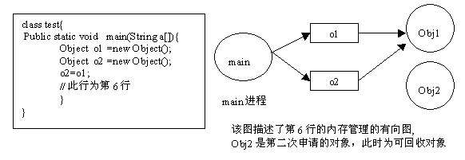

### 内存泄漏的原因

#### java的内存分配策略

Java 程序运行时的内存分配策略有三种,分别是静态分配,栈式分配,和堆式分配，对应的，三种存储策略使用的内存空间主要分别是静态存储区（也称方法区）、栈区和堆区。

- **静态存储区（方法区）**

  主要存放静态数据、全局 static 数据和常量。这块内存在程序编译时就已经分配好，并且在整个运行期间都存在

- **栈区**

  当方法被执行时，方法体内的局部变量（包括基础数据类型、对象的引用）都在栈上创建，并在方法执行结束时这些局部变量所持有的内存将会被自动释放。因为栈内存分配运算处于 CPU 的指令集中，效率很高，但是分配的内容量有限

- **堆区**

  动态内存分配，通常就是指在程序运行时直接 new 出来的内存，也就是对象的实例。这部分内存在不使用时将会由 Java 垃圾回收机制来进行回收

#### 栈与对的区别

在方法定义内的（局部变量）一些基本类型的变量和对象的引用变量都是在方法的栈内存中分配。当在一个方法块中定义一个变量时，java 就会在栈内存中为该变量分配内存空间，当超过该变量的作用域以后，该变量也就无效了，分配给它的内存空间也将被释放掉，该内存空间可以被重新的使用。

堆内存用来存放所有由 new 创建的对象（包括对象中所有的成员变量）和数组。在堆中分配内存，将由 Java 垃圾回收机制自动管理。在堆中产生了一个数组或对象后，还可以在栈中定义一个特殊的变量，这个变量的取值等于数组或者对象在堆内存中的首地址，这个特殊的变量就是我们上面说的引用变量。我们可以通过引用变量来访问堆中的对象和数组

##### 举例：

```java
public class Sample {
    int s1 = 0 ;
    Sample  mSample1 = new Sample();
    public void method(){
        int s2 = 1;
        Sample  mSample2 = new Sample();
    }
}
Sample  mSample3 = new Sample();
/*
Sample 类的局部变量 s2 和引用变量 mSample2 都是存在于栈中，但是 mSample2 指向的对象是在堆中。mSample3 指向的对象实体存放于堆上，包括这个对象所有的成员变量 s1 和 mSample1，而它自己mSample3存在于栈中。
*/
```

##### 结论：

局部变量的基本数据类型和引用变量存储于栈中，引用变量的实体存储于堆中。——因为它们属于方法中的变量。生命周期随方法而结束

成员变量全部存储于堆中（包括基本数据类型，引用和引用的实体对象）-------因为它们归属于类，类对象终究是要被 new 出来的。

#### java是如何管理内存的

java 的内存管理就是对象的分配和释放的问题。在 java 中，程序员需要通过关键字 new 为每个对象申请内存空间（基本类型除外），所有的对象都是在堆内存（Heap）中分配空间。另外。对象的释放是由 GC 决定和执行的。 在 java 中，内存的分配是由程序完成的，而内存的释放由 GC 完成，这种收支两条线的方法确实简化了程序员的工作。但是同时，也加重了 JVM 的工作。这也是 java 程序运行比较慢的原因之一。因为 GC 为了能够正确释放对象，GC 必须监控每一个对象的运行状态，包括对象的申请、引用、被引用、赋值等，GC 都需要进行监控。

监视对象状态是为了更加准确的，及时3的释放对象，而释放对象的根本原则就是该对象不再被引用。

为了更好的理解 GC 的工作原理，我们可以将对象考虑为有向图的顶点，将引用关系考虑为图的有向边有向边从引用者指向被引用对象。另外，每个线程对象可以作为一个图的起始顶点，例如大多数程序从 main 进程开始执行，那么该图就是以 main 进程定点开始的一棵根树。在这个有向图中，根顶点可达的对象都是有效对象，GC 将不回收这些对象。如果某个对象（连通子图）与这个根顶点不可达（该图为有向图），那么我们认为这些对象不再被引用，可以被 GC 回收。以下，我们举例说明如何用有向图表示内存管理。对于程序的每一个时刻，我们都用一个有向图表示 JVM 的内存分配情况。

以下右图就是左边程序运行到第六行的示意图。



java 使用有向图的方式进行内存管理，可以消除引用循环的问题，例如有三个对象，相互引用，只要他们和根进程不可达，那么 GC 就可以回收它们的。这种方式的优点是管理内存的精度很高，但是效率很低。另外一种常用的内存管理技术使用计数器，例如 com 模型采用计数器方式管理构件，它与有向图相对，精度很低（很难处理循环引用的问题），但是执行效率高。

#### 什么是 java 中的内存泄漏

在 java 中，内存泄漏就是存在一些被分配的对象，这些对象有下面两个特点，首先，这些对象是可达的，即在有向图中，存在通路可以与其相连；其次，这些对象是无用的，即程序以后不会再使用这些对象。如果对象满足这两个条件，这些对象就可以判定为 java 中的内存泄漏，这些对象不会被 GC 所回收，然而它却占用内存。

#### Android 中内存泄漏的原因

Android 的内存泄漏和 java 是一样的，即某个对象已经不需要再用了，但是它却没有被系统所回收，一直在内存中占用着空间，而导致它无法被回收的原因大多数是由于它被一个生命周期更长的对象引用。其实要分析 Android 中的内存泄漏的原因非常简单，只要理解一句话，那就是生命周期较长的对象持有生命周期短的对象的引用

##### 单例造成的内存泄漏

假如这样一个单例

```java
public class SingleTon {
    
    private static SingleTon singleTon;

    private Context context;

    private SingleTon(Context context) {
        this.context = context;
    }

    public static SingleTon getInstance(Context context) {
        if (singleTon == null) {
            synchronized (SingleTon.class) {
                if (singleTon == null) {
                    singleTon = new SingleTon(context);
                }
            }
        }
        return singleTon;
    }

}
//链接：https://www.jianshu.com/p/abee7c186bfa
```

这是单例模式饿汉式的双重校验锁的写法，这里的 singleTon 持有 Context 对象，如果 Activity 中调用 getInstance 方法并传入 this 时，singleTon 就持有了此 Activity 的引用，当退出 Activity 时，Activity 就无法回收，造成内存泄漏，所以应该修改它的构造方法

```java
private SingleTon(Context context) {
    this.context = context.getApplicationContext();
}
```

通过 getApplicationContext 来获取 Application 的Context，让它被单例持有，这样退出 Activity 时，Activity 对象就能够正常被回收了，而 Application 的 Context 的生命周期和单例的声明周期是一致的，整个App 运行过程中都不会发生内存泄漏。

##### 非静态内部类造成的内存泄漏

我们知道非静态内部类会持有外部类的引用，如果这个非静态内部类的生命周期比他的外部类的生命周期长，那么当销毁外部类的时候，它无法被回收，就会造成内存泄漏

##### 外部类中持有非静态内部类的静态对象

假设 Activity 的代码是这样的

```java
public class MainActivity extends AppCompatActivity {
    
    private static Test test;
    
    @Override
    protected void onCreate(Bundle savedInstanceState) {
        super.onCreate(savedInstanceState);
        setContentView(R.layout.activity_main);
        if (test == null) {
            test = new Test();
        }

    }
    
    private class Test {

    }
    
}
```

这个其实是和单例的原理是一样的，由于静态对象 test 的生命周期和整个应用的生命周期一致，而非静态内部类 Test 持有外部类 MainActivity 的引用，导致 MainActivity 退出的时候不能被回收，从而造成内存泄漏。或者 MainActivity 退出的时候不能被回收，从而造成内存泄漏，解决的办法也很简单，把 test 改成非静态，这样test 的生命周期和 MainActivity 是一样的了，就避免了内存泄漏。或者也可以把 Test 改成 静态内部类，让 test 不持有 MainActivity 的引用，不过一般没有这种操作

##### Handler 或 Runnable 作为非静态内部类

handler 和 runnable 都有定时器的功能，当它们作为非静态内部类的时候，同样会持有外部类的引用，如果它们的内部有操作的延迟，在延迟操作还没有发生的时候，销毁了外部类，那么外部类对象无法回收，从而造成内存泄漏 Activity 的代码

```java
public class MainActivity extends AppCompatActivity {
    
    @Override
    protected void onCreate(Bundle savedInstanceState) {
        super.onCreate(savedInstanceState);
        setContentView(R.layout.activity_main);
        
        new Handler().postDelayed(new Runnable() {
            @Override
            public void run() {
                
            }
        }, 10 * 1000);
    }
}
```

上面的代码，Handler 和 Runnable 作为匿名内部类，都会持有 MainActivity 的引用，而它内部有一个 10s 的定时器，如果 MainActivity 在10s 以内关闭了，那么由于 Handler 和 Runnable 的生命周期比 MainActivity 长，会导致MainActivity 无法被回收，从而导致内存泄漏。

那么这里避免内存泄漏的套路就是把 Handler 和 Runnable 定义为静态内部类，这样就不会再持有 MainActivity 的引用了，从而避免了内存泄漏

```java
public class MainActivity extends AppCompatActivity {

    private Handler handler;

    private Runnable runnable;

    @Override
    protected void onCreate(Bundle savedInstanceState) {
        super.onCreate(savedInstanceState);
        setContentView(R.layout.activity_main);

        handler = new TestHandler();
        runnable = new TestRunnable();
        handler.postDelayed(runnable, 10 * 1000);
    }

    private static class TestHandler extends Handler {

    }

    private static class TestRunnable implements Runnable {
        @Override
        public void run() {
            Log.d(TAG, "run: ");
        }
    }
    
    private static final String TAG = "MainActivity";
}

```

最好再在 onDestroy 调用的时候 调用 Handler 的 removeCallbacks 方法来移除 Message，这样不但避免了内存泄漏，而且在退出 Activity 的时候取消了定时器，保证 10s 以后也不会执行 run 方法

```java
@Override
protected void onDestroy() {
    super.onDestroy();
    handler.removeCallbacks(runnable);
}
```

还有一种情况是 Handler 和 Runnable 中持有 Context 对象，那么即使使用静态内部类，还是会发生内存泄漏

```java
public class MainActivity extends AppCompatActivity {

    private Handler handler;

    private Runnable runnable;

    @Override
    protected void onCreate(Bundle savedInstanceState) {
        super.onCreate(savedInstanceState);
        setContentView(R.layout.activity_main);

        handler = new TestHandler(this);
        runnable = new TestRunnable();
        handler.postDelayed(runnable, 10 * 1000);
    }

    private static class TestHandler extends Handler {
        private Context context;
        private TestHandler(Context context) {
            this.context = context;
        }
    }

    private static class TestRunnable implements Runnable {
        @Override
        public void run() {
            Log.d(TAG, "run: ");
        }
    }

    private static final String TAG = "MainActivity";
}
```

使用 leakcanary 工具会发现依然会发生内存泄漏，而造成内存泄漏的原因和之前用非静态内部类是一样的，那么为什么会出现这样的情况呢？

这是由于 Handler 持有了 Context 对象，而这个 Context 对象是通过 TestHandler 的构造方法传入的，它是一个 MainActivity 对象，也就是说，虽然 TestHandler 作为静态内部类不会持有外部类 MainActivity 的引用，但是我们在调用痛的构造方法的时候，自己传入了 MainActivity 的对象，从而 Handler 对象持有了 MainActivity 的引用， Handler 的生命周期比 MainActivity 的声明周期长，因此会造成内存泄漏，这种情况可以使用弱引用的方式来引用 Context 来避免内存泄漏

```java
public class MainActivity extends AppCompatActivity {

    private Handler handler;

    private Runnable runnable;

    @Override
    protected void onCreate(Bundle savedInstanceState) {
        super.onCreate(savedInstanceState);
        setContentView(R.layout.activity_main);

        handler = new TestHandler(new WeakReference<Context>(this));
        runnable = new TestRunnable();
        handler.postDelayed(runnable, 10 * 1000);
    }

    private static class TestHandler extends Handler {
        private Context context;
        private TestHandler(WeakReference<Context> weakContext) {
            context = weakContext.get();
        }
    }

    private static class TestRunnable implements Runnable {
        @Override
        public void run() {
            Log.d(TAG, "run: ");
        }
    }

    private static final String TAG = "MainActivity";
}
```

##### 其他内存泄漏的情况

还有一些内存泄漏的情况，比如 broadcastReceiver 未取消注册，InputStream 未关闭，这类内泄漏非常简单，只要在平时写代码的时候朵朵注意就可以避免。

##### 总结

造成 Android 内存泄漏的原因就是生命周期较长的对象持有了生命周期较短的对象的引用，只要理解了这一点，内存泄漏的问题就是迎刃而解了。

#### 应用

在 MVP 构架中，通常 Presenter 要同时持有 View 和 Model 的引用，如果在 Activity 退出的时候， Presenter 正在进行一个耗时操作，那么 Presenter 的生命周期比 Activity 长，导致 Activity 无法回收，造成内存泄漏

### 检测工具LeakCanary使用方法

#### 1、开始使用：

在 build.gradle 中加入引用，不同的编译使用不同的引用

```gradle
 dependencies {
   debugCompile 'com.squareup.leakcanary:leakcanary-android:1.3'
   releaseCompile 'com.squareup.leakcanary:leakcanary-android-no-op:1.3'
 }//可能还存在一个testCompile
```

在 application 中

```java
public class ExampleApplication extends Application {

  @Override public void onCreate() {
    super.onCreate();
    LeakCanary.install(this);
  }
}
```

如果检测到有内存泄漏，LeakCanary 就会显示一个通知

#### 源码分析

###### LeakCanary.install(this) 源码

```java
/**
   * Creates a {@link RefWatcher} that works out of the box, and starts watching activity
   * references (on ICS+).
   */
  public static RefWatcher install(Application application) {
    return install(application, DisplayLeakService.class,
        AndroidExcludedRefs.createAppDefaults().build());
  }
//重载的另一个函数 如下
/**
   * Creates a {@link RefWatcher} that reports results to the provided service, and starts watching
   * activity references (on ICS+).
   */
  public static RefWatcher install(Application application,
      Class<? extends AbstractAnalysisResultService> listenerServiceClass,
      ExcludedRefs excludedRefs) {
    //判断是否在Analyzer进程里
    if (isInAnalyzerProcess(application)) {
      return RefWatcher.DISABLED;
    }
    enableDisplayLeakActivity(application);
    HeapDump.Listener heapDumpListener =
        new ServiceHeapDumpListener(application, listenerServiceClass);
    RefWatcher refWatcher = androidWatcher(application, heapDumpListener, excludedRefs);
    ActivityRefWatcher.installOnIcsPlus(application, refWatcher);
    return refWatcher;
  }
/*
因为 LeakCanary 会开启一个远程 Service 用来分析每次内存泄漏，Android的应用每次开启进程都会调用 Application 的 onCreate 方法，因此有必要先预判此次 Application 启动是不是在 analyze Service 启动时，
*/
/*
判断Application是否是在service进程里面启动，最直接的方法就是判断当前进程名和service所属的进程是否相同。当前进程名的获取方式是使用ActivityManager的getRunningAppProcessInfo方法，找到进程pid与当前进程pid相同的进程，然后从中拿到processName. service所属进程名。获取service应处进程的方法是用PackageManager的getPackageInfo方法。
*/
public static boolean isInServiceProcess(Context context, Class<? extends Service> serviceClass) {
    PackageManager packageManager = context.getPackageManager();
    PackageInfo packageInfo;
    try {
      packageInfo = packageManager.getPackageInfo(context.getPackageName(), GET_SERVICES);
    } catch (Exception e) {
      Log.e("AndroidUtils", "Could not get package info for " + context.getPackageName(), e);
      return false;
    }
    String mainProcess = packageInfo.applicationInfo.processName;

    ComponentName component = new ComponentName(context, serviceClass);
    ServiceInfo serviceInfo;
    try {
      serviceInfo = packageManager.getServiceInfo(component, 0);
    } catch (PackageManager.NameNotFoundException ignored) {
      // Service is disabled.
      return false;
    }

    if (serviceInfo.processName.equals(mainProcess)) {
      Log.e("AndroidUtils",
          "Did not expect service " + serviceClass + " to run in main process " + mainProcess);
      // Technically we are in the service process, but we're not in the service dedicated process.
      return false;
    }

    //查找当前进程名
    int myPid = android.os.Process.myPid();
    ActivityManager activityManager =
        (ActivityManager) context.getSystemService(Context.ACTIVITY_SERVICE);
    ActivityManager.RunningAppProcessInfo myProcess = null;
    for (ActivityManager.RunningAppProcessInfo process : activityManager.getRunningAppProcesses()) {
      if (process.pid == myPid) {
        myProcess = process;
        break;
      }
    }
    if (myProcess == null) {
      Log.e("AndroidUtils", "Could not find running process for " + myPid);
      return false;
    }

    return myProcess.processName.equals(serviceInfo.processName);
  }
```

###### RefWatcher 

RefWatcher 是 LeakCanary 检测内存泄漏的发起点。使用方法为，在生命周期即将结束的时候调用

```java
RefWatcher.watch(Object object)
```

为了达到检测的目的，RefWatcher 需要

```java
//执行内存泄漏检测的 executer  
private final Executor watchExecutor;
//用于查询是否正在调试中，调试中不会进行内存泄漏检测
private final DebuggerControl debuggerControl;
//用于在内存泄漏钱，再给一次 GC 的机会
private final GcTrigger gcTrigger;
//用于在产生内存泄漏时执行dump 内存heap
private final HeapDumper heapDumper;
//持有那些待检测以及产生内存泄漏的引用的key
private final Set<String> retainedKeys;
//用来判断弱引用所持有的对象是否 GC
private final ReferenceQueue<Object> queue;
//用于分析产生的 dump 文件，找到内存泄漏的原因
private final HeapDump.Listener heapdumpListener;
//用于排除某些系统 bug 导致的内存泄漏
private final ExcludedRefs excludedRefs;
```

接下来我们看看 watch 函数背后是如何利用这些工具，生成内存泄漏分析报告的

```java
public void watch(Object watchedReference, String referenceName) {
    checkNotNull(watchedReference, "watchedReference");
    checkNotNull(referenceName, "referenceName");
    //如果处于debug模式，则直接返回
    if (debuggerControl.isDebuggerAttached()) {
      return;
    }
    //记住开始观测的时间
    final long watchStartNanoTime = System.nanoTime();
    //生成一个随机的key，并加入set中
    String key = UUID.randomUUID().toString();
    retainedKeys.add(key);
    //生成一个KeyedWeakReference
    final KeyedWeakReference reference =
        new KeyedWeakReference(watchedReference, key, referenceName, queue);
    //调用watchExecutor，执行内存泄露的检测 核心函数
    watchExecutor.execute(new Runnable() {
      @Override public void run() {
        ensureGone(reference, watchStartNanoTime);
      }
    });
  }
```

所以最后的核心函数是在ensureGone这个runnable里面。要理解其工作原理，就得从keyedWeakReference说起

###### WeakReference与ReferenceQueue

从 watche 函数中可以看到，每次检测对象内存是否泄漏的时候，我们都会生成一个 keyReferenceQueue，这个类其实就是一个 WeakReference，只不过额外附带了一个 key  和 name 

```java
final class KeyedWeakReference extends WeakReference<Object> {
  public final String key;
  public final String name;

  KeyedWeakReference(Object referent, String key, String name,
      ReferenceQueue<Object> referenceQueue) {
    super(checkNotNull(referent, "referent"), checkNotNull(referenceQueue, "referenceQueue"));
    this.key = checkNotNull(key, "key");
    this.name = checkNotNull(name, "name");
  }
}
```

在构造时，我们需要传入一个 ReferenceQueue，这个ReferenceQueue是直接传入了 WeakReference中，关于这个类，有兴趣的可以直接看 Reference 的源码，我们需要知道的是，每次 WeakReference 所指向的对象被 GC 后，这个弱引用都会被放入这个与之相关联的 ReferenceQueue 队列中。

我们这里贴一下核心代码

```java
private static class ReferenceHandler extends Thread {

        ReferenceHandler(ThreadGroup g, String name) {
            super(g, name);
        }

        public void run() {
            for (;;) {
                Reference<Object> r;
                synchronized (lock) {
                    if (pending != null) {
                        r = pending;
                        pending = r.discovered;
                        r.discovered = null;
                    } else {
                        //....
                        try {
                            try {
                                lock.wait();
                            } catch (OutOfMemoryError x) { }
                        } catch (InterruptedException x) { }
                        continue;
                    }
                }

                // Fast path for cleaners
                if (r instanceof Cleaner) {
                    ((Cleaner)r).clean();
                    continue;
                }

                ReferenceQueue<Object> q = r.queue;
                if (q != ReferenceQueue.NULL) q.enqueue(r);
            }
        }
    }

    static {
        ThreadGroup tg = Thread.currentThread().getThreadGroup();
        for (ThreadGroup tgn = tg;
             tgn != null;
             tg = tgn, tgn = tg.getParent());
        Thread handler = new ReferenceHandler(tg, "Reference Handler");
        /* If there were a special system-only priority greater than
         * MAX_PRIORITY, it would be used here
         */
        handler.setPriority(Thread.MAX_PRIORITY);
        handler.setDaemon(true);
        handler.start();
    }
```

在 Reference 类加载的时候，java虚拟机会创建一个最大优先级的后台线程，这个线程的工作原理就是不断检测 pending 是否为null，如果不为 null，就将其放入 Referencequeue 中pending 不为 null 的情况就是，引用指向的对象已被 GC，变为不可达。

那么只要我们在构造弱引用的时候指定了 ReferenceQueue，每当弱引用所指向的对象被内存回收的时候，我们就可以在queue中找到这个引用。如果我们期望一个对象被回收，那如果在接下来的预期时间之后，我们发现它依然没有出现在 referenceQueue 中，就可以判断它的内存泄漏了。 LeakCanary 的核心原理就是在这里 

其实 java 里面的 WeaHashMap 里也用到了这种方法 ，来判断 hash 表里的某个键值是否还有效。在构造 WeakReference 的时候给其指定的 ReferenceQueue。

##### 2、监测时机

什么时候监测能判定内存泄漏呢？这个可以看 AndroidWatchExecutor 的实现

```java
public final class AndroidWatchExecutor implements Executor {
    //....    
    private void executeDelayedAfterIdleUnsafe(final Runnable runnable) {
        // This needs to be called from the main thread.
        Looper.myQueue().addIdleHandler(new MessageQueue.IdleHandler() {
          @Override public boolean queueIdle() {
            backgroundHandler.postDelayed(runnable, DELAY_MILLIS);
            return false;
          }
        });
      }
  }

```

这里又看到一个比较少的用法，idleHandler，idleHandler 的原理就是在 messageQueue 因为空闲等待消息是给使用这一个 hook。那 AndroidWatchExecutor 会在主线程空闲的时候，派发一个任务，这个后台任务会在 DELAY_MILLS 时间之后执行。LeakCanary 设置是5s。

##### 3、二次确认保证内存泄漏的正确性

为了避免 GC 不及时带来的误判，LeakCanary 会进行二次确认加以保证

```java
void ensureGone(KeyedWeakReference reference, long watchStartNanoTime) {
    long gcStartNanoTime = System.nanoTime();
    //计算从调用watch到进行检测的时间段
    long watchDurationMs = NANOSECONDS.toMillis(gcStartNanoTime - watchStartNanoTime);
    //根据queue移除已被GC的对象的弱引用
    removeWeaklyReachableReferences();
    //如果内存已被回收或者处于debug模式，直接返回
    if (gone(reference) || debuggerControl.isDebuggerAttached()) {
      return;
    }
    //如果内存依旧没被释放，则再给一次gc的机会
    gcTrigger.runGc();
    //再次移除
    removeWeaklyReachableReferences();
    if (!gone(reference)) {
      //走到这里，认为内存确实泄露了
      long startDumpHeap = System.nanoTime();
      long gcDurationMs = NANOSECONDS.toMillis(startDumpHeap - gcStartNanoTime);
      //dump出heap报告
      File heapDumpFile = heapDumper.dumpHeap();

      if (heapDumpFile == HeapDumper.NO_DUMP) {
        // Could not dump the heap, abort.
        return;
      }
      long heapDumpDurationMs = NANOSECONDS.toMillis(System.nanoTime() - startDumpHeap);
      heapdumpListener.analyze(
          new HeapDump(heapDumpFile, reference.key, reference.name, excludedRefs, watchDurationMs,
              gcDurationMs, heapDumpDurationMs));
    }
  }

  private boolean gone(KeyedWeakReference reference) {
    return !retainedKeys.contains(reference.key);
  }

  private void removeWeaklyReachableReferences() {
    // WeakReferences are enqueued as soon as the object to which they point to becomes weakly
    // reachable. This is before finalization or garbage collection has actually happened.
    KeyedWeakReference ref;
    while ((ref = (KeyedWeakReference) queue.poll()) != null) {
      retainedKeys.remove(ref.key);
    }
  }
```

##### Dump Heap

监测到内存泄漏后，首先做的就是 dump 出当前的 heap，默认的 AndroidHeapDumper 调用的是

```java
Debug.dumpHprofData(filePath);
```

dump当前内存的 hprof 分析文件，一般我们在 DeviceMonitor 中也可以 dump 出 hprof 文件，然后将其从 Dalvik 格式转成标准 jvm 格式，然后使用 MAT 进行分析。

那么 LeakCanary 是如何分析内存泄漏的呢？

##### LeakCanary -- HaHa 内存泄漏分析工具

LeakCanary 分析内存泄露用到了一个和Mat类似的工具叫做[HaHa](https://link.jianshu.com/?t=https://github.com/square/haha)，使用HaHa的方法如下：

```java
public AnalysisResult checkForLeak(File heapDumpFile, String referenceKey) {
    long analysisStartNanoTime = System.nanoTime();

    if (!heapDumpFile.exists()) {
      Exception exception = new IllegalArgumentException("File does not exist: " + heapDumpFile);
      return failure(exception, since(analysisStartNanoTime));
    }

    try {
      HprofBuffer buffer = new MemoryMappedFileBuffer(heapDumpFile);
      HprofParser parser = new HprofParser(buffer);
      Snapshot snapshot = parser.parse();

      Instance leakingRef = findLeakingReference(referenceKey, snapshot);

      // False alarm, weak reference was cleared in between key check and heap dump.
      if (leakingRef == null) {
        return noLeak(since(analysisStartNanoTime));
      }

      return findLeakTrace(analysisStartNanoTime, snapshot, leakingRef);
    } catch (Throwable e) {
      return failure(e, since(analysisStartNanoTime));
    }
  }
```

关于HaHa的原理，感兴趣的同学可以深究，这里就不深入介绍了。

返回的ActivityResult对象中包含了对象到GC root的最短路径。LeakCanary在dump出hprof文件后，会启动一个IntentService进行分析：HeapAnalyzerService在分析出结果之后会启动DisplayLeakService用来发起Notification 以及将结果记录下来写在文件里面。以后每次启动LeakAnalyzerActivity就从文件里读取历史结果。

##### ExcludedRef

由于某些系统的bug，以及某些厂商rom的bug，Activity在finish之后仍然会被某些系统组件给hold住。LeakCanary列出了一些很常见的，比如三星的手机activity会被audioManager给hold住，试了一下huawei的系统貌似也会出现，还有比如activity中如果有会获取键盘焦点的view，在activity finish之后view会被InputMethodManager给hold住，因为view会持有activity 造成activity泄漏，除非有新的view获取键盘焦点。

LeakCanary中有一个AndroidExcludedRefs枚举类，其中枚举了很多特定版本系统issue引起的内存泄漏，因为这种问题 不是开发者导致的，因此HeapAnalyzerService在分析内存泄露时，会将这些GC Root排除在外。而且每个ExcludedRef通常都跟特定厂商或者Android版本有关，这些枚举类都加了一个适用条件。

```java
AndroidExcludedRefs(boolean applies) {  this.applies = applies;}

   AUDIO_MANAGER__MCONTEXT_STATIC(SAMSUNG.equals(MANUFACTURER) && SDK_INT == KITKAT) {
    @Override void add(ExcludedRefs.Builder excluded) {
      // Samsung added a static mContext_static field to AudioManager, holds a reference to the
      // activity.
      // Observed here: https://github.com/square/leakcanary/issues/32
      excluded.staticField("android.media.AudioManager", "mContext_static");
    }
  },
```

比如上面这个AudioManager引起的问题，只有在Build中的MANUFACTURER表明是三星以及sdk版本是KITKAT（4.4, 19)时才适用。

##### 手动释放资源

然后并不是leakCanary不报错我们就不用管，activity内存泄露了，大部分情况下没多大事，但是有些占用内存很多的页面，比如图库，webview页面，因为acitivity不能回收，它所指向的view以及view下面的bitmap都不能被回收，这是会造成很不好的后果的，很可能会导致OOM，因此我们需要手动在Activity结束时回收资源。

##### Under 4.0 & Fragment

LeakCanary只支持4.0以上，原因是其中在watch 每个Activity时适用了Application的**registerActivityLifecycleCallback**函数，这个函数只在4.0上才支持，但是在4.0以下也是可以用的，可以在Application中将返回的RefWatcher存下来，然后在基类Activity的onDestroy函数中调用。

同理，如果我们想检测Fragment的内存的话，我们也阔以在Fragment的onDestroy中watch它。

#### 2、如何使用

使用 RefWatcher 监控那些本该回收的对象

```java
RefWatcher refWatcher = {...};
// 监控
refWatcher.watch(schrodingerCat);
```

`LeakCanary.install()` 会返回一个预定义的 `RefWatcher`，同时也会启用一个 `ActivityRefWatcher`，用于自动监控调用 `Activity.onDestroy()` 之后泄露的 activity。

```java
public class ExampleApplication extends Application {
  public static RefWatcher getRefWatcher(Context context) {
    ExampleApplication application = (ExampleApplication) context.getApplicationContext();
    return application.refWatcher;
  }
  private RefWatcher refWatcher;
  @Override public void onCreate() {
    super.onCreate();
    refWatcher = LeakCanary.install(this);
  }
}
```

使用 `RefWatcher` 监控 Fragment：

```java
public abstract class BaseFragment extends Fragment {

  @Override public void onDestroy() {
    super.onDestroy();
    RefWatcher refWatcher = ExampleApplication.getRefWatcher(getActivity());
    refWatcher.watch(this);
  }
}
```

#### 3、工作机制

1. `RefWatcher.watch()` 创建一个 [KeyedWeakReference](https://github.com/square/leakcanary/blob/master/library/leakcanary-watcher/src/main/java/com/squareup/leakcanary/KeyedWeakReference.java) 到要被监控的对象。
2. 然后在后台线程检查引用是否被清除，如果没有，调用GC。
3. 如果引用还是未被清除，把 heap 内存 dump 到 APP 对应的文件系统中的一个 `.hprof` 文件中。
4. 在另外一个进程中的 `HeapAnalyzerService` 有一个 `HeapAnalyzer` 使用[HAHA](https://github.com/square/haha) 解析这个文件。
5. 得益于唯一的 reference key, `HeapAnalyzer` 找到 `KeyedWeakReference`，定位内存泄露。
6. `HeapAnalyzer` 计算 *到 GC roots 的最短强引用路径*，并确定是否是泄露。如果是的话，建立导致泄露的引用链。
7. 引用链传递到 APP 进程中的 `DisplayLeakService`， 并以通知的形式展示出来。

#### 4、如何复制 leak trace

在 Logcat 中，你可以看到类似这样的 leak trace：

```verilog
In com.example.leakcanary:1.0:1 com.example.leakcanary.MainActivity has leaked:

* GC ROOT thread java.lang.Thread.<Java Local> (named 'AsyncTask #1')
* references com.example.leakcanary.MainActivity$3.this$0 (anonymous class extends android.os.AsyncTask)
* leaks com.example.leakcanary.MainActivity instance

* Reference Key: e71f3bf5-d786-4145-8539-584afaecad1d
* Device: Genymotion generic Google Nexus 6 - 5.1.0 - API 22 - 1440x2560 vbox86p
* Android Version: 5.1 API: 22
* Durations: watch=5086ms, gc=110ms, heap dump=435ms, analysis=2086ms
```

你甚至可以通过分享按钮把这些东西分享出去。

#### 5、SDK 导致的内存泄漏

随着时间的推移，很多SDK 和厂商 ROM 中的内存泄露问题已经被尽快修复了。但是，当这样的问题发生时，一般的开发者能做的事情很有限。

LeakCanary 有一个已知问题的忽略列表，[AndroidExcludedRefs.java](https://github.com/square/leakcanary/blob/master/library/leakcanary-android/src/main/java/com/squareup/leakcanary/AndroidExcludedRefs.java)，如果你发现了一个新的问题，[请提一个 issue](https://github.com/square/leakcanary/issues/new) 并附上 leak trace, reference key, 机器型号和 SDK 版本。如果可以附带上 dump 文件的 链接那就再好不过了。

对于**最新发布的 Android**，这点尤其重要。你有机会在帮助在早期发现新的内存泄露，这对整个 Android 社区都有极大的益处。

开发版本的 Snapshots 包在这里： [Sonatype's `snapshots` repository](https://oss.sonatype.org/content/repositories/snapshots/)。

#### 6、leak trace 之外

有时，leak trace 不够，你需要通过 [MAT](http://eclipse.org/mat/) 或者 [YourKit](https://www.yourkit.com/) 深挖 dump 文件。

通过以下方法，你能找到问题所在：

1. 查找所有的 `com.squareup.leakcanary.KeyedWeakReference` 实例。
2. 检查 `key` 字段
3. Find the `KeyedWeakReference` that has a `key` field equal to the reference key reported by LeakCanary.
4. 找到 key 和 和 logcat 输出的 key 值一样的 `KeyedWeakReference`。
5. `referent` 字段对应的就是泄露的对象。
6. 剩下的，就是动手修复了。最好是检查到 GC root 的最短强引用路径开始。