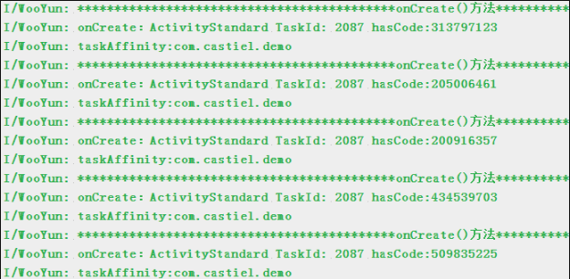

对安卓而言，Activity有四种启动模式，它们是：

- standard 标准模式，每次都新建一个实例对象（普通activity）
- singleTop 如果在任务栈顶发现了相同的实例则重用，否则新建并压入栈顶（要展示推送过来的消息）
- singleTask 如果在任务栈中发现了相同的实例，将其上面的任务终止并移除，重用该实例。否则新建实例并入栈（程序入口等启动页面）
- singleInstance 允许不同应用，进程线程等共用一个实例，无论从何应用调用该实例都重用（完全独立的，类似闹钟的提示）

> 标准模式在每次启动时, 都会创建实例; 三种单例模式, 会根据情况选择创建还是复用实例. 在Activity启动中, 创建实例的生命周期: onCreate -> onStart -> onResume; 重用实例的生命周期: onNewIntent -> onResume.
>
> 在AndroidManifest的Activity中, 使用launchMode属性, 可以设置启动模式, 默认是standard模式; 使用taskAffinity属性, 并添加包名, 可以设置Activity栈, 默认是当前包名, 只能应用于single模式.

```java
import android.content.Intent;
import android.content.pm.ActivityInfo;
import android.content.pm.PackageManager;
import android.support.v7.app.AppCompatActivity;
import android.os.Bundle;
import android.util.Log;
/**
 *
 * 方便打印的基础Activity
 */
public class BaseActivity extends AppCompatActivity {

@Override
protected void onCreate(Bundle savedInstanceState) {
super.onCreate(savedInstanceState);
        Log.i("WooYun", "*****onCreate()方法******");
        Log.i("WooYun", "onCreate：" + getClass().getSimpleName() + " TaskId: " + getTaskId() + " hasCode:" + this.hashCode());
        dumpTaskAffinity();
    }

@Override
protected void onNewIntent(Intent intent) {
super.onNewIntent(intent);
        Log.i("WooYun", "*****onNewIntent()方法*****");
        Log.i("WooYun", "onNewIntent：" + getClass().getSimpleName() + " TaskId: " + getTaskId() + " hasCode:" + this.hashCode());
        dumpTaskAffinity();
    }

protected void dumpTaskAffinity(){
try {
            ActivityInfo info = this.getPackageManager()
                    .getActivityInfo(getComponentName(), PackageManager.GET_META_DATA);
            Log.i("WooYun", "taskAffinity:"+info.taskAffinity);
        } catch (PackageManager.NameNotFoundException e) {
            e.printStackTrace();
        }
    }
}
```


### 1、Standard - 默认模式

这个模式是默认的启动模式，即标准模式，在不指定启动模式的前提下，系统默认使用该模式启动Activity，每次启动一个Activity都会重写创建一个新的实例，不管这个实例存不存在，这种模式下，谁启动了该模式的Activity，该Activity就属于启动它的Activity的任务栈中。这个Activity它的onCreate()，onStart()，onResume()方法都会被调用。

#### 配置形式：

```xml
<activity android:name=".standard.StandardActivity" android:launchMode="standard" >
```

#### 使用案例： 

​       对于standard模式，android:launchMode可以不进行声明，因为默认就是standard。 

​       StandardActivity 的代码如下，入口Activity中有一个按钮进入该Activity，这个Activity中又有一个按钮启动StandardActivity。

```java
import android.content.Intent;
import android.os.Bundle;
import android.view.View;
import android.widget.Button;
/**
 * Standard模式
*/
public class ActivityStandard extends BaseActivity  {
private Buttonjump;
@Override
protected void onCreate(Bundle savedInstanceState) {
super.onCreate(savedInstanceState);
        setContentView(R.layout.activity_standard);
jump= (Button) findViewById(R.id.btn_standard);
jump.setOnClickListener(new View.OnClickListener() {
@Override
public void onClick(View v) {
                Intent intent = new Intent(ActivityStandard.this, ActivityStandard.class);
                startActivity(intent);
            }
        });
    }
}
/*
操作：进入到 StandardActivity 之后，再点击 Standard 的按钮，再按四次返回键不断的返回
*/
```




可以看到日志输出了四次StandardActivity的和一次MainActivity的，从MainActivity进入StandardActivity一次，后来我们又按了三次按钮，总共四次StandardActivity的日志，并且所属的任务栈的id都是2087，这也验证了谁启动了该模式的Activity，该Activity就属于启动它的Activity的任务栈中这句话，因为启动StandardActivity的是MainActivity，而MainActivity的taskId是2087，因此启动的StandardActivity也应该属于id为2087的这个task，后续的3个StandardActivity是被StandardActivity这个对象启动的，因此也应该还是2087，所以taskId都是2087。并且每一个Activity的hashcode都是不一样的，说明他们是不同的实例，即“每次启动一个Activity都会重写创建一个新的实例”

### 2、singleTop - 栈顶复用模式

这个模式下，如果新的activity已经位于栈顶，那么这个Activity不会被重写创建，同时它的onNewIntent方法会被调用，通过此方法的参数我们可以去除当前请求的信息。如果栈顶不存在该Activity的实例，则情况与standard模式相同。需要注意的是这个Activity它的onCreate()，onStart()方法不会被调用，因为它并没有发生改变。

#### 配置形式：

```xml
<activity android:name=".singletop.SingleTopActivity" android:launchMode="singleTop">
```

#### 使用案例：

ActivitySingleTop.java

```java
public class ActivitySingleTop extends BaseActivity {
private Button jump,jump2;
@Override
protected void onCreate(Bundle savedInstanceState) {
super.onCreate(savedInstanceState);
        setContentView(R.layout.activity_singletop);
jump = (Button) findViewById(R.id.btn_singletop);
jump2 = (Button) findViewById(R.id.btn_other);
jump.setOnClickListener(new View.OnClickListener() {
@Override
public void onClick(View v) {
                Intent intent = new Intent(ActivitySingleTop.this, ActivitySingleTop.class);
                startActivity(intent);
            }
        });
jump2.setOnClickListener(new View.OnClickListener() {
@Override
public void onClick(View v) {
                Intent intent = new Intent(ActivitySingleTop.this, OtherTopActivity.class);
                startActivity(intent);
            }
        });
    }
```

OtherTopActivity.java

```java
import android.content.Intent;
import android.os.Bundle;
import android.view.View;
import android.widget.Button;

/**
 * Created by huangshuai on 2016/5/23.
 * Email：huangshuai@wooyun.org
 */
public class OtherTopActivity extends BaseActivity {
private Button jump;
@Override
protected void onCreate(Bundle savedInstanceState) {
super.onCreate(savedInstanceState);
        setContentView(R.layout.activity_other);

jump= (Button) findViewById(R.id.btn_other);
jump.setOnClickListener(new View.OnClickListener() {
@Override
public void onClick(View v) {
                Intent intent = new Intent(OtherTopActivity.this, ActivitySingleTop.class);
                startActivity(intent);
            }
        });
    }
}
```


​	我们看到，除了第一次进入SingleTopActivity这个Activity时，输出的是onCreate方法中的日志，后续的都是调用了onNewIntent方法，并没有调用onCreate方法，并且四个日志的hashcode都是一样的，说明栈中只有一个实例。这是因为第一次进入的时候，栈中没有该实例，则创建，后续的三次发现栈顶有这个实例，则直接复用，并且调用onNewIntent方法。那么假设栈中有该实例，但是该实例不在栈顶情况又如何呢？ 

​       我们先从MainActivity中进入到SingleTopActivity，然后再跳转到OtherActivity中，再从OtherActivity中跳回SingleTopActivity，再从SingleTopActivity跳到SingleTopActivity中，看看整个过程的日志。

### 3、singleTask

### 4、singleInstance