# C语言基础

xcode 的 运行原理：

- 源代码：程序员写好的代码
- 编译：把源代码翻译成机器语言（二进制）生成一个 .o 目标文件
- 链接：把目标文件和函数库整合生成一个 .out 可执行文件

### 数据类型

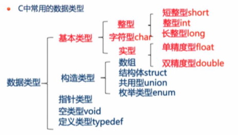

## 常用代码规范和运算规则

### C语言注释的介绍和使用

同 java objective-c

### print函数

printf 函数是一个标准的函数库，需要引用 头文件“ stdio.h” ,所有的函数库在使用的时候都需要引用函数库。

printf 函数调用

```c
int main (int argc,const char * argv[]){
    //输出一个数
    int a = 23 ;
    printf("输出一个数 a = %d \n",a);
    return 0;
}
//输出一个数 a = 23
```


一般形式： printf("格式控制字符串",输出列表);

**格式字符串** 以%开头的字符串，在%后面跟有各种格式字符，可以用来说明输出数据的 类型、形式、长度、小数位等

“%d”表示按十进制整型输出;

 “%ld”表示按十进制长整型输出; 

“%c”表示按字符型输出等。 

| 格式字符 | 意义                                             |
| -------- | ------------------------------------------------ |
| d        | 以十进制的形式输出带符号的整数（正数不输出符号） |
| o        | 以八进制的形式输出无符号的整数（不输出前缀0）    |
| x, X     | 以十六进制的形式输出无符号的整数（不输出前缀0X） |
| u        | 以十进制的形式输出无符号的整数                   |
| f        | 以小数形式输出单、双精度实数                     |
| e, E     | 以指数形式输出单、双精度实数                     |
| g, G     | 以 %f 和 %e 中 较短的输出宽度输出单、双精度实数  |
| c        | 输出单个字符                                     |
| s        | 输出字符串                                       |
| p        | 指针 point 的缩写                                |

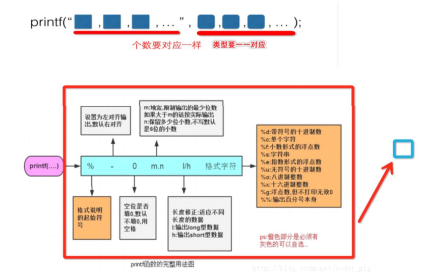

#### 注意事项

##### 域宽问题

%d：安整型数据的实际长度输出

%md: m 代表域宽 ，打印出来以后，在控制台上，显示 m 位

如果我们要打印的数的位数如果超过我们设定 m 则 原样输出
如果我们要打印的数的位数如果小于我们设定的位数,则补空白,具体如下:
如果m为正数,则左对齐(左侧补空白) 如果m为负数,则右对齐(右侧补空白)

%m.nf 保留小数点前面m位 后面n位

##### 关于转义字符

关于 printf 函数的进一步说明：

如果想输出字符 “%”，则应该在“格式控制”字符串中用连续的两个 % 表示 如：
printf("%f%%", 1.0/3);
输出0.333333%。


| 符号 | 意义                                             |
| ---- | ------------------------------------------------ |
| \n   | 换行，相当于敲一下回车                           |
| \t   | 调到下一个 tab 位置，相当于按一下键盘上的 tab 键 |
| \b   | 退格，相当于按一下 空格                          |
| \r   | 使光标回到本行开头                               |
| \f   | 换页，光标移到下页开头                           |
| \\\  | 输出\字符,也就是在屏幕上显示一个\字符            |
| \\'  | 输出'字符,也就是在屏幕上显示一个'字符            |
| \\"  | 输出"字符,也就是在屏幕上显示一个"字符            |


### scanf函数

scanf函数原型包含在标准输入输出头文件“stdio.h”中,用于接受键盘输入的内容。 

格式:scanf("格式控制字符串",输入项地址列表); 如:
 int age=-1;
 scanf("输入age %d",&age); 

#### 格式控制字符串

规定数据输入的格式，由格式控制符和普通字符组成，格式控制符和百分号(%)一起使用，用来说明输入数据的数据类型（格式字符）

常见的格式控制符：

| 格式                | 意义                                         |
| ------------------- | -------------------------------------------- |
| %d                  | 输入一个十进制整数                           |
| %o                  | 输入一个八进制整数                           |
| %x                  | 输入一个十六进制整数                         |
| %i                  | 输入一个有符号或无符号的十、八、十六进制整数 |
| %u                  | 输入一个无符号的十进制整数                   |
| %f、%e 或%E、%g或%G | 输入一个小数形式或指数形式的浮点数           |
| %c                  | 输入一个字符                                 |
| %s                  | 输入一个字符串                               |

#### 输入项地址列表

需要接收数据的标量地址，这些输入项与格式控制字符串在类型和数量上要对应，当有多个输入项时，各个地址名之间以逗号“，”分隔。输入格式和变量类型要一致。

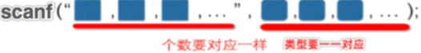

#### 原理：

#### scanf 注意事项

1. %d%d%d"是按十进值格式输入三个数值。输入时，在两个数据之间可以用一个或多个空
   格、tab键、回车键分隔

   ```c
   #include "stdio.h"
   int main(void)
   {
       int a = 0,b = 0,c = 0;
       scanf("%d%d%d",&a,&b,&c);
       printf("%d,%d,%d\n",a,b,c);
       return 0;
   }
   ```

   运行时按如下的方式输出值

   ```
   3 4 5 //有空格
   3, 4, 5//printf输出的值
   
   ```

2. 域宽

   可以用一个十进制指数指定输入数据宽度，系统自动按域宽截取输入数据

   ```c
   int main(int argc, const char * argc[]){
       int a;
       scanf("%5d",&a);
       printf("%d\n",a);
       return 0;
   }
   ```

   输出：

   ```
   输入：123456789
   输出：12345 //只读取了 5 位
   ```

### 关键字标识符

就是已经被 C 语言使用 不能再作为其他用途的字符

#### 关键字分类

**数据类型关键字**

- **基本数据类型**

  | 关键字 | 含义                                                      |
  | ------ | --------------------------------------------------------- |
  | void   | 声明函数无返回值/无参数，声明无类型指针，显示丢弃运算结果 |
  | char   | 字符类型数据，属于整型数据的一种                          |
  | int    | 整型数据通常编译为指定的机器字长                          |
  | float  | 单精度浮点型数据                                          |
  | double | 多精度浮点型数据                                          |

- **类型修饰关键字**

  | 关键字   | 含义                                     |
  | -------- | ---------------------------------------- |
  | short    | 修饰 int，短整型数据，可省略被修饰的 int |
  | long     | 修饰 int，长整型数据，可省略被修饰的 int |
  | signed   | 修饰整型数据，有符号数据类型             |
  | unsigned | 修饰整型数据，无符号数据类型             |

- **复杂类型关键字（5）**

  | 关键字  | 含义                         |
  | ------- | ---------------------------- |
  | struct  | 结构体声明                   |
  | union   | 共用体声明                   |
  | enum    | 枚举声明                     |
  | typedef | 生命类型别名                 |
  | sizeof  | 得到特定类型或特定变量的大小 |

- **存储级别关键字**（6）

  | 关键字   | 含义                                                         |
  | -------- | ------------------------------------------------------------ |
  | auto     | 指定为自动变量，由编译器自动分配与释放。通常在栈上分配       |
  | static   | 指定为静态变量，分配在静态变量区，修饰函数时，指定函数作用域为文件内部 |
  | register | 指定为寄存器变量，建议编译器将变量存储到寄存器中使用们也可以修饰函数形参，建议编译器通过寄存器而不是堆栈传递参数 |
  | extern   | 指定对应变量为外部变量，即标识变量或者函数的定义为别的文件，表示编译器在遇到此变量和函数时在其他模块中寻找其定义 |
  | const    | 与 Volatile 合称“cv特性”，特指变量不可被当前线程/进程改变（但有可能被系统或其他线程/进程改变） |
  | Volatile | 与 const 合称“cv特性”，指定变量的值有可能被系统或其他进程/线程改变，强制编译器每次从内存中取得该变量的值 |

**流程控制关键字**

- **跳转结构**

  | 关键字   | 含义                                               |
  | -------- | -------------------------------------------------- |
  | return   | 用在函数体中，返回特定的值（或是 void ，即不返回） |
  | continue | 结束当前循环进入下一循环                           |
  | break    | 跳出当前循环或switch结构                           |
  | goto     | 无条件跳转语句                                     |

- **分支机构**

  | 关键字  | 含义                         |
  | ------- | ---------------------------- |
  | if      | 条件语句，后面无需分号       |
  | else    | 条件语句否定分支，与else连用 |
  | switch  | 开关语句，多重分支语句       |
  | case    | 开关语句中的分支             |
  | default | 开关语句中的其它分支         |

- **循环结构**

  | 关键字 | 含义                                                         |
  | ------ | ------------------------------------------------------------ |
  | for    | for循环结构，for(1;2;3)4; 执行顺序为 1→2→4→3→2...循环，其中2为循环条件，在整个 for 循环中，表达式 1 只计算一次，表达式2和表达式3则可能计算多次，也可能一次也不计算。循环体可多次执行，或不执行 |
  | do     | do 循环结构，do 1 while(2); 执行顺序 1→2→1...循环，2为循环条件 |
  | while  | while：while 循环结构，while(1) 2; 执行顺序是 1→2→1...循环，1 为循环条件，以上循环语句，当循环条件表达式为真继续执行，为假则跳出循环 |

#### 标识符

关键字是系统定义的，标识符是自己定义的

#### 命名规则

- 只能由字母、数字、下划线或者美元符号($)组成
- 不能以数字开头
- 不能与关键字重名
- 严格区分大小写


### 运算符的概念和分类

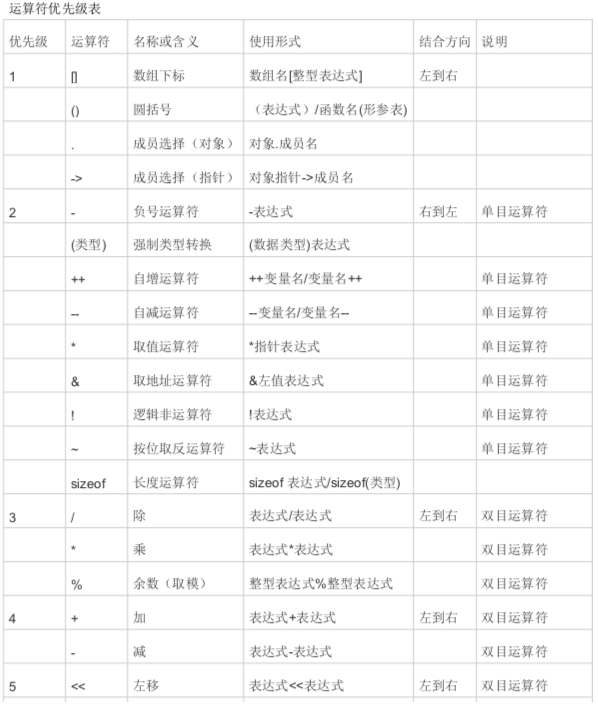

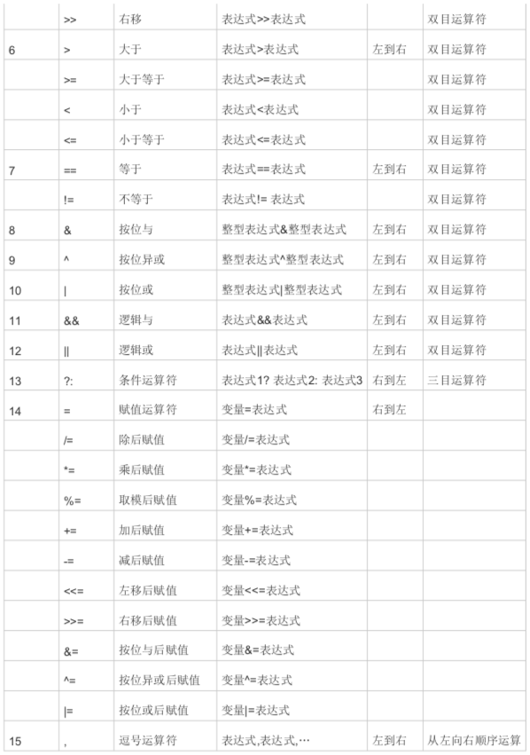

### 算数运算符的介绍和使用

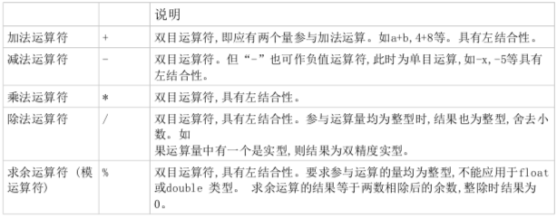

#### 除法 和 取余

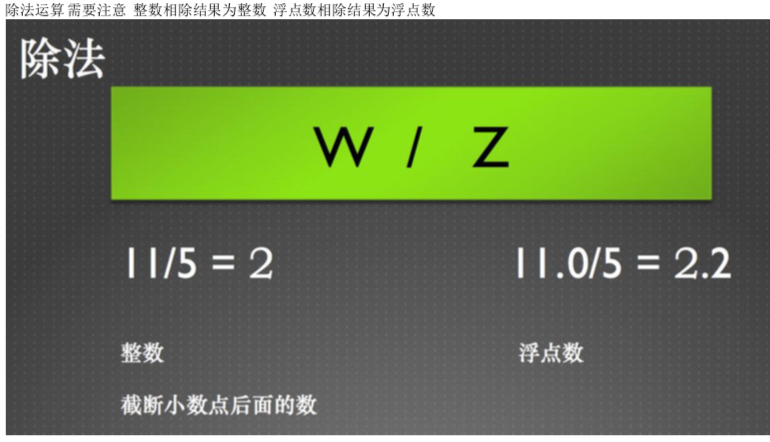

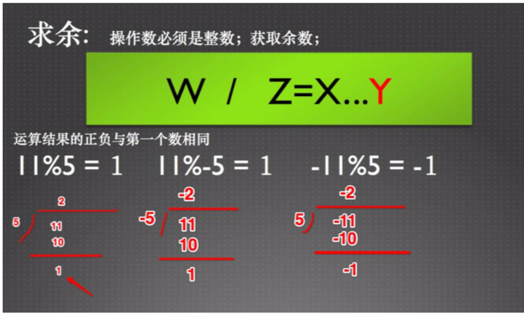

### 算数运算符的类转型

不同数据类型的操作数间进行运算，为了避免不可预测的错误发生，引入了类型转换的概念

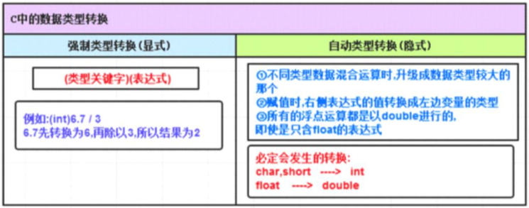


### 赋值运算符与赋值运算

赋值运算符记为“=”,由“=”连接的式子称为赋值表达式。 其一般形式为: 变量=表达式 如 a = 2+3 叫赋值表达式 末尾加 分号(;) 变成 a = 2+3; 叫赋值语句。 表示把 = 号后面的值赋给等号前面的变量 注意与 ==(关系运算符判断是否相等) 区分 

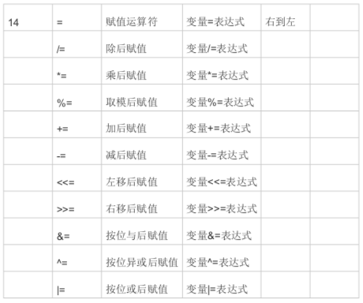

在赋值符“=”之前加上其它二目运算符可构成 复合运算符。

构成复合赋值表达式的
 一般形式为: 变量 双目运算符=表达式 

它等效于
 变量=变量 双目运算符 表达式 

/= 除后赋值 变量/=表达式 如:a/=3;即a=a/3
*= 乘后赋值 变量*=表达式 如:a*=3;即a=a*3
%= 取模后赋值 变量%=表达式 如:a%=3;即a=a%3

+= 加后赋值 变量+=表达式 如:a+=3;即a=a+3
-= 减后赋值 变量-=表达式 如:a-=3;即a=a-3


### 自增、自减运算符

在程序设计中,经常遇到“i=i+1”和“i=i-1”这两种极为常用的操作。
C语言为这种操作提供了两个更为简洁的运算符,即++和--,分别叫做自增运算符和自减运算
符

#### 自增、自减运算符的求值过程

- ++x 相当于 x = x+1; 再用x执行某些操作。 ---> ++x : 先加加 再用 

- x++ 相当于 先用x执行某些操作 再 x = x+1; ---> x++ :先用 再加加 同理 

- --x 相当于 x = x-1; 再用x执行某些操作。 ---> --x : 先减减 再用
-  x-- 相当于 先用x执行某些操作 ，再 x = x-1; ---> x-- :先用 再减减 

这里就定义出了前缀运算符和后缀运算符

**只能运用于单个变量 ** **不能用于表达式和常量**


### sizeof运算符

为单目运算符，用于 **获取操作数占用内存大小的字节数**

**使用形式：** sizeof(操作数)  或 sizeof 操作数

#### 用法：

- 用于数据类型

  ```c
  int main(){
      int sizeInt = 0;
      int sizeDouble = 0;
      sizeInt = sizeof(int);
      sizeDouble = sizeof(double);
      printf("sizeInt=%d\n,sizeDouble=%d",sizeInt,sizeDouble);
      return 0;
  }
  //输出
  sizeInt=4
  sizeDouble=8
  ```

- 用于常量

  ```c
  int main(int argc,const char * argv[]){
      //在 c 语言中 字符型常量 占用的字节数是 4
      int size = sizeof('a');
      //字符型变量 占一个字节
      char c = 'a';
      int sizeCh = sizeof(c);
      printf("字符型 常量 size = %d \n",size);
      printf("字符型 变量 sizeCh = %d \n",sizeCh);
      return 0;
  }
  //输出
  字符型 常量 size = 4
  字符型 变量 sizeCh = 1
  //------------------------------------------------------------------
      int main(int argc, const char * argv[]){
      int float_size = sizeof(1.1f);
      int int_size = sizeof(1);
      int double_size = sizeof(3.1);
      int short_size = sizeof((short)1);
      
      printf("常量 short_size = %d \n",short_size);
          printf("常量 int_size = %d \n",int_size);
          printf("常量 float_size = %d \n",float_size);
          printf("常量 double_size = %d \n",double_size);
      return 0;
  }
  //输出
  常量 short_size = 2
  常量 int_size = 4
  常量 float_size = 4
  常量 double_size = 8
  ```

- 用于变量

  sizeof使用形式:sizeof(var_name)或sizeof var_name
  变量名可以不用括号括住。如sizeof (var_name),sizeof var_name等都是正确形式。
  带括号的用法更普遍,大多数程序员采用这种形式。

  ```c
  int main(int argc, const char * argv[]){
  	//常量 可以不带括号
      int float_size = sizeof 1.1f;
      int int_size = sizeof 1;
      int double_size = sizeif 3.1;
      //变量 建议带括号
      printf("常量 short_size = %d \n",short_size);
          printf("常量 int_size = %d \n",int_size);
          printf("常量 float_size = %d \n",float_size);
          printf("常量 double_size = %d \n",double_size);
      return 0;
  }
  //输出
  常量 short_size = 2
  常量 int_size = 4
  常量 float_size = 4
  常量 double_size = 8
  ```


### 逗号运算符

连接多个表达式组成一个表达式的一般形式：表达式1,表达式2,表达式3…表达式n

返回值： 最后一个表达式的值


### 关系运算符

### 逻辑运算符

### 进制转换

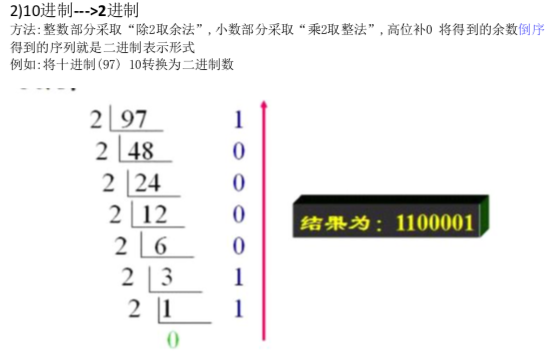

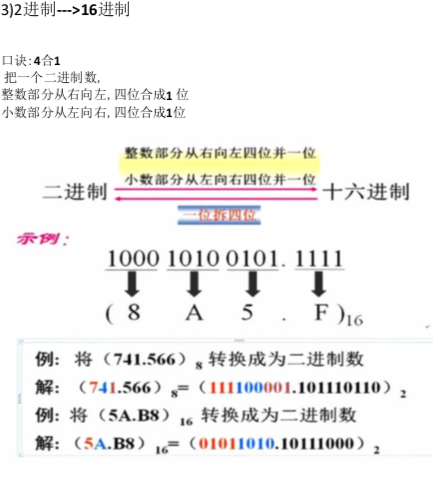

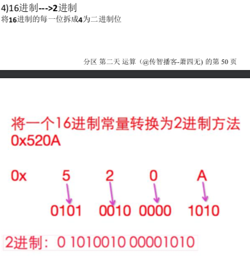

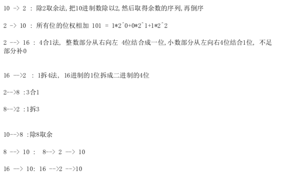

### 位运算

#### 运算符

&  |  ^  ~  <<  >>

用途：直接操作二进制，省内存，效率高

只能用于整型数的操作（**char、short、int、long**）

#### 运算规则

1. **& 与运算 全1才1 否则 0**

   只有两个对应的二进制均为1时，结果才为1，否则为0

   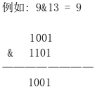

2. **| 或运算 有1就1**

   只要对应的二个二进位有一个为1时,结果位就为1,否则为0

   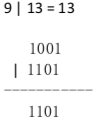

3. **^ 异或 不同为1**

   当对应的二进位相异(不相同)时,结果为1,否则为0

   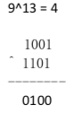

4. **~  取反 **

   **各二进位进行取反(0变1,1变0) 【符号位跟着一块算】**

   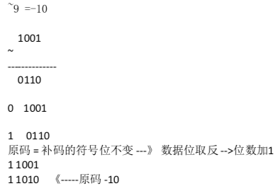

5. **<<  左移**  

   各二进位全部左移n位,高位丢弃,低位补0

   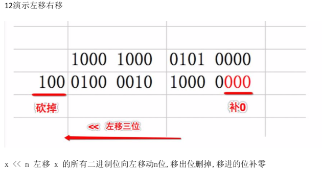

   左移注意：

   1. 左移可能会改变一个数的正负性
   2. 左移一位相当于乘以2
   3. 可以用于快速计算一个数乘以2的 n 次方（8 << 3  等同于 8 × 2^3）

6. **> > 右移**  

   各二进制位全部右移 n 位，符号位保持不变

   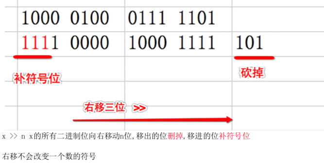

   右移相当于除以2 的 n 次方

   用途：快速计算一个数除以 2 的n次方

## 选择结构

#### 三目运算符

也叫三元运算符 

基本格式 : (关系表达式) ? 表达式1 : 表达式2; 

执行流程 : 关系表达式为 真 返回表达式1 关系表达式为假 返回表达式2 

执行流程: 演示获取两个数的最大值 

#### 程序的流程控制

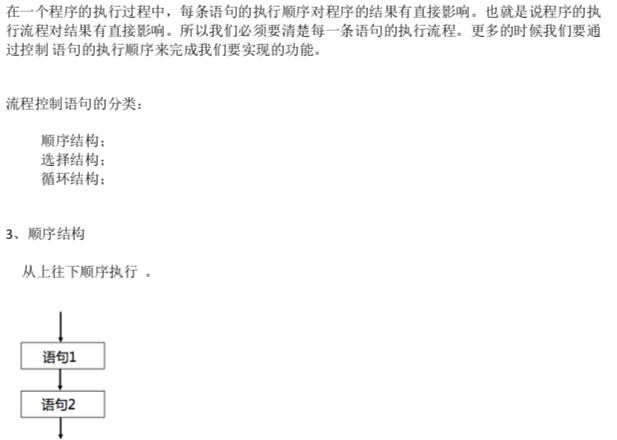

选择结构：if语句  switch语句

#### if语句的使用和注意事项

##### 格式：

1. 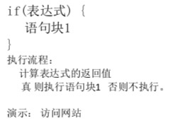
2. 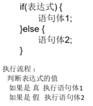
3. 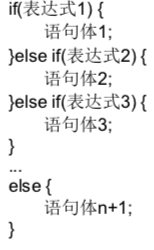

##### 注意事项：

1. if(条件) return 0; 执行完return 程序将不会再向下执行
2. if(1) 和 if(-1) 永远为真， if(0) 为假
3. if语句的作用域在其内部（{}）不要去定义变量类到外部使用
4. 某些情况可以省略 花括号 但是不建议省略

#### switch语句的使用和注意事项

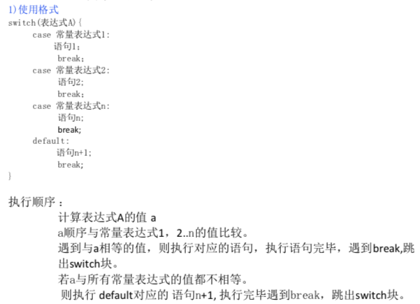

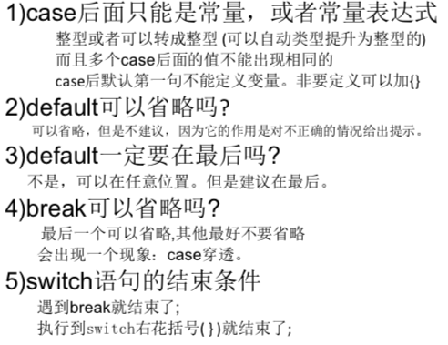

## 循环结构

#### while循环和使用注意

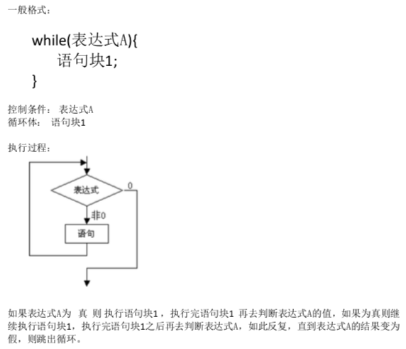

##### 注意：

1. 死循环，循环表达式永远为真，或者就是常量 1 -1 等

   ```c
   while(-1){
       printf("这就是四循环");
   }
   ```

2. 当一个变量与一个常量进行== 或 != 的时候，常量一般要写在前面

   ```c
   int num = 3;
   while (3 == num) {
   printf("num = %d\n",num);
   num++; }
   ```

3. while 后面如果只有一条语句他可以省略大括号

   1. 空语句也是一条语句

   2. while 小括号后面不可以直接写分号

      ```c
      int num = 0;
      while (num < 3); {
      printf("num = %d\n",num);
      num++; }
      //以上是个错误示范
      ```

4. 作用域：内部定义的变量不可以在外部使用

   ```c
   while (1 < 3) {
        int a = 0;
   }
   printf("a = %d\n",a);//这样没有结果
   ```

5. 作用域紊乱  就是该有括号的地方大括号 容易看 也不容易乱

6. 最简单的死循环

   ```c
   while(1){
       doSomeThing;//一直do
   }
   ```

#### do...while 循环

定义：首先会执行一遍循环体里面的语句。接着判断 while 中的条件，如果条件成立，就执行循环体里面的语句，然后再次判断条件，重复上述过程，直到条件不成立就结束

特点：不管 while 中的条件是否成立，循环体中的语句至少会被执行一遍

#### for循环

#### break 与 continue 

## 函数

### 函数概述

实现特定功能的代码块，提高代码的复用性

```c
int main(int agrc,const char * argv[]){
    for(int i=1; i<=9; i++){
        for(int j=1; j<=i; j++){
            printf("%d * %d = %d ",j,i,i*j);
        }
        printf("\n");
    }
      for(int i=1; i<=9; i++){
        for(int j=1; j<=i; j++){
            printf("%d * %d = %d ",j,i,i*j);
        }
        printf("\n");
    }
      for(int i=1; i<=9; i++){
        for(int j=1; j<=i; j++){
            printf("%d * %d = %d ",j,i,i*j);
        }
        printf("\n");
    }
    
    show99();
    return 0;
}
// 函数化
#include <stdio.h>
//打印99乘法表
void show99(){
    for(int i=1; i<=9; i++){
        for(int j=1; j<=i; j++){
            printf("%d * %d = %d ",j,i,i*j);
        }
        printf("\n");
    }
}
```


### 函数的分类和书写格式

- **库函数**  

  由C系统提供,用户无须定义,也不必在程序中作类型说明,只需在程序前包含有该函数
  原型的头文件即可在程序中直接调用。在前面各章节中反复使用的printf、scanf等函数均属此类。

- **用户定义函数**

  由用户按需要写的函数。对于用户自定义函数,不仅要在程序中定义函数本身,
  而且在主调函数模块中还必须对该被调函数进行类型说明,然后才能使用。

#### 库函数的分类

| 分类           | 用途                                                         |
| -------------- | ------------------------------------------------------------ |
| 字符型分类函数 | 用于对字符按 **ASCII**码分类：字母、数字、控制字符、分隔符、大小、写字母等 |
| 转换函数       | 用于字符或字符串的转换;在字符量和各类数字量(整型,实型等)之间进行 转换;在大、小写之间进行转换 |
| 目录路径函数   | 用于文件目录和路径操作                                       |
| 诊断函数       | 用于内部错误检测                                             |
| 图形函数       | 用于屏幕管理黑各种图型功能                                   |
| 输入输出函数   | 用于完成输入输出功能                                         |
| 接口函数       | 用于与DOS，BIOS和硬件的接口                                  |
| 字符串函数     | 用于字符串操作和处理                                         |
| 内存管理函数   | 用于内存管理                                                 |
| 数字函数       | 用于数学函数计算                                             |
| 日期和时间函数 | 用于日期，时间转换操作                                       |
| 进程控制函数   | 用于进程管理                                                 |
| 其他           | 其他                                                         |

#### 自定义函数的书写格式

**声明→实现→调用**

基本格式

```c
返回值类型 函数名称(数据类型 变量名1，数据类型 变量名2，...){
    函数体；
    return 对应的类型结果;
}
//声明一个函数，给一个整数 + 1
int showAdd(int a);

int main(int argc, const char * argv[]){
    int z = showAdd(10);
    printf("z = %d \n",z);
    return 0;
}

int showAdd(int a){
    int b = a + 1;
    return b;
}
```

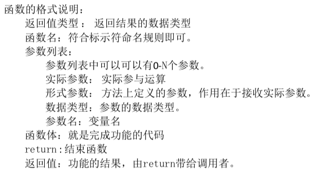


### 几种常见函数的定义

1. **有参数有返回值**

   ```c
   返回值类型 函数名(形式参数列表){
       语句;
       return 返回值类型变量或常量;
   }
   ```

2. **有参数无返回值**

   ```c
   void 函数名(形参列表){
       语句;
   }
   /*
   有参函数比无参函数多了一个内容,即形式参数表列。在形参表中给出的参数称为形式参数,它 们可以是各种类型的变量,各参数之间用逗号间隔。 在进行函数调用时,主调函数将赋予这些形式参数实际的值。形参既然是变量,必须在形参表中 给出形参的类型说明
   */
   ```

3. **无参数无返回值**

   ```c
   void 函数名(){
       函数体;
   }
   /*
   无返回值函数:相当于把某一部分功能放到特定的代码块中去执行。 执行完毕之后无需给调用
   者返回执行结果。 在标记没有返回值的函数的时候用void去标记。
   */
   ```

4. **无参数有返回值**

   ```c
   返回值类型 函数名(){
   语句 ;
   return 返回值类型变量或常量;
   }
   ```


### 变量的作用域

> 可以在任何代码块的起始处定义变量。 变量只存在于定义他们的块中。他们在声明的时候创
> 建，在定义他们的块结束的时候，该变量就不存在了。 这个程序代码块就是变量的作用域。

#### 局部变量

> 定义说明在函数内部的变量，也称为内部变量。
> 其作用域仅限于函数内, 离开该函数后再使用这种变量表达对应的意义就是非法的。

##### 使用注意

1. 主函数中定义的变量也只能在其自身中使用,不能在其它函数中使用。同时,主函数中也不
   能使用其它函数中定义的变量。因为主函数也是一个函数,它与其它函数是平行关系。

2. 形参变量是属于被调函数的局部变量

3. 允许在不同的函数中使用相同的变量名,它们代表不同的对象,分配不同的单元,互 

   不干扰,也不会发生混淆。 

#### 全局变量

1. 外部变量定义不许在所有函数之外，且只能定义一次

2. 在同一源文件中,允许全局变量和局部变量同名。在局部变量的作用域内,全局变量不起 

   作用。(强龙不压地头蛇) 

   因为他们存储在不同的片区

   - 代码区  函数代码
   - 静态存储区 全局变量、静态变量
   - 堆区（Heap）动态内存
   - 栈区（Stack）局部变量、函数形参

3. 如果外部变量定义在某函数的下面，则要使用该外部变量的时候一定要进行说明

   说明形式：

   extern 类型说明符 变量名、变量名、 ...;

4. 在整个程序内，可以出现多次外部变量的说明，但是外部变量在说明的时候 不能再赋初始值

   外部变量在定义时就已经分配了内存单元，外部变量定义可做初始赋值，在说明的时候只是表明在函数内要使用某外部变量

5. 外部变量可加强函数模块之间的数据联系,但是又使函数要依赖这些变
   量,因而使得函数的独立性降低。从模块化程序设计的观点来看这是不利
   的, 因此在不必要时尽量不要使用全局变量。

### 函数的声明与调用

> 调用某函数前对该函数进行声明，目的是使编译系统知道被调用函数返回值的类型，一遍在主调函数中按此种类型对返回值作相应的处理

期一般形式：

**​	返回值类型 被调用函数名(类型1 形参1,类型2 形参2...);**

或

​	**返回值类型 被调函数名(类型,类型...);**

如

```c
int max(int a, int b);
int max(int,int);
```

其实把被调函数的头部拷贝一份加上一个分号就好。

C语言中,函数调用的一般形式为:

​	**函数名(实际参数表);**

注意：

1. 函数的声明可以写到里面也可以写到外面

   ```c
   //内部声明
   #include <stdio.h>
   int main(int argc, const char * argv[]){
       int max(int a,int b);
       int z = max(10,11);
       printf("z = %d \n",z);
       return 0;
   }
   int max(int a, int b){
       return 2.3f;
   }
   // 外部声明
   #include <stdio.h>
   int max(int a,int b);
   int main(int argc, const char * argv[]){
       int z = max(10,11);
       printf("z = %d \n",z);
       return 0;
   }
   int max(int a, int b){
       return 2.3f;
   }
   ```

2. 当被调函数的函数定义出现在主调函数之前时,在主调函数中也可以不对被调函数再
   作说明而 直接调用

   ```c
   int max(int a, int b){
       return 2.3f;
   }
   int main(){
       int z = 0;
       z = max(23,80);
       printf("%d\n",z);
       printf("%d\n",max(20,30));
       return 0;
   }
   ```

3. 如果被调函数的返回值是整型时,可以不对被调函数作说明,而直接调用。这时系统
   将自动对被调函数返回值按整型处理。 【建议工作中不要省略】

   ```c
   #include <stdio.h>
   int max(int a,int b);// 这个声明可以省略 因为返回值 是 int
   int main(int argc, const char * argv[]){
       int z = max(10,11);
       printf("z = %d \n",z);
       return 0;
   }
   int max(int a, int b){
       return 2.3f;
   }
   ```


### 函数参数的使用注意

#### 形式参数的介绍和使用

> 定义函数的时候 **函数名后面小括号中的参数**，简称形参，用来接受实际运算数据或者数据地址。容器

注意：

1. 如果多个形参，可以用逗号分隔

2. 形参的类型可以不相同

3. 形式参数是什么样类型的数据,那么实际参数也必须是什么样的类型,否则会产生错误会数
   据丢失

4. 形式参数出现在函数定义中,作用域是函数体 ,离开该函数则不能使用。之前讲过。

5. 函数内部不可以定义与函数形参同名的变量,因为形参与函数的代码是一个代码块

6. 形参定义后 并不会立即分配存储空间，在函数调用的时候才会真正的分配存储空间(参数 

   传递的过程) 

#### 实际参数的介绍和使用

> 实际参与操作的数据。调用函数的时候,函数名后面小括号中的参数,简称实参 实参出现在 
>
> 主调函数中。 形参和实参的功能是作数据的传递。从主调函数把数据捅过来， 被调函数用对应的形参去 接。 

注意：

1. 实参可以是常量、变量、表达式,函数等,无论实参是何种类型的量,在进行函数调用 

   时,它们都必须具有确定的值,以便把这些值传送给形参。

2.  实参和形参在数量上,类型上,顺序上应严格一致,否则会发生类型不匹配的错 

   误。 

3. 形参的值在函数内部可以被修改，但是不会影响主调函数中实参的数据,（引用传递）

### 函数的返回值以及注意事项

#### 函数的返回值

> 函数的返回值 是一个结果， 就是函数执行完特定操作之后得到的那个，需要给主调函数
> 返回的结果。

#### 注意事项

1. 当前情况下函数的值只能通过return语句返回主调函数。 

   return语句的一般形式为: 

   return 表达式; 

   或者为:
    return (表达式); 

2. 在函数中允许有多个return语句,但每次调用只能有一个return 语句被执行,因此只
   能返回一个函数值。

3. 函数返回值的类型和return实际返回的值类型应保持一致。
   如果两者不一致,则获取return后表达式的值，自动进行类型转换。

4.  如函数值为整型,在函数定义时可以省去类型说明。
   也就是说如果没有指定返回类型,那么C语言默认是int的类型(开发中不要省略返回值类
   型)

5. 不返回函数值的函数,可以明确定义为“空类型”,类型说明符为“void”。 为了使
   程序有良好的可读性并减少出错, 凡不要求返回值的函数都应定义为空类型

### 函数调用的练习

### #include指令

#### 文件包含命令的格式

- include " " 意义是包含一个用户定义的文件,可以是头文件,也可是普通文件
- include <> 意义是包含一个系统(编译器自带)的头文件

**include 语句之后不需要加 ";" (因为#include它使一个预处理指令,不是一个语句)
如:**

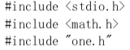

#### 文件包含的实质

> 文件包含命令的功能是把指定的文件内容插入该命令行位置取代该命令行,从而把指定的文件
> 和当前的源程序文件连成一个源文件

​	include 可以包含头文件，也可以包含文本文件，而且不一定要写在第一行

### #include文件搜索顺序

#### 用户自定义的头文件

**当前文件夹 ----->编译器include文件夹 ---->系统include文件夹----->(如果找不到)报错**


### C语言模块化编程概念

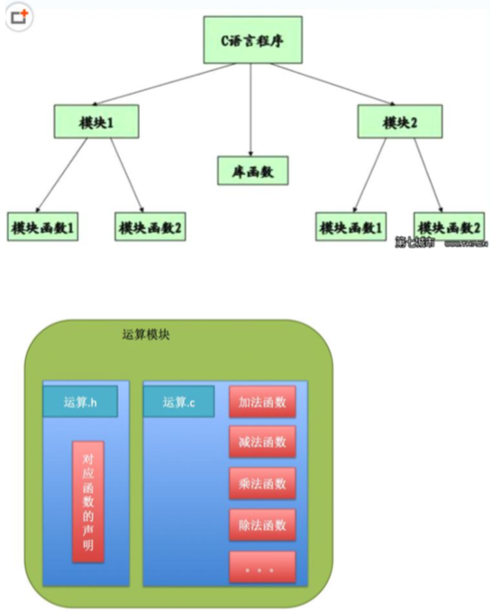

如 把加减乘除这类功能函数 封装到一个文件中 那么根据不同的功能(如网络访问相关， 加密 

相关，数据保存相关)就可以有很多个文件，所以模块化编程也叫做多文件开发,也叫 多文件(.c文件)编程,一个 .c 文件和一个 .h 文件可以被称为一个模块。 

.h文件就是头文件  使用头文件的场景：

1. 通过头文件来调用库功能

   在很多场合,源代码不便(或不准)向用户公布,只要向用户提供头文件和二进制的库即
   可。用户只需要按照头文件中的接口声明来调用库功能,而不必关心接口怎么实现的。如
   随机数函数。

2. 多文件编译

   将稍大的项目分成几个文件实现,通过头文件将其他文件的函数声明引入到当前文件

3. 头文件能加强类型安全检查

   如果某个接口被实现或被使用时,其方式与头文件中的声明不一致,编译器就会指出错误,
   这一简单的规则能大大减轻程序员调试、改错的负担


### 感受多文件开发及注意事项

1. 头文件中可以和C程序一样引用其它头文件,可以写预处理块,但不要写具体的语句

2. 可以声明函数，但是不可以定义函数

3. 可以声明常量，但是不可以定义变量

4. 可以“定义”一个宏函数。注意:宏函数很象函数,但却不是函数。其实还是一个申明. 

   类似这种 10天讲 #define MAX( a, b) ( (a) > (b) (a) : (b) ) 

5. 结构的定义、自定义数据类型一般也放在头文件中

6. 多文件编程时,只能有一个文件包含 main() 函数,因为一个工程只能有一个入口函数。我们
   把包含 main() 函数的文件称为主文件

7. 为了更好的组织各个文件,一般情况下一个 .c 文件对应一个 .h 文件,并且文件名要相同,
   例如 fun.c 和 fun.h

8. 头文件要遵守幂等性原则,即可以多次包含相同的头文件,但效果与只包含一次相同

9. 防止重复包含的措施


## 数组

### 数组的基本概念

> 概念:把具有相同类型的若干变量按有序的形式组织起来。这些按序排列的同类数据元素
> 的集合称为数组。
>
> 在C语言中,数组属于构造数据类型。
>
> 构造数据类型:构造数据类型是根据已定义的一个或多个数据类型用构造的方法来定义的。也就
> 是说，一个构造类型的值可以分解成若干个“成员”或“元素”。每个“成员”都是一个基本数
> 据类型或又是一个构造类型。
>
> 一个数组可以存储基本数据类型，也可以存储构造类型

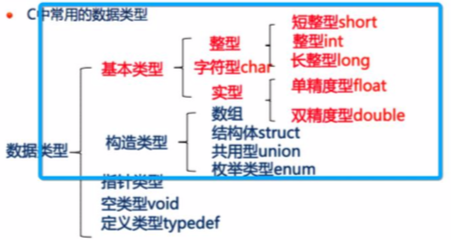

#### 数组的一般形式

类型说明符 数组名[常量表达式]

- 类型说明符：数组元素的数据类型
- 数组名：数组的标识，符合命名规范
- 常量表达式：数组元素的个数，也就数组的长度
- []: 数组的维度，一个[] 就是一维数组，两个[] 就是二维数组

#### 一维数组定义及注意

1. 数组的类型实际上是指数组元素的数据类型。对于同一个数组,其所有元素的数据类型都是
   相同的

2. 数组名的书写规则应符合标识符的书写规定。
   命名规则

   - 只能由字母、数字、下划线组成
   - 不能以数字开头
   - 不能与关键字重名
   - 严格区分大小写
   - 命名最好是有意义的
   - 遵循驼峰命名规则

3. 数组名不能与其他的变量名相同

4. 方括号中常量表达式，表示数组元素的个数,如inta[5]表示数组a有5个元素。数组中元素
   的排列序号是从0开始的。

5. 不能在方括号中，用变量来表示元素的个数,但是可以是常量或常量表达式。
   c99不支持使用变量作为元素个数 但是在Xcode里面可以这么定义 ，建议按照标准去定义。

6. 允许在同一个类型说明中,说明多个数组和多个变量。

   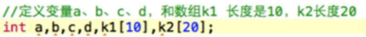


### 一维数组的初始化

> 数组初始化赋值是指在数组定义时给数组元素赋予初值。数组初始化是在编译阶段进行 
>
> 的。这样 将减少运行时间,提高效率。 

#### 初始化

##### 静态初始化（定义同时初始化）

常见形式：

​	**类型说明符 数组名[常量表达式] = { 值, 值......值 };**

其中在{ }中的各数据值即为各元素的初值,各值之间用逗号间隔。
又细分以下几种情况:

- 指定元素的个数

  ```c
      int nums[5] = {1,2,3,4,5};
  ```

- 不指定元素的个数

  ```c
  int nums[] = {1,2,3,5,6};
  //它是根据大括号中的元素的个 数来确定数组的元素的个数
  ```

- 指定元素个数,同时给指定元素进行初始化标号

  ```c
  int nums[5] = {[4] = 3,[1] = 2};
  ```

- 指定元素个数,对数组进行部分显式初始化

  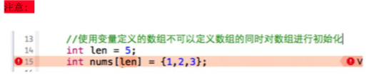

  ##### 动态初始化（先定义，后初始化）

  通过数组元素的引用
  一般形式:

  数组名[下标]
   下标是从0 开始的 所以数组的第一个元素是 数组名[0], 第二个是 数组名 

  [1], ... 

  数组元素也叫做下标变量 

```c
 int nums[3]; 
nums[0] = 1; 
nums[1] = 2; 
nums[2] = 3; 
```

### 一维数组的遍历


### 一维数组的存储方式

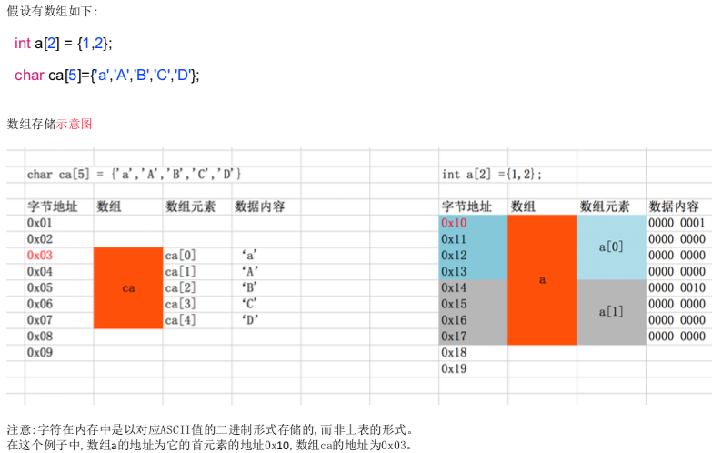

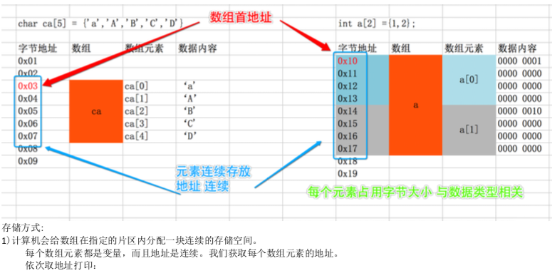

```c
void testshuzu(){
    int a[4] = {1,2,3,4};
    printf("数组a的首地址：%p\n",a);
    for(int i=0; i < 4; i++){
        printf("a[%d] 的地址：%p\n",i,&a[i]);
    }
    
    char  ca[5] = {'a','A','B','C','D'};
     printf("数组ca的首地址：%p\n",ca);
   for(int i=0; i < 5; i++){
        printf("ca[%d] 的地址：%p\n",i,&ca[i]);
    }
        
}
//输出是 连续的地址值， 这里 & 符号的意思是取地址
```

- 计算机会给数组在指定的片区内分配一块连续的存储空间。 
- **数组名代表数组的首地址,从首地址位置,依次存入数组的第1个、第2个....、第n个元素，且与第一个元素的地址值相同**
- 数组名字 是一个常量 保存了数组的首地址 其值不可以被改变


### 一维数组长度的计算方法

**为什么会计算数组长度?** 

实际工作中我们经常会遇到使用数组传递数据，只知道数组的类型，并不
知道数组中的数据元素个数的情况。此时我们要知道如何计算数组元素的
个数。

数组的长度值得是数组的元素个数

- 数组的总字节数 = sizeof(数组名)
- 单个元素占用字节数 = sizeof(数据类型)
- 数组在内存中占用的总字节数 等于单个元素占用字节数乘元素个数

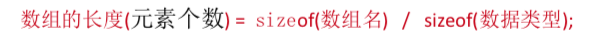

```c
int x[] = {1,3,3,4,5};
// 数组长度 = 数组总字节数 / 元素占字节数
int len = sizeof(x) / sizeof(int);
printf("len = %d \n",len);
return 0;

//输出  len = 5；
```


### 一维数组的越界问题

### 数组元素作为函数

数组和 变量、表达式、常量一样可以作为函数的参数进行传递，有两种传递方式

1. 数组元素和数组名作为函数的实际参数

   

2. 数组作为函数的形式参数

   

- 数组元素做函数实参

  数组元素就是下标变量,它作为函数的实际参数与普通变量并无区别。 

  因此它作为函数实参使用与普通变量是完全相同的,在发生函数调用时,会把作为实参的数组元 素的值传送给形参,实现单向的值传送 

### 数组名作为函数参数的注意事项

- 形式参数和实参参数的类型必须一致

- 形式参数和实参参数的长度可以不一致，因为在调用的时候，只传送首地址而不检查参数的长度。当行驶参数的长度与实际参数的长度不一致时，不会出现编译语法错误（编译可以通过）但是程序的执行结果将于实际不符。

- 在函数形参表中，允许不给出形参的长度，或用一个变量来表示数组元素的个数

  举例：

  ```c
  void nzp(int a[])
  //可以写为
  void nzp(int a[],int n)
  //其中的形式数组 a 没有给出长度，而是由 n 值动态的表示数组的长度。 n 的值由主要的实参进行传递
  ```

- 多为数组也可以作为函数的参数。在函数定义时对形式参数可以指定每一维的长度，也可以省去第一维的长度

  ```c
  int ma(int a[2][10])
  int ma(int a[][10])
     //以上都是合法的写法 
  ```


### 冒泡排序思想

两项比较大的往前排，两个for循环

### 冒泡排序代码实现


### 二维数组的定义


### 二维数组初始化

### 二维数组遍历

### 二维数组存储和行列计算

### 二维数组做函数的参数

## 指针与数组、函数

### 指向数组元素的指针

> 一个变量有地址，一个数组包含若干元素，每个数组元素都在内存中占用存储单元，**都有相应的地址**，指针变量既可以指向变量，也可以指向数组元素。所谓数组元素的指针就是数组元素的地址

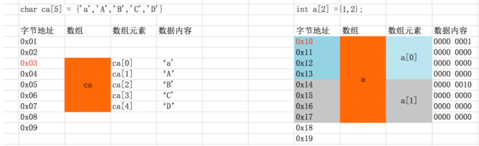

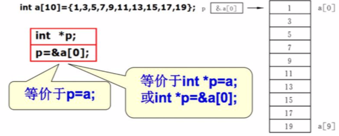

```c
//定义一个 int 数组
int a[5] = {1,2,3,4,5};
//定义一个指针数，存放整型数组顶一个元素的地址
int *p1 = &a[0];
printf("通过指针变量获取对应变量的值 *p1 = %d \n",*p1);
//定义一个变量来存储第四个元素的地址
int *p2 = &a[3];
printf("通过指针变量获取对应变量的值 *p2 = %d \n",*p2);
/*
输出：
通过指针变量获取对应变量的值 *p1 = 1
通过指针变量获取对应变量的值 *p2 = 4
*/

//定义一个字符型数组
char name[20] = "zhangsan";
//定义一个指针变量 存放数组中的元素
char *p1 = &name[3];
char *p2 = &name[1];
printf("通过指针访问对应元素的值 *p1 = %c\n",*p1);
printf("通过指针访问对应元素的值 *p2 = %c\n",*p2);
/*
输出：
通过指针访问对应元素的值 *p1 = n
通过指针访问对应元素的值 *p2 = h
*/
```


### 一维指针数组

### 指针变量的运算

### 字符串指针介绍和使用

### char型指针数组和字符

### 字符串数组应用

### const关键字介绍及优点

### 内存管理的概念和内存

### 常见的内存分配函数

### 野指针和内存泄漏

### 指针函数概念及定义

### 指针函数使用

### 函数指针概念及定义

### 函数指针的使用

