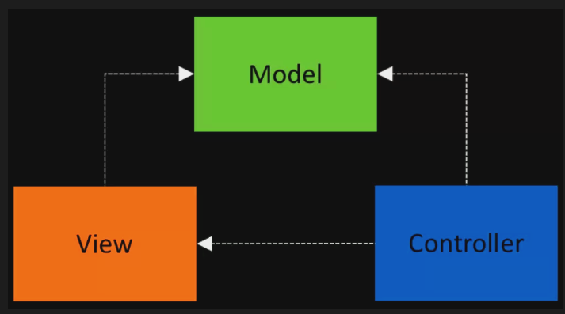
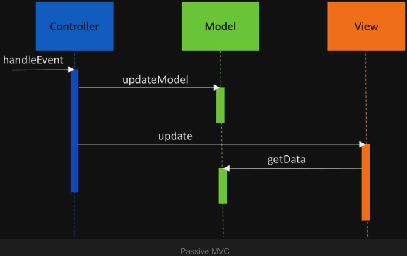
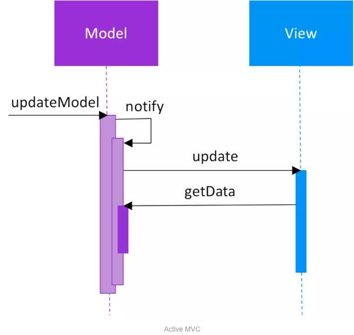
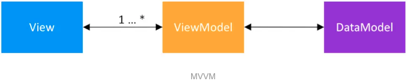

https://www.jianshu.com/p/780658b79227

#### MVC

即 Model-View-Controller，基于页面逻辑的修改要多于业务逻辑，分离两种逻辑减少类代码的修改

- Model：数据层，负责处理也没逻辑，监听网络与数据接口
- View：界面（UI）层，显示来源于 model 的数据
- Controller：逻辑层，传递用户数据的交互和更新 Model 的数据



根据MVC架构, View和Controller都会依赖于Model, View显示Model数据, Controller更新Model数据. Model从项目中分离后, 独立于UI, 允许测试. 更新Model方式的不同, 把MVC架构分为**被动(Passive)**模式和**主动(Active)**模式.

#### 被动式

在被动模式中, Controller是唯一操作Model的类. 基于用户的响应事件, Controller通知Model更新数据. 在Model更新后, Controller通知View更新UI, View从Model中获取数据.



#### 主动模式

在**主动模式**中, Controller不是唯一操作Model的类, Model存在自更新机制. 在更新数据时, Model层使用观察者(Observer)模式通知View和其他类. View实现观察者的接口, 在Model中, 注册成为观察者, 接收通知.


当Model层发生数据更新时, 告知全部观察者. View从Model中更新数据.



#### 项目应用

在早期开发中, Activity(或Fragment)既是View又是Controller, 并未进行分离. 有些项目剥离出Model, 独立于平台进行测试. 在使用MVC框架时, Activity(或Fragment)代表View, 并从中剥离出**不含任何的Android类**(如Context等)的Controller. 对比于原始项目, MVC架构具有:

1. 修改UI逻辑时, 较少修改Model;
2. 修改业务逻辑时, 较少修改View.

在被动模式中, View继承基类BaseView, Controller拥有BaseView的引用, 更新数据; 在主动模式中, Model使用观察者通知View, 更新数据.

#### 优点

MVC模式, 分离类的UI与业务职责, 增加可测试性与可扩展性. Model不引用任何Android类, 允许单元测试(Unit Test). Controller含有View的引用, 不引用Android类, 允许单元测试. View满足**单一职责原则(SRP)**, 传递事件至Controller, 展示Model数据, 不包含业务逻辑, 允许UI测试.

#### 缺点

View既依赖于Controller又依赖于Model. 在修改UI逻辑时, 也需要修改Model, 降低架构的灵活性. View与Model的职责部分重叠, 过于耦合, 在处理UI逻辑时, 被动模式与主动模式都会产生若干问题.

在**被动模式**中, Controller通知Model更新数据, 并通知View显示. 对于UI逻辑, 如果View处理, 单元测试会遗漏逻辑; 如果Model处理, 则隐式地依赖于View, 导致模块增加耦合.

```java
// View处理UI逻辑
String docName = userModel.getName();
String docClinic = userModel.getClinic();
nameTextView.setText(docName + ", " + docClinic)

// Model处理UI逻辑
String nameAndClinic = userModel.getNameAndClinic();
nameTextView.setText(nameAndClinic);

```

在**主动模式**中，每个 UI逻辑都需要添加观察者，保证更新

MVC架构含有致命问题, 即View同时含有Controller与Model的引用; UI逻辑同时存在于View与Model之间. 这些问题导致业务逻辑与UI逻辑无法分离, 增加模块耦合, 影响重构. 这些问题在MVC的[进化版MVP](https://www.jianshu.com/p/c1c546724e4d)中逐步解决.

### MVP

MVP架构包含三大模块, 即Model, View, Presenter.

- Model: 即数据层, 负责处理业务逻辑, 监听网络与数据库接口.
- View: 即界面(UI)层, 展示数据, 响应用户事件并通知Presenter.
- Presenter: 即展示层, 接收Model的数据, 处理UI逻辑, 并管理View的状态, 根据View层事件提供展示数据.


View层与Presenter层关系非常紧密, 相互引用, 并且一一对应. Presenter支持单元测试, View被抽象成若干显示接口, 供Presenter调用, View处理Android逻辑, Presenter处理UI逻辑. View和Presenter的接口信息, 放置在一个逻辑清晰的接口类(合同)中.

#### Model层

Model负责**获取或存储**在**远程或本地**的数据. 例如, 在处理数据时, Model先检索本地数据, 为空则请求网络数据, 并同步本地, 再显示.

在构造器中, 添加**本地与远程**数据源的接口类, 数据源内分离逻辑与实现.

```java
public static TasksRepository getInstance(TasksDataSource tasksRemoteDataSource,
                                          TasksDataSource tasksLocalDataSource) {
    if (INSTANCE == null) {
        INSTANCE = new TasksRepository(tasksRemoteDataSource, tasksLocalDataSource);
    }
    return INSTANCE;
}
```

#### View层

View与Presenter配合使用, 负责展示数据, 通知Presenter响应用户事件. Activity(或Fragment)是View层. View与Presenter相互对应. View继承自**含有设置Presenter**的接口.

```java
public interface BaseView<T> {
    void setPresenter(T presenter);
}
public interface TasksContract {
    interface View extends BaseView<Presenter> {
        // ...
    }
    // ...
}
```

View在onResume中注册Presenter, 在onPause中释放Presenter.

```java
@Override
public void onResume() {
    super.onResume();
    mPresenter.subscribe();
}
@Override
public void onPause() {
    super.onPause();
    mPresenter.unsubscribe();
}
```

当用户执行动作时, View截获事件, 通过Presenter接口**传递事件**给Presenter处理. 完成后, Presenter通过View接口**传递数据**给View显示或反馈. 因此, View与Presenter紧密关联, 接口也相互对应.

View使用Espresso进行UI测试.

#### Presenter层

Presenter继承BasePresenter，提供绑定与释放的的方法，确保在页面关闭时，终止线程中的网络请求

```java
public interface BasePresenter {
    void subscribe();
    void unsubscribe();
}
public interface TasksContract {
    interface Presenter extends BasePresenter {
        // ...
    }
    // ...
}
```

当用户执行动作时，Presenter请求Model，获取数据，根据UI逻辑，在View中显示。Present方法覆盖全部事件处理逻辑，与View事件相互对应。

#### 优缺点

MVP架构更好地分离View与Model之间的职责, 解除UI逻辑之间的耦合.

对于小型项目而言, 与设计模式类似, 会导致**过度设计**, 增加代码量. 当处理复杂页面时, Presenter层会包含大量UI逻辑与业务逻辑, 非常冗余, 并违反**单一职责原理**.

### MVVM

MVVM包含三个模块, Model, View, ViewModel.

-  **Model**: 即DataModel, 抽象数据源, ViewModel从Model中读取或存储数据.
-  **View**: 当用户触发响应事件时, 通知ViewModel, 展示提供的数据.
-  **ViewModel**:  提供View显示的数据流.



MVVM与MVP相似, 目标都是分离UI与业务逻辑.

1. Presenter与View**强绑定**, 为View提供展示数据, 是**一对一**关系;
2. ViewModel提供数据流, 供View**弱绑定**, 是**一对多**关系.
3. Presenter与View相互引用; ViewModel独立于View, View绑定ViewModel引用.
4. View与ViewModel, 类似于消费者知道生产者, 而生产者只提供数据, 并不关心谁消费.

#### Model

Model, 即DataModel, 通过事件流提供多种数据源, 如网络数据, 数据库, 首选项(Shared Preferences)等, 负责全部的业务逻辑. Model提供泛化数据的接口, 确保业务逻辑独立完整, 被不同页面共享与使用, 为ViewModel提供数据.

#### ViewModel

ViewModel提供数据更倾向于View, 从Model中获取必要的数据, 在封装UI逻辑后, 供给不同View展示. ViewModel有两点需要注意:

1. ViewModel为View提供**完整状态**的数据. 如医生姓名与医生科室, 当需要展示"医生姓名+医生科室"时, 应该提供**拼接后**的数据, 而不是单独数据, 当其中一个修改时, 通过全部修改全部展示, 保证View数据最新.
2. View把用户事件**都**交给ViewModel处理, 不保留任何UI逻辑.

#### View

View负责展示数据, 如Activity或Fragment. 在onResume绑定ViewModel, 在onPause解绑. 更新逻辑, 在ViewModel中处理, View仅负责展示数据.

```java
private final Subscription mSubscription = new Subscription();
@Override
public void onResume() {
    super.onResume();
    mSubscription.add(mViewModel.getData()
                     .observeOn(AndroidSchedulers.mainThread())
                     .subscribe(this::updateView,
                                this::handleError));
}
@Override
public void onPause() {
    mSubscription.clear();
    super.onPause();
}
```

如果View属于自定义, 则在构造器中绑定, 在`onDetachedFromWindow`中解绑.

#### 测试

MVVM重要特性是降低耦合度. Model不含Android类, 只含业务逻辑, 支持单元测试; ViewModel在Model上封装UI逻辑, 不含Android类, 支持单元测试.

ViewModel需绑定Model, 允许自由替换Model数据源. ViewModel绑定Model, 在测试时, 使用**Mockito**的测试数据替换Model的真实数据.

```java
public class ViewModel {
    private final IDataModel mDataModel;

    public ViewModel(IDataModel dataModel) {
        mDataModel = dataModel;
    }

    public Observable<Data> getData() {
        return mDataModel.getData();
    }
}
```

#### 优势 

MVVM的优势是进一步解耦UI逻辑与业务逻辑. 

1. View与ViewModel的耦合, **弱于**View与Presenter的耦合.
2. View仅是ViewModel的消费者, 当修改UI时, **不修改**ViewModel.
3. 根据业务关注点, 创建多个高内聚的View与ViewModel, 允许多个页面共享与替换.
4. 彻底分离UI逻辑, 使用**DataBinding**分离**UI显示**与**UI逻辑**.
5. View与ViewModel一对多, ViewModel与Model多对多.
6. ViewModel和Model与**UI界面**完全解耦, 进一步提高可测试性.

