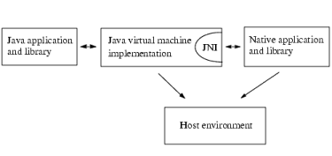
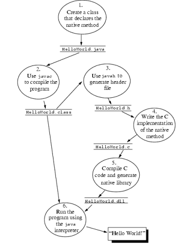
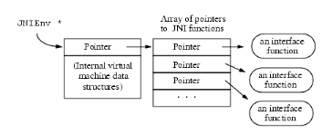

## 适用场景

1、 在Java程序中复用以前写过的C/C++代码。

2、 自己实现一个java虚拟机

3、 学习不同语言如何进行协作，尤其是如何实现垃圾回收和多线程。

4、 把一个虚拟机实现整合到用C/C++写的程序中。

JNI的部分设计思想来源于Netscape的Java Runtime Interface(JRI)。

## 第一章 简介

JNI是JAVA平台的一个重要特征，使用它我们可以重用以前用C/C++写的大量代码。本书既是一个编程指南也是一个JNI手册。本书共包括三部分：

1、 第二章通过一个简单的例子介绍了JNI。它的对象是对JNI不熟悉的初学者。

2、 3~10章对JNI的特征进行了系统的介绍。我们会举大量的例子来说明JNI的各个特征，这些特征都是JNI中重要且常用的。

3、 11~13章是关于JNI的技术规范。可以把这两章当作一个手册。

本书尽量去满足各类读者的需要。指南面向初学者，手册面向有经验的人和自己实现JNI规范的人。大部分读者可能是用JNI来写程序的开发者。本书会假设你有JAVA，C/C++基础。

本章的剩余部分介绍了JNI的背景，扮演的角色和JNI的演化。

### 1.1 JAVA平台和系统环境（Host Environment）

系统环境代指本地操作系统环境，它有自己的本地库和CPU指令集。本地程序（Native Applications）使用C/C++这样的本地语言来编写，被编译成只能在本地系统环境下运行的二进制代码，并和本地库链接在一起。本地程序和本地库一般地会依赖于一个特定的本地系统环境。比如，一个系统下编译出来的C程序不能在另一个系统中运行。

### 1.2 JNI扮演的角色

 JNI的强大特性使我们在使用JAVA平台的同时，还可以重用原来的本地代码。作为虚拟机实现的一部分，JNI允许JAVA和本地代码间的双向交互。



​								图1.1 JNI的角色

JNI可以这样与本地程序进行交互：

1、 你可以使用JNI来实现“本地方法”（native methods），并在JAVA程序中调用它们。

2、 JNI支持一个“调用接口”（invocation interface），它允许你把一个JVM嵌入到本地程序中。本地程序可以链接一个实现了JVM的本地库，然后使用“调用接口”执行JAVA语言编写的软件模块。例如，一个用C语言写的浏览器可以在一个嵌入式JVM上面执行从网上下载下来的applets

### 1.3 JNI的副作用

请记住，一旦使用JNI，JAVA程序就丧失了JAVA平台的两个优点：

1、 程序不再跨平台。要想跨平台，必须在不同的系统环境下重新编译本地语言部分。

2、 程序不再是绝对安全的，本地代码的不当使用可能导致整个程序崩溃。

一个通用规则是，你应该让本地方法集中在少数几个类当中。这样就降低了JAVA和C之间的耦合性。 

### 1.4 什么场合下应该使用JNI 

当你开始着手准备一个使用JNI的项目时，请确认是否还有替代方案。像上一节所提到的，应用程序使用JNI会带来一些副作用。下面给出几个方案，可以避免使用JNI的时候，达到与本地代码进行交互的效果：

1、 JAVA程序和本地程序使用TCP/IP或者IPC进行交互。

2、 当用JAVA程序连接本地数据库时，使用JDBC提供的API。

3、 JAVA程序可以使用分布式对象技术，如JAVA IDL API。

这些方案的共同点是，JAVA和C 处于不同的线程，或者不同的机器上。这样，当本地程序崩溃时，不会影响到JAVA程序。

下面这些场合中，同一进程内JNI的使用无法避免：

1、 程序当中用到了JAVA  API不提供的特殊系统环境才会有的特征。而跨进程操作又不现实。

2、 你可能想访问一些己有的本地库，但又不想付出跨进程调用时的代价，如效率，内存，数据传递方面。

3、 JAVA程序当中的一部分代码对效率要求非常高，如算法计算，图形渲染等。

总之，只有当你必须在同一进程中调用本地代码时，再使用JNI。

### 1.5 JNI的演化

JDK1.0包含了一个本地方法接口，它允许JAVA程序调用C/C++写的程序。许多第三方的程序和JAVA类库，如：java.lang,java.io,java.net等都依赖于本地方法来访问底层系统环境的特征。

不幸的是，JDK1.0中的本地方法有两个主要问题：

1、 本地方法像访问C中的结构（structures）一样访问对象中的字段。尽管如此，JVM规范并没有定义对象怎么样在内存中实现。如果一个给定的JVM实现在布局对象时，和本地方法假设的不一样，那你就不得不重新编写本地方法库。

2、 因为本地方法可以保持对JVM中对象的直接指针，所以，JDK1.0中的本地方法采用了一种保守的GC策略。

JNI的诞生就是为了解决这两个问题，它可以被所有平台下的JVM支持：

1、 每一个VM实现方案可以支持大量的本地代码。

2、 开发工具作者不必处理不同的本地方法接口。

3、 最重要的是，本地代码可以运行在不同的JVM上面。

JDK1.1中第一次支持JNI，但是，JDK1.1仍在使用老风格的本地代码来实现JAVA的API。这种情况在JDK1.2下被彻底改变成符合标准的写法。

### 1.6 例子程序

本书包含了大量的代码示例，还教我们如何使用javah来构建JNI程序。 

## 第二章 开始。。。 

本章通过一个简单的例子来示例如何使用JNI。我们写一个JAVA程序，并用它调用一个C函数来打印“Hello World!”。

### 2．1 概述

图2.1演示了如何使用JAVA程序调用C函数来打印“Hello World!”。这个过程包含下面几步：

1、 创建一个类（HelloWorld.java）声明本地方法。

2、 使用javac编译源文件HollowWorld.java，产生HelloWorld.class。使用javah –jni来生成C头文件（HelloWorld.h），这个头文件里面包含了本地方法的函数原型。

3、 用C代码写函数原型的实现。

4、 把C函数实现编译成一个本地库，创建Hello-World.dll或者libHello-World.so。

5、 使用java命令运行HelloWorld程序，类文件HelloWorld.class和本地库(HelloWorld.dll或者libHelloWorld.so)在运行时被加载。



 

图2.1 编写并运行“HelloWorld”程序

本章剩余部分会详细解释这几步。

## 第三章 基本类型、字符串、数组

开发者使用JNI时最常问到的是JAVA和C/C++之间如何传递数据，以及数据类型之间如何互相映射。本章我们从整数等基本类型和数组、字符串等普通的对象类型开始讲述。至于如何传递任意对象，我们将在下一章中进行讲述。 

### 3.1 一个简单的本地方法

JAVA端源代码如下：

```java
class Prompt {
     // native method that prints a prompt and reads a line
     private native String getLine(String prompt);
     public static void main(String args[]) {
         Prompt p = new Prompt();
         String input = p.getLine("Type a line: ")
         System.out.println("User typed: " + input);
     }
     static {
         System.loadLibrary("Prompt");
     }
 }
```

#### 3.1.1 本地方法的C函数原型

Prompt.getLine方法可以用下面这个C函数来实现：

```c
JNIEXPORT jstring JNICALL 

 Java_Prompt_getLine(JNIEnv *env, jobject this, jstring prompt);
```

其中，JNIEXPORT和JNICALL这两个宏（被定义在jni.h）确保这个函数在本地库外可见，并且C编译器会进行正确的调用转换。C函数的名字构成有些讲究，在11.3中会有一个详细的解释。

#### 3.1.2 本地方法参数

 第一个参数JNIEnv接口指针，指向一个个函数表，函数表中的每一个入口指向一个JNI函数。本地方法经常通过这些函数来访问JVM中的数据结构。图3.1演示了JNIEnv这个指针：



图3.1 JNIEnv接口指针

第二个参数根据本地方法是一个静态方法还是实例方法而有所不同。本地方法是一个静态方法时，第二个参数代表本地方法所在的类；本地方法是一个实例方法时，第二个参数代表本地方法所在的对象。我们的例子当中，Java_Prompt_getLine是一个实例方法，因此jobject参数指向方法所在的对象。

#### 3.1.3 类型映射

本地方法声明中的参数类型在本地语言中都有对应的类型。JNI定义了一个C/C++类型的集合，集合中每一个类型对应于JAVA中的每一个类型。

JAVA中有两种类型：基本数据类型（int,float,char等）和引用类型（类，对象，数组等）。

JNI对基本类型和引用类型的处理是不同的。基本类型的映射是一对一的。例如JAVA中的int类型直接对应C/C++中的jint（定义在jni.h中的一个有符号 32位整数）。12.1.1包含了JNI中所有基本类型的定义。

JNI把JAVA中的对象当作一个C指针传递到本地方法中，这个指针指向JVM中的内部数据结构，而内部数据结构在内存中的存储方式是不可见的。本地代码必须通过在JNIEnv中选择适当的JNI函数来操作JVM中的对象。例如，对于java.lang.String对应的JNI类型是jstring，但本地代码只能通过GetStringUTFChars这样的JNI函数来访问字符串的内容。

所有的JNI引用都是jobject类型，对了使用方便和类型安全，JNI定义了一个引用类型集合，集合当中的所有类型都是jobject的子类型。这些子类型和JAVA中常用的引用类型相对应。例如，jstring表示字符串，jobjectArray表示对象数组。

3.2 访问字符串


3.2 访问字符串

3.2 访问字符串

3.2 访问字符串


#### 3.2 访问字符串

 Java_Prompt_getLine接收一个jstring类型的参数prompt，jstring类型指向JVM内部的一个字符串，和常规的C字符串类型char*不同。你不能把jstring当作一个普通的C字符串。

#### 3.2.1 转换为本地字符串

本地代码中，必须使用合适的JNI函数把jstring转化为C/C++字符串。JNI支持字符串在Unicode和UTF-8两种编码之间转换。Unicode字符串代表了16-bit的字符集合。UTF-8字符串使用一种向上兼容7-bit ASCII字符串的编码协议。UTF-8字符串很像NULL结尾的C字符串，在包含非ASCII字符的时候依然如此。所有的7-bitASCII字符的值都在1~127之间，这些值在UTF-8编码中保持原样。一个字节如果最高位被设置了，意味着这是一个多字节字符（16-bitUnicode值）。

函数Java_Prompt_getLine通过调用JNI函数GetStringUTFChars来读取字符串的内容。GetStringUTFChars可以把一个jstring指针（指向JVM内部的Unicode字符序列）转化成一个UTF-8格式的C字符串。如何你确信原始字符串数据只包含7-bit ASCII字符，你可以把转化后的字符串传递给常规的C库函数使用，如printf。我们会在8.2中讨论如何处理非ASCII字符串。

```c
JNIEXPORT jstring JNICALL 
 Java_Prompt_getLine(JNIEnv *env, jobject obj, jstring prompt)
 {
     char buf[128];
     const jbyte *str;
     str = (*env)->GetStringUTFChars(env, prompt, NULL);
     if (str == NULL) {
         return NULL; /* OutOfMemoryError already thrown */
     }
     printf("%s", str);
     (*env)->ReleaseStringUTFChars(env, prompt, str);
     /* We assume here that the user does not type more than
      \* 127 characters */
     scanf("%s", buf);
     return
```

不要忘记检查GetStringUTFChars。因为JVM需要为新诞生的UTF-8字符串分配内存，这个操作有可能因为内存太少而失败。失败时，GetStringUTFChars会返回NULL，并抛出一个OutOfMemoryError异常（对异常的处理在第6章）。这些JNI抛出的异常与JAVA中的异常是不同的。一个由JNI抛出的未决的异常不会改变程序执行流，因此，我们需要一个显示的return语句来跳过C函数中的剩余语句。Java_Prompt_getLine函数返回后，异常会在Prompt.main（Prompt.getLine这个发生异常的函数的调用者）中抛出，

#### 3.2.2 释放本地字符串资源

从GetStringUTFChars中获取的UTF-8字符串在本地代码中使用完毕后，要使用ReleaseStringUTFChars告诉JVM这个UTF-8字符串不会被使用了，因为这个UTF-8字符串占用的内存会被回收。

 

3.2.3 构造新的字符串

 

你可以通过JNI函数NewStringUTF在本地方法中创建一个新的java.lang.String字符串对象。这个新创建的字符串对象拥有一个与给定的UTF-8编码的C类型字符串内容相同的Unicode编码字符串。

如果一个VM不能为构造java.lang.String分配足够的内存，NewStringUTF会抛出一个OutOfMemoryError异常，并返回一个NULL。在这个例子中，我们不必检查它的返回值，因为本地方法会立即返回。如果NewStringUTF失败，OutOfMemoryError这个异常会被在Prompt.main（本地方法的调用者）中抛出。如果NeweStringUTF成功，它会返回一个JNI引用，这个引用指向新创建的java.lang.String对象。这个对象被Prompt.getLine返回然后被赋值给Prompt.main中的本地input。

 

3.2.4 其它JNI字符串处理函数

 

JNI支持许多操作字符串的函数，这里做个大致介绍。

GetStringChars和ReleaseStringChars获取以Unicode格式编码的字符串。当操作系统支持Unicode编码的字符串时，这些方法很有用。

UTF-8字符串以’\0’结尾，而Unicode字符串不是。如果jstring指向一个Unicode编码的字符串，为了得到这个字符串的长度，可以调用GetStringLength。如果一个jstring指向一个UTF-8编码的字符串，为了得到这个字符串的字节长度，可以调用标准C函数strlen。或者直接对jstring调用JNI函数GetStringUTFLength，而不用管jstring指向的字符串的编码格式。

GetStringChars和GetStringUTFChars函数中的第三个参数需要更进一步的解释：

const jchar *

 GetStringChars(JNIEnv *env, jstring str, jboolean *isCopy);

当从JNI函数GetStringChars中返回得到字符串B时，如果B是原始字符串java.lang.String的拷贝，则isCopy被赋值为JNI_TRUE。如果B和原始字符串指向的是JVM中的同一份数据，则isCopy被赋值为JNI_FALSE。当isCopy值为JNI_FALSE时，本地代码决不能修改字符串的内容，否则JVM中的原始字符串也会被修改，这会打破JAVA语言中字符串不可变的规则。

通常，因为你不必关心JVM是否会返回原始字符串的拷贝，你只需要为isCopy传递NULL作为参数。

JVM是否会通过拷贝原始Unicode字符串来生成UTF-8字符串是不可以预测的，程序员最好假设它会进行拷贝，而这个操作是花费时间和内存的。一个典型的JVM会在heap上为对象分配内存。一旦一个JAVA字符串对象的指针被传递给本地代码，GC就不会再碰这个字符串。换言之，这种情况下，JVM必须pin这个对象。可是，大量地pin一个对象是会产生内存碎片的，因为，虚拟机会随意性地来选择是复制还是直接传递指针。

当你不再使用一个从GetStringChars得到的字符串时，不管JVM内部是采用复制还是直接传递指针的方式，都不要忘记调用ReleaseStringChars。根据方法GetStringChars是复制还是直接返回指针，ReleaseStringChars会释放复制对象时所占的内存，或者unpin这个对象。

 

3.2.5 JDK1.2中关于字符串的新JNI函数

 

为了提高JVM返回字符串直接指针的可能性，JDK1.2中引入了一对新函数，Get/ReleaseStringCritical。表面上，它们和Get/ReleaseStringChars函数差不多，但实际上这两个函数在使用有很大的限制。

使用这两个函数时，你必须两个函数中间的代码是运行在"critical region"（临界区）的，即，这两个函数中间的本地代码不能调用任何会让线程阻塞或等待JVM中的其它线程的本地函数或JNI函数。

有了这些限制， JVM就可以在本地方法持有一个从GetStringCritical得到的字符串的直接指针时禁止GC。当GC被禁止时，任何线程如果触发GC的话，都会被阻塞。而Get/ReleaseStringCritical这两个函数中间的任何本地代码都不可以执行会导致阻塞的调用或者为新对象在JVM中分配内存。否则，JVM有可能死锁，想象一下这样的场景中：

1、 只有当前线程触发的GC完成阻塞并释放GC时，由其它线程触发的GC才可能由阻塞中释放出来继续运行。

2、 在这个过程中，当前线程会一直阻塞。因为任何阻塞性调用都需要获取一个正被其它线程持有的锁，而其它线程正等待GC。

Get/ReleaseStringCritical的交迭调用是安全的，这种情况下，它们的使用必须有严格的顺序限制。而且，我们一定要记住检查是否因为内存溢出而导致它的返回值是NULL。因为JVM在执行GetStringCritical这个函数时，仍有发生数据复制的可能性，尤其是当JVM内部存储的数组不连续时，为了返回一个指向连续内存空间的指针，JVM必须复制所有数据。

总之，为了避免死锁，在Get/ReleaseStringCritical之间不要调用任何JNI函数。Get/ReleaseStringCritical和 Get/ReleasePrimitiveArrayCritical这两个函数是可以的。

下面代码演示了这对函数的正确用法：

jchar *s1, *s2;

 s1 = (*env)->GetStringCritical(env, jstr1);

 if (s1 == NULL) {

     ... /* error handling */

 }

 s2 = (*env)->GetStringCritical(env, jstr2);

 if (s2 == NULL) {

     (*env)->ReleaseStringCritical(env, jstr1, s1);

     ... /* error handling */

 }

 ...     /* use s1 and s2 */

 (*env)->ReleaseStringCritical(env, jstr1, s1);

 (*env)->ReleaseStringCritical(env, jstr2, s2);

JNI不支持Get/ReleaseStringUTFCritical，因为这样的函数在进行编码转换时很可能会促使JVM对数据进行复制，因为JVM内部表示字符串一般都是使用Unicode的。

JDK1.2还一对新增的函数：GetStringRegion和GetStringUTFRegion。这对函数把字符串复制到一个预先分配的缓冲区内。Prompt.getLine这个本地方法可以用GetStringUTFRegion重新实现如下：

JNIEXPORT jstring JNICALL 

 Java_Prompt_getLine(JNIEnv *env, jobject obj, jstring prompt)

 {

     /* assume the prompt string and user input has less than 128

        characters */

     char outbuf[128], inbuf[128];

     int len = (*env)->GetStringLength(env, prompt);

     (*env)->GetStringUTFRegion(env, prompt, 0, len, outbuf);

     printf("%s", outbuf);

     scanf("%s", inbuf);

     return (*env)->NewStringUTF(env, inbuf);

 }

GetStringUTFRegion这个函数会做越界检查，如果必要的话，会抛出异常StringIndexOutOfBoundsException。这个方法与GetStringUTFChars比较相似，不同的是，GetStringUTFRegion不做任何内存分配，不会抛出内存溢出异常。

 

3.2.6 JNI字符串操作函数总结

 

对于小字符串来说，Get/SetStringRegion和Get/SetString-UTFRegion这两对函数是最佳选择，因为缓冲区可以被编译器提前分配，而且永远不会产生内存溢出的异常。当你需要处理一个字符串的一部分时，使用这对函数也是不错的，因为它们提供了一个开始索引和子字符串的长度值。另外，复制少量字符串的消耗是非常小的。

在使用GetStringCritical时，必须非常小心。你必须确保在持有一个由GetStringCritical获取到的指针时，本地代码不会在JVM内部分配新对象，或者做任何其它可能导致系统死锁的阻塞性调用。

下面的例子演示了使用GetStringCritical时需要注意的一些地方：

/* This is not safe! */

 const char *c_str = (*env)->GetStringCritical(env, j_str, 0);

 if (c_str == NULL) {

     ... /* error handling */

 }

 fprintf(fd, "%s\n", c_str);

 (*env)->ReleaseStringCritical(env, j_str, c_str);

上面代码的问题在于，GC被当前线程禁止的情况下，向一个文件写数据不一定安全。例如，另外一个线程T正在等待从文件fd中读取数据。假设操作系统的规则是fprintf会等待线程T完成所有对文件fd的数据读取操作，这种情况下就可能会产生死锁：线程T从文件fd中读取数据是需要缓冲区的，如果当前没有足够内存，线程T就会请求GC来回收一部分，GC一旦运行，就只能等到当前线程运行ReleaseStringCritical时才可以。而ReleaseStringCritical只有在fprintf调用返回时才会被调用。而fprintf这个调用，会一直等待线程T完成文件读取操作。

 

3.3 访问数组

 

JNI在处理基本类型数组和对象数组上面是不同的。对象数组里面是一些指向对象实例或者其它数组的引用。

本地代码中访问JVM中的数组和访问JVM中的字符串有些相似。看一个简单的例子。下面的程序调用了一个本地方法sumArray，这个方法对一个int数组里面的元素进行累加：

class IntArray {

     private native int sumArray(int[] arr);

     public static void main(String[] args) {

         IntArray p = new IntArray();

         int arr[] = new int[10];

         for (int i = 0; i < 10; i++) {

             arr[i] = i;

         }

         int sum = p.sumArray(arr);

         System.out.println("sum = " + sum);

     }

     static {

         System.loadLibrary("IntArray");

     }

 }

 

3.3.1 在本地代码中访问数组

 

数组的引用类型是一般是jarray或者或者jarray的子类型jintArray。就像jstring不是一个C字符串类型一样，jarray也不是一个C数组类型。所以，不要直接访问jarray。你必须使用合适的JNI函数来访问基本数组元素：

JNIEXPORT jint JNICALL 

 Java_IntArray_sumArray(JNIEnv *env, jobject obj, jintArray arr)

 {

     jint buf[10];

     jint i, sum = 0;

     (*env)->GetIntArrayRegion(env, arr, 0, 10, buf);

     for (i = 0; i < 10; i++) {

         sum += buf[i];

     }

     return sum;

 }

 

3.3.2 访问基本类型数组

 

上一个例子中，使用GetIntArrayRegion函数来把一个int数组中的所有元素复制到一个C缓冲区中，然后我们在本地代码中通过C缓冲区来访问这些元素。

JNI支持一个与GetIntArrayRegion相对应的函数SetIntArrayRegion。这个函数允许本地代码修改所有的基本类型数组中的元素。

JNI支持一系列的Get/Release<Type>ArrayElement函数，这些函数允许本地代码获取一个指向基本类型数组的元素的指针。由于GC可能不支持pin操作，JVM可能会先对原始数据进行复制，然后返回指向这个缓冲区的指针。我们可以重写上面的本地方法实现：

JNIEXPORT jint JNICALL 

 Java_IntArray_sumArray(JNIEnv *env, jobject obj, jintArray arr)

 {

     jint *carr;

     jint i, sum = 0;

     carr = (*env)->GetIntArrayElements(env, arr, NULL);

     if (carr == NULL) {

         return 0; /* exception occurred */

     }

     for (i=0; i<10; i++) {

         sum += carr[i];

     }

     (*env)->ReleaseIntArrayElements(env, arr, carr, 0);

     return sum;

 }

GetArrayLength这个函数返回数组中元素的个数，这个值在数组被首次分配时确定下来。

JDK1.2引入了一对函数：Get/ReleasePrimitiveArrayCritical。通过这对函数，可以在本地代码访问基本类型数组元素的时候禁止GC的运行。但程序员使用这对函数时，必须和使用Get/ReleaseStringCritical时一样的小心。在这对函数调用的中间，同样不能调用任何JNI函数，或者做其它可能会导致程序死锁的阻塞性操作。

 

3.3.3 操作基本类型数组的JNI函数的总结

 

如果你想在一个预先分配的C缓冲区和内存之间交换数据，应该使用Get/Set</Type>ArrayRegion系列函数。这些函数会进行越界检查，在需要的时候会有可能抛出ArrayIndexOutOfBoundsException异常。

对于少量的、固定大小的数组，Get/Set<Type>ArrayRegion是最好的选择，因为C缓冲区可以在Stack（栈）上被很快地分配，而且复制少量数组元素的代价是很小的。这对函数的另外一个优点就是，允许你通过传入一个索引和长度来实现对子字符串的操作。

如果你没有一个预先分配的C缓冲区，并且原始数组长度未定，而本地代码又不想在获取数组元素的指针时阻塞的话，使用Get/ReleasePrimitiveArrayCritical函数对。就像Get/ReleaseStringCritical函数对一样，这对函数很小心地使用，以避免死锁。

Get/Release<type>ArrayElements系列函数永远是安全的。JVM会选择性地返回一个指针，这个指针可能指向原始数据也可能指向原始数据复制。

 

3.3.5 访问对象数组

 

JNI提供了一个函数对来访问对象数组。GetObjectArrayElement返回数组中指定位置的元素，而SetObjectArrayElement修改数组中指定位置的元素。与基本类型的数组不同的是，你不能一次得到所有的对象元素或者一次复制多个对象元素。字符串和数组都是引用类型，你要使用Get/SetObjectArrayElement来访问字符串数组或者数组的数组。

下面的例子调用了一个本地方法来创建一个二维的int数组，然后打印这个数组的内容：

class ObjectArrayTest {

     private static native int[][] initInt2DArray(int size);

     public static void main(String[] args) {

         int[][] i2arr = initInt2DArray(3);

         for (int i = 0; i < 3; i++) {

             for (int j = 0; j < 3; j++) {

                  System.out.print(" " + i2arr[i][j]);

             }

             System.out.println();

         }

     }

     static {

         System.loadLibrary("ObjectArrayTest");

     }

 }

静态本地方法initInt2DArray创建了一个给定大小的二维数组。执行分配和初始化数组任务的本地方法可以是下面这样子的：

JNIEXPORT jobjectArray JNICALL

 Java_ObjectArrayTest_initInt2DArray(JNIEnv *env,

                                    jclass cls,

                                    int size)

 {

     jobjectArray result;

     int i;

     jclass intArrCls = (*env)->FindClass(env, "[I");

     if (intArrCls == NULL) {

         return NULL; /* exception thrown */

     }

     result = (*env)->NewObjectArray(env, size, intArrCls,

                                     NULL);

     if (result == NULL) {

         return NULL; /* out of memory error thrown */

     }

     for (i = 0; i < size; i++) {

         jint tmp[256];  /* make sure it is large enough! */

         int j;

         jintArray iarr = (*env)->NewIntArray(env, size);

         if (iarr == NULL) {

             return NULL; /* out of memory error thrown */

         }

         for (j = 0; j < size; j++) {

             tmp[j] = i + j;

         }

         (*env)->SetIntArrayRegion(env, iarr, 0, size, tmp);

         (*env)->SetObjectArrayElement(env, result, i, iarr);

         (*env)->DeleteLocalRef(env, iarr);

     }

     return result;

 }

函数newInt2DArray首先调用JNI函数FindClass来获得一个int型二维数组类的引用，传递给FindClass的参数“[I”是JNI class descriptor（JNI类型描述符），它对应着JVM中的int[]类型。如果类加载失败的话，FindClass会返回NULL，然后抛出一个异常。

接下来，NewObjectArray会分配一个数组，这个数组里面的元素类型用intArrCls类引用来标识。函数NewObjectArray只能分配第一维，JVM没有与多维数组相对应的数据结构。一个二维数组实际上就是一个简单的数组的数组。

创建第二维数据的方式非常直接，NewInt-Array为每个数组元素分配空间，然后SetIntArrayRegion把tmp[]缓冲区中的内容复制到新分配的一维数组中去。

在循环最后调用DeleteLocalRef，确保JVM释放掉iarr这个JNI引用。

 

第四章 字段和方法

 

现在，你知道了如何通过JNI来访问JVM中的基本类型数据和字符串、数组这样的引用类型数据，下一步就是学习怎么样和JVM中任意对象的字段和方法进行交互。比如从本地代码中调用JAVA中的方法，也就是通常说的来自本地方法中的callbacks（回调）。

我们从进行字段访问和方法回调时需要的JNI函数开始讲解。本章的稍后部分我们会讨论怎么样通过一些cache（缓存）技术来优化这些操作。在最后，我们还会讨论从本地代码中访问字段和回调方法时的效率问题。

 

4.1 访问字段

 

JAVA支持两种field（字段），每一个对象的实例都有一个对象字段的复制；所有的对象共享一个类的静态字段。本地方法使用JNI提供的函数可以获取和修改这两种字段。先看一个从本地代码中访问对象字段的例子：

class InstanceFieldAccess {

     private String s;

 

     private native void accessField();

     public static void main(String args[]) {

         InstanceFieldAccess c = new InstanceFieldAccess();

         c.s = "abc";

         c.accessField();

         System.out.println("In Java:");

         System.out.println("  c.s = \"" + c.s + "\"");

     }

     static {

         System.loadLibrary("InstanceFieldAccess");

     }

 }

InstanceFieldAccess这个类定义了一个对象字段s。main方法创建了一个对象并设置s的值，然后调用本地方法InstanceFieldAccess.accessField在本地代码中打印s的值，并把它修改为一个新值。本地方法返回后，JAVA中把这个值再打印一次，可以看出来，字段s的值已经被改变了。下面是本地方法的实现：

JNIEXPORT void JNICALL 

 Java_InstanceFieldAccess_accessField(JNIEnv *env, jobject obj)

 {

     jfieldID fid;   /* store the field ID */

     jstring jstr;

     const char *str;

 

     /* Get a reference to obj's class */

     jclass cls = (*env)->GetObjectClass(env, obj);

 

     printf("In C:\n");

 

     /* Look for the instance field s in cls */

     fid = (*env)->GetFieldID(env, cls, "s",

                              "Ljava/lang/String;");

     if (fid == NULL) {

         return; /* failed to find the field */

     }

 

 

 

 

     /* Read the instance field s */

     jstr = (*env)->GetObjectField(env, obj, fid);

     str = (*env)->GetStringUTFChars(env, jstr, NULL);

     if (str == NULL) {

         return; /* out of memory */

     }

     printf("  c.s = \"%s\"\n", str);

     (*env)->ReleaseStringUTFChars(env, jstr, str);

 

     /* Create a new string and overwrite the instance field */

     jstr = (*env)->NewStringUTF(env, "123");

     if (jstr == NULL) {

         return; /* out of memory */

     }

     (*env)->SetObjectField(env, obj, fid, jstr);

 }

运行程序，得到输出为：

In C:

   c.s = "abc"

 In Java:

   c.s = "123"

 

4.1.1 访问一个对象字段的流程

 

为了访问一个对象的实例字段，本地方法需要做两步：

首先，通过在类引用上调用GetFieldID获取field ID（字段ID）、字段名字和字段描述符：

Fid=(*env)->GetFieldID(env,cls,”s”,”Ljava/lang/String;”);

上例中的代码通过在对象引用obj上调用GetObjectClass获取到类引用。一旦获取到字段ID，你就可以把对象和字段ID作为参数来访问字段：

Jstr=(*env)->GetObjectField(env,obj,fid);

因为字符串和数组是特殊的对象，所以我们使用GetObjectField来访问字符串类型的实例字段。除了Get/SetObjectField，JNI还支持其它如GetIntField、SetFloatField等用来访问基本类型字段的函数。

 

4.1.2 字段描述符

 

在上一节我们使用过一个特殊的C字符串“Ljava/lang/String”来代表一个JVM中的字段类型。这个字符串被称为JNI field descriptor（字段描述符）。

字符串的内容由字段被声明的类型决定。例如，使用“I”来表示一个int类型的字段，“F”来表示一个float类型的字段，“D”来表示一个double类型的字段，“Z”来表示一个boolean类型的字段等等。

像java.lang.String这样的引用类型的描述符都是以L开头，后面跟着一个JNI类描述符，以分号结尾。一个JAVA类的全名中的包名分隔符“.”被转化成“/”。因此，对于一个字段类型的字段来说，它的描述符是“Ljava/lang/String”。

数组的描述符中包含“]”字符，后面会跟着数组类型的描述符，如“[I”是int[]类型的字段的描述符。12.3.3详细介绍了各种类型的字段描述以及他们代表的JAVA类型。

你可以使用javap工具来生成字段描述符。

 

4.1.3 访问静态字段

 

访问静态字段和访问实例字段相似，看下面这个InstanceFieldAccess例子的变形：

class StaticFielcdAccess {

     private static int si;

 

     private native void accessField();

     public static void main(String args[]) {

         StaticFieldAccess c = new StaticFieldAccess();

         StaticFieldAccess.si = 100;

         c.accessField();

         System.out.println("In Java:");

         System.out.println("  StaticFieldAccess.si = " + si);

     }

     static {

         System.loadLibrary("StaticFieldAccess");

     }

 }

StaticFieldAccess这个类包含一个静态字段si，main方法创建了一个对象，初始化静态字段，然后调用本地方法StaticFieldAccess.accessField在本地代码中打印静态字段中的值，然后设置新的值，为了演示这个值确实被改变了，在本地方法返回后，JAVA中再次这个静态字段的值。

下面是本地方法StaticFieldAccess.accessField的实现：

JNIEXPORT void JNICALL 

 Java_StaticFieldAccess_accessField(JNIEnv *env, jobject obj)

 {

     jfieldID fid;   /* store the field ID */

     jint si;

 

     /* Get a reference to obj's class */

     jclass cls = (*env)->GetObjectClass(env, obj);

 

     printf("In C:\n");

 

     /* Look for the static field si in cls */

     fid = (*env)->GetStaticFieldID(env, cls, "si", "I");

     if (fid == NULL) {

         return; /* field not found */

     }

     /* Access the static field si */

     si = (*env)->GetStaticIntField(env, cls, fid);

     printf("  StaticFieldAccess.si = %d\n", si);

     (*env)->SetStaticIntField(env, cls, fid, 200);

 }

运行程序可得到输出结果：

In C:

   StaticFieldAccess.si = 100

 In Java:

   StaticFieldAccess.si = 200

访问静态字段和对象实例字段的不同点：

1、 访问静态字段使用GetStaticFieldID，而访问对象的实例字段使用GetFieldID，但是，这两个方法都有相同的返回值类型：jfieldID。

 

4.2 调用方法

 

JAVA中有几种不同类型的方法，实例方法必须在一个类的某个对象实例上面调用。而静态方法可以在任何一个对象实例上调用。对于构建方法的调用我们推迟到下一节。

JNI支持一系列完整的函数让你可以在本地代码中回调JAVA方法，下面例子演示了如何从本地代码中调用一个JAVA中的实例方法：

class InstanceMethodCall {

     private native void nativeMethod();

     private void callback() {

         System.out.println("In Java");

     }

     public static void main(String args[]) {

         InstanceMethodCall c = new InstanceMethodCall();

         c.nativeMethod();

     }

     static {

         System.loadLibrary("InstanceMethodCall");

     }

 }

下面的是本地方法的实现：

JNIEXPORT void JNICALL 

 Java_InstanceMethodCall_nativeMethod(JNIEnv *env, jobject obj)

 {

     jclass cls = (*env)->GetObjectClass(env, obj);

     jmethodID mid = 

         (*env)->GetMethodID(env, cls, "callback", "()V");

     if (mid == NULL) {

         return; /* method not found */

     }

     printf("In C\n");

     (*env)->CallVoidMethod(env, obj, mid);

 }

运行程序，得到如下输出：

In C

 In Java

 

4.2.1 调用实例方法

 

本地方法Java_InstanceMethodCall_nativeMethod的实现演示了在本地代码中调用JAVA方法的两步：

1、 本地方法首先调用JNI函数GetMethodID。这个函数在指定的类中寻找相应的方法。这个寻找过程是基于方法描述符的。如果方法不存在，GetMethodID返回NULL。这时，立即从本地方法中返回，并引发一个NoSuchMethodError错误。

2、 本地方法通过调用CallVoidMethod来调用返回值为void的实例方法。

除了CallVoidMethod这个函数以外，JNI也支持对返回值为其它类型的方法的调用。如果你调用的方法返回值类型为int，你的本地方法会使用CallIntMethod。类似地，你可以调用CallObjectMethod来调用返回值为java.lang.String、数组等对象类型的方法。

你也可以使用Call<Type>Method系列的函数来调用接口方法。你必须从接口类型中获取方法ID，下面的代码演示了如何在java.lang.Thread实例上面调用Runnable.run方法：

jobject thd = ...; /* a java.lang.Thread instance */

 jmethodID mid;

 jclass runnableIntf = 

     (*env)->FindClass(env, "java/lang/Runnable");

 if (runnableIntf == NULL) {

     ... /* error handling */

 }

 mid = (*env)->GetMethodID(env, runnableIntf, "run", "()V");

 if (mid == NULL) {

     ... /* error handling */

 }

 (*env)->CallVoidMethod(env, thd, mid);

 ... /* check for possible exceptions */

在3.3.5中，我们使用FindClass来获取一个类的引用，在这里，我们可以学到如何获取一个接口的引用。

 

4.2.2 生成方法描述符

 

JNI中描述字段使用字段描述符，描述方法同样有方法描述符。一个方法描述符包含参数类型和返回值类型。参数类型出现在前面，并由一对圆括号将它们括起来，参数类型按它们在方法声明中出现的顺序被列出来，并且多个参数类型之间没有分隔符。如果一个方法没有参数，被表示为一对空圆括号。方法的返回值类型紧跟参数类型的右括号后面。

例如，“（I）V”表示这个方法的一个参数类型为int，并且有一个void类回值。“（）D”表示这个方法没有参数，返回值类型为double。

方法描述符中可能会包含类描述符（12.3.2），如方法native private String getLine(String);的描述符为：“(Ljava/lang/String;)Ljava/lang/String;”

数组类型的描述符以“[”开头，后面跟着数组元素类型的描述符。如，public static void main(String[] args);的描述符是："([Ljava/lang/String;)V"

12.3.4详细描述了怎么样生成一个JNI方法描述符。同样，你可以使用javap工具来打印出JNI方法描述符。

 

4.2.3 调用静态方法

 

前一个例子演示了一个本地方法怎样调用实例方法。类似地，本地方法中同样可以调用静态方法：

1、 通过GetStaticMethodID获取方法ID。对应于调用实例方法时的GetMethodID。

2、 传入类、方法ID、参数，并调用提供静态方法调用功能的JNI系列函数中的一个，如：CallStaticVoidMethod，CallStaticBooleanMethod等。

调用静态方法和调用实例方法的JNI函数有一个很大的不同，前者第二个参数是类引用，后者是对象实例的引用。

在JAVA访问一个静态方法可以通过类，也可以通过对象实例。而JNI的规定是，在本地代码中回调JAVA中的静态方法时，必须指定一个类引用才行。下面的例子演示了这个用法：

class StaticMethodCall {

     private native void nativeMethod();

     private static void callback() {

         System.out.println("In Java");

     }

     public static void main(String args[]) {

         StaticMethodCall c = new StaticMethodCall();

         c.nativeMethod();

     }

     static {

         System.loadLibrary("StaticMethodCall");

     }

 }

下面是本地方法的实现：

JNIEXPORT void JNICALL 

 Java_StaticMethodCall_nativeMethod(JNIEnv *env, jobject obj)

 {

     jclass cls = (*env)->GetObjectClass(env, obj);

     jmethodID mid = 

         (*env)->GetStaticMethodID(env, cls, "callback", "()V");

     if (mid == NULL) {

         return;  /* method not found */

     }

     printf("In C\n");

     (*env)->CallStaticVoidMethod(env, cls, mid);

 }

当调用CallStaticVoidMethod时，确保你传入的是类引用cls而不是对象引用obj。运行程序，输出为：

In C

In Java

 

4.2.4 调用父类的实例方法

 

如果一个方法被定义在父类中，在子类中被覆盖，你也可以调用这个实例方法。JNI提供了一系列完成这些功能的函数：CallNonvirtual<Type>Method。为了调用一个定义在父类中的实例方法，你必须遵守下面的步骤：

1、 使用GetMethodID从一个指向父类的引用当中获取方法ID。

2、 传入对象、父类、方法ID和参数，并调用CallNonvirtualVoidMethod、CallNonvirtualBooleanMethod等一系列函数中的一个。

这种调用父类实例方法的情况其实很少遇到，通常在JAVA中可以很简单地做到：super.f();

CallNonvirtualVoidMethod也可以被用来调用父类的构造函数。这个在下节就会讲到。

 

4.3 调用构造函数

 

JNI中，构造函数可以和实例方法一样被调用，调用方式也相似。传入“<init>”作为方法名，“V”作为返回类型。你可以通过向JNI函数NewObject传入方法来调用构造函数。下面的代码实现了与JNI函数NewString相同的功能：把存储在C缓冲区内的Unicode编码的字符序列，创建成一个java.lang.String对象：

jstring

 MyNewString(JNIEnv *env, jchar *chars, jint len)

 {

     jclass stringClass;

     jmethodID cid;

     jcharArray elemArr;

     jstring result;

 

     stringClass = (*env)->FindClass(env, "java/lang/String");

     if (stringClass == NULL) {

         return NULL; /* exception thrown */

     }

 /* Get the method ID for the String(char[]) constructor */

     cid = (*env)->GetMethodID(env, stringClass,

                               "<init>", "([C)V");

     if (cid == NULL) {

         return NULL; /* exception thrown */

     }

 

     /* Create a char[] that holds the string characters */

     elemArr = (*env)->NewCharArray(env, len);

     if (elemArr == NULL) {

         return NULL; /* exception thrown */

     }

     (*env)->SetCharArrayRegion(env, elemArr, 0, len, chars);

 

     /* Construct a java.lang.String object */

     result = (*env)->NewObject(env, stringClass, cid, elemArr);

 

     /* Free local references */

     (*env)->DeleteLocalRef(env, elemArr);

     (*env)->DeleteLocalRef(env, stringClass);

     return result;

 }

上面这个本地方法有些复杂，需要详细解释一下。首先，FindClass返回一个java.lang.String类的引用，接着，GetMethodID返回构造函数String(char[] chars)的方法ID。我们调用NewCharArray分配一个字符数组来保存字符串元素。JNI函数NewObject调用方法ID所标识的构造函数。NewObject函数需要的参数有：类的引用、构造方法的ID、构造方法需要的参数。

DeleteLocalRef允许VM释放被局部引用elemArr和stringClass引用的资源。5.2.1中详细描述了调用DeleteLocalRef的时机和原因。

这个例子引出了一个问题，既然我们可以利用JNI函数来实现相同的功能，为什么JNI还需要NewString这样的内置函数？原因是，内置函数的效率远高于在本地代码里面调用构造函数的API。而字符串又是最常用到的对象类型，因此需要在JNI中给予特殊的支持。

你也可以做到通过CallNonvirtualVoidMethod函数来调用构造函数。这种情况下，本地代码必须首先通过调用AllocObject函数创建一个未初始化的对象。上面例子中的result = (*env)->NewObject(env, stringClass, cid, elemArr);可以被如下代码替换：

result = (*env)->AllocObject(env, stringClass);

 if (result) {

     (*env)->CallNonvirtualVoidMethod(env, result, stringClass,

                                      cid, elemArr);

     /* we need to check for possible exceptions */

     if ((*env)->ExceptionCheck(env)) {

         (*env)->DeleteLocalRef(env, result);

         result = NULL;

     }

 }

AllocObject创建了一个未初始化的对象，使用时一定要非常小心，确保一个对象上面，构造函数最多被调用一次。本地代码不应该在一个对象上面调用多次构造函数。有时，你可能会发现创建一个未初始化的对象然后一段时间以后再调用构造函数的方式是很有用的。尽管如此，大部分情况下，你应该使用NewObject，尽量避免使用容易出错的AllocObject/CallNonvirtualVoidMethod方法。

 

4.4 缓存字段ID和方法ID

 

获取字段ID和方法ID时，需要用字段、方法的名字和描述符进行一个检索。检索过程相对比较费时，因此本节讨论用缓存技术来减少这个过程带来的消耗。缓存字段ID和方法ID的方法主要有两种。两种区别主要在于缓存发生的时刻，是在字段ID和方法ID被使用的时候，还是定义字段和方法的类静态初始化的时候。

 

4.4.1 使用时缓存

 

字段ID和方法ID可以在字段的值被访问或者方法被回调的时候缓存起来。下面的代码中把字段ID存储在静态变量当中，这样当本地方法被重复调用时，不必重新搜索字段ID：

JNIEXPORT void JNICALL 

 Java_InstanceFieldAccess_accessField(JNIEnv *env, jobject obj)

 {

     static jfieldID fid_s = NULL; /* cached field ID for s */

 

     jclass cls = (*env)->GetObjectClass(env, obj);

     jstring jstr;

     const char *str;

 

     if (fid_s == NULL) {

         fid_s = (*env)->GetFieldID(env, cls, "s", 

                                    "Ljava/lang/String;");

         if (fid_s == NULL) {

             return; /* exception already thrown */

         }

     }

 

     printf("In C:\n");

 

     jstr = (*env)->GetObjectField(env, obj, fid_s);

     str = (*env)->GetStringUTFChars(env, jstr, NULL);

     if (str == NULL) {

         return; /* out of memory */

     }

     printf("  c.s = \"%s\"\n", str);

     (*env)->ReleaseStringUTFChars(env, jstr, str);

 

     jstr = (*env)->NewStringUTF(env, "123");

     if (jstr == NULL) {

         return; /* out of memory */

     }

     (*env)->SetObjectField(env, obj, fid_s, jstr);

 }

由于多个线程可能同时访问这个本地方法，上面方法中的代码很可能会导致混乱，其实没事，多个线程计算的ID其实是相同的。

同样的思想，我们也可以缓存java.lang.String的构造方法的ID：

jstring

 MyNewString(JNIEnv *env, jchar *chars, jint len)

 {

     jclass stringClass;

     jcharArray elemArr;

     static jmethodID cid = NULL;

     jstring result;

 

     stringClass = (*env)->FindClass(env, "java/lang/String");

     if (stringClass == NULL) {

         return NULL; /* exception thrown */

     }

 

     /* Note that cid is a static variable */

     if (cid == NULL) {

         /* Get the method ID for the String constructor */

         cid = (*env)->GetMethodID(env, stringClass,

                                   "<init>", "([C)V");

         if (cid == NULL) {

             return NULL; /* exception thrown */

         }

     }

 

     /* Create a char[] that holds the string characters */

     elemArr = (*env)->NewCharArray(env, len);

     if (elemArr == NULL) {

         return NULL; /* exception thrown */

     }

     (*env)->SetCharArrayRegion(env, elemArr, 0, len, chars);

 

     /* Construct a java.lang.String object */

     result = (*env)->NewObject(env, stringClass, cid, elemArr);

 

     /* Free local references */

     (*env)->DeleteLocalRef(env, elemArr);

     (*env)->DeleteLocalRef(env, stringClass);

     return result;

 }

当MyNewString方法第一次被调用时，我们计算java.lang.String的构造方法的ID，并存储在静态变量cid中。

 

4.4.2 类的静态初始化过程中缓存字段和方法ID

 

我们在使用时缓存字段和方法的ID的话，每次本地方法被调用时都要检查ID是否已经被缓存。许多情况下，在字段ID和方法ID被使用前就初始化是很方便的。VM在调用一个类的方法和字段之前，都会执行类的静态初始化过程，所以在静态初始化该类的过程中计算并缓存字段ID和方法ID是个不错的选择。

例如，为了缓存InstanceMethodCall.callback的方法ID，我们引入了一个新的本地方法initIDs，这个方法在InstanceMethodCall的静态初始化过程中被调用。代码如下：

class InstanceMethodCall {

     private static native void initIDs();

     private native void nativeMethod();

     private void callback() {

         System.out.println("In Java");

     }

     public static void main(String args[]) {

         InstanceMethodCall c = new InstanceMethodCall();

         c.nativeMethod();

     }

     static {

         System.loadLibrary("InstanceMethodCall");

         initIDs();

     }

 }

与4.2节中的代码相比，上面这段代码多了两行，initIDs方法简单地计算并缓存方法ID：

jmethodID MID_InstanceMethodCall_callback;

 

 JNIEXPORT void JNICALL 

 Java_InstanceMethodCall_initIDs(JNIEnv *env, jclass cls)

 {

     MID_InstanceMethodCall_callback =

         (*env)->GetMethodID(env, cls, "callback", "()V");

 }

VM进行静态初始化时在调用任何方法前调用initIDs，这样方法ID就被缓存了全局变量中，本地方法的实现就不必再进行ID计算：

JNIEXPORT void JNICALL 

 Java_InstanceMethodCall_nativeMethod(JNIEnv *env, jobject obj)

 {

     printf("In C\n");

     (*env)->CallVoidMethod(env, obj,

                            MID_InstanceMethodCall_callback);

 }

 

4.4.3 两种缓存ID的方式之间的对比

 

如果JNI程序员不能控制方法和字段所在的类的源码的话，在使用时缓存是个合理的方案。例如在MyNewString当中，我们不能在String类中插入一个initIDs方法。

比起静态初始时缓存来说，使用时缓存有一些缺点：

1、 使用时缓存的话，每次使用时都要检查一下。

2、 方法ID和字段ID在类被unload时就会失效，如果你在使用时缓存ID，你必须确保只要本地代码依赖于这个ID的值，那么这个类不被会unload（下一章演示了如何通过使用JNI函数创建一个类引用来防止类被unload）。另一方面，如果缓存发生在静态初始化时，当类被unload和reload时，ID会被重新计算。

因此，尽可能在静态初始化时缓存字段ID和方法ID。

 

4.5 JNI操作JAVA中的字段和方法时的效率

 

学完了如何缓存ID来提高效率后，你可能会对使用JNI访问java字段和方法的效率不太明白，native/java比起java/native和java/java来的话，效率如何呢？

当然，这取决于VM的实现。我们不能给出在大范围的VM上通用的数据，但我们可以通过分析本地方法回调java方法和JNI操作字段以及方法的过程来给出一个大致的概念。

我们从比较java/native和java/java的效率开始。java/native调用比java/java要慢，主要有以下几个原因：

1、 java/native比起JVM内部的java/java来说有一个调用转换过程，在把控制权和入口切换给本地方法之前，VM必须做一些额外的操作来创建参数和栈帧。

2、 对VM来说，对方法调用进行内联比较容易，而内联java/native方法要难得多。

据我们的估计，VM进行java/native调用时的消耗是java/java的2~3倍。当然VM可以进行一些调整，使用java/native的消耗接近或者等于java/java的消耗。

技术上来讲，native/java调用和java/native是相似的。但实际上native/java调用很少见，VM通常不会优化native/java这种回调方式。多数VM中，native/java调用的消耗可以达到java/java调用的10倍。

使用JNI访问字段的花费取决于通过JNIEnv进行调用的消耗。以废弃一个对象引用来说，本地代码必须依赖于特定的JNI函数才能做到，而这个依赖是必须的，它把本地代码和VM中对象的内部形式很好地隔离开。

 

第五章  全局引用和本地引用

 

JNI提供了一些实例和数组类型（jobject、jclass、jstring、jarray等）作为不透明的引用供本地代码使用。本地代码永远不会直接操作引用指向的VM内部的数据内容。要进行这些操作，必须通过使用JNI操作一个不引用来间接操作数据内容。因为只操作引用，你不必担心特定JVM中对象的存储方式等信息。这样的话，你有必要了解一下JNI中的几种不同的引用：

1、 JNI支持三种引用：局部引用、全局引用、弱全局引用（下文简称“弱引用”）。

2、 局部引用和全局引用有不同的生命周期。当本地方法返回时，局部引用会被自动释放。而全局引用和弱引用必须手动释放。

3、 局部引用或者全局引用会阻止GC回收它们所引用的对象，而弱引用则不会。

4、 不是所有的引用可以被用在所有的场合。例如，一个本地方法创建一个局部引用并返回后，再对这个局部引用进行访问是非法的。

本章中，我们会详细地讨论这些问题。合理地管理JNI引用是写出高质量的代码的基础。

 

5.1 局部引用和全局引用

 

什么是全局引用和局部引用？它们有什么不同？我们下面使用一些例子来说明。

 

5.1.1 局部引用

 

大多数JNI函数会创建局部引用。例如，NewObject创建一个新的对象实例并返回一个对这个对象的局部引用。

局部引用只有在创建它的本地方法返回前有效。本地方法返回后，局部引用会被自动释放。

你不能在本地方法中把局部引用存储在静态变量中缓存起来供下一次调用时使用。下面的例子是MyNewString函数的一个修改版本，这里面使用局部引用的方法是错误的：

/* This code is illegal */

 jstring

 MyNewString(JNIEnv *env, jchar *chars, jint len)

 {

     static jclass stringClass = NULL;

     jmethodID cid;

     jcharArray elemArr;

     jstring result;

 

     if (stringClass == NULL) {

         stringClass = (*env)->FindClass(env,

                                         "java/lang/String");

         if (stringClass == NULL) {

             return NULL; /* exception thrown */

         }

     }

     /* It is wrong to use the cached stringClass here,

        because it may be invalid. */

     cid = (*env)->GetMethodID(env, stringClass,

                               "<init>", "([C)V");

     ...

     elemArr = (*env)->NewCharArray(env, len);

     ...

     result = (*env)->NewObject(env, stringClass, cid, elemArr);

     (*env)->DeleteLocalRef(env, elemArr);

     return result;

 }

上面代码中，我们省略了和我们的讨论无关的代码。因为FindClass返回一个对java.lang.String对象的局部引用，上面的代码中缓存stringClassr做法是错误的。假设一个本地方法C.f调用了MyNewString：

JNIEXPORT jstring JNICALL

 Java_C_f(JNIEnv *env, jobject this)

 {

     char *c_str = ...;

     ...

     return MyNewString(c_str);

 }

C.f方法返回后，VM释放了在这个方法执行期间创建的所有局部引用，也包含对String类的引用stringClass。当再次调用MyNewString时，会试图访问一个无效的局部引用，从而导致非法的内存访问甚至系统崩溃。

释放一个局部引用有两种方式，一个是本地方法执行完毕后VM自动释放，另外一个是程序员通过DeleteLocalRef手动释放。

既然VM会自动释放局部引用，为什么还需要手动释放呢？因为局部引用会阻止它所引用的对象被GC回收。

局部引用只在创建它们的线程中有效，跨线程使用是被禁止的。不要在一个线程中创建局部引用并存储到全局引用中，然后到另外一个线程去使用。

 

5.1.2 全局引用

 

全局引用可以跨方法、跨线程使用，直到它被手动释放才会失效。同局部引用一样，全局引用也会阻止它所引用的对象被GC回收。

与局部引用可以被大多数JNI函数创建不同，全局引用只能使用一个JNI函数创建：NewGlobalRef。下面这个版本的MyNewString演示了怎么样使用一个全局引用：

/* This code is OK */

 jstring

 MyNewString(JNIEnv *env, jchar *chars, jint len)

 {

     static jclass stringClass = NULL;

     ...

     if (stringClass == NULL) {

         jclass localRefCls =

             (*env)->FindClass(env, "java/lang/String");

         if (localRefCls == NULL) {

             return NULL; /* exception thrown */

         }

         /* Create a global reference */

         stringClass = (*env)->NewGlobalRef(env, localRefCls);

 

         /* The local reference is no longer useful */

         (*env)->DeleteLocalRef(env, localRefCls);

 

         /* Is the global reference created successfully? */

         if (stringClass == NULL) {

             return NULL; /* out of memory exception thrown */

         }

     }

     ...

 }

上面这段代码中，一个由FindClass返回的局部引用被传入NewGlobalRef，用来创建一个对String类的全局引用。删除localRefCls后，我们检查NewGlobalRef是否成功创建stringClass。

 

5.1.3 弱引用

 

弱引用使用NewGlobalWeakRef创建，使用DeleteGlobalWeakRef释放。与全局引用类似，弱引用可以跨方法、线程使用。与全局引用不同的是，弱引用不会阻止GC回收它所指向的VM内部的对象。

在MyNewString中，我们也可以使用弱引用来存储stringClass这个类引用，因为java.lang.String这个类是系统类，永远不会被GC回收。

当本地代码中缓存的引用不一定要阻止GC回收它所指向的对象时，弱引用就是一个最好的选择。假设，一个本地方法mypkg.MyCls.f需要缓存一个指向类mypkg.MyCls2的引用，如果在弱引用中缓存的话，仍然允许mypkg.MyCls2这个类被unload：

JNIEXPORT void JNICALL

 Java_mypkg_MyCls_f(JNIEnv *env, jobject self)

 {

     static jclass myCls2 = NULL;

     if (myCls2 == NULL) {

         jclass myCls2Local =

             (*env)->FindClass(env, "mypkg/MyCls2");

         if (myCls2Local == NULL) {

             return; /* can't find class */

         }

         myCls2 = NewWeakGlobalRef(env, myCls2Local);

         if (myCls2 == NULL) {

             return; /* out of memory */

         }

     }

     ... /* use myCls2 */

 }

我们假设MyCls和MyCls2有相同的生命周期（例如，他们可能被相同的类加载器加载），因为弱引用的存在，我们不必担心MyCls和它所在的本地代码在被使用时，MyCls2这个类出现先被unload，后来又会preload的情况。

当然，真的发生这种情况时（MyCls和MyCls2的生命周期不同），我们必须检查缓存过的弱引用是指向活动的类对象，还是指向一个已经被GC给unload的类对象。下一节将告诉你怎么样检查弱引用是否活动。

 

5.1.4 引用比较

 

给定两个引用（不管是全局、局部还是弱引用），你可以使用IsSameObject来判断它们两个是否指向相同的对象。例如：

(*env)->IsSameObject(env, obj1, obj2)

如果obj1和obj2指向相同的对象，上面的调用返回JNI_TRUE（或者1），否则返回JNI_FALSE（或者0）。

JNI中的一个引用NULL指向JVM中的null对象。如果obj是一个局部或者全局引用，你可以使用(*env)->IsSameObject(env, obj, NULL)或者obj == NULL来判断obj是否指向一个null对象。

在这一点儿上，弱引用有些有同，一个NULL弱引用同样指向一个JVM中的null对象，但不同的是，在一个弱引用上面使用IsSameObject时,返回值的意义是不同的：

(*env)->IsSameObject(env, wobj, NULL)

上面的调用中，如果wobj已经被回收，会返回JNI_TRUE，如果wobj仍然指向一个活动对象，会返回JNI_FALSE。

 

5.2 释放引用

 

每一个JNI引用被建立时，除了它所指向的JVM中的对象以外，引用本身也会消耗掉一个数量的内存。作为一个JNI程序员，你应该对程序在一个给定时间段内使用的引用数量十分小心。短时间内创建大量不会被立即回收的引用会导致内存溢出。

 

5.2.1 释放局部引用

 

大部分情况下，你在实现一个本地方法时不必担心局部引用的释放问题，因为本地方法被调用完成后，JVM会自动回收这些局部引用。尽管如此，以下几种情况下，为了避免内存溢出，JNI程序员应该手动释放局部引用：

1、 在实现一个本地方法调用时，你需要创建大量的局部引用。这种情况可能会导致JNI局部引用表的溢出，所以，最好是在局部引用不需要时立即手动删除。比如，在下面的代码中，本地代码遍历一个大的字符串数组，每遍历一个元素，都会创建一个局部引用，当对这个元素的遍历完成时，这个局部引用就不再需要了，你应该手动释放它：

	for (i = 0; i < len; i++) {

     jstring jstr = (*env)->GetObjectArrayElement(env, arr, i);

     ... /* process jstr */

     (*env)->DeleteLocalRef(env, jstr);

 }

2、 你想写一个工具函数，这个函数被谁调用你是不知道的。4.3节中的MyNewString演示了怎么样在工具函数中使用引用后，使用DeleteLocalRef删除。不这样做的话，每次MyNewString被调用完成后，就会有两个引用仍然占用空间。

3、 你的本地方法不会返回任何东西。例如，一个本地方法可能会在一个事件接收循环里面被调用，这种情况下，为了不让局部引用累积造成内存溢出，手动释放也是必须的。

4、 你的本地方法访问一个大对象，因此创建了一个对这个大对象的引用。然后本地方法在返回前会有一个做大量的计算过程，而在这个过程中是不需要前面创建的对大对象的引用的。但是，计算过程，对大对象的引用会阻止GC回收大对象。

在下面的程序中，因为预先有一个明显的DeleteLocalRef操作，在函数lengthyComputation的执行过程中，GC可能会释放由引用lref指向的对象。

 

5．2．2 管理局部引用

 

JDK提供了一系列的函数来管理局部引用的生命周期。这些函数包括：EnsureLocalCapacity、NewLocalRef、PushLocalFrame、PopLocalFrame。

JNI规范中指出，VM会确保每个本地方法可以创建至少16个局部引用。经验表明，这个数量已经满足大多数不需要和JVM中的内部对象有太多交互的本地方法。如果真的需要创建更多的引用，本地方法可以通过调用EnsureLocalCapacity来支持更多的局部引用。在下面的代码中，对前面的例子做了些修改，不考虑内存因素的情况下，它可以为创建大量的局部引用提供足够的空间。

· /* The number of local references to be created is equal to

·     the length of the array. */ 

·  if ((*env)->EnsureLocalCapacity(env, len)) < 0) {

·      ... /* out of memory */

·  }

·  for (i = 0; i < len; i++) {

·      jstring jstr = (*env)->GetObjectArrayElement(env, arr, i);

·      ... /* process jstr */

·      /* DeleteLocalRef is no longer necessary */

·  }

当然，上面这个版本中没有立即删除不使用的局部引用，因此会比前面的版本消耗更多的内存。

另外，Push/PopLocalFrame函数对允许程序员创建作用范围层层嵌套的局部引用。例如，我们可以把上面的代码重写：

· #define N_REFS ... /* the maximum number of local references

·                        used in each iteration */

·  for (i = 0; i < len; i++) {

·      if ((*env)->PushLocalFrame(env, N_REFS) < 0) {

·          ... /* out of memory */

·      }

·      jstr = (*env)->GetObjectArrayElement(env, arr, i);

·      ... /* process jstr */

·      (*env)->PopLocalFrame(env, NULL);

·  }

PushLocalFrame为一定数量的局部引用创建了一个使用堆栈，而PopLocalFrame负责销毁堆栈顶端的引用。

Push/PopLocalFrame函数对提供了对局部引用的生命周期更方便的管理。上面的例子中，如果处理jstr的过程中创建了局部引用，则PopLocalFrame执行时，这些局部引用全部会被销毁。

当你写一个会返回局部引用的工具函数时，NewLocalRef非常有用，我们会在5.3节中演示NewLocalRef的使用。

本地代码可能会创建大量的局部引用，其数量可能会超过16个或PushLocaFrame和EnsureLocalCapacity调用设置的个数。VM可能会尝试分配足够的内存，但不能够保证分配成功。如果失败，VM会退出。

 

5.2.3 释放全局引用

 

当你的本地代码不再需要一个全局引用时，你应该调用DeleteGlobalRef来释放它。如果你没有调用这个函数，即使这个对象已经没用了，JVM也不会回收这个全局引用所指向的对象。

当你的本地代码不再需要一个弱引用时，应该调用DeleteWeakGlobalRef来释放它，如果你没有调用这个函数，JVM仍会回收弱引用所指向的对象，但弱引用本身在引用表中所占的内存永远也不会被回收。

 

5.3 管理引用的规则

 

前面已经做了一个全面的介绍，现在我们可以总结一下JNI引用的管理规则了，目标就是减少内存使用和对象被引用保持而不能释放。

通常情况下，有两种本地代码：直接实现本地方法的本地代码和可以被使用在任何环境下的工具函数。

当编写实现本地方法的本地代码时，当心不要造成全局引用和弱引用的累加，因为本地方法执行完毕后，这两种引用不会被自动释放。

当编写一个工具函数的本地代码时，当心不要在函数的调用轨迹上面遗漏任何的局部引用，因为工具函数被调用的场合是不确定的，一旦被大量调用，很有可能造成内存溢出。

编写工具函数时，请遵守下面的规则：

1、 一个返回值为基本类型的工具函数被调用时，它决不能造成局部、全局、弱引用不被回收的累加。

2、 当一个返回值为引用类型的工具函数被调用时，它除了返回的引用以外，它决不能造成其它局部、全局、弱引用的累加。

对工具函数来说，为了使用缓存技术而创建一些全局引用或者弱引用是正常的。

如果一个工具函数返回一个引用，你应该详细说明返回的引用的类型，以便于调用者更好地管理它们。下面的代码中，频繁地调用工具函数GetInfoString，我们需要知道GetInfoString返回的引用的类型，以便于在每次使用完成后可以释放掉它：

· while (JNI_TRUE) {

·      jstring infoString = GetInfoString(info);

·      ... /* process infoString */

·      

·      ??? /* we need to call DeleteLocalRef, DeleteGlobalRef,

·             or DeleteWeakGlobalRef depending on the type of 

·             reference returned by GetInfoString. */

·  }

函数NewLocalRef有时被用来确保一个工具函数返回一个局部引用。为了演示这个用法，我们对MyNewString函数做了一些修改。下面的版本把一个被频繁调用的字符串“CommonString” 缓存在了全局引用里：

· jstring

·  MyNewString(JNIEnv *env, jchar *chars, jint len)

·  {

·      static jstring result;

·  

·      /* wstrncmp compares two Unicode strings */

·      if (wstrncmp("CommonString", chars, len) == 0) {

·          /* refers to the global ref caching "CommonString" */

·          static jstring cachedString = NULL;

·          if (cachedString == NULL) {

·              /* create cachedString for the first time */

·              jstring cachedStringLocal = ... ;

·             /* cache the result in a global reference */

·              cachedString = 

·                  (*env)->NewGlobalRef(env, cachedStringLocal);

·          }

·          return (*env)->NewLocalRef(env, cachedString);

·      }

·  

·      ... /* create the string as a local reference and store in

·             result as a local reference */

·      return result;

·  }

在管理局部引用的生命周期中，Push/PopLocalFrame是非常方便的。你可以在本地函数的入口处调用PushLocalFrame，然后在出口处调用PopLocalFrame，这样的话，在函数对中间任何位置创建的局部引用都会被释放。而且，这两个函数是非常高效的，强烈建议使用它们。

如果你在函数的入口处调用了PushLocalFrame，记住在所有的出口（有return出现的地方）调用PopLocalFrame。在下面的代码中，对PushLocalFrame的调用只有一次，但对PopLocalFrame的调用却需要多次。

· jobject f(JNIEnv *env, ...)

·  {

·      jobject result;

·      if ((*env)->PushLocalFrame(env, 10) < 0) {

·          /* frame not pushed, no PopLocalFrame needed */

·          return NULL; 

·      }

·      ...

·      result = ...;

·      if (...) {

·          /* remember to pop local frame before return */

·          result = (*env)->PopLocalFrame(env, result);

·          return result;

·      }

·      ...

·      result = (*env)->PopLocalFrame(env, result);

·      /* normal return */

·      return result;

·  }

上面的代码同样演示了函数PopLocalFrame的第二个参数的用法。局部引用result一开始在PushLocalFrame创建的当前frame里面被创建，而把result传入PopLocalFrame中时，PopLocalFrame在弹出当前的frame前，会由result生成一个新的局部引用，再把这个新生成的局部引用存储在上一个frame当中。

 

第六章  异常

 

很多情况下，本地代码做JNI调用后都要检查是否有错误发生，本章讲的就是怎么样检查错误和处理错误。

我重点放在JNI函数调用引发的错误上面。如果一个本地方法中调用了一个JNI函数，它必须遵守下面几个步骤来检查和处理这个JNI函数调用时可能引发的错误。至于其它可能的错误，比如本地代码中调用了一个可能引发错误的系统方法，那只需要按照该系统方法的标准文档中规定的来处理就可以了。

 

6.1 概述

 

我们通过一些例子来介绍一些JNI异常处理函数

 

6.1.1 本地代码中如何缓存和抛出异常

 

下面的代码中演示了如何声明一个会抛出异常的本地方法。CatchThrow这个类声明了一个会抛出IllegalArgumentException异常的名叫doit的本地方法。

class CatchThrow {

     private native void doit() 

         throws IllegalArgumentException;

     private void callback() throws NullPointerException {

         throw new NullPointerException("CatchThrow.callback");

     }

 

     public static void main(String args[]) {

         CatchThrow c = new CatchThrow();

         try {

             c.doit();

         } catch (Exception e) {

             System.out.println("In Java:\n\t" + e);

         }

     }

     static {

         System.loadLibrary("CatchThrow");

     }

 }

Main方法调用本地方法doit，doit方法的实现如下：

JNIEXPORT void JNICALL 

 Java_CatchThrow_doit(JNIEnv *env, jobject obj)

 {

     jthrowable exc;

     jclass cls = (*env)->GetObjectClass(env, obj);

     jmethodID mid = 

         (*env)->GetMethodID(env, cls, "callback", "()V");

     if (mid == NULL) {

         return;

     }

     (*env)->CallVoidMethod(env, obj, mid);

     exc = (*env)->ExceptionOccurred(env);

     if (exc) {

         /* We don't do much with the exception, except that

            we print a debug message for it, clear it, and 

            throw a new exception. */

         jclass newExcCls;

         (*env)->ExceptionDescribe(env);

         (*env)->ExceptionClear(env);

         newExcCls = (*env)->FindClass(env, 

                       "java/lang/IllegalArgumentException");

         if (newExcCls == NULL) {

             /* Unable to find the exception class, give up. */

             return;

         }

         (*env)->ThrowNew(env, newExcCls, "thrown from C code");

     }

 }

运行程序，输出是：

java.lang.NullPointerException:

         at CatchThrow.callback(CatchThrow.java)

         at CatchThrow.doit(Native Method)

         at CatchThrow.main(CatchThrow.java)

 In Java:

         java.lang.IllegalArgumentException: thrown from C code

回调方法抛出一个NullPointerException异常。当CallVoidMethod把控制权交给本地方法时，本地代码会通过ExceptionOccurred来检查这个异常。在我们的例子中，当一个异常被检测到时，本地代码通过调用ExceptionDescribe来输出一个关于这个异常的描述信息，然后通过调用ExceptionClear清除异常信息，最后，抛出一个IllegalArgumentException。

和JAVA中的异常机制不一样，JNI抛出的异常（例如，通过ThrowNew方法）不被处理的话，不会立即终止本地方法的执行。异常发生后，JNI程序员必须手动处理。

 

6.1.2 制作一个抛出异常的工具函数

 

抛出异常通常需要两步：通过FindClass找到异常类、调用ThrowNew函数生成异常。为了简化这个过程，我们写了一个工具函数专门用来生成一个指定名字的异常。

void

 JNU_ThrowByName(JNIEnv *env, const char *name, const char *msg)

 {

     jclass cls = (*env)->FindClass(env, name);

     /* if cls is NULL, an exception has already been thrown */

     if (cls != NULL) {

         (*env)->ThrowNew(env, cls, msg);

     }

     /* free the local ref */

     (*env)->DeleteLocalRef(env, cls);

 }

本书中，如果一个函数有JNU前缀的话，意味它是一个工具函数。JNU_ThrowByName这个工具函数首先使用FindClass函数来找到异常类，如果FindClass执行失败（返回NULL），VM会抛出一个异常（比如NowClassDefFoundError），这种情况下JNI_ThrowByName不会再抛出另外一个异常。如果FindClass执行成功的话，我们就通过ThrowNew来抛出一个指定名字的异常。当函数JNU_ThrowByName返回时，它会保证有一个异常需要处理，但这个异常不一定是name参数指定的异常。当函数返回时，记得要删除指向异常类的局部引用。向DeleteLocalRef传递NULL不会产生作用。

 

6.2 妥善地处理异常

 

JNI程序员必须能够预测到可能会发生异常的地方，并编写代码进行检查。妥善地异常处理有时很繁锁，但是一个高质量的程序不可或缺的。

 

6.2.1 异常检查

 

检查一个异常是否发生有两种方式。

第一种方式是：大部分JNI函数会通过特定的返回值（比如NULL）来表示已经发生了一个错误，并且当前线程中有一个异常需要处理。在C语言中，用返回值来标识错误信息是一个很常见的方式。下面的例子中演示了如何通过GetFieldID的返回值来检查错误。这个例子包含两部分，定义了一些实例字段（handle、length、width）的类Window和一个缓存这些字段的字段ID的本地方法。虽然这些字段位于Window类中，调用GetFieldID时，我们仍然需要检查是否有错误发生，因为VM可能没有足够的内存分配给字段ID。

\1. /* a class in the Java programming language */

\2.  public class Window {

\3.      long handle;

\4.      int length;

\5.      int width;

\6.      static native void initIDs();

\7.      static {

\8.          initIDs();

\9.      }

\10.  }

\11.  

\12.  /* C code that implements Window.initIDs */

\13.  jfieldID FID_Window_handle;

\14.  jfieldID FID_Window_length;

\15.  jfieldID FID_Window_width;

\16.  

\17.  JNIEXPORT void JNICALL

\18.  Java_Window_initIDs(JNIEnv *env, jclass classWindow)

\19.  {

\20.      FID_Window_handle =

\21.          (*env)->GetFieldID(env, classWindow, "handle", "J");

\22.      if (FID_Window_handle == NULL) {  /* important check. */

\23.          return; /* error occurred. */

\24.      }

\25.      FID_Window_length =

\26.          (*env)->GetFieldID(env, classWindow, "length", "I");

\27.      if (FID_Window_length == NULL) {  /* important check. */

\28.          return; /* error occurred. */

\29.      }

\30.      FID_Window_width =

\31.          (*env)->GetFieldID(env, classWindow, "width", "I");

\32.      /* no checks necessary; we are about to return anyway */

\33.  }

第二种方式：

public class Fraction {

     // details such as constructors omitted

     int over, under;

     public int floor() {

         return Math.floor((double)over/under);

     }

 }

/* Native code that calls Fraction.floor. Assume method ID

    MID_Fraction_floor has been initialized elsewhere. */

 void f(JNIEnv *env, jobject fraction)

 {

     jint floor = (*env)->CallIntMethod(env, fraction,

                                        MID_Fraction_floor);

     /* important: check if an exception was raised */

     if ((*env)->ExceptionCheck(env)) {

         return;

     }

     ... /* use floor */

 }

当一个JNI函数返回一个明确的错误码时，你仍然可以用ExceptionCheck来检查是否有异常发生。但是，用返回的错误码来判断比较高效。一旦JNI函数的返回值是一个错误码，那么接下来调用ExceptionCheck肯定会返回JNI_TRUE。

 

6.2.2 异常处理

 

本地代码通常有两种方式来处理一个异常：

1、 一旦发生异常，立即返回，让调用者处理这个异常。

2、 通过ExceptionClear清除异常，然后执行自己的异常处理代码。

当一个异常发生后，必须先检查、处理、清除异常后再做其它JNI函数调用，否则的话，结果未知。当前线程中有异常的时候，你可以调用的JNI函数非常少，11.8.2节列出了这些JNI函数的详细列表。通常来说，当有一个未处理的异常时，你只可以调用两种JNI函数：异常处理函数和清除VM资源的函数。

当异常发生时，释放资源是一件很重要的事，下面的例子中，调用GetStringChars函数后，如果后面的代码发生异常，不要忘了调用ReleaseStringChars释放资源。

JNIEXPORT void JNICALL

 Java_pkg_Cls_f(JNIEnv *env, jclass cls, jstring jstr)

 {

     const jchar *cstr = (*env)->GetStringChars(env, jstr);

     if (c_str == NULL) {

         return;

     }

     ...

     if (...) { /* exception occurred */

         (*env)->ReleaseStringChars(env, jstr, cstr);

         return;

     }

     ...

     /* normal return */

     (*env)->ReleaseStringChars(env, jstr, cstr);

 }

 

6.2.3 工具函数中的异常

 

程序员编写工具函数时，一定要把工具函数内部分发生的异常传播到调用它的方法中去。这里有两个需要注意的地方：

1、 对调用者来说，工具函数提供一个错误返回码比简单地把异常传播过去更方便一些。

2、 工具函数在发生异常时尤其需要注意管理局部引用的方式。

为了说明这两点，我们写了一个工具函数，这个工具函数根据对象实例方法的名字和描述符做一些方法回调。

· jvalue

·  JNU_CallMethodByName(JNIEnv *env,

·                       jboolean *hasException,

·                       jobject obj, 

·                       const char *name,

·                       const char *descriptor, ...)

·  {

·      va_list args;

·      jclass clazz;

·      jmethodID mid;

·      jvalue result;

·      if ((*env)->EnsureLocalCapacity(env, 2) == JNI_OK) {

·          clazz = (*env)->GetObjectClass(env, obj);

·          mid = (*env)->GetMethodID(env, clazz, name,

·                                    descriptor);

·          if (mid) {

·              const char *p = descriptor;

·              /* skip over argument types to find out the 

·                 return type */

·              while (*p != ')') p++;

·              /* skip ')' */

·              p++;

·              va_start(args, descriptor);

·              switch (*p) {

·              case 'V':

·                  (*env)->CallVoidMethodV(env, obj, mid, args);

·                  break;

·              case '[':

·              case 'L':

·                  result.l = (*env)->CallObjectMethodV(

·                                         env, obj, mid, args);

·                  break;

·              case 'Z':

·                  result.z = (*env)->CallBooleanMethodV(

·                                         env, obj, mid, args);

·                  break;

·              case 'B':

·                  result.b = (*env)->CallByteMethodV(

·                                         env, obj, mid, args);

·                  break;

·              case 'C':

·                  result.c = (*env)->CallCharMethodV(

·                                         env, obj, mid, args);

·                  break;

·              case 'S':

·                  result.s = (*env)->CallShortMethodV(

·                                         env, obj, mid, args);

·                  break;

·              case 'I':

·                  result.i = (*env)->CallIntMethodV(

·                                         env, obj, mid, args);

·                  break;

·              case 'J':

·                  result.j = (*env)->CallLongMethodV(

·                                         env, obj, mid, args);

·                  break;

·              case 'F':

·                  result.f = (*env)->CallFloatMethodV(

·                                         env, obj, mid, args);

·                  break;

·              case 'D':

·                  result.d = (*env)->CallDoubleMethodV(

·                                         env, obj, mid, args);

·                  break;

·              default:

·                  (*env)->FatalError(env, "illegal descriptor");

·              }

·              va_end(args);

·          }

·          (*env)->DeleteLocalRef(env, clazz);

·      }

·      if (hasException) {

·          *hasException = (*env)->ExceptionCheck(env);

·      }

·      return result;

·  }

JNU_CallMethodByName的参数当中有一个jboolean指针，如果函数执行成功的话，指针指向的值会被设置为JNI_TRUE，如果有异常发生的话，会被设置成JNI_FALSE。这就可以让调用者方便地检查异常。

JNU_CallMethodByName首先通过EnsureLocalCapacity来确保可以创建两个局部引用，一个类引用，一个返回值。接下来，它从对象中获取类引用并查找方法ID。根据返回类型，switch语句调用相应的JNI方法调用函数。回调过程完成后，如果hasException不是NULL，我们调用ExceptionCheck检查异常。

函数ExceptionCheck和ExceptionOccurred非常相似，不同的地方是，当有异常发生时，ExceptionCheck不会返回一个指向异常对象的引用，而是返回JNI_TRUE，没有异常时，返回JNI_FALSE。而ExceptionCheck这个函数不会返回一个指向异常对象的引用，它只简单地告诉本地代码是否有异常发生。上面的代码如果使用ExceptionOccurred的话，应该这么写：

· if (hasException) {

·          jthrowable exc = (*env)->ExceptionOccurred(env);

·          *hasException = exc != NULL;

·          (*env)->DeleteLocalRef(env, exc);

   }

为了删除指向异常对象的局部引用，DeleteLocalRef方法必须被调用。

使用JNU_CallMethodByName这个工具函数，我们可以重写Instance-MethodCall.nativeMethod方法的实现：

· JNIEXPORT void JNICALL 

·  Java_InstanceMethodCall_nativeMethod(JNIEnv *env, jobject obj)

·  {

·      printf("In C\n");

·      JNU_CallMethodByName(env, NULL, obj, "callback", "()V");

·  }

调用JNU_CallMethodByName函数后，我们不需要检查异常，因为本地方法后面会立即返回。

 

第七章  调用接口（invocation interface）

 

本章讲述如何把一个JVM嵌入到你的本地程序当中去。一个JVM可以看作就是一个本地库。本地程序可以链接这个库，然后通过“调用接口”（invocation interface）来加载JVM。实际上，JDK中标准的启动器也就是一段简单的链接了JVM的C代码。启动器解析命令、加载JVM、并通过“调用接口”（invocation interface）运行JAVA程序。

 

7.1 创建JVM

 

我们用下面这段C代码来加载一个JVM并调用Prog.main方法来演示如何使用调用接口。

public class Prog {

     public static void main(String[] args) {

          System.out.println("Hello World " + args[0]);

     }

 }

下面是启动器：

\#include <jni.h>

 

 \#define PATH_SEPARATOR ';' /* define it to be ':' on Solaris */

 \#define USER_CLASSPATH "." /* where Prog.class is */

 

 main() {

     JNIEnv *env;

     JavaVM *jvm;

     jint res;

     jclass cls;

     jmethodID mid;

     jstring jstr;

     jclass stringClass;

     jobjectArray args;

 

 \#ifdef JNI_VERSION_1_2

     JavaVMInitArgs vm_args;

     JavaVMOption options[1];

     options[0].optionString =

         "-Djava.class.path=" USER_CLASSPATH;

     vm_args.version = 0x00010002;

     vm_args.options = options;

     vm_args.nOptions = 1;

     vm_args.ignoreUnrecognized = JNI_TRUE;

     /* Create the Java VM */

     res = JNI_CreateJavaVM(&jvm, (void**)&env, &vm_args);

 \#else

     JDK1_1InitArgs vm_args;

     char classpath[1024];

     vm_args.version = 0x00010001;

     JNI_GetDefaultJavaVMInitArgs(&vm_args);

     /* Append USER_CLASSPATH to the default system class path */

     sprintf(classpath, "%s%c%s",

             vm_args.classpath, PATH_SEPARATOR, USER_CLASSPATH);

     vm_args.classpath = classpath;

     /* Create the Java VM */

     res = JNI_CreateJavaVM(&jvm, &env, &vm_args);

 \#endif /* JNI_VERSION_1_2 */

 

     if (res < 0) {

         fprintf(stderr, "Can't create Java VM\n");

         exit(1);

     }

     cls = (*env)->FindClass(env, "Prog");

     if (cls == NULL) {

         goto destroy;

     }

 

     mid = (*env)->GetStaticMethodID(env, cls, "main",

                                     "([Ljava/lang/String;)V");

     if (mid == NULL) {

         goto destroy;

     }

     jstr = (*env)->NewStringUTF(env, " from C!");

     if (jstr == NULL) {

         goto destroy;

     }

     stringClass = (*env)->FindClass(env, "java/lang/String");

     args = (*env)->NewObjectArray(env, 1, stringClass, jstr);

     if (args == NULL) {

         goto destroy;

     }

     (*env)->CallStaticVoidMethod(env, cls, mid, args);

 

 destroy:

     if ((*env)->ExceptionOccurred(env)) {

         (*env)->ExceptionDescribe(env);

     }

     (*jvm)->DestroyJavaVM(jvm);

 }

上面的代码有条件地编译一个初始化JDK1_1InitArgs这个structure。这个structure是JDK1.1下特有的，尽管JDK1.2也会支持，但JDK1.2引入了一个更通用的叫作JavaVMInitArgs的VM初始化structure。

常量JNI_VERSION_1_2在JDK1.2下定义，JDK1.1下是没有的。

当目标平台是1.1时，C代码首先调用JNI_GetDefaultJavaVMInitArgs来获得默认的VM设置。这个调用会返回heap size、stack size、默认类路径等信息，并把这些信息存放在参数vm_args中。然后我们把Prog.class所在的目录附加到vm_args.classpath中。

当平台目标是1.2时，C代码创建了一个JavaVMInitArgs的structure。VM的初始化参数被存放在一个JavaVMOption数组中。

设置完VM初始化structure后，C程序调用JNI_CreateJavaVM来加载和初始化JVM，传入的前两个参数：

1、 接口指针jvm，指向新创建的JVM。

2、 当前线程的JNIEnv接口指针env。本地代码通过env指针访问JNI函数。

当函数JNI_CreateJavaVM函数成功返回时，当前本地线程已经把自己的控制权交给JVM。这时，它会就像一个本地方法一样运行。以后就可以通过JNI函数来启动Prog.main方法。

接着，程序调用DestroyJavaVM函数来unloadJVM。不幸的是，在JDK1.1和JDK1.2中你不能unloadJVM，它会一直返回一个错误码。

运行上面的程序，产生如下输出：

Hello World from C!

 

7.2 把本地程序和JVM链接在一起

 

通过调用接口，你可把invoke.c这样的程序和一个JVM链接到一起。怎么样链接JVM取决于本地程序是要和一个特定的VM一起工作，还是要和多个具体实现方式未知的不同VM一起工作。

 

7.2.1 和一个己知的JVM链接到一起

 

这种情况下，你可以把你的本地程序和实现了JVM的本地库链接在一起。编译链接成功后，你就可以运行得到的可执行文件。运行时，你可能会得到一个错误信息，比如“无法找到共享库或者动态链接库”，在Windows下，错误信息可能会指出无法发现动态链接库javai.dll（JDK1.1）或者jvm.dll（JDK1.2），这时，你需要把DLL文件加载到你的PATH环境变量中去。

 

7.2.2 和未知的多个JVM链接到一起

 

这种情况下，你就不能把本地程序直接和一个特定的库链接在一起了。比如，JDK1.1的库是javai.dll，而JDK1.2的库是jvm.dll。

解决方案是根据本地程序的需要，用运行时动态链接来加载不同的VM库。例如，下面的win32代码，根据给定的VM库的路径找到JNI_CreateJavaVM函数的入口。

LoadLibrary和GetProcAddress是Win32平台上用来动态链接的API。虽然LoadLibrary可以实现了JVM的本地库的名字（如“jvm”）或者路径（如“C:\\jdk1.2\\jre\\bin\\classic\\jvm.dll”）。最好把本地库的绝对路径传递给JNU_FindCreateJavaVM，让LoadLibrary去搜索jvm.dll，这样程序就不怕环境变量被改变了。

 

7.3 附加本地线程

 

假设，你有一个用C写的服务器这样的多线程程序。当HTTP请求进来的时候，服务器创建许多本地线程来并行的处理HTTP请求。为了让多个线程可以同时操作JVM，我们可能需要把一个JVM植入这个服务器。

 

图7.1 把JVM嵌入WEB服务器

服务器上的本地方法的生命周期一般会比JVM要短，因此我们需要一个方法把本地线程附加到一个已经在运行的JVM上面，然后在这个本地方法中进行JNI调用，最后在不打扰其它连接到JVM上的线程的情况下把这个本地线程和JVM分离。

下面这个例子中，attach.c演示了怎么样使用调用接口（invocation interface）把本地线程附加到VM上去，这段程序使用的是Win32线程API。

/* Note: This program only works on Win32 */

 \#include <windows.h>

 \#include <jni.h>

 JavaVM *jvm; /* The virtual machine instance */

 

 \#define PATH_SEPARATOR ';'

 \#define USER_CLASSPATH "." /* where Prog.class is */

 

 void thread_fun(void *arg)

 {

     jint res;

     jclass cls;

     jmethodID mid;

     jstring jstr;

     jclass stringClass;

     jobjectArray args;

     JNIEnv *env;

     char buf[100];

     int threadNum = (int)arg;

     /* Pass NULL as the third argument */

 \#ifdef JNI_VERSION_1_2

     res = (*jvm)->AttachCurrentThread(jvm, (void**)&env, NULL);

 \#else

     res = (*jvm)->AttachCurrentThread(jvm, &env, NULL);

 \#endif

     if (res < 0) {

        fprintf(stderr, "Attach failed\n");

        return;

     }

     cls = (*env)->FindClass(env, "Prog");

     if (cls == NULL) {

         goto detach;

     }

     mid = (*env)->GetStaticMethodID(env, cls, "main", 

                                     "([Ljava/lang/String;)V");

     if (mid == NULL) {

         goto detach;

     }

     sprintf(buf, " from Thread %d", threadNum);

     jstr = (*env)->NewStringUTF(env, buf);

     if (jstr == NULL) {

         goto detach;

     }

     stringClass = (*env)->FindClass(env, "java/lang/String");

     args = (*env)->NewObjectArray(env, 1, stringClass, jstr);

     if (args == NULL) {

         goto detach;

     }

     (*env)->CallStaticVoidMethod(env, cls, mid, args);

 

  detach:

     if ((*env)->ExceptionOccurred(env)) {

         (*env)->ExceptionDescribe(env);

     }

     (*jvm)->DetachCurrentThread(jvm);

 }

 

 main() {

     JNIEnv *env;

     int i;

     jint res;

 

 \#ifdef JNI_VERSION_1_2

     JavaVMInitArgs vm_args;

     JavaVMOption options[1];

     options[0].optionString =

         "-Djava.class.path=" USER_CLASSPATH;

     vm_args.version = 0x00010002;

     vm_args.options = options;

     vm_args.nOptions = 1;

     vm_args.ignoreUnrecognized = TRUE;

     /* Create the Java VM */

     res = JNI_CreateJavaVM(&jvm, (void**)&env, &vm_args);

 \#else

     JDK1_1InitArgs vm_args;

     char classpath[1024];

     vm_args.version = 0x00010001;

     JNI_GetDefaultJavaVMInitArgs(&vm_args);

     /* Append USER_CLASSPATH to the default system class path */

     sprintf(classpath, "%s%c%s",

             vm_args.classpath, PATH_SEPARATOR, USER_CLASSPATH);

     vm_args.classpath = classpath;

     /* Create the Java VM */

     res = JNI_CreateJavaVM(&jvm, &env, &vm_args);

 \#endif /* JNI_VERSION_1_2 */

 

 if (res < 0) {

         fprintf(stderr, "Can't create Java VM\n");

         exit(1);

     }

     for (i = 0; i < 5; i++)

         /* We pass the thread number to every thread */

         _beginthread(thread_fun, 0, (void *)i);

     Sleep(1000); /* wait for threads to start */

     (*jvm)->DestroyJavaVM(jvm);

 }

上面这段attach.c代码是invoke.c的一个变形。与在主线程中调用Prog.main不同，本地代码开启了五个线程。开启线程完成以后，它就会等待1秒钟让线程可以运行完毕，然后调用DestroyJavaVM来销毁JVM。而每一个线程都会把自己附加到JVM上面，然后调用Prog.main方法，最后断开与JVM的连接。

JNI_AttachCurrentThread的第三个参数需要传入NULL。JDK1.2引入了JNI_ThreadAttachArgs这个structure。它允许你向你要附加的线程传递特定的信息，如线程组等。JNI_ThreadAttachArgs这个structure的详细描述在13.2节里面，作为JNI_AttachCurrentThread的规范的一部分被提到。

当程序运行函数DetachCurrentThread时，它释放属于当前线程的所有局部引用。

运行程序，输出如下：

Hello World from thread 1

 Hello World from thread 0

 Hello World from thread 4

 Hello World from thread 2

 Hello World from thread 3

上面这些输出根据不同的线程调试策略，可能会出现不同的顺序。

 

第八章  多彩的JNI招数

 

我们已经讨论了JNI在写本地代码和向本地应用程序中集成JVM时的特征。本章接下来的部分分介绍其它的JNI特征。

 

8.1 JNI和线程

 

JVM可以做到在相同的地址空间内执行多个线程。由于多个线程可能会在同时共享资源，所以，增加了程序的复杂性。

要完全理解本章的东西，你需要对多线程编程比较熟悉，知道怎么样在JAVA中用多线程访问共享资源。

 

8.1.1 约束限制

 

如果你的本地代码要运行在多个线程中，有一些约束条件需要注意，这样的话，才能使得你的本地代码无论被多少个线程同时运行，都不会出现问题。

1、 JNIEnv指针只在它所在的线程中有效，不能跨线程传递和使用。不同线程调用一个本地方法时，传入的JNIEnv指针是不同的。

2、 局部引用只在创建它们的线程中有效，同样不能跨线程传递。但可以把局部引用转化成全局引用来供多线程使用。

 

8.1.2 监视器的入口和出口

 

监视器是JAVA平台的基本同步机制。每一个对象都可以和一个监视器绑定：

synchronized (obj) {

     ...                   // synchronized block

 }

本地代码中可以通过调用JNI函数来达到与上述JAVA代码中等效的同步目的。这要用到两个JNI函数：MonitorEnter负责进入同步块，MonitorExit用来函数同步块。

if ((*env)->MonitorEnter(env, obj) != JNI_OK) {

     ... /* error handling */

 }

 ...     /* synchronized block */

 if ((*env)->MonitorExit(env, obj) != JNI_OK) {

     ... /* error handling */

 };

运行上面这段代码时，线程必须先进入obj的监视器，再执行同步块中的代码。MonitorEnter需要传入jobject作为参数。同时，如果另一个线程已经进入了这个与jobject监视器的话，当前线程会阻塞。如果当前线程在不拥有监视器的情况下调用MonitorExit的话，会产生一个错误，并抛出一个IllegalMonitorStateException异常。上面的代码中包含了MonitorEnter和MonitorExit这对函数的调用，在这对函数的使用时，我们一定要注意错误检查，因为这对函数有可能执行失败（比如，建立监视器的资源分配不成功等原因）。这对函数可以工作在jclass、jstring、jarray等类型上面，这些类型的共同特征是，都是jobject引用的特殊类型

有一个MonitorEnter方法，一定也要有一个与之对应的MonitorExit方法。尤其是在有错误或者异常需要处理的地方，要尤其小心。

if ((*env)->MonitorEnter(env, obj) != JNI_OK) ...;

 ...

 if ((*env)->ExceptionOccurred(env)) {

     ... /* exception handling */

     /* remember to call MonitorExit here */

     if ((*env)->MonitorExit(env, obj) != JNI_OK) ...;

 }

 ... /* Normal execution path.

 if ((*env)->MonitorExit(env, obj) != JNI_OK) ...;

调用MonitorEnter而不调用MonitorExit的话，很可能会引起死锁。通过上面这段代码和本节开始时的JAVA代码的比较，你一定能发现用JAVA来进行同步要方便的多，所以，尽量用JAVA来做同步吧，把与同步相关的代码都挪到JAVA中去吧。

 

8.1.3 监视器等待和唤醒

 

JAVA还提供了其它一些和线程监视器有关的API：Object.wait、Object.notify、Object.notifyAll。因为监视器等待和唤醒操作没有进入和退出操作对时效性要求那么高，所以，没有提供与这些方法相对应的JNI函数。我们可以通过JNI调用JAVA的机制来调用这些方法。

/* precomputed method IDs */

 static jmethodID MID_Object_wait;

 static jmethodID MID_Object_notify;

 static jmethodID MID_Object_notifyAll;

 

 void

 JNU_MonitorWait(JNIEnv *env, jobject object, jlong timeout)

 {

     (*env)->CallVoidMethod(env, object, MID_Object_wait,

                            timeout);

 }

 

 void

 JNU_MonitorNotify(JNIEnv *env, jobject object)

 {

     (*env)->CallVoidMethod(env, object, MID_Object_notify);

 }

 

 void

 JNU_MonitorNotifyAll(JNIEnv *env, jobject object)

 {

     (*env)->CallVoidMethod(env, object, MID_Object_notifyAll);

 }

上例中，我们假设Object.wait、Object.notify和Object.notifyAll已经在其它地方计算好并缓存在全局引用里面了。

 

8.1.4 在任意地方获取JNIEnv指针

 

前面我们提到了，JNIEnv指针只在当前线程中有效。那么有没有办法可以从本地代码的任意地方获取到JNIEnv指针呢？比如，一个操作系统的回调函数中，本地代码是无法通过传参的方式获取到JNIEnv指针的。

可以通过调用接口（invocation interface）中的AttachCurrentThread方法来获取到当前线程中的JNIEnv指针：

JavaVM *jvm; /* already set */

 

 f()

 {

     JNIEnv *env;

     (*jvm)->AttachCurrentThread(jvm, (void **)&env, NULL);

     ... /* use env */

 }

一旦当前线程被附加到JVM上，AttachCurrentThread函数就会返回一个属于当前线程的JNIEnv指针。

有许多方式可以获取JavaVM指针。可以在VM创建的时候记录下来，也可以通过JNI_GetCreatedJavaVMs查询被创建的虚拟机，还可以通过调用JNI函数GetJavaVM或者定义JNI_OnLoad句柄接口。与JNIEnv不同的是，JavaVM只要被缓存在全局引用中，是可以被跨线程使用的。

JDK1.2以后提供了一个新调用接口（invocation interface）函数GetEnv，这样，你就可以检查当前线程是否被附加到JVM上，然后返回属于当前线程的JNIEnv指针。如果当前线程已经被附加到VM上的话，GetEnv和AttachCurrentThread在功能上是等价的。

 

第九章 使用己有的本地库

 

JNI的一个使用方式就是编写一些本地方法来使用己有的本地库。本章介绍了一种生成一个包含一系列本地函数的类库的经典的方式。

本章首先用一对一映射这种（one-to-one mapping）最直接的方式来写封装类.接下来，我们会介绍一种叫做共享stubs（shared stubs）的技术来简化编写封装类的任务。然后，在本章的最后，我们会讨论怎么样使用peer classes来封装本地数据结构。

本章介绍的方式都是通过本地方法直接使用一个本地库，这样的话，应用程序调用本地方法时会依赖于本地库。这样应用程序只能运行在支持这个本地库的操作系统上面。一个更好的办法是声明一些与操作系统无关的本地方法，让这些方法来调用本地库。这样，当我们移植程序时，只需要修改这些实现中间层本地方法的本地函数就可以了，而不必动应用程序和这些中间层本地方法。

 

9.1 一对一映射（one-to-one mapping）

 

我们从一个简单的例子开始。假设我们想写一个封装类，它向标准C库提供atol函数：long atol(const char *str);

这个函数解析一个字符串并返回十进制数字。首先，我们像下面这样写：

public class C {

     public static native int atol(String str);

     ...

 }

为了演示如何使用C++进行JNI编程，我们用C++来实现本地方法：

JNIEXPORT jint JNICALL 

 Java_C_atol(JNIEnv *env, jclass cls, jstring str)

 {

     const char *cstr = env->GetStringUTFChars(str, 0);

     if (cstr == NULL) {

         return 0; /* out of memory */

     }

     int result = atol(cstr);

     env->ReleaseStringUTFChars(str, cstr);

     return result;

 }

 

9.2 Shred Stubs

 

一对一映射要求你为每一个你想封装的本地函数写一个stub函数，那么，当你需要为大量本地函数写封装类时，你的工作会很烦琐。本节中，我们介绍shared stubs的思想来简化工作量。

Shared stubs负责把调用者的请求分发到相应的本地函数，并负责把调用者提供的参数类型转化成本地函数需要的类型。

我们先看一下shared stubs怎么样简化C.atol方法的实现，然后还会介绍一个使用了shared stub思想的类CFunction。

public class C {

     private static CFunction c_atol =

         new CFunction("msvcrt.dll", // native library name

                       "atol",       // C function name

                       "C");         // calling convention

     public static int atol(String str) {

         return c_atol.callInt(new Object[] {str});

     }

     ...

 }

C．atol不再是一个本地方法，而是使用CFunction类来定义。这个类内部实现了一个shared stub。静态变量C.c_atol存储了一个CFunction对象，这个对象对应了msvcrt.dll库中的C函数atol。一旦c_atol这个字段初始化，对C.atol的调用只需要调用c_atol.callInt这个shared stub。

一个CFunction类代表一个指向C函数的指针。

CFunction的类层次结构图如下：

 

public class CFunction extends CPointer {

     public CFunction(String lib,     // native library name

                      String fname,   // C function name

                      String conv) {  // calling convention

         ...

     }

     public native int callInt(Object[] args);

     ...

 }

callInt方法接收一个java.lang.Object对象的数组作为参数，它检查数组中每一个元素的具体类型，并把它们转化成相应的C类型（比如，把String转化成char*）。然后把它们传递给相应的C函数，最后返回一个int型的结果。CFunction类还可以定义许多类似的方法，如callFloat、callDouble等来处理其它返回类型的C函数。

CPointor的定义如下：

public abstract class CPointer {

     public native void copyIn(

              int bOff,     // offset from a C pointer

              int[] buf,    // source data

              int off,      // offset into source

              int len);     // number of elements to be copied

     public native void copyOut(...);

     ...

 }

CPointer是一个抽象类，它支持对任意C指针的访问。例如copyIn这个方法，它会把一个int数组里面的元素复制到C指针指向的位置中去。但是这种操作方式可以访问地址空间里面任意的内存位置，一定要小心地使用。像CPointer.copyIn这样的本地方法可对直接对C指针进行操作，是不安全的。CMalloc是CPointer的一个子类，它指向内存中由malloc在heap上分配的一块儿内存。

public class CMalloc extends CPointer {

     public CMalloc(int size) throws OutOfMemoryError { ... }

     public native void free();

     ...

 }

CMalloc的构造函数根据给定的大小，在C的heap上创建一块儿内存。CMalloc.free方法用来释放这个内存块儿。我们可以用CFunction和CMalloc重新实现Win32.CreateFile：

public class Win32 {

     private static CFunction c_CreateFile = 

         new CFunction ("kernel32.dll",   // native library name

                        "CreateFileA",    // native function

                        "JNI");           // calling convention

 

     public static int CreateFile(

         String fileName,          // file name

         int desiredAccess,        // access (read-write) mode 

         int shareMode,            // share mode 

         int[] secAttrs,           // security attributes 

         int creationDistribution, // how to create 

         int flagsAndAttributes,   // file attributes 

         int templateFile)         // file with attr. to copy

     {

         CMalloc cSecAttrs = null;

         if (secAttrs != null) {

             cSecAttrs = new CMalloc(secAttrs.length * 4);

             cSecAttrs.copyIn(0, secAttrs, 0, secAttrs.length);

         }

         try {

             return c_CreateFile.callInt(new Object[] {

                            fileName,

                            new Integer(desiredAccess),

                            new Integer(shareMode),

                            cSecAttrs,

                            new Integer(creationDistribution),

                            new Integer(flagsAndAttributes),

                            new Integer(templateFile)});

         } finally {

             if (secAttrs != null) {

                 cSecAttrs.free();

             }

         }

     }

     ...

 }

我们在一个静态变量当中缓存CFunction对象，Win32的CreateFile 这个API从kernel32.dll中通过调用方法CreateFileA来访问，另外一个方法CreateFileW需要传入一个Unicode字符串参数作为文件名。CFunction负责做标准的Win32调用转换（stdcall）。

上面的代码中，首先在C的heap上面分配一个足够大的内存块儿来存储安全属性，然后把所有的参数打包成一个数组并通过CFunction这个函数调用处理器来调用底层的C函数CreateFileA。最后释放掉存储安全属性的C内存块儿。

 

9.3 一对一映射（one-to-one mapping）和Shared Stubs的对比

 

这是两种把本地库封装成包装类的方式，各有自己的优点。

Shared Stubs的主要优点是程序员不必在本地代码中写一大堆的stub函数。一旦像CFunction这样的shared stub被创建以后，程序员可能就不用写代码了。

但是，使用shared stubs时一定要非常小心，因为这相当于程序员在JAVA语言中写C代码，已经违反了JAVA中的类型安全机制。一旦使用的过程中出现错误，就有可能引起内存破坏甚至程序崩溃。

一对一映射的优点是高效，因为它不需要太多附加的数据类型转换。而这一点正是shared stubs的缺点，例如CFunction.callInt必须为每一个int创建一个Integer对象。

 

9.4 如何实现Shared Stubs

 

到现在为止，我们一直是把CFunction、CPointer、CMalloc这三个类当作黑匣子的。本节中，我们就来详细描述一下它们是如何使用JNI实现的。

 

9.4.1 CPointer的实现

 

抽象类CPointer包含了一个64位的字段peer，它里面存放的是一个C指针：

public abstract class CPointer {

     protected long peer;

     public native void copyIn(int bOff, int[] buf,

                               int off,int len);

     public native void copyOut(...);

     ...

 }

对于像copyIn这样的本地方法的C++实现是比较简明的：

JNIEXPORT void JNICALL

 Java_CPointer_copyIn__I_3III(JNIEnv *env, jobject self,

     jint boff, jintArray arr, jint off, jint len)

 {

     long peer = env->GetLongField(self, FID_CPointer_peer);

     env->GetIntArrayRegion(arr, off, len, (jint *)peer + boff);

 }

在这里，我们假设FID_CPointer_peer是CPointer.peer的字段ID，是被提前计算出来。

 

9.4.2 CMalloc

 

CMalloc这个类中添加了两个本地方法用来分配和释放C内存块儿：

public class CMalloc extends CPointer {

     private static native long malloc(int size);

     public CMalloc(int size) throws OutOfMemoryError {

         peer = malloc(size);

         if (peer == 0) {

             throw new OutOfMemoryError();

         }

     }

     public native void free();

     ...

 }

这个类的构造方法调用了本地方法CMalloc.malloc，如果CMalloc.malloc分配失败的话，会抛出一个OutOfMemoryError。我们可以像下面这样实现CMalloc.malloc和CMalloc.free两个方法：

JNIEXPORT jlong JNICALL

 Java_CMalloc_malloc(JNIEnv *env, jclass cls, jint size)

 {

     return (jlong)malloc(size);

 }

 

 JNIEXPORT void JNICALL

 Java_CMalloc_free(JNIEnv *env, jobject self)

 {

     long peer = env->GetLongField(self, FID_CPointer_peer);

     free((void *)peer);

 }

 

9.4.3 CFunction

 

这个类的实现要求操作系统支持动态链接，下面的代码是针对Win32/Intel X86平台的。一旦你理解了CFunction这个类背后的设计思想，你可以把它扩展到其它平台。

public class CFunction extends CPointer {

     private static final int CONV_C = 0;

     private static final int CONV_JNI = 1;

     private int conv;

     private native long find(String lib, String fname);

 

     public CFunction(String lib,     // native library name

                      String fname,   // C function name

                      String conv) {  // calling convention

         if (conv.equals("C")) {

             conv = CONV_C;

         } else if (conv.equals("JNI")) {

             conv = CONV_JNI;

         } else {

             throw new IllegalArgumentException(

                         "bad calling convention");

         }

         peer = find(lib, fname);

     }

     public native int callInt(Object[] args);

     ...

 }

类中使用了一个conv字段来保存C函数的调用转换类型。

JNIEXPORT jlong JNICALL

 Java_CFunction_find(JNIEnv *env, jobject self, jstring lib,

                     jstring fun)

 {

     void *handle;

     void *func;

     char *libname;

     char *funname;

 

     if ((libname = JNU_GetStringNativeChars(env, lib))) {

         if ((funname = JNU_GetStringNativeChars(env, fun))) {

             if ((handle = LoadLibrary(libname))) {

                 if (!(func = GetProcAddress(handle, funname))) {

                     JNU_ThrowByName(env, 

                         "java/lang/UnsatisfiedLinkError",

                         funname);

                 }

             } else {

                 JNU_ThrowByName(env, 

                         "java/lang/UnsatisfiedLinkError",

                         libname);

             }

             free(funname);

         }

         free(libname);

     }

     return (jlong)func;

 }

CFunction.find把库名和函数名转化成本地C字符串，然后调用Win32下的APILoadLibrary和GetProcAddress来定义本地库中的函数。

方法callInt的实现如下：

JNIEXPORT jint JNICALL

 Java_CFunction_callInt(JNIEnv *env, jobject self,

                        jobjectArray arr)

 {

 \#define MAX_NARGS 32

     jint ires;

     int nargs, nwords;

     jboolean is_string[MAX_NARGS];

     word_t args[MAX_NARGS];

 

     nargs = env->GetArrayLength(arr);

     if (nargs > MAX_NARGS) {

         JNU_ThrowByName(env, 

                     "java/lang/IllegalArgumentException",

                     "too many arguments");

         return 0;

     }

 

     // convert arguments

     for (nwords = 0; nwords < nargs; nwords++) {

         is_string[nwords] = JNI_FALSE;

         jobject arg = env->GetObjectArrayElement(arr, nwords);

 

         if (arg == NULL) {

             args[nwords].p = NULL;

         } else if (env->IsInstanceOf(arg, Class_Integer)) {

             args[nwords].i =

                 env->GetIntField(arg, FID_Integer_value);

         } else if (env->IsInstanceOf(arg, Class_Float)) {

             args[nwords].f =

                 env->GetFloatField(arg, FID_Float_value);

         } else if (env->IsInstanceOf(arg, Class_CPointer)) {

             args[nwords].p = (void *)

                 env->GetLongField(arg, FID_CPointer_peer);

         } else if (env->IsInstanceOf(arg, Class_String)) {

             char * cstr =

                 JNU_GetStringNativeChars(env, (jstring)arg);

             if ((args[nwords].p = cstr) == NULL) {

                 goto cleanup; // error thrown

             }

             is_string[nwords] = JNI_TRUE;

         } else {

             JNU_ThrowByName(env,

                 "java/lang/IllegalArgumentException",

                 "unrecognized argument type");

             goto cleanup;

         }

         env->DeleteLocalRef(arg);

     }

     void *func = 

         (void *)env->GetLongField(self, FID_CPointer_peer);

     int conv = env->GetIntField(self, FID_CFunction_conv);

 

     // now transfer control to func.

     ires = asm_dispatch(func, nwords, args, conv);

 

 cleanup:

     // free all the native strings we have created

     for (int i = 0; i < nwords; i++) {

         if (is_string[i]) {

             free(args[i].p);

         }

     }

     return ires;

 }

上面的代码中我们假设已经有了一些全局变量来缓存一些类引用和字段ID。例如，全局变量FID_CPointer_peer缓存了CPointer.peer的字段ID，而全局变量Class_String是对java.lang.String类对象的全局引用。类型word_t定义如下：

typedef union {

     jint i;

     jfloat f;

     void *p;

 } word_t;

函数Java_CFunction_callInt遍历参数数组并检查每一个元素的类型。

1、 如果元素是null，向C函数传递一个NULL指针。

2、 如果参数是java.lang.Integer类的实例，取出其中的int值并传递给C函数。

3、 如果元素是java.lang.Float类的实例，取出其中的float值传递给C函数。

4、 如果元素是一个CPointer类的实例，取出其中的peer指针并传递给C函数。

5、 如果参数是一个java.lang.String的实例，则把字符串转换成本地C字符串，然后传递给C函数。

6、 否则的话，抛出IllegalArgumentException。

在Java_CFunction_callInt函数之前，我们会在参数转换时检查可能会发生的错误，然后释放掉为C字符串临时分配的内存。

下面的代码需要把参数从临时缓冲区args中传递到C函数中，这个过程需要直接操作C的栈（stack），因此需要用到汇编，代码和对代码的解释不再翻译，懂得不多，翻译出来也是莫名其妙，不能保证正确性。

 

9.5 Peer

 

无论哪种封装方式，都会遇到一个问题，就是数据结构的传递。我们先看一下CPointer这个类的定义。

public abstract class CPointer {

     protected long peer;

     public native void copyIn(int bOff, int[] buf,

                               int off, int len);

     public native void copyOut(...);

     ...

 }

这个类中包含了一个指向本地数据结构的64位的peer字段。CPointer的子类用这个指针来操作C里面的数据结构：

 

CPointer、CMalloc这些类被称作peer classes。你可以用这些类封装各种各样的本地数据结构，如：

1、 文件描述符（file descriptors）。

2、 Socket描述符（socket descriptors）。

3、 窗口或者其它UI元素。

 

9.5.1 JAVA平台下的Peer Classes

 

JDK中，java.io、java.net和java.awt等包的内部实现就是利用了peer classes。例如，一个java.io.FileDescriptor类的实例，其实就包含了一个私有的字段fd，而fd这个字段就是指向一个本地文件描述符。

// Implementation of the java.io.FileDescriptor class

 public final class FileDescriptor {

     private int fd;

     ...

 }

假如现在你想做一个JAVA平台的文件API不支持的操作，你可能就会通过本地方法中的JNI来找到一个java.io.FileDescriptor中的fd字段，然后试图去操作这个字段所代表的文件。这样会存在一些问题：

1、 首先，这种方式严重依赖于java.io.FileDescriptor的实现，如果有一天这个类的内部发生了变动，本地方法就要修改。

2、 你直接操作fd字段可能会破坏java.io.FileDescriptor内部的完整性。比如内部实现中，fd字段可能会和其它某个数据相关联。

解决这些问题最根本的方案就是定义你自己的peer classes来封装本地数据结构。在上面的情况中，你可以定义自己的peer class来包含file descriptor，并在这个peer class上面定义一些自己的操作。并且，你也可以很容易地定义一个自己的peer class来实现一个标准的JAVA API中的接口。

 

9.5.2 释放本地数据结构

 

Peer classes被定义在JAVA中，因此它们的实例对象会被自动回收，因此，你要保证在这些对象被回收的时候，它们所指向的C语言数据结构的内存块也要被释放。

前面提到过，CMalloc类包含一个用来手动释放被malloc分配的C内存的free方法：

public class CMalloc extends CPointer {

     public native void free();

     ...

 }

所以，有些人爱这么干：

public class CMalloc extends CPointer {

     public native synchronized void free();

     protected void finalize() {

         free();

     }

     ...

 }

JVM在回收CMalloc的对象实例之前，会调用对象的finalize方法。这样的话，即使你忘记调用free，finalize方法也会帮你释放掉malloc分配的内存。

可是，为了防止本地方法被重复调用，你不仅要在free方法前面加上synchronized关键字，还需要对CMalloc.free这个本地方法的实现做一些修改：

JNIEXPORT void JNICALL

 Java_CMalloc_free(JNIEnv *env, jobject self)

 {

     long peer = env->GetLongField(self, FID_CPointer_peer);

     if (peer == 0) {

         return; /* not an error, freed previously */

     }

     free((void *)peer);

     peer = 0;

     env->SetLongField(self, FID_CPointer_peer, peer);

 }

请注意，要设置peer的值的话，需要用两句来完成：

peer = 0;

env->SetLongField(self, FID_CPointer_peer, peer);

而不是一句：

env->SetLongField(self, FID_CPointer_peer, 0);

因为C++编译器会把0当作32位int值来处理。

另外，定义finalize方法是一个很好的保障措施，但决不能把它作为释放本地C语言数据结构的主要方式：

1、 是本地数据结构可能会消耗比它们的peer对象实例更多的资源，但JVM看在眼里的是，这个对象只有一个long型的字段，这样JVM可能就会以为它占用很少的资源而不会及时回收掉。

2、 定义了finalize方法的类，在对象的创建和回收时可能会比没有定义finalize方法的类在效率上要差些。

其实，你完全不必用finalize方法就可以手动保证一个本地C语言数据结构被释放。但这样的话，你就必须确保在所有的执行路径上面都要执行释放代码，否则可能会造成内存泄漏。比如下面这种情况就是需要提起注意的：

CMalloc cptr = new CMalloc(10);

 try {

     ... // use cptr

 } finally {

     cptr.free();

 }

 

9.5.3 peer对象背后的东西

 

前面我们介绍了一个peer class通常会包含一个指向本地数据结构的私有字段。其实，有些情况下，在本地数据结构中包含一个指向peer class的引用也是很有用的。比如，当本地代码需要回调peer class中的实例方法的时候。

假设KeyInput是一个UI控件：

class KeyInput {

     private long peer;

     private native long create();

     private native void destroy(long peer);

     public KeyInput() {

         peer = create();

     }

     public destroy() {

         destroy(peer);

     }

     private void keyPressed(int key) {

         ... /* process the key event */

     }

 }

还有一个本地数据结构key_input：

// C++ structure, native counterpart of KeyInput

 struct key_input {

     jobject back_ptr;         // back pointer to peer instance

     int key_pressed(int key); // called by the operating system

 };

它们的关系如下：

 

整个流程是这样的，JAVA当中生成一个KeyInput对象用来处理按键。KeyInput对象生成的时候，会在本地内存中创建一个key_input结构，这个结构中包含一个方法key_pressed供操作系统在发生事件时调用。

当用户按某个键时，操作系统产生一个事件，并调用key_pressed(int key);，在这个方法里面，本地代码会调用KeyInput的keyPressed方法，并把键值传入。

KeyInput的两个本地方法实现如下：

JNIEXPORT jlong JNICALL

 Java_KeyInput_create(JNIEnv *env, jobject self)

 {

     key_input *cpp_obj = new key_input();

     cpp_obj->back_ptr = env->NewGlobalRef(self);

     return (jlong)cpp_obj;

 }

 

 JNIEXPORT void JNICALL

 Java_KeyInput_destroy(JNIEnv *env, jobject self, jlong peer)

 {

     key_input *cpp_obj = (key_input*)peer;

     env->DeleteGlobalRef(cpp_obj->back_ptr);

     delete cpp_obj;

     return;

 }

本地方法create生成一个C++结构key_input，并初始化back_ptr字段。其中back_ptr是一个全局引用，指向KeyInput这个peer class对象的实例。本地方法destroy删除指向KeyInput对象的引用和KeyInput指向的本地数据结构。KeyInput构造方法调用本地方法create来建立KeyInput这个对象实例和它的副本key_input这个本地数据结构之间的链接。

 

Key_input::key_pressed(int key)方法的实现如下：

// returns 0 on success, -1 on failure

 int key_input::key_pressed(int key)

 {

     jboolean has_exception;

     JNIEnv *env = JNU_GetEnv();

     JNU_CallMethodByName(env, 

                          &has_exception,

                          java_peer,

                          "keyPressed",

                          "()V",

                          key);

     if (has_exception) {

         env->ExceptionClear();

         return -1;

     } else {

         return 0;

     }

 }

本节结束之间，我们还有最后一个话题需要讨论。假设，你为KeyInput类添加了一个finalize方法来避免内存泄漏。

class KeyInput {

     ...

     public synchronized destroy() {

         if (peer != 0) {

             destroy(peer);

             peer = 0;

         }

     }

     protect void finalize() {

         destroy();

     }

 }

考虑到多线程的情况，destroy方法被加上了synchronized关键字。但是，上面的代码不会像你期望的那样执行的，因为JVM永远不会回收KeyInput这个对象，除非你手动调用destory方法。因为，KeyInput的构造方法创建了一个到KeyInput对象的JNI全局引用，这个全局引用会阻止GC回收KeyInput的。解决办法就是使用弱引用来替代全局引用：

JNIEXPORT jlong JNICALL

 Java_KeyInput_create(JNIEnv *env, jobject self)

 {

     key_input *cpp_obj = new key_input();

     cpp_obj->back_ptr = env->NewWeakGlobalRef(self);

     return (jlong)cpp_obj;

 }

 

 JNIEXPORT void JNICALL

 Java_KeyInput_destroy(JNIEnv *env, jobject self, jlong peer)

 {

     key_input *cpp_obj = (key_input*)peer;

     env->DeleteWeakGlobalRef(cpp_obj->back_ptr);

     delete cpp_obj;

     return;

 }

 

第十章 使用JNI时容易出错的地方

 

本章总结了JNI实际应用中容易出错的一些情况供JNI程序员参考。

 

10.1 错误检查

 

编写本地方法时最常见的错误就是忘记检查是否发生了异常。我承认，JNI里面的异常检查确实比较麻烦，但是，这很重要。

 

10.2 向JNI函数传递非法参数

 

JNI不会检查参数是否正确，如果你自己不保证参数的正确有效，那么出现什么样的错误是未知的。通常，不检查参数的有效性在C/C++库中是比较常见的。

 

10.3 把jclass和jobject弄混

 

一开始使用JNI时，很容易把对象引用（jobject类型的值）和类引用（jclass类型的值）弄混。对象引用对应的是数组或者java.lang.Object及其子类的对象实例，而类引用对应的是java.lang.Class的实例。

像GetFieldID这样需要传入jclass作为参数的方法做的是一个类操作，因为它是从一个类中获取字段的描述。而GetIntField这样需要传入jobject作为参数的方法做的是一个对象操作，因为它从一个对象实例中获取字段的值。

 

10.4jboolean会面临数据截取的问题

 

Jboolean是一个8-bit unsigned的C类型，可以存储0~255的值。其中，0对应常量JNI_FALSE，而1~255对应常量JNI_TRUE。但是，32或者16位的值，如果最低的8位是0的话，就会引起问题。

假设你定义了一个函数print，需要传入一个jboolean类型的condition作为参数：

void print(jboolean condition)

 {

 	/* C compilers generate code that truncates condition

       to its lower 8 bits. */

     if (condition) {

         printf("true\n");

     } else {

         printf("false\n");

     }

 }

对上面这段代码来说，下面这样用就会出现问题：

int n = 256; /* the value 0x100, whose lower 8 bits are all 0 */

 print(n);

我们传入了一个非0的值256（0X100），因为这个值的低8位（即，0）被截出来使用，上面的代码会打印“false”。

根据经验，这里有一个常用的解决方案：

n = 256;

 print (n ? JNI_TRUE : JNI_FALSE);

 

10.5 编程的时候，什么用JAVA，什么时候用C？

 

这里有一些经验性的注意事项：

1、 尽量让JAVA和C之间的接口简单化，C和JAVA间的调用过于复杂的话，会使得BUG调试、代码维护和JVM对代码进行优化都会变得很难。比如虚拟机很容易对一些JAVA方法进行内联，但对本地方法却无能为力。

2、 尽量少写本地代码。因为本地代码即不安全又是不可移植的，而且本地代码中的错误检查很麻烦。

3、 让本地代码尽量独立。也就是说，实际使用的时候，尽量让所有的本地方法都在同一个包甚至同一个类中。

JNI把JVM的许多功能开发给了本地代码：类加载、对象创建、字段访问、方法调用、线程同步等。虽然用JAVA来做这些事情的时候很容易，但有时候，用本地代码来做很诱人。下面的代码会告诉你，为什么用本地代码进行JAVA编程是愚蠢的。假设我们需要创建一个线程并启动它，JAVA代码这样写：

new JobThread().start();

而用本地代码却需要这样：

/* Assume these variables are precomputed and cached:

  \*     Class_JobThread:  the class "JobThread"

  \*     MID_Thread_init:  method ID of constructor

  \*     MID_Thread_start: method ID of Thread.start()

  */ 

 aThreadObject = 

     (*env)->NewObject(env, Class_JobThread, MID_Thread_init);

 if (aThreadObject == NULL) {

     ... /* out of memory */

 }

 (*env)->CallVoidMethod(env, aThreadObject, MID_Thread_start);

 if ((*env)->ExceptionOccurred(env)) {

     ... /* thread did not start */

 }

比较起来，本地代码写会使用编程变得复杂，代码量大，错误处理多。通常，如果不得不用本地代码来做这些事的话，在JAVA中提供一个辅助函数，并在本地代码中对这个辅助函数进行回调。

 

10.6 混淆ID和引用

 

本地代码中使用引用来访问JAVA对象，使用ID来访问方法和字段。

引用指向的是可以由本地代码来管理的JVM中的资源。比如DeleteLocalRef这个本地函数，允许本地代码删除一个局部引用。而字段和方法的ID由JVM来管理，只有它所属的类被unload时，才会失效。本地代码不能显式在删掉一个字段或者方法的ID。

本地代码可以创建多个引用并让它们指向相同的对象。比如，一个全局引用和一个局部引用可能指向相同的对象。而字段ID和方法ID是唯一的。比如类A定义了一个方法f，而类B从类A中继承了方法f，那么下面的调用结果是相同的：

jmethodID MID_A_f = (*env)->GetMethodID(env, A, "f", "()V");

jmethodID MID_B_f = (*env)->GetMethodID(env, B, "f", "()V");

 

10.7 缓存字段ID和方法ID

 

这里有一个缓存ID的例子：

class C {

     private int i;

     native void f();

 }

下面是本地方法的实现，没有使用缓存ID。

// No field IDs cached. 

 JNIEXPORT void JNICALL

 Java_C_f(JNIEnv *env, jobject this) {

     jclass cls = (*env)->GetObjectClass(env, this);

     ... /* error checking */

     jfieldID fid = (*env)->GetFieldID(env, cls, "i", "I");

     ... /* error checking */

     ival = (*env)->GetIntField(env, this, fid);

     ... /* ival now has the value of this.i */

 }

上面的这些代码一般可以运行正确，但是下面的情况下，就出错了：

// Trouble in the absence of ID caching

 class D extends C {

     private int i;

     D() {

         f(); // inherited from C

     }

 }

类D继承了类C，并且也有一个私有的字段i。

当在D的构造方法中调用f时，本地方法接收到的参数中，cls指向提类D的对象，fid指向的是D.i这个字段。在这个本地方法的末尾，ival里面是D.i的值，而不是C.i的值。这与你想象的是不一样的。

上面这种问题的解决方案是：

// Version that caches IDs in static initializers

 class C {

     private int i;

     native void f();

     private static native void initIDs();

     static {

         initIDs(); // Call an initializing native method

     }

 }

本地方法这样实现：

static jfieldID FID_C_i;

 

 JNIEXPORT void JNICALL

 Java_C_initIDs(JNIEnv *env, jclass cls) {

     /* Get IDs to all fields/methods of C that

        native methods will need. */

     FID_C_i = (*env)->GetFieldID(env, cls, "i", "I");

 }

 

 JNIEXPORT void JNICALL

 Java_C_f(JNIEnv *env, jobject this) {

     ival = (*env)->GetIntField(env, this, FID_C_i);

     ... /* ival is always C.i, not D.i */

 }

字段ID在类C的静态初始时被计算并缓存下来，这样就可以确保缓存的是C.i的ID，因此，不管本地方法中接收到的jobject是哪个类的实例，访问的永远是C.i的值。

另外，同样的情况也可能会出现在方法ID上面。

 

10.8 Unicode字符串结尾

 

从GetStringChars和GetStringCritical两个方法获得的Unicode字符串不是以NULL结尾的，需要调用GetStringLength来获取字符串的长度。一些操作系统，如Windows NT中，Unicode字符串必须以两个’\0’结尾，这样的话，就不能直接把GetStringChars得到的字符串传递给Windows NT系统的API，而必须复制一份并在字符串的结尾加入两个“\0”

 

10.9 访问权限失效

 

在本地代码中，访问方法和变量时不受JAVA语言规定的限制。比如，可以修改private和final修饰的字段。并且，JNI中可以访问和修改heap中任意位置的内存。这些都会造成意想不到的结果。比如，本地代码中不应该修改java.lang.String和java.lang.Integer这样的不可变对象的内容。否则，会破坏JAVA规范。

 

10.10 忽视国际化

 

JVM中的字符串是Unicode字符序列，而本地字符串采用的是本地化的编码。实际编码的时候，我们经常需要使用像JNU_NewStringNative和JNU_GetStringNativeChars这样的工具函数来把Unicode编码的jstring转化成本地字符串，要对消息和文件名尤其关注，它们经常是需要国际化的，可能包含各种字符。

如果一个本地方法得到了一个文件名，必须把它转化成本地字符串之后才能传递给C库函数使用：

JNIEXPORT jint JNICALL

 Java_MyFile_open(JNIEnv *env, jobject self, jstring name,

                  jint mode)

 {

     jint result;

     char *cname = JNU_GetStringNativeChars(env, name);

     if (cname == NULL) {

         return 0;

     }

     result = open(cname, mode);

     free(cname);

     return result;

 }

上例中，我们使用JNU_GetStringNativeChars把Unicode字符串转化成本地字符串。

 

10.11 确保释放VM资源

 

JNI编程时常见的错误之一就是忘记释放VM资源，尤其是在执行路径分支时，比如，有异常发生的时候：

JNIEXPORT void JNICALL

 Java_pkg_Cls_f(JNIEnv *env, jclass cls, jstring jstr)

 {

     const jchar *cstr =

         (*env)->GetStringChars(env, jstr, NULL);

     if (cstr == NULL) {

         return;

     }

     ...

     if (...) { /* exception occurred */

         /* misses a ReleaseStringChars call */

         return;

     }

     ...

     /* normal return */

     (*env)->ReleaseStringChars(env, jstr, cstr);

 }

忘记调用ReleaseStringChars可能导致jstring永远被VM给pin着不被回收。一个GetStringChars必然要对应着一个ReleaseStringChars，下面的代码就没有正确地释放VM资源：

/* The isCopy argument is misused here! */

 JNIEXPORT void JNICALL

 Java_pkg_Cls_f(JNIEnv *env, jclass cls, jstring jstr)

 {

     jboolean isCopy;

     const jchar *cstr = (*env)->GetStringChars(env, jstr,

                                                &isCopy);

     if (cstr == NULL) {

         return;

     }

     ... /* use cstr */

     /* This is wrong. Always need to call ReleaseStringChars. */

     if (isCopy) {

         (*env)->ReleaseStringChars(env, jstr, cstr);

     }

 }

即使在isCopy的值是JNI_FALSE时，也应该调用ReleaseStringChars在unpin掉jstring。

 

10.12 过多的创建局部引用

 

大量的局部引用创建会浪费不必要的内存。一个局部引用会导致它本身和它所指向的对象都得不到回收。尤其要注意那些长时间运行的方法、创建局部引用的循环和工具函数，充分得利用Pus/PopLocalFrame来高效地管理局部引用。

 

10.13 使用已经失效的局部引用

 

局部引用只在一个本地方法的调用期间有效，方法执行完成后会被自动释放。本地代码不应该把存储局部引用存储到全局变量中在其它地方使用。

 

10.14 跨进程使用JNIEnv

 

JNIEnv这个指针只能在当前线程中使用，不要在其它线程中使用。

 

10.15 错误的线程模型（Thread Models）

 

搞不明白，不翻了。。。

 

第十一章 JNI设计概述

 

本章是JNI设计思想的一个概述，在讲的过程中，如果有必要的话，还会对底层实现技术的原理做说明。本章也可以看作是JNIEnv指针、局部和全局引用、字段和方法ID等这些JNI主要技术的规范。有些地方我们可能还会提到一些技术是怎么样去实现的，但我们不会专注于具体的实现方式，主要还是讨论一些实现策略。

 

11.1 设计目标

 

JNI最重要的设计目标就是在不同操作系统上的JVM之间提供二进制兼容，做到一个本地库不需要重新编译就可以运行不同的系统的JVM上面。

为了达到这一点儿，JNI设计时不能关心JVM的内部实现，因为JVM的内部实现机制在不断地变，而我们必须保持JNI接口的稳定。

JNI的第二个设计目标就是高效。我们可能会看到，有时为了满足第一个目标，可能需要牺牲一点儿效率，因此，我们需要在平台无关和效率之间做一些选择。

最后，JNI必须是一个完整的体系。它必须提供足够多的JVM功能让本地程序完成一些有用的任务。

JNI不能只针对一款特定的JVM，而是要提供一系列标准的接口让程序员可以把他们的本地代码库加载到不同的JVM中去。有时，调用特定JVM下实现的接口可以提供效率，但更多的情况下，我们需要用更通用的接口来解决问题。

 

11.2 加载本地库

 

在JAVA程序可以调用一个本地方法之间，JVM必须先加载一个包含这个本地方法的本地库。

 

11.2.1 类加载器

 

本地库通过类加载器定位。类加载器在JVM中有很多用途，如，加载类文件、定义类和接口、提供命令空间机制、定位本地库等。在这里，我们会假设你对类加载器的基本原理已经了解，我们会直接讲述加载器加载和链接类的技术细节。每一个类或者接口都会与最初读取它的class文件并创建类或接口对象的那个类加载器关联起来。只有在名字和定义它们的类加载器都相同的情况下，两个类或者接口的类型才会一致。例如，图11.1中，类加载器L1和L2都定义了一个名字为C的类。这两个类并不相同，因为它们包含了两个不同的f方法，因为它们的f方法返回类型不同。

 

图11.1 两个名字相同的类被不同类加载器加载的情况

上图中的点划线表达了类加载器之间的关系。一个类加载器必须请求其它类加载器为它加载类或者接口。例如，L1和L2都委托系统类加载器来加载系统类java.lang.String。委托机制，允许不同的类加载器分离系统类。因为L1和L2都委托了系统类加载器来加载系统类，所以被系统类加载器加载的系统类可以在L1和L2之间共享。这种思想很必要，因为如果程序或者系统代码对java.lang.String有不同的理解的话，就会出现类型安全问题。

 

11.2.2 类加载器和本地库

 

如图11.2，假设两个C类都有一个方法f。VM使用“C_f”来定位两个C.f方法的本地代码实现。为了确保类C被链接到了正确的本地函数，每一个类加载器都会保存一个与自己相关联的本地库列表。

 

图11.2 类加载器和本地库的关联

正是由于每一个类加载器都保存着一个本地库列表，所以，只要是被这个类加载器加载的类，都可以使用这个本地库中的本地方法。因此，程序员可以使用一个单一的库来存储所有的本地方法。

当类加载器被回收时，本地库也会被JVM自动被unload。

 

11.2.3 定位本地库

 

本地库通过System.loadLibrary方法来加载。下面的例子中，类Cls静态初始化时加载了一个本地库，f方法就是定义在这个库中的。

package pkg; 

 class Cls {

      native double f(int i, String s);

      static {

          System.loadLibrary("mypkg");

      }

 }

JVM会根据当前系统环境的不同，把库的名字转换成相应的本地库名字。例如，Solaris下，mypkg会被转化成libmypkg.so，而Win32环境下，被转化成mypkg.dll。

JVM在启动的时候，会生成一个本地库的目录列表，这个列表的具体内容依赖于当前的系统环境，比如Win32下，这个列表中会包含Windows系统目录、当前工作目录、PATH环境变量里面的目录。

System.loadLibrary在加载相应本地库失败时，会抛出UnsatisfiedLinkError错误。如果相应的库已经加载过，这个方法不做任何事情。如果底层操作系统不支持动态链接，那么所有的本地方法必须被prelink到VM上，这样的话，VM中调用System.loadLibrary时实际上没有加载任何库。

JVM内部为每一个类加载器都维护了一个已经加载的本地库的列表。它通过三步来决定一个新加载的本地库应该和哪个类加载器关联。

1、 确定System.loadLibrary的调用者。

2、 确定定义调用者的类。

3、 确定类的加载器。

下面的例子中，JVM会把本地库foo和定义C的类加载器关联起来。

class C {

     static {

         System.loadLibrary("foo");

     }

 }

 

11.2.4 类型安全保障措施

 

VM中规定，一个JNI本地库只能被一个类加载器加载。当一个JNI本地库已经被第一个类加载器加载后，第二个类加载器再加载时，会报UnsatisfiedLinkError。这样规定的目的是为了确保基于类加载器的命令空间分隔机制在本地库中同样有效。如果不这样的话，通过本地方法进行操作JVM时，很容易造成属于不同类加载器的类和接口的混乱。下面代码中，本地方法Foo.f中缓存了一个全局引用，指向类Foo：

JNIEXPORT void JNICALL

 Java_Foo_f(JNIEnv *env, jobject self)

 {

     static jclass cachedFooClass; /* cached class Foo */

     if (cachedFooClass == NULL) {

         jclass fooClass = (*env)->FindClass(env, "Foo");

         if (fooClass == NULL) {

             return; /* error */

         }

         cachedFooClass = (*env)->NewGlobalRef(env, fooClass);

         if (cachedFooClass == NULL) {

             return; /* error */

         }

     }

     assert((*env)->IsInstanceOf(env, self, cachedFooClass));

     ... /* use cachedFooClass */

 }

上面的例子中，因为Foo.f是一个实例方法，而self指向一个Foo的实例对象，所以，我们认为最后那个assertion会执行成功。但是，如果L1和L2分别加载了两个不同的Foo类，而这两个Foo类都被链接到Foo.f的实现上的话，assertion可能会执行失败。因为，哪个Foo类的f方法首先被调用，全局引用cachedFooClass指向的就是哪个Foo类。

 

11.2.5 unload本地库

 

一旦JVM回收类加载器，与这个类加载器关联的本地库就会被unload。因为类指向它自己的加载器，所以，这意味着，VM也会被这个类unload。

 

11.3 链接本地方法

 

VM会在第一次使用一个本地方法的时候链接它。假设调用了方法g，而在g的方法体中出现了对方法f的调用，那么本地方法f就会被链接。VM不应该过早地链接本地方法，因为这时候实现这些本地方法的本地库可能还没有被load，从而导致链接错误。

链接一个本地方法需要下面这几个步骤：

1、 确定定义了本地方法的类的加载器。

2、 在加载器所关联的本地库列表中搜索实现了本地方法的本地函数。

3、 建立内部的数据结构，使对本地方法的调用可能直接定向到本地函数。

VM通过下面这几步，同本地方法的名字生成与之对应的本地函数的名字：

1、 前缀“Java_”。

2、 类的全名。

3、 下划线分隔符“_”。

4、 方法名字。

5、 有方法重载的情况时，还会有两个下划线（“__”），后面跟着参数描述符。

VM在类加载器关联的本地库中搜索符合指定名字的本地函数。对每一个库进行搜索时，VM会先搜索短名字（short name），即没有参数描述符的名字。然后搜索长名字（long name），即有参数描述符的名字。当两个本地方法重载时，程序员需要使用长名字来搜索。但如果一个本地方法和一个非本地方法重载时，就不会使用长名字。

JNI使用一种简单的名字编码协议来确保所有的Unicode字符都被转化成可用的C函数名字。用下划线（“_”）分隔类的全名中的各部分，取代原来的点（“.”）。

如果多个本地库中都存在与一个编码后的本地方法名字相匹配的本地函数，哪个本地库首先被加载，则它里面的本地函数就与这个本地方法链接。如果没有哪个函数与给定的本地方法相匹配，则UnsatisfiedLinkError被抛出。

程序员还可以调用JNI函数RegisterNatives来注册与一个类关联的本地方法。这个JNI函数对静态链接函数非常有用。

 

11.4 调用转换（calling convention）

 

调用转换决定了一个本地函数如何接收参数和返回结果。目前没有一个标准，主要取决于编译器和本地语言的不同。JNI要求同一个系统环境下，调用转换机制必须相同。例如，JNI在UNIX下使用C调用转换，而在Win32下使用stdcall调用转换。

如果程序员需要调用的函数遵循不同的调用转换机制，那么最好写一个转换层来解决这个问题。

 

11.5 JNIEnv接口指针

 

JNIEnv是一个指向线程局部数据的接口指针，这个指针里面包含了一个指向函数表的指针。在这个表中，每一个函数位于一个预定义的位置上面。JNIEnv很像一个C++虚函数表或者Microsoft COM接口。图11.3演示了这种关系。

 

图11.3 线程的局部JNIEnv接口指针

如果一个函数实现了一个本地方法，那么这个函数的第一个参数就是一个JNIEnv接口指针。从同一个线程中调用的本地方法，传入的JNIEnv指针是相同的。本地方法可能被不同的线程调用，这时，传入的JNIEnv指针是不同的。但JNIEnv间接指向的函数表在多个线程间是共享的。

JNI指针指向一个线程内的局部数据结构是因为一些平台上面没有对线程局部存储访问的有效支持。

因为JNIEnv指针是线程局部的，本地代码决不能跨线程使用JNIEnv。

 

11.5.2 接口指针的好处

 

比起写死一个函数入口来说，使用接口指针可以有以下几个优点：

1、 JNI函数表是作为参数传递给每一个本地方法的，这样的话，本地库就不必与特定的JVM关联起来。这使得JNI可以在不同的JVM间通用。

2、 JVM可以提供几个不同的函数表，用于不同的场合。比如，JVM可以提供两个版本的JNI函数表，一个做较多的错误检查，用于调试时；另外一个做较少的错误检查，更高效，用于发布时。

 

11.6 传递数据

 

像int、char等这样的基本数据类型，在本地代码和JVM之间进行复制传递，而对象是引用传递的。每一个引用都包含一个指向JVM中相应的对象的指针，但本地代码不能直接使用这个指针，必须通过引用来间接使用。

比起传递直接指针来说，传递引用可以让VM更灵活地管理对象。比如，你在本地代码中抓着一个引用的时候，VM那小子可能这个时候正偷偷摸摸地把这个引用间接指向的那个对象从一块儿内存区域给挪到另一块儿。不过，有一点儿你放心，VM是不敢动对象里面的内容的，因为引用的有效性它要负责。瞅一下图11.4，你就会得道了。

 

图11.4 本地代码抓着引用时，VM的偷鸡摸狗

 

11.6.1 全局引用和局部引用这对好哥儿们

 

本地代码中，可以通过JNI创建两种引用，全局引用和局部引用。局部引用的有效期是本地方法的调用期间，调用完成后，局部引用会被JVM自动铲除。而全局引用呢，只要你不手动把它干掉，它会一直站在那里。

JVM中的对象作为参数传递给本地方法时，用的是局部引用。大部分的JNI函数返回局部引用。JNI允许程序员从局部引用创建一个全局引用。接受对象作为参数的JNI函数既支持全局引用也支持局部引用。本地方法执行完毕后，向JVM返回结果时，它可能向JVM返回局部引用，也可能返回全局引用。

局部引用只在创建它的线程内部有效。本地代码不能跨线程传递和使用局部引用。

JNI中的NULL引用指向JVM中的null对象。对一个全局引用或者局部引用来说，只要它的值不是NULL，它就不会指向一个null对象。

 

11.6.2 局部引用的内部实现

 

一个对象从JVM传递给本地方法时，就把控制权移交了过去，JVM会为每一个对象的传递创建一条记录，一条记录就是一个本地代码中的引用和JVM中的对象的一个映射。记录中的对象不会被GC回收。所有传递到本地代码中的对象和从JNI函数返回的对象都被自动地添加到映射表中。当本地方法返回时，VM会删除这些映射，允许GC回收记录中的数据。图11.5演示了局部引用记录是怎么样被创建和删除的。一个JVM窗口对应一个本地方法，窗口里面包含了一个指向局部引用映射表的指针。方法D.f调用本地方法C.g。C.g通过C函数Java_C_g来实现。在进入到Java_C_g之前，虚拟机会创建一个局部引用映射表，当Java_C_g返回时，VM会删掉这个局部引用映射表。

 

图11.5 创建和删除局部引用映射表

有许多方式可以实现一个映射表，比如栈、表、链表、哈希表。实现时可能会使用引用计数来避免重得。

 

11.6.3 弱引用

 

弱引用所指向的对象允许JVM回收，当对象被回收以后，弱引用也会被清除。

 

11.7 对象访问

 

JNI提供丰富的函数让本地代码通过引用来操作对象，而不用操心JVM内部如何实现。使用JNI函数来通过引用间接操作对象比使用指针直接操作C中的对象要慢。但是，我们认为这很值得。

 

11.7.1 访问基本类型数组

 

访问数组时，如果用JNI函数重复调用访问其中的每一个元素，那么消耗是相当大的。

一个解决方案是引入一种“pin”机制，这样JVM就不会再移动数组内容。本地方法接受一个指向这些元素的直接指针。但这有两个影响：

1、 JVM的GC必须支持“pin”。“pin”机制在JVM中并不是一定要实现的，因为它会使GC的算法更复杂，并有可能导致内存碎片。

2、 JVM必须在内存中连续地存放数组。虽然这是大部分基本类型数组的默认实现方式，但是boolean数组是比较特殊的一个。Boolean数组有两种方式，packed和unpacked。用packed实现方式时，每个元素用一个bit来存放一个元素，而unpacked使用一个字节来存放一个元素。因此，依赖于boolean数组特定存放方式的本地代码将是不可移植的。

JNI采用了一个折衷方案来解决上面这两个问题。

首先，JNI提供了一系列函数（例如，GetIntArrayRegion、SetIntArrayRegion）把基本类型数组复制到本地的内存缓存。如果本地代码需要访问数组当中的少量元素，或者必须要复制一份的话，请使用这些函数。

其次，程序可以使用另外一组函数（例如，GetIntArrayElement）来获取数组被pin后的直接指针。如果VM不支持pin，这组函数会返回数组的复本。这组函数是否会复制数组，取决于下面两点：

1、 如果GC支持pin，并且数组的布局和本地相同类型的数组布局一样，就不会发生复制。

2、 否则的话，数组被复制到一个不可变的内存块儿中（例如，C的heap上面）并做一些格式转换。并把复制品的指针返回。

当数组使用完后，本地代码会调用另外一组函数（例如，ReleaseInt-ArrayElement）来通知JVM。这时，JVM会unpin数组或者把对复制后的数组的改变反映到原数组上然后释放复制后的数组。

这种方式提供了很大的灵活性。GC算法可以自由决定是复制数组，或者pin数组，还是复制小数组，pin大数组。

JNI函数必须确保不同线程的本地方法可以同步访问相同的数组。例如，JNI可能会为每一个被pin的数组保持一个计数器，如果数组被两个线程pin的话，其中一个unpin不会影响另一个线程。

 

11.7.2 字段和方法

 

JNI允许本地代码通过名字和类型描述符来访问JAVA中的字段或调用JAVA中的方法。例如，为了读取类cls中的一个int实例字段，本地方法首先要获取字段ID：

jfieldID fid = env->GetFieldID(env, cls, "i", "I");

然后可以多次使用这个ID，不需要再次查找：

jint value = env->GetIntField(env, obj, fid);

除非JVM把定义这个字段和方法的类或者接口unload，字段ID和方法ID会一直有效。

字段和方法可以来自定个类或接口，也可以来自它们的父类或间接父类。JVM规范规定：如果两个类或者接口定义了相同的字段和方法，那么它们返回的字段ID和方法ID也一定会相同。例如，如果类B定义了字段fld，类C从B继承了字段fld，那么程序从这两个类上获取到的名字为“fld”的字段的字段ID是相同的。

JNI不会规定字段ID和方法ID在JVM内部如何实现。

通过JNI，程序只能访问那些已经知道名字和类型的字段和方法。而使用Java Core Reflection机制提供的API，程序员不用知道具体的信息就可以访问字段或者调用方法。有时在本地代码中调用反射机制也很有用。所以，JDK提供了一组API来在JNI字段ID和java.lang.reflect.Field类的实例之间转换，另外一组在JNI方法ID和java.lang.reflect.Method类实例之间转换。

 

11.8 错误和异常

 

JNI编程时的错误通常是JNI函数的误用导致的。比如，向GetFieldID方法传递一个对象引用而不是类引用等。

 

11.8.1 不检查编程错误

 

JNI函数不对编程错误进行检查。向JNI函数传递非法参数会导致未知的行为。原因如下：

1、 强制JNI函数检查所有可能的错误会减慢所有本地方法的执行效率。

2、 大部分情况下，运行时没有足够的类型信息来做错误检查。

大部分的C库函数也同样对编程错误不做预防。例如printf这个函数，当接收到非法的参数时，它会引发一起运行时错误，而不会抛出错误码。强制C库函数检查所有可能的错误会导致错误被重复检查，一次是在用户代码中，一次是在库函数中。

虽然JNI规范没有要求VM检查编程错误，但鼓励VM对普通错误提供检查功能。例如，VM在使用JNI函数表的调用版本时可能会做更多的错误检查。

 

11.8.2 JVM异常

 

一旦JNI发生错误，必须依赖于JVM来处理异常。通过调用Throw或者ThrowNew来向JVM抛出一个异常。一个未被处理的异常会记录在当前线程中。和JAVA中的异常不同，本地代码中的异常不会立即中断当前的程序执行。

本地代码中没有标准的异常处理机制，因此，JNI程序最好在每一步可能会产生异常的操作后面都检查和处理异常。JNI程序员处理异常通常有两种方式：

1、 本地方法可以选择立即返回。让代码中抛出的异常向调用者抛出。

2、 本地代码可以通过调用ExceptionClear清理异常并运行自己的异常处理代码。

异常发生后，一定要先进行处理或者清除后再进行后续的JNI函数调用。大部分情况下，调用一个未被处理的异常都可能会一个未定义的结果。下面列表中的JNI函数可以在发生异常后安全地调用：

· ExceptionOccurred

·  ExceptionDescribe

·  ExceptionClear

·  ExceptionCheck

·  

·  ReleaseStringChars

·  ReleaseStringUTFchars

·  ReleaseStringCritical

·  Release<Type>ArrayElements

·  ReleasePrimitiveArrayCritical

·  DeleteLocalRef

·  DeleteGlobalRef

·  DeleteWeakGlobalRef

·  MonitorExit

最前面的四个函数都是用来做异常处理的。剩下的都是用来释放资源的，通常，异常发生后都需要释放资源。

 

11.8.3 异步异常

本节已经过时，不再翻译。

 