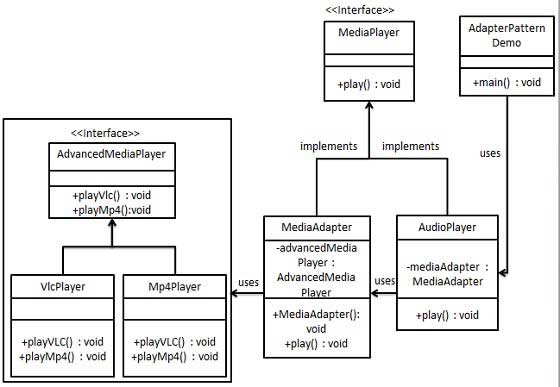

# 设计模式

## 一、工厂模式

### 介绍

**意图：**定义一个创建对象的接口，让其子类自己决定实例化哪一个工厂类，工厂模式使其创建过程延迟到子类进行。

**主要解决：**主要解决接口选择的问题。

**何时使用：**我们明确地计划不同条件下创建不同实例时。

**如何解决：**让其子类实现工厂接口，返回的也是一个抽象的产品。

**关键代码：**创建过程在其子类执行。

**应用实例：** 

- 您需要一辆汽车，可以直接从工厂里面提货，而不用去管这辆汽车是怎么做出来的，以及这个汽车里面的具体实现。
- Hibernate 换数据库只需换方言和驱动就可以。

**优点：** 

- 一个调用者想创建一个对象，只要知道其名称就可以了。
-  扩展性高，如果想增加一个产品，只要扩展一个工厂类就可以。 3、屏蔽产品的具体实现，调用者只关心产品的接口。

**缺点：**

- 每次增加一个产品时，都需要增加一个具体类和对象实现工厂，使得系统中类的个数成倍增加，在一定程度上增加了系统的复杂度，同时也增加了系统具体类的依赖。这并不是什么好事。

**使用场景：** 

- 日志记录器：记录可能记录到本地硬盘、系统事件、远程服务器等，用户可以选择记录日志到什么地方。
-  数据库访问，当用户不知道最后系统采用哪一类数据库，以及数据库可能有变化时。
-  设计一个连接服务器的框架，需要三个协议，"POP3"、"IMAP"、"HTTP"，可以把这三个作为产品类，共同实现一个接口。

**注意事项：**

- 作为一种创建类模式，在任何需要生成复杂对象的地方，都可以使用工厂方法模式。有一点需要注意的地方就是复杂对象适合使用工厂模式，而简单对象，特别是只需要通过 new 就可以完成创建的对象，无需使用工厂模式。如果使用工厂模式，就需要引入一个工厂类，会增加系统的复杂度。

### 实现


```java
//步骤一，创建一个接口 Shape.java
public interface Shape {
   void draw();
}
//------------------------------------------------------------------------//
//步骤二，创建实现接口的实体类
//Rectangle.java
public class Rectangle implements Shape {
   @Override
   public void draw() {
      System.out.println("Inside Rectangle::draw() method.");
   }
}
//Square.java
public class Square implements Shape{
    @Override
    public void draw(){
       System.out.println("Inside Square::draw() method.");
    }
}
//Circle.java
public class Circle implements Shape {
   @Override
   public void draw() {
      System.out.println("Inside Circle::draw() method.");
   }
}
//------------------------------------------------------------------------//
//步骤三，创建一个工厂，生成基于给定实体类的对象
//ShapeFactory.java
public class ShapeFactory {
   //使用 getShape 方法获取形状类型的对象
   public Shape getShape(String shapeType){
      if(shapeType == null){
         return null;
      }        
      if(shapeType.equalsIgnoreCase("CIRCLE")){
         return new Circle();
      } else if(shapeType.equalsIgnoreCase("RECTANGLE")){
         return new Rectangle();
      } else if(shapeType.equalsIgnoreCase("SQUARE")){
         return new Square();
      }
      return null;
   }
}
//------------------------------------------------------------------------//
//步骤四，使用该工厂，通过传递类型信息来获取实体类的对象
//FactoryPatternDemo.java
public class FactoryPatternDemo {
   public static void main(String[] args) {
      ShapeFactory shapeFactory = new ShapeFactory();
      //获取 Circle 的对象，并调用它的 draw 方法
      Shape shape1 = shapeFactory.getShape("CIRCLE");
      //调用 Circle 的 draw 方法
      shape1.draw();
      //获取 Rectangle 的对象，并调用它的 draw 方法
      Shape shape2 = shapeFactory.getShape("RECTANGLE");
      //调用 Rectangle 的 draw 方法
      shape2.draw();
      //获取 Square 的对象，并调用它的 draw 方法
      Shape shape3 = shapeFactory.getShape("SQUARE");
      //调用 Square 的 draw 方法
      shape3.draw();
   }
}
//------------------------------------------------------------------------//
//**输出：
*Inside Circle::draw() method.
*Inside Rectangle::draw() method.
*Inside Square::draw() method.
*//
```

## 二、建造者模式

### 介绍

**意图：**将一个复杂的构建与其表示相分离，使得同样的构建过程可以创建不同的表示。

**主要解决：**主要解决在软件系统中，有时候面临着"一个复杂对象"的创建工作，其通常由各个部分的子对象用一定的算法构成；由于需求的变化，这个复杂对象的各个部分经常面临着剧烈的变化，但是将它们组合在一起的算法却相对稳定。

**何时使用：**一些基本部件不会变，而其组合经常变化的时候。

**如何解决：**将变与不变分离开。

**关键代码：**建造者：创建和提供实例，导演：管理建造出来的实例的依赖关系。

**应用实例：** 

- 去肯德基，汉堡、可乐、薯条、炸鸡翅等是不变的，而其组合是经常变化的，生成出所谓的"套餐"。 
- JAVA 中的 StringBuilder。

**优点：**

-  建造者独立，易扩展。 
- 便于控制细节风险。

**缺点：**

-  产品必须有共同点，范围有限制。 
- 如内部变化复杂，会有很多的建造类。

**使用场景：**

-  需要生成的对象具有复杂的内部结构。 
- 需要生成的对象内部属性本身相互依赖。

**注意事项：**与工厂模式的区别是：建造者模式更加关注与零件装配的顺序。

### 实现


```java
//步骤一，创建一个表示食物的条目和食物包装的接口
//item.java
public interface Item{
    public String name();
    public Packing packing();
    public float price();
}
//Packing.java
public interface Packing{
    public String pack();
}
//-----------------------------------------------------------------------//
//步骤二
//创建实现packing接口的实体类
// Wrapper.java
public class Wrapper implements Packing{
    @Override
    public String pack(){
        return "Wrapper";
    }
}
//Bottle.java
public class Bottle implements Packing{
    @Override 
    public String pack(){
        return "Bottle";
    }
}
//-----------------------------------------------------------------------//
//步骤三，创建实现 Item 接口的抽象类，该类提供了默认的功能
//Burger.java
public abstract class Burger implements Item {
   @Override
   public Packing packing() {
      return new Wrapper();
   }
   @Override
   public abstract float price();
}
//ColdDrink.java 
public abstract class ColdDrink implements Item {
    @Override
    public Packing packing() {
       return new Bottle();
    }
    @Override
    public abstract float price();
}
//-----------------------------------------------------------------------//
//步骤四，创建扩展了 Burger 和 ColdDrink 的实体类
//VegBurger.java
public class VegBurger extends Burger {
   @Override
   public float price() {
      return 25.0f;
   }
   @Override
   public String name() {
      return "Veg Burger";
   }
}
//ChickenBurger.java
public class ChickenBurger extends Burger {
   @Override
   public float price() {
      return 50.5f;
   }
   @Override
   public String name() {
      return "Chicken Burger";
   }
}
//Coke.java 
public class Coke extends ColdDrink {
   @Override
   public float price() {
      return 30.0f;
   }
   @Override
   public String name() {
      return "Coke";
   }
}
//Pepsi.java
public class Pepsi extends ColdDrink {
   @Override
   public float price() {
      return 35.0f;
   }
   @Override
   public String name() {
      return "Pepsi";
   }
}
//-----------------------------------------------------------------------//
//步骤五、创建一个 Meal 类，带上上面自定义的 Item 对象
//Meal.java
import java.util.ArrayList;
import java.util.List;
public class Meal {
   private List<Item> items = new ArrayList<Item>();    
   public void addItem(Item item){
      items.add(item);
   }
   public float getCost(){
      float cost = 0.0f;
      for (Item item : items) {
         cost += item.price();
      }        
      return cost;
   }
   public void showItems(){
      for (Item item : items) {
         System.out.print("Item : "+item.name());
         System.out.print(", Packing : "+item.packing().pack());
         System.out.println(", Price : "+item.price());
      }        
   }    
}
//-----------------------------------------------------------------------//
//步骤六，创建一个 MealBuilder 类，实际的 builder 类负责创建 Meal 对象
//MealBuilder.java
public class MealBuilder {
   public Meal prepareVegMeal (){
      Meal meal = new Meal();
      meal.addItem(new VegBurger());
      meal.addItem(new Coke());
      return meal;
   }   
   public Meal prepareNonVegMeal (){
      Meal meal = new Meal();
      meal.addItem(new ChickenBurger());
      meal.addItem(new Pepsi());
      return meal;
   }
}
//-----------------------------------------------------------------------//
//步骤七，BuiderPatternDemo 使用 MealBuider 来演示建造者模式（Builder Pattern）。
//BuilderPatternDemo.java
public class BuilderPatternDemo {
   public static void main(String[] args) {
      MealBuilder mealBuilder = new MealBuilder();
      Meal vegMeal = mealBuilder.prepareVegMeal();
      System.out.println("Veg Meal");
      vegMeal.showItems();
      System.out.println("Total Cost: " +vegMeal.getCost());
      Meal nonVegMeal = mealBuilder.prepareNonVegMeal();
      System.out.println("\n\nNon-Veg Meal");
      nonVegMeal.showItems();
      System.out.println("Total Cost: " +nonVegMeal.getCost());
   }
}
//-----------------------------------------------------------------------//
//步骤八，输出
Veg Meal
Item : Veg Burger, Packing : Wrapper, Price : 25.0
Item : Coke, Packing : Bottle, Price : 30.0
Total Cost: 55.0
Non-Veg Meal
Item : Chicken Burger, Packing : Wrapper, Price : 50.5
Item : Pepsi, Packing : Bottle, Price : 35.0
Total Cost: 85.5
```

## 三、适配器模式

### 介绍

**意图：**将一个类的接口转换成客户希望的另外一个接口。适配器模式使得原本由于接口不兼容而不能一起工作的那些类可以一起工作。

**主要解决：**主要解决在软件系统中，常常要将一些"现存的对象"放到新的环境中，而新环境要求的接口是现对象不能满足的。

**何时使用：** 

- 系统需要使用现有的类，而此类的接口不符合系统的需要。 
- 想要建立一个可以重复使用的类，用于与一些彼此之间没有太大关联的一些类，包括一些可能在将来引进的类一起工作，这些源类不一定有一致的接口。 
- 通过接口转换，将一个类插入另一个类系中。（比如老虎和飞禽，现在多了一个飞虎，在不增加实体的需求下，增加一个适配器，在里面包容一个虎对象，实现飞的接口。）

**如何解决：**继承或依赖（推荐）。

**关键代码：**适配器继承或依赖已有的对象，实现想要的目标接口。

**应用实例：** 

- 美国电器 110V，中国 220V，就要有一个适配器将 110V 转化为 220V。
-  JAVA JDK 1.1 提供了 Enumeration 接口，而在 1.2 中提供了 Iterator 接口，想要使用 1.2 的 JDK，则要将以前系统的 Enumeration 接口转化为 Iterator 接口，这时就需要适配器模式。 
- 在 LINUX 上运行 WINDOWS 程序。 
- JAVA 中的 jdbc。

**优点：** 

- 可以让任何两个没有关联的类一起运行。 
- 提高了类的复用。
- 增加了类的透明度。 
- 灵活性好。

**缺点：**

-  过多地使用适配器，会让系统非常零乱，不易整体进行把握。比如，明明看到调用的是 A 接口，其实内部被适配成了 B 接口的实现，一个系统如果太多出现这种情况，无异于一场灾难。因此如果不是很有必要，可以不使用适配器，而是直接对系统进行重构。
-  由于 JAVA 至多继承一个类，所以至多只能适配一个适配者类，而且目标类必须是抽象类。

**使用场景：**有动机地修改一个正常运行的系统的接口，这时应该考虑使用适配器模式。

**注意事项：**适配器不是在详细设计时添加的，而是解决正在服役的项目的问题。

### 实现

 

```java
//步骤一、为媒体播放器和更高级的媒体播放器创建接口
//MediaPlayer.java
public interface MediaPlayer{
    public void play(String audioType,String filename);
}
//AdvanceMediaPlayer.java
public interface AdvanceMediaPlayer{
    public void playVlc(String fileName);
    public void playMp4(String fileName);
}
//创建实现了 AdvanceMediaPlayer 接口的实体类
//VlcPlayer.java
public class VlcPlayer implements AdvanceMediaPlayer{
    @Override
    public void playVlc(String fileName){
        System.out.println("Playing vlc file. Name:"+fileName);
    }
    @Override
   public void playMp4(String fileName) {
      //什么也不做
   }
}
```

