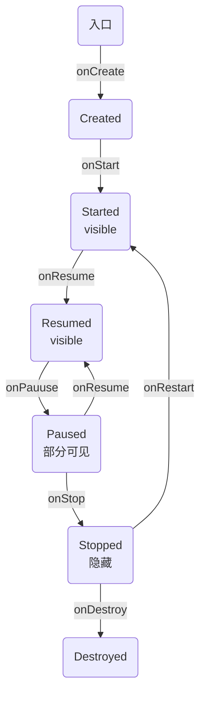

### Android 进程回收策略

**Android** 中对于内存的回收，主要依靠 **Lowmemorykiller** 来完成，是一种根据 **OOM_ADJ** 阈值级别触发相应力度的内存回收的机制

| ADJ级别                  | 取值    | 解释                                             |
| ------------------------ | ------- | ------------------------------------------------ |
| UNKNOWN_ADJ              | 16      | 将要缓存进程，无法获取确定值                     |
| CACHED_APP_MAX_ADJ       | 15      | 不可见进程的adj最大值1                           |
| CACHED_APP_MIN_ADJ       | 9       | 不可见进程最小值2                                |
| SERVICE_B_AD             | 8       | B list 中的 Service（较老，使用的可能性小）      |
| PREVIOUS_APP_ADJ         | 7       | 上一个App的进程（按返回键可能到达）              |
| HOME_APP_ADJ             | 6       | home进程                                         |
| SERVICE_ADJ              | 5       | 服务进程                                         |
| HEAVY_WEIGHT_APP_ADJ     | 4       | 后台重量级进程，system/rootdir/init.rc文件中设置 |
| ---------------          | -----   | **以上为比较容易杀死的进程（OOM_ADJ >= 4）**     |
| BACKUP_APP_ADJ           | 3       | 备份进程                                         |
| PERCEPTIBLE_APP_ADJ      | 2       | 可感知进程，比如后台音乐播放                     |
| VISIBLE_APP_ADJ          | 1       | 可见进程（visible process）                      |
| FOREDROUND_APP_ADJ       | 0       | 前台进程（foreground process）                   |
| ----------------------   | ------- | **以上为不容易被杀死的 Android 进程**            |
| PRESISTENT_SERVICE_ADJ   | -11     | 关联着系统或presistent进程                       |
| PERSISTENT_PROC_ADJ      | -12     | 系统级persistent进程 如 telephony                |
| SYSTEM_ADJ               | -16     | 系统进程                                         |
| NATIVE_ADJ               | -17     | native进程（不被系统管理）                       |
| ------------------------ | ----    | **以上为 Linux 进程**                            |

**Android**手机中进程被杀死的情况：

| 进程杀死场景               | 调用接口                  | 可能影响范围                                                 |
| -------------------------- | ------------------------- | ------------------------------------------------------------ |
| 触发系统进程管理机制       | **low memory killer**     | 从进程 **importance** 值<br />由大到小一次杀死，释放内存     |
| 被第三方应用杀死（无root） | **killBackgroundProcess** | 只能杀死 **OOM_ADJ** 为4以上进程                             |
| 被第三方应用杀死（有root） | forec-stop 或 kill        | 理论上可以杀死所有进程                                       |
| 厂商杀进程功能             | forec-stop 或 kill        | 理论上可以杀死所有进程，<br />包含 **native**                |
| 用户主动强行停止           | force-stop                | 只能杀第三方和非System进程<br />停用System进程会导致Android系统崩溃 |

王道是提高进程的优先级，减少被杀死的几率

### 提升进程优先级的方案

#### 1.利用 **Activity** 提升权限

方案设计思想：监控手机锁屏解锁事件，在屏幕锁屏时启动1个像素的 Activity，在用户解锁时将 Activity 销毁掉。注意该 Activity 需设计成用户无感知。

通过该方案，可以使进程的优先级在屏幕锁屏时间由4提升为最高优先级1。

- 适用场景：本方案主要解决第三方应用及系统管理工具在检测到锁屏事件后一段时间（一般为5分钟以内）内会杀死后台进程，已达到省电的目的问题。
- 适用版本：适用于所有的 Android 版本。

具体实现：

```java
//定义Activity，并设置像素为1
//KeepLiveActivty.java
private final static  String TAG = "keeplive";
@Override
protected void onCreate(Bundle  savedInstanceState){
    super.onCreate(saveIntanceState);
    Log.d(TAG,"LiveActivty -> onCreate");
    RefWatcher ref = FZApplication.getRefWatcher(this);
    refWatcher.watch(this);
    
    Window window = getWindow();
    window.setGravity(Gravity.LEFT | Gravity.TOP);
    windowManager.LayoutParams params = window.getAttributes();
    params.x = 0;
    params.y = 0;
    params.height = 1;
    params.width = 1;
    window .setAttributes(params);
    
    FZApplication.self().mLiveActivity = this;
}
//androidManifest 配置排除在 RecentTask 中显示
Android:excludeFromRecents = "true";
Android:exported = "false";
Android:finishOnTaskLaunch = "false";
android:theme="@style/LiveActivityStyle"//设置的透明主题
    
//activity 启动和销毁时候的控制
 
    public class KeepLiveReceiver extands BroadcastReceiver{
        @Override
        public void onReceive(Context context, Intent intent){
            String action = intent.getAction();
            
            if(action.equals(Intent.ACTION_SCREEN_OFF)){
                KeepLiveManager.getInstance().startKeepLiveActivity();
            }else if(action.equals(Intent.ACTION_USER_PRESENT)){
                KeepLiveManager.getInstance().finishKeepLiveActivty();
            }
				KeepLiveManager.getInstance().startKeepLiveActivity();            
        }
    }

```


#### 2.利用 **notification** 提升权限

方案设计思想：Android 中 Service 的优先级为4，通过 setForeground 接口可以将后台 Service 设置为前台 Service，使进程的优先级由4提升为2，从而使进程的优先级仅仅低于用户当前正在交互的进程，与可见进程优先级一致，使进程被杀死的概率大大降低。

方案实现挑战：从 Android2.3 开始调用 setForeground 将后台 Service 设置为前台 Service 时，必须在系统的通知栏发送一条通知，也就是前台 Service 与一条可见的通知时绑定在一起的。对于不需要常驻通知栏的应用来说，该方案虽好，但却是用户感知的，无法直接使用。

方案挑战应对措施：通过实现一个内部 Service，在 LiveService 和其内部 Service 中同时发送具有相同 ID 的 Notification，然后将内部 Service 结束掉。随着内部 Service 的结束，Notification 将会消失，但系统优先级依然保持为2。

具体实现：

```java
//KeepLiveSerive.java
public static class InnerService extands Service{
    @Override
    public IBinder onBind(Intent intent){
        return null;
    }
    
    @Override 
    public int onStartCommand(Intent intent,int flags,int startId){
        KeepLiveManager.getInstance().setForeground(mKeepLiveService,this);
        return super.onStartCommand(intent,flags,startId);
    }
}
/**
*提升Service的优先级为前台Service
*作用:防杀 使 Service 不容易被系统杀死
*使用范围：到最新的Android6.0
*/
public void setForeground(final Serrvice keepLiveService,final Service innerSerivce){
    final int foregroundPushId = 1;
    if(Build.VERSION.SDK_INT < BUILD.VERSION_CODES.JELLY_BEAN_MR2){
        keepLiveService.startForeground(foregroundPushId,new Notification());
    }else{
        keepLiveService.startForeground(foregroundPushId,new Notification());
        if(innerService != null){
            innerService.startForeground(foregroundPushId,new Notification());
            innerService.stopSelf();
        	}
    	}
	}
}
```

### 进程死后拉活的方案

#### 1.利用系统广播拉活

方案设计思想：在发生特定系统事件时，系统会发出响应的广播，通过在 AndroidManifest 中“静态”注册对应的广播监听器，即可在发生响应事件时拉活。

常用的用于拉活的广播事件包括：

| 广播事件     | 标识                                                         |
| ------------ | ------------------------------------------------------------ |
| 开机广播     | RECEIVE_BOOT_COMPLETED                                       |
| 网络变化     | ACCESS_NETWORK_STATE<br />CHANGE_NETWORK_STATE<br />ACCESS_WIFI_STATE<br />CHANGE_WIFI_STATE<br />ACCESS_FINE_LOCATION<br />ACCESS_LOCATION_EXTRA_COMMANDS |
| 文件挂载     | MOUNT_UNMOUNT_FILESYSTEMS                                    |
| 屏幕亮灭     | SCREEN_ON<br />SCREEN_OFF                                    |
| 屏幕解锁     | RECRIVE_USER_PRESENT                                         |
| 应用安装卸载 | PACKAGE_ADDED<br />PACKAGE_REMOVED                           |

方案适用范围：适用于全部 Android 平台。但存在如下几个缺点：

1. 广播接收器被管理软件、系统软件通过“自启管理”等功能禁用的场景无法接收到广播，从而无法自启。
2. 系统广播事件不可控，只能保证发生事件时拉活进程，但无法保证进程挂掉后立即拉活。

#### 2.利用第三方应用广播拉活

方案设计思想：该方案总的设计思想与接收系统广播类似，不同的是该方案为接收第三方 Top 应用广播。

通过反编译第三方 Top 应用，如：手机QQ、微信、支付宝、UC浏览器等，以及友盟、信鸽、个推等 SDK，找出它们外发的广播，在应用中进行监听，这样当这些应用发出广播时，就会将我们的应用拉活。

方案适用范围：该方案的有效程度除与系统广播一样的因素外，主要受如下因素限制：

1. 反编译分析过的第三方应用的多少
2. 第三方应用的广播属于应用私有，当前版本中有效的广播，在后续版本随时就可能被移除或被改为不外发。

#### 3.利用系统Service机制拉活

方案设计思想：将 Service 设置为 START_STICKY，利用系统机制在 Service 挂掉后自动拉活：

```java
@Override
public int onStartCommand(Intent intent,int flags,int startId){
    return Service.START_STIKY;
}
```

1. Service 第一次被异常杀死后会在5秒内重启，第二次被杀死会在10秒内重启，第三次会在20秒内重启，一旦在短时间内 Service 被杀死达到5次，则系统不再拉起。
2. 进程被取得 Root 权限的管理工具或系统工具通过 forestop 停止掉，无法重启。

#### 4.利用Native进程拉活

- 主要思想：利用 Linux 中的 fork 机制创建 Native 进程，在 Native 进程中监控主进程的存活，当主进程挂掉后，在 Native 进程中立即对主进程进行拉活。
- 主要原理：在 Android 中所有进程和系统组件的生命周期受 ActivityManagerService 的统一管理。而且，通过 Linux 的 fork 机制创建的进程为纯 Linux 进程，其生命周期不受 Android 的管理。
- **挑战一：在 Native 进程中如何感知主进程死亡。**

要在 Native 进程中感知主进程是否存活有两种实现方式：

1. 在 Native 进程中通过死循环或定时器，轮训判断主进程是否存活，档主进程不存活时进行拉活。该方案的很大缺点是不停的轮询执行判断逻辑，非常耗电。
2. 在主进程中创建一个监控文件，并且在主进程中持有文件锁。在拉活进程启动后申请文件锁将会被堵塞，一旦可以成功获取到锁，说明主进程挂掉，即可进行拉活。由于 Android 中的应用都运行于虚拟机之上，Java 层的文件锁与 Linux 层的文件锁是不同的，要实现该功能需要封装 Linux 层的文件锁供上层调用。

封装 Linux 文件锁的代码：

```c++
//flock.cpp
int linuxflock(JNIEnv *env,jobject obj,jstring lockFilePath){
    LOGI("flock");
    int fd = linuxgetlockfd(env,lockFilePath);
    LOGD("Lock file  fd : %d",fd);
    if(fd > 0){
        if(linuxtestflock(fd) == 0){
            LOGD("Try to lock the file");
            return flock(fd,LOCK_EX);
        }
    }
    return 1;
}
```

Native层中堵塞申请文件的部分代码

```c
//watchdog.c
void *thread_watch(void* arg){
    LOGI("jni thread_watch");
    
    int fd = 0;
    if((fd = open(mLockFilePath,O_RDWR)) == -1){
        
    }
}
```

 