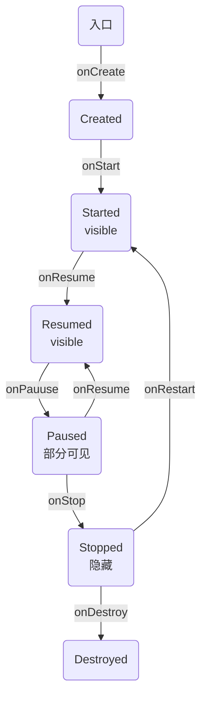

```mermaid
graph TB
A(入口) -->|onCreate|B(Created)
B-->|onStart|C(Started<br>visible)
C-->|onResume|D(Resumed<br>visible)
D-->|onPauuse|E(Paused<br>部分可见)
E-->|onResume|D
E-->|onStop|F(Stopped<br>隐藏)
F-->|onDestroy|G(Destroyed)
F-->|onRestart| C
```

