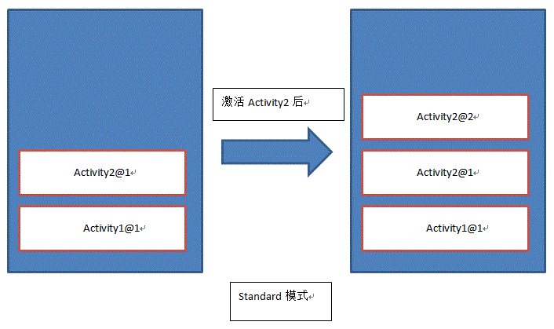
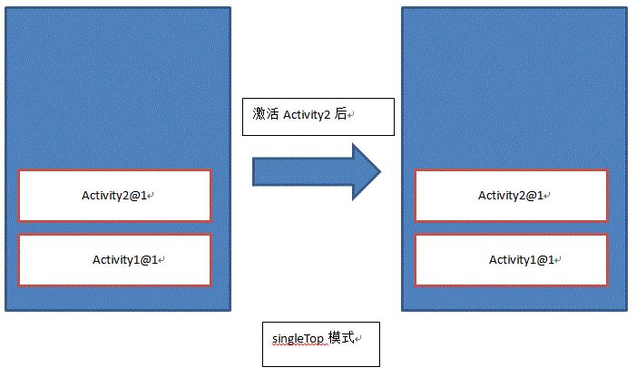
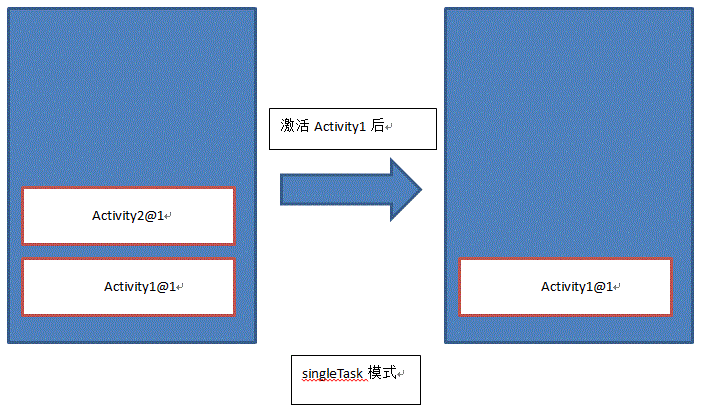

# Activity四种启动模式

## Standard

标准模式。每次启动Activity都会创建新的实例。**谁启动了这个Activity，那么这个Activity就运行在谁的Task中**。不能使用非Activity类型的`context`启动这种模式的Activity，因为这种`context`并没有Task，这个时候就可以加一个`FLAG_ACTIVITY_NEW_TASK`标记位，这个时候启动Activity实际上是以singleTask模式启动。

## SingleTop

栈顶复用模式。如果当前栈顶是要启动的Activity，那么直接引用，如果不是，则新建。在直接引用的时候会调用`onNewIntent()`方法。

适合接收通知启动的内容显示页面，或者从外界可能多次跳转到一个界面。

## SingleTask

栈内复用模式。这种模式下，只要Activity只要在一个栈内存在，那么就不会创建新的实例，会调用`onNewIntent()`方法。

  - 如果要调用的Activity在同一应用中：调用singleTask模式的Activity会清空在它之上的所有Activity。

  - 若其他应用启动该Activity：如果不存在，则建立新的Task。如果已经存在后台，那么启动后，后台的Task会一起被切换到前台。

适合作为程序入口点，例如浏览器的主界面。不管从多少个应用启动浏览器，只会启动主界面一次，其余情况都会走onNewIntent，并且会清空主界面上面的其他页面。

## SingleInstance

单实例模式。这时一种加强的singleTask，它除了具有singleTask的所有特性外，还加强了一点--该模式的Activity只能单独的位于一个Task中。

>不同Task之间，默认不能传递数据(`startActivityForResult()`)，如果一定要传递，只能使用Intent绑定。

适合需要与程序分离开的页面。例如闹铃提醒，将闹铃提醒与闹铃设置分离。
