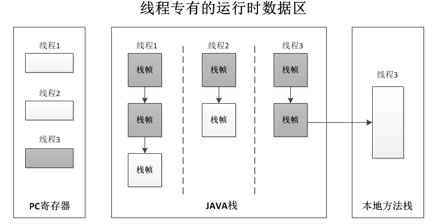
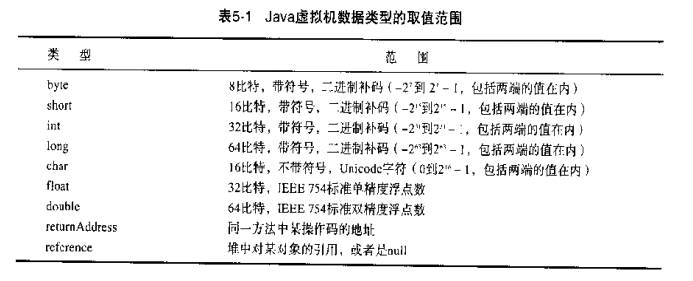
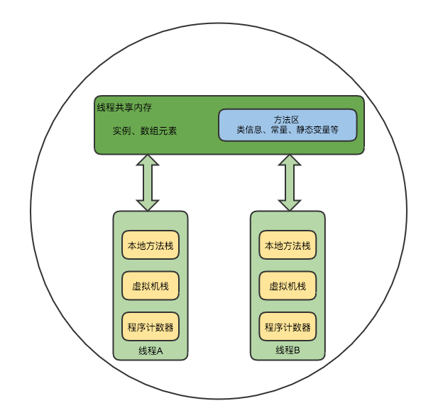

# JVM架构

## Java虚拟机简介

“Java虚拟机”可能指如下三个不同的东西

  - 抽象规范
  - 一个具体的实现
  - 一个运行中的虚拟机实例

每个Java程序都运行在某个具体的Java虚拟机实现的实例上。一个Java虚拟机的实例负责运行一个Java程序。当启动一个Java程序的时候，一个虚拟机的实例也就诞生了。当该程序关闭退出时，这个虚拟机实例也就随之消亡。

## 线程介绍

在Java虚拟机内部有两种线程：
  - `守护线程`：通常是由虚拟机自己使用，比如GC线程。但是，Java程序也可以把它自己创建的任何线程标记为守护线程（`public final void setDaemon(boolean on)`来设置，但必须在`start()`方法之前调用）。

  - `非守护线程`：main方法执行的线程，我们通常也称为用户线程。

> 只要有任何的非守护线程在运行，Java程序也会继续运行。当该程序中所有的非守护线程都终止时，虚拟机实例将自动退出（守护线程随JVM一同结束工作）。

**守护线程中不适合进行IO、计算等操作，因为守护线程是在所有的非守护线程退出后结束，这样并不能判断守护线程是否完成了相应的操作，如果非守护线程退出后，还有大量的数据没来得及读写，这将造成很严重的后果。**

>web服务器中的Servlet，容器启动时后台初始化一个服务线程，即调度线程，负责处理http请求，然后每个请求过来调度线程从线程池中取出一个工作者线程来处理该请求，从而实现并发控制的目的。

## Java虚拟机体系结构

每个Java虚拟机都有一个类装载器子系统，他根据给定的全限定名来装在类型。同样，每个Java虚拟机都有一个执行引擎，它负责执行那些包含在被装载类的方法中的指令。**当Java虚拟机运行一个程序时，它需要内存来存储很多东西，例如：字节码，从已装载的class文件中得到的其他信息，程序创建的对象，传递给方法的参数，返回值，局部变量，以及运算的中间结果等等，Java虚拟机把这些东西都组织到几个“运行时数据区”中，以便管理。**

**每个Java虚拟机实例都有一个方法区以及一个堆，** 他们是由 **该虚拟机实例中所有线程共享的。** 当虚拟机装载一个class文件时，它会从这个class文件包含的二进制数据中解析类型信息。**然后把这些类型信息放到方法区中。** 当程序运行的时候，**虚拟机会把所有该程序在运行时创建的对象都放到堆中。**

**每个新线程都会得到它自己的PC寄存器(程序计数器)以及一个Java栈。**

  - 如果线程正在执行的是一个Java方法(非Native方法)。那么PC寄存器的值将总指向下一条将被执行的指令，而 **它的Java栈则总是存储该线程中Java方法调用的转台--包括它的局部变量、被调用时传进来的参数、返回值以及运算的中间结果等等。**

  - Native方法调用的状态，则是以某种依赖于具体实现的方式存储在本地方法栈中，也可能是在寄存器或者其他某些与特定实现相关的内存区中。

**Java栈是由很多的栈帧(stack frame)或者说帧(frame)组成的，一个栈帧包含一个Java方法调用状态。** 当现场调用一个Java方法的时候，虚拟机压入一个新的栈帧到该线程的Java栈中：当该方法返回时，这个栈帧被从Java栈中弹出并抛弃

Java虚拟机没有指令寄存器，其指令集使用Java栈来存储中间数据。这样设计的原因是为了保持Java虚拟机的指令集尽量紧凑、同时也便于Java虚拟机在那些只有很少通用寄存器的平台上实现。另外，Java虚拟机这种基于栈的体系结构，也有助于运行时某些虚拟机实现的动态编译器和即时编译器的代码优化。

>1. 这些内存区域是私有的，任何线程都不能访问另外一个线程的PC寄存器或Java栈。
>2. 图中是一个虚拟机实例的快照，它有三个线程正在执行。线程1和线程2都正在执行Java方法，而线程3在执行Native方法。

## 数据类型

数据类型分为两种：

  - 基本类型：基本类型的变量持有原始值。
  - 引用类型：引用类型的变量持有引用值。引用值是指对某个对象的引用，而不是该对象本身。

  - 基本类型:

    - **Java语言中的所有基本类型都是Java虚拟机中的基本类型。但boolean有点特别，虽然Java虚拟机也把boolean看做基本类型，但指令集对boolean只有很有限的支持。** 当编译器把Java源码编译成字节码时，它会用int或byte来表示boolean。在Java虚拟机中false是由整数'0'表示，所有的非零整数都表示true，**涉及boolean值的操作则会用int。另外boolean数组是当做byte数组来访问的，** 但是在“堆”区，它也可以被表示为位域。
    - **Java虚拟机的基本类型的值域在任何地方都是一致的，** 比如：不管底层主机平台是什么，一个`long`在任何虚拟机中总是一个64位二进制补码表示的又复活整数。
    - Java虚拟机中有一个值在内部使用的基本类型`returnAddress`，Java程序员不能使用这个类型。**这个基本类型是用来实现Java程序中的finally子句。**

  - 引用类型：

    Java虚拟机中有三种引用类型，它们的值都是对动态创建对象的引用：

      - `类类型`：类实例(对象)的引用。
      - `接口类型`：是对实现了该接口的某个类实例的引用。
      - `数组类型`：数组对象的引用，在Java虚拟机中数组是个真正的对象。

      >还有一个特殊的引用值--NULL，它表示引用变量没有引用任何对象。

Java虚拟机规范定义了每一种数据类型的取值范围，但没有定义它们的位宽。存储这些类型的值所需的占位宽度，是由具体的虚拟机实现的设计者决定的。

## 类装载器

Java类加载器是Java运行时环境（Java Runtime Environment）的一部分，负责动态加载Java类到Java虚拟机的内存空间中。**类通常是按需加载，即第一次使用该类时才加载。** 由于有了类加载器，Java运行时系统不需要知道文件与文件系统。每个Java类必须由某个类加载器装入到内存。

类装载器子系统涉及Java虚拟机的其他几个组成部分，以及几个来自`java.lang`库的类。比如，用户自定义的类装载器只是普通的Java对象，它的类必须派生自`java.lang.ClassLoader`。`ClassLoader`中定义的方法为程序提供了访问类装载器机制的接口。此外，对于每个被装载的类型，Java虚拟机都会为他创建一个`java.lang.Class`类的实例来代表该类型。和所有其他对象一样，用户自定义的类装载器以及`Class`类的实例都放在内存中的堆区，而装载的类型信息都位于方法区。

类装载器子系统除了要定位和导入二进制class文件外，还必须负责验证被导入类的正确性，为变量分配初始化内存，以及帮助解析符号引用。这些动作必须严格按一下顺序完成：

  1. 装载--查找并装载类型的二进制数据。
  2. 链接--执行验证、准备以及解析(可选)
    - 验证  确保被导入类型的正确性
    - 准备  为类变量分配内存，并将其初始化为默认值。
    - 解析  把类型中的符号引用转换为直接引用。
  3. 初始化--把类变量初始化为正确的初始值。

## 方法法区

**在Java虚拟机中，关于被装载类型的信息存储在逻辑上一个被称为方法区的内存中。** 当虚拟机装载某个类型市，它使用类装载器定位相应的`class`文件，然后读入这个`class`文件--一个线性二进制数据流，然后把他传输到虚拟机中。紧接着虚拟机提取其中的类型信息，并将这些信息存储到方法区。该类型的类(静态)变量同样也是存储在方法区内。

>当虚拟机运行Java程序时，它会查找使用存储在方法区中的类型信息。

**由于所有线程都共享方法区，因此他们对方法区书记的访问必须设计为线程安全的。** 方法区的大小不必是固定的，虚拟机可以根据应用需要动态调整。同样，方法区也不必是连续的，方法区可以在一个堆中自由分配。方法区也可以被垃圾收集--这里涉及到类的卸载。

方法区中包含的信息：

  1. `类型信息`：对每个装载的类型，虚拟机都会在方法区存储一下信息
    - 这个类型的全限定名
    - 这个类型的直接父类的全限定名
    - 这个类型是类类型还是接口类型
    - 这个类型的访问修饰符
    - 任何直接父接口的全限定名的有序列表
  2. `常量池`：虚拟机必须为每个被装载的类型维护一个常量池。常量池就是该类型所用常量的一个有序集合，包直接常量(string,integer...)和对其他类型、字段和方法的符号引用。池中的数据项通过索引访问。
  3. `字段信息`。
  4. `方法信息`。
  5. `类变量`。
  6. `编译时常量`。
  7. 指向`ClassLoader`类的引用。
  8. 指向`Class`类的引用。
  9. `方法表`：为了提高访问效率，虚拟机对每个装载的非抽象类都生成一个方法表，把它作为类信息的一部分，它主要存储了所有它的实例可能被调用的实例方法的直接引用，包括从父类继承的 *实例* 方法。
