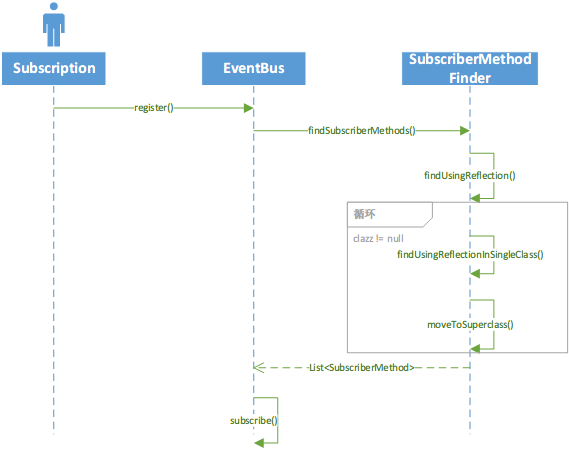

# EventBus

### EventBus消息接收者注册流程

### EventBus Post流程

`postToSubscription()`在这个方法中，实现了从发布者到调用者的调用过程。在这里有很重要的几个分支：

  - **Main**：在主线程中执行。
    - 如果当前线程(post线程)是主线程，则直接invoke；
    - 如果当前线程(post线程)不是主线程，则将消息放入一个`HandlerPosterPendingPostQueue`的消息队列中，然后通过主线程的Handler发送消息，最好在`Handler.HandleMessage`中调用`EventBus.invokeSubscriber`，来让订阅方法在主线程中执行。

  - **BackGround**：在后台线程执行。
    - 如果当前线程(post线程)不是主线程，则直接invoke；
    - 如果当前线程(post线程)是主线程，则将消息放入`BackgroundPoster.PendingPostQueue`的消息队列中，由于该Poster实现了接口`Runable`，于是将该Poster放入线程池中执行，在线程中调用`EventBus.invokeSubscriber`。

  - **Async**：异步执行。将消息放入`AsyncPoster`中，然后将该Poster放入线程池并调用`EventBus.invokeSubscriber`。
