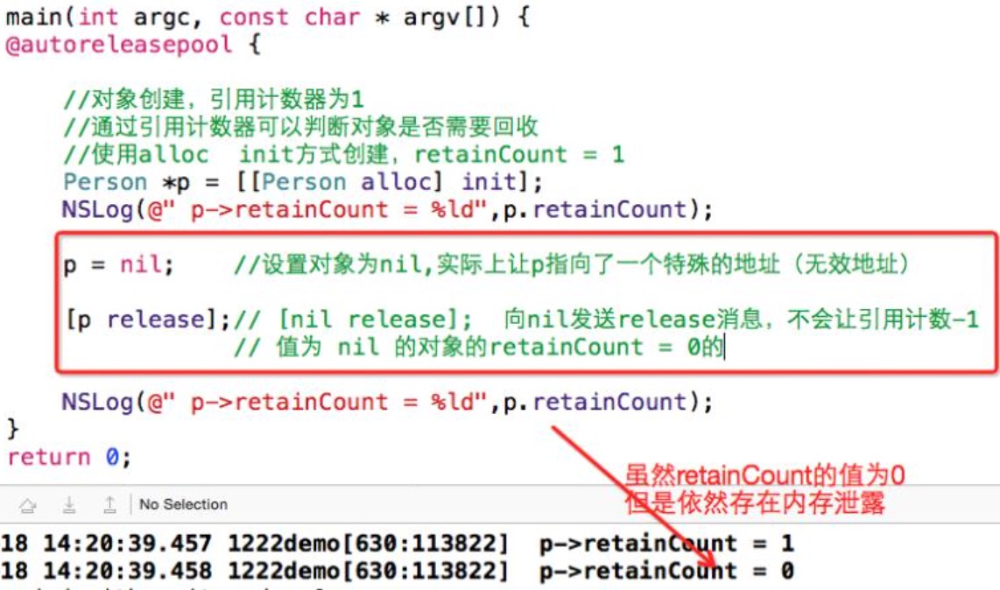
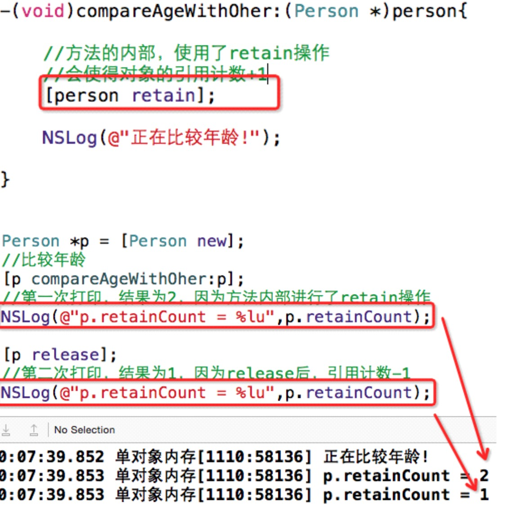

##6.【掌握】单个对象内存管理
#### 1、【掌握】避免使用僵尸对象的方法
 * 为了防止不小心调用了僵尸对象,可以将对象赋值nil(对象的空值)
    * 给空指针发消息是没有任何反应的。
    ```objc
      Student *s = [[Student alloc] init];

      [s release];

      s = nil;

      // 打印对象的引用计数器值
    NSLog(@"%lu",[s retainCount]);
    ```

#### 2、【掌握】对象的内存泄露
* 1.retain和release的个数不匹配，导致内存泄露。

* 2.对象使用的过程中被赋值了nil,导致内存泄露


* 3.在函数或者方法中不当的使用retain 或者 release 造成的问题

