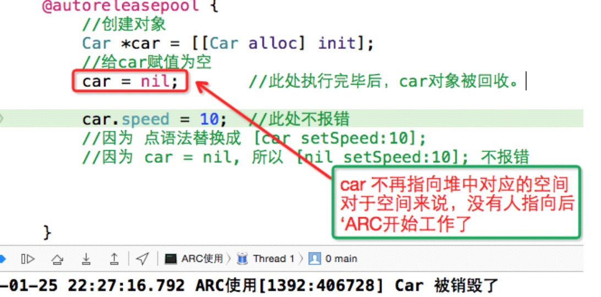
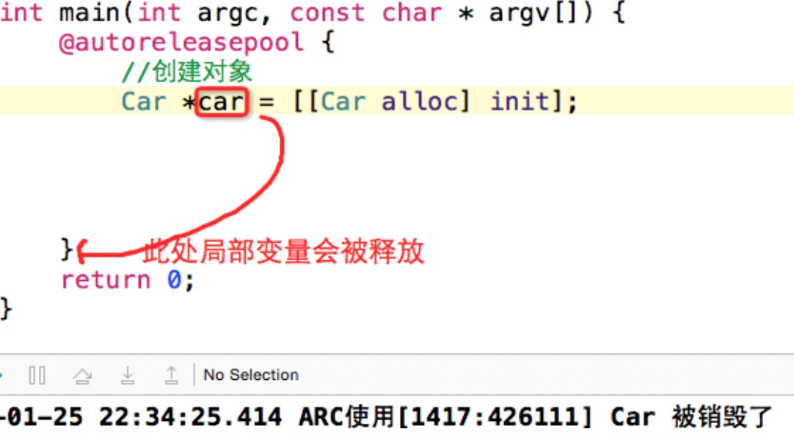
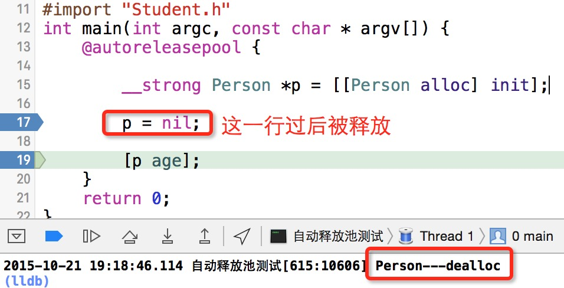
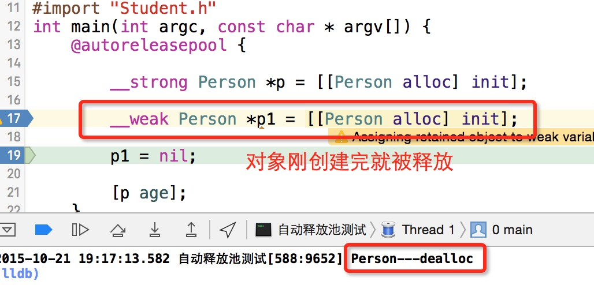
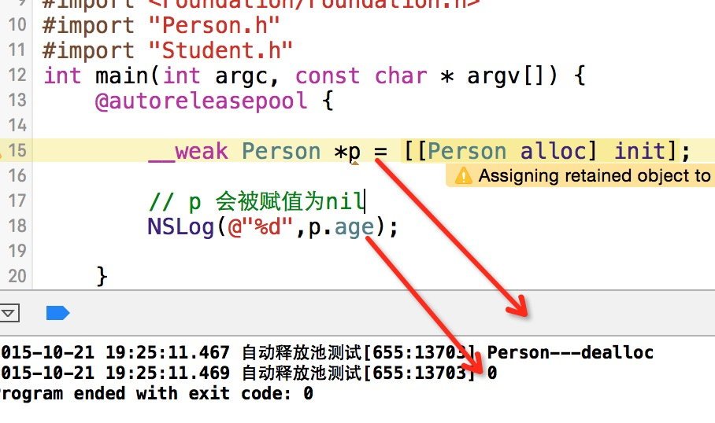

##6、【掌握】ARC下单对象内存管理
##### 1、ARC工作原理详述
* ARC是Objective-C编译器的特性,而不是运行时特性或者垃圾回收机制,ARC所做的只不过是在代码编译时为你自动在合适的位置插入release或autorelease
#####ARC的判断准则:
* 只要没有强指针指向对象,对象就会被释放。
* 注意:当使用ARC的时候,暂时忘记“引用计数器”,因为判断标准变了。

* car 不赋值nil为什么也能被释放?

* 2、强弱指针
 * 强指针：
     * 默认所有的指针变量都是强指针。
     * 被__strong修饰的指针。

 * 弱指针：
     * 被__weak修饰的指针。

* 注意:p1是一个弱指针,所以当空间释放后,p1也被设置为了nil，所以,此时再次使用p.age即便是开启了僵尸对象检测,也不会报错的。

