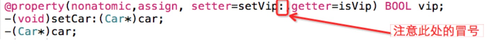
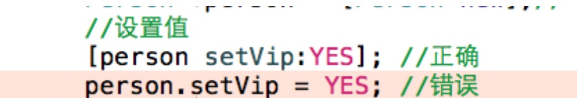

##11.【掌握】@property参数（二）
####1.@property 参数(二)
* 1、是否要生成set方法(若为只读属性,则不生成)
 * readonly:只读,只会生成get的声明和实现
 * readwrite:默认的,同时生成set和get的声明和实现

* 2.多线程管理(苹果在一定程度上屏蔽了多线程操作)
 * nonatomic:高性能,一般使用这个
 * atomic:低性能,默认

 * atomic是Objc使用的一种线程保护技术,基本上来讲,是防止在写未完成的时候被另外一个线程读取,造成数据错误。而这种机制是耗费系统资源的,所以在iPhone这种小型设备上,如果没有使用多线程间的通讯编程,那么nonatomic是一个非常好的选择。

* 3.set和get方法的名称
 * 修改set和get方法的名称,主要用于布尔类型。因为返回布尔类型的方法名一般以is开头,修改 名称一般用在布尔类型中的getter。

   ```objc
   控制set方法和get方法的名称
   setter ： 设置set方法的名称，一定有个冒号:
   getter ： 设置get方法的名称

   @property(nonatomic,assign, setter=abc:,getter=haha)int age

   ```
* 可以理解为：
 * [p setAge: ]------> [p abc:],
 * [p age] ---------> [p haha];
 * p.age 不会报错(内部优化)

  ```objc
@property(nonatomic,assign, setter=setVip:,getter=isVip) BOOL vip;
```


* 用法: 设置值

* 获取值


