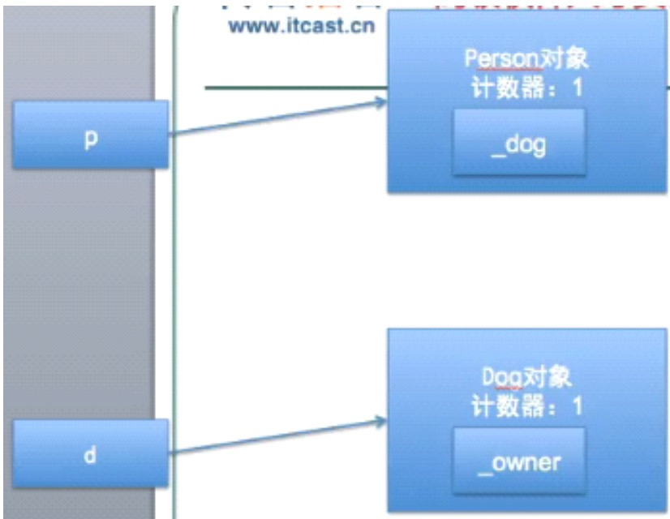
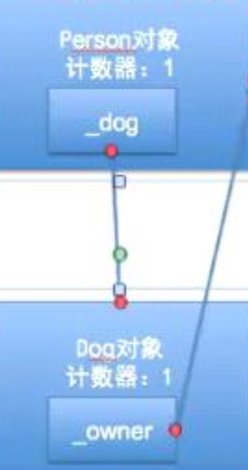

##14、【理解】循环retain问题
####循环retain的使用
* 问题：人有一只狗，狗有一个主人。

```objc
class "Dog.h";
@interface Person :NSObject
@property(nonatomic,retain)Dog *dog;
@end

@class "Person.h";
@interface Dog:NSObject
@property(nonatomic,retain)Person *owner;
@end

//main.m

//创建对象
Dog *d = [Dog new];
Person *p = [Person new];

//循环引用
p.dog = d;
d.owner = p;

//看似正确的释放代码
[d release];
[p release];
```
* 程序执行结果: p和d都没有被释放掉

* 原理分析:


```objc
p.dog  = d; //因为dog的set方法中是 进行了 [dog retain];dog2
d.owner = p;//会让p的引用计数+1  owner2

当执行了
[d release];
[p release];

dog和owner 的引用计数变成1
```
* 如图:


* __循环retain的场景__
 * 比如A对象retain了B对象,B对象retain了A对象
 * 循环retain的弊端
 * 这样会导致A对象和B对象永远无法释放

* __循环retain的解决方案__
 * 当两端互相引用时,应该一端用retain、一端用assign
