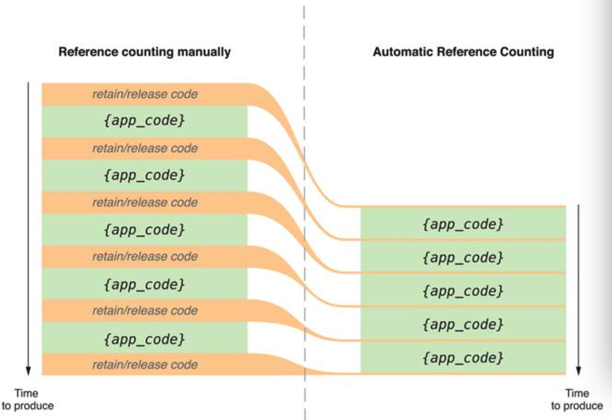

##2.【理解】内管管理的原理及分类
####1、内存管理的原理
 * 理解内存管理的原理，要清楚两个概念：
   * 1）对象的所有权
   * 2）引用计数器
* 1）对象的所有权
   * 任何对象都可能拥有一个或多个所有者。只要一个对象至少还拥有一个所有者,它就会继续存在。
   * 那么什么叫拥有者呢? 举一个例子来看：
   * 假设有一个办公室, 给大家办公，那么如果办公室里没有人, 也就是说没有人在使用这个办公室, 就可以将办公室的灯关掉。 如果有人, 才会开灯。如果只有一个人在,那么当这个人离开的时候, 就表示需要将等关掉。
  

   `那么此时就说明这个人是这间办公室的所有者.`
* 同时, 一个对象允许有多个所有者, 就好比:
* 劲舞团

* 这里有很多人，如果其中某个人退出，此房间是不会被回收的，因为还有其他人在使用该房间。

* LOL组队

* Cocoa所有权策略
 * 任何自己创建的对象都归自己所有,可以使用名字以“alloc”或“new”开头或名字中包含“copy”的方法创建对象,可以使用retain来获得一个对象的所有权。

* 2）对象的引用计数器
* 每个OC对象都有自己的引用计数器,是一个整数表示对象被引用的次数(有多少个所有者),即现在有多少东西在使用这个对象。对象刚被创建时,默认计数器值为1,当计数器的值变为0时,则对象销毁。
* 对象的结构:

* 在每个OC对象内部,都专门有8个字节的存储空间来存储引用计数器。

* 3）引用计数器的作用
 * 引用计数器是判断对象要不要回收的依据(存在一种例外:对象值为nil时,引用计数为0,但不回收空间)就是计数器是否为0,若不为0则存在。

* 4）对引用计数器的操作
 * 想要管理对象占用的内存，就要学会操作引用计数器。

 * 引用计数器的常见操作
   * retain消息：使计数器 +1（该方法返回对象本身）
   * release消息：使计数器 -1（不代表释放对象）
   * retainCount：获得对象当前的应用计数器值，输出：%ld %lu
   * `注意：release不代表销毁对象，仅仅是引用计数器-1`

* 5）对象的销毁
 * 当1个对象的应用计数器为0时，那么它将被销毁，其占用的内存被系统回收。
 * 当对象被销毁时，系统会自动向对象发送一条dealloc消息。一般会重写dealloc方法，在这里释放相关的资源，dealloc就像是对象的“临终遗言”。
 * 一旦重写了dealloc方法，就必须调用[super dealloc]，并且放在代码块的最后调用。
 * ` 注意：不能直接调用dealloc方法`。
 * 一旦对象被回收了，那么他所占用的存储空间就不再可用，坚持使用会导致程序崩溃（野指针错误）

* 注意;
 * 1) 如果对象的计数器不为0,那么在整个程序运行过程,它占用的内存就不可能被回收(除 非整个程序已经退出 )
 * 2)任何一个对象,刚生下来的时候,引用计数器都为1。(对象一旦创建好,默认引用计数器就是1)当使用alloc、new或者copy创建一个对象时,对象的引用计数器默认就是1.

#### 2、内存管理的分类
* Objective-C提供了三种内存管理方式:
 * 1.MannulReference-Counting(MRC,手动管理,在开发iOS4.1之前的版本的项目时我们要自己负责使用引用计数来管理内存,比如要手动 retain、release、autorelease 等,而在其后 的版本可以使用 ARC,让系统自己管理内存。)
 * 2.automatic reference-counting(ARC,自动引用计数,iOS4.1之后推出的)
 * 3.garbage collection(垃圾回收)。iOS不支持垃圾回收;

 * ARC作为苹果新提供的技术,苹果推荐开发者使用ARC技术来管理内存;

 * 开发中如何使用:需要理解MRC,但实际使用时尽量用ARC。
 * MRC和ARC的区别：

