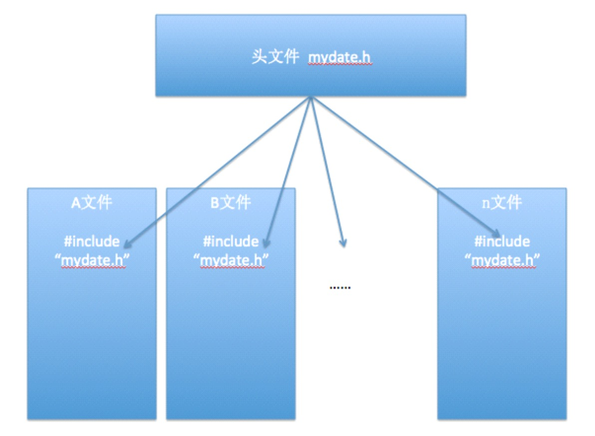
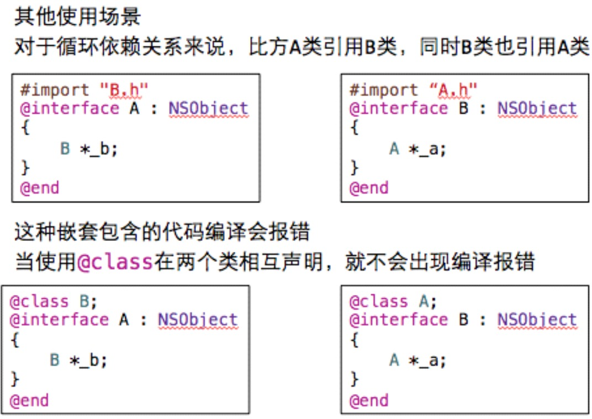

##13、【理解】@class的使用
* 场景


####1.@class的使用
* 作用
 * 可以简单地引用一个类
* 简单使用
 * @class Dog; //类的引入
 * 仅仅是告诉编译器:Dog是一个类;并不会包含Dog这个类的所有内容
* 具体使用
 * 在.h文件中使用@class引用一个类
 * 在.m文件中使用#import包含这个类的.h文件

* 如下面代码:
```objc
  A.h文件
 #import "B.h"

 @interface A : NSObject
  {
     B *b;
  }
  @end
```
* 为了简单起见:A类是引用类,B类是被引用类,这里先不考虑A类的实现文件。
* 通常引用一个类有两种办法:
 * 一种是通过#import方式引入;
 * 另一种是通过@class引入;

* 这两种的方式的区别在于:
 * 1）#import方式会包含被引用类的所有信息,包括被引用类的变量和方法;@class方式只是告诉编译器在 A.h文件中 B *b只是类的声明,具体这个类里有什么信息,这里不需要知道,等实现文件中真正要用到时,才会真正去查看B类中信息;

 * 2）使用@class方式由于只需要知道被引用类(B类)的名称就可以了,而在实现类由于要用到被引用类中的实体变量和方法,所以需要使用#import来包含被引用类的头文件;

 * 3）通过上面2点也很容易知道在编译效率上,如果有上百个头文件都#import了同一个文件,或者这些文件依次被#improt(A->B, B->C,C->D...),__一旦最开始的头文件稍有改动,后面引用到这个文件的所有类 都需要重新编译一遍,这样的效率也是可想而知的.__而相对来讲,使用@class方式就不会出现这种问题了;

 * __所以:我们实际开发中尽量在.h头文件中使用@class__
 * 4）对于循环依赖关系来说,比方A类引用B类,同时B类也引用A类,B类的代码:

* 当程序运行时,编译会报错,当使用@class在两个类相互声明,就不会出现编译报错。


* 把其中的一个头文件中的import换成@class


* 面试题：#import和@class的区别。
 * 作用上的区别
   * import会包含引用类的所有信息(内容),包括引用类的变量和方法 @class仅仅是告诉编译器有这么一个类,具体这个类里有什么信息,完全不知道。
 * 效率上的区别
   * 如果有上百个头文件都#import了同一个文件,或者这些文件依次被#import,那么一旦最开始的头文件稍有改动,后面引用到这个文件的所有类都需要重新编译一遍,编译效率非常低相对来讲,使用@class方式就不会出现这种问题了。
