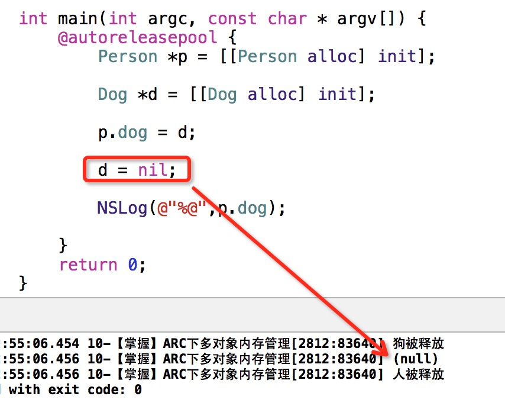

##7、【掌握】ARC下多对象内存管理
* 1个人拥有1条狗。
* 问题1：人拥有狗作为成员变量，此时使用weak，释放过程是什么样？

```objc
Person *p = [Person new];
Dog *d = [Dog new]; //设置人拥有dog
p.dog = d;
//设置狗为nil
d = nil; //此句话执行后,狗会被立即释放
NSLog(@"%@,%@",p,p.dog);
```


* 当狗赋值nil，人的狗也会消失。


* 问题2：使用strong又会是什么样？


