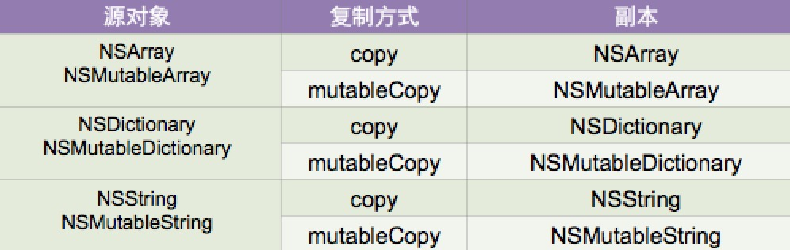

##12、【理解】copy与内存管理
#### 1、【理解】copy与内存管理
 * copy一次，retainCount +1

#### 2、【理解】深浅拷贝总结
 * 深复制（深拷贝，内容拷贝，deep copy）
   * 源对象和副本对象是不同的两个对象,源对象引用计数器不变, 副本对象计数器为1（因为是新产生的）
   * 本质是：产生了新的对象

 * 浅复制（浅拷贝，指针拷贝，shallow copy）
   * 源对象和副本对象是同一个对象，源对象（副本对象）引用计数器 + 1, 相当于做一次retain操作
   * 本质是：没有产生新的对象

#### 3、常见的复制

`只有源对象和副本对象都不可变时，才是浅复制，其它都是深复制
`

